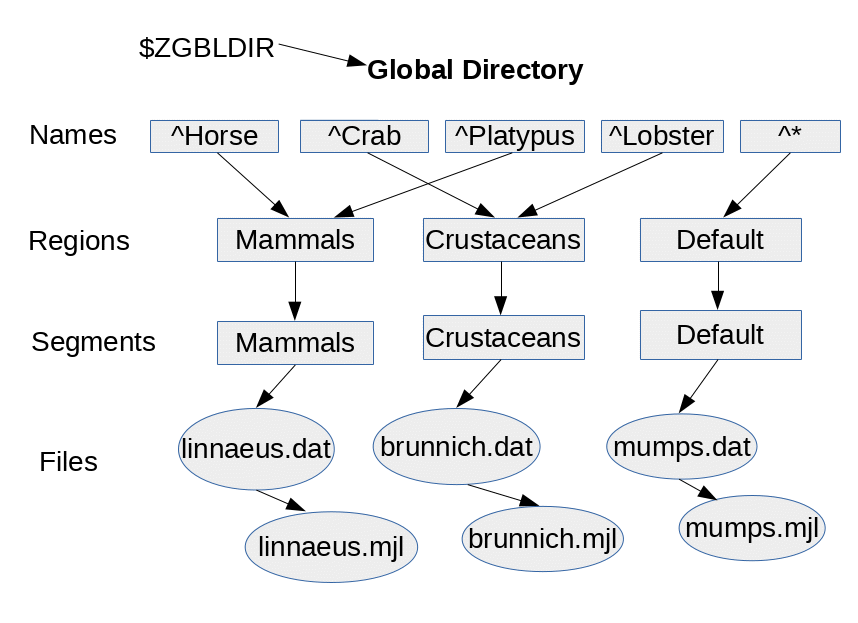

.. index::
   Acculturation Workshop

====================================
Acculturation Workshop
====================================

Welcome to the YottaDB Acculturation Workshop!

Copyright © 2017-2019 YottaDB LLC and/or its subsidiaries. All Rights Reserved.

Copyright © 2014 Fidelity National Information Services, Inc. and/or its subsidiaries. All Rights Reserved.

Permission is granted to copy, distribute and/or modify this document under the terms of the `GNU Free Documentation License <http://www.gnu.org/licenses/fdl.txt>`_, Version 1.3 or any later version published by the Free Software Foundation; with no Invariant Sections, no Front-Cover Texts and no Back-Cover Texts.

YottaDB is owned and copyrighted by `YottaDB LLC <http://yottadb.com/>`_ and is available for the GNU/Linux platforms on x86_64 and Raspberry Pi hardware under the terms of the `GNU Affero General Public License Version 3 <http://www.gnu.org/licenses/agpl.txt>`_. Source and binary can be downloaded from the `YottaDB project page at GitLab <https://gitlab.com/YottaDB/DB/YDB>`_. YottaDB® and Octo® are registered trademarks of YottaDB LLC.

GT.M is owned and copyrighted by `Fidelity Information Services, LLC <http://www.fisglobal.com/>`_, and is available for the x86_64 GNU/Linux platform under the terms of the `GNU Affero General Public License version 3 <http://www.gnu.org/licenses/agpl.txt>`_. Source and binary can be downloaded from the `GT.M project page at Source Forge <http://sourceforge.net/projects/fis-gtm>`_. GT.M™ is a trademark of Fidelity National Information Services, Inc.

The Linux kernel, GNU utilities, and all other software on the hard drive image are free / open source software (`FOSS (Free / Open Source Software) <https://en.wikipedia.org/wiki/Free_and_open-source_software>`_) and available under their respective FOSS licenses. Copyrights and trademarks of all content are hereby acknowledged as being held by their owners.

Other copyrights and trademarks are the property of their respective owners.

.. contents:: Navigation

-----------------------------------
Acculturation Workshop Expectations
-----------------------------------

The Acculturation Workshop is a hands-on “boot camp” for those interested in the configuration, administration and operation of applications on YottaDB. This file is the script (or workbook) for the workshop, consisting of the exercises below.

At the end of these exercises, you will have a basic working knowledge of the essential aspects of YottaDB Administration and Operation. While this workshop alone will not by any means make you a YottaDB expert, the basic working knowledge it will give you will help you to quickly understand the concepts explained in the user documentation and put you on the path to becoming an expert.

The workshop is not a course in programming with YottaDB. Familiarity with Linux® (or at least UNIX®) will allow you to move faster through the material, but is not absolutely required. If you have no experience whatsoever with Linux or UNIX, supplementary tutorial material on the side will increase your level of comfort.

-------------
YottaDB
-------------

`YottaDB <http://yottadb.com>`_ is a language-agnostic, `hierarchical key-value, NoSQL database <https://yottadb.com/product/how-it-works/>`_ engine developed and released by YottaDB LLC. For historical reasons a key-value relationship such as `["^Population","Belgium",13670000]` can be written as `^Population("Belgium")=13670000` and referred to as a *global variable node*, with `^Population` referred to as a *global variable*. The caret (`"^"`) at the beginning of the variable name makes it a database reference, with the node accessible to all processes accessing the database file in which the node resides and persistent beyond the lifetime of any process. [Although not relevant to the Acculturation Workshop, omitting the caret makes the variable a *local variable* which is accessible only within a process and whose lifetime is the lifetime of the process.]

As shown in the link, the nodes of a variable can also be visualized as a tree. As variable names are case-sensitive, `^Population`, `^population`, and `^POPULATION` are all different variables.

Software is released at `https://gitlab.com/YottaDB/DB/YDB <https://gitlab.com/YottaDB/DB/YDB>`_.

YottaDB is architected with the following objectives:

- Without compromise, the robustness, security and integrity of the information entrusted to it.
- Easy access to information in the database.
- Continuity of business – YottaDB has unique functionality for the deployment of mission-critical applications that must be available 24 hours a day, 365 days a year, with no down time even for planned events.
- Throughput, performance and scalability to meet the needs of the largest applications.

Free support for YottaDB is available from the community on `various mailing lists and forums <https://yottadb.com/resources/communities/>`_. Support for YottaDB with assured service levels is available from YottaDB LLC on a commercial basis.

YottaDB provides:

- Full `ACID (Atomic, Consistent, Isolated, Durable) <https://en.wikipedia.org/wiki/ACID>`_ transaction semantics
- Throughput that scales to the needs of the largest applications
- Unique functionality for creating logical multi-site configurations for mission critical applications that must always be available - including availability during upgrades that involve changes to the database schema.

At the time of writing of this edition of the Acculturation Workshop, the latest YottaDB release is r1.28, on which the text and exercises are base. If there is a newer version of YottaDB when you go through the exercises, the same commands will work, but the output messages you see may vary.

.. note::

   Although the YottaDB database is language agnostic, exercises such as those involving crash recovery and replication use M code fragments (all provided to you). The reason is that simulating a crash with an open database in a known state is relatively easy with the YottaDB direct mode, but harder with code in other languages like Go and C which do not have an interactive mode. All the code fragments are simple. The ``halt`` command exits from YottaDB direct mode to the shell. While in the real world, unplanned events like crashes happen when the database is not at a predetermined state, for the exercises, it is easier to understand YottaDB administration and operations by simulating crashes with the database in a known state.

Historical Background
---------------------

YottaDB's codebase originated in the 1980s as an implementation of the ISO standard scripting & application development language M, commonly known as `MUMPS <https://en.wikipedia.org/wiki/MUMPS>`_. While YottaDB continues to support M (we are fastidious about backward compatibility, to allow existing applications to run on newer versions of YottaDB), the codebase has been continuously used and evolved over the last 30+ years, so that YottaDB today supports APIs in multiple languages. In the Acculturation Workshop, you will see code from `Go <https://golang.org>`_, `C <https://en.wikipedia.org/wiki/C_(programming_language)>`_, `M <https://docs.yottadb.com/ProgrammersGuide/>`_, `Perl <https://www.perl.org/>`_, and `Rust <https://www.rust-lang.org/>`_ all accessing the same database. Between YottaDB and its upstream predecessor GT.M, the codebase is live at several of the largest real time core processing systems at any bank anywhere in the world, as well as increasingly in large electronic medical record systems. The implementation of YottaDB on the GNU/Linux operating system on x86_64 and ARM hardware is the basis of the FOSS stack for `VistA <http://worldvista.org/AboutVistA>`_.

------------------
User Documentation
------------------

YottaDB user documentation is organized into Manuals and Release Notes. Current YottaDB documentation is available on the `YottaDB Documentation page <https://yottadb.com/resources/documentation/>`_.

- Each software release has accompanying Release Notes to document changes between that release and its immediate predecessor, as well as release-specific information such as supported platforms. While a software release is frozen for all time, e.g., there will never be another YottaDB r1.22, release notes may be updated from time to time to correct and clarify the information within.
- Manuals are published periodically. The content within manuals is updated frequently, reflecting information that is current as of the latest software release.

---------
Packaging
---------

**The exercises in this workshop are carried out by booting guest virtual machines on your host computer**. A `virtual machine <https://en.wikipedia.org/wiki/Virtual_machine>`_ is a “computer within a computer”. A guest virtual machine can run a different operating system from that of the host computer. The host computer might itself run Linux, Windows, OS X, or another operating system and the guest can run YottaDB on Linux. "Emulation" or "virtualization" software helps you set up a guest system on a host computer. On the host computer, the disk images of the Acculturation Workshop guide look like ordinary files in the file system.

**Make sure to download the virtual machine before you begin the exercises**

.. note::

   YottaDB runs very well in containers, and indeed there are multiple Docker containers available to download, both with YottaDB and YottaDB bundled with VistA and other applications. We opted to use virtual machines for the exericses in the Acculturation Workshop because we judged that simulating and visualizing crashes, recovery, and replication would be easier with virtual machines.

-----
Linux
-----

Linux is the common name for the GNU/Linux operating system, consisting of the GNU utilities and libraries on the Linux kernel, available across the broadest range of hardware of any operating system. It is increasingly popular around the world for applications that include embedded computing (appliances); personal desktops; file, print & web servers; supercomputing; and to deploy mission critical software.

Free support for Linux is available on numerous mailing lists and electronic forums. Commercial support is widely available from multiple vendors.

The Acculturation Workshop virtual machine runs the `Debian <https://www.debian.org>`_ operating system on an x86_64 architecture.

Debian maintains a `page of books <https://www.debian.org/doc/books>`_ on Linux. The `Debian Wiki <https://wiki.debian.org/>`_ has useful reference information and having a paper copy of the `Debian Reference Card <https://www.debian.org/doc/manuals/refcard/>`_ (available in several languages) would be useful for anyone not entirely comfortable with Linux.

--------------
Virtualization
--------------

The software used for virtualization and used for the examples in this document is `QEMU <https://www.qemu.org/>`_ which is available for many popular computing platforms, including Linux, Windows, and more. Instructions are provided below for Windows and Linux hosts. On Linux hosts, `kvm <https://www.linux-kvm.org/page/Main_Page>`_ may be the preferred choice (kvm and QEMU provide a very similar user interface - kvm is a fork of QEMU focusing on the kernel module). `VirtualBox <https://www.virtualbox.org/>`_ is another popular FOSS (Free and Open Source Software) virtualization application. There is also proprietary virtualization software. Even though the examples used below are QEMU, you should be able to use the virtualization software of your choice.

Disk Formats
------------

The Acculturation Workshop is distributed as a `vmdk format <https://en.wikipedia.org/wiki/VMDK>`_ disk image file that should work with most virtualization software, both FOSS and proprietary.

Virtual Machine Download
------------------------

Download `Debian-10_yottadbworkshop12.zip <./Debian-10_yottadbworkshop12.zip>`_ and unzip it to access the disk image file Debian-10_yottadbworkshop12.vmdk.

Virtual Machine Configuration
-----------------------------

Virtualization software configures virtual machines either with their own IP addresses where the network connection (wired or wireless) of the host has multiple IP addresses, or, more commonly - using network address translation (NAT). In the latter case, the network connection of the host has one IP address that it presents to the outside world, but each virtual machine has an IP address in a subnet within the host (the host acts just like a home wifi access point / router).

You will need to configure your virtual machine for outbound and inbound network access. While outbound access should require no configuration to work with either type of virtual machine network connection, inbound network access in a NAT'd environment will require a TCP port on the host to be forwarded to the virtual machine for each port at which a service on the virtual machine needs to respond. For example, each virtual machine has a secure shell (ssh) server listening at port 22 for incoming connections, and you might choose to forward port 2222 on the host to port 22 on your virtual machine.

Refer to the user documentation for your virtualization software to set up virtual machine networking so that ``Debian-10_yottadbworkshop12.vmdk`` is the disk image of the virtual machine, and port 2222 on the host is forwarded to port 22 on the guest. For example, using qemu-system-x86_64 on a Linux host, one of the following commands should work:

::

   qemu-system-x86_64 -enable-kvm -cpu host -m 256 -net nic -net user,hostfwd=tcp::2222-:22 -hda Debian-10_yottadbworkshop12.vmdk

Using kvm on a Linux host, the following command boots the vmdk image with port 2222 on the host forwarded to port 22 on the guest for ssh sessions:

::

    kvm -enable-kvm -cpu host -m 256 -display none -net nic -net user,hostfwd=tcp::2222-:22 -hda Debian-10_yottadbworkshop12.vmdk

Control of the Keyboard & Mouse
-------------------------------

When you boot a guest virtual machine, booting it “headless” (i.e., without a console - no keyboard and mouse attached), means that the host always has control of the keyboard and mouse. If it is not headless, ownership of the keyboard or mouse may need to toggle between the host and guest. The software you use for virtualization determines how to transfer control.

Terminal Emulation
------------------

Even when running with a console, we recommend that you boot and minimize the virtual machine, and connect to your virtual machines with terminal sessions from a terminal emulator. On Windows, you can use a terminal emulator such as `putty <https://www.chiark.greenend.org.uk/~sgtatham/putty/>`_. Linux distributions and OS X include terminal emulation.

-----------
Quick Start
-----------

With a terminal emulator, initiate an ssh connection to port 2222 on localhost and login with userid ``yottadbuser`` and password ``YottaDB Rocks!`` (including a space and an exclamation point). For example, on Linux, you can use the command: ``ssh -p 2222 yottadbuser@localhost`` to connect as user yottadbuser to port 2222 on the host which is forwarded to port 22 on the guest.

::

    $ ssh -p 2222 yottadbuser@localhost
    Linux yottadbworkshop 4.19.0-6-amd64 #1 SMP Debian 4.19.67-2+deb10u1 (2019-09-20) x86_64

    The programs included with the Debian GNU/Linux system are free software;
    the exact distribution terms for each program are described in the
    individual files in /usr/share/doc/*/copyright.

    Debian GNU/Linux comes with ABSOLUTELY NO WARRANTY, to the extent
    permitted by applicable law.
    Last login: Wed Oct 30 15:07:27 2019 from 10.0.2.2
    yottadbuser@yottadbworkshop:~$ 

As newer versions of packages are likely to have been released after the Acculturation Workshop virtual machine was released, run the following command once before using the virtual machine, to update to current versions of packages, remove old versions, and reboot to use the new packages.

::

    yottadbuser@yottadbworkshop:~$ sudo apt update && sudo apt -y upgrade && sudo apt -y autoremove && sudo reboot now

You will likely be prompted for the yottadbuser password one or more times. As the command reboots the virtual machine, you will need to reconnect your ssh session.

Install YottaDB
---------------

- Get the YottaDB install script: ``wget https://gitlab.com/YottaDB/DB/YDB/raw/master/sr_unix/ydbinstall.sh``
- Make it executable: ``chmod +x ydbinstall.sh``
- Run it (omit the ``--verbose`` option if you want less output): This command installs YottaDB under ``/usr/local/lib/``:  ``sudo ./ydbinstall.sh --utf8 default --verbose``
- The script has a plethora of installation options, which you will not use in the Acculturation Workshop. You can query it to list the options with the ``--help`` option, e.g., ``./ydbinstall.sh --help``.

Run YottaDB
-----------

+++++++++++++++++++
Default Environment
+++++++++++++++++++

As YottaDB needs a working environment and several environment variables to be set correctly, the ``ydb_env_set`` script creates a working environment if one does not exist (defaulting to ``$HOME/.yottadb`` unless the environment variable ``ydb_dir`` points to another location), and sets up a default directory structure under it, with reasonable values for environment variables. You can use ``pkg-config`` to source ``ydb_env_set`` from the currently installed YottaDB release to start using YottaDB immediately. You can query YottaDB to identify the release, e.g.,

::

 yottadbuser@yottadbworkshop:~$ source $(pkg-config --variable=prefix yottadb)/ydb_env_set
 yottadbuser@yottadbworkshop:~$ yottadb -run %xcmd 'write $zyrelease,!'
 YottaDB r1.28 Linux x86_64
 yottadbuser@yottadbworkshop:~$ 

When you set up environments in YottaDB, you will set up your own scripting, but the default is a good place to start.

The ``tree`` program shows the environment sourcing ``ydb_env_set`` creates.

::

   yottadbuser@yottadbworkshop:~$ tree .yottadb/
    .yottadb
    |-- V6.3-007_x86_64 -> r1.28_x86_64
    |-- r
    `-- r1.28_x86_64
	|-- g
	|   |-- yottadb.dat
	|   |-- yottadb.gld
	|   `-- yottadb.mjl
	|-- o
	|   `-- utf8
	`-- r

    7 directories, 3 files
    yottadbuser@yottadbworkshop:~$ 

We will explore the environment in more detail below.

Using YottaDB
-------------

Now that YottaDB is installed and configured, change to the ``$ydb_dir`` directory (``$HOME/.yottadb`` in this example), and verify that the database has no nodes of the ``^hello`` global variable:

::

    yottadbuser@yottadbworkshop:~$ cd $ydb_dir
    yottadbuser@yottadbworkshop:~/.yottadb$ mupip extract -format=zwr -label="Hello" -select=hello -stdout
    %YDB-W-NOSELECT, None of the selected variables exist -- halting
    yottadbuser@yottadbworkshop:~/.yottadb$ 

+++++++++++++
Access from C
+++++++++++++

YottaDB comes with a `C API <https://docs.yottadb.com/MultiLangProgGuide/cprogram.html>`_ and all you need to use it is the `gcc` compiler, which is included in the virtual machine. Download the `sayhelloC.c <./sayhelloC.c>`_ program into the .yottadb directory, compile it and run it. Notice that it has set a node in the database (the MUPIP EXTRACT command prints database contents):

::

    yottadbuser@yottadbworkshop:~/.yottadb$ ls -l
    total 12
    lrwxrwxrwx 1 yottadbuser yottadbuser   12 Oct 24 14:37 V6.3-007_x86_64 -> r1.28_x86_64
    drwxr-xr-x 2 yottadbuser yottadbuser 4096 Oct 24 14:37 r
    drwxr-xr-x 5 yottadbuser yottadbuser 4096 Oct 24 14:37 r1.28_x86_64
    -rw-r--r-- 1 yottadbuser yottadbuser  262 Oct 30 17:17 sayhelloC.c
    yottadbuser@yottadbworkshop:~/.yottadb$ gcc $(pkg-config --libs --cflags yottadb) -o sayhelloC sayhelloC.c -lyottadb
    yottadbuser@yottadbworkshop:~/.yottadb$ ls -l
    total 32
    lrwxrwxrwx 1 yottadbuser yottadbuser    12 Oct 24 14:37 V6.3-007_x86_64 -> r1.28_x86_64
    drwxr-xr-x 2 yottadbuser yottadbuser  4096 Oct 24 14:37 r
    drwxr-xr-x 5 yottadbuser yottadbuser  4096 Oct 24 14:37 r1.28_x86_64
    -rwxr-xr-x 1 yottadbuser yottadbuser 16600 Oct 30 17:19 sayhelloC
    -rw-r--r-- 1 yottadbuser yottadbuser   262 Oct 30 17:17 sayhelloC.c
    yottadbuser@yottadbworkshop:~/.yottadb$ ./sayhelloC 
    yottadbuser@yottadbworkshop:~/.yottadb$ mupip extract -format=zwr -label="Hello" -select=hello -stdout
    Hello
    30-OCT-2019  17:21:14 ZWR
    ^hello("C")="Hello, world!"
    %YDB-I-RECORDSTAT, ^hello:        Key cnt: 1  max subsc len: 10  max rec len: 13  max node len: 27
    %YDB-I-RECORDSTAT, TOTAL:         Key cnt: 1  max subsc len: 10  max rec len: 13  max node len: 27
    yottadbuser@yottadbworkshop:~/.yottadb$ 

++++++++++++++
Access from Go
++++++++++++++

`Accessing YottaDB from Go <https://docs.yottadb.com/MultiLangProgGuide/goprogram.html>`_ requires the Go ``yottadb`` package to be downloaded and installed, to provide a YottaDB Go “wrapper”. After installing the Go wrapper, you can run a test to ensure that it was installed successfully:

::

    yottadbuser@yottadbworkshop:~/.yottadb$ go get -t lang.yottadb.com/go/yottadb
    yottadbuser@yottadbworkshop:~/.yottadb$ go test lang.yottadb.com/go/yottadb
    ok      lang.yottadb.com/go/yottadb     5.259s
    yottadbuser@yottadbworkshop:~/.yottadb$ 

Download the `sayhelloGo.go <./sayhelloGo.go>`_ program into the .yottadb directory, compile it and run it. Notice that it too has set a node in the database:

::

   yottadbuser@yottadbworkshop:~/.yottadb$ go build sayhelloGo.go 
    yottadbuser@yottadbworkshop:~/.yottadb$ ./sayhelloGo 
    yottadbuser@yottadbworkshop:~/.yottadb$ mupip extract -format=zwr -label="Hello" -select=hello -stdout
    Hello
    30-OCT-2019  17:47:58 ZWR
    ^hello("C")="Hello, world!"
    ^hello("Go")="Aloha, galaxy!"
    %YDB-I-RECORDSTAT, ^hello:        Key cnt: 2  max subsc len: 11  max rec len: 14  max node len: 27
    %YDB-I-RECORDSTAT, TOTAL:         Key cnt: 2  max subsc len: 11  max rec len: 14  max node len: 27
    yottadbuser@yottadbworkshop:~/.yottadb$

+++++++++++++
Access from M
+++++++++++++

YottaDB includes a complete language implementation for M. Download the `sayhelloM.m <./sayhelloM.m>`_ program into the .yottadb/r directory and run it (there is no need for a separate compilation step, as there was for C and Go):

::

    yottadbuser@yottadbworkshop:~/.yottadb$ ls -l r
    total 4
    -rw-r--r-- 1 yottadbuser yottadbuser 51 Oct 30 17:51 sayhelloM.m
    yottadbuser@yottadbworkshop:~/.yottadb$ yottadb -run sayhelloM
    yottadbuser@yottadbworkshop:~/.yottadb$ mupip extract -format=zwr -label="Hello" -select=hello -stdout
    Hello
    30-OCT-2019  17:52:06 ZWR
    ^hello("C")="Hello, world!"
    ^hello("Go")="Aloha, galaxy!"
    ^hello("M")="Hola, universe!"
    %YDB-I-RECORDSTAT, ^hello:        Key cnt: 3  max subsc len: 11  max rec len: 15  max node len: 27
    %YDB-I-RECORDSTAT, TOTAL:         Key cnt: 3  max subsc len: 11  max rec len: 15  max node len: 27
    yottadbuser@yottadbworkshop:~/.yottadb$ 

Notice that after running it, YottaDB has automatically compiled the source code (``sayhelloM.m``) and created a file with object code (``sayhelloM.o``) which it dynamically links and runs.

::

    yottadbuser@yottadbworkshop:~/.yottadb$ tree         
    .
    |-- V6.3-007_x86_64 -> r1.28_x86_64
    |-- r
    |   `-- sayhelloM.m
    |-- r1.28_x86_64
    |   |-- g
    |   |   |-- yottadb.dat
    |   |   |-- yottadb.gld
    |   |   `-- yottadb.mjl
    |   |-- o
    |   |   |-- sayhelloM.o
    |   |   `-- utf8
    |   `-- r
    |-- sayhelloC
    |-- sayhelloC.c
    |-- sayhelloGo
    `-- sayhelloGo.go

    7 directories, 9 files
    yottadbuser@yottadbworkshop:~/.yottadb$ 
   
----------
Journaling
----------

You should journal any database files whose integrity you care about. Conversely, you need not journal any database file that you are prepared to delete & recreate anew in the event of an unclean shutdown, like a system crash.

YottaDB uses journaling (called “logging” by some databases) to restore data integrity and provide continuity of business after an unplanned event such as a system crash. There are two switches to turn on journaling – ENABLE / DISABLE and ON / OFF. Enabling or disabling journaling requires stand alone access to the database. Turning journaling on and off can be done when the database is in use.

Exercise - Journaling
---------------------

In this exercise, you will crash your virtual machine and then recover the database. As sourcing the ``ydb_env_set`` file does all the setup that you need, and recovers the database, you will not learn the underlying operation of the database if you use it. Instead, you will create a small file that explicitly sets environment variables. The exercise has two parts, preparing the directory for the exercise, to be done once, and then crashing and recovery, which you can do as often as you want.

+++++++++++
Preparation
+++++++++++

Create a directory with a name like ``jnlex`` (for journaling exercises) or other prefered name and change to that directory. Create a file to source that sets required environment variables and convenient aliases (``nano`` and ``vi`` editors are installed on the virtual machine; you can install your preferred editor: for example to install a character-mode emacs, run ``sudo apt install emacs-nox``). Although the code fragments are M code, they are straightforward, and you can use equivalent code from other languages if you prefer.

::

   yottadbuser@yottadbworkshop:~/jnlex$ cat jnlex_env 
   export ydb_dist=$(pkg-config --variable=prefix yottadb)
   export ydb_routines=". $ydb_dist/libyottadbutil.so"
   alias yottadb=$ydb_dist/yottadb
   alias mupip=$ydb_dist/mupip
   export ydb_dir=$HOME/jnlex
   export ydb_gbldir=$ydb_dir/ydb.gld
   yottadbuser@yottadbworkshop:~/jnlex$ source jnlex_env
   yottadbuser@yottadbworkshop:~/jnlex$

Create a global directory with the Global Directory Editor (GDE) utility (see `Global Directories Point to Global Variables`_ below), and a database file. Turn on journaling for the database file.

::

   yottadbuser@yottadbworkshop:~/jnlex$ yottadb -run GDE
   %GDE-I-GDUSEDEFS, Using defaults for Global Directory 
	   /home/yottadbuser/jnlex/ydb.gld

   GDE> change -segment DEFAULT -file=$ydb_dir/ydb.dat
   GDE> exit
   %GDE-I-VERIFY, Verification OK

   %GDE-I-GDCREATE, Creating Global Directory file 
	   /home/yottadbuser/jnlex/ydb.gld
   yottadbuser@yottadbworkshop:~/jnlex$ mupip create
   %YDB-I-DBFILECREATED, Database file /home/yottadbuser/jnlex/ydb.dat created
   yottadbuser@yottadbworkshop:~/jnlex$ mupip set -journal=enable,on,before -region DEFAULT
   %YDB-I-JNLCREATE, Journal file /home/yottadbuser/jnlex/ydb.mjl created for region DEFAULT with BEFORE_IMAGES
   %YDB-I-JNLSTATE, Journaling state for region DEFAULT is now ON
   yottadbuser@yottadbworkshop:~/jnlex$ 

+++++++++++++++++++++
Crashing and Recovery
+++++++++++++++++++++

Start by cleaning out old journal files. Verify that there are no shared memory segments (if there are any, reboot the virtual machine). Then go into YottaDB's direct (interactive) mode, perform a database operation, and verify that there is now a new shared memory segment.

.. note::

   For those who are not familiar with M, ``$horolog`` is a comma separated string consisting of the number of days since December 31, 1840, and the number of seconds since midnight in the time zone of the process, and ``$zdate()`` converts ``$horolog`` format timestamps to friendlier formats.

::

   yottadbuser@yottadbworkshop:~/jnlex$ rm -f *.mjl_*
   yottadbuser@yottadbworkshop:~/jnlex$ ls -l
   total 356
   -rw-r--r-- 1 yottadbuser yottadbuser    226 Nov 12 16:39 jnlex_env
   -rw-rw-rw- 1 yottadbuser yottadbuser 679936 Nov 12 17:36 ydb.dat
   -rw-r--r-- 1 yottadbuser yottadbuser   2560 Nov 12 16:41 ydb.gld
   -rw-rw-rw- 1 yottadbuser yottadbuser  69632 Nov 12 17:36 ydb.mjl
   yottadbuser@yottadbworkshop:~/jnlex$ yottadb -dir

   YDB>zsystem "ipcs -m" ; No shared memory segments because YottaDB does not open database files until the first access

   ------ Shared Memory Segments --------
   key        shmid      owner      perms      bytes      nattch     status      

   YDB>set ^X=$zdate($horolog,"MON DD, YEAR") ; opens database file and creates a shared memory segment

   YDB>zwrite ^X ; verify that the database was updated
   ^X="NOV 13, 2019"

   YDB>zsystem "ipcs -m" ; verify that a shared memory segment now exists

   ------ Shared Memory Segments --------
   key        shmid      owner      perms      bytes      nattch     status      
   0x00000000 65536      yottadbuse 666        7630848    1                       

   YDB>

Now simulate a crash by killing the virtual machine by clicking on the “X” of the console window, or with a ``kill -9`` of the virtual machine process on the host. It is important that you kill the virtual machine with the database open by the ``yottadb`` process, because otherwise the process will shut down the database cleanly on exit and you will not simulate a crash with an open database file.

Reboot the virtual machine, change to the ``jnlex`` directory, source the ``jnlex_env`` and attempt to access the data. Note the error because the database was not cleanly shut down.

::

   yottadbuser@yottadbworkshop:~$ cd jnlex/
   yottadbuser@yottadbworkshop:~/jnlex$ source jnlex_env 
   yottadbuser@yottadbworkshop:~/jnlex$ yottadb -run %XCMD 'zwrite ^X'
   %YDB-E-REQRECOV, Error accessing database /home/yottadbuser/jnlex/ydb.dat.  Must be recovered on cluster node yottadbworkshop.
   %YDB-I-TEXT, Error with database control shmctl
   %SYSTEM-E-ENO22, Invalid argument
   yottadbuser@yottadbworkshop:~/jnlex$ 

Now recover the database, and note that the database update you made is in the database.

::

   yottadbuser@yottadbworkshop:~/jnlex$ mupip journal -recover -backward "*"
   %YDB-I-MUJNLSTAT, Initial processing started at Wed Nov 13 10:21:50 2019
   %YDB-I-MUJNLSTAT, Backward processing started at Wed Nov 13 10:21:50 2019
   %YDB-I-MUJNLSTAT, Before image applying started at Wed Nov 13 10:21:50 2019
   %YDB-I-FILERENAME, File /home/yottadbuser/jnlex/ydb.mjl is renamed to /home/yottadbuser/jnlex/ydb.mjl_2019317102151
   %YDB-I-MUJNLSTAT, Forward processing started at Wed Nov 13 10:21:51 2019
   %YDB-S-JNLSUCCESS, Show successful
   %YDB-S-JNLSUCCESS, Verify successful
   %YDB-S-JNLSUCCESS, Recover successful
   %YDB-I-MUJNLSTAT, End processing at Wed Nov 13 10:21:51 2019
   yottadbuser@yottadbworkshop:~/jnlex$ yottadb -run %XCMD 'zwrite ^X'
   ^X="NOV 13, 2019"
   yottadbuser@yottadbworkshop:~/jnlex$ 

Notice that the recovery renamed the previous journal file (from ``ydb.mjl`` to ``ydb.mjl_2019317102151`` - ``2019317102151`` is a timestamp representing 10:21:51 on the 317\ :sup:`th`\  day of 2019), and created a new journal file ``ydb.mjl``.

Practice crashing the virtual machine with an open database several times till you get the hang of recovery after a crash.

Look at the animation of journaling in action at the beginning of `Chapter 6: YottaDB Journaling <https://docs.yottadb.com/AdminOpsGuide/ydbjournal.html#journal-files>`_ in the Administration and Operations Guide.

.. note::

   Robust operation of YottaDB recovery after a crash requires robust recovery of the file system. If your file system requires an option to ensure that meta-data is written to disk only after the corresponding data is written, ensure that it is set. Also, if you are running in a virtual machine or container, ensure that it is configured so that when the guest does a “sync” to commit data to the file system, the host commits the data to the underlying persistent storage.

--------------------------------------------
Global Directories Point to Global Variables
--------------------------------------------

Global variables reside in  database files. Given a person's name, a telephone directory helps you find the person by giving you their phone number, and sometimes their address as well. Analogously, a global directory helps a YottaDB process find a global variable node bypointing it to the database file where that node resides. *While the most common, and efficient, use case has an entire global variable  residing in a database file, YottaDB permits subtrees of a global variable to reside in different database files.*

The global directory is a binary file pointed to by the intrinsic special variable ``$zgbldir`` (an *intrinsic special variable* or ISV starts with a ``$`` and names are case-insensitive). At process start-up, ``$zgbldir`` is initialized from the environment variable ``ydb_gbldir``; a process may change global directories as it executes by setting ``$zgbldir`` to different global directory files.

The GDE utility program (invoked from the shell with ``yottadb -run ^GDE``) is used to manage global directories. [Note that the input to GDE can be a text file. In a production environment, YottaDB recommends that text files be used to define database configurations, and that these text files be put under version control.]

Although there is a `GUI for GDE <https://gitlab.com/YottaDB/UI/YDBGDEGUI>`_ for the Acculturation Workshop, we will use text files as the workshop is intended to develop low-level YottaDB skills.

In YottaDB, sets of M global variables (Names or Name spaces) are mapped to Regions that define properties relating to the M global. Each Region is mapped to a Segment that defines properties relating to the file system. Consider the example in the figure below:

In this example, there are four M global variables that we would like to separate from the rest (e.g., for purposes of sharing globals between applications, or for reasons of protection – perhaps they contain special information, so that only mammalogists are to have access to globals ^Horse and ^Platypus, and only carcinologists are to have access to globals ^Crab and ^Lobster). This is accomplished by creating five name spaces (note that a name space can contain a single variable, as in this example, or a range of global variables, e.g., everything starting with ^A through ^Horse). There is always a default (``*``) name space.

One or more name spaces are mapped to a Region. All global variables in a region share a common set of M global variable properties, such as the maximum record length, whether null subscripts are permitted, etc. In this case ^Horse and ^Platypus are mapped to the region MAMMALS, whereas ^Crab and ^Lobster are mapped to the region CRUSTACEANS. The default name space * is mapped to a region called DEFAULT (while region names are case insensitive, they are frequently written in upper case).

Each region is mapped to a Segment. Just as a region defines properties pertaining to M global variables, the segment defines properties pertaining to the database file for that region, such as the file name, the initial allocation, number of global buffers, etc. The database file is just an ordinary file in the file system of the underlying operating system.

Each database file can have a single active journal file. A journal file can be linked to its predecessor to form a chain of journal files.

The intrinsic special variable ``$zgbldir`` points a YottaDB process to the global directory. ``$zgbldir`` is initialized from the environment variable ``ydb_gbldir`` at process startup, but it can be modified by the process during execution. Assuming you have sourced the ``jnlex_env`` file:

::

   yottadbuser@yottadbworkshop:~/jnlex$ yottadb -run %XCMD 'write $zgbldir,!'
   /home/yottadbuser/jnlex/ydb.gld
   yottadbuser@yottadbworkshop:~/jnlex$ 

GDE, the Global Directory Editor, is a program used to manipulate global directories. Before using it, add an extra line to the ``jnlex_env`` file to allow you to  recall the last line typed, in case you make a mistake and want to recall and edit the previous line:

::

   yottadbuser@yottadbworkshop:~/jnlex$ cat jnlex_env 
   export ydb_dist=$(pkg-config --variable=prefix yottadb)
   export ydb_routines=". $ydb_dist/libyottadbutil.so"
   alias yottadb=$ydb_dist/yottadb
   alias mupip=$ydb_dist/mupip
   export ydb_dir=$HOME/jnlex
   export ydb_gbldir=$ydb_dir/ydb.gld
   export ydb_principal_editing=EDITING
   yottadbuser@yottadbworkshop:~/jnlex$ source jnlex_env 
   yottadbuser@yottadbworkshop:~/jnlex$ yottadb -run GDE
   %GDE-I-LOADGD, Loading Global Directory file 
	   /home/yottadbuser/jnlex/ydb.gld
   %GDE-I-VERIFY, Verification OK

   GDE> 

You can use the show command to examine name spaces, regions and segments.

::

   GDE> show -name

	    *** NAMES ***
    Global                             Region
    ------------------------------------------------------------------------------
    *                                  DEFAULT
   GDE> 

In this case, there is only one name space, the default. There is also only one region, DEFAULT. Region and segment names are case insensitive, but name spaces are case sensitive, since M variable names are case sensitive.

::

   GDE> show -region

				   *** REGIONS ***
												  Std      Inst
				    Dynamic                          Def      Rec   Key Null      Null     Freeze Qdb   Epoch              LOCK
    Region                          Segment                         Coll     Size  Size Subs      Coll Jnl on Err Rndwn Taper AutoDB Stats Crit
    -------------------------------------------------------------------------------------------------------------------------------------------
    DEFAULT                         DEFAULT                            0      256    64 NEVER     Y    N   N      N     Y     N      Y     Sep
   GDE> 

Notice the region parameters – review them in the `Region Qualfiers section of the Administration and Operations Guide <https://docs.yottadb.com/AdminOpsGuide/gde.html#region-qualifiers>`_. Since there is one region, there is also one segment, also called DEFAULT. (Although the region and segment names can be different; it is good practice to keep them the same).

::

   GDE> show -segment

				   *** SEGMENTS ***
    Segment                         File (def ext: .dat)Acc Typ Block      Alloc Exten Options
    -------------------------------------------------------------------------------------------
    DEFAULT                         $ydb_dir/ydb.dat    BG  DYN  4096        100   100 GLOB=1024
										       LOCK=  40
										       RES =   0
										       ENCR= OFF
										       MSLT=1024
										       DALL= YES
										       AIO = OFF
    GDE>

Notice how the database file is defined using the environment variable ``ydb_dir``. Using environment variables allows multiple processes to share a global directory, with different processes referring to different database files, depending on environment variable values.

.. note:: 

    The parameters in the global directory are used only by ``mupip create`` to create a new database file. At other times, the global directory is used only to map global variable names to database files. So, if you change the global directory, existing database files are not changed. If you change a parameter in a database file, unless you also change the global directory used to create the database file, the next time you create that file, it will use old parameters in the global directory.

The ``show -map`` command gives visualization of the mapping of names to database files in the global directory.

::

   GDE> show -map  

				     *** MAP ***
      -  -  -  -  -  -  -  -  -  - Names -  -  - -  -  -  -  -  -  -
    From                            Up to                            Region / Segment / File(def ext: .dat)
    --------------------------------------------------------------------------------------------------------------------------
    %                               ...                              REG = DEFAULT
								     SEG = DEFAULT
								     FILE = $ydb_dir/ydb.dat
    LOCAL LOCKS                                                      REG = DEFAULT
								     SEG = DEFAULT
								     FILE = $ydb_dir/ydb.dat
   GDE> 

Of course, this global directory is not very interesting as all global variables map to a single region. There are many reasons why one might want a multi-region database, including but not limited to:

- Database size: A single database file is limited to 992Mi [#]_ blocks, which with the common block size of 4Ki bytes, translates to a database of 3,968 Gi bytes, not including the file header. A database consists of one or more database files, and while there is a theoretical YottaDB limit on the number of database files, it is so large that all practical limits are those of the underlying storage.
- Access control: As YottaDB uses the standard user-group-world model of access control (which may be further refined by Mandatory Access Controls; see `YottaDB Security Philosophy <https://docs.yottadb.com/AdminOpsGuide/securityph.html>`_), database file ownership and permissions can be used for access control (see `Security`_ below). For example, mammalogists might have read-write access to database files that store information about mammals, while giving carcinologists read-only access, with carcinologists doing tthe reverse for database files that store information about crustaceans.
- Performance: Since the granularity of critical sections for committing updates is the database region, database "hot spots" can be reduced by configuring databases to map different global variables to different database files. Note however, that when using transaction processing, as concurrent critical sections are needed for all global variables updated in a transaction, it would improve peformance to map related globals to the same region.
- Manageability: Related information can be placed in a single database file. For example, Internet of Things (IoT) application stacks often include a cloud service that complements edge devices. Such a cloud service might be configured to map the data for each edge device in a separate database file.

.. [#]  YottaDB uses prefixes like Ki & Mi for binary prefixes, and K and M for decimal & prefixes whose bases are not specified.

Let's make the single region database a little more interesting.

Exercise - Separate Regions for Mammalogists and Carcinologists
---------------------------------------------------------------

Continue using the directory you created for the journaling exercise.

While not essential, it may be conceptually helpful to build the global directory from the bottom up – first create the segments, then the regions, and then the name spaces.

::

   GDE> add -segment MAMMALS -file_name=$ydb_dir/linnaeus.dat
   GDE> add -segment CRUSTACEANS -file_name=$ydb_dir/brunnich.dat
   GDE> show -segment

				   *** SEGMENTS ***
    Segment                         File (def ext: .dat)Acc Typ Block      Alloc Exten Options
    -------------------------------------------------------------------------------------------
    CRUSTACEANS                     $ydb_dir/brunnich.dat
							BG  DYN  4096        100   100 GLOB=1024
										       LOCK=  40
										       RES =   0
										       ENCR= OFF
										       MSLT=1024
										       DALL= YES
										       AIO = OFF
    DEFAULT                         $ydb_dir/ydb.dat    BG  DYN  4096        100   100 GLOB=1024
										       LOCK=  40
										       RES =   0
										       ENCR= OFF
										       MSLT=1024
										       DALL= YES
										       AIO = OFF
    MAMMALS                         $ydb_dir/linnaeus.dat
							BG  DYN  4096        100   100 GLOB=1024
										       LOCK=  40
										       RES =   0
										       ENCR= OFF
										       MSLT=1024
										       DALL= YES
										       AIO = OFF
   GDE> 

Then we can map the regions to the segments. Notice that even though the segment names (specified with the ``-dynamic`` qualifier) are entered in lower case, they converted to and displayed in upper case.

::

   GDE> add -region MAMMALS -dynamic=MAMMALS
   GDE> add -region CRUSTACEANS -dynamic=CRUSTACEANS
   GDE> show -region

				   *** REGIONS ***
												  Std      Inst
				    Dynamic                          Def      Rec   Key Null      Null     Freeze Qdb   Epoch              LOCK
    Region                          Segment                         Coll     Size  Size Subs      Coll Jnl on Err Rndwn Taper AutoDB Stats Crit
    -------------------------------------------------------------------------------------------------------------------------------------------
    CRUSTACEANS                     CRUSTACEANS                        0      256    64 NEVER     Y    N   N      N     Y     N      Y     Sep
    DEFAULT                         DEFAULT                            0      256    64 NEVER     Y    N   N      N     Y     N      Y     Sep
    MAMMALS                         MAMMALS                            0      256    64 NEVER     Y    N   N      N     Y     N      Y     Sep
   GDE> 

Now map the name spaces to the regions.

::

   GDE> add -name Horse -region=MAMMALS
   GDE> add -name Platypus -region=MAMMALS
   GDE> add -name Crab -region=CRUSTACEANS
   GDE> add -name Lobster -region=CRUSTACEANS
   GDE> show -name

	    *** NAMES ***
    Global                             Region
    ------------------------------------------------------------------------------
    *                                  DEFAULT
    Crab                               CRUSTACEANS
    Horse                              MAMMALS
    Lobster                            CRUSTACEANS
    Platypus                           MAMMALS
   GDE> 

You can examine the entire map, and ask GDE to perform a check for consistency.

::

   GDE> show -map 

				     *** MAP ***
      -  -  -  -  -  -  -  -  -  - Names -  -  - -  -  -  -  -  -  -
    From                            Up to                            Region / Segment / File(def ext: .dat)
    --------------------------------------------------------------------------------------------------------------------------
    %                               Crab                             REG = DEFAULT
								     SEG = DEFAULT
								     FILE = $ydb_dir/ydb.dat
    Crab                            Crab0                            REG = CRUSTACEANS
								     SEG = CRUSTACEANS
								     FILE = $ydb_dir/brunnich.dat
    Crab0                           Horse                            REG = DEFAULT
								     SEG = DEFAULT
								     FILE = $ydb_dir/ydb.dat
    Horse                           Horse0                           REG = MAMMALS
								     SEG = MAMMALS
								     FILE = $ydb_dir/linnaeus.dat
    Horse0                          Lobster                          REG = DEFAULT
								     SEG = DEFAULT
								     FILE = $ydb_dir/ydb.dat
    Lobster                         Lobster0                         REG = CRUSTACEANS
								     SEG = CRUSTACEANS
								     FILE = $ydb_dir/brunnich.dat
    Lobster0                        Platypus                         REG = DEFAULT
								     SEG = DEFAULT
								     FILE = $ydb_dir/ydb.dat
    Platypus                        Platypus0                        REG = MAMMALS
								     SEG = MAMMALS
								     FILE = $ydb_dir/linnaeus.dat
    Platypus0                       ...                              REG = DEFAULT
								     SEG = DEFAULT
								     FILE = $ydb_dir/ydb.dat
    LOCAL LOCKS                                                      REG = DEFAULT
								     SEG = DEFAULT
								     FILE = $ydb_dir/ydb.dat
   GDE>

To interpret the above, the first column is the first global variable residing in a region, and the second is the next global variable not in the region, i.e., the region is all global variables starting with the first, and up to, but not including the second.

- The entry with ``%`` in the first column and ``Crab`` in the second means all global variables starting with and including ``^%`` (the first global variable) up to, but not including ``^Crab`` are mapped to region and segment ``DEFAULT`` and the file ``$ydb_dir/ydb.dat``.
- Since ``^Crab0`` is the next global variable name after ``^Crab``, the next entry states that the global variable ``^Crab`` is mapped to region and segment ``MAMMALS`` and the file `$ydb_dir/linneaus.dat``.

Exiting GDE creates the global directory. You can then use a MUPIP CREATE command to create the database files. Notice that journal files must be separately created.

::

   GDE> exit
   %GDE-I-VERIFY, Verification OK

   %GDE-I-GDUPDATE, Updating Global Directory file 
	   /home/yottadbuser/jnlex/ydb.gld
   yottadbuser@yottadbworkshop:~/jnlex$ 

Now create database files using ``mupip create`` (notice that it creates two new database files, and tells you that one file already exists), and turn on journaling for the newly created database files

::

   yottadbuser@yottadbworkshop:~/jnlex$ mupip create
   %YDB-I-DBFILECREATED, Database file $ydb_dir/brunnich.dat created
   %YDB-E-DBOPNERR, Error opening database file /home/yottadbuser/jnlex/ydb.dat
   %SYSTEM-E-ENO17, File exists
   %YDB-I-DBFILECREATED, Database file /home/yottadbuser/jnlex/linnaeus.dat created
   %YDB-F-DBNOCRE, Not all specified database files, or their associated journal files were created
   yottadbuser@yottadbworkshop:~/jnlex$ mupip set -journal=enable,on,before -region CRUSTACEANS,MAMMALS
   %YDB-I-JNLCREATE, Journal file /home/yottadbuser/jnlex/brunnich.mjl created for region CRUSTACEANS with BEFORE_IMAGES
   %YDB-I-JNLSTATE, Journaling state for region CRUSTACEANS is now ON
   %YDB-I-JNLCREATE, Journal file /home/yottadbuser/jnlex/linnaeus.mjl created for region MAMMALS with BEFORE_IMAGES
   %YDB-I-JNLSTATE, Journaling state for region MAMMALS is now ON
   yottadbuser@yottadbworkshop:~/jnlex$ 

For production environments, we suggest that you put your GDE commands in a text file and invoke them with a heredoc or using GDE's @ command. Put the text file under version control.

Exercise - Recovering a Multi-region Database
---------------------------------------------

Recovering a multi-region database after a crash is no different than recovering a single region database.

::

   yottadbuser@yottadbworkshop:~/jnlex$ yottadb -dir

   YDB>zsystem "ipcs -m" ; ensure no shared memory segments, i.e., no open database regions

   ------ Shared Memory Segments --------
   key        shmid      owner      perms      bytes      nattch     status      

   YDB>set ^X=$zdate($horolog,"MON DD, YEAR") ; open the first database region

   YDB>zwrite ^X                                                                
   ^X="NOV 14, 2019"

   YDB>zsystem "ipcs -m" ; one shared memory segment for one open database region

   ------ Shared Memory Segments --------
   key        shmid      owner      perms      bytes      nattch     status      
   0x00000000 98304      yottadbuse 666        7630848    1                       

   YDB>set ^Horse(^X)="Shetland" ; open a second database region

   YDB>zsystem "ipcs -m" ; two open database regions is two shared memory segments

   ------ Shared Memory Segments --------
   key        shmid      owner      perms      bytes      nattch     status      
   0x00000000 98304      yottadbuse 666        7630848    1                       
   0x00000000 131073     yottadbuse 666        7630848    1                       

   YDB>set ^Crab(^X)="Horseshoe" ; open last database region    

   YDB>zsystem "ipcs -m" ; three shared memory segments                           

   ------ Shared Memory Segments --------
   key        shmid      owner      perms      bytes      nattch     status      
   0x00000000 98304      yottadbuse 666        7630848    1                       
   0x00000000 131073     yottadbuse 666        7630848    1                       
   0x00000000 163842     yottadbuse 666        7630848    1                       

   YDB>zwrite ^Crab,^Horse,^X ; show data in database
   ^Crab("NOV 14, 2019")="Horseshoe"
   ^Horse("NOV 14, 2019")="Shetland"
   ^X="NOV 14, 2019"

   YDB>

Now crash and reboot the virtual machine and again note the inability to open any database region.

::

   yottadbuser@yottadbworkshop:~/jnlex$ yottadb -dir

   YDB>zwrite ^Crab
   %YDB-E-REQRECOV, Error accessing database /home/yottadbuser/jnlex/brunnich.dat.  Must be recovered on cluster node yottadbworkshop.
   %YDB-I-TEXT, Error with database control shmctl
   %SYSTEM-E-ENO22, Invalid argument

   YDB>zwrite ^Horse
   %YDB-E-REQRECOV, Error accessing database /home/yottadbuser/jnlex/linnaeus.dat.  Must be recovered on cluster node yottadbworkshop.
   %YDB-I-TEXT, Error with database control shmctl
   %SYSTEM-E-ENO22, Invalid argument

   YDB>zwrite ^X    
   %YDB-E-REQRECOV, Error accessing database /home/yottadbuser/jnlex/ydb.dat.  Must be recovered on cluster node yottadbworkshop.
   %YDB-I-TEXT, Error with database control shmctl
   %SYSTEM-E-ENO22, Invalid argument

   YDB>halt
   yottadbuser@yottadbworkshop:~/jnlex$ 

Recover the database using exactly the same command as before, and note that it recovers three regions, and you are now able to access all three regions of the database file

::

   yottadbuser@yottadbworkshop:~/jnlex$ mupip journal -recover -backward "*"
   %YDB-I-MUJNLSTAT, Initial processing started at Thu Nov 14 15:40:47 2019
   %YDB-I-MUJNLSTAT, Backward processing started at Thu Nov 14 15:40:47 2019
   %YDB-I-MUJNLSTAT, Before image applying started at Thu Nov 14 15:40:47 2019
   %YDB-I-FILERENAME, File /home/yottadbuser/jnlex/ydb.mjl is renamed to /home/yottadbuser/jnlex/ydb.mjl_2019318154047
   %YDB-I-FILERENAME, File /home/yottadbuser/jnlex/linnaeus.mjl is renamed to /home/yottadbuser/jnlex/linnaeus.mjl_2019318154047
   %YDB-I-FILERENAME, File /home/yottadbuser/jnlex/brunnich.mjl is renamed to /home/yottadbuser/jnlex/brunnich.mjl_2019318154047
   %YDB-I-MUJNLSTAT, Forward processing started at Thu Nov 14 15:40:47 2019
   %YDB-S-JNLSUCCESS, Show successful
   %YDB-S-JNLSUCCESS, Verify successful
   %YDB-S-JNLSUCCESS, Recover successful
   %YDB-I-MUJNLSTAT, End processing at Thu Nov 14 15:40:47 2019
   yottadbuser@yottadbworkshop:~/jnlex$ yottadb -dir

   YDB>zwrite ^Crab
   ^Crab("NOV 14, 2019")="Horseshoe"

   YDB>zwrite ^Horse
   ^Horse("NOV 14, 2019")="Shetland"

   YDB>zwrite ^X
   ^X="NOV 14, 2019"

   YDB>halt
   yottadbuser@yottadbworkshop:~/jnlex$

--------------------------
No Daemon to Start or Stop
--------------------------

YottaDB has no special startup or shut down. The first process to open a database file sets up all the shared memory segment and control structures needed for database operation. The last one out cleans up and releases the shared memory. There is no daemon that needs to run with elevated privileges or can be a single point of failure, a performance bottleneck or a potential security vulnerability.

Upon bringing the system back up from a crash or unclean shutdown (shutdown with open database files):

* For database regions that are not journaled, delete the database files and create new files
* Database regions that are journaled using before image journaling (the type in the exercises above) are recovered using the databases with the MUPIP JOURNAL RECOVER BACKWARD command.
* Database regions that are journaled using nobefore image journaling are recovered by restoring a backup and using the MUPIP JOURNAL RECOVER FORWARD command.
* Database regions that constitute replicated instances (see `Database Replication`_) are recovered using the MUPIP JOURNAL ROLLBACK rather than MUPIP JOURNAL RECOVER.

In all cases using journaling, the recovery point after a crash is the same - the last update in the journal files.

--------------------------
Environment Variables
--------------------------

The operation of YottaDB is controlled by a number of environment variables, `described in the YottaDB Administration and Operations Guide <https://docs.yottadb.com/AdminOpsGuide/basicops.html#environment-variables>`_.

- The most important one is ``ydb_gbldir``, discussed above, which allows a process to access a global directory, which in turn allows it access the database (global variables).

- ``ydb_dir``, defaulting to ``$HOME/.yottadb`` if not set, is used by ``ydb_env_set`` to create a directory in a standard configuration for using YottaDB. Note that a directory in a standard configuration is just a convenience, as the environment variables allow YottaDB database files and routines to be placed just about anywhere on a system
  
- Using YottaDB requires language specific environment variables
  
    - Environment variables for M programs include:
  
      - The required ``ydb_routines`` environment variable provides a search path for YottaDB to execute M programs.
      - An optional ``ydb_chset`` environment variable to determine whether a process should operate in M mode or UTF-8 mode (defaulting to M mode). To choose UTF-8 mode, this must be set before sourcing ``ydb_env_set`` and a locale that is installed on the system must also be defined, e.g.: ``export ydb_chset=UTF-8 LC_CTYPE=C.utf8``

    - Other languages will require their own environment variables.

- The ``ydb_dist`` environment variable points to the location where YottaDB is installed. If not set, YottaDB will set it so that code in the process, and child processes, can easily locate the directory where YottaDB is installed.

The file ``ydb_env_set`` that is supplied with YottaDB, and which must be sourced rather than executed, attempts to provide reasonable default values:

::

   yottadbuser@yottadbworkshop:~$ env | grep ^ydb
   yottadbuser@yottadbworkshop:~$ source $(pkg-config --variable=prefix yottadb)/ydb_env_set
   yottadbuser@yottadbworkshop:~$ env | grep ^ydb
   ydb_dist=/usr/local/lib/yottadb/r128
   ydb_log=/tmp/yottadb/r1.28_x86_64
   ydb_repl_instance=/home/yottadbuser/.yottadb/r1.28_x86_64/g/yottadb.repl
   ydb_rel=r1.28_x86_64
   ydb_routines=/home/yottadbuser/.yottadb/r1.28_x86_64/o*(/home/yottadbuser/.yottadb/r1.28_x86_64/r /home/yottadbuser/.yottadb/r) /usr/local/lib/yottadb/r128/plugin/o/ydbmwebserver.so /usr/local/lib/yottadb/r128/libyottadbutil.so
   ydb_unset_711=ydb_dir gtmdir ydb_rel gtmver ydb_dist gtm_dist ydb_repl_instance gtm_repl_instance ydb_retention gtm_retention ydb_gbldir gtmgbldir ydb_routines gtmroutines ydb_log gtm_log ydb_tmp gtm_tmp ydb_etrap gtm_etrap LD_LIBRARY_PATH ydb_sav_711_PATH
   ydb_sav_711_PATH=/usr/local/bin:/usr/bin:/bin:/usr/local/games:/usr/games
   ydb_tmp=/tmp/yottadb/r1.28_x86_64
   ydb_gbldir=/home/yottadbuser/.yottadb/r1.28_x86_64/g/yottadb.gld
   ydb_etrap=Write:(0=$STACK) "Error occurred: ",$ZStatus,!
   ydb_retention=42
   ydb_dir=/home/yottadbuser/.yottadb
   yottadbuser@yottadbworkshop:~$ 

.. note::

   ``ydb_unset_711`` and ``ydb_sav_711`` above are used when sourcing the ``ydb_env_unset`` file to restore environment variables set by sourcing ``ydb_env_set``; the 711 is the pid of the shell.

While ``ydb_env_set`` is a good resource when you initially start with YottaDB, once you get to a certain level of expertise, you may prefer to create your own scripting.

--------
Security
--------

YottaDB was designed from the very beginning to be secure. 

.. note::
   
   Absolute security does not exist in this universe. For a discussion that bridges philosophy and technology, we highly recommend `Bruce Schneier's Secrets and Lies, ISBN 0-471-25311-1 <http://www.schneier.com/book-sandl.html>`_.

A YottaDB process can access a database file only if the file ownership and permissions allow it to do so. The YottaDB security model is simple, well understood and documented. See also the `YottaDB Security Philosophy <https://docs.yottadb.com/AdminOpsGuide/securityph.html>`_.

Exercise - Access Controls with Ownership and Permissions
---------------------------------------------------------

In the following, Linux file permissions are used to allow the owner to read and write all database files, and another user to have read-only access to a database file, and no access whatsoever to another database file. Change the permissions as shown, and make updates. Note that existing data in the database is added to, as this exercise is being created on a different date from the journaling exercise. If you do both exercises on the same day, your data will be overwritten. As before, this uses the YottaDB direct mode to set the variables and then loop through the variable names dumping the values. You can write code in a programming language of your choice or you can copy and paste the M commands from here in your shell session.

::

   yottadbuser@yottadbworkshop:~/jnlex$ ls -l *.dat
   -rw-rw-rw- 1 yottadbuser yottadbuser 679936 Nov 15 12:58 brunnich.dat
   -rw-rw-rw- 1 yottadbuser yottadbuser 679936 Nov 15 12:58 linnaeus.dat
   -rw-rw-rw- 1 yottadbuser yottadbuser 679936 Nov 15 12:58 ydb.dat
   yottadbuser@yottadbworkshop:~/jnlex$ chmod go-rw brunnich.dat ; chmod go-w linnaeus.dat 
   yottadbuser@yottadbworkshop:~/jnlex$ ls -l *.dat
   -rw------- 1 yottadbuser yottadbuser 679936 Nov 15 12:58 brunnich.dat
   -rw-r--r-- 1 yottadbuser yottadbuser 679936 Nov 15 12:58 linnaeus.dat
   -rw-rw-rw- 1 yottadbuser yottadbuser 679936 Nov 15 12:58 ydb.dat
   yottadbuser@yottadbworkshop:~/jnlex$ yottadb -dir

   YDB>set ^X=$zdate($horolog,"MON DD, YEAR"),^Horse(^X)="Clydesdale",^Crab(^X)="Coconut"

   YDB>set var="^%" for  set var=$order(@var) quit:""=var  zwrite @var
   ^Crab("NOV 14, 2019")="Horseshoe"
   ^Crab("NOV 15, 2019")="Coconut"
   ^Horse("NOV 14, 2019")="Shetland"
   ^Horse("NOV 15, 2019")="Clydesdale"
   ^X="NOV 15, 2019"

   YDB>halt
   yottadbuser@yottadbworkshop:~/jnlex$ 

Create another user who is also a member of the yottadbuser group, and note that a process of that user can update ``ydb.dat`` (the database file for the DEFAULT region), can read but not update ``linneaus.dat`` (the database file for MAMMALS region), and not even read ``brunnich.dat`` (the database file for the CRUSTACEANS region).

::

   yottadbuser@yottadbworkshop:~/jnlex$ sudo useradd -g yottadbuser -s /bin/bash -m staffuser
   yottadbuser@yottadbworkshop:~/jnlex$ sudo -E su staffuser
   staffuser@yottadbworkshop:/home/yottadbuser/jnlex$ $ydb_dist/yottadb -dir # must specify $ydb_dist because alias for yottadb is not inherited

   YDB>zwrite ^X ; reading ydb.dat works
   ^X="NOV 15, 2019"

   YDB>zwrite ^Horse ; reading linnaeus.dat works
   ^Horse("NOV 14, 2019")="Shetland"
   ^Horse("NOV 15, 2019")="Clydesdale"

   YDB>zwrite ^Crab ; reading brunnich.data fails
   %YDB-E-DBFILERR, Error with database file /home/yottadbuser/jnlex/brunnich.dat
   %SYSTEM-E-ENO13, Permission denied

   YDB>set ^Horse(^X)="Appaloosa" ; updating linnaeus.dat fails
   %YDB-E-DBPRIVERR, No privilege for attempted update operation for file: /home/yottadbuser/jnlex/linnaeus.dat

   YDB>set ^X=$zdate($horolog,"MON DD, YEAR") ; updating ydb.dat works

   YDB>halt
   staffuser@yottadbworkshop:/home/yottadbuser/jnlex$ exit
   yottadbuser@yottadbworkshop:~/jnlex$ sudo userdel -r staffuser
   userdel: staffuser mail spool (/var/mail/staffuser) not found
   yottadbuser@yottadbworkshop:~/jnlex$ 

There is an installation option to restrict access to YottaDB to a group. If you use this option, only those in the specified group will be able to use YottaDB.

----------------------
Database Replication
----------------------

When an application must have the best possible continuity of business, use database replication in addition to before-image journaling to create a logical multi-site configuration. Unlike techniques like high-availability clustering that have a single point of failure (the cluster hardware and software), YottaDB replication uses “share nothing” logical multi-site instances with no single point of failure.

Furthermore, YottaDB database replication can be used to provide continuous application availability in the face of not just unplanned events, such as system crashes, but also planned events like application and system upgrades, and even most upgrades that involve application schema changes. Database replication has functionality beyond business continuity, as discussed in the `Database Replication chapter of the Administration and Operations Guide <https://docs.yottadb.com/AdminOpsGuide/dbrepl.html>`_.

The restriction of YottaDB replication today is the 20,000 kilometer distance limit on replication (since the circumference of Planet Earth is approximately 40,000 kilometers, it is difficult to place data centers more than 20,000 kilometers apart). In our example, we will simulate data centers in Santiago (33°S, 70°W), Paris (49°N, 2°E) and Melbourne (37°S, 144°E). Santiago to Paris is 11,642 kilometers, Paris to Melbourne is 16,781 kilometers, and Melbourne to Santiago is 11,269 kilometers (approximately).

Exercise - Replication
----------------------

Because replication builds on journaling, use the ``jnlex`` directory created above. Enhance the ``jnlex_env`` shell script to assign values to two more environment variables, ``ydb_repl_instance`` and ``ydb_repl_instname``. ``ydb_repl_instance`` is the name of a file where a replicated instance stores information about the state of replication and ``ydb_repl_instance`` is the name of an instance – in this case, ``dummy``, but we will change it as we create copies of the instances.

::

   yottadbuser@yottadbworkshop:~/jnlex$ cat jnlex_env 
   export ydb_dist=$(pkg-config --variable=prefix yottadb)
   export ydb_routines=". $ydb_dist/libyottadbutil.so"
   alias yottadb=$ydb_dist/yottadb
   alias mupip=$ydb_dist/mupip
   export ydb_dir=$HOME/jnlex
   export ydb_gbldir=$ydb_dir/ydb.gld
   export ydb_principal_editing=EDITING
   export ydb_repl_instance=$ydb_dir/ydb.repl
   export ydb_repl_instname=dummy
   yottadbuser@yottadbworkshop:~/jnlex$

After sourcing ``jnlex_env`` to set the environment variables first, turn on replication. This will create a new set of journal files without a link to the prior journal files, as the journal formats differ for replicated vs. unreplicated database regions.

Processes in replicated instances write updates to a shared memory segment called a Journal Pool

::

   yottadbuser@yottadbworkshop:~/jnlex$ mupip set -replication=on -region "*"
   %YDB-I-FILERENAME, File /home/yottadbuser/jnlex/brunnich.mjl is renamed to /home/yottadbuser/jnlex/brunnich.mjl_2019319150241
   %YDB-I-JNLCREATE, Journal file /home/yottadbuser/jnlex/brunnich.mjl created for region CRUSTACEANS with BEFORE_IMAGES
   %YDB-I-PREVJNLLINKCUT, Previous journal file name link set to NULL in new journal file /home/yottadbuser/jnlex/brunnich.mjl created for database file /home/yottadbuser/jnlex/brunnich.dat
   %YDB-I-JNLSTATE, Journaling state for region CRUSTACEANS is now ON
   %YDB-I-REPLSTATE, Replication state for region CRUSTACEANS is now ON
   %YDB-I-FILERENAME, File /home/yottadbuser/jnlex/linnaeus.mjl is renamed to /home/yottadbuser/jnlex/linnaeus.mjl_2019319150241
   %YDB-I-JNLCREATE, Journal file /home/yottadbuser/jnlex/linnaeus.mjl created for region MAMMALS with BEFORE_IMAGES
   %YDB-I-PREVJNLLINKCUT, Previous journal file name link set to NULL in new journal file /home/yottadbuser/jnlex/linnaeus.mjl created for database file /home/yottadbuser/jnlex/linnaeus.dat
   %YDB-I-JNLSTATE, Journaling state for region MAMMALS is now ON
   %YDB-I-REPLSTATE, Replication state for region MAMMALS is now ON
   %YDB-I-FILERENAME, File /home/yottadbuser/jnlex/ydb.mjl is renamed to /home/yottadbuser/jnlex/ydb.mjl_2019319150241
   %YDB-I-JNLCREATE, Journal file /home/yottadbuser/jnlex/ydb.mjl created for region DEFAULT with BEFORE_IMAGES
   %YDB-I-PREVJNLLINKCUT, Previous journal file name link set to NULL in new journal file /home/yottadbuser/jnlex/ydb.mjl created for database file /home/yottadbuser/jnlex/ydb.dat
   %YDB-I-JNLSTATE, Journaling state for region DEFAULT is now ON
   %YDB-I-REPLSTATE, Replication state for region DEFAULT is now ON
   yottadbuser@yottadbworkshop:~/jnlex$ 

Create new shell scripts to avoid retyping commands:

::

   yottadbuser@yottadbworkshop:~/jnlex$ cat originating_stop 
   #!/bin/sh
   $ydb_dist/mupip replicate -source -shutdown -timeout=0
   $ydb_dist/mupip rundown -region "*"
   yottadbuser@yottadbworkshop:~/jnlex$ cat replicating_start 
   #!/bin/sh
   $ydb_dist/mupip replicate -source -start -passive -instsecondary=dummy -buffsize=1048576 -log=$ydb_dir/source_dummy.log
   $ydb_dist/mupip replicate -receive -start -listenport=3000 -buffsize=1048576 -log=$ydb_dir/receive_`date +%Y%m%d:%H:%M:%S`.log
   yottadbuser@yottadbworkshop:~/jnlex$ cat replicating_stop  
   #!/bin/sh
   $ydb_dist/mupip replicate -receive -shutdown -timeout=0
   $ydb_dist/mupip replicate -source -shutdown -timeout=0
   $ydb_dist/mupip rundown -region "*"
   yottadbuser@yottadbworkshop:~/jnlex$ 

Delete the prior generation journal files, to keep the directory clean, and make the newly created shell scripts executable.

::

   yottadbuser@yottadbworkshop:~/jnlex$ chmod +x originating_stop replicating_st*
   yottadbuser@yottadbworkshop:~/jnlex$ rm *.mjl_*
   yottadbuser@yottadbworkshop:~/jnlex$ ls -l
   total 1068
   -rw------- 1 yottadbuser yottadbuser 679936 Nov 15 15:02 brunnich.dat
   -rw------- 1 yottadbuser yottadbuser  69632 Nov 15 15:02 brunnich.mjl
   -rw-r--r-- 1 yottadbuser yottadbuser    337 Nov 15 14:59 jnlex_env
   -rw-r--r-- 1 yottadbuser yottadbuser 679936 Nov 15 15:02 linnaeus.dat
   -rw-r--r-- 1 yottadbuser yottadbuser  69632 Nov 15 15:02 linnaeus.mjl
   -rwxr-xr-x 1 yottadbuser yottadbuser    102 Nov 15 15:05 originating_stop
   -rwxr-xr-x 1 yottadbuser yottadbuser    213 Nov 15 15:09 replicating_start
   -rwxr-xr-x 1 yottadbuser yottadbuser    127 Nov 15 15:10 replicating_stop
   -rw-rw-rw- 1 yottadbuser yottadbuser 679936 Nov 15 15:02 ydb.dat
   -rw-r--r-- 1 yottadbuser yottadbuser   6144 Nov 15 12:53 ydb.gld
   -rw-rw-rw- 1 yottadbuser yottadbuser  69632 Nov 15 15:02 ydb.mjl
   yottadbuser@yottadbworkshop:~/jnlex$

Shut down the Acculturation Workshop virtual machine cleanly and make three copies of the Acculturation Workshop called Paris.vmdk, Melbourne.vmdk and Santiago.vmdk. Alternatively, if your host system is short of disk space, make two copies and rename the original Debian-10_yottadbworkshop12.vmdk file.

If you are using qcow2 or vmdk disk images with QEMU/kvm on Linux, you can use a feature that allows a disk image to be created off a base image so that the base image does not change and all changes go to the new disk image. Check with your virtualization software to determine whether it supports this feature. Execute commands such as the following on the host (with the guest shut down) – depending on the version of QEMU/kvm on your PC, the exact command may vary.

::

   $ qemu-img create -f vmdk -o zeroed_grain,backing_file=Debian-10_yottadbworkshop12.vmdk Melbourne.vmdk
   Formatting 'Melbourne.vmdk', fmt=vmdk size=107374182400 backing_file=Debian-10_yottadbworkshop12.vmdk compat6=off hwversion=undefined zeroed_grain=on
   $ qemu-img create -f vmdk -o zeroed_grain,backing_file=Debian-10_yottadbworkshop12.vmdk Paris.vmdk
   Formatting 'Paris.vmdk', fmt=vmdk size=107374182400 backing_file=Debian-10_yottadbworkshop12.vmdk compat6=off hwversion=undefined zeroed_grain=on
   $ qemu-img create -f vmdk -o zeroed_grain,backing_file=Debian-10_yottadbworkshop12.vmdk Santiago.vmdk
   Formatting 'Santiago.vmdk', fmt=vmdk size=107374182400 backing_file=Debian-10_yottadbworkshop12.vmdk compat6=off hwversion=undefined zeroed_grain=on
   $ ls -l *.vmdk
   -rw-r--r-- 1 bhaskar gtc 5136187392 Nov 15 15:22 Debian-10_yottadbworkshop12.vmdk
   -rw-r--r-- 1 bhaskar gtc   13172736 Nov 15 15:24 Melbourne.vmdk
   -rw-r--r-- 1 bhaskar gtc   13172736 Nov 15 15:24 Paris.vmdk
   -rw-r--r-- 1 bhaskar gtc   13172736 Nov 15 15:24 Santiago.vmdk
   $ 

Now boot the three virtual machines. Each virtual machine will need two ports to be forwarded from the host, one for ssh access forwarded to port 22 on each virtual machine and one for replication forwarded to port 3000 on each virtual machine (i.e., a total of six ports on the host for the three instances). The examples here use host ports 2221 & 4000 for Santiago, 2222 & 5000 for Paris, and 2223 & 6000 for Melbourne. The commands given here use kvm on Linux – use the commands appropriate to virtualization on your host).

::

   kvm -enable-kvm -cpu host -m 256 -display none -net nic -net user,hostfwd=tcp::2221-:22,hostfwd=tcp::4000-:3000 -hda Santiago.vmdk &
   kvm -enable-kvm -cpu host -m 256 -display none -net nic -net user,hostfwd=tcp::2222-:22,hostfwd=tcp::5000-:3000 -hda Paris.vmdk &
   kvm -enable-kvm -cpu host -m 256 -display none -net nic -net user,hostfwd=tcp::2223-:22,hostfwd=tcp::6000-:3000 -hda Melbourne.vmdk &

To avoid confusion when you are working with multiple machines, change the name of each machine from yottadbworkshop to its location. The examples here are from the Santiago machine. You should do likewise with Paris and Melbourne. To effect a name change will need to (as root) edit the files /etc/hosts and /etc/hostname to change yottadbworkshop to santiago and then reboot.

::

   yottadbuser@santiago:~$ cat /etc/hostname                                                          
   santiago                                                                                                 
   yottadbuser@santiago:~$ cat /etc/hosts
   127.0.0.1       localhost                                                                                
   127.0.1.1       santiago                                                                                 

   # The following lines are desirable for IPv6 capable hosts
   ::1     localhost ip6-localhost ip6-loopback
   ff02::1 ip6-allnodes
   ff02::2 ip6-allrouters
   yottadbuser@santiago:~$

You may also want to change the window/tab labels on your terminal emulator on the host to show which machine each session is connected to.

To make it more realistic (and to reduce the probability of operator error) on each machine, execute ``sudo dpkg-reconfigure tzdata`` to specify the “local” time zone.

On each machine, edit ``jnlex_env`` in each instance and change the line ``export ydb_repl_instname=dummy`` and the line ``export ydb_repl_instance=$ydb_dir/ydb.repl`` to an instance file name for that instance. For example, on the Santiago instance:

::

   yottadbuser@santiago:~/jnlex$ cat jnlex_env 
   export ydb_dist=$(pkg-config --variable=prefix yottadb)
   export ydb_routines=$ydb_dist/libyottadbutil.so
   alias yottadb=$ydb_dist/yottadb
   alias mupip=$ydb_dist/mupip
   export ydb_dir=$HOME/jnlex
   export ydb_gbldir=$ydb_dir/ydb.gld
   export ydb_principal_editing=EDITING
   export ydb_repl_instance=$ydb_dir/santiago.repl
   export ydb_repl_instname=santiago
   yottadbuser@santiago:~/jnlex$ 

Then on each instance, create a replication instance file. From Santiago, for example:

::

   yottadbuser@santiago:~/jnlex$ source jnlex_env 
   yottadbuser@santiago:~/jnlex$ ls -l *.repl
   ls: cannot access '*.repl': No such file or directory
   yottadbuser@santiago:~/jnlex$ mupip replicate -instance_create
   yottadbuser@santiago:~/jnlex$ ls -l *.repl
   -rw-r--r-- 1 yottadbuser yottadbuser 2048 Nov 15 19:10 santiago.repl
   yottadbuser@santiago:~/jnlex$ 

Start the configuration with Paris as the originating primary instance, and Santiago and Melbourne in replicating secondary roles. The following commands, on the three instances can be executed in any order.

Start Santiago as a replicating instance.

::

   yottadbuser@santiago:~/jnlex$ ./replicating_start 
   Mon Nov 18 16:15:29 2019 : Initiating START of source server for secondary instance [dummy]
   yottadbuser@santiago:~/jnlex$

Start Melbourne as a replicating instance.

::

   yottadbuser@melbourne:~/jnlex$ ./replicating_start                                                         
   Tue Nov 19 06:16:05 2019 : Initiating START of source server for secondary instance [dummy]                            
   yottadbuser@melbourne:~/jnlex$

Start Paris as an originating instance replicating to Santiago and Melbourne (notice the use of ports on the host to reach the different replicating instances in the virtual machines).

::

   yottadbuser@paris:~/jnlex$ mupip replicate -source -start -instsecondary=santiago -secondary=10.0.2.2:4000 -buffsize=1048576 -log=/home/yottadbuser/jnlex/santiago_`date +%Y%m%d:%H:%M:%S`.log                                                
   Mon Nov 18 20:20:47 2019 : Initiating START of source server for secondary instance [santiago]                         
   yottadbuser@paris:~/jnlex$ mupip replicate -source -start -instsecondary=melbourne -secondary=10.0.2.2:6000 -buffsize=1048576 -log=/home/yottadbuser/jnlex/melbourne_`date +%Y%m%d:%H:%M:%S`.log                                              
   Mon Nov 18 20:21:06 2019 : Initiating START of source server for secondary instance [melbourne]                        
   yottadbuser@paris:~/jnlex$

Start a YottaDB process in Paris and perform some database updates:

::

   yottadbuser@paris:~/jnlex$ yottadb -dir

   YDB>set ^Weather("Paris",$Piece($Horolog,",",1),$Piece($Horolog,",",2))="Rainy"

   YDB>

Verify that the data is replicated at Santiago and Melbourne. Execute the following at both instances:

::

   yottadbuser@melbourne:~/jnlex$ yottadb -dir

   YDB>zwrite ^Weather
   ^Weather("Paris",65335,73603)="Rainy"

   YDB>

Bring down Melbourne (simulating system maintenance, or a network outage), but leave Santiago untouched.

::

   yottadbuser@melbourne:~/jnlex$ ./replicating_stop 
   Tue Nov 19 06:31:28 2019 : Forcing immediate shutdown
   Tue Nov 19 06:31:28 2019 : Initiating shut down
   Tue Nov 19 06:31:29 2019 : Receive pool shared memory removed
   Tue Nov 19 06:31:29 2019 : Receive pool semaphore removed
   Tue Nov 19 06:31:29 2019 : Forcing immediate shutdown
   Tue Nov 19 06:31:29 2019 : Initiating SHUTDOWN operation on source server pid [598] for secondary instance [dummy]
   Tue Nov 19 06:31:29 2019 : Waiting for upto [270] seconds for the source server to shutdown
   Tue Nov 19 06:31:30 2019 : Journal pool shared memory removed
   Tue Nov 19 06:31:30 2019 : Journal pool semaphore removed
   %YDB-I-MUFILRNDWNSUC, File /home/yottadbuser/jnlex/brunnich.dat successfully rundown
   %YDB-I-MUFILRNDWNSUC, File /home/yottadbuser/jnlex/linnaeus.dat successfully rundown
   %YDB-I-MUFILRNDWNSUC, File /home/yottadbuser/jnlex/ydb.dat successfully rundown
   yottadbuser@melbourne:~/jnlex$

Create another update in Paris.

::

   YDB>set ^Weather("Paris",$Piece($Horolog,",",1),$Piece($Horolog,",",2))="Sunny"

Verify that this is updated in Santiago.

::

   YDB>zwrite ^Weather
   ^Weather("Paris",65335,73603)="Rainy"
   ^Weather("Paris",65335,73936)="Sunny"

   YDB>

But it is not replicated in Melbourne.

::

   yottadbuser@melbourne:~/jnlex$ yottadb -dir

   YDB>zwrite ^Weather
   ^Weather("Paris",65335,73603)="Rainy"

   YDB>halt
   yottadbuser@melbourne:~/jnlex$ 

Restart Melbourne as a replicating instance and notice that it catches up with updates at the originating instance when replication was not active in Melbourne.

::

   yottadbuser@melbourne:~/jnlex$ ./replicating_start 
   Thu Nov 10 07:33:47 2011 : Initiating START of source server for secondary instance [dummy]
   yottadbuser@melbourne:~/jnlex$ yottadb -dir

   YDB>zwrite ^Weather
   ^Weather("Paris",63523,51308)="Rainy"
   ^Weather("Paris",63523,51921)="Sunny"

   YDB>

Now, simulate an unplanned outage of Paris by clicking on the “X” of the virtual machine console window, kill -9 of the process on the host, or otherwise powering down the virtual machine. Make Melbourne the new originating instance and Santiago its replicating instance. When an instance in a primary role goes down, YottaDB does not automatically bring up another instance in a primary role. As YottaDB does not have visibility of network status, a YottaDB instance in a secondary role cannot distinguish between a crashed primary and a network blip our outage that disrupts communication between it and the primary instance. YottaDB instances must be told whether to come up in a primary role or a secondary role.

.. note::

   In a controlled switchover/planned outage, bringing down the originating primary first helps to ensure that you do not have two concurrently operating originating primary instances.

Bring down Melbourne as a replicating instance and bring it up as the originating instance. Notice that you can bring up the Source Server process to replicate to Paris – it will make the connection when Paris comes up.

::

   yottadbuser@melbourne:~/jnlex$ ./replicating_stop
   Tue Nov 19 07:24:08 2019 : Forcing immediate shutdown
   Tue Nov 19 07:24:08 2019 : Initiating shut down
   Tue Nov 19 07:24:09 2019 : Receive pool shared memory removed
   Tue Nov 19 07:24:09 2019 : Receive pool semaphore removed
   Tue Nov 19 07:24:09 2019 : Forcing immediate shutdown
   Tue Nov 19 07:24:09 2019 : Initiating SHUTDOWN operation on source server pid [631] for secondary instance [dummy]
   Tue Nov 19 07:24:09 2019 : Waiting for upto [270] seconds for the source server to shutdown
   Tue Nov 19 07:24:10 2019 : Journal pool shared memory removed
   Tue Nov 19 07:24:10 2019 : Journal pool semaphore removed
   %YDB-I-MUFILRNDWNSUC, File /home/yottadbuser/jnlex/brunnich.dat successfully rundown
   %YDB-I-MUFILRNDWNSUC, File /home/yottadbuser/jnlex/linnaeus.dat successfully rundown
   %YDB-I-MUFILRNDWNSUC, File /home/yottadbuser/jnlex/ydb.dat successfully rundown
   yottadbuser@melbourne:~/jnlex$ mupip replicate -source -start -instsecondary=santiago -secondary=10.0.2.2:4000 -buffsize=1048576 -log=/home/yottadbuser/jnlex/source_santiago_`date +%Y%m%d:%H:%M:%S`.log
   Tue Nov 19 07:25:51 2019 : Initiating START of source server for secondary instance [santiago]
   yottadbuser@melbourne:~/jnlex$ mupip replicate -source -start -instsecondary=paris -secondary=10.0.2.2:5000 -buffsize=1048576 -log=/home/yottadbuser/jnlex/source_paris_`date +%Y%m%d:%H:%M:%S`.log
   Tue Nov 19 07:27:20 2019 : Initiating START of source server for secondary instance [paris]
   yottadbuser@melbourne:~/jnlex$

Both Santiago and Paris should perform a rollback fetchresync before they become secondary instances to Melbourne. First Santiago (since Paris has crashed and is down; notice that the times look very different because they show times in their local timezones).

::

   yottadbuser@santiago:~/jnlex$ ./replicating_stop 
   Mon Nov 18 17:30:58 2019 : Forcing immediate shutdown
   Mon Nov 18 17:30:58 2019 : Initiating shut down
   Mon Nov 18 17:30:59 2019 : Receive pool shared memory removed
   Mon Nov 18 17:30:59 2019 : Receive pool semaphore removed
   Mon Nov 18 17:30:59 2019 : Forcing immediate shutdown
   Mon Nov 18 17:30:59 2019 : Initiating SHUTDOWN operation on source server pid [630] for secondary instance [dummy]
   Mon Nov 18 17:30:59 2019 : Waiting for upto [270] seconds for the source server to shutdown
   Mon Nov 18 17:31:00 2019 : Journal pool shared memory removed
   Mon Nov 18 17:31:00 2019 : Journal pool semaphore removed
   %YDB-I-MUFILRNDWNSUC, File /home/yottadbuser/jnlex/brunnich.dat successfully rundown
   %YDB-I-MUFILRNDWNSUC, File /home/yottadbuser/jnlex/linnaeus.dat successfully rundown
   %YDB-I-MUFILRNDWNSUC, File /home/yottadbuser/jnlex/ydb.dat successfully rundown
   yottadbuser@santiago:~/jnlex$ mupip journal -rollback -backward -fetchresync=3000 -losttrans=/home/yottadbuser/jnlex/Unreplic_Trans_Report_`date +%Y%m%d%H%M%S`.txt "*"
   %YDB-I-MUJNLSTAT, Initial processing started at Mon Nov 18 17:31:20 2019
   %YDB-I-MUJNLSTAT, FETCHRESYNC processing started at Mon Nov 18 17:31:20 2019
   Mon Nov 18 17:31:20 2019 : Assuming primary supports multisite functionality. Connecting using multisite communication protocol.
   Mon Nov 18 17:31:20 2019 : Waiting for a connection...
   Mon Nov 18 17:31:21 2019 : Connection established, using TCP send buffer size 87040 receive buffer size 374400
   Mon Nov 18 17:31:21 2019 : Connection information:: Local: ::ffff:10.0.2.15:3000 Remote: ::ffff:10.0.2.2:59552
   Mon Nov 18 17:31:21 2019 : Sending REPL_FETCH_RESYNC message with seqno 3 [0x3]
   Mon Nov 18 17:31:21 2019 : Source and Receiver sides have same endianness
   Mon Nov 18 17:31:21 2019 : Remote side source log file path is /home/yottadbuser/jnlex/source_santiago_20191119:07:25:51.log; Source Server PID = 703
   Mon Nov 18 17:31:21 2019 : Received REPL_NEED_INSTINFO message from primary instance [melbourne]
   Mon Nov 18 17:31:21 2019 : Sending REPL_INSTINFO message
   Mon Nov 18 17:31:21 2019 : Received REPL_NEED_HISTINFO message for Seqno 3 [0x3]
   Mon Nov 18 17:31:21 2019 : Sending REPL_HISTINFO message with seqno 1 [0x1]
   Mon Nov 18 17:31:21 2019 : History sent : Start Seqno = 1 [0x1] : Stream Seqno = 0 [0x0] : Root Primary = [paris] : Cycle = [1] : Creator pid = 545 : Created time = 1574104847 [0x5dd2ef0f] : History number = 0 : Prev History number = -1 : Stream # = 0 : History type = 1
   Mon Nov 18 17:31:21 2019 : Received REPL_RESYNC_SEQNO message
   Mon Nov 18 17:31:21 2019 : Received RESYNC SEQNO is 3 [0x3]
   %YDB-I-MUJNLSTAT, Backward processing started at Mon Nov 18 17:31:21 2019
   %YDB-I-RESOLVESEQNO, Resolving until sequence number 3 [0x0000000000000003]
   %YDB-I-MUJNLSTAT, Before image applying started at Mon Nov 18 17:31:21 2019
   %YDB-I-FILERENAME, File /home/yottadbuser/jnlex/brunnich.mjl is renamed to /home/yottadbuser/jnlex/brunnich.mjl_2019322
   173121
   %YDB-I-FILERENAME, File /home/yottadbuser/jnlex/linnaeus.mjl is renamed to /home/yottadbuser/jnlex/linnaeus.mjl_2019322
   173121
   %YDB-I-FILERENAME, File /home/yottadbuser/jnlex/ydb.mjl is renamed to /home/yottadbuser/jnlex/ydb.mjl_2019322173121
   %YDB-I-MUJNLSTAT, Forward processing started at Mon Nov 18 17:31:21 2019
   %YDB-I-RLBKJNSEQ, Journal seqno of the instance after rollback is 3 [0x0000000000000003]
   %YDB-I-FILENOTCREATE, Lost transactions extract file /home/yottadbuser/jnlex/Unreplic_Trans_Report_20191118173120.txt n
   ot created
   %YDB-S-JNLSUCCESS, Show successful
   %YDB-S-JNLSUCCESS, Verify successful
   %YDB-S-JNLSUCCESS, Rollback successful
   %YDB-I-MUJNLSTAT, End processing at Mon Nov 18 17:31:21 2019
   yottadbuser@santiago:~/jnlex$ ./replicating_start 
   Mon Nov 18 17:32:48 2019 : Initiating START of source server for secondary instance [dummy]
   yottadbuser@santiago:~/jnlex$ 

The purpose of the MUPIP JOURNAL ROLLBACK BACKWARD FETCHRESYNC operation is for Santiago to roll its database state back to a common state shared with Melbourne, so that when Santiago starts to operate in a secondary role to Melbourne in a primary role, and it catches up to Melbourne, the two instances are logically in the same state. Any transactions rolled off are called “lost” transactions (see `Replication and Backlogs`_). In this case,  no lost (unreplicated) transaction file was created as no transactions (updates) had to be rolled off to synchronize the instances.

Now reboot Paris to simulate its recovery. When the system comes up (before performing any other database access), perform a rollback fetchresync.

::

   yottadbuser@paris:~/jnlex$ mupip journal -rollback -backward -fetchresync=3000 -losttrans=/home/yottadbuser/jnlex/Unreplic_Trans_Report_`date +%Y%m%d%H%M%S`.txt "*"
   %YDB-I-MUJNLSTAT, Initial processing started at Tue Jan  23 14:35:55 2018
   %YDB-I-MUJNLSTAT, FETCHRESYNC processing started at Tue Jan  23 14:35:55 2018
   Tue Jan  23 14:35:55 2018 : Assuming primary supports multisite functionality. Connecting using multisite communication protocol.
   Tue Jan  23 14:35:55 2018 : Waiting for a connection...
   Tue Jan  23 14:35:56 2018 : Connection established, using TCP send buffer size 87040 receive buffer size 374400
   Tue Jan  23 14:35:56 2018 : Connection information:: Local: ::ffff:10.0.2.15:3000 Remote: ::ffff:10.0.2.2:49353
   Tue Jan  23 14:35:56 2018 : Sending REPL_FETCH_RESYNC message with seqno 3 [0x3]
   Tue Jan  23 14:35:56 2018 : Source and Receiver sides have same endianness
   Tue Jan  23 14:35:56 2018 : Remote side source log file path is /home/yottadbuser/jnlex/source_Paris.log; Source Server PID = 1037
   Tue Jan  23 14:35:56 2018 : Received REPL_NEED_INSTINFO message from primary instance [Melbourne]
   Tue Jan  23 14:35:56 2018 : Sending REPL_INSTINFO message
   Tue Jan  23 14:35:56 2018 : Received REPL_NEED_HISTINFO message for Seqno 3 [0x3]
   Tue Jan  23 14:35:56 2018 : Sending REPL_HISTINFO message with seqno 1 [0x1]
   Tue Jan  23 14:35:56 2018 : History sent : Start Seqno = 1 [0x1] : Stream Seqno = 0 [0x0] : Root Primary = [Paris] : Cycle = [1] : Creator pid = 1007 : Created time = 1417547545 [0x547e0f19] : History number = 0 : Prev History number = -1 : Stream # = 0 : History type = 1
   Tue Jan  23 14:35:56 2018 : Received REPL_RESYNC_SEQNO message
   Tue Jan  23 14:35:56 2018 : Received RESYNC SEQNO is 3 [0x3]
   %YDB-I-MUJNLSTAT, Backward processing started at Tue Jan  23 14:35:56 2018
   %YDB-I-RESOLVESEQNO, Resolving until sequence number 3 [0x0000000000000003]
   %YDB-I-MUJNLSTAT, Before image applying started at Tue Jan  23 14:35:56 2018
   %YDB-I-FILERENAME, File /home/yottadbuser/jnlex/aA.mjl is renamed to /home/yottadbuser/jnlex/aA.mjl_2018336143556
   %YDB-I-FILERENAME, File /home/yottadbuser/jnlex/others.mjl is renamed to /home/yottadbuser/jnlex/others.mjl_2018336143556
   %YDB-I-MUJNLSTAT, Forward processing started at Tue Jan  23 14:35:56 2018
   %YDB-I-FILECREATE, Lost transactions extract file /home/yottadbuser/jnlex/Unreplic_Trans_Report_20181202143555.txt created
   %YDB-I-RLBKJNSEQ, Journal seqno of the instance after rollback is 3 [0x0000000000000003]
   %YDB-S-JNLSUCCESS, Show successful
   %YDB-S-JNLSUCCESS, Verify successful
   %YDB-S-JNLSUCCESS, Rollback successful
   %YDB-I-MUJNLSTAT, End processing at Tue Jan  23 14:35:57 2018
   yottadbuser@santiago:~/jnlex$ ./replicating_start 
   Mon Nov 18 17:32:48 2019 : Initiating START of source server for secondary instance [dummy]
   yottadbuser@santiago:~/jnlex$ 

Now, create a database update in Melbourne.

::

   YDB>set ^Weather("Melbourne",$Piece($Horolog,",",1),$Piece($Horolog,",",2))="Stormy"

And confirm that it is replicated to Santiago.

::

   YDB>zwrite ^Weather
   ^Weather("Melbourne",65336,27791)="Stormy"
   ^Weather("Paris",65335,73603)="Rainy"
   ^Weather("Paris",65335,73936)="Sunny"

   YDB>

After performing a MUPIP JOURNAL ROLLBACK BACKWARD FETCHRESYNC in Paris, start it in a secondary role to Melbourne, and let it catch up. Notice that the Melbourne weather report is replicated to Paris once it starts receiving updates.

::

   yottadbuser@paris:~/jnlex$ mupip journal -rollback -backward -fetchresync=3000 -losttrans=/home/yottadbuser/jnlex/Unreplic_Trans_Report_`date +%Y%m%d%H%M%S`.txt "*"
   %YDB-I-MUJNLSTAT, Initial processing started at Mon Nov 18 21:41:50 2019
   %YDB-I-MUJNLSTAT, FETCHRESYNC processing started at Mon Nov 18 21:41:50 2019
   Mon Nov 18 21:41:50 2019 : Assuming primary supports multisite functionality. Connecting using multisite communication protocol.
   Mon Nov 18 21:41:50 2019 : Waiting for a connection...
   Mon Nov 18 21:41:50 2019 : Connection established, using TCP send buffer size 87040 receive buffer size 374400
   Mon Nov 18 21:41:50 2019 : Connection information:: Local: ::ffff:10.0.2.15:3000 Remote: ::ffff:10.0.2.2:34034
   Mon Nov 18 21:41:50 2019 : Sending REPL_FETCH_RESYNC message with seqno 3 [0x3]
   Mon Nov 18 21:41:50 2019 : Source and Receiver sides have same endianness
   Mon Nov 18 21:41:50 2019 : Remote side source log file path is /home/yottadbuser/jnlex/source_paris_20191119:07:27:20.log; Source Server PID = 710
   Mon Nov 18 21:41:50 2019 : Received REPL_NEED_INSTINFO message from primary instance [melbourne]
   Mon Nov 18 21:41:50 2019 : Sending REPL_INSTINFO message
   Mon Nov 18 21:41:50 2019 : Received REPL_NEED_HISTINFO message for Seqno 3 [0x3]
   Mon Nov 18 21:41:50 2019 : Sending REPL_HISTINFO message with seqno 1 [0x1]
   Mon Nov 18 21:41:50 2019 : History sent : Start Seqno = 1 [0x1] : Stream Seqno = 0 [0x0] : Root Primary = [paris] : Cycle = [1] : Creator pid = 545 : Created time = 1574104847 [0x5dd2ef0f] : History number = 0 : Prev History number = -1 : Stream # = 0 : History type = 1
   Mon Nov 18 21:41:50 2019 : Received REPL_RESYNC_SEQNO message
   Mon Nov 18 21:41:50 2019 : Received RESYNC SEQNO is 3 [0x3]
   %YDB-I-MUJNLSTAT, Backward processing started at Mon Nov 18 21:41:50 2019
   %YDB-I-RESOLVESEQNO, Resolving until sequence number 3 [0x0000000000000003]
   %YDB-I-MUJNLSTAT, Before image applying started at Mon Nov 18 21:41:50 2019
   %YDB-I-FILERENAME, File /home/yottadbuser/jnlex/brunnich.mjl is renamed to /home/yottadbuser/jnlex/brunnich.mjl_2019322
   214150
   %YDB-I-FILERENAME, File /home/yottadbuser/jnlex/linnaeus.mjl is renamed to /home/yottadbuser/jnlex/linnaeus.mjl_2019322
   214150
   %YDB-I-FILERENAME, File /home/yottadbuser/jnlex/ydb.mjl is renamed to /home/yottadbuser/jnlex/ydb.mjl_2019322214150
   %YDB-I-MUJNLSTAT, Forward processing started at Mon Nov 18 21:41:50 2019
   %YDB-I-RLBKJNSEQ, Journal seqno of the instance after rollback is 3 [0x0000000000000003]
   %YDB-I-FILENOTCREATE, Lost transactions extract file /home/yottadbuser/jnlex/Unreplic_Trans_Report_20191118214150.txt n
   ot created
   %YDB-S-JNLSUCCESS, Show successful
   %YDB-S-JNLSUCCESS, Verify successful
   %YDB-S-JNLSUCCESS, Rollback successful
   %YDB-I-MUJNLSTAT, End processing at Mon Nov 18 21:41:50 2019
   yottadbuser@paris:~/jnlex$ ./replicating_start 
   Mon Nov 18 21:47:33 2019 : Initiating START of source server for secondary instance [dummy]
   yottadbuser@paris:~/jnlex$ yottadb -dir

   YDB>zwrite ^Weather
   ^Weather("Melbourne",65336,27791)="Stormy"
   ^Weather("Paris",65335,73603)="Rainy"
   ^Weather("Paris",65335,73936)="Sunny"

   YDB>

Shut down all three instances cleanly to end the exercise. Run the ``originating_stop`` script in Melbourne:

::

   yottadbuser@melbourne:~/jnlex$ ./originating_stop 
   Tue Nov 19 07:50:30 2019 : Forcing immediate shutdown
   Tue Nov 19 07:50:30 2019 : Initiating SHUTDOWN operation on source server pid [703] for secondary instance [santiago]
   Tue Nov 19 07:50:30 2019 : Initiating SHUTDOWN operation on source server pid [710] for secondary instance [paris]
   Tue Nov 19 07:50:30 2019 : Waiting for upto [270] seconds for the source server to shutdown
   Tue Nov 19 07:50:31 2019 : Journal pool shared memory removed
   Tue Nov 19 07:50:31 2019 : Journal pool semaphore removed
   %YDB-I-MUFILRNDWNSUC, File /home/yottadbuser/jnlex/brunnich.dat successfully rundown
   %YDB-I-MUFILRNDWNSUC, File /home/yottadbuser/jnlex/linnaeus.dat successfully rundown
   %YDB-I-MUFILRNDWNSUC, File /home/yottadbuser/jnlex/ydb.dat successfully rundown
   yottadbuser@melbourne:~/jnlex$

 and the ``replicating_stop`` script in Paris and Santiago (only Paris is shown here; Santiago will be identical except for the times).

::

   yottadbuser@paris:~/jnlex$ ./replicating_stop 
   Mon Nov 18 21:52:13 2019 : Forcing immediate shutdown
   Mon Nov 18 21:52:13 2019 : Initiating shut down
   Mon Nov 18 21:52:14 2019 : Receive pool shared memory removed
   Mon Nov 18 21:52:14 2019 : Receive pool semaphore removed
   Mon Nov 18 21:52:14 2019 : Forcing immediate shutdown
   Mon Nov 18 21:52:14 2019 : Initiating SHUTDOWN operation on source server pid [444] for secondary instance [dummy]
   Mon Nov 18 21:52:14 2019 : Waiting for upto [270] seconds for the source server to shutdown
   Mon Nov 18 21:52:15 2019 : Journal pool shared memory removed
   Mon Nov 18 21:52:15 2019 : Journal pool semaphore removed
   %YDB-I-MUFILRNDWNSUC, File /home/yottadbuser/jnlex/brunnich.dat successfully rundown
   %YDB-I-MUFILRNDWNSUC, File /home/yottadbuser/jnlex/linnaeus.dat successfully rundown
   %YDB-I-MUFILRNDWNSUC, File /home/yottadbuser/jnlex/ydb.dat successfully rundown
   yottadbuser@paris:~/jnlex$

------------------------
Replication and Backlogs
------------------------

In an ideal world, an originating instance never goes down with a backlog. In the real world, it may well go down with a backlog of updates that have not been replicated. Asynchronous replication is required for business continuity: if synchronous replication were to be used, a network outage between the primary instance and its secondary instance or instances would require the primary to stop operating.

In order to provide continuity of business, when an originating primary instance goes down, a former replicating secondary instance can be brought up as the new originating primary instance to keep the application available. When the former originating primary instance comes up, it is in a secondary role, and the updates that were part of the backlog must be handled. YottaDB provides the hooks needed to create applications that are continuously available, but the application must take advantage of these hooks. Consider the following two-instance example (the notation P: 100 means that the site is operating as the primary and has committed update number 100):

+------------------------------+----------------------------------------------------------------------------------------------------------+
| Santiago                     |        Melbourne                                                                                         |
+==============================+==========================================================================================================+
| P:100                        |        S:95 (backlog of 5 updates)                                                                       |
+------------------------------+----------------------------------------------------------------------------------------------------------+
| Crashes                      |        P:95 (becomes the originating instance, starts processing, and keeps the organization operational)|
+------------------------------+----------------------------------------------------------------------------------------------------------+
| Repaired and brought back up |        P:120 (processing has moved it ahead)                                                             |
+------------------------------+----------------------------------------------------------------------------------------------------------+

This situation needs to be remedied, because updates (transactions) 96-100 on Santiago are different from updates 96-100 on Melbourne. This has a YottaDB part and an application software part. The YottaDB part is to rollback the transactions on the former originating primary instance with the MUPIP JOURNAL ROLLBACK BACKWARD FETCHRESYNC command. These rolled back updates (“unreplicated” or “lost” transactions) are placed in a file and must be transmitted to the new originating instance for reprocessing/reconciliation by application logic.

+---------------------------------------------------------------------------------+-------------------------------------------------------------------+
| Santiago                                                                        |      Melbourne                                                    |
+=================================================================================+===================================================================+
| S: 95 (database rolled back; updates 96-100 in unreplicated transaction file)   |      P:120                                                        |
+---------------------------------------------------------------------------------+-------------------------------------------------------------------+
| S: 120 (catches up with Melbourne once replication resumes)                     |      P: 120 (receives unreplicated transaction file)              |
+---------------------------------------------------------------------------------+-------------------------------------------------------------------+
| S: 125 (unreplicated transactions make it back after reprocessing)              |      P: 125 (processing unreplicated transactions moves it ahead) |
+---------------------------------------------------------------------------------+-------------------------------------------------------------------+

Adding Paris to the example above complicates it only slightly. There are two cases to consider when Santiago crashes:

- Paris is at transaction 95 or less. In this case, Paris simply becomes a replicating instance to Melbourne and there is no need for Paris to rollback any transactions.

- Paris is at a transaction 96 or more. In this case, when Paris becomes a replicating instance to Melbourne, it performs a rollback to transaction 95 before starting replication. These transactions in the unreplicated transaction file do not need to be sent to Melbourne for reprocessing because they will be in the unreplicated transaction file from Santiago.

Exercise - Replication and Backlogs
-----------------------------------

This exercise simulates a replication with a backlog. Start with Santiago as the originating instance replicating to Paris and Melbourne as replicating instances. Since Santiago most recently was a secondary instance, you should start Melbourne and Paris with MUPIP JOURNAL ROLLBACK BACKWARD FETCHRESYNC comamnds.

Start Santiago as the originating instance:

::

   yottadbuser@santiago:~/jnlex$ mupip replicate -source -start -instsecondary=paris -secondary=10.0.2.2:5000 -buffsize=1048576 -log=/home/yottadbuser/jnlex/source_paris_`date +%Y%m%d%H%M%S`.log
   Mon Nov 18 18:57:59 2019 : Initiating START of source server for secondary instance [paris]
   yottadbuser@santiago:~/jnlex$ mupip replicate -source -start -instsecondary=melbourne -secondary=10.0.2.2:6000 -buffsize=1048576 -log=/home/yottadbuser/jnlex/source_melbourne_`date +%Y%m%d%H%M%S`.log
   Mon Nov 18 18:58:08 2019 : Initiating START of source server for secondary instance [melbourne]
   yottadbuser@santiago:~/jnlex$ 

At Paris (and also in Melbourne) perform the FETCHRESYNC operation and then start replication. You can ask YottaDB to tell you the health of replication and also the replication backlog. The following shows the interaction in Paris; do the same in Melbourne.

::

   yottadbuser@paris:~/jnlex$ mupip journal -rollback -backward -fetchresync=3000 -losttrans=/home/yottadbuser/jnlex/Unreplic_Trans_Report_`date +%Y%m%d%H%M%S`.txt "*"
   %YDB-I-MUJNLSTAT, Initial processing started at Mon Nov 18 22:59:06 2019
   %YDB-I-MUJNLSTAT, FETCHRESYNC processing started at Mon Nov 18 22:59:06 2019
   Mon Nov 18 22:59:06 2019 : Assuming primary supports multisite functionality. Connecting using multisite communication protocol.
   Mon Nov 18 22:59:06 2019 : Waiting for a connection...
   Mon Nov 18 22:59:07 2019 : Connection established, using TCP send buffer size 87040 receive buffer size 374400
   Mon Nov 18 22:59:07 2019 : Connection information:: Local: ::ffff:10.0.2.15:3000 Remote: ::ffff:10.0.2.2:35942
   Mon Nov 18 22:59:07 2019 : Sending REPL_FETCH_RESYNC message with seqno 4 [0x4]
   Mon Nov 18 22:59:07 2019 : Source and Receiver sides have same endianness
   Mon Nov 18 22:59:07 2019 : Remote side source log file path is /home/yottadbuser/jnlex/source_paris_20191118185759.log; Source Server PID = 748
   Mon Nov 18 22:59:07 2019 : Received REPL_NEED_INSTINFO message from primary instance [santiago]
   Mon Nov 18 22:59:07 2019 : Sending REPL_INSTINFO message
   Mon Nov 18 22:59:07 2019 : Received REPL_NEED_HISTINFO message for Seqno 4 [0x4]
   Mon Nov 18 22:59:07 2019 : Sending REPL_HISTINFO message with seqno 3 [0x3]
   Mon Nov 18 22:59:07 2019 : History sent : Start Seqno = 3 [0x3] : Stream Seqno = 0 [0x0] : Root Primary = [melbourne] : Cycle = [1] : Creator pid = 703 : Created time = 1574108751 [0x5dd2fe4f] : History number = 1 : Prev History number = 0 : Stream # = 0 : History type = 1
   Mon Nov 18 22:59:07 2019 : Received REPL_RESYNC_SEQNO message
   Mon Nov 18 22:59:07 2019 : Received RESYNC SEQNO is 4 [0x4]
   %YDB-I-MUJNLSTAT, Backward processing started at Mon Nov 18 22:59:07 2019
   %YDB-I-RESOLVESEQNO, Resolving until sequence number 4 [0x0000000000000004]
   %YDB-I-MUJNLSTAT, Before image applying started at Mon Nov 18 22:59:07 2019
   %YDB-I-FILERENAME, File /home/yottadbuser/jnlex/brunnich.mjl is renamed to /home/yottadbuser/jnlex/brunnich.mjl_2019322
   225907
   %YDB-I-FILERENAME, File /home/yottadbuser/jnlex/linnaeus.mjl is renamed to /home/yottadbuser/jnlex/linnaeus.mjl_2019322
   225907
   %YDB-I-FILERENAME, File /home/yottadbuser/jnlex/ydb.mjl is renamed to /home/yottadbuser/jnlex/ydb.mjl_2019322225907
   %YDB-I-MUJNLSTAT, Forward processing started at Mon Nov 18 22:59:07 2019
   %YDB-I-RLBKJNSEQ, Journal seqno of the instance after rollback is 4 [0x0000000000000004]
   %YDB-I-FILENOTCREATE, Lost transactions extract file /home/yottadbuser/jnlex/Unreplic_Trans_Report_20191118225906.txt n
   ot created
   %YDB-S-JNLSUCCESS, Show successful
   %YDB-S-JNLSUCCESS, Verify successful
   %YDB-S-JNLSUCCESS, Rollback successful
   %YDB-I-MUJNLSTAT, End processing at Mon Nov 18 22:59:07 2019
   yottadbuser@paris:~/jnlex$ ./replicating_start 
   Mon Nov 18 22:59:29 2019 : Initiating START of source server for secondary instance [dummy]
   yottadbuser@paris:~/jnlex$ mupip replicate -receiver -checkhealth
   PID 477 Receiver server is alive
   PID 478 Update process is alive
   yottadbuser@paris:~/jnlex$ mupip replicate -receiver -showbacklog
   0 : number of backlog transactions received by receiver server and yet to be processed by update process
   3 : sequence number of last transaction received from Source Server and written to receive pool
   3 : sequence number of last transaction processed by update process
   yottadbuser@paris:~/jnlex$ 

You can also check replication health and the backlog on the originating instance, Santiago. Notice that if you do not specify which replication connection you want details for, you get information on all of them.

::

   yottadbuser@santiago:~/jnlex$ mupip replicate -source -checkhealth
   Mon Nov 18 19:03:17 2019 : Initiating CHECKHEALTH operation on source server pid [748] for secondary instance name [paris]
   PID 748 Source server is alive in ACTIVE mode
   Mon Nov 18 19:03:17 2019 : Initiating CHECKHEALTH operation on source server pid [751] for secondary instance name [melbourne]
   PID 751 Source server is alive in ACTIVE mode
   yottadbuser@santiago:~/jnlex$ mupip replicate -source -showbacklog
   Mon Nov 18 19:03:23 2019 : Initiating SHOWBACKLOG operation on source server pid [748] for secondary instance [paris]
   0 : backlog number of transactions written to journal pool and yet to be sent by the source server
   3 : sequence number of last transaction written to journal pool
   3 : sequence number of last transaction sent by source server
   Mon Nov 18 19:03:23 2019 : Initiating SHOWBACKLOG operation on source server pid [751] for secondary instance [melbourne]
   0 : backlog number of transactions written to journal pool and yet to be sent by the source server
   3 : sequence number of last transaction written to journal pool
   3 : sequence number of last transaction sent by source server
   yottadbuser@santiago:~/jnlex$ 

.. note::

   There is an important difference between the MUPIP REPLICATE SOURCE SHOWBACKLOG command executed on the instance in a primary role and the MUPIP REPLICATE RECEIVER SHOWBACKLOG executed on instances in secondary roles. The former is the difference between updates (transactions) on the primary instance database and transmitted to a secondary instance or instances. This backlog is potentially the number of lost (unreplicated) transactions that will be written to a lost transaction file if the primary crashes and comes up as a secondary instance. The latter is the difference between backlogs received by an instance in a secondary role and applied to the database. In the event the secondary crashes and comes up again as the secondary, this is the number of updates that the primary will need to retransmit to the secondary instance. In an application under normal load, an operational goal is to keep the backlogs as small as possible, though it will never go to zero.

Now create an update in Santiago. 

::

   YDB>set ^Weather("Santiago",$Piece($Horolog,",",1),$Piece($Horolog,",",2))="Snowing"

Verify that it is replicated in Paris and Melbourne.

::

   YDB>zwrite ^Weather
   ^Weather("Melbourne",65336,27791)="Stormy"
   ^Weather("Paris",65335,73603)="Rainy"
   ^Weather("Paris",65335,73936)="Sunny"
   ^Weather("Santiago",65335,69208)="Snowing"

   YDB>

To simulate a failure with a backlog first shut down replication in Melbourne, and then make an update in Santiago. In Melbourne:

::

   yottadbuser@melbourne:~/jnlex$ ./replicating_stop
   Tue Nov 19 09:15:24 2019 : Forcing immediate shutdown
   Tue Nov 19 09:15:24 2019 : Initiating shut down
   Tue Nov 19 09:15:25 2019 : Receive pool shared memory removed
   Tue Nov 19 09:15:25 2019 : Receive pool semaphore removed
   Tue Nov 19 09:15:25 2019 : Forcing immediate shutdown
   Tue Nov 19 09:15:25 2019 : Initiating SHUTDOWN operation on source server pid [760] for secondary instance [dummy]
   Tue Nov 19 09:15:25 2019 : Waiting for upto [270] seconds for the source server to shutdown
   Tue Nov 19 09:15:26 2019 : Journal pool shared memory removed
   Tue Nov 19 09:15:26 2019 : Journal pool semaphore removed
   %YDB-I-MUFILRNDWNSUC, File /home/yottadbuser/jnlex/brunnich.dat successfully rundown
   %YDB-I-MUFILRNDWNSUC, File /home/yottadbuser/jnlex/linnaeus.dat successfully rundown
   %YDB-I-MUFILRNDWNSUC, File /home/yottadbuser/jnlex/ydb.dat successfully rundown
   yottadbuser@melbourne:~/jnlex$

In Santiago:

::

   YDB>set ^Weather("Santiago",$Piece($Horolog,",",1),$Piece($Horolog,",",2))="Blizzards"

   YDB>zsystem "$ydb_dist/mupip replicate -source -showbacklog"
   Mon Nov 18 19:16:26 2019 : Initiating SHOWBACKLOG operation on source server pid [748] for secondary instance [paris]
   0 : backlog number of transactions written to journal pool and yet to be sent by the source server
   5 : sequence number of last transaction written to journal pool
   5 : sequence number of last transaction sent by source server
   Mon Nov 18 19:16:26 2019 : Initiating SHOWBACKLOG operation on source server pid [751] for secondary instance [melbourne]
   1 : backlog number of transactions written to journal pool and yet to be sent by the source server
   5 : sequence number of last transaction written to journal pool
   4 : sequence number of last transaction sent by source server

   YDB>

Notice that there is a backlog to Melbourne, but none to Paris. Now shut down replication in Paris and make another update in Santiago. Verify that there is a backlog of 1 to Paris and 2 to Melbourne.

In Paris:

::

   yottadbuser@paris:~/jnlex$ ./replicating_stop 
   Mon Nov 18 23:17:26 2019 : Forcing immediate shutdown
   Mon Nov 18 23:17:26 2019 : Initiating shut down
   Mon Nov 18 23:17:27 2019 : Receive pool shared memory removed
   Mon Nov 18 23:17:27 2019 : Receive pool semaphore removed
   Mon Nov 18 23:17:27 2019 : Forcing immediate shutdown
   Mon Nov 18 23:17:27 2019 : Initiating SHUTDOWN operation on source server pid [475] for secondary instance [dummy]
   Mon Nov 18 23:17:27 2019 : Waiting for upto [270] seconds for the source server to shutdown
   Mon Nov 18 23:17:28 2019 : Journal pool shared memory removed
   Mon Nov 18 23:17:28 2019 : Journal pool semaphore removed
   %YDB-I-MUFILRNDWNSUC, File /home/yottadbuser/jnlex/brunnich.dat successfully rundown
   %YDB-I-MUFILRNDWNSUC, File /home/yottadbuser/jnlex/linnaeus.dat successfully rundown
   %YDB-I-MUFILRNDWNSUC, File /home/yottadbuser/jnlex/ydb.dat successfully rundown
   yottadbuser@paris:~/jnlex$ 

In Santiago:

::

   YDB>set ^Weather("Santiago",$Piece($Horolog,",",1),$Piece($Horolog,",",2))="Cloudy"

   YDB>zsystem "$ydb_dist/mupip replicate -source -showbacklog"
   Mon Nov 18 19:20:09 2019 : Initiating SHOWBACKLOG operation on source server pid [748] for secondary instance [paris]
   1 : backlog number of transactions written to journal pool and yet to be sent by the source server
   6 : sequence number of last transaction written to journal pool
   5 : sequence number of last transaction sent by source server
   Mon Nov 18 19:20:09 2019 : Initiating SHOWBACKLOG operation on source server pid [751] for secondary instance [melbourne]
   2 : backlog number of transactions written to journal pool and yet to be sent by the source server
   6 : sequence number of last transaction written to journal pool
   4 : sequence number of last transaction sent by source server

   YDB>

Now crash Santiago. You have a choice of bringing up Paris or Melbourne. If you don't have time to make a decision as to which replicating instance to make the new primary, just choose the most convenient. If you have time to make a decision, you can see which one is further ahead by looking at the “Region Seqno” field in the database file header with DSE (in a multi-region database, you need to look at all replicated regions and take the maximum).

In Paris:

::

   yottadbuser@paris:~/jnlex$ $ydb_dist/dse all -dump 2>&1 | grep "Region Seqno"
     Replication State                      ON  Region Seqno    0x0000000000000004
     Replication State                      ON  Region Seqno    0x0000000000000006
     Replication State                      ON  Region Seqno    0x0000000000000004
   yottadbuser@paris:~/jnlex$ 

and in Melbourne:

::

   yottadbuser@melbourne:~/jnlex$ $ydb_dist/dse all -dump 2>&1 | grep "Region Seqno"
     Replication State                      ON  Region Seqno    0x0000000000000004
     Replication State                      ON  Region Seqno    0x0000000000000005
     Replication State                      ON  Region Seqno    0x0000000000000004
   yottadbuser@melbourne:~/jnlex$

Since the largest Region Seqno is 0x6 (region DEFAULT in Paris), that is the preferred new originating primary instance. So, make Paris the new originating primary and Santiago the new secondary to which Paris replicates.

::

   yottadbuser@paris:~/jnlex$ mupip replicate -source -start -instsecondary=melbourne -secondary=10.0.2.2:6000 -buffsize=1048576 -log=/home/yottadbuser/jnlex/source_melbourne_`date +%Y%m%d%H%M%S`.log
   Wed Nov 20 22:19:28 2019 : Initiating START of source server for secondary instance [melbourne]
   yottadbuser@paris:~/jnlex$ mupip replicate -source -start -instsecondary=santiago -secondary=10.0.2.2:4000 -buffsize=1048576 -log=/home/yottadbuser/jnlex/source_santiago_`date +%Y%m%d%H%M%S`.log
   Wed Nov 20 22:20:03 2019 : Initiating START of source server for secondary instance [santiago]
   yottadbuser@paris:~/jnlex$ 

On Melbourne, perform the mupip journal -rollback -fetchresync operation and start operation as a replicating instance.

::

   yottadbuser@melbourne:~/jnlex$ mupip journal -rollback -backward -fetchresync=3000 -losttrans=/home/yottadbuser/jnlex/Unreplic_Trans_Report_`date +%Y%m%d%H%M%S`.txt "*"
   %YDB-I-MUJNLSTAT, Initial processing started at Thu Nov 21 08:21:39 2019
   %YDB-I-MUJNLSTAT, FETCHRESYNC processing started at Thu Nov 21 08:21:39 2019
   Thu Nov 21 08:21:39 2019 : Assuming primary supports multisite functionality. Connecting using multisite communication protocol.
   Thu Nov 21 08:21:39 2019 : Waiting for a connection...
   Thu Nov 21 08:21:40 2019 : Connection established, using TCP send buffer size 87040 receive buffer size 374400
   Thu Nov 21 08:21:40 2019 : Connection information:: Local: ::ffff:10.0.2.15:3000 Remote: ::ffff:10.0.2.2:49712
   Thu Nov 21 08:21:40 2019 : Sending REPL_FETCH_RESYNC message with seqno 5 [0x5]
   Thu Nov 21 08:21:40 2019 : Source and Receiver sides have same endianness
   Thu Nov 21 08:21:40 2019 : Remote side source log file path is /home/yottadbuser/jnlex/source_melbourne_20191120221928.log; Source Server PID = 1038
   Thu Nov 21 08:21:40 2019 : Received REPL_NEED_INSTINFO message from primary instance [paris]
   Thu Nov 21 08:21:40 2019 : Sending REPL_INSTINFO message
   Thu Nov 21 08:21:40 2019 : Received REPL_NEED_HISTINFO message for Seqno 5 [0x5]
   Thu Nov 21 08:21:40 2019 : Sending REPL_HISTINFO message with seqno 4 [0x4]
   Thu Nov 21 08:21:40 2019 : History sent : Start Seqno = 4 [0x4] : Stream Seqno = 0 [0x0] : Root Primary = [santiago] : Cycle = [1] : Creator pid = 748 : Created time = 1574114279 [0x5dd313e7] : History number = 2 : Prev History number = 1 : Stream # = 0 : History type = 1
   Thu Nov 21 08:21:40 2019 : Received REPL_RESYNC_SEQNO message
   Thu Nov 21 08:21:40 2019 : Received RESYNC SEQNO is 5 [0x5]
   %YDB-I-MUJNLSTAT, Backward processing started at Thu Nov 21 08:21:40 2019
   %YDB-I-RESOLVESEQNO, Resolving until sequence number 5 [0x0000000000000005]
   %YDB-I-MUJNLSTAT, Before image applying started at Thu Nov 21 08:21:40 2019
   %YDB-I-FILERENAME, File /home/yottadbuser/jnlex/brunnich.mjl is renamed to /home/yottadbuser/jnlex/brunnich.mjl_2019325
   082140
   %YDB-I-FILERENAME, File /home/yottadbuser/jnlex/linnaeus.mjl is renamed to /home/yottadbuser/jnlex/linnaeus.mjl_2019325
   082140
   %YDB-I-FILERENAME, File /home/yottadbuser/jnlex/ydb.mjl is renamed to /home/yottadbuser/jnlex/ydb.mjl_2019325082140
   %YDB-I-MUJNLSTAT, Forward processing started at Thu Nov 21 08:21:40 2019
   %YDB-I-RLBKJNSEQ, Journal seqno of the instance after rollback is 5 [0x0000000000000005]
   %YDB-I-FILENOTCREATE, Lost transactions extract file /home/yottadbuser/jnlex/Unreplic_Trans_Report_20191121082139.txt n
   ot created
   %YDB-S-JNLSUCCESS, Show successful
   %YDB-S-JNLSUCCESS, Verify successful
   %YDB-S-JNLSUCCESS, Rollback successful
   %YDB-I-MUJNLSTAT, End processing at Thu Nov 21 08:21:40 2019
   yottadbuser@melbourne:~/jnlex$ ./replicating_start 
   Thu Nov 21 08:21:53 2019 : Initiating START of source server for secondary instance [dummy]
   yottadbuser@melbourne:~/jnlex$ 

Perform an update in Paris and verify that there is a backlog to Santiago (the actual number may not be correct because Santiago was not recently a replicating instance to Paris, but it shows a non-zero value), but there is no backlog to Melbourne.

::

   yottadbuser@paris:~/jnlex$ yottadb -dir

   YDB>set ^Weather("Paris",$Piece($Horolog,",",1),$Piece($Horolog,",",2))="Heat Wave"

   YDB>zsystem "$ydb_dist/mupip replicate -source -showbacklog"
   Wed Nov 20 22:23:47 2019 : Initiating SHOWBACKLOG operation on source server pid [1041] for secondary instance [santiago]
   4 : backlog number of transactions written to journal pool and yet to be sent by the source server
   6 : sequence number of last transaction written to journal pool
   2 : sequence number of last transaction sent by source server
   Wed Nov 20 22:23:47 2019 : Initiating SHOWBACKLOG operation on source server pid [1038] for secondary instance [melbourne]
   0 : backlog number of transactions written to journal pool and yet to be sent by the source server
   6 : sequence number of last transaction written to journal pool
   6 : sequence number of last transaction sent by source server

   YDB>

Notice that Paris reports a zero backlog to Melbourne. Verify that Melbourne has received the update that Paris is having a Heat Wave.

::

   yottadbuser@melbourne:~/jnlex$ yottadb -dir

   YDB>zwrite ^Weather
   ^Weather("Melbourne",65336,27791)="Stormy"
   ^Weather("Paris",65335,73603)="Rainy"
   ^Weather("Paris",65335,73936)="Sunny"
   ^Weather("Paris",65337,80609)="Heat Wave"
   ^Weather("Santiago",65335,69208)="Snowing"
   ^Weather("Santiago",65335,69368)="Blizzards"

   YDB>

 Now boot the Santiago virtual machine, simulating it coming up after repairs, and perform a MUPIP JOURNAL ROLLBACK BACKWARD FETCHRESYNC. Note that the unreplicated transaction file ``Unreplic_Trans_Report_20191120183907.txt`` has data in it, the update that had not been replicated to Paris when Santiago crashed.

.. note::

   YottaDB reports what the unreplicated updates were and resynchronizes the database; it is up to the application to reconcile the rolled-off unreplicated queries. YottaDB provides a `$zqgblmod() M function <https://docs.yottadb.com/ProgrammersGuide/functions.html#zqgblmod>`_ that an application can use to help with the reconciliation. If your application uses ``$zqgblmod()``, review the MUPIP REPLICATE SOURCE NEEDRESTART and MUPIP REPLICATE SOURCE LOSTTNCOMPLETE described in `Switchover Possibilities in an A -> B replication configuration <https://docs.yottadb.com/AdminOpsGuide/dbrepl.html#switchover-possibilities-in-an-a-b-replication-configuration>`_ to ensure that ``$zqgblmod()`` reports accurate information.

::

   yottadbuser@santiago:~/jnlex$ mupip journal -rollback -backward -fetchresync=3000 -losttrans=/home/yottadbuser/jnlex/Unreplic_Trans_Report_`date +%Y%m%d%H%M%S`.txt "*"
   %YDB-I-MUJNLSTAT, Initial processing started at Wed Nov 20 18:39:07 2019
   %YDB-I-MUJNLSTAT, FETCHRESYNC processing started at Wed Nov 20 18:39:07 2019
   Wed Nov 20 18:39:07 2019 : Assuming primary supports multisite functionality. Connecting using multisite communication protocol.
   Wed Nov 20 18:39:07 2019 : Waiting for a connection...
   Wed Nov 20 18:39:08 2019 : Connection established, using TCP send buffer size 87040 receive buffer size 374400
   Wed Nov 20 18:39:08 2019 : Connection information:: Local: ::ffff:10.0.2.15:3000 Remote: ::ffff:10.0.2.2:49372
   Wed Nov 20 18:39:08 2019 : Sending REPL_FETCH_RESYNC message with seqno 7 [0x7]
   Wed Nov 20 18:39:08 2019 : Source and Receiver sides have same endianness
   Wed Nov 20 18:39:08 2019 : Remote side source log file path is /home/yottadbuser/jnlex/source_santiago_20191120222003.log; Source Server PID = 1041
   Wed Nov 20 18:39:08 2019 : Received REPL_NEED_INSTINFO message from primary instance [paris]
   Wed Nov 20 18:39:08 2019 : Sending REPL_INSTINFO message
   Wed Nov 20 18:39:08 2019 : Received REPL_NEED_HISTINFO message for Seqno 7 [0x7]
   Wed Nov 20 18:39:08 2019 : Sending REPL_HISTINFO message with seqno 4 [0x4]
   Wed Nov 20 18:39:08 2019 : History sent : Start Seqno = 4 [0x4] : Stream Seqno = 0 [0x0] : Root Primary = [santiago] : Cycle = [1] : Creator pid = 748 : Created time = 1574114279 [0x5dd313e7] : History number = 2 : Prev History number = 1 : Stream # = 0 : History type = 1
   Wed Nov 20 18:39:08 2019 : Received REPL_RESYNC_SEQNO message
   Wed Nov 20 18:39:08 2019 : Received RESYNC SEQNO is 6 [0x6]
   %YDB-I-MUJNLSTAT, Backward processing started at Wed Nov 20 18:39:08 2019
   %YDB-I-RESOLVESEQNO, Resolving until sequence number 6 [0x0000000000000006]
   %YDB-I-MUJNLSTAT, Before image applying started at Wed Nov 20 18:39:08 2019
   %YDB-I-FILERENAME, File /home/yottadbuser/jnlex/brunnich.mjl is renamed to /home/yottadbuser/jnlex/brunnich.mjl_2019324
   183908
   %YDB-I-FILERENAME, File /home/yottadbuser/jnlex/linnaeus.mjl is renamed to /home/yottadbuser/jnlex/linnaeus.mjl_2019324
   183908
   %YDB-I-FILERENAME, File /home/yottadbuser/jnlex/ydb.mjl is renamed to /home/yottadbuser/jnlex/ydb.mjl_2019324183908
   %YDB-I-MUJNLSTAT, Forward processing started at Wed Nov 20 18:39:08 2019
   %YDB-I-FILECREATE, Lost transactions extract file /home/yottadbuser/jnlex/Unreplic_Trans_Report_20191120183907.txt crea
   ted
   %YDB-I-RLBKJNSEQ, Journal seqno of the instance after rollback is 6 [0x0000000000000006]
   %YDB-S-JNLSUCCESS, Show successful
   %YDB-S-JNLSUCCESS, Verify successful
   %YDB-S-JNLSUCCESS, Rollback successful
   %YDB-I-MUJNLSTAT, End processing at Wed Nov 20 18:39:08 2019
   yottadbuser@santiago:~/jnlex$ cat Unreplic_Trans_Report_20191120183907.txt 
   YDBJEX08 ROLLBACK PRIMARY santiago
   05\65335,69608\11\761\0\6\0\0\0\0\^Weather("Santiago",65335,69608)="Cloudy"
   yottadbuser@santiago:~/jnlex$

Santiago can now start as a replicating instance and notice that its database now includes the heat wave reported by Paris.

::

   yottadbuser@santiago:~/jnlex$ ./replicating_start 
   Wed Nov 20 18:47:42 2019 : Initiating START of source server for secondary instance [dummy]
   yottadbuser@santiago:~/jnlex$ yottadb -dir

   YDB>zwrite ^Weather
   ^Weather("Melbourne",65336,27791)="Stormy"
   ^Weather("Paris",65335,73603)="Rainy"
   ^Weather("Paris",65335,73936)="Sunny"
   ^Weather("Paris",65337,80609)="Heat Wave"
   ^Weather("Santiago",65335,69208)="Snowing"
   ^Weather("Santiago",65335,69368)="Blizzards"

   YDB>

Shut down whichever were the replicating secondary instances - Santiago and Melbourne in the example above – and use the originating primary instance (Paris) for the backup exercises.

------
Backup
------

Backup when an application is not running is straightforward – just copy the database files. Backup when an application is operating normally, without impacting the application (except of course for the additional IO load of the backup activity) is easy with YottaDB, and can be accomplished in two ways, one non-YottaDB and other YottaDB:

- The non-YottaDB way is to use a disk mirror (e.g., RAID or SAN). Issue a `MUPIP FREEZE <https://docs.yottadb.com/AdminOpsGuide/dbmgmt.html#id2>`_ to momentarily freeze updates and flush updates to disk. Then break the mirror and release the freeze. After backing up the mirror, rebuild it, and let it “catch up.” This is not discussed further here.

- The YottaDB way: a transaction-consistent backup of an entire multi-region database can be accomplished with a single YottaDB `MUPIP BACKUP <https://docs.yottadb.com/AdminOpsGuide/dbmgmt.html#backup>`_ command. There are numerous options to satisfy virtually every type of backup need.

.. note::

   As a protection against operational mishaps, database files store their current journal file name in the database file header and journal file headers store their database file names. Copying database files when they are not open, or taking a snapshot with a MUPIP FREEZE will create database file copies that include journal file names. As this weakens the protection, consider a `MUPIP SET NOJOURNAL <https://docs.yottadb.com/AdminOpsGuide/ydbjournal.html#id2>`_ on copied database files to wipe journal file names from the file headers of copied database files. `MUPIP BACKUP BACKUPDBJNL=DISABLE <https://docs.yottadb.com/AdminOpsGuide/dbmgmt.html#bkupdbjnl>`_ also provides this option.

Exercise - Backup
-----------------

This exercise demonstrates backups that preserve transaction-consistency in a multi-region database with a simulated application that performs transactions that span multiple database regions. The database created in the exercises so far has three regions, CRUSTACEANS, DEFAULT, and MAMMALS. Until externally terminated, each process in the simulated workload has an infinite loop that makes updates inside a transaction to all three regions as follows:

::

   Loop for ever (until terminated by an external signal like Ctrl-C or a kill from the shell)
    Start transaction
      Get the time in microseconds since January 1, 1970 00:00:00 UTC
      Generate a random number
      Set ^Delta(time) to the random number
      Set ^Crab(time) to the value of ^Crab(lasttime) minus the random number, where lasttime is the previous subscript for ^Crab()
      Set ^Horse(time) to the value of ^Horse(lasttime) plus the random number, where lasttime is the previous subscript for ^Horse()
    Commit the transaction
    Hang for half a second

The database is initialized as follows:

::

   Delete existing trees for ^Crab, ^Delta and ^Horse
   Initialize ^Crab(0) and ^Horse(0) to zero

Even when multiple concurrent simulated application processes are running and updating the database, regardless of the language in which each application process is written, ACID properties require:

- The series of ``time`` (``time>0``) subscripts for ``^Delta()``, ``^Crab()`` and ``^Horse`` to be the same.
- For the ``time`` subscripts for which nodes exist:
  
  - The sum of ``Crab(time)`` and ``Horse(time)`` to be zero.
  - ``^Horse(time)`` to equal the sum of all the entries for ``^Delta()`` through ``^Delta(time)``.

ACID properties require the above to be satisfied for any transaction-consistent backup of the database.

Work with whichever instance was your last originating instance; if you followed the replication exercise above, this is the Paris instance. This is mostly a matter of convenience - as you know from the replication exercises, any instance can be switched to a primary role, and other instances can be swiched to secondary roles following a MUPIP JOURNAL ROLLBACK BACKWARD FETCHRESYNC command with the primary instance.

Prepare for backups by creating a ``jnlex/backup`` subdirectory where you can put your backups. In that directory, copy the ``jnlex_env`` and ``ydb.gld`` files from the ``jnlex`` directory, naming the former to ``jnlex_bak_env``. Edit ``jnlex_bak_env`` to  set the ``ydb_dir`` environment variable to point to the ``backup`` subdirectory. Note that since the file names in each segent of the global directory point to the corresponding files in the ``$ydb_dir`` directory, changing the value of ``ydb_dir`` suffices to have the global directory point to the database files in the subdirectory, and no change to the global directory is required,

::

   yottadbuser@paris:~/jnlex$ mkdir backup ; cd backup
   yottadbuser@paris:~/jnlex/backup$ cp ../jnlex_env jnlex_bak_env
   yottadbuser@paris:~/jnlex/backup$ cp ../ydb.gld ./
   yottadbuser@paris:~/jnlex/backup$ nano jnlex_bak_env 
   yottadbuser@paris:~/jnlex/backup$ cat jnlex_bak_env 
   export ydb_dist=$(pkg-config --variable=prefix yottadb)
   export ydb_routines=". $ydb_dist/libyottadbutil.so"
   alias yottadb=$ydb_dist/yottadb
   alias mupip=$ydb_dist/mupip
   export ydb_dir=$HOME/jnlex/backup
   export ydb_gbldir=$ydb_dir/ydb.gld
   export ydb_principal_editing=EDITING
   export ydb_repl_instance=$ydb_dir/paris.repl
   export ydb_repl_instname=paris
   yottadbuser@paris:~/jnlex/backup$

Revert to the ``jnlex`` directory. Remember to source the ``jnlex_env`` file if you have not already.

.. note::
   If you shut down and restarted the Paris instance after the previous exercise, you will need to run a MUPIP JOURNAL ROLLBACK BACKWARD if you did not shut it down cleanly. Even if you shut it down cleanly, that is a safe command to run. Then, you will need to start at least one Source Server.

::

  yottadbuser@paris:~/jnlex$ mupip journal -rollback -backward "*"
   %YDB-I-MUJNLSTAT, Initial processing started at Sun Dec 15 19:55:08 2019
   %YDB-I-MUJNLSTAT, Backward processing started at Sun Dec 15 19:55:08 2019
   %YDB-I-MUJNLSTAT, Before image applying started at Sun Dec 15 19:55:08 2019
   %YDB-I-FILERENAME, File /home/yottadbuser/jnlex/brunnich.mjl is renamed to /home/yottadbuser/jnlex/brunnich.mjl_2019349195508
   %YDB-I-FILERENAME, File /home/yottadbuser/jnlex/linnaeus.mjl is renamed to /home/yottadbuser/jnlex/linnaeus.mjl_2019349195508
   %YDB-I-FILERENAME, File /home/yottadbuser/jnlex/ydb.mjl is renamed to /home/yottadbuser/jnlex/ydb.mjl_2019349195508
   %YDB-I-MUJNLSTAT, Forward processing started at Sun Dec 15 19:55:08 2019
   %YDB-I-RLBKJNSEQ, Journal seqno of the instance after rollback is 7 [0x0000000000000007]
   %YDB-S-JNLSUCCESS, Show successful
   %YDB-S-JNLSUCCESS, Verify successful
   %YDB-S-JNLSUCCESS, Rollback successful
   %YDB-I-MUJNLSTAT, End processing at Sun Dec 15 19:55:08 2019
   yottadbuser@paris:~/jnlex$ mupip replicate -source -start -instsecondary=melbourne -secondary=10.0.2.2:6000 -buffsize=1048576 -log=/home/yottadbuser/jnlex/source_melbourne_`date +%Y%m%d%H%M%S`.log
   Sun Dec 15 20:01:18 2019 : Initiating START of source server for secondary instance [melbourne]
   yottadbuser@paris:~/jnlex$ mupip replicate -source -start -instsecondary=santiago -secondary=10.0.2.2:4000 -buffsize=1048576 -log=/home/yottadbuser/jnlex/source_santiago_`date +%Y%m%d%H%M%S`.log
   Sun Dec 15 20:01:29 2019 : Initiating START of source server for secondary instance [santiago]
   yottadbuser@paris:~/jnlex$ 

Download an initialization program in any of the languages, C, Go, or M. You only need one.

To use the C initialization program, download `xyzInitC.c <./xyzInitC.c>`_, compile and run it:

::

   yottadbuser@paris:~/jnlex$ gcc $(pkg-config --libs --cflags yottadb) -o xyzInitC xyzInitC.c -lyottadb
   yottadbuser@paris:~/jnlex$ ./xyzInitC
   yottadbuser@paris:~/jnlex$ 

To use the Go initialization, download `xyzInitGo.go <./xyzInitGo.go>`_, compile and run it:

::

   yottadbuser@paris:~/jnlex$ go build xyzInitGo.go
   yottadbuser@paris:~/jnlex$ ./xyzInitGo
   yottadbuser@paris:~/jnlex$

To use the M initialization program, download `xyzInitM.m <./xyzInitM.m>`_ and run it:

::

   yottadbuser@paris:~/jnlex$ yottadb -run xyzInitM
   yottadbuser@paris:~/jnlex$

As a workload, download three simulated application processes, in C (`xyztransC.c <./xyzTransC.c>`_), Go (`xyzTransGo.go <./xyzTransGo.go>`_) and M (`xyzTransM.m <./xyzTransM.m>`_). Compile the C and Go programs. Run all three in the background to create a simulated, multi-process, multi-language, workload:

::

   yottadbuser@paris:~/jnlex$ ./xyzTransC &
   [1] 797
   yottadbuser@paris:~/jnlex$ ./xyzTransGo &
   [2] 798
   yottadbuser@paris:~/jnlex$ yottadb -run xyzTransM &
   [3] 803
   yottadbuser@paris:~/jnlex$ 

Note that the journal files are growing, indicating an application actively updating the datbase:

::

   yottadbuser@paris:~/jnlex$ ls -l *.mjl
   -rw------- 1 yottadbuser yottadbuser 131072 Dec 15 20:10 brunnich.mjl
   -rw-r--r-- 1 yottadbuser yottadbuser 131072 Dec 15 20:10 linnaeus.mjl
   -rw-rw-rw- 1 yottadbuser yottadbuser 122880 Dec 15 20:10 ydb.mjl
   yottadbuser@paris:~/jnlex$ ls -l *.mjl
   -rw------- 1 yottadbuser yottadbuser 135168 Dec 15 20:10 brunnich.mjl
   -rw-r--r-- 1 yottadbuser yottadbuser 131072 Dec 15 20:10 linnaeus.mjl
   -rw-rw-rw- 1 yottadbuser yottadbuser 126976 Dec 15 20:10 ydb.mjl
   yottadbuser@paris:~/jnlex$ 
   
Take a backup of the database

::

   yottadbuser@paris:~/jnlex$ mupip backup -nojournal -replinstance=backup/paris.repl "*" backup/
   Replication Instance file /home/yottadbuser/jnlex/paris.repl backed up in file backup/paris.repl
   Journal Seqnos up to 0x0000000000000888 are backed up.

   %YDB-I-FILERENAME, File /home/yottadbuser/jnlex/brunnich.mjl is renamed to /home/yottadbuser/jnlex/brunnich.mjl_2019349201221
   %YDB-I-JNLCREATE, Journal file /home/yottadbuser/jnlex/brunnich.mjl created for region CRUSTACEANS with BEFORE_IMAGES
   %YDB-I-FILERENAME, File /home/yottadbuser/jnlex/linnaeus.mjl is renamed to /home/yottadbuser/jnlex/linnaeus.mjl_2019349201221
   %YDB-I-JNLCREATE, Journal file /home/yottadbuser/jnlex/linnaeus.mjl created for region MAMMALS with BEFORE_IMAGES
   %YDB-I-FILERENAME, File /home/yottadbuser/jnlex/ydb.mjl is renamed to /home/yottadbuser/jnlex/ydb.mjl_2019349201221
   %YDB-I-JNLCREATE, Journal file /home/yottadbuser/jnlex/ydb.mjl created for region DEFAULT with BEFORE_IMAGES
   %YDB-I-JNLSTATE, Journaling state for database file backup//brunnich.dat is now DISABLED
   %YDB-I-JNLSTATE, Journaling state for database file backup//linnaeus.dat is now DISABLED
   %YDB-I-JNLSTATE, Journaling state for database file backup//ydb.dat is now DISABLED
   DB file /home/yottadbuser/jnlex/brunnich.dat backed up in file backup//brunnich.dat
   Transactions up to 0x0000000000000881 are backed up.
   DB file /home/yottadbuser/jnlex/linnaeus.dat backed up in file backup//linnaeus.dat
   Transactions up to 0x0000000000000881 are backed up.
   DB file /home/yottadbuser/jnlex/ydb.dat backed up in file backup//ydb.dat
   Transactions up to 0x0000000000000881 are backed up.

   BACKUP COMPLETED.

   yottadbuser@paris:~/jnlex$ 

After the backup is completed, you can terminate the application processes updating the database; they have done their part fo the exercise.
   
::

   yottadbuser@paris:~/jnlex$ kill %1
   yottadbuser@paris:~/jnlex$ %YDB-F-FORCEDHALT, Image HALTed by MUPIP STOP

   [1]   Exit 241                ./xyzTransC
   yottadbuser@paris:~/jnlex$ kill %2
   yottadbuser@paris:~/jnlex$ %YDB-F-FORCEDHALT, Image HALTed by MUPIP STOP

   [2]-  Terminated              ./xyzTransGo
   yottadbuser@paris:~/jnlex$ kill %3
   yottadbuser@paris:~/jnlex$ %YDB-F-FORCEDHALT, Image HALTed by MUPIP STOP

   [3]+  Exit 241                /usr/local/lib/yottadb/r128/yottadb -run xyzTransM
   yottadbuser@paris:~/jnlex$

Now change to the backup directory and ``source jnlex_bak_env`` to set the environment variables. Notice that the MUPIP BACKUP operation has created three database files and a replication instance file. If you want to create a new instance, e.g., Beijing, you can use these backed up database and replication instance files.

Download a program to verify that ACID properties are preserved in the backed up database, your choice of programs in C (`xyzVerifyC.c <./xyzVerifyC.c>`_), Go (`xyzVerifyGo.go <./xyzVerifyGo.go>`_), or M (`xyzVerifyM.m <./xyzVerifyM.m>`_). Although all three are shown here, as with initialization, you only need one.

::

   yottadbuser@paris:~/jnlex/backup$ gcc $(pkg-config --libs --cflags yottadb) -o xyzVerifyC xyzVerifyC.c -lyottadb
   yottadbuser@paris:~/jnlex/backup$ ./xyzVerifyC 
   ACID test pass
   yottadbuser@paris:~/jnlex/backup$ go build xyzVerifyGo.go
   yottadbuser@paris:~/jnlex/backup$ ./xyzVerifyGo 
   ACID test pass
   yottadbuser@paris:~/jnlex/backup$ yottadb -run xyzVerifyM
   ACID test pass
   yottadbuser@paris:~/jnlex/backup$ 

Exercise - Replication Briefly Revisited
----------------------------------------

During the backup exercise, the application has not been replicating to Melbourne and Santiago. This would have created quite a backlog, reported by the MUPIP REPLICATE SOURCE BACKLOG command.

::

   yottadbuser@paris:~/jnlex$ source jnlex_env 
   yottadbuser@paris:~/jnlex$ mupip replicate -source -showbacklog
   Sun Dec 15 21:15:56 2019 : Initiating SHOWBACKLOG operation on source server pid [737] for secondary instance [santiago]
   2900 : backlog number of transactions written to journal pool and yet to be sent by the source server
   2906 : sequence number of last transaction written to journal pool
   6 : sequence number of last transaction sent by source server
   Sun Dec 15 21:15:56 2019 : Initiating SHOWBACKLOG operation on source server pid [734] for secondary instance [melbourne]
   2900 : backlog number of transactions written to journal pool and yet to be sent by the source server
   2906 : sequence number of last transaction written to journal pool
   6 : sequence number of last transaction sent by source server
   yottadbuser@paris:~/jnlex$ 

Boot Melbourne. If it was not shut down cleanly, perform a MUPIP JOURNAL ROLLBACK BACKWARD FETCHRESYNC command to recover the database and resynchronize replication with Paris. As with MUPIP JOURNAL ROLLBACK BACKWARD (without the RESYNC), this is a safe operation even if Melbourne was shut down cleanly.

::

   yottadbuser@melbourne:~/jnlex$ source ydbenv
   yottadbuser@melbourne:~/jnlex$ yottadb -run %XCMD 'set x=$order(^a(""),-1) write x," ",^a(x)," ",^b(x)," ",^a(x)+^b(x),!'
   %YDB-E-NULSUBSC, Null subscripts are not allowed for region: A
   %YDB-I-GVIS,            Global variable: ^a("")
   yottadbuser@melbourne:~/jnlex$

Then execute the exDir/replicating_start script and notice that Melbourne catches up.

::

   yottadbuser@melbourne:~/jnlex$ source jnlex_env 
   yottadbuser@melbourne:~/jnlex$ mupip journal -rollback -backward -fetchresync=3000 -losttrans=/home/yottadbuser/jnlex/Unreplic_Trans_Report_`date +%Y%m%d%H%M%S`.txt "*"
   %YDB-I-MUJNLSTAT, Initial processing started at Mon Dec 16 07:22:14 2019
   %YDB-I-MUJNLSTAT, FETCHRESYNC processing started at Mon Dec 16 07:22:14 2019
   Mon Dec 16 07:22:14 2019 : Assuming primary supports multisite functionality. Connecting using multisite communication protocol.
   Mon Dec 16 07:22:14 2019 : Waiting for a connection...
   Mon Dec 16 07:22:14 2019 : Connection established, using TCP send buffer size 87040 receive buffer size 374400
   Mon Dec 16 07:22:14 2019 : Connection information:: Local: ::ffff:10.0.2.15:3000 Remote: ::ffff:10.0.2.2:40240
   Mon Dec 16 07:22:14 2019 : Sending REPL_FETCH_RESYNC message with seqno 7 [0x7]
   Mon Dec 16 07:22:14 2019 : Source and Receiver sides have same endianness
   Mon Dec 16 07:22:14 2019 : Remote side source log file path is /home/yottadbuser/jnlex/source_melbourne_20191215200118.log; Source Server PID = 734
   Mon Dec 16 07:22:14 2019 : Received REPL_NEED_INSTINFO message from primary instance [paris]
   Mon Dec 16 07:22:14 2019 : Sending REPL_INSTINFO message
   Mon Dec 16 07:22:14 2019 : Received REPL_NEED_HISTINFO message for Seqno 7 [0x7]
   Mon Dec 16 07:22:14 2019 : Sending REPL_HISTINFO message with seqno 6 [0x6]
   Mon Dec 16 07:22:14 2019 : History sent : Start Seqno = 6 [0x6] : Stream Seqno = 0 [0x0] : Root Primary = [paris] : Cycle = [2] : Creator pid = 1038 : Created time = 1574284768 [0x5dd5ade0] : History number = 3 : Prev History number = 2 : Stream # = 0 : History type = 1
   Mon Dec 16 07:22:14 2019 : Received REPL_RESYNC_SEQNO message
   Mon Dec 16 07:22:14 2019 : Received RESYNC SEQNO is 7 [0x7]
   %YDB-I-MUJNLSTAT, Backward processing started at Mon Dec 16 07:22:14 2019
   %YDB-I-RESOLVESEQNO, Resolving until sequence number 7 [0x0000000000000007]
   %YDB-I-MUJNLSTAT, Before image applying started at Mon Dec 16 07:22:14 2019
   %YDB-I-FILERENAME, File /home/yottadbuser/jnlex/brunnich.mjl is renamed to /home/yottadbuser/jnlex/brunnich.mjl_2019350072214
   %YDB-I-FILERENAME, File /home/yottadbuser/jnlex/linnaeus.mjl is renamed to /home/yottadbuser/jnlex/linnaeus.mjl_2019350072214
   %YDB-I-FILERENAME, File /home/yottadbuser/jnlex/ydb.mjl is renamed to /home/yottadbuser/jnlex/ydb.mjl_2019350072214
   %YDB-I-MUJNLSTAT, Forward processing started at Mon Dec 16 07:22:15 2019
   %YDB-I-RLBKJNSEQ, Journal seqno of the instance after rollback is 7 [0x0000000000000007]
   %YDB-I-FILENOTCREATE, Lost transactions extract file /home/yottadbuser/jnlex/Unreplic_Trans_Report_20191216072213.txt not created
   %YDB-S-JNLSUCCESS, Show successful
   %YDB-S-JNLSUCCESS, Verify successful
   %YDB-S-JNLSUCCESS, Rollback successful
   %YDB-I-MUJNLSTAT, End processing at Mon Dec 16 07:22:15 2019
   yottadbuser@melbourne:~/jnlex$ ./replicating_start 
   Mon Dec 16 07:22:30 2019 : Initiating START of source server for secondary instance [dummy]
   yottadbuser@melbourne:~/jnlex$ 

Notice that Paris now shows a zero backlog for Melbourne, but still has a large backlog for Santiago.

::

   yottadbuser@paris:~/jnlex$ mupip replicate -source -showbacklog
   Sun Dec 15 21:23:30 2019 : Initiating SHOWBACKLOG operation on source server pid [737] for secondary instance [santiago]
   2900 : backlog number of transactions written to journal pool and yet to be sent by the source server
   2906 : sequence number of last transaction written to journal pool
   6 : sequence number of last transaction sent by source server
   Sun Dec 15 21:23:30 2019 : Initiating SHOWBACKLOG operation on source server pid [734] for secondary instance [melbourne]
   0 : backlog number of transactions written to journal pool and yet to be sent by the source server
   2906 : sequence number of last transaction written to journal pool
   2906 : sequence number of last transaction sent by source server
   yottadbuser@paris:~/jnlex$ 

If you like, you can similarly boot Santiago and show that it also clears the backlog automatically. Shut down the instances when you are done.
