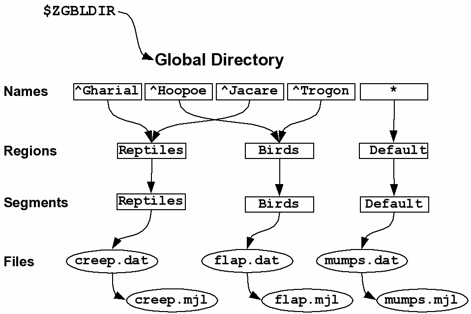
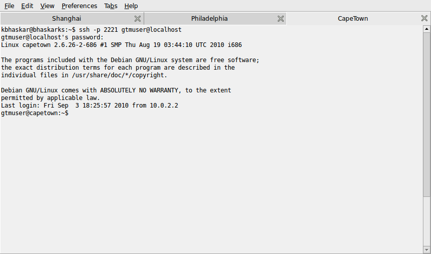

.. header::
   YottaDB/GT.M Acculturation Workshop

.. footer::
   Page ###Page### of ###Total###

.. index::
   YottaDB/GT.M Acculturation Workshop

====================================
YottaDB/GT.M Acculturation Workshop
====================================

Welcome to the YottaDB/GT.M Acculturation Workshop!

Copyright © 2014 Fidelity National Information Services, Inc. and/or its subsidiaries. All Rights Reserved.

Copyright © 2017 YottaDB LLC and/or its subsidiaries. All Rights Reserved.

Permission is granted to copy, distribute and/or modify this document under the terms of the `GNU Free Documentation License <http://www.gnu.org/licenses/fdl.txt>`_, Version 1.3 or any later version published by the Free Software Foundation; with no Invariant Sections, no Front-Cover Texts and no Back-Cover Texts.

GT.M™ is a trademark of Fidelity National Information Services, Inc. YottaDB™ is a trademark of YottaDB LLC. Other trademarks are the property of their respective owners.

.. contents:: Navigation

-----------------------------------
Acculturation Workshop Expectations
-----------------------------------

The YottaDB/GT.M Acculturation Workshop is a hands-on YottaDB/GT.M “boot camp” for those interested in the configuration, administration and operation of applications on YottaDB/GT.M. This file is the script, or workbook, for the workshop, and consists of the exercises below.

At the end of these exercises, you will have a basic working knowledge of the essential aspects of YottaDB/GT.M administration and operations. While this workshop alone will not make you a YottaDB/GT.M expert by any means, the basic working knowledge will help you quickly understand the concepts explained in the user documentation and put you on the path to becoming an expert.

The workshop is not a course in M programming. Familiarity with Linux® (or at least UNIX®) will allow you to move faster through the material, but is not absolutely required. If you have no experience whatsoever with Linux or UNIX, supplementary tutorial material on the side will increase your level of comfort.

As the differences between YottaDB/GT.M and other M implementations are more in the area of configuration and systems administration rather than M language features, the former topic is the major thrust of the workshop.

-------------
YottaDB/GT.M
-------------

`YottaDB <http://yottadb.com>`_/`FIS GT.M <http://fis-gtm.com>`_ is an implementation of the ISO standard scripting & application development language M, commonly known as MUMPS, developed and released by YottaDB and FIS. As the platform for the FIS Profile application, YottaDB/GT.M is the most widely used M implementation in banking and finance, including several of the largest real time core processing systems we know of that are live at any bank anywhere in the world. YottaDB/GT.M is increasingly used in healthcare. The implementation of YottaDB/GT.M on the GNU/Linux operating system on industry standard x86_64 architecture and Raspberry Pi hardware is the M implementation used for the FOSS (Free / Open Source Software) stack for `VistA <http://worldvista.org/AboutVistA>`_.

YottaDB/GT.M is architected with the following objectives:

- Without compromise, the robustness, security and integrity of the information entrusted to it.
-  Open architecture, with easy, standards based access to the information in the database.
- Continuity of business – YottaDB/GT.M has unique functionality for the deployment of mission-critical applications that must be available 24 hours a day, 365 days a year, with no down time even for planned events.
- Throughput, performance and scalability to meet the needs of the largest institutions in the world.

Free support for YottaDB/GT.M is available from the community on various mailing lists and forums. Support for YottaDB with assured service levels is available from YottaDB LLC on a commercial basis.

YottaDB/GT.M provides:

- Full `ACID (Atomic, Consistent, Isolated, Durable) <https://en.wikipedia.org/wiki/ACID>`_ transaction semantics
- throughput that scales to the needs of enterprise wide applications
- unique functionality for creating logical multi-site configurations for mission critical applications that must always be available, including doing upgrades, and upgrades involving changes to the database schema.

With the exception of Structured System Variable Names (SSVNs), YottaDB/GT.M mostly implements ISO standard M (ISO/IEC 11756:1999), including a full implementation of transaction processing (TP) that provides ACID (Atomic, Consistent, Isolated, Durable) transactions. As with any M implementation, there are extensions. IO parameters are implementation specific, as are parameters of the VIEW command, and commands & variables starting with the letter Z.

Despite the fact that the dialect of M implemented by YottaDB/GT.M shares so much in common with other M implementations, operationally, YottaDB/GT.M is unlike any other M implementation.

This Acculturation Workshop is based on GT.M V6.2-000, but any more recent version of YottaDB/GT.M should also work well.

---------
Packaging
---------

The exercises are carried out by booting guest virtual machines (also called software appliances) on your host computer. Think of a virtual machine as a “computer within a computer”. A guest virtual machine can run a different operating system from that of the host computer. The host computer might itself run Linux, Windows, OS X, or any other operating system and the guest can run Linux with YottaDB/GT.M as well as other applications. "Emulation" or "virtualization" software helps you set up a guest system on a host computer. On the host computer, the disk images of the YottaDB/GT.M Acculturation Workshop guide look like ordinary files in the file system.

+++++
Linux
+++++

Linux is the common name for the GNU/Linux operating system, consisting of the GNU utilities and libraries on the Linux kernel, available across the broadest range of hardware of any operating system. It is most widely used on industry standard architecture x86_64 hardware (i.e., based on popular CPUs from Intel, AMD and other vendors), and is increasingly popular around the world for applications that include embedded computing (appliances); personal desktops; file, print & web servers; supercomputing; and to deploy mission critical software. Linux is the operating system for the VistA FOSS stack.

Free support for Linux is available on numerous mailing lists and electronic forums. Commercial support is widely available from multiple vendors.

The YottaDB/GT.M Acculturation Workshop is virtual machine which starts with the disk image of a minimal `Ubuntu <https://www.ubuntu.com/>`_ 12.04 LTS (“Precise Pangolin”) Linux distribution, with `additional documentation resources <https://help.ubuntu.com/>`_.

For other documentation resources, although dated, `Linux: Rute User's Tutorial and Exposition <https://rlworkman.net/howtos/rute/>`_ is still a very useful and usable tutorial for anyone getting started with Linux. The `Debian Project <https://www.debian.org/>`_ maintains a `page of books <https://www.debian.org/doc/books>`_ on Linux. The `Debian Wiki <https://wiki.debian.org/>`_ has useful reference information and a having handy a paper copy of the `Debian Reference Card <https://www.debian.org/doc/manuals/refcard/>`_ (available in several languages) would be useful for anyone not entirely comfortable with Linux.

+++++++++++++++++++++++++++++++
Control of the Keyboard & Mouse
+++++++++++++++++++++++++++++++

When you boot a guest virtual machine, booting it “headless” (i.e., without a console), means that the host always has control of the keyboard and mouse. If it is not headless, ownership of the keyboard or mouse may need to toggle between the host and guest. The software you use for virtualization determines how to transfer control.

With kvm / QEMU, use the Ctrl-Alt key combination to toggle ownership of the mouse and keyboard between host and guest. Even if the host owns the keyboard, you can type into the guest console when it has focus, but not the other way around. Mouse clicks are visible to only the machine, host or guest, that owns the mouse.

++++++++++++++++++
Terminal Emulation
++++++++++++++++++

Even when running with a console, we recommend that you boot and minimize the virtual machine, and connect to your virtual machines with terminal sessions from a terminal emulator. On Windows, you can use a terminal emulator such as `putty <https://www.chiark.greenend.org.uk/~sgtatham/putty/>`_. Linux distributions include terminal emulation. Terminal emulators are available for, and frequently included with, other computer platforms.

For the Unicode exercises, you will either need a terminal emulator that can be switched between UTF-8 and single-byte characters, or you will need two emulators. If you intend to use languages that write right to left, you will need a terminal emulator with bidirectional capabilities.

+++++++++++++
Visualization
+++++++++++++

The software used for virtualization and used in the examples herein is `QEMU <https://www.qemu.org/>`_ which is available for many popular computing platforms, including Linux, Windows, and more. Instructions are provided below for Windows and Linux hosts. On Linux hosts, `kvm <https://www.linux-kvm.org/page/Main_Page>`_ may be the preferred choice (kvm and QEMU provide a very similar user interface). `VirtualBox <https://www.virtualbox.org/>`_ is another popular FOSS virtualization application. There is also proprietary virtualization software. Even though the examples herein are kvm/QEMU, you should be able to use the virtualization software of your choice.

You are at liberty to use a Linux host, or any Linux virtual machine of your choice. The virtual machine used to develop the exercises is a 64-bit Ubuntu Linux 14.04 LTS, using kvm on a 64-bit Ubuntu Linux 14.10 host.

++++++++++++
Disk Formats
++++++++++++

The YottaDB/GT.M Acculturation Workshop is distributed as a `vmdk format <https://en.wikipedia.org/wiki/VMDK>`_ disk image file  (e.g., **ubuntu-16.04_gtmworkshop9.vmdk**) that should work with most virtualization software, both FOSS and proprietary.

+++++++++++++++++++++++++++++
Virtual Machine Configuration
+++++++++++++++++++++++++++++

Virtualization software configures virtual machines either with their own IP addresses where the network connection (wired or wireless) of the host has multiple IP addresses, or, more commonly using network address translation (NAT). In the latter case, the network connection of the host has one IP address that it presents to the outside world, but each virtual machine has an IP address in a subnet within the host (the host acts just like a home Wifi access point / router).

You will need to configure your virtual machine for outbound and inbound network access. While outbound access should require no configuration to work with either type of virtual machine network connection, inbound network access in a NAT'd environment will require a TCP port on the host to be forwarded to the virtual machine for each port at which a service on the virtual machine needs to respond. For example each virtual machine has a secure shell (ssh) server listening at port 22 for incoming connections, and you might choose to forward port 2222 on the host to port 22 on your virtual machine.

Refer to the user documentation for your virtualization software to set up virtual machine networking. For example, using kvm on a Linux host, the following command boots the vmdk image with port 2222 on the host forwarded to port 22 on the guest for ssh sessions:

.. parsed-literal::

    kvm -enable-kvm -cpu host -m 256 -display none -net nic -net user,hostfwd=tcp::2222-:22 -hda ubuntu-16.04_gtmworkshop9.vmdk &

+++++++++++
Legal Stuff
+++++++++++

YottaDB is owned and copyrighted by `YottaDB LLC <http://yottadb.com/>`_ and is available for the GNU/Linux platforms on x86_64 and Raspberry Pi hardware under the terms of the `GNU Affero General Public License Version 3 <http://www.gnu.org/licenses/agpl.txt>`_ . Source and binary can be downloaded from the `YottaDB project page at Github <https://github.com/YottaDB/YottaDB>`_ .

GT.M is owned and copyrighted by `Fidelity Information Services, LLC <http://www.fisglobal.com/>`_, and is available for the x86_64 GNU/Linux platform under the terms of the `GNU Affero General Public License version 3 <http://www.gnu.org/licenses/agpl.txt>`_. Source and binary can be downloaded from the `GT.M project page at Source Forge <http://sourceforge.net/projects/fis-gtm>`_ .

The core of VistA (so called “FOIA VistA”) is in the public domain through the US Freedom of Information Act. Source and object code are available on one of the hard drive images. As noted above, no understanding of VistA itself is required or assumed for the workshop.

The Linux kernel, GNU utilities, the WorldVistA EHR extensions to VistA and all other software on the CD-ROM and hard drive images are FOSS and available under their respective FOSS licenses. Copyrights and trademarks of all content are hereby acknowledged as being held by their owners.

---------------
Getting Started
---------------

With a terminal emulator initiate an ssh connection to port 2222 on localhost and login with userid gtmuser, password GT.M Rocks! (including a space and an exclamation point). For example, on Linux, you can use the command: ssh -p 2222 -X gtmuser@localhost to connect as user gtmuser to port 2222 on the host which is forwarded to port 22 on the guest.

.. parsed-literal::

 $ ssh -p 2222 -X gtmuser@localhost
 Welcome to Ubuntu 16.04.1 LTS (GNU/Linux 3.13.0-39-generic x86_64)
 * Documentation:  https://help.ubuntu.com/
 System information as of Wed Nov 12 18:08:22 EST 2014
 System load: 0.48              Memory usage: 52%   Processes:       81
 Usage of /:  12.3% of 9.99GB   Swap usage:   0%    Users logged in: 0

 Graph this data and manage this system at: https://landscape.canonical.com/
 Last login: Tue Nov 11 16:51:37 2014 from 10.0.2.2
 gtmuser@gtmworkshop:~$ 

++++++++++++++++
Install YottaDB
++++++++++++++++

- Create a temporary directory and change to it, e.g.: mkdir /tmp/tmp ; cd /tmp/tmp
- Get the YottaDB installer: wget https://raw.githubusercontent.com/YottaDB/YottaDB/master/sr_unix/ydbinstall.sh
- Make it executable: chmod +x ydbinstall.sh
- Run it with your choice of directory where you want it installed (omit the --verbose option for less output): 
  
 .. parsed-literal::
     sudo ./ydbinstall.sh --installdir /opt/yottadb/ --utf8 default --verbose

- Choose a directory for your default environment and initialize it: 
 
  .. parsed-literal::
     export ydbdir=$HOME/.yottadb ; . /opt/yottadb/latest/yottadbprofile

- #include the file /opt/yottadb/latest/libyottadb.h in your C program and compile it.
- Run your program, ensuring either that libyottadb.so is in the load path of your program (e.g., using ldcache or the LD_LIBRARY_PATH environment variable), or that it is preloaded using LD_PRELOAD.

+++++++++++++++++
Run YottaDB/GT.M
+++++++++++++++++

**Default Environment**

YottaDB/GT.M needs several environment variables to be set up. YottaDB/GT.M provides a script that sets up reasonable defaults and allows you to start using YottaDB/GT.M immediately. When you set up environments in YottaDB/GT.M, you should set up your own scripting, but the default is a good place to start. You can source the gtmprofile file in the directory in which you have installed YottaDB/GT.M (e.g, /usr/local/lib/yottadb/r110/gtmprofile or /usr/lib/fis gtm/V6.2 000_x86_64/gtmprofile) to set up reasonable defaults or simply execute the script gtm to execute YottaDB/GT.M. A default environment is created only if it does not exist already.

.. parsed-literal::
   gtmuser@gtmworkshop:~$ source /usr/lib/fis-gtm/V6.2-000_x86_64/gtmprofile
   %GDE-I-GDUSEDEFS, Using defaults for Global Directory 
           /home/gtmuser/.fis-gtm/V6.2-000_x86_64/g/gtm.gld

   GDE> 
   %GDE-I-EXECOM, Executing command file /usr/lib/fis-gtm/V6.2-000_x86_64/gdedefaults

   GDE> 
   %GDE-I-VERIFY, Verification OK

   %GDE-I-GDCREATE, Creating Global Directory file /home/gtmuser/.fis-gtm/V6.2-000_x86_64/g/gtm.gld
    Created file /home/gtmuser/.fis-gtm/V6.2-000_x86_64/g/gtm.dat
    %GTM-I-JNLCREATE, Journal file /home/gtmuser/.fis-gtm/V6.2-000_x86_64/g/gtm.mjl created for region DEFAULT with BEFORE_IMAGES
    %GTM-I-JNLSTATE, Journaling state for region DEFAULT is now ON
    gtmuser@gtmworkshop:~$

Sourcing gtmprofile also defines gtm as an alias to the script gtm that runs YottaDB/GT.M (but more on that later).

.. parsed-literal::
   gtmuser@gtmworkshop:~$ alias gtm
   gtm='/usr/lib/fis-gtm/V6.2-000_x86_64/gtm'
   gtmuser@gtmworkshop:~$ gtm
   GTM>

Now you are in the YottaDB/GT.M “direct mode” where you can execute commands interactively. For example:

.. parsed-literal::
   GTM>set ^Capital("USA")="Washington"

   GTM>set ^Capital("India")="New Delhi"

   GTM>set ^Capital("Jordan")="Amman"

The commands perform database updates, which are shared between processes. You can see this if you start a new terminal session, start a new GT.M process and ask it to dump the “global variable” (a key-value association) ^Capital. The halt command takes you back to the Linux shell.

.. parsed-literal::
   GTM>zwrite ^Capital
   ^Capital("India")="New Delhi"
   ^Capital("Jordan")="Amman"
   ^Capital("USA")="Washington"
   GTM>halt
   gtmuser@gtmworkshop:~$

The operation of YottaDB/GT.M is controlled by a number of environment variables. In our exercise, the gtmprofile script automatically sets a number of environment variables:

.. parsed-literal::
   gtmuser@gtmworkshop:~$ env | grep ^gtm
   gtm_repl_instance=/home/gtmuser/.fis-gtm/V6.2-000_x86_64/g/gtm.repl
   gtm_log=/tmp/fis-gtm/V6.2-000_x86_64
   gtm_prompt=GTM>
   gtm_retention=42
   gtmver=V6.2-000_x86_64
   gtm_icu_version=5.2
   gtmgbldir=/home/gtmuser/.fis-gtm/V6.2-000_x86_64/g/gtm.gld
   gtmroutines=/home/gtmuser/.fis-gtm/V6.2-000_x86_64/o(/home/gtmuser/.fis-gtm/V6.2-000_x86_64/r /home/gtmuser/.fis-gtm/r) /usr/lib/fis-gtm/V6.2-000_x86_64/plugin/o(/usr/lib/fis-gtm/V6.2-000_x86_64/plugin/r) /usr/lib/fis-gtm/V6.2-000_x86_64/libgtmutil.so /usr/lib/fis-gtm/V6.2-000_x86_64
   gtmdir=/home/gtmuser/.fis-gtm
   gtm_etrap=Write:(0=$STACK) "Error occurred: ",$ZStatus,!
   gtm_principal_editing=EDITING
   gtm_tmp=/tmp/fis-gtm/V6.2-000_x86_64
   gtm_dist=/usr/lib/fis-gtm/V6.2-000_x86_64
   gtmuser@gtmworkshop:~$ 

YottaDB/GT.M databases can also be configured so that they can be recovered after a system crash. Simulate a crash right now by either clicking on the “X” in the top right corner of your virtual machine console window to instantly “power down” your virtual machine, or if you started it headless, then performing a hard power-down using a command on the host (in the case of virtualization using qemu/kvm on Linux, a kill -9 of the virtual machine process). Then boot it, run gtm and use a zwrite ^Capital command to confirm that the data in the database is still intact.

The tree program shows the default environment YottaDB/GT.M creates in your home directory. In this case, the output bolding and colors are as displayed by the tree program, and not according to the conventions of this document.

.. parsed-literal::
   gtmuser@gtmworkshop:~$ tree .fis-gtm/
   .fis-gtm/
   ├── r
   └── V6.2-000_x86_64
       ├── g
       │ ├── gtm.dat
       │ ├── gtm.gld
       │ ├── gtm.mjl
       │ ├── gtm.mjl_2014317131528
       │ ├── gtm.mjl_2014317131909
       │ └── gtm.mjl_2014317134042
       ├── o
       │ └── utf8
       └── r

    6 directories, 6 files
    gtmuser@gtmworkshop:~$ 

We will get into this in more detail below.

**UTF-8 Mode**

With YottaDB/GT.M, you can write applications that implement international character sets using Unicode or ISO/IEC-10646 (the two standards track each other). Connect to the virtual machine with your terminal emulator configured to support the UTF-8 character set. In a fresh terminal session execute the following (the non-printable characters may look different on your session from the screen here, depending on how your terminal emulator renders them):

.. parsed-literal::
   gtmuser@gtmworkshop:~$ export gtm_chset=UTF-8 LC_CTYPE=en_US.utf8
   gtmuser@gtmworkshop:~$ source /usr/lib/fis-gtm/V6.2-000_x86_64/gtmprofile
   gtmuser@gtmworkshop:~$ gtm
   GTM>write $zchset
   UTF-8
   GTM>for i=1040:16:1072 write ! for j=0:1:15 write $char(i+j)," "

   А Б В Г Д Е Ж З И Й К Л М Н О П
   Р С Т У Ф Х Ц Ч Ш Щ Ъ Ы Ь Э Ю Я
   а б в г д е ж з и й к л м н о п
   GTM>

Note that Unicode support requires additional infrastructure, such as Unicode enabled terminal emulators, and is likely to require custom collation modules to be written to ensure that strings such as names are sorted in linguistically and culturally correct order.

In the exercises below, we will set up environments for use with Unicode.

----------
The Basics
----------

To use YottaDB/GT.M, at a minimum you need:

- User documentation
- To specifiy the location of YottaDB/GT.M on your computer, in the gtm_dist environment variable
- To provide a search path for a YottaDB/GT.M process to routines - the gtmroutines environment variable and the $zroutines intrinsic special variable (or "ISV" - all ISVs are case insensitive, as are YottaDB/GT.M commands).
- To map its global variables to database files - the gtmgbldir environment variable and the $zgbldir ISV point to a global directory file with the mapping.

**User Documentation**

YottaDB/GT.M user documentation consists of manuals and technical bulletins. Manuals are updated periodically, and technical bulletins serve as user documentation updates that are available in a more timely manner. Current YottaDB documentation is available online at the YottaDB documentation site. All current YottaDB/GT.M documentation is accessible on the Internet. Go to the `YottaDB home page <http://yottadb.com>`_ and click on the User Documentation tab.

YottaDB/GT.M documentation is organized into manuals, technical bulletins, suggested practices and advisories:

- Manuals are published periodically. Every user manual incorporates information that is current as of the date of publication, i.e., in principle, a new manual obsoletes technical bulletins older than its publication date.
- Technical bulletins contain information that is more timely than manuals.
- Suggested practices are documents we think are wholesome approaches to ways of using YottaDB/GT.M
- Advisories are information that you should read and act on in a timely fashion - such as security alerts.

**Routines in the File System**

Routines in YottaDB/GT.M are simply files in the file system; they do not reside in databases. You can edit routines from the GTM> prompt. Start GT.M and at the GTM> prompt, type zedit "hello" and hit ENTER. This starts the vi editor editing the source routine for ^hello, /home/gtmuser/.fis-gtm/V6.2-000_x86_64/r/hello.m. Use the five key sequence ESCAPE : q ! ENTER to exit vi without changing the file.

.. note::
  although vi always puts a newline at the end of your file; other editors may not. A GT.M program file should always end with a newline.

The philosophy of YottaDB/GT.M is to focus on what it does well, providing a robust, scalable, transaction processing database and a compiler for the M language, and to leverage tools and capabilities of the underlying operating system for the rest. This is powerful because whenever there are enhancements to the underlying operating environment, YottaDB/GT.M can benefit from them. It can also be a little uncomfortable for M programmers migrating to YottaDB/GT.M, because traditional M implementations carry their environments around with them, like the shell on a snail's back.

As you saw when executing M commands interactively, even though YottaDB/GT.M is a true compiler it still provides an interactive direct mode – YottaDB/GT.M simply compiles and executes each line.

**Exercise - Compiling and Linking**

The purpose of this exercise is to understand compiling and linking routines. Use the command find .fis-gtm -iname hello.[mo] to confirm that your default YottaDB/GT.M environment does not have a program called hello.

.. parsed-literal::
   gtmuser@gtmworkshop:~$ find .fis-gtm -iname hello.[mo]
   gtmuser@gtmworkshop:~$ 

You can also perform the same operation from inside YottaDB/GT.M

.. parsed-literal::
   GTM>zsystem "find .fis-gtm -iname hello.[mo]"
   GTM>

or

.. parsed-literal::
   GTM>do SILENT^%RSEL("hello") zwrite %ZR
   %ZR=0

   GTM>

Had there been a routine, the response might look like this:

.. parsed-literal::
   GTM>do SILENT^%RSEL("hello") zwrite %ZR    
   %ZR=1
   %ZR("hello")="/home/gtmuser/.fis-gtm/r/"

   GTM>

If you are not comfortable with the terse commands of the default vi editor, you can install your preferred editor. Other editors that are installed on the virtual machine are fte, jed, joe and nano. Nano may be the easiest editor for you to use if you are not familiar with any editor included with the virtual machine. In nano Ctrl-G provides a screen with keyboard shortcuts.

.. parsed-literal::
   gtmuser@gtmworkshop:~$ export EDITOR=`which nano`
   gtmuser@gtmworkshop:~$ gtm
   GTM>

Instruct YottaDB/GT.M to run the routine ^hello and note that it reports an error:

.. parsed-literal::
   GTM>do ^hello
   %GTM-E-ZLINKFILE, Error while zlinking "hello"
   %GTM-E-FILENOTFND, File hello not found
   GTM>do SILENT^%RSEL("hello") zwrite %ZR
   %ZR=0
   GTM>

Within YottaDB/GT.M, use zedit "hello" to start the editor. Create a simple “Hello, World” program,save it and return to YottaDB/GT.M. Now notice that the source file exists (you can use the arrow key to recall the previous command within YottaDB/GT.M) but there is no object file.

.. parsed-literal::
   GTM>do SILENT^%RSEL("hello") zwrite %ZR
   %ZR=1
   %ZR("hello")="/home/gtmuser/.fis-gtm/V6.2-000_x86_64/r/"

   GTM>do SILENT^%RSEL("hello","OBJ") zwrite %ZR
   %ZR=0
   
   GTM>

Now run the program - it runs as expected.

.. parsed-literal::
   GTM>do ^hello
   Hello, World

   GTM>

Now you now also have an object file. YottaDB/GT.M dynamically, and automatically, compiles the source program into the object program when you execute do ^hello.

.. parsed-literal::
   GTM>do SILENT^%RSEL("hello","OBJ") zwrite %ZR
   %ZR=1
   %ZR("hello")="/home/gtmuser/.fis-gtm/V6.2-000_x86_64/o/"

   GTM>

[Note that since YottaDb/GT.M is a compiler, it can generate error messages at compile time as well as at run time. Indeed when compiling an application such as VistA, there may be hundreds of lines of error messages triggered by lines of code that are legal for other M implementations but not for GT.M. These lines are protected in VistA and are inside conditional statements that are executed only on the appropriate M implementation, so they are nothing to be concerned about.]

Let's also get the time stamps of the files; notice that the source code file is older than the object code file:

.. parsed-literal::
   GTM>zsystem "find .fis-gtm -name hello.[mo] -exec ls -l {} \;"
   -rw-rw-r-- 1 gtmuser gtmuser 1048 Nov 14 11:15 .fis-gtm/V6.2-000_x86_64/o/hello.o
   -rw-rw-r-- 1 gtmuser gtmuser 35 Nov 14 11:14 .fis-gtm/V6.2-000_x86_64/r/hello.m

   GTM>

Now edit the program with zedit "hello" then change it, e.g., make it print "Aloha, World" instead and save it.

Again execute do ^hello and note that YottaDb/GT.M still prints "Hello, World". This is because YottaDb/GT.M already has an hello module linked in its address space, and does not go out every time to check if there is a new version. This is “clobber protection” and a YottaDb/GT.M feature.

Execute zLink "hello" which tells YottaDb/GT.M to re-link hello even if it already has one linked in its address space, followed by do ^hello and note that it now prints "Aloha, World" . Verify that the source file is newer and that YottaDb/GT.M has created a new object file.

.. parsed-literal::
   GTM>zedit "hello"

   GTM>do ^hello
   Hello,world

   GTM>zlink "hello"

   GTM>do ^hello
   Aloha, world

   GTM>zsystem "find .fis-gtm -name hello.[mo] -exec ls -l {} \;"
   -rw-rw-r-- 1 gtmuser gtmuser 1048 Nov 14 11:20 .fis-gtm/V6.2-000_x86_64/o/hello.o
   -rw-rw-r-- 1 gtmuser gtmuser 35 Nov 14 11:20 .fis-gtm/V6.2-000_x86_64/r/hello.m

   GTM>

.. note::
    To avoid being surprised by running an old version of a routine that you have just edited, it is important to understand how dynamic compilation and linking work on GT.M.

The $zroutines ISV tells YottaDb/GT.M where to find routines:

.. parsed-literal::
   GTM>write $zroutines
   /home/gtmuser/.fis-gtm/V6.2-000_x86_64/o(/home/gtmuser/.fis-gtm/V6.2-000_x86_64/r /home/gtmuser/.fis-gtm/r) /usr/lib/fis-gtm/V6.2-000_x86_64/plugin/o(/usr/lib/fis-gtm/V6.2-000_x86_64/plugin/r) /usr/lib/fis-gtm/V6.2-000_x86_64/libgtmutil.so /usr/lib/fis-gtm/V6.2-000_x86_64
   GTM>

V6.2-000, the latest GT.M release as of the date of this document, is used in this release of the Acculturation Workshop. Future YottaDB/GT.M releases may by default suffix one or more directories with an asterisk, e.g., instead of /home/gtmuser/.fis-gtm/V6.2-000_x86_64/o, you may see /home/gtmuser/.fis-gtm/V6.2-000_x86_64/o*. More on this below.

At process startup, $zroutines is initialized from the environment variable $gtmroutines, but it can be altered from within the GT.M process.

.. parsed-literal::
   GTM>set $zroutines=". "_$ztrnlnm("gtm_dist")

   GTM>write $zroutines
   . /usr/lib/fis-gtm/V6.2-000_x86_64
   GTM>write $ztrnlnm("gtmroutines")
   /home/gtmuser/.fis-gtm/V6.2-000_x86_64/o(/home/gtmuser/.fis-gtm/V6.2-000_x86_64/r /home/gtmuser/.fis-gtm/r) /usr/lib/fis-gtm/V6.2-000_x86_64
   GTM>

The ZEDIT command always puts new routines in the first source directory in the search path. Use it to create a new routine to print the current date and time at the Universal Time Coordinate. After the change to $zroutines above, notice how a newly created program and object file are created in the current directory (.).

.. parsed-literal::
   GTM>zedit "UTC"
   GTM>zprint ^UTC
   UTC     zsystem "TZ=UTC date"
           quit

   GTM>do ^UTC
   Fri Nov 14 16:25:28 UTC 2014

   GTM>zsystem "find . -name UTC\* -exec ls -l {} \;"
   -rw-rw-r-- 1 gtmuser gtmuser 32 Nov 14 11:24 ./UTC.m
   -rw-rw-r-- 1 gtmuser gtmuser 1000 Nov 14 11:25 ./UTC.o

   GTM>

YottaDB/GT.M also provides a mechanism for processes to indicate that instead of explicitly relinking newer versions of routines, they would like to “subscribe” to and automatically execute the latest updated (“published”) object code of routines. Processes indicate this interest by appending an asterisk (“*”) to each directory name from which they wish to execute the latest object code.

Start a new session of YottaDb/GT.M (so that you don't have any routines linked the old way), and modify $zroutines to append an asterisk to the object directory from which your routines are executed. If you are using a version of YottaDb/GT.M newer than V6.2-000, the gtmprofile script may already have appended the requisite asterisk. Then execute the “hello” program to make the process link the object code:

.. parsed-literal::
   gtmuser@gtmworkshop:~$ gtm

   GTM>write $zroutines
   /home/gtmuser/.fis-gtm/V6.2-000_x86_64/o(/home/gtmuser/.fis-gtm/V6.2-000_x86_64/r /home/gtmuser/.fis-gtm/r) /usr/lib/fis-gtm/V6.2-000_x86_64/plugin/o(/usr/lib/fis-gtm/V6.2-000_x86_64/plugin/r) /usr/lib/fis-gtm/V6.2-000_x86_64/libgtmutil.so /usr/lib/fis-gtm/V6.2-000_x86_64
   GTM>set $zroutines=$piece($zroutines,"4/o",1)_"4/o*"_$piece($zroutines,"4/o",2)

   GTM>write $zroutines
   /home/gtmuser/.fis-gtm/V6.2-000_x86_64/o*(/home/gtmuser/.fis-gtm/V6.2-000_x86_64/r /home/gtmuser/.fis-gtm/r) /usr/lib/fis-gtm/V6.2-000_x86_64/plugin/o(/usr/lib/fis-gtm/V6.2-000_x86_64/plugin/r) /usr/lib/fis-gtm/V6.2-000_x86_64/libgtmutil.so /usr/lib/fis-gtm/V6.2-000_x86_64
   GTM>do ^hello
   Aloha, world

   GTM>

In a different YottaDB/GT.M process in a different shell session, after appending the asterisk to the object directory, modify the “hello” program to say “Aloha, Universe”. Note the use of the environment variable gtm_prompt to differentiate it from the original session. After editing it, run the routine, which will compile the new version. They use the ZRUPDATE command to publish the new object file:

.. parsed-literal::
   GTM2>set $zroutines=$piece($zroutines,"4/o",1)_"4/o*"_$piece($zroutines,"4/o",2)

   GTM2>zedit "hello" ; modify it to print Aloha, universe

   GTM2>do ^hello ; this ensures that the new version is compiled
   Aloha, universe

   GTM2>zrupdate $piece($zroutines,"*",1)_"/hello.o" ; publish the object code

   GTM2>

In a different YottaDb/GT.M process in a different shell session, after appending the asterisk to the object directory, modify the “hello” program to say “Aloha, Universe”. Note the use of the environment variable gtm_prompt to differentiate it from the original session. After editing it, run the routine, which will compile the new version. They use the ZRUPDATE command to publish the new object file:

.. parsed-literal::
   GTM2>set $zroutines=$piece($zroutines,"4/o",1)_"4/o*"_$piece($zroutines,"4/o",2)

   GTM2>zedit "hello" ; modify it to print Aloha, universe

   GTM2>do ^hello ; this ensures that the new version is compiled
   Aloha, universe

   GTM2>zrupdate $piece($zroutines,"*",1)_"/hello.o" ; publish the object code

   GTM2>

In the original session, again run the hello program, and notice that even without an explicit zlink, it has the latest version of the program:

.. parsed-literal::
   GTM>do ^hello
   Aloha, universe

   GTM>

The Programmer's Guide explains the use of $ZROUTINES in more detail.

**Exercise - Default Directory Structure for an Application**

Use the tree -d .fis-gtm command from the shell to look at the default directory structure under .fis-gtm. What is the purpose of each directory?

--------------------------------------------
Global Directories Point to Global Variables
--------------------------------------------

Routines in YottaDB/GT.M reside in the file system rather than in the database, whereas global variables reside in databases. Routines are completely independent of global variables. In this respect, YottaDb/GT.M may be different from other M implementations.

Given a person's name, a telephone directory helps you find the person by giving you the phone number, and sometimes their address as well. Analogously, given an M global variable name, a global directory helps a GT.M process find the variable by giving it the database file where that variable resides, as well as other pertinent information.

The global directory is a binary file pointed to by the ISV $zgbldir. The GDE utility program (invoked with do ^GDE inside GT.M or mumps -run ^GDE from the shell) is used to manage global directories. [Note that the input to GDE can be a text file. In a production environment, YottaDB LLC/FIS recommends that text files be used to define database configurations, and that these text files be put under version control.]

In YottaDB/GT.M, sets of M global variables (Names or Name spaces) are mapped to Regions that define properties relating to the M global. Each Region is mapped to a Segment that defines properties relating to the file system. Consider the example in the figure below:

In this example, there are four M global variables that we would like to separate from the rest (e.g., for purposes of sharing globals between applications, or for reasons of protection – perhaps they contain special information, so that only herpetologists are to have access to globals ^Gharial and ^Jacare, and only ornithologists are to have access to globals ^Hoopoe and ^Trogon). This is accomplished by creating five Name Spaces (note that a name space can contain a single variable, as in this example, or a range of global variables, e.g., everything starting with ^A through ^Gharial). There is always a default (*) name space.

One or more name spaces are mapped to a Region. All global variables in a region share a common set of M global variable properties, such as the maximum record length, whether null subscripts are permitted, etc. In this case ^Gharial and ^Jacare are mapped to the region REPTILES, whereas ^Hoopoe and ^Trogon are mapped to the region BIRDS. The default name space * is mapped to a region called DEFAULT.

Each region is mapped to a Segment. Just as a region defines properties pertaining to M global variables, the segment defines properties pertaining to the database file for that region, such as the file name, the initial allocation, number of global buffers, etc. The database file is just an ordinary file in the file system of the underlying operating system.

Each database file can have a single active journal file. A journal file can be linked to a previous journal files to form a chain of journal files.

The ISV $zgbldir points a YottaDB/GT.M process to the global directory. $zgbldir is initialized from $gtmgbldir at process startup, but it can be modified by the process during execution.

.. parsed-literal::
   GTM>write $ztrnlnm("gtmgbldir")
   /home/gtmuser/.fis-gtm/V6.2-000_x86_64/g/gtm.gld
   GTM>write $zgbldir
   /home/gtmuser/.fis-gtm/V6.2-000_x86_64/g/gtm.gld
   GTM>

GDE, the Global Directory Editor, is a program used to manipulate global directories. GDE is itself written in M, and you can invoke it from the shell with mumps -run GDE (or, with the gtm alias, gtm -run GDE) or from inside the direct mode with do ^GDE.

.. parsed-literal::
   gtmuser@gtmworkshop:~$ $gtm_dist/mumps -run GDE
   %GDE-I-LOADGD, Loading Global Directory file /home/gtmuser/.fis-gtm/V6.2-000_x86_64/g/gtm.gld
   %GDE-I-VERIFY, Verification OK

   GDE>

You can use the show command to examine name spaces, regions and segments.

.. parsed-literal::
   GDE> show -name

         *** NAMES ***
   Global                             Region
   ------------------------------------------------------------------------------
   *                                  DEFAULT
   GDE>

In this case, there is only one name space, the default. There is also only one region, DEFAULT. Region and segment names are case insensitive, but name spaces are case sensitive, since M variable names are case sensitive.

.. parsed-literal::
   GDE> show -region
   
    ======================================
                  REGIONS
    -------------------------------------
    Region  Dynamic Segment  Def Coll Rec Size  Key Size  Null Subs Std Null Col Jnl Inst Freeze on Error Qdb Rndwn
    ======  ===============  ======== ========  ========  ========= ============ === ==================== =========
    DEFAULT   DEFAULT            0          4080    255      NEVER      Y         Y      DISABLED         DISABLED
    =======   =======        =======   ========  =======     ======  ============ ===    ========         ========

Notice the region parameters – review them in the Administration and Operations Guide. Since there is one region, there is also one segment, also called DEFAULT (the region and segment names can be different; it is good practice to keep them the same).

.. parsed-literal::
   
   GDE> show -segment

   =======================================
          SEGMENTS
   ---------------------------------------
   Segment   File (def ext: .dat)Acc Typ Block      Alloc Exten Options
   =======   =================================      ===================
   DEFAULT   $gtmdir/$gtmver/g/gtm.dat              
                   BG  DYN  4096                     5000 10000 GLOB=1000
                                                                LOCK=  40
                                                                RES =   0
                                                                ENCR=OFF
                                                                MSLT=1024
   =======   ==================================     ======================

   GDE>

Notice how the database file is defined using the environment variables $gtmdir and $gtmver. This means that, as long as the environment variables are defined, one global directory can point to a database file wherever it happens to be on the system. This can allow two processes to share a global directory, but to have different database files.

.. note:: 
   The parameters in the global directory are used only by mupip create to create a new database file. At other times, the global directory is used only to map global variable names to database files. So, if you change the global directory, existing database files are not changed. If you change a parameter in a database file, unless you also change the global directory used to create the database file, the next time you create that file, it will use old parameters in the global directory.

The show map command gives a good visualization of mapping of names to database files in the global directory.

.. parsed-literal::
   GDE> show -map

   =====================================
               MAP
   ------------------------------------
               Names
   ------------------------------------
   From           Up to     Region / Segment / File(def ext: .dat)
   ====           =====     ======================================
   %               ...        REG= DEFAULT
                              SEG= DEFAULT
                              FILE = $gtmdir/$gtmver/g/gtm.dat
   LOCAL LOCKS                REG= DEFAULT
                              SEG= DEFAULT
                              FILE = $gtmdir/$gtmver/g/gtm.dat
   ============   ======    ======================================

   GDE>

**Exercise- Set up the Global Directory for Herpetologists and Ornithologists**

Start from the shell. Assign a value to $gtmgbldir so as to not overwrite any existing global directory in the Acculturation Workshop and then invoke GDE.

.. parsed-literal::
   gtmuser@gtmworkshop:~$ export gtmgbldir=/home/gtmuser/gtm.gld
   gtmuser@gtmworkshop:~$ mumps -run GDE
   %GDE-I-GDUSEDEFS, Using defaults for Global Directory
           /home/gtmuser/gtm.gld

   GDE>

While not essential, it may be conceptually helpful to build the global directory from the bottom up – first create the segments, then the regions, and then the name spaces. First edit the default to make the parameters more useful – the out-of-box defaults are suitable for experimentation but not real use. Using a template reduces the work needed to create multiple regions and segments. Notice the use of different access methods for BIRDS and REPTILES.

.. parsed-literal::
   GDE> change -segment DEFAULT -block_size=4096 -allocation=1000 -extension=1000 -global_buffer_count=1000 -file_name=/home/gtmuser/gtm.dat
   GDE> template -segment -access_method=bg -block_size=4096 -allocation=1000 -extension=1000 -global_buffer_count=1000
   GDE> template -segment -access_method=mm -block_size=4096 -allocation=1000 -extension=1000 -global_buffer_count=1000
   GDE> add -segment BIRDS -access_method=mm -file_name=/home/gtmuser/flap.dat
   GDE> add -segment REPTILES -access_method=bg -file_name=/home/gtmuser/creep.dat
   GDE> show -segment

   ==================================
          SEGMENTS
   ----------------------------------
    Segment    File (def ext: .dat)Acc Typ Block  Alloc Exten Options
    =======    =================================  ===================
    BIRDS      /home/gtmuser/flap.dat               
                                    MM DYN 4096   1000 1000 DEFER
                                                            LOCK=40
                                                            RES= 0
                                                            ENCR=OFF
                                                            MSLT=1024
    DEFAULT   /home/gtmuser/gtm.dat
                                   BG DYN 4096    1000 1000 GLOB=100
                                                            LOCK=40
                                                            RES=0
                                                            ENCR=OFF
                                                            MSLT=1024
    REPTILES  /home/gtmuser/creep.dat
                                   BG DYN 4096    1000 1000 GLOB=100
                                                            LOCK=40
                                                            RES=0
                                                            ENCR=OFF
                                                            MSLT=1024
    ========  =================================   ====================

    GDE>

Then we can map the regions to the segments. Notice that the segment names (specified with the -dynamic qualifier) are converted to and displayed in upper case.

.. parsed-literal::
   GDE> change -region DEFAULT -stdnull -key_size=255 -record_size=4080 -journal=(before,file="/home/gtmuser/gtm.mjl")
   GDE> template -region -stdnull -key_size=255 -record_size=4080 -journal=nobefore
   GDE> add -region BIRDS -dynamic=birds -journal=(nobefore,file="/home/gtmuser/flap.mjl")
   GDE> add -region REPTILES -dynamic=reptiles -journal=(before,file="/home/gtmuser/creep.mjl")
   GDE> show -region
   
   ==============================
            REGIONS
   ------------------------------
   Region    Dynamic Segment    Def Coll   Rec Size   Key Size   Null Subs  Std Null Coll  Jnl  Inst Freeze on Error  Qdb Rundown
   ======    ===============    ========   ========   ========   =========  =============  ===  ====================  ===========
   BIRDS      BIRDS                0        4080        255       NEVER           Y         Y     DISABLED             DISABLED
   DEFAULT    DEFAULT              0        4080        255       NEVER           Y         Y     DISABLED             DISABLED
   REPTILES   REPTILES             0        4080        255       NEVER           Y         Y     DISABLED             DISABLED
   ========   =============     ========   =======    =========  ========   =============  ===   ==================   ===========

   ==================================
         JOURNALING INFORMATION
   ----------------------------------
   Region   Jnl File (def ext: .mjl)   Before  Buff   Alloc  Exten   Autoswitch
   ======   ========================   ======  ====   =====  =====   ==========
   BIRDS    /home/gtmuser/flap.mjl      N      2308   2048   2048    8386560
   DEFAULT  /home/gtmuser/gtm.dat       Y      2308   2048   2048    8386560
   REPTILES /home/gtmuser/creep.mjl     Y      2308   2048   2048    8386560
   ======== =======================    ====   ======  =====  ====   ===========

   GDE>

Now map the name spaces to the regions.

.. parsed-literal::
   GDE> add -name Gharial -region=reptiles
   GDE> add -name Jacare -region=reptiles
   GDE> add -name Hoopoe -region=birds
   GDE> add -name Trogon -region=birds
   GDE> show -name

   ===============================
                  NAMES
   -------------------------------
   Global             Region
   ======             =======
   *                  DEFAULT
   Gharial            REPTILES
   Hoopoe             BIRDS
   Jacare             REPTILES
   Trogon             BIRDS
   =======            =======

  GDE>

You can examine the entire map, and ask GDE to perform a check for consistency.

.. parsed-literal::
   GDE> show -map

   =================================
             MAP
   ---------Names-------------------
   From       Up To         Region/Segment/File (def ext: .dat)
   =====     =======        ===================================
   %         Gharial          REG= DEFAULT
                              SEG= DEFAULT
                              FILE= /home/gtmuser/gtm.dat
   Gharial   Gharial0         REG= REPTILES
                              SEG= REPTILES
                              FILE= /home/gtmuser/creep.dat
   Gharial0  Hoopoe           REG= DEFAULT
                              SEG= DEFAULT
                              FILE= /home/gtmuser/gtm.dat
   Hoopoe    Hoopoe0          REG= BIRDS
                              SEG= BIRDS
                              FILE= /home/gtmuser/flap.dat
   Hoopoe0   Jacare           REG= DEFAULT
                              SEG= DEFAULT
                              FILE= /home/gtmuser/gtm.dat
   Jacare    Jacare0          REG= REPTILES
                              SEG= REPTILES
                              FILE= /home/gtmuser/creep.dat
   Jacare0   Trogon           REG= DEFAULT
                              SEG= DEFAULT
                              FILE= /home/gtmuser/gtm.dat
   Trogon    Trogon0          REG= BIRDS
                              SEG= BIRDS
                              FILE= /home/gtmuser/flap.dat
   Trogon0    .....           REG= DEFAULT
                              SEG= DEFAULT
                              FILE= /home/gtmuser/gtm.dat
   LOCAL LOCKS                REG= DEFAULT
                              SEG= DEFAULT
                              FILE= /home/gtmuser/gtm.dat
   ======     =========       ==============================

   GDE> verify
   %GDE-I-VERIFY, Verification OK

   GDE>

Exiting GDE creates the global directory. You can then use a mupip create command to create the database files. Notice that journal files must be separately created.

.. parsed-literal::
   GDE> exit
   %GDE-I-VERIFY, Verification OK

   %GDE-I-GDCREATE, Creating Global Directory file /home/gtmuser/gtm.gld
   gtmuser@gtmworkshop:~$ ls -l * .dat * .mjl
   ls: cannot access * .dat: No such file or directory
   ls: cannot access * .mjl: No such file or directory
   gtmuser@gtmworkshop:~$ mupip create
   Created file /home/gtmuser/flap.dat
   Created file /home/gtmuser/gtm.dat
   Created file /home/gtmuser/creep.dat
   gtmuser@gtmworkshop:~$ ls -l * .dat * .mjl
   ls: cannot access * .mjl: No such file or directory
   -rw-rw-rw- 1 gtmuser gtmuser 4366848 Nov 17 17:20 creep.dat
   -rw-rw-rw- 1 gtmuser gtmuser 4366848 Nov 17 17:20 flap.dat
   -rw-rw-rw- 1 gtmuser gtmuser 4366848 Nov 17 17:20 gtm.dat
   gtmuser@gtmworkshop:~$

Then you can turn on journaling. As YottaDB/GT.M requires you to explicitly specify the type of journaling to be used, you need separate commands depending on the type of journaling – before image and no-before image journaling.

.. parsed-literal::
   gtmuser@gtmworkshop:~$ mupip set -journal=nobefore -region BIRDS
   %GTM-I-JNLCREATE, Journal file /home/gtmuser/flap.mjl created for region BIRDS with NOBEFORE_IMAGES
   %GTM-I-JNLSTATE, Journaling state for region BIRDS is now ON
   gtmuser@gtmworkshop:~$ mupip set -journal=before -region REPTILES,DEFAULT
   %GTM-I-JNLCREATE, Journal file /home/gtmuser/gtm.mjl created for region DEFAULT with BEFORE_IMAGES
   %GTM-I-JNLSTATE, Journaling state for region DEFAULT is now ON
   %GTM-I-JNLCREATE, Journal file /home/gtmuser/creep.mjl created for region REPTILES with BEFORE_IMAGES
   %GTM-I-JNLSTATE, Journaling state for region REPTILES is now ON
   gtmuser@gtmworkshop:~$ ls -l * .dat * .mjl
   -rw-rw-rw- 1 gtmuser gtmuser 4366848 Nov 17 17:24 creep.dat
   -rw-rw-rw- 1 gtmuser gtmuser   69632 Nov 17 17:24 creep.mjl
   -rw-rw-rw- 1 gtmuser gtmuser 4366848 Nov 17 17:22 flap.dat
   -rw-rw-rw- 1 gtmuser gtmuser   69632 Nov 17 17:22 flap.mjl
   -rw-rw-rw- 1 gtmuser gtmuser 4366848 Nov 17 17:24 gtm.dat
   -rw-rw-rw- 1 gtmuser gtmuser   69632 Nov 17 17:24 gtm.mjl
   gtmuser@gtmworkshop:~$

For production environments, we suggest that you put your GDE commands in a text file and invoke them with a heredoc or using GDE's @ command. Put the text file under version control.

**$zroutines and $zgbldir vs. UCI & Volume set**

The YottaDB/GT.M environment is defined by $ZROUTINES (initialized from $gtmroutines) and $zgbldir (initialized from $gtmgbldir). Concepts from other M implementations such as UCI and volume set do not exist on GT.M.

The YottaDB/GT.M separation between routines and the database is very powerful, especially in real-world environments. Apart from the flexibility this offers, it enables the practice of “defensive programming”, not unlike defensive driving. We are human beings who are prone to err, and defensive practices reduce the probability of errors.

**Exercise - Set Up a Simulated ASP Environment**

In an Application Service Provider (ASP) environment, the same application code can be used for a number of sites, but each site has its own database. Sometimes parts of the database may also be common and used on a read-only basis for normal operation, such as a data dictionary, an approved drug formulary, or a table of sales tax rates for location. Each site may also have a small set of custom routines. Let us consider an ASP serving two institutions, called gh (for General Hospital) and cc (for Cancer Center).

The majority of routines are shared, with:

- source routines that are independent of the YottaDB/GT.M version in /opt/EHR/VOE10/r,
- source routines that are dependent on the YottaDB/GT.M version in /opt/EHR/VOE10/V6.2-000_x86_64/r (note that in the typical case, this directory will be empty, but if a release of YottaDB/GT.M has a new feature that a routine XYZ.m can take advantage of, you would put the new XYZ.m in this directory and leave the old XYZ.m in the previous directory), and
- object files in /opt/EHR/VOE10/V6.2-000_x86_64/o.

Custom routines for General Hospital in /var/opt/EHR/VOE10/gh/r and /var/opt/EHR/VOE10/gh/V6.2-000_x86_64/r with object code in /var/opt/EHR/VOE10/gh/V6.2-000_x86_64/o.

Similarly, custom routines for the Cancer Center are in /var/opt/EHR/VOE10/cc/r and /var/opt/EHR/VOE10/cc/V6.2-000_x86_64/r with object code in /var/opt/EHR/VOE10/cc/V6.2-000_x86_64/o.

What should $gtmroutines be for a GH user and what should it be for a CC user? Create a shell script to be sourced by a GH user and another to be sourced by a CC user. [The shell scripts can reside in /var/opt/EHR/VOE10/cc/V6.2-000_x86_64 and /var/opt/EHR/VOE10/gh/V6.2-000_x86_64.]

The approved National Drug File is in the global variable ^PSNDF and is shared by both institutions with read only access to users. The National Drug File is in the database file /opt/EHR/VOE10/V6.2-000_x86_64/g/psndf.dat. All other globals are in database files that are specific to GH and CC, in /var/opt/EHR/VOE10/gh/V6.2-000_x86_64/g/main.dat and /var/opt/EHR/VOE10/cc/V6.2-000_x86_64/g/main.dat.

First, create the directory structure.

.. parsed-literal::
   gtmuser@gtmworkshop:~$ sudo mkdir -p /opt/EHR/VOE10
   gtmuser@gtmworkshop:~$ sudo chown -R gtmuser.users /opt/EHR/VOE10
   gtmuser@gtmworkshop:~$ cd /opt/EHR/VOE10 ; mkdir -p r V6.2-000_x86_64/r V6.2-000_x86_64/o V6.2-000_x86_64/g
   gtmuser@gtmworkshop:/opt/EHR/VOE10$ sudo mkdir -p /var/opt/EHR/VOE10
   gtmuser@gtmworkshop:/var/opt/EHR/VOE10$ sudo chown -R gtmuser.users /var/opt/EHR/VOE10
   gtmuser@gtmworkshop:/var/opt/EHR/VOE10$ cd /var/opt/EHR/VOE10 ; mkdir -p gh/r gh/V6.2-000_x86_64/r gh/V6.2-000_x86_64/o gh/V6.2-000_x86_64/g
   gtmuser@gtmworkshop:/var/opt/EHR/VOE10$ mkdir -p cc/r cc/V6.2-000_x86_64/r cc/V6.2-000_x86_64/o cc/V6.2-000_x86_64/g
   gtmuser@gtmworkshop:/var/opt/EHR/VOE10$ tree -d
   .
   ├── cc
   │ ├── r
   │ └── V6.2-000_x86_64
   │     ├── g
   │     ├── o
   │     └── r
   └── gh
    ├── r
    └── V6.2-000_x86_64
          ├── g
          ├── o
          └── r
 12 directories
 gtmuser@gtmworkshop:~$

*What should $gtmgbldir be for a GH user and what should it be for a CC user? Add these to the command files you created earlier. Create a file of commands to be fed to GDE either with a heredoc or with GDE's @ command that will create the global directories and then create the global directories.*

*Create the three database files with mupip create (remember that the database file /opt/EHR/VOE10/V6.2-000_x86_64/ g/psndf.dat will be created by the first mupip create, and the second mupip create will only create the institution specific database file.*

*In one environment assign values to the global variables ^PSNDF and ^X. In the other environment, confirm that you are able to read the value of ^PSNDF (i.e., it is shared), but the not the value in ^X (i.e., it is not shared).*

*Set a value for ^X in the second environment, and in the first environment confirm that you still see the original value of ^X that you set up in that environment.*

*Create a program ABC.m to write “Hello, World” in /opt/EHR/VOE10/r and two programs with the same name DEF.m in /var/opt/EHR/VOE10/gh to write “Hello, General Hospital” and in /var/opt/EHR/VOE10/cc to say “Hello, Cancer Center”. Verify that a process in either environment gets “Hello, World” when it executes ABC.m and either “Hello, General Hospital” or “Hello, Cancer Center” depending on its environment when it executes DEF.m.*

**No Special Startup or Shut Down**

The first process to open a database file sets up all the shared memory control structures needed. The last one out tears it down. There is no daemon that must run with elevated provileges, that can be a single point of failure, a performance bottleneck, or a potential security vulnerability. Note that if replication is in use, then at least one Source Server process (see below) must be brought up first, but that is not a database daemon.

Upon bringing the system back up, if the system crashes, or is forcibly brought down: if journaling is in use, mupip journal -recover (or mupip journal -rollback if replication is in use) will recover the database. If journaling is not in use, mupip rundown -region "*" will clean up the database control structures in the file header, but cannot fix any integrity errors resulting from shutting down a computer without cleanly terminating GT.M processes.

.. note::
   Do not use mupip rundown if journaling is in use and you plan to recover the database after a crash with a mupip journal operation.

--------------------------
GT.M Environment Variables
--------------------------

The operation of YottaDB/GT.M is controlled by a number of environment variables. The most important ones are gtm_dist, gtmroutines and gtmgbldir, which are discussed above. The file gtmprofile (for sh type shells) that is supplied with YottaDB/GT.M, and which must be sourced rather than executed, attempts to provide reasonable default values. By setting environment variables either before sourcing it or after (the former is preferred, because gtmprofile can attempt to deal with interactions), you can provide your own values instead of using the defaults.

Review the file /usr/lib/fis-gtm/V6.2-000_x86_64/gtmprofile to see how the environment variables are set. Study the order in which they are set and see if you can understand why.

The following environment variable is explicitly set by gtmprofile:

- **gtm_dist** - points to the directory where YottaDB/GT.M is installed.

The following must be set before gtmprofile is sourced if you want to run YottaDB/GT.M in UTF-8 mode:

- **gtm-chset** - when it has the value "UTF-8", YottaDB/GT.M  operates in UTF-8 mode,

When possible, gtmprofile provides reasonable defaults for any of the following that are not set:

- **gtmdir** (not used by YottaDB/GT.M directly) – part of a default YottaDB/GT.M environment set by gtmprofile. gtmprofile uses this to create a default directory structure underneath, and sets other environment variables relative to $gtmdir and assuming a default directory structure underneath.

- **gtmgbldir** - points to the global directory.

- **gtm_icu_version** - this is meaningful only when $gtm_chset is "UTF-8". GT.M requires libicu version 3.6 or higher. If libicu has been compiled with symbol renaming enabled (as is the case with Ubuntu Linux), GT.M requires gtm_icu_version to be explictly set (see the release notes for your GT.M release). Note that ICU changed its version numbering system so that the version after 4.8 was 49. As GT.M retains the old numbering scheme, for ICU versions after 4.8, please set gtm_icu_version using the old scheme, e.g., if your Linux system has ICU version 52, set gtm_icu_version to 5.2.

- **gtm_log** - this is where the gtmsecshr process creates log files and all processes that use an installation of GT.M (from one directory) should have the same value of this environment variable. In conformance with the `Filesystem Hierarchy Standard <http://www.pathname.com/fhs/>`_ /var/log/fis-gtm/$gtmver is suggested (unless the same version of GT.M is installed in multiple directories).

- **gtm_principal_editing** - determines whether the previous input to a Read command can be recalled and edited before ENTER is pressed to submit it. Note: direct mode commands have a more extensive capability in this regard, independent of the value of this environment variable.

- **gtm_prompt** - if set, this is the YottaDB/GT.M direct mode prompt. If not set, the direct mode prompt is "GTM>". If you routinely work in different environments, you can use this to remind yourself which environment you are in, e.g., "DEV>" for development, "TEST>" for testing and "PROD>" for production.

- **gtm_repl_instance** - specifies the path to the replication instance file when database replication is in use. We suggest putting this file in the same directory as your global directory.

- **gtm_retention** (not used by YottaDB/GT.M directly) – used by the gtm script to delete old journal files and old temporary files it creates.

- **gtmroutines** - routine search path.

- **gtm_tmp** - socket files used for communication between gtmsecshr and YottaDB/GT.M processes go here. All processes that use an installation of YottaDB/GT.M should have the same value of this environment variable. We suggest /tmp/fis-gtm/$gtmver or /var/tmp/fis-gtm/$gtmver depending on your operating system and your local standards.

- **gtmver** (not used by YottaDB/GT.M directly) – part of a default YottaDB/GT.M environment set by gtmprofile.

- **LC_CTYPE** - a standard system environment variable used to specify a locale. When $gtm_chset has the value "UTF-8", $LC_CTYPE must specify a UTF-8 locale (e.g., "en_US.utf8").

YottaDB/GT.M directly or indirectly uses a number of other environment variables that are not touched by gtmprofile (they can be set before or after gtmprofile is sourced). These are documented in the YottaDB/GT.M Administration and Operations Guide. Some worth noting are:

- **gtm_badchar** is used to initialize the setting of the VIEW command that determines whether GT.M should raise an error when it encounters an illegal UTF-8 character sequence.

- **gtm_baktmpdir** is used by mupip as the directory where it is to create temporary files for backup. Mupip online integ also creates temporary files in this directory if gtm_snaptmpdir is not defined.

- **gtm_dbkeys** (not used by YottaDB/GT.M directly) – used by the encryption reference plugin for the name of a file providing a list of database files and their corresponding key files.

- **gtm_fullblockwrites** specifies whether a YottaDB/GT.M process should write a full database block worth of bytes when writing a database block that is not full. Depending on your IO subsystem, writing a full block worth of bytes (even when there are unused garbage bytes at the end) may result in better database IO performance by replacing a read-modify-write low level IO operation with a single write operation.

- **gtm_nocenable** is used to specify that a Control-C on a terminal $Principal device should not cause the process to enter direct mode.

- **gtm_passwd** (not used by YottaDB/GT.M directly) – used by the encryption reference plugin to store the obfuscated (not encrypted) password to the GNU Privacy Guard key ring.

- **EDITOR** - a standard system environment variable that specifies the editor invoked by YottaDB/GT.M in response to the ZEDIT command (defaults to vi, if $EDITOR is not set).

- **TZ** - a standard system environment variable that specifies the timezone to be used by YottaDB/GT.M processes, if they are not to use the default system timezone (GT.M assumes the system clock is set to UTC).

Here are the environment variables set by the default gtmprofile file (which the gtm script sources).

.. parsed-literal::
   gtmuser@gtmworkshop:~$ env | grep ^gtm # No gtm environment variables defined initially
   gtmuser@gtmworkshop:~$ source /usr/lib/fis-gtm/V6.2-000_x86_64/gtmprofile
   gtmuser@gtmworkshop:~$ env | grep ^gtm
   gtm_repl_instance=/home/gtmuser/.fis-gtm/V6.2-000_x86_64/g/gtm.repl
   gtm_log=/tmp/fis-gtm/V6.2-000_x86_64
   gtm_prompt=GTM>
   gtm_retention=42
   gtmver=V6.2-000_x86_64
   gtm_icu_version=5.2
   gtmgbldir=/home/gtmuser/.fis-gtm/V6.2-000_x86_64/g/gtm.gld
   gtmroutines=/home/gtmuser/.fis-gtm/V6.2-000_x86_64/o(/home/gtmuser/.fis-gtm/V6.2-000_x86_64/r /home/gtmuser/.fis-gtm/r) /usr/lib/fis-gtm/V6.2-000_x86_64/plugin/o(/usr/lib/fis-gtm/V6.2-000_x86_64/plugin/r) /usr/lib/fis-gtm/V6.2-000_x86_64/libgtmutil.so /usr/lib/fis-gtm/V6.2-000_x86_64
   gtmdir=/home/gtmuser/.fis-gtm
   gtm_etrap=Write:(0=$STACK) "Error occurred: ",$ZStatus,!
   gtm_principal_editing=EDITING
   gtm_tmp=/tmp/fis-gtm/V6.2-000_x86_64
   gtm_dist=/usr/lib/fis-gtm/V6.2-000_x86_64
   gtmuser@gtmworkshop:~$ 

While gtmprofile and gtm are good resources when you initially start with YottaDB/GT.M, once you get to a certain level of expertise, you may prefer to create your own scripting instead of gtmprofile and gtm.

--------
Security
--------

YottaDB/GT.M was designed from the very beginning to be secure. 

.. note::
 Absolute security does not exist in this universe. For a discussion that bridges philosophy and technology, we highly recommend `Bruce Schneier's Secrets and Lies, ISBN 0-471-25311-1 <http://www.schneier.com/book-sandl.html>`_.

A YottaDB/GT.M process can access a database file only if the file ownership and permissions allow. Under normal operation, there is only one small component of YottaDB/GT.M that operates as the super user (root) – the gtmsecshr helper process. The YottaDB/GT.M security model is simple, well understood and documented.

Review the YottaDB/GT.M Security Philosophy and Implementation technical bulletin.

**Exercise - Access Controls with Ownership and Permissions**

Start with a fresh session to discard environment variables from the last exercise. In the following, notice how Linux file permissions are used to allow user gtmuser full access to the database, preventing another user from updating a database, while allowing that user to read from it.

Verify that you can read and write your default database and change the permissions to make it not accessible to the world, and to make it read-only by others in the group.

.. parsed-literal::
   gtmuser@gtmworkshop:~$ ls -l .fis-gtm/V6.2-000_x86_64/g/gtm.dat
   -rw-rw-rw- 1 gtmuser gtmuser 20783616 Nov 17 16:51 .fis-gtm/V6.2-000_x86_64/g/gtm.dat
   gtmuser@gtmworkshop:~$ chmod o-rw,g-w .fis-gtm/V6.2-000_x86_64/g/gtm.dat
   gtmuser@gtmworkshop:~$ ls -l .fis-gtm/V6.2-000_x86_64/g/gtm.dat
   -rw-r----- 1 gtmuser gtmuser 20783616 Nov 17 16:51 .fis-gtm/V6.2-000_x86_64/g/gtm.dat
   gtmuser@gtmworkshop:~$ gtm

   GTM>set ^X=1

   GTM>zwrite ^X
   ^X=1

   GTM>halt

Create another user who is also a member of the group users. See that usersuser can read from the database owned by gtmuser, but cannot update it.

.. parsed-literal::
   gtmuser@gtmworkshop:~$ sudo useradd -g gtmuser -m staffuser
   gtmuser@gtmworkshop:~$ sudo su - staffuser
   staffuser@gtmworkshop:~$ pwd
   /home/staffuser
   staffuser@gtmworkshop:~$ export gtm_dist=/usr/lib/fis-gtm/V6.2-000_x86_64
   staffuser@gtmworkshop:~$ export gtmver=V6.2-000_x86_64
   staffuser@gtmworkshop:~$ export gtmdir=/home/gtmuser/.fis-gtm
   staffuser@gtmworkshop:~$ export gtmgbldir=$gtmdir/$gtmver/g/gtm.gld
   staffuser@gtmworkshop:~$ $gtm_dist/mumps -dir

   GTM>zwrite ^X
   ^X=1

   GTM>set ^X=2
   %GTM-E-DBPRIVERR, No privilege for attempted update operation for file: /home/gtmuser/.fis-gtm/V6.2-000_x86_64/g/gtm.dat

   GTM>halt
   staffuser@gtmworkshop:~$ exit
   gtmuser@gtmworkshop:~$ sudo userdel staffuser
   gtmuser@gtmworkshop:~$ grep staffuser /etc/passwd
   gtmuser@gtmworkshop:~$ sudo rm -rf /home/staffuser

There is an installation option to restrict access to GT.M to a group. If you use this option, only those in the specified group will be able to use GT.M.

It is extremely straightforward to creat a userid that can only login, run an application and log out.

**Exercise - Simulated ASP Environment with Isolation**

For this exercise look at the instructions for the `WorldVistA EHR Four Slice Toaster MSC Fileman 1034 edition <http://tinyurl.com/yjgub6f>`_ (you may need to download the file and open it in your browser). Alternatively go to the `WorldVistA project at Source Forge <http://sourceforge.net/projects/worldvista>`_. Click on “View all files”, open WorldVistA EHR VOE _ 1.0 and then open 2008-06 Four Slice Toaster MSC FM 1034 and download the file WVEHRVOE10Release6-08Toaster4SliceMSCFM1034Readme.html. Also, download the file WVEHRVOE10Release6-08Toaster4SliceMSCFM1034.zip, unzip it and open it according to the instructions in the Readme.

Login as *vistaadmin / vistaadmin* for administrator access. Note how Clinic P users are members of the gtm group and also members of the clinicp group and Clinic Q users are members of the gtm group and the clinicq group and neither has access to the databases of the other.

----------
Journaling
----------

You should journal any databases whose integrity you care about. Conversely, you need not journal any database that you are prepared to delete & recreate anew in the event of an untoward event like a system crash.

YottaDB/GT.M, like virtually all high performance databases, uses journaling (called “logging” by some databases) to restore data integrity and provide continuity of business after an unplanned event such as a system crash.

There are two switches to turn on journaling – ENABLE / DISABLE and ON/OFF. Enabling or disabling journaling requires stand alone access to the database. Turning journaling on and off can be done when the database is in use. 

**Exercise - Journaling with the Existing Database**

In this exercise, we will crash your virtual machine and then recover the database. First, we'll just do it on the existing database; then we will set up journaling from scratch.

First, clean out old journal files. Verify that there are no shared memory segments in use. Then go into GT.M and perform a database operation and verify that there is now a new shared memory segment.

.. parsed-literal::
   gtmuser@gtmworkshop:~$ rm -f .fis-gtm/V6.2-000_x86_64/g/gtm.mjl_*
   gtmuser@gtmworkshop:~$ ipcs -m

   ------ Shared Memory Segments --------
   key        shmid      owner      perms      bytes      nattch     status

   gtmuser@gtmworkshop:~$ /usr/lib/fis-gtm/V6.2-000_x86_64/gtm

   GTM>set ^X=$zdate($horolog,"MON DD, YEAR") ; opens database file and creates a shared memory segment

   GTM>zwrite ^X
   ^X="DEC 01, 2014"

   GTM>zsystem "ipcs -m"

   ------ Shared Memory Segments --------
   key        shmid      owner      perms      bytes      nattch     status
   0x00000000 65536      gtmuser    660        7208960    1

   GTM>

Now kill the virtual machine by clicking on the “X” of the console window, or with a kill -9 of the virtual machine process, and then reboot it. Go back into YottaDB/GT.M and verify that the data is still there. Instead of running the gtm script (which performs an automatic recovery), run mumps and try to access the database. Note: you should not run the gtm script for this exercise, since it performs a recovery as part of its operation.

.. parsed-literal::
   gtmuser@gtmworkshop:~$ source /usr/lib/fis-gtm/V6.2-000_x86_64/gtmprofile
   gtmuser@gtmworkshop:~$ mumps -dir

   GTM>zwrite ^X
   %GTM-E-REQRECOV, Error accessing database /home/gtmuser/.fis-gtm/V6.2-000_x86_64/g/gtm.dat.  Must be recovered on cluster node gtmworkshop.
   %GTM-I-TEXT, Error with database control shmctl
   %SYSTEM-E-ENO22, Invalid argument

   GTM>zsystem "ls -l $gtmdir/$gtmver/g" ; notice the journal file
   total 1008
   -rw-r----- 1 gtmuser gtmuser 20783616 Dec  1 11:48 gtm.dat
   -rw-rw-r-- 1 gtmuser gtmuser     1536 Nov 13 13:14 gtm.gld
   -rw-r----- 1 gtmuser gtmuser    69632 Dec  1 11:48 gtm.mjl
   -rw-r----- 1 gtmuser gtmuser    69632 Nov 20 17:29 gtm.mjl_2014335114732

   GTM>zsystem "ipcs -m" ; and there are no shared memory segments indicating an open database

   ------ Shared Memory Segments --------
   key        shmid      owner      perms      bytes      nattch     status      

   GTM>zsystem "ls -lR $gtm_tmp" ; and no log files from the gtm script
   /tmp/fis-gtm/V6.2-000_x86_64:
   total 0

  GTM>halt

Now, try the gtm script instead of running the mumps executable directly.

.. parsed-literal::
   gtmuser@gtmworkshop:~$ gtm

   GTM>zwrite ^X ; database access works
   ^X="DEC 01, 2014"

   GTM>zsystem "ls -l $gtmdir/$gtmver/g" ; there are two new journal files
   total 1144
   -rw-r----- 1 gtmuser gtmuser 20783616 Dec  1 11:58 gtm.dat
   -rw-rw-r-- 1 gtmuser gtmuser     1536 Nov 13 13:14 gtm.gld
   -rw-r----- 1 gtmuser gtmuser    69632 Dec  1 11:58 gtm.mjl
   -rw-r----- 1 gtmuser gtmuser    69632 Nov 20 17:29 gtm.mjl_2014335114732
   -rw-r----- 1 gtmuser gtmuser    69632 Dec  1 11:58 gtm.mjl_2014335115831
   -rw-r----- 1 gtmuser gtmuser    69632 Dec  1 11:58 gtm.mjl_2014335115832

   GTM>zsystem "ipcs -m" ; there is a shared memory segment for the open database file

   ------ Shared Memory Segments --------
   key        shmid      owner      perms      bytes      nattch     status
   0x00000000 65536      gtmuser    660        7208960    1 

   GTM>zsystem "ls -lR $gtm_tmp" ; and log files from the commands in the gtm script
   /tmp/fis-gtm/V6.2-000_x86_64:
   total 8
   -rw-rw-r-- 1 gtmuser gtmuser 617 Dec  1 11:58 gtmuser_20141201165831UTC_mupip_recover
   -rw-rw-r-- 1 gtmuser gtmuser 339 Dec  1 11:58 gtmuser_20141201165831UTC_mupip_set

   GTM>halt

How did the recovery happen? The answer is in the gtm script.

.. parsed-literal::
   gtmuser@gtmworkshop:~$ cat \`which gtm\`
   #!/bin/sh
   #################################################################
   #                                                               #
   #       Copyright 2010,2013 Fidelity Information Services, Inc  #
   #                                                               #
   #       This source code contains the intellectual property     #
   #       of its copyright holder(s), and is made available       #
   #       under a license.  If you do not know the terms of       #
   #       the license, please stop and do not read further.       #
   #                                                               #
   #################################################################

   if [ ! -f "/usr/lib/fis-gtm/V6.2-000_x86_64"/gtmprofile ] ; then echo Cannot find file "/usr/lib/fis-gtm/V6.2-000_x86_64"/gtmprofile to source
   else
       . "/usr/lib/fis-gtm/V6.2-000_x86_64"/gtmprofile
       timestamp=`date -u +%Y%m%d%H%M%S`"UTC"
       ( cd `dirname $gtmgbldir` ; \\
          $gtm_dist/mupip journal -recover -backward "*" 2>$gtm_tmp/"$USER"_$timestamp"_mupip_recover" && \\
          $gtm_dist/mupip set -journal="on,before" -region "*" 2>$gtm_tmp/"$USER"_$timestamp"_mupip_set" && \\
          find . -name \\*.mjl _\\* -mtime +$gtm_retention -exec rm -vf {} \\; )
       if [ 0 = $# ] ; then
          $gtm_dist/mumps -direct
       elif [ "-help" = "$1" -o "-h" = "$1" -o "-?" = "$1" ] ; then
          echo "gtm -dir[ect] to enter direct mode (halt returns to shell)"
          echo "gtm -run <entryref> to start executing at an entryref"
          echo "gtm -help / gtm -h / gtm -? to display this text"
       else                                                                                    $gtm_dist/mumps $\*                                                              fi                                                                                    ( cd `dirname $gtmgbldir` \\
           $gtm_dist/mupip rundown -region "*" 2>$gtm_tmp/"$USER"_$timestamp"-"`date -u +%Y%m%d%H%M%S`"UTC_mupip_rundown" )
       find $gtm_tmp -name "$USER"_\\* -mtime +$gtm_retention -exec rm -f {} \\;
 fi
 gtmuser@gtmworkshop:~$

The mupip journal recover command performs the recovery. Review the output of the mupip commands – as new journal files are created, older journal files being renamed. Each journal file has a back-pointer to its predecessor. The gtm script removes non-current journal files and temporary files, those older than the number of days specified by the $gtm_retention environment variable.

.. parsed-literal::
   gtmuser@gtmworkshop:~$ cat $gtm_tmp/gtmuser_20111107223555UTC_mupip_recover
   %GTM-I-MUJNLSTAT, Initial processing started at Mon Dec  1 11:58:31 2014
   %GTM-I-MUJNLSTAT, Backward processing started at Mon Dec  1 11:58:31 2014
   %GTM-I-MUJNLSTAT, Before image applying started at Mon Dec  1 11:58:31 2014
   %GTM-I-FILERENAME, File /home/gtmuser/.fis-gtm/V6.2-000_x86_64/g/gtm.mjl is renamed to /home/gtmuser/.fis-gtm/V6.2-000_x86_64/g/gtm.mjl_2014335115831
   %GTM-I-MUJNLSTAT, Forward processing started at Mon Dec  1 11:58:32 2014
   %GTM-S-JNLSUCCESS, Show successful
   %GTM-S-JNLSUCCESS, Verify successful
   %GTM-S-JNLSUCCESS, Recover successful
   %GTM-I-MUJNLSTAT, End processing at Mon Dec  1 11:58:32 2014
   gtmuser@gtmworkshop:~$ cat $gtm_tmp/gtmuser_20111107223555UTC_mupip_set 
   %GTM-I-FILERENAME, File /home/gtmuser/.fis-gtm/V6.2-000_x86_64/g/gtm.mjl is renamed to /home/gtmuser/.fis-gtm/V6.2-000_x86_64/g/gtm.mjl_2014335115832
   %GTM-I-JNLCREATE, Journal file /home/gtmuser/.fis-gtm/V6.2-000_x86_64/g/gtm.mjl created for region DEFAULT with BEFORE_IMAGES
   %GTM-I-JNLSTATE, Journaling state for region DEFAULT is now ON
   gtmuser@gtmworkshop:~$ 

Look at the animation of journaling in action at the beginning of Chapter 6 (YottaDB/GT.M Journaling) in the YottaDB/GT.M Administration and Operations Guide UNIX Edition.

**Note on File System Configuration**

Robust operation of YottaDB/GT.M recovery after a crash requires robust recovery of the file system. If your file system requires an option to ensure that meta-data is written to disk only after the corresponding data is written, ensure that it is set.

**Exercise - Journaling from Scratch**

*Create a directory (e.g., myApp) in your home directory. In it create a global directory that maps all variables starting with A or a in aA.dat and others in others.dat. Create the database files. Then enable and turn on before image journaling for both files. Start a process and update both databases. With the process open, kill the virtual machine. Reboot the virtual machine, see for yourself that you cannot access the database, then recover the database (which consists of two database files) and demonstrate that you can now access the database.*

Hints:

- Start with an environment that does not have YottaDB/GT.M environment variables already defined, e.g., from sourcing the gtmprofile file. You can always logout and login to get a fresh session

- Create an gtmenv file in the directory to set up the environment variables. You can then source it with a command such as source ./gtmenv to set up the environment. Set up the environment variables yourself and do not source /usr/lib/fis-gtm/V6.2-000_x86_64/gtmprofile because it will recover the database when you source it and you will miss the point of the exercise. At a minimum, the env file should specify values for the following environment variables: gtm_dist (set to /usr/lib/fis-gtm/V6.2-000_x86_64), gtmgbldir (set to $HOME/myApp/gtm.gld), gtm_log and gtm_tmp (set to /tmp/fis-gtm/V6.2-000_x86_64; make sure it exists), gtm_principal_editing (set to EDITING), gtmroutines (set to "$HOME/myApp* $gtm_dist/libgtmutil.so"). Make sure the directory /tmp/fis-gtm/V6.2-000_x86_64 exists by creating it in the gtmenv file with a mkdir -p command. It may be convenient to alias mumps to $gtm_dist/mumps and mupip to $gtm_dist/mupip. [Hint: if you read a little further, you may find a gtmenv file that you can copy and paste into an editor.]

- In GDE, source the commands in the file /usr/lib/fis-gtm/V6.2-000_x86_64/gdedefaults to set reasonable defaults for the global directory and then change the database file names in the segment and the journal file names in the region to place the database and journal files in /home/gtmuser/myApp.

- Look at the example with herpetologists and ornithologists for commands to set up journaling.

- You do not have to specify the journal file names for recovery – you can simply specify "*".

----------------------
Database Replication
----------------------

When an application must have the best possible continuity of business, use database replication in addition to before image journaling to create a logical multi site configuration. A major restriction of YottaDB/GT.M replication today is the 20,000 kilometer distance restriction on replication (since the circumference of Planet Earth is approximately 40,000 kilometers, it is difficult to place data centers more than 20,000 kilometers apart). In our example, we will simulate data centers in Cape Town (34°S, 19°E), Philadelphia (40°N, 75°W) and Shanghai (31°N, 122°E). Cape Town to Philadelphia is 12,550 kilometers, Philadelphia to Shanghai is 11,900 kilometers, and Shanghai to Cape Town is 12,900 kilometers (information courtesy `Great Circle Mapper <http://gcmap.com/>`_).

**Exercise - Replication**

Because replication builds on journaling, use the directory myApp created above. Enhance the shell script gtmenv to assign values to two more environment variables, gtm_repl_instance and gtm_repl_instname. gtm_repl_instance is the name of a replication instance file where a replicated instance stores information about the state of replication and gtm_repl_instance is the name of an instance – in this case, dummy, but we will change it as we create copies of the instances.

.. parsed-literal::
   gtmuser@gtmworkshop:~$ cd myApp ; cat gtmenv
   export gtm_dist=/usr/lib/fis-gtm/V6.2-000_x86_64
   export gtmgbldir=$HOME/myApp/gtm.gld
   export gtm_log=/tmp/fis-gtm/V6.2-000_x86_64
   export gtm_tmp=$gtm_log
   export gtm_principal_editing=EDITING
   export gtm_repl_instance=$HOME/myApp/gtm.repl
   export gtm_repl_instname=dummy
   export gtmroutines="$HOME/myApp* $gtm_dist/libgtmutil.so"
   mkdir -p $gtm_tmp
   alias mumps=$gtm_dist/mumps
   alias mupip=$gtm_dist/mupip

Turn on replication and journaling (remember to source gtmenv to set the environment variables first)

.. parsed-literal::
   gtmuser@gtmworkshop:~$ mupip set -replication=on -region "*"
   %GTM-I-FILERENAME, File /home/gtmuser/myApp/aA.mjl is renamed to /home/gtmuser/myApp/aA.mjl_2014335181257
   %GTM-I-JNLCREATE, Journal file /home/gtmuser/myApp/aA.mjl created for region A with BEFORE_IMAGES
   %GTM-I-PREVJNLLINKCUT, Previous journal file name link set to NULL in new journal file /home/gtmuser/myApp/aA.mjl created for database file /home/gtmuser/myApp/aA.dat
   %GTM-I-JNLSTATE, Journaling state for region A is now ON
   %GTM-I-REPLSTATE, Replication state for region A is now ON
   %GTM-I-FILERENAME, File /home/gtmuser/myApp/others.mjl is renamed to /home/gtmuser/myApp/others.mjl_2014335181257
   %GTM-I-JNLCREATE, Journal file /home/gtmuser/myApp/others.mjl created for region DEFAULT with BEFORE_IMAGES
   %GTM-I-PREVJNLLINKCUT, Previous journal file name link set to NULL in new journal file /home/gtmuser/myApp/others.mjl created for database file /home/gtmuser/myApp/others.dat
   %GTM-I-JNLSTATE, Journaling state for region DEFAULT is now ON
   %GTM-I-REPLSTATE, Replication state for region DEFAULT is now ON

Create the following shell scripts inside myApp and make them executable:

.. parsed-literal::
   gtmuser@gtmworkshop:~$ cat originating_stop 
   #!/bin/sh
   $gtm_dist/mupip replicate -source -shutdown -timeout=0
   $gtm_dist/mupip rundown -region "*"
   gtmuser@gtmworkshop:~$ cat replicating_start 
   #!/bin/sh
   $gtm_dist/mupip replicate -source -start -passive -instsecondary=dummy -buffsize=1048576 -log=$HOME/myApp/source_dummy.log
   $gtm_dist/mupip replicate -receive -start -listenport=3000 -buffsize=1048576 -log=$HOME/myApp/receive.log
   gtmuser@gtmworkshop:~$ cat replicating_stop
   #!/bin/sh
   $gtm_dist/mupip replicate -receive -shutdown -timeout=0
   $gtm_dist/mupip replicate -source -shutdown -timeout=0
   $gtm_dist/mupip rundown -region "*"
   gtmuser@gtmworkshop:~$ chmod +x {originating_stop,replicating_*}
   gtmuser@gtmworkshop:~$ ls -l {originating_stop,replicating_*}
   -rwxrwxr-x 1 gtmuser gtmuser  81 Dec  1 18:17 originating_stop
   -rwxrwxr-x 1 gtmuser gtmuser 219 Dec  1 18:19 replicating_start
   -rwxrwxr-x 1 gtmuser gtmuser 127 Dec  1 18:16 replicating_stop
   gtmuser@gtmworkshop:~$ 

You can delete the prior generation journal files, just to keep the directory clean:

.. parsed-literal::
   gtmuser@gtmworkshop:~$ rm * .mjl\_ *
   gtmuser@gtmworkshop:~$ 

Shut down the Acculturation Workshop virtual machine and make three copies of the Acculturation Workshop called Philadelphia.vmdk, Shanghai.vmdk and CapeTown.vmdk. Alternatively, if your host system is short of disk space, make two copies and rename the original ubuntu-14.04_gtmworkshop9.vmdk file.

If you are using qcow2 or vmdk disk images with QEMU/kvm on Linux, you can use a feature that allows a disk image to be created off a base image so that the base image does not change and all changes go to the new disk image. Check with your virtualization software to determine whether it supports this feature. Execute commands such as the following on the host (with the guest shut down) – depending on the version of QEMU/kvm on your PC, the exact command may vary.

.. parsed-literal::
   $ qemu-img create -f vmdk -o zeroed_grain,backing_file=ubuntu-14.04_gtmworkshop9.vmdk Philadelphia.vmdk
   Formatting ' Philadelphia.vmdk', fmt=vmdk size=10737418240 backing_file='ubuntu-14.04_gtmworkshop9.vmdk' compat6=off zeroed_grain=on
   $

Now boot the three virtual machines. Each virtual machine will need two ports to be forwarded from the host, one for ssh access forwarded to port 22 on each virtual machine and one for replication forwarded to port 3000 on each virtual machine (i.e., a total of six ports on the host for the three instances). The examples here use host ports 2221 & 4000 for Cape Town, 2222 & 5000 for Philadelphia, and 2223 & 6000 for Shanghai. The commands given here use kvm on Linux – use the commands appropriate to virtualization on your host).

.. parsed-literal::
   kvm -enable-kvm -cpu host -m 256 -display none -net nic -net user,hostfwd=tcp::2221-:22,hostfwd=tcp::4000-:3000 -hda CapeTown.vmdk &
   kvm -enable-kvm -cpu host -m 256 -display none -net nic -net user,hostfwd=tcp::2222-:22,hostfwd=tcp::5000-:3000 -hda Philadelphia.vmdk &
   kvm -enable-kvm -cpu host -m 256 -display none -net nic -net user,hostfwd=tcp::2223-:22,hostfwd=tcp::6000-:3000 -hda Shanghai.vmdk &

To avoid confusion when you are working with multiple machine, change the name of each machine from GT.M workshop to its location. The examples here are from the Cape Town machine. You should do likewise with Philadelphia and Shanghai. To effect a name change will need to (as root) edit the files /etc/hosts and /etc/hostname to change gtmworkshop to capetown and then reboot.

.. parsed-literal::
   $ qemu-img create -f vmdk -o zeroed_grain,backing_file=ubuntu-14.04_gtmworkshop9.vmdk Philadelphia.vmdk
   Formatting ' Philadelphia.vmdk', fmt=vmdk size=10737418240 backing_file='ubuntu-14.04_gtmworkshop9.vmdk' compat6=off zeroed_grain=on
   $

Now boot the three virtual machines. Each virtual machine will need two ports to be forwarded from the host, one for ssh access forwarded to port 22 on each virtual machine and one for replication forwarded to port 3000 on each virtual machine (i.e., a total of six ports on the host for the three instances). The examples here use host ports 2221 & 4000 for Cape Town, 2222 & 5000 for Philadelphia, and 2223 & 6000 for Shanghai. The commands given here use kvm on Linux – use the commands appropriate to virtualization on your host).

.. parsed-literal::
   kvm -enable-kvm -cpu host -m 256 -display none -net nic -net user,hostfwd=tcp::2221-:22,hostfwd=tcp::4000-:3000 -hda CapeTown.vmdk &
   kvm -enable-kvm -cpu host -m 256 -display none -net nic -net user,hostfwd=tcp::2222-:22,hostfwd=tcp::5000-:3000 -hda Philadelphia.vmdk &
   kvm -enable-kvm -cpu host -m 256 -display none -net nic -net user,hostfwd=tcp::2223-:22,hostfwd=tcp::6000-:3000 -hda Shanghai.vmdk &

To avoid confusion when you are working with multiple machine, change the name of each machine from YottaDB/GT.M workshop to its location. The examples here are from the Cape Town machine. You should do likewise with Philadelphia and Shanghai. To effect a name change will need to (as root) edit the files /etc/hosts and /etc/hostname to change gtmworkshop to capetown and then reboot.

.. parsed-literal::
   $ qemu-img create -f vmdk -o zeroed_grain,backing_file=ubuntu-14.04_gtmworkshop9.vmdk Philadelphia.vmdk
   Formatting ' Philadelphia.vmdk', fmt=vmdk size=10737418240 backing_file='ubuntu-14.04_gtmworkshop9.vmdk' compat6=off zeroed_grain=on
   $

Now boot the three virtual machines. Each virtual machine will need two ports to be forwarded from the host, one for ssh access forwarded to port 22 on each virtual machine and one for replication forwarded to port 3000 on each virtual machine (i.e., a total of six ports on the host for the three instances). The examples here use host ports 2221 & 4000 for Cape Town, 2222 & 5000 for Philadelphia, and 2223 & 6000 for Shanghai. The commands given here use kvm on Linux – use the commands appropriate to virtualization on your host).

.. parsed-literal::
   kvm -enable-kvm -cpu host -m 256 -display none -net nic -net user,hostfwd=tcp::2221-:22,hostfwd=tcp::4000-:3000 -hda CapeTown.vmdk &
   kvm -enable-kvm -cpu host -m 256 -display none -net nic -net user,hostfwd=tcp::2222-:22,hostfwd=tcp::5000-:3000 -hda Philadelphia.vmdk &
   kvm -enable-kvm -cpu host -m 256 -display none -net nic -net user,hostfwd=tcp::2223-:22,hostfwd=tcp::6000-:3000 -hda Shanghai.vmdk &

To avoid confusion when you are working with multiple machine, change the name of each machine from GT.M workshop to its location. The examples here are from the Cape Town machine. You should do likewise with Philadelphia and Shanghai. To effect a name change will need to (as root) edit the files /etc/hosts and /etc/hostname to change gtmworkshop to capetown and then reboot.

.. parsed-literal::
   gtmuser@capetown:~$ cat /etc/hosts
   127.0.0.1       localhost
   127.0.1.1       capetown

   # The following lines are desirable for IPv6 capable hosts
   ::1     ip6-localhost ip6-loopback
   fe00::0 ip6-localnet
   ff00::0 ip6-mcastprefix
   ff02::1 ip6-allnodes
   ff02::2 ip6-allrouters
   gtmuser@capetown:~$ cat /etc/hostname
   capetown
   gtmuser@capetown:~$ 

You may also want to change the window/tab labels on your terminal emulator on the host to show which machine each session is connected to, for example:

To make it more realistic (and to reduce the probability of operator error) on each machine, execute sudo dpkg-reconfigure tzdata to specify the “local” time zone. Select New York for Philadelphia and Johannesburg for Cape Town.

In each machine. Edit myApp/env in each instance and change the line export gtm_repl_instname=dummy and the line export gtm_repl_instance=/home/gtmuser/myApp/gtm.repl to an instance file name for that instance. For example, on the Cape Town instance:

.. parsed-literal::
   gtmuser@capetown:~/myApp$ cat gtmenv 
   export gtm_dist=/usr/lib/fis-gtm/V6.2-000_x86_64
   export gtmgbldir=$HOME/myApp/gtm.gld
   export gtm_log=/tmp/fis-gtm/V6.2-000_x86_64
   export gtm_tmp=$gtm_log
   export gtm_principal_editing=EDITING
   export gtm_repl_instance=$HOME/myApp/gtm.repl
   export gtm_repl_instname=CapeTown
   export gtmroutines="$HOME/myApp* $gtm_dist/libgtmutil.so"
   mkdir -p $gtm_tmp
   alias mumps=$gtm_dist/mumps
   alias mupip=$gtm_dist/mupip
   gtmuser@capetown:~$

Then on each instance, create a replication instance file.

.. parsed-literal::
   gtmuser@capetown:~/myApp$ ls -l \*.repl
   ls: cannot access myApp/\*.repl: No such file or directory
   gtmuser@capetown:~/myApp$ source gtmenv 
   gtmuser@capetown:~/myApp$ mupip replicate -instance_create
   gtmuser@capetown:~/myApp$ ls -l \*.repl
   -rw-rw-r-- 1 gtmuser gtmuser 1536 2011-11-10 00:47 myApp/capetown.repl
   gtmuser@capetown:~/myApp$

Start the configuration with Philadelphia as the originating primary instance, and Cape Town and Shanghai in replicating secondary roles. The following commands, on the three instances can be executed in any order.

Start Shanghai as a replicating instance.

.. parsed-literal::
   gtmuser@shanghai:~/myApp$ ./replicating_start 
   Wed Dec  3 03:08:09 2014 : Initiating START of source server for secondary instance [dummy]
   gtmuser@shanghai:~/myApp$

Start Cape Town as a replicating instance.

.. parsed-literal::
   gtmuser@capetown:~/myApp$ ./replicating_start
   Tue Dec  2 21:08:01 2014 : Initiating START of source server for secondary instance [dummy]
   gtmuser@capetown:~/myApp$

Start Philadelphia as an originating instance replicating to Cape Town and Shanghai (notice the use of ports on the host to reach the different replicating instances in the virtual machines).

.. parsed-literal::
   gtmuser@philadelphia:~/myApp$ mupip replicate -source -start -instsecondary=CapeTown -secondary=10.0.2.2:4000 -buffsize=1048576 -log=/home/gtmuser/myApp/source_CapeTown.log
   Tue Dec  2 14:12:25 2014 : Initiating START of source server for secondary instance [CapeTown]
   gtmuser@philadelphia:~/myApp$ mupip replicate -source -start -instsecondary=Shanghai -secondary=10.0.2.2:6000 -buffsize=1048576 -log=/home/gtmuser/myApp/source_Shanghai.log
   Tue Dec  2 14:12:53 2014 : Initiating START of source server for secondary instance [Shanghai]
   gtmuser@philadelphia:~/myApp$

Start a YottaDB/GT.M process in Philadelphia and perform some database updates:

.. parsed-literal::
   gtmuser@philadelphia:~/myApp$ mumps -dir

   GTM>set ^Weather("Philadelphia",$Piece($Horolog,",",1),$Piece($Horolog,",",2))="Rainy"

Verify that the data is replicated at Cape Town and Shanghai. Execute the following at both instances:

.. parsed-literal::
   gtmuser@shanghai:~/myApp$ mumps -dir

   GTM>zwrite ^Weather
   ^Weather("Philadelphia",63523,51308)="Rainy"

   GTM>

Bring down Shanghai (simulating system maintenance, or a network outage), but leave Cape Town untouched.

.. parsed-literal::
   gtmuser@shanghai:~/myApp$ ./replicating_stop 
   Signalling immediate shutdown
   Wed Dec  3 03:24:46 2014 : Initiating shut down
   Wed Dec  3 03:24:47 2014 : Receive pool shared memory removed
   Wed Dec  3 03:24:47 2014 : Receive pool semaphore removed
   Wed Dec  3 03:24:47 2014 : Signalling shutdown immediate
   Wed Dec  3 03:24:47 2014 : Initiating SHUTDOWN operation on source server pid [1009] for secondary instance [dummy]
   Wed Dec  3 03:24:47 2014 : Waiting for upto [180] seconds for the source server to shutdown
   Wed Dec  3 03:24:49 2014 : Journal pool shared memory removed
   Wed Dec  3 03:24:49 2014 : Journal pool semaphore removed
   %GTM-I-MUFILRNDWNSUC, File /home/gtmuser/myApp/aA.dat successfully rundown
   %GTM-I-MUFILRNDWNSUC, File /home/gtmuser/myApp/others.dat successfully rundown
   gtmuser@shanghai:~/myApp$ 

Create another update in Philadelphia.

.. parsed-literal::
   GTM>set ^Weather("Philadelphia",$Piece($Horolog,",",1),$Piece($Horolog,",",2))="Sunny"

Verify that this is updated in Cape Town.

.. parsed-literal::
   GTM>zwrite ^Weather
   ^Weather("Philadelphia",63523,51308)="Rainy"
   ^Weather("Philadelphia",63523,51921)="Sunny"

   GTM>

But it is not replicated in Shanghai.

.. parsed-literal::
   GTM>zwrite ^Weather
   ^Weather("Philadelphia",63523,51308)="Rainy"

   GTM>

Restart Shanghai as a replicating instance and notice that it catches up with updates at the originating instance when replication was not active in Shanghai.

.. parsed-literal::
   gtmuser@shanghai:~/myApp$ myApp/replicating_start 
   Thu Nov 10 07:33:47 2011 : Initiating START of source server for secondary instance [dummy]
   gtmuser@shanghai:~/myApp$ mumps -dir

   GTM>zwrite ^Weather
   ^Weather("Philadelphia",63523,51308)="Rainy"
   ^Weather("Philadelphia",63523,51921)="Sunny"

   GTM>

Now, simulate an unplanned outage of Philadelphia by clicking on the “X” of the virtual machine console window, kill -9 of the process on the host, or otherwise powering down the virtual machine. Make Shanghai the new originating instance Cape Town its replicating instance. [In a controlled switchover / planned outage, bringing down the originating primary first helps to ensure that you do not have two concurrently operating originating primary instances.]

Bring down Shanghai as a replicating instance and bring it up as the originating instance. Notice that you can bring up the Source Server process to replicate to Philadelphia – it will make the connection when Philadelphia comes up.

.. parsed-literal::
   gtmuser@shanghai:~/myApp$ ./replicating_stop
   Signalling immediate shutdown
   Wed Dec  3 03:30:01 2014 : Initiating shut down
   Wed Dec  3 03:30:02 2014 : Receive pool shared memory removed
   Wed Dec  3 03:30:02 2014 : Receive pool semaphore removed
   Wed Dec  3 03:30:02 2014 : Signalling shutdown immediate
   Wed Dec  3 03:30:02 2014 : Initiating SHUTDOWN operation on source server pid [1025] for secondary instance [dummy]
   Wed Dec  3 03:30:02 2014 : Waiting for upto [180] seconds for the source server to shutdown
   Wed Dec  3 03:30:03 2014 : Journal pool shared memory removed
   Wed Dec  3 03:30:03 2014 : Journal pool semaphore removed
   %GTM-I-MUFILRNDWNSUC, File /home/gtmuser/myApp/aA.dat successfully rundown
   %GTM-I-MUFILRNDWNSUC, File /home/gtmuser/myApp/others.dat successfully rundown
   gtmuser@shanghai:~/myApp$ mupip replicate -source -start -instsecondary=CapeTown -secondary=10.0.2.2:4000 -buffsize=1048576 -log=/home/gtmuser/myApp/source_CapeTown.log
   Wed Dec  3 03:30:42 2014 : Initiating START of source server for secondary instance [CapeTown]
   gtmuser@shanghai:~/myApp$ mupip replicate -source -start -instsecondary=Philadelphia -secondary=10.0.2.2:5000 -buffsize=1048576 -log=/home/gtmuser/myApp/source_Philadelphia.log
   Wed Dec  3 03:31:06 2014 : Initiating START of source server for secondary instance [Philadelphia]
   gtmuser@shanghai:~/myApp$ 

Both Cape Town and Philadelphia should perform a rollback fetchresync before they become secondary instances to Shanghai. First Cape Town (since Philadelphia has crashed and is down; notice that the times look very different because they show times in their local timezones).

.. parsed-literal::
   gtmuser@capetown:~/myApp$ ./replicating_stop
   Signalling immediate shutdown
   Tue Dec  2 21:31:42 2014 : Initiating shut down
   Tue Dec  2 21:31:43 2014 : Receive pool shared memory removed
   Tue Dec  2 21:31:43 2014 : Receive pool semaphore removed
   Tue Dec  2 21:31:43 2014 : Signalling shutdown immediate
   Tue Dec  2 21:31:43 2014 : Initiating SHUTDOWN operation on source server pid [1024] for secondary instance [dummy]
   Tue Dec  2 21:31:43 2014 : Waiting for upto [180] seconds for the source server to shutdown
   Tue Dec  2 21:31:44 2014 : Journal pool shared memory removed
   Tue Dec  2 21:31:44 2014 : Journal pool semaphore removed
   %GTM-I-MUFILRNDWNSUC, File /home/gtmuser/myApp/aA.dat successfully rundown
   %GTM-I-MUFILRNDWNSUC, File /home/gtmuser/myApp/others.dat successfully rundown
   gtmuser@capetown:~/myApp$ mupip journal -rollback -backward -fetchresync=3000 -losttrans=/home/gtmuser/myApp/Unreplic_Trans_Report_`date +%Y%m%d%H%M%S`.txt "*"
   %GTM-I-MUJNLSTAT, Initial processing started at Tue Dec  2 21:32:10 2014
   %GTM-I-MUJNLSTAT, FETCHRESYNC processing started at Tue Dec  2 21:32:10 2014
   Tue Dec  2 21:32:10 2014 : Assuming primary supports multisite functionality. Connecting using multisite communication protocol.
   Tue Dec  2 21:32:10 2014 : Waiting for a connection...
   Tue Dec  2 21:32:10 2014 : Connection established, using TCP send buffer size 87040 receive buffer size 374400
   Tue Dec  2 21:32:10 2014 : Connection information:: Local: ::ffff:10.0.2.15:3000 Remote: ::ffff:10.0.2.2:48768
   Tue Dec  2 21:32:10 2014 : Sending REPL_FETCH_RESYNC message with seqno 3 [0x3]
   Tue Dec  2 21:32:10 2014 : Source and Receiver sides have same endianness
   Tue Dec  2 21:32:10 2014 : Remote side source log file path is /home/gtmuser/myApp/source_CapeTown.log; Source Server PID = 1035
   Tue Dec  2 21:32:10 2014 : Received REPL_NEED_INSTINFO message from primary instance [Shanghai]
   Tue Dec  2 21:32:10 2014 : Sending REPL_INSTINFO message
   Tue Dec  2 21:32:10 2014 : Received REPL_NEED_HISTINFO message for Seqno 3 [0x3]
   Tue Dec  2 21:32:10 2014 : Sending REPL_HISTINFO message with seqno 1 [0x1]
   Tue Dec  2 21:32:10 2014 : History sent : Start Seqno = 1 [0x1] : Stream Seqno = 0 [0x0] : Root Primary = [Philadelphia] : Cycle = [1] : Creator pid = 1007 : Created time = 1417547545 [0x547e0f19] : History number = 0 : Prev History number = -1 : Stream # = 0 : History type = 1
   Tue Dec  2 21:32:10 2014 : Received REPL_RESYNC_SEQNO message
   Tue Dec  2 21:32:10 2014 : Received RESYNC SEQNO is 3 [0x3]
   %GTM-I-MUJNLSTAT, Backward processing started at Tue Dec  2 21:32:10 2014
   %GTM-I-RESOLVESEQNO, Resolving until sequence number 3 [0x0000000000000003]
   %GTM-I-MUJNLSTAT, Before image applying started at Tue Dec  2 21:32:10 2014
   %GTM-I-FILERENAME, File /home/gtmuser/myApp/aA.mjl is renamed to /home/gtmuser/myApp/aA.mjl_2014336213210
   %GTM-I-FILERENAME, File /home/gtmuser/myApp/others.mjl is renamed to /home/gtmuser/myApp/others.mjl_2014336213210
   %GTM-I-MUJNLSTAT, Forward processing started at Tue Dec  2 21:32:10 2014
   %GTM-I-FILECREATE, Lost transactions extract file /home/gtmuser/myApp/Unreplic_Trans_Report_20141202213210.txt created
   %GTM-I-RLBKJNSEQ, Journal seqno of the instance after rollback is 3 [0x0000000000000003]
   %GTM-S-JNLSUCCESS, Show successful
   %GTM-S-JNLSUCCESS, Verify successful
   %GTM-S-JNLSUCCESS, Rollback successful
   %GTM-I-MUJNLSTAT, End processing at Tue Dec  2 21:32:11 2014
   gtmuser@capetown:~/myApp$ ./replicating_start
   Tue Dec  2 21:33:22 2014 : Initiating START of source server for secondary instance [dummy]
   gtmuser@capetown:~/myApp$

Note that the Unreplicated Transaction File has no transactions rolled back:

.. parsed-literal::
   gtmuser@capetown:~/myApp$ cat Unreplic_Trans_Report_20141202213210.txt 
   GDSJEX07 ROLLBACK SECONDARY CapeTown
   02\63523,77504\4\1024\0
   03\63523,77504\4\1024\0\3
   gtmuser@capetown:~/myApp$

Now reboot Philadelphia to simulate its recovery. When the system comes up (before performing any other database access), perform a rollback fetchresync.

.. parsed-literal::
   gtmuser@philadelphia:~/myApp$ mupip journal -rollback -backward -fetchresync=3000 -losttrans=/home/gtmuser/myApp/Unreplic_Trans_Report_`date +%Y%m%d%H%M%S`.txt "*"
   %GTM-I-MUJNLSTAT, Initial processing started at Tue Dec  2 14:35:55 2014
   %GTM-I-MUJNLSTAT, FETCHRESYNC processing started at Tue Dec  2 14:35:55 2014
   Tue Dec  2 14:35:55 2014 : Assuming primary supports multisite functionality. Connecting using multisite communication protocol.
   Tue Dec  2 14:35:55 2014 : Waiting for a connection...
   Tue Dec  2 14:35:56 2014 : Connection established, using TCP send buffer size 87040 receive buffer size 374400
   Tue Dec  2 14:35:56 2014 : Connection information:: Local: ::ffff:10.0.2.15:3000 Remote: ::ffff:10.0.2.2:49353
   Tue Dec  2 14:35:56 2014 : Sending REPL_FETCH_RESYNC message with seqno 3 [0x3]
   Tue Dec  2 14:35:56 2014 : Source and Receiver sides have same endianness
   Tue Dec  2 14:35:56 2014 : Remote side source log file path is /home/gtmuser/myApp/source_Philadelphia.log; Source Server PID = 1037
   Tue Dec  2 14:35:56 2014 : Received REPL_NEED_INSTINFO message from primary instance [Shanghai]
   Tue Dec  2 14:35:56 2014 : Sending REPL_INSTINFO message
   Tue Dec  2 14:35:56 2014 : Received REPL_NEED_HISTINFO message for Seqno 3 [0x3]
   Tue Dec  2 14:35:56 2014 : Sending REPL_HISTINFO message with seqno 1 [0x1]
   Tue Dec  2 14:35:56 2014 : History sent : Start Seqno = 1 [0x1] : Stream Seqno = 0 [0x0] : Root Primary = [Philadelphia] : Cycle = [1] : Creator pid = 1007 : Created time = 1417547545 [0x547e0f19] : History number = 0 : Prev History number = -1 : Stream # = 0 : History type = 1
   Tue Dec  2 14:35:56 2014 : Received REPL_RESYNC_SEQNO message
   Tue Dec  2 14:35:56 2014 : Received RESYNC SEQNO is 3 [0x3]
   %GTM-I-MUJNLSTAT, Backward processing started at Tue Dec  2 14:35:56 2014
   %GTM-I-RESOLVESEQNO, Resolving until sequence number 3 [0x0000000000000003]
   %GTM-I-MUJNLSTAT, Before image applying started at Tue Dec  2 14:35:56 2014
   %GTM-I-FILERENAME, File /home/gtmuser/myApp/aA.mjl is renamed to /home/gtmuser/myApp/aA.mjl_2014336143556
   %GTM-I-FILERENAME, File /home/gtmuser/myApp/others.mjl is renamed to /home/gtmuser/myApp/others.mjl_2014336143556
   %GTM-I-MUJNLSTAT, Forward processing started at Tue Dec  2 14:35:56 2014
   %GTM-I-FILECREATE, Lost transactions extract file /home/gtmuser/myApp/Unreplic_Trans_Report_20141202143555.txt created
   %GTM-I-RLBKJNSEQ, Journal seqno of the instance after rollback is 3 [0x0000000000000003]
   %GTM-S-JNLSUCCESS, Show successful
   %GTM-S-JNLSUCCESS, Verify successful
   %GTM-S-JNLSUCCESS, Rollback successful
   %GTM-I-MUJNLSTAT, End processing at Tue Dec  2 14:35:57 2014
   gtmuser@philadelphia:~/myApp$ ./replicating_start
   Tue Dec  2 14:37:14 2014 : Initiating START of source server for secondary instance [dummy]
   gtmuser@philadelphia:~/myApp$

Now, create a database update in Shanghai.

.. parsed-literal::
   GTM>set ^Weather("Shanghai",$Piece($Horolog,",",1),$Piece($Horolog,",",2))="Stormy"

And confirm that it is replicated to both Cape Town and Philadelphia.

.. parsed-literal::
   GTM>zwrite ^Weather
   ^Weather("Philadelphia",63523,51308)="Rainy"
   ^Weather("Philadelphia",63523,51921)="Sunny"
   ^Weather("Shanghai",63524,13176)="Stormy"

Shut down all three instances cleanly to end the exercise. On the originating instance in Shanghai:

.. parsed-literal::
   gtmuser@shanghai:~/myApp$ ./originating_stop
   Wed Dec  3 03:42:11 2014 : Signalling shutdown immediate
   Wed Dec  3 03:42:11 2014 : Initiating SHUTDOWN operation on source server pid [1049] for secondary instance [CapeTown]
   Wed Dec  3 03:42:11 2014 : Initiating SHUTDOWN operation on source server pid [1051] for secondary instance [Philadelphia]
   Wed Dec  3 03:42:11 2014 : Waiting for upto [180] seconds for the source server to shutdown
   Wed Dec  3 03:42:12 2014 : Journal pool shared memory removed
   Wed Dec  3 03:42:12 2014 : Journal pool semaphore removed
   %GTM-I-MUFILRNDWNSUC, File /home/gtmuser/myApp/aA.dat successfully rundown
   %GTM-I-MUFILRNDWNSUC, File /home/gtmuser/myApp/others.dat successfully rundown
   gtmuser@shanghai:~/myApp$

And on the replicating instances in Cape Town and Philadelphia, execute replicating_stop to stop the replication.

.. parsed-literal::
   gtmuser@philadelphia:~/myApp$ ./replicating_stop
   Signalling immediate shutdown
   Tue Dec  2 14:42:53 2014 : Initiating shut down
   Tue Dec  2 14:42:54 2014 : Receive pool shared memory removed
   Tue Dec  2 14:42:54 2014 : Receive pool semaphore removed
   Tue Dec  2 14:42:54 2014 : Signalling shutdown immediate
   Tue Dec  2 14:42:54 2014 : Initiating SHUTDOWN operation on source server pid [1018] for secondary instance [dummy]
   Tue Dec  2 14:42:54 2014 : Waiting for upto [180] seconds for the source server to shutdown
   Tue Dec  2 14:42:55 2014 : Journal pool shared memory removed
   Tue Dec  2 14:42:55 2014 : Journal pool semaphore removed
   %GTM-I-MUFILRNDWNSUC, File /home/gtmuser/myApp/aA.dat successfully rundown
   %GTM-I-MUFILRNDWNSUC, File /home/gtmuser/myApp/others.dat successfully rundown
   gtmuser@philadelphia:~/myApp$

**Replication and Backlogs**

In an ideal world, an originating instance never goes down with a backlog. In the real world, it may well go down with a backlog of updates that have not been replicated. Asynchronous replication is a consequence of the fact that committing an update requires a remote commit and a local commit, then l oss of the network between the remote instance the local instance stops the local instance; and network delays slow down the local instance.

In order to provide continuity of business, when an originating primary instance goes down a former replicating secondary instance can be brought up as a new originating primary instance to keep the application available. When the former originating primary instance comes up, it is in a secondary role, and the updates that were part of the backlog must be handled. GT.M provides the hooks needed to create applications that are continuously available, but the application must take advantage of these hooks. Consider the following two-instance example (the notation P: 100 means that the site is operating as the primary and has committed update number 100):

+------------------------------+----------------------------------------------------------------------------------------------------------+
| Cape Town                    |        Shanghai                                                                                          |
+==============================+==========================================================================================================+
| P:100                        |        S:95 (backlog of 5 updates)                                                                       |
+------------------------------+----------------------------------------------------------------------------------------------------------+
| Crashes                      |        P:95 (becomes the originating instance, starts processing, and keeps the organization operational)|
+------------------------------+----------------------------------------------------------------------------------------------------------+
| Repaired and brought back up |        P:120 (processing has moved it ahead)                                                             |
+------------------------------+----------------------------------------------------------------------------------------------------------+

This situation needs to be remedied, because updates (transactions) 96-100 on Cape Town are different from updates 96-100 on Shanghai. This has a GT.M part and an application software part. The GT.M part is to rollback the transactions on the former originating primary instance with the mupip journal -rollback -fetchresync command. These rolled back updates (“unreplicated” or “lost” transactions) are placed in a file and must be transmitted to the new originating instance for reprocessing / reconciliation by application logic.

+---------------------------------------------------------------------------------+-------------------------------------------------------------------+
| Cape Town                                                                       |      Shanghai                                                     |
+=================================================================================+===================================================================+
| S: 95 (database rolled back; updates 96-100 in unreplicated transaction file)   |      P:120                                                        |
+---------------------------------------------------------------------------------+-------------------------------------------------------------------+
| S: 120 (catches up with Shanghai once replication resumes)                      |      P: 120 (receives unreplicated transaction file)              |
+---------------------------------------------------------------------------------+-------------------------------------------------------------------+
| S: 125 (unreplicated transactions make it back after reprocessing)              |      P: 125 (processing unreplicated transactions moves it ahead) |
+---------------------------------------------------------------------------------+-------------------------------------------------------------------+

Adding Philadelphia to the example above complicates it only slightly. There are two cases to consider when Cape Town crashes:

- Philadelphia is at transaction 95 or less. In this case, Philadelphia simply becomes a replicating instance to Shanghai and there is no need for Philadelphia to rollback any transactions.

- Philadelphia is at a transaction 96 or more. In this case, when Philadelphia becomes a replicating instance to Shanghai, it performs a rollback to transaction 95 before starting replication. These transactions in the unreplicated transaction file do not need to be sent to Shanghai for reprocessing because they will be in the unreplicated transaction file from Cape Town.

**Exercise - Replication and Backlogs**

This exercise simulates a replication with a backlog (smaller than the five updates in the example above). Start with Cape Town as the originating instance replicating to Philadelphia and Shanghai as replicating instances. Since Cape Town most recently was a secondary instance, you should start with mupip journal -rollback -fetchresync in Shanghai and Philadelphia.

Start Cape Town as the originating instance:

.. parsed-literal::
   gtmuser@capetown:~/myApp$ mupip replicate -source -start -instsecondary=Philadelphia -secondary=10.0.2.2:5000 -buffsize=1048576 -log=/home/gtmuser/myApp/source_Philadelphia.log
   Tue Dec  2 23:42:32 2014 : Initiating START of source server for secondary instance [Philadelphia]
   gtmuser@capetown:~/myApp$ mupip replicate -source -start -instsecondary=Shanghai -secondary=10.0.2.2:6000 -buffsize=1048576 -log=/home/gtmuser/myApp/source_Shanghai.log
   Tue Dec  2 23:43:02 2014 : Initiating START of source server for secondary instance [Shanghai]
   gtmuser@capetown:~/myApp$

At Philadelphia (and also in Shanghai) perform the fetchresync operation and then start replication. You can ask YottaDB/GT.M to tell you the health of replication and also the replication backlog.

.. parsed-literal::
   gtmuser@philadelphia:~/myApp$ mupip journal -rollback -backward -fetchresync=3000 -losttrans=/home/gtmuser/myApp/Unreplic_Trans_Report_`date +%Y%m%d%H%M%S`.txt "*"
   %GTM-I-MUJNLSTAT, Initial processing started at Tue Dec  2 16:43:40 2014
   %GTM-I-MUJNLSTAT, FETCHRESYNC processing started at Tue Dec  2 16:43:40 2014
   Tue Dec  2 16:43:40 2014 : Assuming primary supports multisite functionality. Connecting using multisite communication protocol.
   Tue Dec  2 16:43:40 2014 : Waiting for a connection...
   Tue Dec  2 16:43:41 2014 : Connection established, using TCP send buffer size 87040 receive buffer size 374400
   Tue Dec  2 16:43:41 2014 : Connection information:: Local: ::ffff:10.0.2.15:3000 Remote: ::ffff:10.0.2.2:49967
   Tue Dec  2 16:43:41 2014 : Sending REPL_FETCH_RESYNC message with seqno 4 [0x4]
   Tue Dec  2 16:43:41 2014 : Source and Receiver sides have same endianness
   Tue Dec  2 16:43:41 2014 : Remote side source log file path is /home/gtmuser/myApp/source_Philadelphia.log; Source Server PID = 1063
   Tue Dec  2 16:43:41 2014 : Received REPL_NEED_INSTINFO message from primary instance [CapeTown]
   Tue Dec  2 16:43:41 2014 : Sending REPL_INSTINFO message
   Tue Dec  2 16:43:41 2014 : Received REPL_NEED_HISTINFO message for Seqno 4 [0x4]
   Tue Dec  2 16:43:41 2014 : Sending REPL_HISTINFO message with seqno 3 [0x3]
   Tue Dec  2 16:43:41 2014 : History sent : Start Seqno = 3 [0x3] : Stream Seqno = 0 [0x0] : Root Primary = [Shanghai] : Cycle = [1] : Creator pid = 1035 : Created time = 1417548642 [0x547e1362] : History number = 1 : Prev History number = 0 : Stream # = 0 : History type = 1
   Tue Dec  2 16:43:41 2014 : Received REPL_RESYNC_SEQNO message
   Tue Dec  2 16:43:41 2014 : Received RESYNC SEQNO is 4 [0x4]
   %GTM-I-MUJNLSTAT, Backward processing started at Tue Dec  2 16:43:41 2014
   %GTM-I-RESOLVESEQNO, Resolving until sequence number 4 [0x0000000000000004]
   %GTM-I-MUJNLSTAT, Before image applying started at Tue Dec  2 16:43:41 2014
   %GTM-I-FILERENAME, File /home/gtmuser/myApp/aA.mjl is renamed to /home/gtmuser/myApp/aA.mjl_2014336164341
   %GTM-I-FILERENAME, File /home/gtmuser/myApp/others.mjl is renamed to /home/gtmuser/myApp/others.mjl_2014336164341
   %GTM-I-MUJNLSTAT, Forward processing started at Tue Dec  2 16:43:41 2014
   %GTM-I-FILECREATE, Lost transactions extract file /home/gtmuser/myApp/Unreplic_Trans_Report_20141202164340.txt created
   %GTM-I-RLBKJNSEQ, Journal seqno of the instance after rollback is 4 [0x0000000000000004]
   %GTM-S-JNLSUCCESS, Show successful
   %GTM-S-JNLSUCCESS, Verify successful
   %GTM-S-JNLSUCCESS, Rollback successful
   %GTM-I-MUJNLSTAT, End processing at Tue Dec  2 16:43:41 2014
   gtmuser@philadelphia:~/myApp$ ./replicating_start
   Tue Dec  2 16:47:50 2014 : Initiating START of source server for secondary instance [dummy]
   gtmuser@philadelphia:~/myApp$ mupip replicate -receiver -checkhealth
   PID 1040 Receiver server is alive
   PID 1041 Update process is alive
   gtmuser@philadelphia:~/myApp$ mupip replicate -receiver -showbacklog
   0 : number of backlog transactions received by receiver server and yet to be processed by update process
   3 : sequence number of last transaction received from Source Server and written to receive pool
   3 : sequence number of last transaction processed by update process
   gtmuser@philadelphia:~/myApp$

You can also check replication health and the backlog on the originating instance, Cape Town. Notice that if you do not specify which replication connection you want details for, you get information on all.

.. parsed-literal::
   gtmuser@capetown:~/myApp$ mupip replicate -source -checkhealth
   Tue Dec  2 23:51:20 2014 : Initiating CHECKHEALTH operation on source server pid [1063] for secondary instance name [Philadelphia]
   PID 1063 Source server is alive in ACTIVE mode
   Tue Dec  2 23:51:20 2014 : Initiating CHECKHEALTH operation on source server pid [1065] for secondary instance name [Shanghai]
   PID 1065 Source server is alive in ACTIVE mode
   gtmuser@capetown:~/myApp$ mupip replicate -source -showbacklog
   Tue Dec  2 23:51:35 2014 : Initiating SHOWBACKLOG operation on source server pid [1063] for secondary instance [Philadelphia]
   0 : backlog number of transactions written to journal pool and yet to be sent by the source server
   3 : sequence number of last transaction written to journal pool
   3 : sequence number of last transaction sent by source server
   Tue Dec  2 23:51:35 2014 : Initiating SHOWBACKLOG operation on source server pid [1065] for secondary instance [Shanghai]
   0 : backlog number of transactions written to journal pool and yet to be sent by the source server
   3 : sequence number of last transaction written to journal pool
   3 : sequence number of last transaction sent by source server
   gtmuser@capetown:~/myApp$

Now create an update in Cape Town.

.. parsed-literal::
   GTM>set ^Weather("Cape Town",$Piece($Horolog,",",1),$Piece($Horolog,",",2))="Snowing"

Verify that it is replicated in Philadelphia and Shanghai.

.. parsed-literal::
   GTM>zwrite ^Weather
   ^Weather("Cape Town",63523,86064)="Snowing"
   ^Weather("Philadelphia",63523,51308)="Rainy"
   ^Weather("Philadelphia",63523,51921)="Sunny"
   ^Weather("Shanghai",63524,13176)="Stormy"

Now simulate a failure with a backlog by first shutting down replication in Shanghai, and then making an update in Cape Town. In Shanghai:

.. parsed-literal::
   gtmuser@shanghai:~/myApp$ ./replicating_stop
   Signalling immediate shutdown
   Wed Dec  3 05:56:09 2014 : Initiating shut down
   Wed Dec  3 05:56:10 2014 : Receive pool shared memory removed
   Wed Dec  3 05:56:10 2014 : Receive pool semaphore removed
   Wed Dec  3 05:56:10 2014 : Signalling shutdown immediate
   Wed Dec  3 05:56:10 2014 : Initiating SHUTDOWN operation on source server pid [1075] for secondary instance [dummy]
   Wed Dec  3 05:56:10 2014 : Waiting for upto [180] seconds for the source server to shutdown
   Wed Dec  3 05:56:11 2014 : Journal pool shared memory removed
   Wed Dec  3 05:56:11 2014 : Journal pool semaphore removed
   %GTM-I-MUFILRNDWNSUC, File /home/gtmuser/myApp/aA.dat successfully rundown
   %GTM-I-MUFILRNDWNSUC, File /home/gtmuser/myApp/others.dat successfully rundown
   gtmuser@shanghai:~/myApp$

In Cape Town:

.. parsed-literal::
   GTM>set ^Weather("Cape Town",$Piece($Horolog,",",1),$Piece($Horolog,",",2))="Blizzards"

   GTM>zsystem "$gtm_dist/mupip replicate -source -showbacklog"
   Tue Dec  2 23:57:00 2014 : Initiating SHOWBACKLOG operation on source server pid [1063] for secondary instance [Philadelphia]
   0 : backlog number of transactions written to journal pool and yet to be sent by the source server
   5 : sequence number of last transaction written to journal pool
   5 : sequence number of last transaction sent by source server
   Tue Dec  2 23:57:00 2014 : Initiating SHOWBACKLOG operation on source server pid [1065] for secondary instance [Shanghai]
   1 : backlog number of transactions written to journal pool and yet to be sent by the source server
   5 : sequence number of last transaction written to journal pool
   4 : sequence number of last transaction sent by source server

   GTM>

Notice that there is a backlog to Shanghai, but none to Philadelphia. Now shut down replication in Philadelphia and make another update in Cape Town. Verify that there is a backlog of 1 to Philadelphia and 2 to Shanghai.

In Philadelphia:

.. parsed-literal::
   gtmuser@philadelphia:~/myApp$ ./replicating_stop
   Signalling immediate shutdown
   Tue Dec  2 16:57:32 2014 : Initiating shut down
   Tue Dec  2 16:57:33 2014 : Receive pool shared memory removed
   Tue Dec  2 16:57:33 2014 : Receive pool semaphore removed
   Tue Dec  2 16:57:33 2014 : Signalling shutdown immediate
   Tue Dec  2 16:57:33 2014 : Initiating SHUTDOWN operation on source server pid [1038] for secondary instance [dummy]
   Tue Dec  2 16:57:33 2014 : Waiting for upto [180] seconds for the source server to shutdown
   Tue Dec  2 16:57:34 2014 : Journal pool shared memory removed
   Tue Dec  2 16:57:34 2014 : Journal pool semaphore removed
   %GTM-I-MUFILRNDWNSUC, File /home/gtmuser/myApp/aA.dat successfully rundown
   %GTM-I-MUFILRNDWNSUC, File /home/gtmuser/myApp/others.dat successfully rundown
   gtmuser@philadelphia:~/myApp$

In Cape Town:

.. parsed-literal::
   GTM>set ^Weather("Cape Town",$Piece($Horolog,",",1),$Piece($Horolog,",",2))="Cloudy"

   GTM>zwrite ^Weather
   ^Weather("Cape Town",63523,86064)="Snowing"
   ^Weather("Cape Town",63523,86207)="Blizzards"
   ^Weather("Cape Town",63523,86342)="Cloudy"
   ^Weather("Philadelphia",63523,51308)="Rainy"
   ^Weather("Philadelphia",63523,51921)="Sunny"
   ^Weather("Shanghai",63524,13176)="Stormy"

   GTM>zsystem "$gtm_dist/mupip replicate -source -showbacklog"
   Tue Dec  2 23:59:27 2014 : Initiating SHOWBACKLOG operation on source server pid [1063] for secondary instance [Philadelphia]
   1 : backlog number of transactions written to journal pool and yet to be sent by the source server
   6 : sequence number of last transaction written to journal pool
   5 : sequence number of last transaction sent by source server
   Tue Dec  2 23:59:27 2014 : Initiating SHOWBACKLOG operation on source server pid [1065] for secondary instance [Shanghai]
   2 : backlog number of transactions written to journal pool and yet to be sent by the source server
   6 : sequence number of last transaction written to journal pool
   4 : sequence number of last transaction sent by source server

   GTM>

Now crash Cape Town. You have a choice of bringing up Philadelphia or Shanghai. If you don't have time to make a decision as to which replicating instance to make the new primary, just choose the most convenient. If you have time to make a decision, you can see which one is further ahead by looking at the “Region Seqno” field in the database file header with DSE (in a multi-region database, you need to look at all replicated regions and take the maximum).

In Philadelphia (note the use of the find -region DSE command):

.. parsed-literal::
   gtmuser@philadelphia:~/myApp$ $gtm_dist/dse

   File    /home/gtmuser/myApp/aA.dat
   Region  A

   DSE> dump -fileheader

   File            /home/gtmuser/myApp/aA.dat
   Region          A
   Date/Time       02-DEC-2014 17:11:44 [$H = 63523,61904]

    Access method                          BG  Global Buffers                1000
    Reserved Bytes                          0  Block size (in bytes)         4096
    Maximum record size                  4080  Starting VBN                   513
    Maximum key size                      255  Total blocks            0x00001392
    Null subscripts                     NEVER  Free blocks             0x00001384
    Standard Null Collation              TRUE  Free space              0x00000000
    Last Record Backup     0x0000000000000001  Extension Count              10000
    Last Database Backup   0x0000000000000001  Number of local maps            10
    Last Bytestream Backup 0x0000000000000001  Lock space              0x00000028
    In critical section            0x00000000  Timers pending                   0
    Cache freeze id                0x00000000  Flush timer            00:00:01:00
    Freeze match                   0x00000000  Flush trigger                  938
    Current transaction    0x0000000000000002  No. of writes/flush              7
    Maximum TN             0xFFFFFFFF83FFFFFF  Certified for Upgrade to        V6
    Maximum TN Warn        0xFFFFFFFD93FFFFFF  Desired DB Format               V6
    Master Bitmap Size                    496  Blocks to Upgrade       0x00000000
    Create in progress                  FALSE  Modified cache blocks            0
    Reference count                         1  Wait Disk                        0
    Journal State               [inactive] ON  Journal Before imaging        TRUE
    Journal Allocation                   2048  Journal Extension             2048
    Journal Buffer Size                  2312  Journal Alignsize             4096
    Journal AutoSwitchLimit           8386560  Journal Epoch Interval         300
    Journal Yield Limit                     8  Journal Sync IO              FALSE
    Journal File: /home/gtmuser/myApp/aA.mjl
    Mutex Hard Spin Count                 128  Mutex Sleep Spin Count         128
    Mutex Queue Slots                    1024  KILLs in progress                0
    Replication State                      ON  Region Seqno    0x0000000000000004
    Zqgblmod Seqno         0x0000000000000003  Zqgblmod Trans  0x0000000000000002
    Endian Format                      LITTLE  Commit Wait Spin Count          16
    Database file encrypted             FALSE  Inst Freeze on Error         FALSE
    Spanning Node Absent                 TRUE  Maximum Key Size Assured      TRUE

    DSE> find -region
    List of global directory:       

    File    /home/gtmuser/myApp/aA.dat
    Region  A

    File    /home/gtmuser/myApp/gtm.dat
    Region  DEFAULT
    DSE> find -region=DEFAULT

    File    /home/gtmuser/myApp/gtm.dat
    Region  DEFAULT

    DSE> dump -fileheader

    File            /home/gtmuser/myApp/others.dat
    Region          DEFAULT
    Date/Time       02-DEC-2014 17:12:57 [$H = 63523,61977]

      Access method                          BG  Global Buffers                1000
      Reserved Bytes                          0  Block size (in bytes)         4096
      Maximum record size                  4080  Starting VBN                   513
      Maximum key size                      255  Total blocks            0x00001392
      Null subscripts                     NEVER  Free blocks             0x00001382
      Standard Null Collation              TRUE  Free space              0x00000000
      Last Record Backup     0x0000000000000001  Extension Count              10000
      Last Database Backup   0x0000000000000001  Number of local maps            10
      Last Bytestream Backup 0x0000000000000001  Lock space              0x00000028
      In critical section            0x00000000  Timers pending                   0
      Cache freeze id                0x00000000  Flush timer            00:00:01:00
      Freeze match                   0x00000000  Flush trigger                  938
      Current transaction    0x0000000000000007  No. of writes/flush              7
      Maximum TN             0xFFFFFFFF83FFFFFF  Certified for Upgrade to        V6
      Maximum TN Warn        0xFFFFFFFD93FFFFFF  Desired DB Format               V6
      Master Bitmap Size                    496  Blocks to Upgrade       0x00000000
      Create in progress                  FALSE  Modified cache blocks            0
      Reference count                         1  Wait Disk                        0
      Journal State               [inactive] ON  Journal Before imaging        TRUE
      Journal Allocation                   2048  Journal Extension             2048
      Journal Buffer Size                  2312  Journal Alignsize             4096
      Journal AutoSwitchLimit           8386560  Journal Epoch Interval         300
      Journal Yield Limit                     8  Journal Sync IO              FALSE
      Journal File: /home/gtmuser/myApp/others.mjl
      Mutex Hard Spin Count                 128  Mutex Sleep Spin Count         128
      Mutex Queue Slots                    1024  KILLs in progress                0
      Replication State                      ON  Region Seqno    0x0000000000000006
      Zqgblmod Seqno         0x0000000000000003  Zqgblmod Trans  0x0000000000000004
      Endian Format                      LITTLE  Commit Wait Spin Count          16
      Database file encrypted             FALSE  Inst Freeze on Error         FALSE
      Spanning Node Absent                 TRUE  Maximum Key Size Assured      TRUE

      DSE> exit
      gtmuser@philadelphia:~/myApp$

And in Shanghai:

.. parsed-literal::
   gtmuser@shanghai:~/myApp$ $gtm_dist/dse

   File    /home/gtmuser/myApp/aA.dat
   Region  A

   DSE> dump -fileheader

   File            /home/gtmuser/myApp/aA.dat
   Region          A
   Date/Time       03-DEC-2014 06:15:09 [$H = 63524,22509]

     Access method                          BG  Global Buffers                1000
     Reserved Bytes                          0  Block size (in bytes)         4096
     Maximum record size                  4080  Starting VBN                   513
     Maximum key size                      255  Total blocks            0x00001392
     Null subscripts                     NEVER  Free blocks             0x00001384
     Standard Null Collation              TRUE  Free space              0x00000000
     Last Record Backup     0x0000000000000001  Extension Count              10000
     Last Database Backup   0x0000000000000001  Number of local maps            10
     Last Bytestream Backup 0x0000000000000001  Lock space              0x00000028
     In critical section            0x00000000  Timers pending                   0
     Cache freeze id                0x00000000  Flush timer            00:00:01:00
     Freeze match                   0x00000000  Flush trigger                  938
     Current transaction    0x0000000000000002  No. of writes/flush              7
     Maximum TN             0xFFFFFFFF83FFFFFF  Certified for Upgrade to        V6
     Maximum TN Warn        0xFFFFFFFD93FFFFFF  Desired DB Format               V6
     Master Bitmap Size                    496  Blocks to Upgrade       0x00000000
     Create in progress                  FALSE  Modified cache blocks            0
     Reference count                         1  Wait Disk                        0
     Journal State               [inactive] ON  Journal Before imaging        TRUE
     Journal Allocation                   2048  Journal Extension             2048
     Journal Buffer Size                  2312  Journal Alignsize             4096
     Journal AutoSwitchLimit           8386560  Journal Epoch Interval         300
     Journal Yield Limit                     8  Journal Sync IO              FALSE
     Journal File: /home/gtmuser/myApp/aA.mjl
     Mutex Hard Spin Count                 128  Mutex Sleep Spin Count         128
     Mutex Queue Slots                    1024  KILLs in progress                0
     Replication State                      ON  Region Seqno    0x0000000000000004
     Zqgblmod Seqno         0x0000000000000001  Zqgblmod Trans  0x0000000000000002
     Endian Format                      LITTLE  Commit Wait Spin Count          16
     Database file encrypted             FALSE  Inst Freeze on Error         FALSE
     Spanning Node Absent                 TRUE  Maximum Key Size Assured      TRUE

   DSE> find -region=DEFAULT

   File    /home/gtmuser/myApp/gtm.dat
   Region  DEFAULT

   DSE> dump -fileheader

   File            /home/gtmuser/myApp/others.dat
   Region          DEFAULT
   Date/Time       03-DEC-2014 06:16:12 [$H = 63524,22572]
      Access method                          BG  Global Buffers                1000
      Reserved Bytes                          0  Block size (in bytes)         4096
      Maximum record size                  4080  Starting VBN                   513
      Maximum key size                      255  Total blocks            0x00001392
      Null subscripts                     NEVER  Free blocks             0x00001382
      Standard Null Collation              TRUE  Free space              0x00000000
      Last Record Backup     0x0000000000000001  Extension Count              10000
      Last Database Backup   0x0000000000000001  Number of local maps            10
      Last Bytestream Backup 0x0000000000000001  Lock space              0x00000028
      In critical section            0x00000000  Timers pending                   0
      Cache freeze id                0x00000000  Flush timer            00:00:01:00
      Freeze match                   0x00000000  Flush trigger                  938
      Current transaction    0x0000000000000006  No. of writes/flush              7
      Maximum TN             0xFFFFFFFF83FFFFFF  Certified for Upgrade to        V6
      Maximum TN Warn        0xFFFFFFFD93FFFFFF  Desired DB Format               V6
      Master Bitmap Size                    496  Blocks to Upgrade       0x00000000
      Create in progress                  FALSE  Modified cache blocks            0
      Reference count                         1  Wait Disk                        0
      Journal State               [inactive] ON  Journal Before imaging        TRUE
      Journal Allocation                   2048  Journal Extension             2048
      Journal Buffer Size                  2312  Journal Alignsize             4096
      Journal AutoSwitchLimit           8386560  Journal Epoch Interval         300
      Journal Yield Limit                     8  Journal Sync IO              FALSE
      Journal File: /home/gtmuser/myApp/others.mjl
      Mutex Hard Spin Count                 128  Mutex Sleep Spin Count         128
      Mutex Queue Slots                    1024  KILLs in progress                0
      Replication State                      ON  Region Seqno    0x0000000000000005
      Zqgblmod Seqno         0x0000000000000001  Zqgblmod Trans  0x0000000000000002
      Endian Format                      LITTLE  Commit Wait Spin Count          16
      Database file encrypted             FALSE  Inst Freeze on Error         FALSE
      Spanning Node Absent                 TRUE  Maximum Key Size Assured      TRUE

   DSE> exit
   gtmuser@shanghai:~/myApp$ 

Since the largest Region Seqno is 6 (region DEFAULT in Philadelphia), that is the preferred new originating primary instance. So, make it the new originating primary.

.. parsed-literal::
   gtmuser@philadelphia:~/myApp$ mupip replicate -source -start -instsecondary=Shanghai -secondary=10.0.2.2:6000 -buffsize=1048576 -log=/home/gtmuser/myApp/source_Shanghai.log
   Tue Dec  2 17:20:13 2014 : Initiating START of source server for secondary instance [Shanghai]
   gtmuser@philadelphia:~/myApp$ mupip replicate -source -start -instsecondary=CapeTown -secondary=10.0.2.2:4000 -buffsize=1048576 -log=/home/gtmuser/myApp/source_CapeTown.log
   Tue Dec  2 17:20:39 2014 : Initiating START of source server for secondary instance [CapeTown]
   gtmuser@philadelphia:~/myApp$

On Shanghai, perform the mupip journal -rollback -fetchresync operation and start operation as a replicating instance.

.. parsed-literal::
   gtmuser@shanghai:~/myApp$ mupip journal -rollback -backward -fetchresync=3000 -losttrans=/home/gtmuser/myApp/Unreplic_Trans_Report_`date +%Y%m%d%H%M%S`.txt "*"
   %GTM-I-MUJNLSTAT, Initial processing started at Wed Dec  3 06:21:18 2014
   %GTM-I-MUJNLSTAT, FETCHRESYNC processing started at Wed Dec  3 06:21:18 2014
   Wed Dec  3 06:21:18 2014 : Assuming primary supports multisite functionality. Connecting using multisite communication protocol.
   Wed Dec  3 06:21:18 2014 : Waiting for a connection...
   Wed Dec  3 06:21:19 2014 : Connection established, using TCP send buffer size 87040 receive buffer size 374400
   Wed Dec  3 06:21:19 2014 : Connection information:: Local: ::ffff:10.0.2.15:3000 Remote: ::ffff:10.0.2.2:53668
   Wed Dec  3 06:21:19 2014 : Sending REPL_FETCH_RESYNC message with seqno 5 [0x5]
   Wed Dec  3 06:21:19 2014 : Source and Receiver sides have same endianness
   Wed Dec  3 06:21:19 2014 : Remote side source log file path is /home/gtmuser/myApp/source_Shanghai.log; Source Server PID = 1057
   Wed Dec  3 06:21:19 2014 : Received REPL_NEED_INSTINFO message from primary instance [Philadelphia]
   Wed Dec  3 06:21:19 2014 : Sending REPL_INSTINFO message
   Wed Dec  3 06:21:19 2014 : Received REPL_NEED_HISTINFO message for Seqno 5 [0x5]
   Wed Dec  3 06:21:19 2014 : Sending REPL_HISTINFO message with seqno 4 [0x4]
   Wed Dec  3 06:21:19 2014 : History sent : Start Seqno = 4 [0x4] : Stream Seqno = 0 [0x0] : Root Primary = [CapeTown] : Cycle = [1] : Creator pid = 1063 : Created time = 1417556552 [0x547e3248] : History number = 2 : Prev History number = 1 : Stream # = 0 : History type = 1
   Wed Dec  3 06:21:19 2014 : Received REPL_RESYNC_SEQNO message
   Wed Dec  3 06:21:19 2014 : Received RESYNC SEQNO is 5 [0x5]
   %GTM-I-MUJNLSTAT, Backward processing started at Wed Dec  3 06:21:19 2014
   %GTM-I-RESOLVESEQNO, Resolving until sequence number 5 [0x0000000000000005]
   %GTM-I-MUJNLSTAT, Before image applying started at Wed Dec  3 06:21:19 2014
   %GTM-I-FILERENAME, File /home/gtmuser/myApp/aA.mjl is renamed to /home/gtmuser/myApp/aA.mjl_2014337062119
   %GTM-I-FILERENAME, File /home/gtmuser/myApp/others.mjl is renamed to /home/gtmuser/myApp/others.mjl_2014337062119
   %GTM-I-MUJNLSTAT, Forward processing started at Wed Dec  3 06:21:20 2014
   %GTM-I-FILECREATE, Lost transactions extract file /home/gtmuser/myApp/Unreplic_Trans_Report_20141203062118.txt created
   %GTM-I-RLBKJNSEQ, Journal seqno of the instance after rollback is 5 [0x0000000000000005]
   %GTM-S-JNLSUCCESS, Show successful
   %GTM-S-JNLSUCCESS, Verify successful
   %GTM-S-JNLSUCCESS, Rollback successful
   %GTM-I-MUJNLSTAT, End processing at Wed Dec  3 06:21:20 2014
   gtmuser@shanghai:~/myApp$ ./replicating_start
   Wed Dec  3 06:21:59 2014 : Initiating START of source server for secondary instance [dummy]
   gtmuser@shanghai:~/myApp$

Perform an update in Philadelphia and verify that there is a backlog to Cape Town (the actual number may not be correct because Cape Town was not recently a replicating instance to Philadelphia, but it shows a non-zero value), but there is no backlog to Shanghai.

.. parsed-literal::
   gtmuser@philadelphia:~/myApp$ mumps -dir

   GTM>set ^Weather("Philadelphia",$Piece($Horolog,",",1),$Piece($Horolog,",",2))="Heat Wave"

   GTM>zsystem "$gtm_dist/mupip replicate -source -showbacklog" 
   Tue Dec  2 17:24:09 2014 : Initiating SHOWBACKLOG operation on source server pid [1059] for secondary instance [CapeTown]
   4 : backlog number of transactions written to journal pool and yet to be sent by the source server
   6 : sequence number of last transaction written to journal pool
   2 : sequence number of last transaction sent by source server
   Tue Dec  2 17:24:09 2014 : Initiating SHOWBACKLOG operation on source server pid [1057] for secondary instance [Shanghai]
   0 : backlog number of transactions written to journal pool and yet to be sent by the source server
   6 : sequence number of last transaction written to journal pool
   6 : sequence number of last transaction sent by source server

   GTM>

Now boot the Cape Town machine and performa fetchresync:

.. parsed-literal::
   gtmuser@capetown:~/myApp$ source gtmenv
   gtmuser@capetown:~/myApp$ mupip journal -rollback -backward -fetchresync=3000 -losttrans=/home/gtmuser/myApp/Unreplic_Trans_Report_`date +%Y%m%d%H%M%S`.txt "*"
   %GTM-I-MUJNLSTAT, Initial processing started at Wed Dec  3 00:27:54 2014
   %GTM-I-MUJNLSTAT, FETCHRESYNC processing started at Wed Dec  3 00:27:54 2014
   Wed Dec  3 00:27:54 2014 : Assuming primary supports multisite functionality. Connecting using multisite communication protocol.
   Wed Dec  3 00:27:54 2014 : Waiting for a connection...
   Wed Dec  3 00:27:55 2014 : Connection established, using TCP send buffer size 87040 receive buffer size 374400
   Wed Dec  3 00:27:55 2014 : Connection information:: Local: ::ffff:10.0.2.15:3000 Remote: ::ffff:10.0.2.2:51387
   Wed Dec  3 00:27:55 2014 : Sending REPL_FETCH_RESYNC message with seqno 7 [0x7]
   Wed Dec  3 00:27:55 2014 : Source and Receiver sides have same endianness
   Wed Dec  3 00:27:55 2014 : Remote side source log file path is /home/gtmuser/myApp/source_CapeTown.log; Source Server PID = 1059
   Wed Dec  3 00:27:55 2014 : Received REPL_NEED_INSTINFO message from primary instance [Philadelphia]
   Wed Dec  3 00:27:55 2014 : Sending REPL_INSTINFO message
   Wed Dec  3 00:27:55 2014 : Received REPL_NEED_HISTINFO message for Seqno 7 [0x7]
   Wed Dec  3 00:27:55 2014 : Sending REPL_HISTINFO message with seqno 4 [0x4]
   Wed Dec  3 00:27:55 2014 : History sent : Start Seqno = 4 [0x4] : Stream Seqno = 0 [0x0] : Root Primary = [CapeTown] : Cycle = [1] : Creator pid = 1063 : Created time = 1417556552 [0x547e3248] : History number = 2 : Prev History number = 1 : Stream # = 0 : History type = 1
   Wed Dec  3 00:27:55 2014 : Received REPL_RESYNC_SEQNO message
   Wed Dec  3 00:27:55 2014 : Received RESYNC SEQNO is 6 [0x6]
   %GTM-I-MUJNLSTAT, Backward processing started at Wed Dec  3 00:27:55 2014
   %GTM-I-RESOLVESEQNO, Resolving until sequence number 6 [0x0000000000000006]
   %GTM-I-MUJNLSTAT, Before image applying started at Wed Dec  3 00:27:55 2014
   %GTM-I-FILERENAME, File /home/gtmuser/myApp/aA.mjl is renamed to /home/gtmuser/myApp/aA.mjl_2014337002755
   %GTM-I-FILERENAME, File /home/gtmuser/myApp/others.mjl is renamed to /home/gtmuser/myApp/others.mjl_2014337002755
   %GTM-I-MUJNLSTAT, Forward processing started at Wed Dec  3 00:27:55 2014
   %GTM-I-FILECREATE, Lost transactions extract file /home/gtmuser/myApp/Unreplic_Trans_Report_20141203002754.txt created
   %GTM-I-RLBKJNSEQ, Journal seqno of the instance after rollback is 6 [0x0000000000000006]
   %GTM-S-JNLSUCCESS, Show successful
   %GTM-S-JNLSUCCESS, Verify successful
   %GTM-S-JNLSUCCESS, Rollback successful
   %GTM-I-MUJNLSTAT, End processing at Wed Dec  3 00:27:56 2014
   gtmuser@capetown:~/myApp$ cat /home/gtmuser/myApp/Unreplic_Trans_Report_20141203002754.txt 
   GDSJEX07 ROLLBACK PRIMARY CapeTown
   05\63523,86342\7\1068\0\6\0\0\0\0\^Weather("Cape Town",63523,86342)="Cloudy"
   02\63524,251\8\1068\0
   gtmuser@capetown:~/myApp$

Now, notice that the Unreplicated Transaction File has meaningful content – the update that was made when Cape Town was an originating instance, but which did not get replicated. This file will now need to be processed by the new originating instance in Philadelphia.

Cape Town can now start as a replicating instance:

.. parsed-literal::
   gtmuser@capetown:~/myApp$ ./replicating_start
   Wed Dec  3 00:31:44 2014 : Initiating START of source server for secondary instance [dummy]
   gtmuser@capetown:~/myApp$

Notice that Philadelphia now reports no backlog:

.. parsed-literal::
   GTM>zsystem "$gtm_dist/mupip replicate -source -showbacklog"
   Tue Dec  2 17:32:01 2014 : Initiating SHOWBACKLOG operation on source server pid [1059] for secondary instance [CapeTown]
   0 : backlog number of transactions written to journal pool and yet to be sent by the source server
   6 : sequence number of last transaction written to journal pool
   6 : sequence number of last transaction sent by source server
   Tue Dec  2 17:32:01 2014 : Initiating SHOWBACKLOG operation on source server pid [1057] for secondary instance [Shanghai]
   0 : backlog number of transactions written to journal pool and yet to be sent by the source server
   6 : sequence number of last transaction written to journal pool
   6 : sequence number of last transaction sent by source server

   GTM>

If your application uses the $ZQGBLMOD() function to process unreplicated transactions, read the logical multi site replication technical bulletin for information about the mupip replicate source losttncomplete command to be executed after processing unreplicated transactions from all originating instances.

Shut down whichever were the replicating secondary instances - CapeTown and Shanghai in the example above – and use the originating primary instance (Philadelphia) for the backup exercises.

------
Backup
------

Backup **when an application is not running** is straightforward – just copy the database files. [However, remember that the copy will have the same journal file name in the database file header and the system now potentially has two database files pointing to the same journal file. Before using that file on the same computer system as the original database file, disable journaling and re-enable it if appropriate (do not simply switch journal files).]

Backup when an application is operating normally, without impacting the application (except of course for the additional IO load of the backup activity) is easy with YottaDB/GT.M, and can be accomplished in two ways, one non-GT.M and other GT.M:

- The non-YottaDB/GT.M way is to use a disk mirror (e.g., RAID or SAN). Issue a mupip freeze to momentarily freeze updates and flush updates to disk, break the mirror; then release the freeze. After backing up the mirror, rebuild it, and let it “catch up.” This is not discussed further here.

- The YottaDB/GT.M way: a transaction-consistent backup of an entire multi-region database can be accomplished with a single YottaDB/GT.M command: mupip backup. There are numerous options to satisfy virtually every type of backup need.

**Exercise - Backup**

Work with whichever instance was your last originating instance (although it does not really matter, since you can always bring the others up as replicating instances no matter which was the last originating instance because you will always start with a mupip journal rollback fetchresync step; in this case the example shows Philadelphia).

Create a directory where you can put your backups: mkdir backup

In the myApp directory of that instance, create a YottaDB/GT.M program XYZ in file XYZ.m that creates updates, e.g.:

.. parsed-literal::
   XYZ    Set (^a,^b)=0
          For  Do
          . Hang 0.1
          . Tstart ()
          .   Set r=$Random(2147483646)
          .   Set ^a($horolog)=^a-r
          .   Set ^b($horolog)=^b+r
          . Tcommit
          Quit

Note that the global variables ^a and ^b go into different database files, but the use of transaction processing provides ACID properties across regions.

Since the database is a replicated environment, if no Source Servers are running, start at least one. [A replicated environment needs at least one source server to be running before updates are permitted. You can certainly start the second Source Server now – or you can start it up later for the Replication Briefly Revisited exercise below.]

Start the program as a background process from the shell: mumps -run XYZ </dev/null 1>/dev/null 2>&1 &

Notice that the journal files are growing, indicating that the program is running:

.. parsed-literal::
   gtmuser@philadelphia:~/myApp$ ls -l \*.mjl
   -rw-rw-rw- 1 gtmuser gtmuser 81920 Dec  2 17:52 aA.mjl
   -rw-rw-rw- 1 gtmuser gtmuser 81920 Dec  2 17:52 others.mjl
   gtmuser@philadelphia:~/myApp$ ls -l \*.mjl
   -rw-rw-rw- 1 gtmuser gtmuser 86016 Dec  2 17:52 aA.mjl
   -rw-rw-rw- 1 gtmuser gtmuser 90112 Dec  2 17:52 others.mjl
   gtmuser@philadelphia:~/myApp$ ls -l \*.mjl
   -rw-rw-rw- 1 gtmuser gtmuser 94208 Dec  2 17:53 aA.mjl
   -rw-rw-rw- 1 gtmuser gtmuser 98304 Dec  2 17:53 others.mjl
   gtmuser@philadelphia:~/myApp$ 

Take a backup of the entire database (a "comprehensive backup"):

.. parsed-literal::
   gtmuser@philadelphia:~/myApp$ mupip backup -nojournal "*" backup/
   %GTM-I-FILERENAME, File /home/gtmuser/myApp/aA.mjl is renamed to /home/gtmuser/myApp/aA.mjl_2014336175401
   %GTM-I-JNLCREATE, Journal file /home/gtmuser/myApp/aA.mjl created for region A with BEFORE_IMAGES
   %GTM-I-FILERENAME, File /home/gtmuser/myApp/others.mjl is renamed to /home/gtmuser/myApp/others.mjl_2014336175401
   %GTM-I-JNLCREATE, Journal file /home/gtmuser/myApp/others.mjl created for region DEFAULT with BEFORE_IMAGES
   %GTM-I-JNLSTATE, Journaling state for database file backup//aA.dat is now DISABLED
   %GTM-I-JNLSTATE, Journaling state for database file backup//others.dat is now DISABLED
   DB file /home/gtmuser/myApp/aA.dat backed up in file backup//aA.dat
   Transactions up to 0x00000000000001E7 are backed up.
   DB file /home/gtmuser/myApp/others.dat backed up in file backup//others.dat
   Transactions up to 0x00000000000001ED are backed up.

   BACKUP COMPLETED.

   gtmuser@philadelphia:~/myApp$

Take a backup of that part of the database that has changed (a "bytestream" backup). Note

- The use of the -since=database qualifier to only backup those database blocks that have changed since the last backup of the entire database).

- The fact that the backup files for others.dat have the name gtm*.bck – YottaDB/GT.M does not care what you name the files, but maps the targets in the alphabetic order of region name.

.. parsed-literal::
   gtmuser@philadelphia:~/myApp$ mupip backup -bytestream -since=database "*" backup/aA`date +%Y%m%d%H%M%S`.bck,backup/gtm`date +%Y%m%d%H%M%S`.bck
   %GTM-I-FILERENAME, File /home/gtmuser/myApp/aA.mjl is renamed to /home/gtmuser/myApp/aA.mjl_2014336175445
   %GTM-I-JNLCREATE, Journal file /home/gtmuser/myApp/aA.mjl created for region A with BEFORE_IMAGES
   %GTM-I-FILERENAME, File /home/gtmuser/myApp/others.mjl is renamed to /home/gtmuser/myApp/others.mjl_2014336175445
   %GTM-I-JNLCREATE, Journal file /home/gtmuser/myApp/others.mjl created for region DEFAULT with BEFORE_IMAGES
   MUPIP backup of database file /home/gtmuser/myApp/aA.dat to backup/aA20141202175445.bck
   DB file /home/gtmuser/myApp/aA.dat incrementally backed up in file backup/aA20141202175445.bck
   13 blocks saved.
   Transactions from 0x00000000000001E7 to 0x00000000000002B7 are backed up.
   MUPIP backup of database file /home/gtmuser/myApp/others.dat to backup/gtm20141202175445.bck
   DB file /home/gtmuser/myApp/others.dat incrementally backed up in file backup/gtm20141202175445.bck
   13 blocks saved.
   Transactions from 0x00000000000001ED to 0x00000000000002BD are backed up.

   BACKUP COMPLETED.

   gtmuser@philadelphia:~/myApp$ ls -l backup/
   total 2704
   -rw-rw-rw- 1 gtmuser gtmuser   324608 Dec  2 17:54 aA20141202175445.bck
   -rw-rw-rw- 1 gtmuser gtmuser 20783616 Dec  2 17:54 aA.dat
   -rw-rw-rw- 1 gtmuser gtmuser   324608 Dec  2 17:54 gtm20141202175445.bck
   -rw-rw-rw- 1 gtmuser gtmuser 20783616 Dec  2 17:54 others.dat
   gtmuser@philadelphia:~/myApp$

Take further bytestream backups of that part of the database that has changed – as many as desired (note the use of the -since=bytestream qualifier to backup only those blocks that have changed since the last bytestream backup):

.. parsed-literal::
   gtmuser@philadelphia:~/myApp$ mupip backup -bytestream -since=bytestream "*" backup/aA`date +%Y%m%d%H%M%S`.bck,backup/gtm`date +%Y%m%d%H%M%S`.bck
   %GTM-I-FILERENAME, File /home/gtmuser/myApp/aA.mjl is renamed to /home/gtmuser/myApp/aA.mjl_2014336175610
   %GTM-I-JNLCREATE, Journal file /home/gtmuser/myApp/aA.mjl created for region A with BEFORE_IMAGES
   %GTM-I-FILERENAME, File /home/gtmuser/myApp/others.mjl is renamed to /home/gtmuser/myApp/others.mjl_2014336175610
   %GTM-I-JNLCREATE, Journal file /home/gtmuser/myApp/others.mjl created for region DEFAULT with BEFORE_IMAGES
   MUPIP backup of database file /home/gtmuser/myApp/aA.dat to backup/aA20141202175610.bck
   DB file /home/gtmuser/myApp/aA.dat incrementally backed up in file backup/aA20141202175610.bck
   13 blocks saved.
   Transactions from 0x00000000000002B7 to 0x0000000000000439 are backed up.
   MUPIP backup of database file /home/gtmuser/myApp/others.dat to backup/gtm20141202175610.bck
   DB file /home/gtmuser/myApp/others.dat incrementally backed up in file backup/gtm20141202175610.bck
   13 blocks saved.
   Transactions from 0x00000000000002BD to 0x000000000000043F are backed up.

   BACKUP COMPLETED.

   gtmuser@philadelphia:~/myApp$

Take as many additional bytestream backups as you want, in each case specifying that the updates since the preceding bytestream backup should be backed up.

.. parsed-literal::
   gtmuser@philadelphia:~/myApp$ mupip backup -bytestream -since=bytestream "*" backup/aA`date +%Y%m%d%H%M%S`.bck,backup/gtm`date +%Y%m%d%H%M%S`.bck
   %GTM-I-FILERENAME, File /home/gtmuser/myApp/aA.mjl is renamed to /home/gtmuser/myApp/aA.mjl_2014336175650
   %GTM-I-JNLCREATE, Journal file /home/gtmuser/myApp/aA.mjl created for region A with BEFORE_IMAGES
   %GTM-I-FILERENAME, File /home/gtmuser/myApp/others.mjl is renamed to /home/gtmuser/myApp/others.mjl_2014336175650
   %GTM-I-JNLCREATE, Journal file /home/gtmuser/myApp/others.mjl created for region DEFAULT with BEFORE_IMAGES
   MUPIP backup of database file /home/gtmuser/myApp/aA.dat to backup/aA20141202175650.bck
   DB file /home/gtmuser/myApp/aA.dat incrementally backed up in file backup/aA20141202175650.bck
   15 blocks saved.
   Transactions from 0x0000000000000439 to 0x00000000000004F3 are backed up.
   MUPIP backup of database file /home/gtmuser/myApp/others.dat to backup/gtm20141202175650.bck
   DB file /home/gtmuser/myApp/others.dat incrementally backed up in file backup/gtm20141202175650.bck
   15 blocks saved.
   Transactions from 0x000000000000043F to 0x00000000000004F9 are backed up.

   BACKUP COMPLETED.

   gtmuser@philadelphia:~/myApp$

When you are satisfied, terminate the mumps process updating the database:

.. parsed-literal::
   gtmuser@philadelphia:~/myApp$ ps -ef | grep mumps | grep -v grep
   gtmuser   1080   988  0 17:52 pts/0    00:00:02 /usr/lib/fis-gtm/V6.2-000_x86_64/mumps -run XYZ
   gtmuser@philadelphia:~/myApp$ mupip stop 1080
   STOP issued to process 1080
   gtmuser@philadelphia:~/myApp$

Take a final backup, and note the values of the final nodes of ^a and ^b (and verify that they still sum to zero). After the final restore, we will verify that the values restored from the backup is the same as these values.

.. parsed-literal::
   gtmuser@philadelphia:~/myApp$ mupip backup -bytestream -since=bytestream "*" backup/aA`date +%Y%m%d%H%M%S`.bck,backup/gtm`date +%Y%m%d%H%M%S`.bck
   %GTM-I-FILERENAME, File /home/gtmuser/myApp/aA.mjl is renamed to /home/gtmuser/myApp/aA.mjl_2014336175946
   %GTM-I-JNLCREATE, Journal file /home/gtmuser/myApp/aA.mjl created for region A with BEFORE_IMAGES
   %GTM-I-FILERENAME, File /home/gtmuser/myApp/others.mjl is renamed to /home/gtmuser/myApp/others.mjl_2014336175946
   %GTM-I-JNLCREATE, Journal file /home/gtmuser/myApp/others.mjl created for region DEFAULT with BEFORE_IMAGES
   MUPIP backup of database file /home/gtmuser/myApp/aA.dat to backup/aA20141202175946.bck
   DB file /home/gtmuser/myApp/aA.dat incrementally backed up in file backup/aA20141202175946.bck
   13 blocks saved.
   Transactions from 0x00000000000004F3 to 0x0000000000000745 are backed up.
   MUPIP backup of database file /home/gtmuser/myApp/others.dat to backup/gtm20141202175946.bck
   DB file /home/gtmuser/myApp/others.dat incrementally backed up in file backup/gtm20141202175946.bck
   13 blocks saved.
   Transactions from 0x00000000000004F9 to 0x000000000000074B are backed up

   BACKUP COMPLETED.

   gtmuser@philadelphia:~/myApp$ mumps -run %XCMD 'set x=$order(^a(""),-1) write x," ",^a(x)," ",^b(x)," ",^a(x)+^b(x),!'
   63523,64737 -778521900 778521900 0
   gtmuser@philadelphia:~/myApp$

Now it's time to work on restoring the backup. The first backup (the database backup) provides a complete, ready-to-run database. The subsequent bytestream backups can be applied to the database backup using the mupip restore command.

Create an environment to restore the backup. It may be easiest if you simply use the backup directory you created, and working in a new shell session, copy myApp/env and myApp/gtm.gld to the backup directory and edit them to reflect their new locations. [Note that since global directories are used only to create databases, there is no reason to change the default journal file names in the regions of the global directory file in backup. Nevertheless, it is good hygiene to keep global directories correct, since that global directory may be used at a future time to create new database files.]

.. parsed-literal::
   gtmuser@philadelphia:~/myApp$ cp gtmenv gtm.gld backup/
   gtmuser@philadelphia:~/myApp$ cd backup; jed backup/gtmenv # edit to point to backup directory
   gtmuser@philadelphia:~/myApp/backup$ cat gtmenv
   export gtm_dist=/usr/lib/fis-gtm/V6.2-000_x86_64
   export gtmgbldir=$HOME/myApp/backup/gtm.gld
   export gtm_log=/tmp/fis-gtm/V6.2-000_x86_64
   export gtm_tmp=$gtm_log
   export gtm_principal_editing=EDITING
   export gtm_repl_instance=$HOME/myApp/backup/gtm.repl
   export gtm_repl_instname=Philadelphia
   export gtmroutines="$HOME/myApp/backup* $gtm_dist/libgtmutil.so"
   mkdir -p $gtm_tmp
   alias mumps=$gtm_dist/mumps
   alias mupip=$gtm_dist/mupip
   gtmuser@philadelphia:~/myApp/backup$ source gtmenv
   gtmuser@philadelphia:~/myApp/backup$ mumps -run GDE
   %GDE-I-LOADGD, Loading Global Directory file /home/gtmuser/myApp/backup/gtm.gld
   %GDE-I-VERIFY, Verification OK

   GDE> show -segment

                     *** SEGMENTS ***
    Segment           File( def ext: .dat)   Acc Typ Block       Alloc Exten  Options
    ----------------------------------------------------------------------------------
    A                $HOME/myApp/aA.dat       BG DYN 4096        5000  10000  GLOB=1000
                                                                              LOCK=40
                                                                              RES=0
                                                                              ENCR=OFF
                                                                              MSLT=1024
    DEFAULT          $HOME/myApp/others.dat   BG DYN 4096        5000  10000  GLOB=1000
                                                                              LOCK=40
                                                                              RES=0
                                                                              ENCR=OFF
                                                                              MSLT=1024

   GDE> change -segment A -file=$HOME/myApp/backup/aA.dat
   GDE> change -segment DEFAULT -file=$HOME/myApp/backup/others.dat
   GDE> show -segment

                         *** SEGMENTS ***
    Segment              File( def ext:.dat)       Acc Typ Block       Alloc Exten  Options
    ---------------------------------------------------------------------------------------
    A                    $HOME/myApp/backup/aA.dat BG  DYN  4096       5000  10000  GLOB=1000
                                                                                    LOCK=40
                                                                                    RES=0
                                                                                    ENCR=OFF
                                                                                    MSLT=1024
    DEFAULT              $HOME/myApp/backup/others.dat
                                                   BG   DYN 4096       5000  10000  GLOB=1000
                                                                                    LOCK=40
                                                                                    RES=0
                                                                                    ENCR=OFF
                                                                                    MSLT=1024

   GDE> show -region

                           *** REGIONS ***
    Region       Dynamic Segment    Def Coll Rec Size  Key Size  Null Subs   Std Null Coll  Jnl  Inst Freeze on Error Qdb Rundown
   ------------------------------------------------------------------------------------------------------------------------------
    A                 A                0      4080      255       NEVER            Y         Y     DISABLED            DISABLED
    DEFAULT          DEFAULT           0      4080      255       NEVER            Y         Y     DISABLED            DISABLED

                         ***JOURNALING INFORMATION***
    Region       Jnl file (def ext:.mjl)   Before  Buff  Alloc  Exten  Autoswitch
    ------------------------------------------------------------------------------
    A             $HOME/myApp/aA.mjl         Y    2308   2048   2048    8386560
    DEFAULT       $HOME/myApp/others.mjl     Y    2308   2048   2048    8386560

   GDE> change -region A -journal=file=$HOME/myApp/backup/aA.mjl
   GDE> change -region DEFAULT -journal=file=$HOME/myApp/backup/others.mjl
   GDE> show -region
   
                         ***  REGIONS ***
    Region       Dynamic Segment   Def Coll  Rec Size  Key Size  Null Subs  Std Null Coll  Jnl  Inst Freeze on Error  Qdb Rundown
    ------------------------------------------------------------------------------------------------------------------------------
    A                 A               0        4080     255       NEVER           Y         Y         DISABLED         DISABLED
    DEFAULT        DEFAULT            0        4080     255       NEVER           Y         Y         DISABLED         DISABLED

                         *** JOURNALING INFORMATION ***
    Region        Jnl file (def ext:.mjl)        Before  Buff  Alloc   Exten  Autoswitch
    ------------------------------------------------------------------------------------
    A             $HOME/myApp/backup/aA.mjl        Y     2308   2048   2048    8386560
    DEFAULT       $HOME/myApp/backup/others.mjl    Y     2308   2048   2048    8386560

   GDE> exit
   %GDE-I-VERIFY, Verification OK

   %GDE-I-GDUPDATE, Updating Global Directory file /home/gtmuser/myApp/backup/gtm.gld
   gtmuser@philadelphia:~/myApp/backup$

Confirm the values of the last global nodes of ^a and ^b are equal and opposite (demonstrating the value of transaction processing):

.. parsed-literal::
   gtmuser@philadelphia:~$ mumps -run %XCMD 'set x=$order(^a(""),-1) write x," ",^a(x)," ",^b(x)," ",^a(x)+^b(x),!'
   63523,64441 -910877047 910877047 0
   gtmuser@philadelphia:~/myApp/backup$

Notice the file names of the bytestream backups that we will restore one by one.
 
.. parsed-literal::
   gtmuser@philadelphia:~/myApp/backup$ ls -l backup/\*.bck
   -rw-rw-rw- 1 gtmuser gtmuser 324608 Dec  2 17:54 aA20141202175445.bck
   -rw-rw-rw- 1 gtmuser gtmuser 324608 Dec  2 17:56 aA20141202175610.bck
   -rw-rw-rw- 1 gtmuser gtmuser 332800 Dec  2 17:56 aA20141202175650.bck
   -rw-rw-rw- 1 gtmuser gtmuser 320512 Dec  2 17:59 aA20141202175946.bck
   -rw-rw-rw- 1 gtmuser gtmuser 324608 Dec  2 17:54 gtm20141202175445.bck
   -rw-rw-rw- 1 gtmuser gtmuser 324608 Dec  2 17:56 gtm20141202175610.bck
   -rw-rw-rw- 1 gtmuser gtmuser 332800 Dec  2 17:56 gtm20141202175650.bck
   -rw-rw-rw- 1 gtmuser gtmuser 320512 Dec  2 17:59 gtm20141202175946.bck
   gtmuser@philadelphia:~/myApp/backup$

Restore the first bytestream backup (with the since=database qualifier), and check the values of ^a and ^b:

.. parsed-literal::
   gtmuser@philadelphia:~/myApp/backup$ mupip restore aA.dat aA20141202175445.bck 

   RESTORE COMPLETED
   14 blocks restored
   gtmuser@philadelphia:~/myApp/backup$ mupip restore others.dat gtm20141202175445.bck 

   RESTORE COMPLETED
   14 blocks restored
   gtmuser@philadelphia:~/myApp/backup$ 

Confirm new values for ^a and ^b. Notice that the time stamp is later than that of the database before the first bytestream backup (with a since=database qualifier) was restored and the values of the nodes in ^a and ^b still add up to zero.

.. parsed-literal::
   gtmuser@philadelphia:~/myApp/backup$ mumps -run %XCMD 'set x=$order(^a(""),-1) write x," ",^a(x)," ",^b(x)," ",^a(x)+^b(x),!'
   63523,64485 -1612950378 1612950378 0
   gtmuser@philadelphia:~/myApp/backup$

Restore the second bytestream backup (the first with a since=bytestream qualifier), and check the values. Repeat for any additional bytestream backups. Notice that the final values are the same as the final values in myApp.

.. parsed-literal::
   gtmuser@philadelphia:~/myApp/backup$ mupip restore aA.dat aA20141202175610.bck 

   RESTORE COMPLETED
   14 blocks restored
   gtmuser@philadelphia:~/myApp/backup$ mupip restore others.dat gtm20141202175610.bck 

   RESTORE COMPLETED
   14 blocks restored
   gtmuser@philadelphia:~/myApp/backup$ mumps -run %XCMD 'set x=$order(^a(""),-1) write x," ",^a(x)," ",^b(x)," ",^a(x)+^b(x),!'
   63523,64570 -1558529283 1558529283 0
   gtmuser@philadelphia:~/myApp/backup$ mupip restore aA.dat aA20141202175650.bck 

   RESTORE COMPLETED
   16 blocks restored
   gtmuser@philadelphia:~/myApp/backup$ mupip restore others.dat gtm20141202175650.bck 

   RESTORE COMPLETED
   16 blocks restored
   gtmuser@philadelphia:~/myApp/backup$ mumps -run %XCMD 'set x=$order(^a(""),-1) write x," ",^a(x)," ",^b(x)," ",^a(x)+^b(x),!'
   63523,64610 -2074012206 2074012206 0
   gtmuser@philadelphia:~/myApp/backup$ mupip restore aA.dat aA20141202175946.bck 

   RESTORE COMPLETED
   13 blocks restored
   gtmuser@philadelphia:~/myApp/backup$ mupip restore others.dat gtm20141202175946.bck 

   RESTORE COMPLETED
   13 blocks restored
   gtmuser@philadelphia:~$ mumps -run %XCMD 'set x=$order(^a(""),-1) write x," ",^a(x)," ",^b(x)," ",^a(x)+^b(x),!'
   63523,64737 -778521900 778521900 0
   gtmuser@philadelphia:~$

Note that ending values of ^a and ^b in the environment with the restored backups is exactly the same as in the original database. Also, the values of ^a and ^b always add to zero even though the global variables reside in different databases, demonstrating transaction processing.

**Replication Briefly Revisited**

We have been ignoring Cape Town and Shanghai during the backup exercise, and we have created quite a backlog. Here is the backlog report in the myApp environment in Philadelphia. [If you are using the same shell session to restore backups, you will need to source myApp/gtmenv to get the environment variables for the original environment, and restart Source Servers if they are not running.]

.. parsed-literal::
   gtmuser@philadelphia:~/myApp$ mupip replicate -source -showbacklog
   Fri Dec  5 04:50:18 2014 : Initiating SHOWBACKLOG operation on source server pid [1068] for secondary instance [CapeTown]
   1860 : backlog number of transactions written to journal pool and yet to be sent by the source server
   1866 : sequence number of last transaction written to journal pool
   6 : sequence number of last transaction sent by source server
   Fri Dec  5 04:50:18 2014 : Initiating SHOWBACKLOG operation on source server pid [1064] for secondary instance [Shanghai]
   1860 : backlog number of transactions written to journal pool and yet to be sent by the source server
   1866 : sequence number of last transaction written to journal pool
   6 : sequence number of last transaction sent by source server
   gtmuser@philadelphia:~/myApp$

Boot Shanghai and check the state of the database with respect to ^a and ^b – notice the error because no node of ^a is defined. 

.. parsed-literal::
   gtmuser@shanghai:~/myApp$ source gtmenv
   gtmuser@shanghai:~/myApp$ mumps -run %XCMD 'set x=$order(^a(""),-1) write x," ",^a(x)," ",^b(x)," ",^a(x)+^b(x),!'
   %GTM-E-NULSUBSC, Null subscripts are not allowed for region: A
   %GTM-I-GVIS,            Global variable: ^a("")
   gtmuser@shanghai:~/myApp$

Then execute the myApp/replicating_start script and notice that Shanghai catches up.

.. parsed-literal::
   gtmuser@shanghai:~/myApp$ ./replicating_start 
   Fri Nov 11 07:12:07 2011 : Initiating START of source server for secondary instance [dummy]
   gtmuser@shanghai:~/myApp$ mumps -run %XCMD 'set x=$order(^a(""),-1) write x," ",^a(x)," ",^b(x)," ",^a(x)+^b(x),!'
   63523,64737 -778521900 778521900 0
   gtmuser@shanghai:~/myApp$

Notice that Philadelphia now shows a zero backlog for Shanghai, but still has a large backlog for CapeTown.

.. parsed-literal::
   gtmuser@philadelphia:~/myApp$ mupip replicate -source -showbacklog
   Fri Dec  5 05:05:04 2014 : Initiating SHOWBACKLOG operation on source server pid [1068] for secondary instance [CapeTown]
   1860 : backlog number of transactions written to journal pool and yet to be sent by the source server
   1866 : sequence number of last transaction written to journal pool
   6 : sequence number of last transaction sent by source server
   Fri Dec  5 05:05:04 2014 : Initiating SHOWBACKLOG operation on source server pid [1064] for secondary instance [Shanghai]
   0 : backlog number of transactions written to journal pool and yet to be sent by the source server
   1866 : sequence number of last transaction written to journal pool
   1866 : sequence number of last transaction sent by source server
   gtmuser@philadelphia:~/myApp$

If you like, you can similarly boot CapeTown and show that it also clears the backlog automatically. Shut down the instances when you are done.

-----------------------
Unicode (ISO/IEC-10646)
-----------------------

YottaDB/GT.M supports international character sets using Unicode. A mumps process can operate in one of two modes: M mode and UTF-8 mode, which is specified by the environment variable gtm_chset at process startup and which is immutable for the life of the process.

In M mode, the process interprets strings as single byte characters with characters from $Char(0) through $Char(127) encoded as ASCII (M mode). A GT.M process in M mode places no interpretation on characters $Char(128) through $Char (255) – the application is free to use any interpretation it chooses, and ISO-8859 variants are commonly used. There is no distinction between a string of bytes and a string of characters and all bytes are valid characters – the concept of an illegal or a non-canonical character is a non-sequitur in M mode.

In UTF-8 mode, the process by default interprets strings as multi-byte characters encoded using UTF-8 (UTF-8 mode). Some sequences of bytes are not defined by the standard, and are considered illegal characters – for example $char(55296), U+D800, is an illegal character. The process can also interpret a string as a sequence of bytes, and the same string can have different properties (such as its length) when it is considered a sequence of bytes than as a sequence of characters.

Except when triggers are used, this interpretation is at the level of the process: the database treats strings as binary data and does not care how they are encoded. So, it is possible for the same database to be concurrently accessed by mumps processes operating in both M mode and UTF-8 mode. Mupip and other processes are not concerned with this distinction. If the database has triggers, since triggers are compiled code, all proceses that use a database must have the same mode.

The mode of a process is controlled by the environment variable gtm_chset. If it is not set, or has a value other than "UTF-8", the process operates in M mode. Within a process the ISV $ZCHset can be used to test the mode.

For a process to operate in UTF-8 mode requires:

- ICU with a level of 3.6 or higher packaged as libicu. GT.M may also require the environment variable gtm_icu_version to be defined (the gtmprofile script attempts to detect and set it, if it is not set, but is not guaranteed to succeed).

- The environment variable LC_CTYPE (or the environment variable LC_ALL) to specify a UTF-8 locale available on the system.

The locale command provides a list of available locales; the locale-gen command generates additional locales. In the example below, the locale command is used to list available locales, and the locale-gen command is used to generate the ar_JO.utf8 locale for Arabic as used in Jordan:

.. parsed-literal::
   gtmuser@gtmworkshop:~$ locale -a
   C
   C.UTF-8
   en_AG
   en_AG.utf8
   en_AU.utf8
   en_BW.utf8
   en_CA.utf8
   en_DK.utf8
   en_GB.utf8
   en_HK.utf8
   en_IE.utf8
   en_IN
   en_IN.utf8
   en_NG
   en_NG.utf8
   en_NZ.utf8
   en_PH.utf8
   en_SG.utf8
   en_US.utf8
   en_ZA.utf8
   en_ZM
   en_ZM.utf8
   en_ZW.utf8
   POSIX
   gtmuser@gtmworkshop:~$ sudo locale-gen ar_JO.utf8
   Generating locales...
     ar_JO.UTF-8... done
   Generation complete.
   gtmuser@gtmworkshop:~$ locale -a | grep ar_JO.utf8
   ar_JO.utf8
   gtmuser@gtmworkshop:~$

For interactive usage, the terminal emulator must be configured to display characters in UTF-8 mode; otherwise you will become very confused.

This exercise uses two sessions, one with a mumps process in UTF-8 mode and the other using a mumps process in M mode. Create a utf8demo directory and two environment files within it, gtmenv_m and gtmenv_utf8 as follows:

.. parsed-literal::
   gtmuser@gtmworkshop:~/utf8demo$ cd utf8demo; jed gtmenv_m ; cat gtmenv_m
   export gtm_dist=/usr/lib/fis-gtm/V6.2-000_x86_64
   export gtmgbldir=$HOME/utf8demo/gtm.gld
   export gtm_log=/tmp/fis-gtm/V6.2-000_x86_64
   export gtm_tmp=$gtm_log
   export gtm_principal_editing=EDITING
   export gtm_repl_instance=$HOME/utf8demo/gtm.repl
   export gtm_repl_instname=dummy
   export gtmroutines="$HOME/utf8demo* $gtm_dist/libgtmutil.so"
   mkdir -p $gtm_tmp
   alias mumps=$gtm_dist/mumps
   alias mupip=$gtm_dist/mupip
   gtmuser@gtmworkshop:~/utf8demo$ cp gtmenv_m gtmenv_utf8 ; jed gtmenv_utf8 ; cat gtmenv_utf8 
   export gtm_dist=/usr/lib/fis-gtm/V6.2-000_x86_64/utf8
   export gtmgbldir=$HOME/utf8demo/gtm.gld
   export gtm_log=/tmp/fis-gtm/V6.2-000_x86_64
   export gtm_tmp=$gtm_log
   export gtm_principal_editing=EDITING
   export gtm_repl_instance=$HOME/utf8demo/gtm.repl
   export gtm_repl_instname=dummy
   export gtmroutines="$HOME/utf8demo* $gtm_dist/libgtmutil.so"
   export gtm_chset=UTF-8
   export LC_CTYPE=en_US.utf8 # or other UTF-8 locale
   export gtm_icu_version=5.2 # or other version that you are using
   export gtm_prompt="UTF8>"
   mkdir -p $gtm_tmp
   alias mumps=$gtm_dist/mumps
   alias mupip=$gtm_dist/mupip
   gtmuser@gtmworkshop:~/utf8demo$

Create a global directory and database file, as you did before. Only now, do this in the UTF-8 session to so that you can see that the operation of the GDE utility program is the same.

.. parsed-literal::
   gtmuser@gtmworkshop:~/utf8demo$ source gtmenv_UTF8
   gtmuser@gtmworkshop:~/utf8demo$ mumps -run GDE
   %GDE-I-GDUSEDEFS, Using defaults for Global Directory 
           /home/gtmuser/utf8demo/gtm.gld

   GDE> @/usr/lib/fis-gtm/V6.2-000_x86_64/utf8/gdedefaults
   %GDE-I-EXECOM, Executing command file /usr/lib/fis-gtm/V6.2-000_x86_64/utf8/gdedefaults

   GDE> show -segment

                            *** SEGMENTS ***
     Segment            File (def ext: .dat)           Acct  Type  Block   Alloc Exten Options
     ------------------------------------------------------------------------------------------
     DEFAULT            $gtmdir/$gtmver/g/gtm.dat      BG    DYN   4096    5000 10000 GLOB=1000
                                                                                      LOCK=40
                                                                                      RES=0
                                                                                      ENCR=OFF
                                                                                      MSLT=1024

   GDE> change -segment DEFAULT -file=$HOME/utf8demo/gtm.dat
   GDE> show -segment

                           *** SEGMENTS ***
   Segment             File (def ext: .dat)           Acct   Type   Block  Alloc Exten Options
   --------------------------------------------------------------------------------------------
   DEFAULT             $HOMW/utf8demo.dat              BG    DYN    4096   5000 10000 GLOB=1000
                                                                                      LOCK=40
                                                                                      RES=0
                                                                                      ENCR=OFF
                                                                                      MSLT=1024

   GDE> exit
   %GDE-I-VERIFY, Verification OK

   %GDE-I-GDCREATE, Creating Global Directory file 
           /home/gtmuser/utf8demo/gtm.gld
   gtmuser@gtmworkshop:~/utf8demo$ mupip create
   Created file /home/gtmuser/utf8demo/gtm.dat
   gtmuser@gtmworkshop:~/utf8demo$

We use the gtm_prompt environment variable to avoid confusion as to which mode a direct mode prompt is in.

.. parsed-literal::
   gtmuser@gtmworkshop:~/utf8demo$ mumps -dir

   UTF8>write $zchset
   UTF-8
   UTF8>for i=0:1:255 set ^Ch(i)=$char(i)

   UTF8>for i=0:16:240 write ! for j=0:1:15 write ^Ch(i+j)," : "

   :  :  :  :  :  :  :  : :        : 
   : 
      : 
   :  :  : 
   :  :  :  :  :  :  :  : ▒ :  : ▒ : :  :  :  :  : 
      : ! : " : # : $ : % : & : ' : ( : ) : * : + : , : - : . : / : 
   0 : 1 : 2 : 3 : 4 : 5 : 6 : 7 : 8 : 9 : : : ; : < : = : > : ? : 
   @ : A : B : C : D : E : F : G : H : I : J : K : L : M : N : O : 
   P : Q : R : S : T : U : V : W : X : Y : Z : [ : \ : ] : ^ : _ : 
   ` : a : b : c : d : e : f : g : h : i : j : k : l : m : n : o : 
   p : q : r : s : t : u : v : w : x : y : z : { : | : } : ~ :  : 
    :  :  :  :  :  :  :  :  :  :  :  :  :  :  :  : 
    :  :  :  :  :  :  :  :  :  :  : :  :  :  :  : 
    : ¡ : ¢ : £ : ¤ : ¥ : ¦ : § : ¨ : © : ª : « : ¬ :  : ® : ¯ : 
   ° : ± : ² : ³ : ´ : µ : ¶ : · : ¸ : ¹ : º : » : ¼ : ½ : ¾ : ¿ : 
   À : Á : Â : Ã : Ä : Å : Æ : Ç : È : É : Ê : Ë : Ì : Í : Î : Ï : 
   Ð : Ñ : Ò : Ó : Ô : Õ : Ö : × : Ø : Ù : Ú : Û : Ü : Ý : Þ : ß : 
   à : á : â : ã : ä : å : æ : ç : è : é : ê : ë : ì : í : î : ï : 
   ð : ñ : ò : ó : ô : õ : ö : ÷ : ø : ù : ú : û : ü : ý : þ : ÿ :

   UTF8>halt
   gtmuser@gtmworkshop:~/utf8demo$ 

Start a shell in M mode and display in M mode the characters that you just set in UTF-8 mode (remember to set your terminal emulator to a single-byte encoding such as ISO-8859-1, or use a different terminal emulator, otherwise you will get confused):

.. parsed-literal::
   gtmuser@gtmworkshop:~/utf8demo$ mumps -dir

   GTM>write $zchset
   M
   GTM>for i=0:16:240 write ! for j=0:1:15 write ^Ch(i+j)," : "

   :  :  :  :  :  :  :  : :        : 
   : 
     : 
   :  :  : 
   :  :  :  :  :  :  :  : ▒ :  : ▒ : :  :  :  :  : 
    : ! : " : # : $ : % : & : ' : ( : ) : * : + : , : - : . : / : 
  0 : 1 : 2 : 3 : 4 : 5 : 6 : 7 : 8 : 9 : : : ; : < : = : > : ? : 
  @ : A : B : C : D : E : F : G : H : I : J : K : L : M : N : O : 
  P : Q : R : S : T : U : V : W : X : Y : Z : [ : \ : ] : ^ : _ : 
  ` : a : b : c : d : e : f : g : h : i : j : k : l : m : n : o : 
  p : q : r : s : t : u : v : w : x : y : z : { : | : } : ~ :  : 
  Â : Â : Â : Â : Â : Â : Â : Â : Â : Â : Â : Â : Â : Â : Â : Â : 
  Â : Â : Â : Â : Â : Â : Â : Â : Â : Â : Â : Â: Â : Â : Â : Â : 
   : ¡ : ¢ : £ : ¤ : ¥ : ¦ : § : ¨ : © : ª : « : ¬ :  : ® : ¯ : 
  ° : ± : ² : ³ : ´ : µ : ¶ : · : ¸ : ¹ : º : » : ¼ : ½ : ¾ : ¿ : 
  Ã : Ã : Ã : Ã : Ã : Ã : Ã : Ã : Ã : Ã : Ã : Ã : Ã : Ã : Ã : Ã : 
  Ã : Ã : Ã : Ã : Ã : Ã : Ã : Ã : Ã : Ã : Ã : Ã: Ã : Ã : Ã : Ã : 
  à : á : â : ã : ä : å : æ : ç : è : é : ê : ë : ì : à : î : ï : 
  ð : ñ : ò : ó : ô : õ : ö : ÷ : ø : ù : ú : û : ü : ý : þ : ÿ : 
  GTM>

Notice that the lengths of the strings are different – the process in UTF-8 mode reports all as being of length 1, whereas the M mode process reports some as being of length 2.

.. parsed-literal::
   UTF8>for i=0:16:240 write ! for j=0:1:15 write $length(^Ch(i+j))," : "

   1 : 1 : 1 : 1 : 1 : 1 : 1 : 1 : 1 : 1 : 1 : 1 : 1 : 1 : 1 : 1 :
   1 : 1 : 1 : 1 : 1 : 1 : 1 : 1 : 1 : 1 : 1 : 1 : 1 : 1 : 1 : 1 :
   1 : 1 : 1 : 1 : 1 : 1 : 1 : 1 : 1 : 1 : 1 : 1 : 1 : 1 : 1 : 1 :
   1 : 1 : 1 : 1 : 1 : 1 : 1 : 1 : 1 : 1 : 1 : 1 : 1 : 1 : 1 : 1 :
   1 : 1 : 1 : 1 : 1 : 1 : 1 : 1 : 1 : 1 : 1 : 1 : 1 : 1 : 1 : 1 :
   1 : 1 : 1 : 1 : 1 : 1 : 1 : 1 : 1 : 1 : 1 : 1 : 1 : 1 : 1 : 1 :
   1 : 1 : 1 : 1 : 1 : 1 : 1 : 1 : 1 : 1 : 1 : 1 : 1 : 1 : 1 : 1 :
   1 : 1 : 1 : 1 : 1 : 1 : 1 : 1 : 1 : 1 : 1 : 1 : 1 : 1 : 1 : 1 :
   1 : 1 : 1 : 1 : 1 : 1 : 1 : 1 : 1 : 1 : 1 : 1 : 1 : 1 : 1 : 1 :
   1 : 1 : 1 : 1 : 1 : 1 : 1 : 1 : 1 : 1 : 1 : 1 : 1 : 1 : 1 : 1 :
   1 : 1 : 1 : 1 : 1 : 1 : 1 : 1 : 1 : 1 : 1 : 1 : 1 : 1 : 1 : 1 :
   1 : 1 : 1 : 1 : 1 : 1 : 1 : 1 : 1 : 1 : 1 : 1 : 1 : 1 : 1 : 1 :
   1 : 1 : 1 : 1 : 1 : 1 : 1 : 1 : 1 : 1 : 1 : 1 : 1 : 1 : 1 : 1 :
   1 : 1 : 1 : 1 : 1 : 1 : 1 : 1 : 1 : 1 : 1 : 1 : 1 : 1 : 1 : 1 :
   1 : 1 : 1 : 1 : 1 : 1 : 1 : 1 : 1 : 1 : 1 : 1 : 1 : 1 : 1 : 1 :
   1 : 1 : 1 : 1 : 1 : 1 : 1 : 1 : 1 : 1 : 1 : 1 : 1 : 1 : 1 : 1 :
   UTF8>

   GTM>for i=0:16:240 write ! for j=0:1:15 write $length(^Ch(i+j))," : "

   1 : 1 : 1 : 1 : 1 : 1 : 1 : 1 : 1 : 1 : 1 : 1 : 1 : 1 : 1 : 1 :
   1 : 1 : 1 : 1 : 1 : 1 : 1 : 1 : 1 : 1 : 1 : 1 : 1 : 1 : 1 : 1 :
   1 : 1 : 1 : 1 : 1 : 1 : 1 : 1 : 1 : 1 : 1 : 1 : 1 : 1 : 1 : 1 :
   1 : 1 : 1 : 1 : 1 : 1 : 1 : 1 : 1 : 1 : 1 : 1 : 1 : 1 : 1 : 1 :
   1 : 1 : 1 : 1 : 1 : 1 : 1 : 1 : 1 : 1 : 1 : 1 : 1 : 1 : 1 : 1 :
   1 : 1 : 1 : 1 : 1 : 1 : 1 : 1 : 1 : 1 : 1 : 1 : 1 : 1 : 1 : 1 :
   1 : 1 : 1 : 1 : 1 : 1 : 1 : 1 : 1 : 1 : 1 : 1 : 1 : 1 : 1 : 1 :
   1 : 1 : 1 : 1 : 1 : 1 : 1 : 1 : 1 : 1 : 1 : 1 : 1 : 1 : 1 : 1 :
   2 : 2 : 2 : 2 : 2 : 2 : 2 : 2 : 2 : 2 : 2 : 2 : 2 : 2 : 2 : 2 :
   2 : 2 : 2 : 2 : 2 : 2 : 2 : 2 : 2 : 2 : 2 : 2 : 2 : 2 : 2 : 2 :
   2 : 2 : 2 : 2 : 2 : 2 : 2 : 2 : 2 : 2 : 2 : 2 : 2 : 2 : 2 : 2 :
   2 : 2 : 2 : 2 : 2 : 2 : 2 : 2 : 2 : 2 : 2 : 2 : 2 : 2 : 2 : 2 :
   2 : 2 : 2 : 2 : 2 : 2 : 2 : 2 : 2 : 2 : 2 : 2 : 2 : 2 : 2 : 2 :
   2 : 2 : 2 : 2 : 2 : 2 : 2 : 2 : 2 : 2 : 2 : 2 : 2 : 2 : 2 : 2 :
   2 : 2 : 2 : 2 : 2 : 2 : 2 : 2 : 2 : 2 : 2 : 2 : 2 : 2 : 2 : 2 :
   2 : 2 : 2 : 2 : 2 : 2 : 2 : 2 : 2 : 2 : 2 : 2 : 2 : 2 : 2 : 2 :
   GTM>

However, both report the same string lengths in bytes using the $Zlength() function instead of the $Length() function.

.. parsed-literal::
   UTF8>for i=0:16:240 write ! for j=0:1:15 write $zlength(^Ch(i+j))," : "

   1 : 1 : 1 : 1 : 1 : 1 : 1 : 1 : 1 : 1 : 1 : 1 : 1 : 1 : 1 : 1 :
   1 : 1 : 1 : 1 : 1 : 1 : 1 : 1 : 1 : 1 : 1 : 1 : 1 : 1 : 1 : 1 :
   1 : 1 : 1 : 1 : 1 : 1 : 1 : 1 : 1 : 1 : 1 : 1 : 1 : 1 : 1 : 1 :
   1 : 1 : 1 : 1 : 1 : 1 : 1 : 1 : 1 : 1 : 1 : 1 : 1 : 1 : 1 : 1 :
   1 : 1 : 1 : 1 : 1 : 1 : 1 : 1 : 1 : 1 : 1 : 1 : 1 : 1 : 1 : 1 :
   1 : 1 : 1 : 1 : 1 : 1 : 1 : 1 : 1 : 1 : 1 : 1 : 1 : 1 : 1 : 1 :
   1 : 1 : 1 : 1 : 1 : 1 : 1 : 1 : 1 : 1 : 1 : 1 : 1 : 1 : 1 : 1 :
   1 : 1 : 1 : 1 : 1 : 1 : 1 : 1 : 1 : 1 : 1 : 1 : 1 : 1 : 1 : 1 :
   2 : 2 : 2 : 2 : 2 : 2 : 2 : 2 : 2 : 2 : 2 : 2 : 2 : 2 : 2 : 2 :
   2 : 2 : 2 : 2 : 2 : 2 : 2 : 2 : 2 : 2 : 2 : 2 : 2 : 2 : 2 : 2 :
   2 : 2 : 2 : 2 : 2 : 2 : 2 : 2 : 2 : 2 : 2 : 2 : 2 : 2 : 2 : 2 :
   2 : 2 : 2 : 2 : 2 : 2 : 2 : 2 : 2 : 2 : 2 : 2 : 2 : 2 : 2 : 2 :
   2 : 2 : 2 : 2 : 2 : 2 : 2 : 2 : 2 : 2 : 2 : 2 : 2 : 2 : 2 : 2 :
   2 : 2 : 2 : 2 : 2 : 2 : 2 : 2 : 2 : 2 : 2 : 2 : 2 : 2 : 2 : 2 :
   2 : 2 : 2 : 2 : 2 : 2 : 2 : 2 : 2 : 2 : 2 : 2 : 2 : 2 : 2 : 2 :
   2 : 2 : 2 : 2 : 2 : 2 : 2 : 2 : 2 : 2 : 2 : 2 : 2 : 2 : 2 : 2 :
   UTF8>

   GTM>for i=0:16:240 write ! for j=0:1:15 write $zlength(^Ch(i+j))," : "

   1 : 1 : 1 : 1 : 1 : 1 : 1 : 1 : 1 : 1 : 1 : 1 : 1 : 1 : 1 : 1 :
   1 : 1 : 1 : 1 : 1 : 1 : 1 : 1 : 1 : 1 : 1 : 1 : 1 : 1 : 1 : 1 :
   1 : 1 : 1 : 1 : 1 : 1 : 1 : 1 : 1 : 1 : 1 : 1 : 1 : 1 : 1 : 1 :
   1 : 1 : 1 : 1 : 1 : 1 : 1 : 1 : 1 : 1 : 1 : 1 : 1 : 1 : 1 : 1 :
   1 : 1 : 1 : 1 : 1 : 1 : 1 : 1 : 1 : 1 : 1 : 1 : 1 : 1 : 1 : 1 :
   1 : 1 : 1 : 1 : 1 : 1 : 1 : 1 : 1 : 1 : 1 : 1 : 1 : 1 : 1 : 1 :
   1 : 1 : 1 : 1 : 1 : 1 : 1 : 1 : 1 : 1 : 1 : 1 : 1 : 1 : 1 : 1 :
   1 : 1 : 1 : 1 : 1 : 1 : 1 : 1 : 1 : 1 : 1 : 1 : 1 : 1 : 1 : 1 :
   2 : 2 : 2 : 2 : 2 : 2 : 2 : 2 : 2 : 2 : 2 : 2 : 2 : 2 : 2 : 2 :
   2 : 2 : 2 : 2 : 2 : 2 : 2 : 2 : 2 : 2 : 2 : 2 : 2 : 2 : 2 : 2 :
   2 : 2 : 2 : 2 : 2 : 2 : 2 : 2 : 2 : 2 : 2 : 2 : 2 : 2 : 2 : 2 :
   2 : 2 : 2 : 2 : 2 : 2 : 2 : 2 : 2 : 2 : 2 : 2 : 2 : 2 : 2 : 2 :
   2 : 2 : 2 : 2 : 2 : 2 : 2 : 2 : 2 : 2 : 2 : 2 : 2 : 2 : 2 : 2 :
   2 : 2 : 2 : 2 : 2 : 2 : 2 : 2 : 2 : 2 : 2 : 2 : 2 : 2 : 2 : 2 :
   2 : 2 : 2 : 2 : 2 : 2 : 2 : 2 : 2 : 2 : 2 : 2 : 2 : 2 : 2 : 2 :
   2 : 2 : 2 : 2 : 2 : 2 : 2 : 2 : 2 : 2 : 2 : 2 : 2 : 2 : 2 : 2 :
   GTM>

Remember that Unicode only provides a character encoding. The ordering of strings encoded in UTF-8 may not be linguistically or culturally correct for your language. For example, Chinese names may be encoded in UTF-8 using characters in either the simplified or the traditional Chinese script, but the linguistically and culturally appropriate ordering of names (for example in the Beijing phone book) is the order in pinyin, which uses the Latin script. In order to use GT.M to store strings in the correct order, there may be an additional requirement to provide a collation module.

-------------------
Database Encryption
-------------------

Before proceeding with this exercise, it is important to understand the limitations and architecture of GT.M database encryption: **GT.M itself includes no cryptographic software whatsoever and performs no encryption** – it has a plug-in architecture with a reference plug-in that interfaces with GPG (GNU Privacy Guard) and OpenSSL. Remember also that key management & distribution is a much harder problem than database encryption itself.

The exercise below illustrates the reference implementation and GPG more than it does GT.M's capabilities. Much of the exercises here are scripted with the reference plugin – we go through them here in detail so that you can understand what happens under the covers. Remember that there are actually three layers of encryption, required in order to manage & distribute keys securely:

- The data in the database is encrypted using a symmetric cipher (AES).

- The symmetric cipher itself, encrypted with the user's RSA public key, resides in a text file on disk. Text files containing encrypted database keys for the database files in the database are in a text file pointed to by the environment variable $gtm_dbkeys.

- The user's RSA private key resides in a key ring encrypted with a symmetric cipher (also referred to as a passphrase or password). This password is entered by the user and is provided to child processes in an obfuscated form in the environment. When a mumps process at startup sees the null string as a value of the environment variable $gtm_passwd, it prompts for the password to the GPG keyring, and then places an obfuscated version of the password in the environment so that processes spawned by the Job and ZSYstem commands have access to the password (this is the only way to provide the password to a MUPIP or DSE process).

There are two users, Helen, who administers and distributes keys, and Phil, who is a normal database user. The private key needed by a process to decrypt the file, and get access to the key to the symmetric cipher is in the GPG keyring. Phil and Helen must each generate a public-private key-pair and exchange their public keys.

The creation of keys requires a considerable amount of entropy (randomness). This is problematic on virtual machines. You can either create the keys on the host (which should have a source of entropy from network traffic and disk activity) and ship them to the guest, or you can install the haveged package (see https://www.digitalocean.com/community/tutorials/how-to-setup-additional-entropy-for-cloud-servers-using-haveged) 

.. parsed-literal::
   sudo aptitude install haveged

Note that owing to available functionality with GPG, since the reference plug-in uses RSA exclusively as an asymmetric cipher, the asymmetric keys have to be generated in two steps. First Helen.

.. parsed-literal::
   gtmuser@philadelphia:~$ export GNUPGHOME=~/.helengnupg
   gtmuser@philadelphia:~$ mkdir $GNUPGHOME
   gtmuser@philadelphia:~$ chmod go-rwx $GNUPGHOME
   gtmuser@philadelphia:~$ gpg --gen-key
   gpg (GnuPG) 1.4.16; Copyright (C) 2013 Free Software Foundation, Inc.
   This is free software: you are free to change and redistribute it.
   There is NO WARRANTY, to the extent permitted by law.

   Please select what kind of key you want:
   (1) RSA and RSA (default)
   (2) DSA and Elgamal
   (3) DSA (sign only)
   (4) RSA (sign only)
   Your selection? 4
   RSA keys may be between 1024 and 4096 bits long.
   What keysize do you want? (2048) 
   Requested keysize is 2048 bits
   Please specify how long the key should be valid.
   0 = key does not expire
   <n>  = key expires in n days
   <n>w = key expires in n weeks
   <n>m = key expires in n months
   <n>y = key expires in n years
   Key is valid for? (0) 
   Key does not expire at all
   Is this correct? (y/N) y

   You need a user ID to identify your key; the software constructs the user ID
   from the Real Name, Comment and Email Address in this form:
   "Heinrich Heine (Der Dichter) <heinrichh@duesseldorf.de>"

   Real name: Helen Keymaster
   Email address: helen.keymaster@gt.m
   Comment: Demo for GT.M Workshop
   You selected this USER-ID: "Helen Keymaster (Demo for GT.M Workshop) <helen.keymaster@gt.m>"

   Change (N)ame, (C)omment, (E)mail or (O)kay/(Q)uit? O
   You need a Passphrase to protect your secret key.

   Enter passphrase: (use a passphrase of your choice)
   Repeat passphrase:

   We need to generate a lot of random bytes. It is a good idea to perform some other action (type on the keyboard, move the mouse, utilize the disks) during the prime generation; this gives the random number generator a better chance to gain enough entropy.

   Not enough random bytes available.  Please do some other work to give the OS a chance to collect more entropy! (Need 280 more bytes)
   ......+++++
   ..+++++
   gpg: /home/gtmuser/.helengnupg/trustdb.gpg: trustdb created
   gpg: key A863791B marked as ultimately trusted
   public and secret key created and signed.

   gpg: checking the trustdb
   gpg: 3 marginal(s) needed, 1 complete(s) needed, PGP trust model
   gpg: depth: 0  valid:   1  signed:   0  trust: 0-, 0q, 0n, 0m, 0f, 1u
   pub   2048R/A863791B 2014-12-05
   Key fingerprint = 983C C19C 26F4 4188 FDEB  F20B DD6A 26FA A863 791B
   uid                  Helen Keymaster (Demo for GT.M Workshop) <helen.keymaster@gt.m>

   Note that this key cannot be used for encryption.  You may want to use the command "--edit-key" to generate a subkey for this purpose.
   gtmuser@philadelphia:~$ gpg --edit-key helen.keymaster@gt.m
   gpg (GnuPG) 1.4.16; Copyright (C) 2013 Free Software Foundation, Inc.
   This is free software: you are free to change and redistribute it.
   There is NO WARRANTY, to the extent permitted by law.

   Secret key is available.

   pub  2048R/A863791B  created: 2014-12-05  expires: never       usage: SC  
   trust: ultimate      validity: ultimate
   [ultimate] (1). Helen Keymaster (Demo for GT.M Workshop) <helen.keymaster@gt.m>

   gpg> addkey
   Key is protected.

   You need a passphrase to unlock the secret key for
   user: "Helen Keymaster (Demo for GT.M Workshop) <helen.keymaster@gt.m>"
   2048-bit RSA key, ID A863791B, created 2014-12-05

   Please select what kind of key you want:
      (3) DSA (sign only)
      (4) RSA (sign only)
      (5) Elgamal (encrypt only)
      (6) RSA (encrypt only)
   Your selection? 6
   RSA keys may be between 1024 and 4096 bits long.
   What keysize do you want? (2048) 
   Requested keysize is 2048 bits
   Please specify how long the key should be valid.
      0 = key does not expire
      <n>  = key expires in n days
      <n>w = key expires in n weeks
      <n>m = key expires in n months
      <n>y = key expires in n years
   Key is valid for? (0) 
   Key does not expire at all
   Is this correct? (y/N) y
   Really create? (y/N) y
   We need to generate a lot of random bytes. It is a good idea to perform some other action (type on the keyboard, move the mouse, utilize the disks) during the prime generation; this gives the random number generator a better chance to gain enough entropy.
   ...+++++
   ......+++++

  pub  2048R/A863791B  created: 2014-12-05  expires: never       usage: SC  
  trust: ultimate      validity: ultimate
  sub  2048R/6BB9EA62  created: 2014-12-05  expires: never       usage: E   
  [ultimate] (1). Helen Keymaster (Demo for GT.M Workshop) <helen.keymaster@gt.m>

  gpg> save
  gtmuser@philadelphia:~$

The Helen keyring now has RSA keys for both encryption and signing. And now for the Phil keyring.

.. parsed-literal::

   gtmuser@philadelphia:~$ export GNUPGHOME=~/.philgnupg
   gtmuser@philadelphia:~$ mkdir $GNUPGHOME
   gtmuser@philadelphia:~$ chmod go-rwx $GNUPGHOME
   gtmuser@philadelphia:~$ gpg --gen-key
   gpg (GnuPG) 1.4.16; Copyright (C) 2013 Free Software Foundation, Inc.
   This is free software: you are free to change and redistribute it.
   There is NO WARRANTY, to the extent permitted by law.

   gpg: keyring '/home/gtmuser/.philgnupg/secring.gpg' created
   gpg: keyring '/home/gtmuser/.philgnupg/pubring.gpg' created
   Please select what kind of key you want:
    (1) RSA and RSA (default)
    (2) DSA and Elgamal
    (3) DSA (sign only)
    (4) RSA (sign only)
   Your selection? 4
   RSA keys may be between 1024 and 4096 bits long.
   What keysize do you want? (2048) 
   Requested keysize is 2048 bits
   Please specify how long the key should be valid.
     0 = key does not expire
     <n>  = key expires in n days
     <n>w = key expires in n weeks
     <n>m = key expires in n months
     <n>y = key expires in n years
   Key is valid for? (0) 
   Key does not expire at all
   Is this correct? (y/N) y

   You need a user ID to identify your key; the software constructs the user ID
   from the Real Name, Comment and Email Address in this form:
       "Heinrich Heine (Der Dichter) <heinrichh@duesseldorf.de>"

   Real name: Phil Keyuser
   Email address: phil.keyuser@gt.m
   Comment: Demo for GT.M Workshop
   You selected this USER-ID:
    "Phil Keyuser (Demo for GT.M Workshop) <phil.keyuser@gt.m>"
   
  Change (N)ame, (C)omment, (E)mail or (O)kay/(Q)uit? o
  You need a Passphrase to protect your secret key.

  Enter passphrase: (use a passphrase of your choice)
  Repeat passphrase:

  We need to generate a lot of random bytes. It is a good idea to perform some other action (type on the keyboard, move the mouse, utilize the disks) during the prime generation; this gives the random number generator a better chance to gain enough entropy.
  ..........+++++
  ..+++++

  gpg: /home/gtmuser/.philgnupg/trustdb.gpg: trustdb created
  gpg: key BDA0E521 marked as ultimately trusted
  public and secret key created and signed.

  gpg: checking the trustdb
  gpg: 3 marginal(s) needed, 1 complete(s) needed, PGP trust model
  gpg: depth: 0  valid:   1  signed:   0  trust: 0-, 0q, 0n, 0m, 0f, 1u
  pub   2048R/BDA0E521 2014-12-05

  Key fingerprint = 472E C04A B22D F87C 9033  6D20 DFBF 318D BDA0 E521
  uid                  Phil Keyuser (Demo for GT.M Workshop) <phil.keyuser@gt.m>

  Note that this key cannot be used for encryption.  You may want to use
  the command "--edit-key" to generate a subkey for this purpose.
  gtmuser@philadelphia:~$ gpg --edit-key phil.keyuser@gt.m
  gpg (GnuPG) 1.4.16; Copyright (C) 2013 Free Software Foundation, Inc.
  This is free software: you are free to change and redistribute it.
  There is NO WARRANTY, to the extent permitted by law.

  Secret key is available.

  pub  2048R/BDA0E521  created: 2014-12-05  expires: never       usage: SC  
  trust: ultimate      validity: ultimate
  [ultimate] (1). Phil Keyuser (Demo for GT.M Workshop) <phil.keyuser@gt.m>

  gpg> addkey
  Key is protected.

  You need a passphrase to unlock the secret key for user: "Phil Keyuser (Demo for GT.M Workshop) <phil.keyuser@gt.m>"
  2048-bit RSA key, ID BDA0E521, created 2014-12-05
  
  Enter passphrase:

  Please select what kind of key you want:
     (3) DSA (sign only)
     (4) RSA (sign only)
     (5) Elgamal (encrypt only)
     (6) RSA (encrypt only)
  Your selection? 6
  RSA keys may be between 1024 and 4096 bits long.
  What keysize do you want? (2048) 
  Requested keysize is 2048 bits
  Please specify how long the key should be valid.
      0 = key does not expire
      <n>  = key expires in n days
      <n>w = key expires in n weeks
      <n>m = key expires in n months
      <n>y = key expires in n years
   Key is valid for? (0) 
   Key does not expire at all
   Is this correct? (y/N) y
   Really create? (y/N) y
   We need to generate a lot of random bytes. It is a good idea to perform some other action (type on the keyboard, move the mouse, utilize the disks) during the prime generation; this gives the random number generator a better chance to gain enough entropy.
   ....+++++
   +++++

  pub  2048R/BDA0E521  created: 2014-12-05  expires: never       usage: SC  
  trust: ultimate      validity: ultimate
  sub  2048R/6403B065  created: 2014-12-05  expires: never       usage: E   
  [ultimate] (1). Phil Keyuser (Demo for GT.M Workshop) <phil.keyuser@gt.m>

  gpg> save
  gtmuser@philadelphia:~$

Export the Helen public key. In practice, you would need to export it and transfer it to Phil.

.. parsed-literal::
   gtmuser@philadelphia:~$ gpg --armor --output helen.publickey.txt --export helen.keymaster@gt.m
   gtmuser@philadelphia:~$ ls -l helen.publickey.txt 
   -rw-rw-r-- 1 gtmuser gtmuser 1743 Dec  5 06:18 helen.publickey.txt
   gtmuser@philadelphia:~$

Phil should similarly export his public key.

.. parsed-literal::
   gtmuser@philadelphia:~$ gpg --armor --output phil.publickey.txt --export phil.keyuser@gt.m
   gtmuser@philadelphia:~$ ls -l phil.publickey.txt 
   -rw-rw-r-- 1 gtmuser gtmuser 1735 Dec  5 06:21 phil.publickey.txt
   gtmuser@philadelphia:~$

Helen should import Phil's public key.

.. parsed-literal::
   gtmuser@philadelphia:~$ gpg --import phil.publickey.txt 
   gpg: key BDA0E521: public key "Phil Keyuser (Demo for GT.M Workshop) <phil.keyuser@gt.m>" imported
   gpg: Total number processed: 1
   gpg:               imported: 1  (RSA: 1)
   gtmuser@philadelphia:~$ 

And Phil should likewise import Helen's public key.

.. parsed-literal::
   gtmuser@philadelphia:~$ gpg --import helen.publickey.txt 
   gpg: key A863791B: public key "Helen Keymaster (Demo for GT.M Workshop) <helen.keymaster@gt.m>" imported
   gpg: Total number processed: 1
   gpg:               imported: 1  (RSA: 1)
   gtmuser@philadelphia:~$

This completes the key exchange required for Helen to later securely transmit to Phil the key to the symmetric cipher. Alternatively, Helen and Phil may both also upload their public keys to a keyserver such as pgp.mit.edu for anyone who might need their public keys. They should directly exchange their public key fingerprints over a different channel, such as a fax or phone call, in order to protect themselves against “man in the middle” attacks.

Helen can now manually generate a 32-byte key for the symmetric cipher, but it is better to use a truly random key using GPG or other tool (for example, http://www.random.org). If you have not installed the haveged package, you may want to use gpg -gen-random 1 32 instead to avoid depleting the entropy in your system. This key is then encrypted with the Phil public key and signed with the Helen private key. Then push the key to the guest.

.. parsed-literal::
   gtmuser@philadelphia:~$ gpg --gen-random 2 32 | gpg --encrypt --recipient phil.keyuser@gt.m --sign --armor >gtm_workshop_key.txt

   You need a passphrase to unlock the secret key for
   user: "Helen Keymaster (Demo for GT.M Workshop) <helen.keymaster@gt.m>"
   2048-bit RSA key, ID 40736E89, created 2009-12-15

   Enter passphrase:

   gpg: 95884D50: There is no assurance this key belongs to the named user

   pub  2048R/95884D50 2009-12-15 Phil Keyuser (Demo for GT.M Workshop) <phil.keyuser@gt.m>
    Primary key fingerprint: 6DDA 1679 8BE6 E3A3 67B7  16B7 6F1B DEC1 72DF CE93
          Subkey fingerprint: 190E A578 8C8C 380E DEB1  7862 55B8 5E61 9588 4D50

   It is NOT certain that the key belongs to the person named in the user ID.  If you *really* know what you are doing, you may answer the next question with yes.

   Use this key anyway? (y/N) y
   gtmuser@philadelphia:~$ 

As the Phil user, create a directory enc, with a gtmenv file to set the environment. You can copy the gtmenv file from a directory such as myApp. Also, create a master key file for the environment variable gtm_dbkeys to point to. Note that libconfig file syntax needs to be just right.

.. parsed-literal::
   gtmuser@gtmworkshop:~$ mkdir enc
   gtmuser@gtmworkshop:~$ fte enc/env
   gtmuser@gtmworkshop:~$ cat enc/env
   export gtm_dist=/usr/lib/fis-gtm/V6.2-000_x86_64
   export gtmgbldir=$HOME/enc/gtm.gld
   export gtm_log=/tmp/fis-gtm/V6.2-000_x86_64
   export gtm_tmp=$gtm_log
   export gtm_principal_editing=EDITING
   export gtm_repl_instance=$HOME/enc/gtm.repl
   export gtm_repl_instname=Philadelphia
   export gtmroutines="$HOME/enc* $gtm_dist/libgtmutil.so"
   export gtmcrypt_config=$HOME/enc/gtmcrypt.cfg
   mkdir -p $gtm_tmp
   alias mumps=$gtm_dist/mumps
   alias mupip=$gtm_dist/mupipexport gtm_dist=/usr/lib/fis-gtm/V6.2-000_x86_64
   gtmuser@philadelphia:~/enc$ source gtmenv
   gtmuser@philadelphia:~/enc$ jed $gtmcrypt_config # create file to link database files to encryption keys
   gtmuser@philadelphia:~/enc$ cat $gtmcrypt_config
   database: {
       keys:   (
                 {
                  dat: "/home/gtmuser/enc/gtm.dat" ;
                  key: "/home/gtmuser/enc/gtm.key" ;
                 }
               );
             }
   gtmuser@philadelphia:~/enc$

Create the database key file from the gtm_workshop_key.txt file from Helen.
  
.. parsed-literal::
   gtmuser@philadelphia:~/enc$ gpg --decrypt <../gtm_workshop_key.txt | gpg --encrypt --armor --default-recipient-self --output gtm.key 
   You need a passphrase to unlock the secret key for
   user: "Phil Keyuser (Demo for GT.M Workshop) <phil.keyuser@gt.m>"
   2048-bit RSA key, ID 6403B065, created 2014-12-05 (main key ID BDA0E521)

   gpg: encrypted with 2048-bit RSA key, ID 6403B065, created 2014-12-05
   "Phil Keyuser (Demo for GT.M Workshop) <phil.keyuser@gt.m>"
   gpg: Signature made Fri 05 Dec 2014 06:28:30 AM EST using RSA key ID A863791B
   gpg: Good signature from "Helen Keymaster (Demo for GT.M Workshop) <helen.keymaster@gt.m>"
   gpg: WARNING: This key is not certified with a trusted signature!
   gpg:          There is no indication that the signature belongs to the owner.
   Primary key fingerprint: 983C C19C 26F4 4188 FDEB  F20B DD6A 26FA A863 791B
   gtmuser@philadelphia:~/enc$ cat gtm.key
   -----BEGIN PGP MESSAGE-----
   Version: GnuPG v1

   hQEMA3tOq75kA7BlAQf8CnCY3+tV8ZOTHtXWR9Ph6Ce1bBWvCLolBw6x2omIQ2f2
   ewFXGBirbwRCC7RvADVHwrAalGajlgv52vYqK7fhD1Q4lImel6puTy+ZZOoXGrgO
   x+fisNNqC6rFywuF1B3eYBZHoDK2tJDuYdcpmz0filqfXd5pKrZGPsY+SbFxrNUT
   6JhhDFD8B7qU8KXXI5hjdReh1YLRxEt3YOH5HohRV913ebuLppxbq7JFl/5Z98Jj
   LkU/PROkB1smDQcLFO8I19QIE0TgtmpCk410CzUb/cxJ42cKJYaRTGJVOiDOD9Er
   ktktlcGr3V74d3RV1UKQ899hhuw5t5SDLuC5PlYFBNJeAfnBXRMEEI5/y+nnA6Zd
   58iJt8T2FjLspm+JnCpyp3mff3NzLgxJusKrEHjgIUscmxx41axGDxq/+Z1qSyHn
   IV5Pg3eIpJdkM/PjDvxx1umob8N+Rr6CsfbDYuUG5w==
   =uGve
   -----END PGP MESSAGE-----
   gtmuser@philadelphia:~/enc$

Now create a global directory that specifies that the database file is encrypted.

.. parsed-literal::
   gtmuser@gtmworkshop:~/enc$ mumps -run GDE
   %GDE-I-GDUSEDEFS, Using defaults for Global Directory
           /home/gtmuser/enc/gtm.gld

   GDE> change -segment default -encryption -file=$HOME/enc/gtm.dat
   GDE> show -segment

                            *** SEGMENTS ***
   Segment            File (def ext: .dat)   Acc  Type  Block   Alloc  Exten  Options
   -----------------------------------------------------------------------------------
   DEFAULT           $HOME/enc/gtm.dat      BG    DYN   1024    100    100   GLOB=1000
                                                                             LOCK=40
                                                                             RES=0
                                                                             ENCR=ON
                                                                             MSLT=1024

   GDE> change -region DEFAULT -journal=(before,file="$HOME/enc/gtm.mjl")
   GDE> show -region

                           *** REGIONS  ***
   Region   Dynamic Segment     Def Coll     Rec Size     Key Size   Null Subs   Std Null Col  Jnl   Inst Freeze on Error   Qdb Rundown
   ------------------------------------------------------------------------------------------------------------------------------------
   DEFAULT   DEFAULT             0            256           64        NEVER          N          Y      DISABLED              DISABLED

                          *** JOURNALING INFORMATION ***
   Region         Jnl File (def ext: .mjl)    Before  Buff  Alloc  Exten   Autoswitch
   ----------------------------------------------------------------------------------
   DEFAULT        $HOME/enc/gtm.mjl             Y     2308  2048   2048    8386560

   GDE> exit
   %GDE-I-VERIFY, Verification OK

   %GDE-I-GDCREATE, Creating Global Directory file 
           /home/gtmuser/enc/gtm.gld
   gtmuser@philadelphia:~/enc$

Now create the database file. Notice that in order to supply mupip create with the obfuscated GPG keyring password in the environment, we have to invoke mupip through an intermediary mumps process that prompts for the password and places and obfuscated password in the environment.

.. parsed-literal::
   gtmuser@philadelphia:~/enc$ gtm_passwd="" mumps -dir
   Enter Passphrase: 
   GTM>zsystem "$gtm_dist/mupip create"
   Created file /home/gtmuser/enc/gtm.dat

   GTM>halt
   gtmuser@philadelphia:~/enc$

You can use DSE to verify that the file is encrypted. Note the warning from DSE which means that it can only access unencrypted parts of the database file, 

.. parsed-literal::
   gtmuser@philadelphia:~/enc$ $gtm_dist/dse dump -fileheader
   %GTM-W-CRYPTINIT, Could not initialize encryption library while opening encrypted file /home/gtmuser/enc/gtm.dat. Environment variable gtm_passwd not set

   File    /home/gtmuser/enc/gtm.dat
   Region  DEFAULT

   File            /home/gtmuser/enc/gtm.dat
   Region          DEFAULT
   Date/Time       05-DEC-2014 20:55:40 [$H = 63526,75340]

   Access method                          BG  Global Buffers                1024
   Reserved Bytes                          0  Block size (in bytes)         1024
   Maximum record size                   256  Starting VBN                   513
   Maximum key size                       64  Total blocks            0x00000065
   Null subscripts                     NEVER  Free blocks             0x00000062
   Standard Null Collation             FALSE  Free space              0x00000000
   Last Record Backup     0x0000000000000001  Extension Count                100
   Last Database Backup   0x0000000000000001  Number of local maps             1
   Last Bytestream Backup 0x0000000000000001  Lock space              0x00000028
   In critical section            0x00000000  Timers pending                   0
   Cache freeze id                0x00000000  Flush timer            00:00:01:00
   Freeze match                   0x00000000  Flush trigger                  960
   Current transaction    0x0000000000000001  No. of writes/flush              7
   Maximum TN             0xFFFFFFFF83FFFFFF  Certified for Upgrade to        V6
   Maximum TN Warn        0xFFFFFFFD93FFFFFF  Desired DB Format               V6
   Master Bitmap Size                    496  Blocks to Upgrade       0x00000000
   Create in progress                  FALSE  Modified cache blocks            0
   Reference count                         1  Wait Disk                        0
   Journal State                         OFF  Journal Before imaging        TRUE
   Journal Allocation                   2048  Journal Extension             2048
   Journal Buffer Size                  2308  Journal Alignsize             4096
   Journal AutoSwitchLimit           8386560  Journal Epoch Interval         300
   Journal Yield Limit                     8  Journal Sync IO              FALSE
   Journal File: /home/gtmuser/enc/gtm.mjl
   Mutex Hard Spin Count                 128  Mutex Sleep Spin Count         128
   Mutex Queue Slots                    1024  KILLs in progress                0
   Replication State                     OFF  Region Seqno    0x0000000000000001
   Zqgblmod Seqno         0x0000000000000000  Zqgblmod Trans  0x0000000000000000
   Endian Format                      LITTLE  Commit Wait Spin Count          16
   Database file encrypted              TRUE  Inst Freeze on Error         FALSE
   Spanning Node Absent                 TRUE  Maximum Key Size Assured      TRUE

   gtmuser@philadelphia:~/enc$ 

Now turn on journaling, and attempt to make some updates without setting the gtm_passed environment variable. This fails. Now, invoke GT.M with the environment variable set, and make an update.

.. parsed-literal::
   gtmuser@philadelphia:~/enc$ mupip set -journal="before,on" -region "*"
   %GTM-W-CRYPTINIT, Could not initialize encryption library while opening encrypted file /home/gtmuser/enc/gtm.dat. Environment variable gtm_passwd not set
   %GTM-I-JNLCREATE, Journal file /home/gtmuser/enc/gtm.mjl created for region DEFAULT with BEFORE_IMAGES
   gtmuser@philadelphia:~/enc$ mumps -dir

   GTM>set ^X="The quick brown fox"
   %GTM-E-CRYPTINIT, Could not initialize encryption library while opening encrypted file /home/gtmuser/enc/gtm.dat. Environment variable gtm_passwd not set

   GTM>halt
   gtmuser@philadelphia:~/enc$ gtm_passwd="" mumps -dir
   Enter Passphrase: 
   GTM>set ^X="This string should be encrypted in the database"

   GTM>halt
   gtmuser@philadelphia:~/enc$

Confirm that the data is indeed visible in neither the database file nor the journal file.

.. parsed-literal::
   gtmuser@philadelphia:~/enc$ strings gtm.dat
   GDSDYNUNX03
   /home/gtmuser/enc/gtm.mjl
   TUUUUUUUUUUUUUUUUUUUUUUUUUUUUUUUUUUUUUUUUUUUUUUUUUUUUUUUUUUUUUUUUUUUUUUUUUUUUUUUUUUUUUUUUUUUUUUUUUUUUUUUUUUUUUUUUUUUUUUUUUUUUUU
   4y(q.
   gtmuser@philadelphia:~/enc$ strings gtm.mjl
   GDSJNL24
   philadelphia
   gtmuser
   gtmuser
   philadelphia
   gtmuser
   gtmuser
   /home/gtmuser/enc/gtm.dat
   philadelphia
   gtmuser
   gtmuser
   TO4<
   philadelphia
   gtmuser
   gtmuser
   @UUUUUUUUUUUUUUUUUUUUUUUUUUUUUUUUUUUUUUUUUUUUUUUUUUUUUUUUUUUUUUUUUUUUUUUUUUUUUUUUUUUUUUUUUUUUUUUUUUUUUUUUUUUUUUUUUUUUUUUUUUUUUUU
   gtmuser@philadelphia:~/enc$

--------------------
Pulling It Together
--------------------

Thus far, the Acculturation Workshop has taken you through core concepts. Now, it is time to pull the concepts together. In order to do that, we will go through a series of installations, each more sophisticated than its predecessor, of the VistA application on GT.M.

No knowledge of VistA is assumed or required for the Acculturation Workshop – VistA is simply used as a freely usable sample application to explore configuring an application on GT.M.

**About VistA**

The `US Department of Veterans Affairs (VA) <http://va.gov/>`_ operates one of the largest integrated healthcare networks in the world. Delivering legally mandated high quality care to veterans of the US armed forces, it has repeatedly been recognized not only for the quality, but also for the cost-effectiveness, of the care that it provides. VistA is a healthcare information system (HIS) developed and maintained by the VA. The software is in the public domain and freely available. Many providers support VistA on a commercial basis, and there is an `active online VistA community <http://groups.google.com/group/hardhats>`_.

For all healthcare organizations, VistA can provide a cost-effective enterprise resource planning (ERP) system. It is written in the ANSI/ISO standard programming language M (also known as MUMPS), With origins in the field of healthcare informatics, M is the de facto standard for healthcare software.

The YottaDB/GT.M Acculturation Workshop uses the `WorldVistA EHR® <http://worldvista.org/World_VistA_EHR>`_ flavor of VistA as a sample YottaDB/GT.M application, and can be downloaded from the `WorldVistA project at Source Forge <http://sourceforge.net/projects/worldvista>`_.

**Download VistA**

To get VistA, you will need to download two archive files, the routines and the global variables. First, create a directory to store the archive files, then download the files into that directory.

.. parsed-literal::
   gtmuser@gtmworkshop:~$ sudo mkdir -p /Distrib/VistA
   [sudo] password for gtmuser:
   gtmuser@gtmworkshop:~$ sudo chown gtmuser.gtmuser /Distrib/VistA/
   gtmuser@gtmworkshop:~$ wget -P /Distrib/VistA/ http://tinyurl.com/WVEHRVOE10Routines

   …

   Length: 33432464 (32M) [application/octet-stream]
   Saving to: ‘/Distrib/VistA/WVEHRVOE10Routines’

   100%[===================================================>] 33,432,464   970KB/s   in 36s    

   2014-12-15 15:05:10 (895 KB/s) - ‘/Distrib/VistA/WVEHRVOE10Routines’ saved [33432464/33432464]

   gtmuser@gtmworkshop:~$ wget -P /Distrib/VistA/ http://tinyurl.com/WVEHRVOE10Globals

   …

   Length: 140631465 (134M) [application/x-gzip]
   Saving to: ‘/Distrib/VistA/WVEHRVOE10Globals’

   100%[========================================================================================>] 140,631,465  690KB/s   in 2m 49s 

   2014-12-15 15:10:08 (813 KB/s) - ‘/Distrib/VistA/WVEHRVOE10Globals’ saved [140631465/140631465]

   gtmuser@gtmworkshop:~$

**Simple Environment**

The very simplest environment is one where you put everything – source, object, global directory, database and journal files – in one directory (as you did for the environments in the exercises above). But for any real application, this would rapidly become unwieldy.

The first step up from that simplest environment is to have separate sub-directories for the source files, object files, database; with shell scripts in the parent directory. Note that in production environments, you should consider putting the journal files elsewhere, on a file system on disks different from the database, and ideally even on a separate disk controller.

Create a VistA directory. Use a g subdirectory for global variables, an o subdirectory for object files and an r subdirectory for routines. Create a file to source to set up environment variables. Create a global directory and a database file into which to load the global variables. We will not set gtm_principal_editing since VistA has a mode where it manages its own screen cursors (Screenman) which requires VistA application code to receive terminal escape sequences.

.. parsed-literal::
   gtmuser@gtmworkshop:~$ mkdir -p VistA/{g,o,r}
   gtmuser@gtmworkshop:~$ nano VistA/gtmenv ; cat VistA/gtmenv
   export gtm_dist=/usr/lib/fis-gtm/V6.2-000_x86_64
   export gtmgbldir=$HOME/VistA/g/gtm.gld
   export gtm_log=/tmp/fis-gtm/V6.2-000_x86_64
   export gtm_tmp=$gtm_log
   export gtm_repl_instance=$HOME/VistA/g/gtm.repl
   export gtm_repl_instname=dummy
   export gtmroutines="$HOME/VistA/o*($HOME/VistA/r) $gtm_dist/libgtmutil.so"
   mkdir -p $gtm_tmp
   alias mumps=$gtm_dist/mumps
   alias mupip=$gtm_dist/mupip
   gtmuser@gtmworkshop:~$ source VistA/gtmenv
   gtmuser@gtmworkshop:~$ mumps -run GDE
   %GDE-I-GDUSEDEFS, Using defaults for Global Directory 
           /home/gtmuser/VistA/g/gtm.gld

   GDE> @/usr/lib/fis-gtm/V6.2-000_x86_64/gdedefaults
   %GDE-I-EXECOM, Executing command file /usr/lib/fis-gtm/V6.2-000_x86_64/gdedefaults

   GDE> change -segment DEFAULT -file=$HOME/VistA/g/gtm.dat
   GDE> show -segment
   

                    *** SEGMENTS ***
   Segment          File (ext def: .dat)  Acc  Type  Block   Alloc  Exten  Options
   -------------------------------------------------------------------------------
   DEFAULT          $HOME/VistA/g/gtm.dat BG   DYN   4096    5000   10000  GLOB=1000
                                                                           LOCK=40
                                                                           RES=0
                                                                           ENCR=OFF
                                                                           MSLT=1024

   GDE> change -region DEFAULT -journal=(before,file="$HOME/VistA/g//gtm.mjl")
   GDE> show -region

                    *** REGIONS ***
   Region    Dynamic Segment    Def Coll  Rec Size  Key Size  Null Subs  Std Null Coll  Jnl  Inst Freeze on Error  Qdb Rundown
   ---------------------------------------------------------------------------------------------------------------------------
   DEFAULT     DEFAULT            0         4080      255      NEVER           Y         Y      DISABLED            DISABLED

                    *** JOURNALING INFORMATION ***
   Region    Jnl File (def ext: .mjl)    Before  Buff  Alloc  Exten  Autoswitch
   -----------------------------------------------------------------------------
   DEFAULT   $HOME/VistA/g/gtm.mjl         Y     2308  2048   2048    8386560

   GDE> exit
   %GDE-I-VERIFY, Verification OK

   %GDE-I-GDCREATE, Creating Global Directory file 
           /home/gtmuser/VistA/g/gtm.gld
   gtmuser@gtmworkshop:~$ mupip create
   Created file /home/gtmuser/VistA/g/gtm.dat
   gtmuser@gtmworkshop:~$

Load the global variables into the database.

.. parsed-literal::
   gtmuser@gtmworkshop:~$ gzip -d </Distrib/VistA/WVEHRVOE10Globals | mupip load -stdin
   GT.M MUPIP EXTRACT
   10-AUG-2010  14:38:37 ZWR
   Beginning LOAD at record number: 3

   LOAD TOTAL              Key Cnt: 20337342  Max Subsc Len: 223  Max Data Len: 834
   Last LOAD record number: 20337344

   gtmuser@gtmworkshop:~$ ls -lhR VistA/
   VistA/:
   total 4.0K
   drwxrwxr-x 2 gtmuser gtmuser  34 Dec 15 15:33 g
   -rw-rw-r-- 1 gtmuser gtmuser 384 Dec 15 15:25 gtmenv
   drwxrwxr-x 2 gtmuser gtmuser   6 Dec 15 15:17 o
   drwxrwxr-x 2 gtmuser gtmuser   6 Dec 15 15:17 r

   VistA/g:
   total 421M
   -rw-rw-rw- 1 gtmuser gtmuser 451M Dec 15 15:39 gtm.dat
   -rw-rw-r-- 1 gtmuser gtmuser 1.5K Dec 15 15:33 gtm.gld

   VistA/o:
   total 0

   VistA/r:
   total 0
   gtmuser@gtmworkshop:~$

Notice that the database is 451MiB and contains 20,337,342 global variable nodes. Now, we can unpack the routines into the r directory.

.. parsed-literal::
   gtmuser@gtmworkshop:~$ tar zxf /Distrib/VistA/WVEHRVOE10Routines -C VistA/
   gtmuser@gtmworkshop:~$ ls VistA/r | wc
   25163 25163 251422
   gtmuser@gtmworkshop:~$

This tells us that WorldVistA EHR has 25,163 source code modules. Now that the globals are loaded into the newly created database, we can turn on journaling so that we can recover the database in the event the system crashes. This is handy even for development environments – developers don't like to be kept waiting to recover environments and disk is inexpensive!

.. parsed-literal::
   gtmuser@gtmworkshop:~$ mupip set -journal="before,on" -region DEFAULT
   %GTM-I-JNLCREATE, Journal file /home/gtmuser/VistA/g/gtm.mjl created for region DEFAULT with BEFORE_IMAGES
   %GTM-I-JNLSTATE, Journaling state for region DEFAULT is now ON
   gtmuser@gtmworkshop:~$ ls -l VistA/g
   total 430948
   -rw-rw-rw- 1 gtmuser gtmuser 472228352 Dec 15 15:51 gtm.dat
   -rw-rw-r-- 1 gtmuser gtmuser      1536 Dec 15 15:33 gtm.gld
   -rw-rw-rw- 1 gtmuser gtmuser     69632 Dec 15 15:51 gtm.mjl
   gtmuser@gtmworkshop:~$

You can now run VistA – just enough to convince yourself that it is working, then exit.

.. parsed-literal::
   gtmuser@gtmworkshop:~$ mumps -dir

   GTM>set DUZ=1 do P^DI

   VA FileMan 22.0

   Select OPTION: ^
   GTM>halt
   gtmuser@gtmworkshop:~$

Note that GT.M has dynamically compiled modules as needed.

.. parsed-literal::
   gtmuser@gtmworkshop:~$ ls -l VistA/o
   total 456
   -rw-rw-r-- 1 gtmuser gtmuser 25752 Dec 15 15:53 DIALOG.o
   -rw-rw-r-- 1 gtmuser gtmuser 11784 Dec 15 15:53 DIARB.o
   -rw-rw-r-- 1 gtmuser gtmuser 22520 Dec 15 15:53 DIB.o
   -rw-rw-r-- 1 gtmuser gtmuser 21528 Dec 15 15:53 DIC0.o
   -rw-rw-r-- 1 gtmuser gtmuser 13496 Dec 15 15:53 DIC11.o
   -rw-rw-r-- 1 gtmuser gtmuser 33160 Dec 15 15:53 DIC1.o
   -rw-rw-r-- 1 gtmuser gtmuser 22520 Dec 15 15:53 DIC2.o
   -rw-rw-r-- 1 gtmuser gtmuser 21176 Dec 15 15:53 DICATT2.o
   -rw-rw-r-- 1 gtmuser gtmuser 14616 Dec 15 15:53 DICL.o
   -rw-rw-r-- 1 gtmuser gtmuser 28808 Dec 15 15:53 DIC.o
   -rw-rw-r-- 1 gtmuser gtmuser 18552 Dec 15 15:53 DICRW.o
   -rw-rw-r-- 1 gtmuser gtmuser 15800 Dec 15 15:53 DICUIX1.o
   -rw-rw-r-- 1 gtmuser gtmuser 20520 Dec 15 15:53 DICUIX2.o
   -rw-rw-r-- 1 gtmuser gtmuser 19336 Dec 15 15:53 DICUIX.o
   -rw-rw-r-- 1 gtmuser gtmuser 22472 Dec 15 15:53 DII.o
   -rw-rw-r-- 1 gtmuser gtmuser 10424 Dec 15 15:53 DILF.o
   -rw-rw-r-- 1 gtmuser gtmuser 29848 Dec 15 15:53 DILIBF.o
   -rw-rw-r-- 1 gtmuser gtmuser  2904 Dec 15 15:53 DI.o
   -rw-rw-r-- 1 gtmuser gtmuser 14104 Dec 15 15:53 DIQGU.o
   -rw-rw-r-- 1 gtmuser gtmuser 27240 Dec 15 15:53 _DTC.o
   -rw-rw-r-- 1 gtmuser gtmuser 23176 Dec 15 15:53 _ZOSV.o
   gtmuser@gtmworkshop:~$

**Pre-compiled Routines**

VistA is written to be portable across different MUMPS implementations. This means that it is guaranteed to contain code that is syntactically incorrect for every every MUMPS implementation. As modules are dynamically compiled, they will generate compilation errors that are sent to STDERR. Since you may find these disconcerting, you can prevent them by dynamically compiling all the modules.

.. parsed-literal::
   gtmuser@gtmworkshop:~$ cd VistA/o
   gtmuser@gtmworkshop:~/VistA/o$ find ../r -name \*.m -print -exec $gtm_dist/mumps {} \;

   …

   gtmuser@gtmworkshop:~/VistA/o$

Ideally, we would simply compile with a mumps \*.m command, but 25,163 routines would make for a command line longer than the shell can handle. So, we use the find command; you can also compile using the xargs command. You should also confirm that all routines were compiled by counting the number of source modules and the number of object modules.

.. parsed-literal::
   gtmuser@gtmworkshop:~/VistA/o$ ls | wc
     25163   25163  251422
   gtmuser@gtmworkshop:~/VistA/o$ ls ../r|wc
     25163   25163  251422
   gtmuser@gtmworkshop:~/VistA/o$

Make sure you can start and run VistA after recompiling the modules.

**Multiple YottaDB/GT.M Versions**

YottaDB/GT.M object files are specific to each release of YottaDB/GT.M – so V6.2-000 cannot use object files generated by V5.4-000A, for example. Although the database format is more stable, a database file can only be concurrently open only by processes of one YottaDB/GT.M. The same source code, however, can be used by an unlimited number of GT.M releases. Also, even within a single GT.M release, the same source code can be used by processes running in M mode and UTF-8 mode – but the object files are different. The directory tree structure implemented in the simple environment allows only processes of only one GT.M release operating in only one mode to use a set of YottaDB/GT.M source modules.

.. parsed-literal::
   gtmuser@gtmworkshop:~$ tree -d VistA/
   VistA/
   ├── g
   ├── o
   └── r

   3 directories
   gtmuser@gtmworkshop:~$

By creating another layer in the directory structure, the same VistA routines can be made to work in multiple GT.M releases, for example, if we had:

.. parsed-literal::
   gtmuser@gtmworkshop:~$ mkdir VistA/V6.2-000_x86_64
   gtmuser@gtmworkshop:~$ mupip set -journal=disable -region DEFAULT
   %GTM-I-JNLSTATE, Journaling state for region DEFAULT is now DISABLED
   gtmuser@gtmworkshop:~$ mv VistA/{g,o} VistA/V6.2-000_x86_64/
   gtmuser@gtmworkshop:~$ tree -d VistA/
   VistA/
   ├── r
   └── V6.2-000_x86_64
        ├── g
        └── o

   4 directories
   gtmuser@gtmworkshop:~$

Notice that we simply moved the object, journal, global directory and database files from one location to another, after disabling journaling. Here are some rules for when you move files:

- YottaDB/GT.M assumes that source files have no embedded location information within (of course the programmer may make assumptions)

- Object files include the absolute paths to the source files they were compiled from (in order to implement the $text() function). So, although you can move object files freely without impacting functionality, if you move a source file, you should recompile object files compiled from it.

- Database files have pointers to their current journal files and journal files have pointers to their database files and prior generation journal files. The safe way to move database and journal files is to disable journaling, move the files, and re-enable them. This must be corrected.

- Global directories have pointers to database files. The global directory should be edited with GDE to correct this. Also, although the journal file information in the DEFAULT region is not meaningful once the database is created, it should be edited since it may be used in the future to create a database file, and the journal file name from the global is placed in the database file header when a new database file is created.

- Environment setup should be updated. Although our env file can exist anywhere, since it sets environment variables that include path information, it is probably best to move it to the V6.2-000_x86_64 directory.

Fixing the above (starting with the environment file, since it points to the global directory, and then the global directory, since it points to the database file):

.. parsed-literal::
   gtmuser@gtmworkshop:~$ mv VistA/gtmenv VistA/V6.2-000_x86_64/
   gtmuser@gtmworkshop:~$ nano VistA/V6.2-000_x86_64/gtmenv ;  cat VistA/V6.2-000_x86_64/gtmenv
   export gtmdir=$HOME/VistA
   export gtmver=V6.2-000_x86_64
   export gtm_dist=/usr/lib/fis-gtm/$gtmver
   export gtmgbldir=$gtmdir/$gtmver/g/gtm.gld
   export gtm_log=/tmp/fis-gtm/$gtmver
   export gtm_tmp=$gtm_log
   export gtm_repl_instance=$gtmdir/$gtmver/g/gtm.repl
   export gtm_repl_instname=dummy
   export gtmroutines="$gtmdir/$gtmver/o*($gtmdir/r) $gtm_dist/libgtmutil.so"
   mkdir -p $gtm_tmp
   alias mumps=$gtm_dist/mumps
   alias mupip=$gtm_dist/mupip
   gtmuser@gtmworkshop:~$ 

Notice that since the YottaDB/GT.M version occurs in multiple locations, it has been abstracted to the environment variable $gtmver. Also, /home/gtmuser/VistA can be abstracted into an environment variable $gtmdir. By modifying the global directory to use the environment variables, the global directory becomes more portable.

.. parsed-literal::
   gtmuser@gtmworkshop:~$ source VistA/V6.2-000_x86_64/gtmenv
   gtmuser@gtmworkshop:~$ mumps -run GDE
   %GDE-I-LOADGD, Loading Global Directory file
           /home/gtmuser/VistA/V6.2-000_x86_64/g/gtm.gld
   %GDE-I-VERIFY, Verification OK
   
   GDE> change -segment DEFAULT -file=$gtmdir/$gtmver/g/gtm.dat
   GDE> show -segment

                                   ***  SEGMENTS  ***
   Segment      File (def ext: .dat)          Acc   Type  Block   Alloc   Exten   Options
   ---------------------------------------------------------------------------------------
   DEFAULT      $gtmdir/$gtmver/g/gtm.dat     BG    DYN   4096    5000    10000   GLOB=1000
                                                                                  LOCK=40
                                                                                  RES=0
                                                                                  ENCR=OFF
                                                                                  MSLT=1024

   GDE> change -region DEFAULT -journal=file=$gtmdir/$gtmver/g/gtm.mjl
   GDE> show -region

                                   *** REGIONS  ***
   Region        Dynamic Segment          Def Coll   Rec Size   Key Size  Null Subs  Std Null Coll Jnl Inst Freeze on Error  Qdb Rundown
   --------------------------------------------------------------------------------------------------------------------------------------
   DEFAULT         DEFAULT                   0        4080        255         NEVER         Y       Y     DISABLED            DISABLED

                                   ***  JOURNALING INFORMATION  ***
   Region        Jnl File (def ext: .mjl)    Before   Buff   Alloc   Exten  Autoswitch
   ------------------------------------------------------------------------------------
   DEFAULT      $gtmdir/$gtmver/g/gtm.mjl      Y      2308   2048    2048   8386560

   GDE> exit
   %GDE-I-VERIFY, Verification OK

   %GDE-I-GDUPDATE, Updating Global Directory file 
           /home/gtmuser/VistA/V6.2-000_x86_64/g/gtm.gld
   gtmuser@gtmworkshop:~$

Now re-enable journaling so that the database and journal pointers are correct. You will need to delete the prior journal file, because the database file does not have a pointer to it, and GT.M will refuse to create a new journal file where a file already exists that is not pointed to by the database file.

.. parsed-literal::
   gtmuser@gtmworkshop:~$ rm /home/gtmuser/VistA/V6.2-000_x86_64/g/gtm.mjl
   gtmuser@gtmworkshop:~$ mupip set -journal="enable,on,before,file=$gtmdir/$gtmver/g/gtm.mjl" -region DEFAULT
   %GTM-I-JNLCREATE, Journal file /home/gtmuser/VistA/V6.2-000_x86_64/g/gtm.mjl created for region DEFAULT with BEFORE_IMAGES
   %GTM-W-JNLBUFFREGUPD, Journal file buffer size for region DEFAULT has been adjusted from 2308 to 2312.
   %GTM-I-JNLSTATE, Journaling state for region DEFAULT is now ON
   gtmuser@gtmworkshop:~$

And now VistA is again ready for use with the new directory structure:

.. parsed-literal::
   gtmuser@gtmworkshop:~$ mumps -dir

   GTM>set DUZ=1 do P^DI

   VA FileMan 22.0

   Select OPTION: ^
   GTM>halt
   gtmuser@gtmworkshop:~$ 

We can add additional directories for other versions of YottaDB/GT.M. e.g.,

.. parsed-literal::
   gtmuser@gtmworkshop:~$ mkdir -p VistA/V6.2-001_x86_64/{g,o}
   gtmuser@gtmworkshop:~$ tree -d VistA
   VistA
   ├── r
   ├── V6.2-000_x86_64
   │   ├── g
   │   └── o
   └── V6.2-001_x86_64
       ├── g
       └── o

   7 directories
   gtmuser@gtmworkshop:~$
 
This facilitates simple upgrades. For example, if you wanted to migrate from V6.2-000 to (an as yet unreleased as of this writing) V5.4-003, you could effect a rolling upgrade using replicating between the V6.2-000 and V5.4-003 sub-directories within the same directory.

**A Minor Refinement – YottaDB/GT.M Version Dependent Source**

In general, program source code is independent of the YottaDB/GT.M version. On occasion, you may want to take advantage of an enhancement in a YottaDB/GT.M version, with modified source code. You can augment the g and o subdirectories with an r subdirectory for such version specific source code modules. Of course, unless the env file is updated accordingly, YottaDB/GT.M will never find the version specific routines.

.. parsed-literal::
   gtmuser@gtmworkshop:~$ for i in VistA/V* ; do mkdir $i/r ; done
   gtmuser@gtmworkshop:~$ tree -d VistA/
   VistA
   ├── r
   ├── V6.2-000_x86_64
   │   ├── g
   │   ├── o
   │   └── r
   └── V6.2-001_x86_64
       ├── g
       ├── o
       └── r

    9 directories
    gtmuser@gtmworkshop:~$ fte VistA/V6.2-000_x86_64/env
    gtmuser@gtmworkshop:~$ cat VistA/V6.2-000_x86_64/env
    export gtmdir=$HOME/VistA
    export gtmver=V6.2-000_x86_64
    export gtm_dist=/usr/lib/fis-gtm/$gtmver
    export gtmgbldir=$gtmdir/$gtmver/g/gtm.gld
    export gtm_log=/tmp/fis-gtm/$gtmver
    export gtm_tmp=$gtm_log
    export gtm_repl_instance=$gtmdir/$gtmver/g/gtm.repl
    export gtm_repl_instname=dummy
    export gtmroutines="$gtmdir/$gtmver/o*($gtmdir/$gtmver/r $gtmdir/r) $gtm_dist/libgtmutil.so"
    mkdir -p $gtm_tmp
    alias mumps=$gtm_dist/mumps
    alias mupip=$gtm_dist/mupip
    gtmuser@gtmworkshop:~$ source VistA/V6.2-000_x86_64/gtmenv
    gtmuser@gtmworkshop:~$ mumps -dir

    GTM>write $zroutines
    /home/gtmuser/VistA/V6.2-000_x86_64/o*(/home/gtmuser/VistA/V6.2-000_x86_64/r /home/gtmuser/VistA/r) /usr/lib/fis-gtm/V6.2-000\_x86_64/libgtmutil.so
    GTM>halt
    gtmuser@gtmworkshop:~$

**Segregating Local Modifications**

Installations of large applications often have local or modifications. In such cases, it is important to be able to segregate the local patches from the standard application distribution. This can be effected by placing these routines in p subdirectories, and placing the p subdirectories ahead of the r subdirectories where the standard routines remain untouched.

.. parsed-literal::
   gtmuser@gtmworkshop:~$ for i in VistA/V* ; do mkdir $i/p ; done
   gtmuser@gtmworkshop:~$ mkdir $gtmdir/p
   gtmuser@gtmworkshop:~$ tree -d VistA\
   VistA
   ├── p
   ├── r
   ├── V6.2-000_x86_64
   │   ├── g
   │   ├── o
   │   ├── p
   │   └── r
   └── V6.2-001_x86_64
       ├── g
       ├── o
       ├── p
       └── r

    12 directories
    gtmuser@gtmworkshop:~$ nano VistA/V6.2-000_x86_64/gtmenv ;  cat VistA/V6.2-000_x86_64/gtmenv
    export gtmdir=$HOME/VistA
    export gtmver=V6.2-000_x86_64
    export gtm_dist=/usr/lib/fis-gtm/$gtmver
    export gtmgbldir=$gtmdir/$gtmver/g/gtm.gld
    export gtm_log=/tmp/fis-gtm/$gtmver
    export gtm_tmp=$gtm_log
    export gtm_repl_instance=$gtmdir/$gtmver/g/gtm.repl
    export gtm_repl_instname=dummy
    export gtmroutines="$gtmdir/$gtmver/o*($gtmdir/$gtmver/p $gtmdir/$gtmver/r $gtmdir/p $gtmdir/r) $gtm_dist/libgtmutil.so"
    mkdir -p $gtm_tmp
    alias mumps=$gtm_dist/mumps
    alias mupip=$gtm_dist/mupip
    gtmuser@gtmworkshop:~$

Now you can look at this in operation by applying some modifications to VistA that allow it to operate better with GT.M to the /home/gtmuser/VistA/p directory. Download the file KSBVistAPatches.zip from the same location that you obtained the GT.M Acculturation Workshop, and put it in the /Distrib/VistA directory. Then unpack it to /home/gtmuser/VistA/p directory.

.. parsed-literal::
   gtmuser@gtmworkshop:~$ ls -l /Distrib/VistA/KSBVistAPatches.zip
   -rw-r--r-- 1 gtmuser gtmuser 20530 Dec 15 17:49 /Distrib/VistA/KSBVistAPatches.zip
   gtmuser@gtmworkshop:~$ unzip -d VistA/p /Distrib/VistA/KSBVistAPatches.zip
   Archive:  /Distrib/VistA/KSBVistAPatches.zip
   inflating: VistA/p/XPDR.m          
   inflating: VistA/p/XWBTCPM.m       
   inflating: VistA/p/ZOSV2GTM.m      
   inflating: VistA/p/_ZOSV2.m        
   inflating: VistA/p/ZOSVGUX.m       
   inflating: VistA/p/_ZOSV.m         
   inflating: VistA/p/ZTMGRSET.m 
   gtmuser@gtmworkshop:~$

Then compile it with the object files in the VistA/V6.2-000_x86_64/o directory

.. parsed-literal::
   gtmuser@gtmworkshop:~$ cd VistA/V6.2-000_x86_64/o
   gtmuser@gtmworkshop:~/VistA/V6.2-000_x86_64/o$ mumps ../../p/\*.m
   gtmuser@gtmworkshop:~/VistA/V6.2-000_x86_64/o$

Now, you can run VistA with the local modifications. In this case, one of the modifications is a fix to a minor bug in VistA: it treats spaces separating source directories in a parenthesized list as part of the directory name, rather than as a separator. With the change, when you run a function for example to apply a patch, it correctly puts the new routine in the first source directory even if it is within a parenthesized list of directories. In this example, you will run the ^ZTMGRTSET function. Notice that the VistA/V6.2-000/p directory is initially empty, but has some tens of files afterwards.

.. parsed-literal::
   gtmuser@gtmworkshop:~$ ls -l VistA/V6.2-000_x86_64/p
   total 0
   gtmuser@gtmworkshop:~$ mumps -dir

   GTM>do ^ZTMGRSET

   ZTMGRSET Version 8.0 Patch level \**34,36,69,94,121,127,136,191,275,355**
   HELLO! I exist to assist you in correctly initializing the current account.

   This is namespace or uci EHR,EHR.
   Should I continue? N//y
   I think you are using GT.M (Unix)
   Which MUMPS system should I install?

   1 = VAX DSM(V6), VAX DSM(V7)
   2 = MSM-PC/PLUS, MSM for NT or UNIX
   3 = Cache (VMS, NT, Linux), OpenM-NT
   4 = Datatree, DTM-PC, DT-MAX
   5 =
   6 =
   7 = GT.M (VMS)
   8 = GT.M (Unix)
   System: 8//

   I will now rename a group of routines specific to your operating system.
   Routine: ZOSVGUX      Loaded, Saved as %ZOSV
   Routine:
   Routine: ZIS4GTM      Loaded, Saved as %ZIS4
   Routine: ZISFGTM      Loaded, Saved as %ZISF
   Routine: ZISHGTM      Loaded, Saved as %ZISH
   Routine: XUCIGTM      Loaded, Saved as %XUCI
   Routine: ZISETGUX     Missing
   Routine: ZOSV2GTM     Loaded, Saved as %ZOSV2
   Routine: ZISTCPS      Loaded, Saved as %ZISTCPS

   NAME OF MANAGER'S UCI,VOLUME SET: EHR,EHR//
   The value of PRODUCTION will be used in the GETENV api.
   PRODUCTION (SIGN-ON) UCI,VOLUME SET: EHR,EHR//
   The VOLUME name must match the one in PRODUCTION.
   NAME OF VOLUME SET: EHR//
   The temp directory for the system: '/tmp/'//
   ^%ZOSF setup

   Now to load routines common to all systems.
   Routine: ZTLOAD       Loaded, Saved as %ZTLOAD
   Routine: ZTLOAD1      Loaded, Saved as %ZTLOAD1
   Routine: ZTLOAD2      Loaded, Saved as %ZTLOAD2
   Routine: ZTLOAD3      Loaded, Saved as %ZTLOAD3
   Routine: ZTLOAD4      Loaded, Saved as %ZTLOAD4
   Routine: ZTLOAD5      Loaded, Saved as %ZTLOAD5
   Routine: ZTLOAD6      Loaded, Saved as %ZTLOAD6
   Routine: ZTLOAD7      Loaded, Saved as %ZTLOAD7
   Routine: ZTM          Loaded, Saved as %ZTM
   Routine: ZTM0         Loaded, Saved as %ZTM0
   Routine: ZTM1         Loaded, Saved as %ZTM1
   Routine: ZTM2         Loaded, Saved as %ZTM2
   Routine: ZTM3         Loaded, Saved as %ZTM3
   Routine: ZTM4         Loaded, Saved as %ZTM4
   Routine: ZTM5         Loaded, Saved as %ZTM5
   Routine: ZTM6         Loaded, Saved as %ZTM6
   Routine: ZTMS         Loaded, Saved as %ZTMS
   Routine: ZTMS0        Loaded, Saved as %ZTMS0
   Routine: ZTMS1        Loaded, Saved as %ZTMS1
   Routine: ZTMS2        Loaded, Saved as %ZTMS2
   Routine: ZTMS3        Loaded, Saved as %ZTMS3
   Routine: ZTMS4        Loaded, Saved as %ZTMS4
   Routine: ZTMS5        Loaded, Saved as %ZTMS5
   Routine: ZTMS7        Loaded, Saved as %ZTMS7
   Routine: ZTMSH        Loaded, Saved as %ZTMSH
   Routine: ZTER         Loaded, Saved as %ZTER
   Routine: ZTER1        Loaded, Saved as %ZTER1
   Routine: ZIS          Loaded, Saved as %ZIS
   Routine: ZIS1         Loaded, Saved as %ZIS1
   Routine: ZIS2         Loaded, Saved as %ZIS2
   Routine: ZIS3         Loaded, Saved as %ZIS3
   Routine: ZIS5         Loaded, Saved as %ZIS5
   Routine: ZIS6         Loaded, Saved as %ZIS6
   Routine: ZIS7         Loaded, Saved as %ZIS7
   Routine: ZISC         Loaded, Saved as %ZISC
   Routine: ZISP         Loaded, Saved as %ZISP
   Routine: ZISS         Loaded, Saved as %ZISS
   Routine: ZISS1        Loaded, Saved as %ZISS1
   Routine: ZISS2        Loaded, Saved as %ZISS2
   Routine: ZISTCP       Loaded, Saved as %ZISTCP
   Routine: ZISUTL       Loaded, Saved as %ZISUTL
   Routine: ZTPP         Loaded, Saved as %ZTPP
   Routine: ZTP1         Loaded, Saved as %ZTP1
   Routine: ZTPTCH       Loaded, Saved as %ZTPTCH
   Routine: ZTRDEL       Loaded, Saved as %ZTRDEL
   Routine: ZTMOVE       Loaded, Saved as %ZTMOVE
   Want to rename the FileMan routines: No//y
   Routine: DIDT         Loaded, Saved as %DT
   Routine: DIDTC        Loaded, Saved as %DTC
   Routine: DIRCR        Loaded, Saved as %RCR
   Setting ^%ZIS('C')

   Now, I will check your % globals...........
   ALL DONE
   GTM>halt
   gtmuser@gtmworkshop:~$ ls -l VistA/V6.2-000_x86_64/p|wc
        57     506    3132
   gtmuser@gtmworkshop:~$

**Creating a Development Environment**

When you work on an application, either to enhance it or to fix a bug, you typically modify only a small part of the application. With GT.M, you do not need to make a copy of an entire application environment to work on your project. Nor do you need to work in the same environment as other developers, with the risk of stepping on one another's toes. All you need is to to set up your processes so that their $ZROUTINES search path finds your development routines before finding the main application routines. If your work involves changes to global variables, you can set up your own copy of the database – or, even, if it makes sense, a part of the database with the remaining globals mapped to the parent environment. Of course, in a large project, your environment's parent may itself have a parent.

Delete the V6.2-001_x86_64 subdirectory, and copy the files inc and install to the VistA environment from the same location as this Acculturation Workshop, and make install executable.

.. parsed-literal::
   gtmuser@gtmworkshop:~$ ls -l VistA/
   total 872
   -rw-r--r-- 1 gtmuser gtmuser    894 Dec 16 13:20 inc
   -rwxr-xr-x 1 gtmuser gtmuser   4416 Dec 16 13:20 install
   drwxrwxr-x 2 gtmuser gtmuser    114 Dec 15 17:54 p
   drwxr-x--- 2 gtmuser gtmuser 606208 Feb  6  2009 r
   drwxrwxr-x 6 gtmuser gtmuser    108 Dec 16 13:20 V6.2-000_x86_64
   gtmuser@gtmworkshop:~$

Similarly, to VistA/V6.2-000_x86_64 copy the files wvehrstop, wvehrstart, run, newjnls and gtmenv (yes, the latter overwrites the gtmenv file you already have there). Make wvehrstop, wvehrstart, run and newjnls executable. Also, replace the env in VistA/V6.2-000_x86_64 with the new env file. Create a symbolic link called gtm to /usr/lib/fis-gtm/V6.2-000_x86_64.

.. parsed-literal::
   gtmuser@gtmworkshop:~$ ls -l VistA/V6.2-000_x86_64/
   total 896
   drwxrwxr-x 2 gtmuser gtmuser     48 Dec 15 16:47 g
   lrwxrwxrwx 1 gtmuser gtmuser     32 Dec 16 13:24 gtm -> /usr/lib/fis-gtm/V6.2-000_x86_64
   -rw-rw-r-- 1 gtmuser gtmuser    735 Dec 16 13:20 gtmenv
   -rwxr-xr-x 1 gtmuser gtmuser    181 Dec 16 13:20 newjnls
   drwxrwxr-x 2 gtmuser gtmuser 610304 Dec 16 11:57 o
   drwxrwxr-x 2 gtmuser gtmuser   4096 Dec 16 12:01 p
   drwxrwxr-x 2 gtmuser gtmuser   4096 Dec 16 11:59 r
   -rwxr-xr-x 1 gtmuser gtmuser    340 Dec 16 13:20 run
   -rwxr-xr-x 1 gtmuser gtmuser    277 Dec 16 13:20 wvehrstart
   -rwxr-xr-x 1 gtmuser gtmuser    161 Dec 16 13:20 wvehrstop
   gtmuser@gtmworkshop:~$

Starting with a clean environment (no gtm* environment variables defined), create a child environment of VistA called dev using the install script.

.. parsed-literal::
   gtmuser@gtmworkshop:~$ VistA/install dev
   Creating environment in dev as child of environment in /home/gtmuser/VistA
   Default permission for development environment is for all to read and group to write - please alter as needed
   gtmuser@gtmworkshop:~$ ls -lR dev
   dev:
   total 16
   -r--r--r-- 1 gtmuser gtmuser  894 2010-09-14 17:33 inc
   -r-xr-x--x 1 gtmuser gtmuser 4416 2010-09-14 17:33 install
   drwxrwxr-x 2 gtmuser gtmuser    1 2010-09-14 17:33 p
   lrwxrwxrwx 1 gtmuser gtmuser   19 2010-09-14 17:33 parent -> /home/gtmuser/VistA
   drwxrwxr-x 2 gtmuser gtmuser    1 2010-09-14 17:33 r
   drwxrwxr-x 7 gtmuser gtmuser   88 2010-09-14 17:33 V6.2-000_x86_64

   dev/p:
   total 0

   dev/r:
   total 0

   dev/V6.2-000_x86_64:
   total 20
   -r--r--r-- 1 gtmuser gtmuser 731 2010-09-14 17:33 env
   drwxrwxr-x 2 gtmuser gtmuser   8 2010-09-14 17:33 g
   lrwxrwxrwx 1 gtmuser gtmuser  36 2010-09-14 17:33 gtm -> /home/gtmuser/VistA/V6.2-000_x86_64/gtm
   -r-xr-xr-x 1 gtmuser gtmuser 181 2010-09-14 17:33 newjnls
   drwxrwxr-x 2 gtmuser gtmuser   1 2010-09-14 17:33 o
   drwxrwxr-x 2 gtmuser gtmuser   1 2010-09-14 17:33 p
   drwxrwxr-x 2 gtmuser gtmuser   1 2010-09-14 17:33 r
   -r-xr-x--x 1 gtmuser gtmuser 343 2010-09-14 17:33 run
   drwxrwxr-x 2 gtmuser gtmuser   1 2010-09-14 17:33 tmp
   -r-xr-xr-x 1 gtmuser gtmuser 277 2010-09-14 17:33 wvehrstart
   -r-xr-xr-x 1 gtmuser gtmuser 161 2010-09-14 17:33 wvehrstop

   dev/V6.2-000_x86_64/g:
   total 4
   -r--r--r-- 1 gtmuser gtmuser 1536 2010-09-13 18:22 gtm.gld

   dev/V6.2-000_x86_64/o:
   total 0

   dev/V6.2-000_x86_64/p:
   total 0

   dev/V6.2-000_x86_64/r:
   total 0

   dev/V6.2-000_x86_64/tmp:
   total 0
   gtmuser@gtmworkshop:~$

Now run the dev environment and notice the values of the environment variables. In particular notice how the database used is that of the parent.

.. parsed-literal::
   gtmuser@gtmworkshop:~$ dev/V6.2-000_x86_64/run

   GTM>write $zgbldir
   /home/gtmuser/dev/V6.2-000_x86_64/g/gtm.gld
   GTM>write $zroutines
   /home/gtmuser/dev/V6.2-000_x86_64/o(/home/gtmuser/dev/V6.2-000_x86_64/p /home/gtmuser/dev/V6.2-000_x86_64/r /home/gtmuser/dev/p /home/gtmuser/dev/r) /home/gtmuser/dev/parent/V6.2-000_x86_64/o(/home/gtmuser/dev/parent/V6.2-000_x86_64/p /home/gtmuser/dev/parent/V6.2-000_x86_64/r /home/gtmuser/dev/parent/p /home/gtmuser/dev/parent/r) /home/gtmuser/dev/V6.2-000_x86_64/gtm/libgtmutil.so
   GTM>zsystem "env | grep ^gtm"
   gtm_repl_instance=/home/gtmuser/dev/parent/V6.2-000_x86_64/g/gtm.repl
   gtm_log=/tmp/fis-gtm/V6.2-000_x86_64
   gtm_prompt=GTM>
   gtm_retention=42
   gtmver=V6.2-000_x86_64
   gtm_icu_version=5.2
   gtmgbldir=/home/gtmuser/dev/V6.2-000_x86_64/g/gtm.gld
   gtmroutines=/home/gtmuser/dev/V6.2-000_x86_64/o*(/home/gtmuser/dev/V6.2-000_x86_64/p /home/gtmuser/dev/V6.2-000_x86_64/r /home/gtmuser/dev/p /home/gtmuser/dev/r) /home/gtmuser/dev/parent/V6.2-000_x86_64/o*(/home/gtmuser/dev/parent/V6.2-000_x86_64/p /home/gtmuser/dev/parent/V6.2-000_x86_64/r /home/gtmuser/dev/parent/p /home/gtmuser/dev/parent/r) /home/gtmuser/dev/V6.2-000_x86_64/gtm/libgtmutil.so
   gtmdir=/home/gtmuser/dev/parent
   gtm_etrap=Write:(0=$STACK) "Error occurred: ",$ZStatus,!
   gtm_principal_editing=EDITING
   gtm_tmp=/tmp/fis-gtm/V6.2-000_x86_64
   gtm_dist=/usr/lib/fis-gtm/V6.2-000_x86_64

   GTM>do ^GDE
   %GDE-I-LOADGD, Loading Global Directory file
           /home/gtmuser/dev/V6.2-000_x86_64/g/gtm.gld
   %GDE-I-VERIFY, Verification OK

   GDE> show -segment

                                *** SEGMENTS  ***
   Segment              File (def ext: .dat)        Acc  Type  Block   Alloc  Exten  Options
   ------------------------------------------------------------------------------------------
   DEFAULT            $gtmdir/$gtmver/g/gtm.dat    BG   DYN   4096    5000   10000  GLOB=1000
                                                                                    LOCK=40
                                                                                    RES=0
                                                                                    ENCR=OFF
                                                                                    MSLT=1024

   GDE> quit
   %GDE-I-NOACTION, Not updating Global Directory /home/gtmuser/dev/V6.2-000_x86_64/g/gtm.gld

   GTM>halt
   gtmuser@gtmworkshop:~$

**Further Investigation on your own**

Use the ZEDIT command in the dev environment to create a “Hello, world” program and show that you can run it. Now, try executing that program in the parent VistA environment, and notice that it does not exist.

Investigate what happens if you use the --separate-globals flag of the install script. Work through the scripts to see how the environment variables are set up.

Examine the install script and see how it sets up a child environment.

