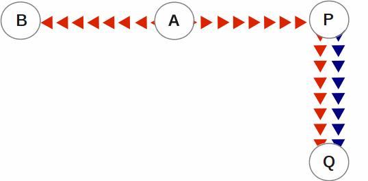

.. ###############################################################
.. #                                                             #
.. # Copyright (c) 2017-2021 YottaDB LLC and/or its subsidiaries.#
.. # All rights reserved.                                        #
.. #                                                             #
.. #     This source code contains the intellectual property     #
.. #     of its copyright holder(s), and is made available       #
.. #     under a license.  If you do not know the terms of       #
.. #     the license, please stop and do not read further.       #
.. #                                                             #
.. ###############################################################

.. index::
    Database Replication

====================================
7. Database Replication
====================================

.. contents::
   :depth: 5

------------------------
Introduction
------------------------

YottaDB replication provides logical equivalence between multiple databases. It facilitates continuous application availability, real-time decision support, warehousing, analytics, and auditing. There are two types of replication:

1. Business Continuity (BC) replication

2. Supplementary Instance (SI) replication

BC replication provides business continuity for systems of record. Updates applied at an originating instance replicate in near real-time to a replicating instance. To help ensure this consistency, BC replication prohibits locally generated database updates on a replicating secondary instance. For example, with instances named A and B, business logic processed on instance A can be streamed to instance B so that should A ever go down, B can immediately take over and provide continuity. In order to ensure that B produces results consistent with A, B can contain only material state information that is also in A.

Updates applied at an originating instance replicate in near real-time to as many as sixteen replicating instances, each of which can propagate further down to as many as sixteen replicating instances. Each replicating instance can further replicate to as many as sixteen replicating instances and so on. When an originating instance becomes unavailable, any downstream instance can become the replacement originating instance to keep the application available.

In the following illustration, A is the originating primary instance and B and C are its replicating instances. C is also a propagating primary instance because it further replicates to D. This BC replication configuration can also be described as a B←A→C→D configuration.

.. image:: bc_repl.gif

BC replication is intended for mission-critical applications that must be available 24 hours a day, 365 days a year, in the face of both unplanned events (such as system crashes) as well as planned events (such as system and software upgrades).

With BC replication, you can create a logical multi-site (LMS) replication configuration for mission critical applications that must always be available not only in the face of unplanned events (such as system or data center failures), but also in the face of planned events such as computing platform upgrades, OS upgrades, YottaDB upgrades and even application upgrades. Deploying a BC replication configuration should take into account available network capacities, operational preferences, risk assessments, and business continuity requirements.

SI replication allows replication from an instance A to another originating primary instance P. P can execute its own business logic to compute and commit its own updates to its database, while receiving a replication stream. In turn, P can have its own replicating secondary instance Q, and A can have its own replicating instance B. In such an SI replication configuration, only originating primary instances A and P can execute business logic and compute database updates. Replicating secondary instances B and Q are only permitted to receive and apply replication streams from their originating primary instances. The following diagram illustrates this configuration.

In this diagram, A is an originating primary instance having B and P as its replicating instance. P is another originating primary instance (supplementary instance) having Q as its replicating instance. This SI replication can also be described as a B←A→P→Q configuration.

SI replication is a general purpose mechanism whose utility includes applications such as real-time decision support, warehousing, analytics, and auditing.

.. note::
   In this book, instances {A, B, C...} denote systems of record (BC replication) and instances {P, Q, R...} denote instances that are not systems of record and which include the results of supplementary business logic.

YottaDB replication is asynchronous, which in turn, means that the source and receiver ends of a replication connection are at an identical state when there is no activity underway. To maintain consistency, and to restore it when restarting a replication connection, instances maintain a common, mutually coherent, instance-wide serial number called a journal sequence number. Each journal sequence number is tagged with two fields that identify the source of the update - a stream # that can take on values 0 through 15 and a stream sequence number (the journal sequence number of the update on the originating instance). Because replication deals with an entire global variable namespace, regardless of the mapping of global variables to database files, all updates participate in this numbering, even when modifying different database files. Each transaction (all updates bracketed by a pair of TSTART/TCOMMIT commands) has a journal sequence number, as does each update outside a transaction (so-called mini-transactions).

On instances that do not include updates from supplementary logic, the journal sequence number and the stream sequence number are the same.

Suppose sequence numbers in P are 100, 101, and 102. If the first and third transactions are locally generated and the second is replicated, the tagged journal sequence numbers might be something like {100,0,10}, {101,1,18}, {102,0,11}. The 0 stream # for 100 and 102 indicates those transactions are generated locally on P whereas stream # 1 indicates those transactions were generated in A. If P needs to roll {101,1,18} off its database in order to resychronize replication with A, database update serialization also requires it to roll {102,0,11} off as well, and both will appear in the Unreplicated Transaction Log (also known as the Lost Transaction File).

The journal sequence number on A becomes the stream sequence number on P for transactions replicated from A to P. In the example, the transaction that has the P sequence number of 101 has the sequence number 18 on A and B. The replication instance file in P contains information that allows YottaDB to determine this mapping, so that when P rolls {101,1,18} off its database, A knows that P has rolled off its transaction 18, and can include that when catching P up.

If P in turn implements BC replication to another instance Q, the tagging is propagated to Q, such that if A and P both go down (e.g., if they are co-located in a data center that loses electricity), B and C can take over the functions of A and P respectively, and Q can perform any synchronization needed in order to start accepting a replication stream from B as being a continuation of the updates generated by A, and B in turn accepts Q as the successor to P.

An LMS Group is a set of one or more instances that receive updates from the same originating primary instance and represent the same logical state. YottaDB implicitly forms an LMS Group by storing the identification of the originating primary instance in the replication instance file of each replicating instance. There are two types of LMS Groups:

1. BC Group: An LMS Group whose originating primary instance is a BC instance. A BC Group can have BC and SI instances as members.

2. SI Group: An LMS Group whose originating primary instance is an SI instance. An SI Group can have only SI instances as members and can receive replication only from a BC member of a BC Group.

BC members of a BC Group can replicate downstream to other BC and SI groups whereas an SI Group cannot replicate downstream to other groups.

.. note::
   Instances can change their roles within an LMS group but they cannot move between groups. However, data from one instance/group can be loaded into another group.

The following example illustrates a replication configuration where instance A from A's BC Group replicates to instance Q in Q's SI Group.

.. code-block:: none

   +-----------------+
   |      + A +      |
   |      | | |      |
   | B←---| | | --→P |
   +------- | -------+
            |
            |
   +--------V--------+
   |      + Q +      |
   |      |   |      |
   | R←---|   | --→S |
   +-----------------+

.. note::
   In this replication configuration, instance B can also replicate to instance Q. However, instance P cannot replicate to an instance in Q's group because it is an SI member of A's BC group.

YottaDB imposes no distance limits between instances. You can place instances 20,000 kilometers apart (the circumference of Planet Earth is 40,000 kilometers) or locally within the same data center.

Using TCP connections, YottaDB replicates between instances with heterogeneous stacks of hardware, operating system, endian architecture and even YottaDB releases. YottaDB replication can even be used in configurations with different application software versions, including many cases where the application software versions have different database schema. This also means that a number of inexpensive systems - such as GNU/Linux commodity servers - can be placed in locations throughout an organization. Replicating instances can be used for decision support, reporting, and analytics. Because YottaDB databases can be encrypted, these commodity servers are potentially usable in environments outside secure data centers as long as their operating systems and software are secured.

YottaDB replication requires journaling to be enabled and turned on for replicated regions. Unreplicated regions (for example, global variables containing information that is meaningful only in one instance and only as long as the instance is operating - such as process IDs, temporary working files and so on) need not be replicated or journaled.

The YottaDB replication mechanism is designed in such a way that a network failure between instances will not stop an application from being available, which is a limitation of techniques such as high availability clustering (see note). There are mechanisms in place for edge cases like processing "in flight" transactions and common cases like handling a backlog of updates after recovery from a network failure. While it is not possible to provide absolute continuity of business in our imperfect universe, an LMS configuration gives you the flexibility to choose application configurations that match your investment to a risk level that best meets the business needs of your organization.

.. note::
   YottaDB database replication is compatible with clustering - each instance can be a "hot-warm" cluster where if one node fails, another node can recover the database and continue operation. Since YottaDB LMS application configurations provide better business continuity in the face of a greater range of eventualities than clusters, if you wish to use clusters, consider their use in conjunction with, rather than instead of, YottaDB LMS configurations.

++++++++++++++++++++++++++++
Database Transaction Number
++++++++++++++++++++++++++++

Every transaction applied to a database file increments the database transaction number for that file. Each block records the database transaction number at which it was updated, and the Current Transaction field in the file header shows the value for the next transaction or mini-transaction to use. The following database file header fields all show database transaction numbers: Last Record Backup, Last Database Backup, Last Bytestream Backup, Maximum TN, and Maximum TN Warn.

Database transaction numbers are currently unsigned 64-bit integers.

While database activity uses database transaction numbers sequentially, not every transaction number can be found in a database block. For example, a Kill increments the database transaction number but can remove blocks with earlier database transaction numbers from the database.

Note that database transaction numbers are updated in memory and are only periodically flushed to secondary storage, so in cases of abnormal shutdown, the on-disk copies in the file header might be somewhat out-of-date.

+++++++++++++++++++++++++++++++
Journal Sequence Number
+++++++++++++++++++++++++++++++

While the database transaction number is specific to a database file, replication imposes a serialization of transactions across all replicated regions. As each transaction is placed in the Journal Pool, it is assigned the next journal sequence number. When a database file in a replicated instance is updated, the Region Seqno field in the file header records the journal sequence number for that transaction. The journal sequence number for an instance is the maximum Region Seqno of any database file in that instance. While it uses them in processing, YottaDB stores journal sequence numbers only in journal files. In database file headers, Zqgblmod Seqno and Zqgblmod Trans are journal sequence numbers.

Except for transactions in Unreplicated Transaction Logs, the journal sequence number of a transaction uniquely identifies that transaction on the originating primary instance and on all replicating secondary instances. When replicated via SI replication, the journal sequence number becomes a stream sequence number (see below) and is propagated downstream, thus maintaining the unique identity of each transaction.

Journal sequence numbers cannot have holes - missing journal sequence numbers are evidence of abnormal database activity, including possible manual manipulation of the transaction history or database state.

Journal sequence numbers are 60-bit unsigned integers.

+++++++++++++++++++++++++++++
Stream Sequence Number
+++++++++++++++++++++++++++++

The receiver of an SI replication stream has transactions that it receives via replication as well as transactions that it computes locally from business logic. As discussed earlier, while journal sequence numbers can uniquely identify a series of database updates, they cannot identify the source of those updates. Therefore, we have the concept of a stream sequence number.

On an originating primary instance that is not the recipient of an SI replication stream, the journal sequence number and the stream sequence number are the same.

On a primary instance that is the recipient of an SI replication stream, the journal sequence numbers uniquely identify and serialize all updates, whether received from replication or locally generated. However, there is also a stream sequence number, which is the journal sequence number for locally generated transactions and for replicated updates - the combination of a non-zero 4-bit tag (that is, with values 1 through 15) and the journal sequence number for the transaction on the system from which it was replicated. These stream sequence numbers are propagated to downstream replicating secondary instances.

Stream sequence numbers are 64-bit unsigned integers.

+++++++++++++++++++++++++++++++++++++++++++++
Using Multiple Instances in the same Process
+++++++++++++++++++++++++++++++++++++++++++++

YottaDB allows the updating of globals belonging to a different source instance using extended global references or SET $ZGBLDIR. While the replication setup remains the same, these are the main considerations:

* Use one of two ways to identify the current instance as specified by a replication instance file:

  * A global directory can define a mapping to a replication instance file as specified with a GDE CHANGE -INSTANCE -FILE_NAME=<replication_instance_file> command. When a global directory is use, if it has a mapping of an instance file, that mapping overrides any setting of the ydb_repl_instance environment variable. GDE CHANGE -INSTANCE -FILE_NAME="" removes any global directory mapping for an instance file.
  * The ydb_repl_instance environment variable specifies a replication instance file for utilities and as the default, whenever a user processes relies on a global directory with no instance file specification.

* In order to use multiple instances, at least one global directory must have an instance mapping.

* A replication instance file cannot share any region with another instance file.

* The Source Servers of all the instances have properly set up Replication Journal Pools.

* A TP transaction or a trigger, as it always executes within a TP transaction, must always restrict updates to globals in one replicating instance.

~~~~~
Notes
~~~~~

* Like other mappings specified by a global directory, a process determines any instance mapping by a global directory at the time a process first uses uses the global directory. Processes other than MUPIP CREATE ignore other (non-mapping) global directory database characteristics, except for collation, which interacts with mapping.

* When Instance Freeze is enabled (ydb_custom_errors is appropriately defined), a process attaches a region to an instance at the first access to the region; the access may be a read or a VIEW/$VIEW(). Otherwise, the process attaches to a region at the first update to that region. When the mappings are correct, this difference does not matter.

* A process can always update globals that are not in a replicated region.

* Use $VIEW("JNLPOOL") to determine the state of the current Journal Pool. $VIEW("JNLPOOL") returns the replication instance file name for the current Journal Pool and an empty string when there is no Journal Pool. Note that the current Journal Pool may not be associated with the last global accessed by an extended reference.

~~~~~~~~
Example:
~~~~~~~~

An EHR application uses a BC replication configuration (A->B) to provide continuous availability. There are two data warehouses for billing information and medical history. For research purposes, the data in these medical history warehouses is cleansed of patient identifiers. Two SI replication instances (Q->R) are setup for the two data warehouses.

The primary global directory (specified via the environment variable ydb_gbldir) includes the regions needed for the application proper. It may have the instance file as specified in the global directory or via the environment variable ydb_repl_instance. Each warehouse instance would have its own global directory (e.g. q.gld and r.gld). These global directories have an instance file specified with GDE CHANGE -INSTANCE -FILE_NAME=<replication_instance_file>.

Such a replication setup may benefit from this facility in the following ways:

* A trigger on the primary database A uses normal global references to update a staging global (say ^%BACKLOG) in a non-replicated region of A to store information meant for the warehouses. At an appropriate time, a separate batch process runs across the ^%BACKLOG staging global and applies updates using extended references to P or Q using a transaction or non-TP. If the transaction succeeds, the process removes the applied updates from ^%BACKLOG. Locks control access to ^%BACKLOG and enforce the serialization of updates to P

or

* The application does not use triggers but updates a global on A in a transaction. If the transaction succeeds, the application starts two more transactions for the warehouses. The second transaction uses extended references to update P. If it fails, the application updates ^%BACKLOG("P") on a non-replicated region of A. The third transaction uses extended references to update Q. If it fails, the application updates ^%BACKLOG("Q") on a non-replicated region of A. A batch process runs periodically to apply updates from ^%BACKLOG to P and Q using TP or non-TP and remove updates that have been applied. This batch process uses LOCKs to control access and enforce serialization of updates to P and Q.

.. note::
   Because this functionality has a wide variety of user stories (use cases) and has substantial complexity - although the code appears robust, we are not confident that we have exercised a sufficient breadth of use cases in our testing. We may also make changes in future releases that are not entirely backward compatible. We encourage you to use this facility in development and testing, and to provide us with feedback. If you are a YottaDB customer and wish to use this in production, please contact us beforehand to discuss your use case(s).

++++++++++++++++++
Examples
++++++++++++++++++

To make the following scenarios easier to understand, each update is prefixed with the system where it was originally generated and the sequence number on that system and any BC replicating secondary instances.

~~~~~~~~~~~~~~
Simple Example
~~~~~~~~~~~~~~

The three systems initially operate in roles O (Originating primary instance), R (BC Replicating secondary instance) and S (recipient of an SI replication stream).

+---------------------------------------+----------------------------------------+-------------------------------------------+-----------------------------------------------------------------------------------------+
| Ardmore                               | Bryn Mawr                              | Malvern                                   | Comments                                                                                |
+=======================================+========================================+===========================================+=========================================================================================+
| O: ... A95, A96, A97, A98, A99        | R: ... A95, A96, A97, A98              | S: ... M34, A95, M35, M36, A96, A97, M37, | Ardmore as an originating primary instance at transaction number A99, replicates to     |
|                                       |                                        | M38                                       | BrynMawr as a BC replicating secondary instance at transaction number A98 and Malvern as|
|                                       |                                        |                                           | a SI that includes transaction number A97, interspersed with locally generated updates. |
|                                       |                                        |                                           | Updates are recorded in each instance's journal files using before-image journaling.    |
+---------------------------------------+----------------------------------------+-------------------------------------------+-----------------------------------------------------------------------------------------+
| Crashes                               | O: ... A95, A96, A97, A98, B61         | S: ... M34, A95, M35, M36, A96, A97, M37, | When an event disables Ardmore, BrynMawr becomes the new originating primary, with A98  |
|                                       |                                        | M38                                       | as the latest transaction in its database, and starts processing application logic to   |
|                                       |                                        |                                           | maintain business continuity. In this case where Malvern is not ahead of BrynMawr, the  |
|                                       |                                        |                                           | Receiver Server at Malvern can remain up after Ardmore crashes. When BrynMawr connects, |
|                                       |                                        |                                           | its Source Server and Malvern's Receiver Server confirms that BrynMawr is not behind    |
|                                       |                                        |                                           | Malvern with respect to updates received from Ardmore, and SI replication from BrynMawr |
|                                       |                                        |                                           | picks up where replication from Ardmore left off.                                       |
+---------------------------------------+----------------------------------------+-------------------------------------------+-----------------------------------------------------------------------------------------+
| \-                                    | O: ... A95, A96, A97, A98, B61, B62    | S: ... M34, A95, M35, M36, A96, A97, M37, | Malvern operating as a supplementary instance to BrynMawr replicates transactions       |
|                                       |                                        | M38, A98, M39, B61, M40                   | processed on BrynMawr, and also applies its own locally generated updates. Although A98 |
|                                       |                                        |                                           | was originally generated on Ardmore, Malvern received it from BrynMawr because A97 was  |
|                                       |                                        |                                           | the common point between BrynMawr and Malvern                                           |
+---------------------------------------+----------------------------------------+-------------------------------------------+-----------------------------------------------------------------------------------------+
| ... A95, A96, A97, A98, A99           | O: ... A95, A96, A97, A98, B61, B62,   | S: ... M34, A95, M35, M36, A96, A97, M37, | Malvern, continuing as a supplementary instance to BrynMawr, replicates transactions    |
|                                       | B63, B64                               | M38, A98, M39, B61, M40, B62, B63         | processed on BrynMawr, and also applies its own locally generated updates. Meanwhile,   |
|                                       |                                        |                                           | Ardmore has been repaired and brought online. It has to roll transaction A99 off its    |
|                                       |                                        |                                           | database into an Unreplicated Transaction Log before it can start operating as a        |
|                                       |                                        |                                           | replicating secondary instance to BrynMawr.                                             |
+---------------------------------------+----------------------------------------+-------------------------------------------+-----------------------------------------------------------------------------------------+
| R: ... A95, A96, A97, A98, B61, B62,  | O: ... A95, A96, A97, A98, B61, B62,   | S: ... M34, A95, M35, M36, A96, A97, M37, | Having rolled off transactions into an Unreplicated Transaction Log, Ardmore can now    |
| B63, B64                              | B63, B64, B65                          | M38, A98, M39, B61, M40, B62, B63, M41,   | operate as a replicating secondary instance to BrynMawr. This is normal BC Logical      |
|                                       |                                        | B64                                       | Multi-Site operation. BrynMawr and Malvern continue operating as originating primary    |
|                                       |                                        |                                           | instance and supplementary instance.                                                    |
+---------------------------------------+----------------------------------------+-------------------------------------------+-----------------------------------------------------------------------------------------+

~~~~~~~~~~~~~~~~~~~~~~~~~~~~~~~~~~
Ensuring consistency with rollback
~~~~~~~~~~~~~~~~~~~~~~~~~~~~~~~~~~

In the last example, Malvern was not ahead when starting SI replication from BrynMawr - whereas in this example, asynchronous processing has left it ahead and it must rollback its database state before it can receive the replication stream.

+---------------------------------------+-----------------------------------------+------------------------------------------+------------------------------------------------------------------------------------------+
| Ardmore                               | Bryn Mawr                               | Malvern                                  | Comments                                                                                 |
+=======================================+=========================================+==========================================+==========================================================================================+
| O: ... A95, A96, A97, A98, A99        | R: ... A95, A96, A97                    | S: ... M34, A95, M35, M36, A96, A97, M37,| Ardmore, as an originating primary instance at transaction number A99, replicates to     |
|                                       |                                         | M38, A98, M39, M40                       | BrynMawr as a BC replicating secondary instance at transaction number A97 and Malvern as |
|                                       |                                         |                                          | an SI that includes transaction number A98, interspersed with locally generated updates. |
|                                       |                                         |                                          | Updates are recorded in each instance's journal files using before-image journaling.     |
+---------------------------------------+-----------------------------------------+------------------------------------------+------------------------------------------------------------------------------------------+
| Crashes                               | O: ... A95, A96, A97                    | ... M34, A95, M35, M36, A96, A97, M37,   | When an event disables Ardmore, BrynMawr becomes the new originating primary, with A97   |
|                                       |                                         | M38, A98, M39, M40                       | the latest transaction in its database. Malvern cannot immediately start replicating from|
|                                       |                                         |                                          | BrynMawr because the database states would not be consistent - while BrynMawr does not   |
|                                       |                                         |                                          | have A98 in its database and its next update may implicitly or explicitly depend on that |
|                                       |                                         |                                          | absence, Malvern does, and may have relied on A98 to compute M39 and M40.                |
+---------------------------------------+-----------------------------------------+------------------------------------------+------------------------------------------------------------------------------------------+
| \-                                    | O: ... A95, A96, A97, B61, B62          | S: ... M34, A95, M35, M36, A96, A97, M37,| For Malvern to accept replication from BrynMawr, it must roll off transactions generated |
|                                       |                                         | M38, B61                                 | by Ardmore, (in this case A98) that BrynMawr does not have in its database, as well as   |
|                                       |                                         |                                          | any additional transactions generated and applied locally since transaction number A98   |
|                                       |                                         |                                          | from Ardmore. [a]_ This rollback is accomplished with a MUPIP JOURNAL -ROLLBACK          |
|                                       |                                         |                                          | -FETCHRESYNC operation on Malvern. [b]_ These rolled off transactions (A98, M39, M40) go |
|                                       |                                         |                                          | into the Unreplicated Transaction Log and can be subsequently reprocessed by application |
|                                       |                                         |                                          | code. [c]_ Once the rollback is completed, Malvern can start accepting replication from  |
|                                       |                                         |                                          | BrynMawr. [d]_ BrynMawr in its Originating Primary role processes transactions and       |
|                                       |                                         |                                          | provides business continuity, resulting in transactions B61 and B62.                     |
+---------------------------------------+-----------------------------------------+------------------------------------------+------------------------------------------------------------------------------------------+
| \-                                    | O: ... A95, A96, A97, B61, B62, B63, B64| S: ... M34, A95, M35, M36, A96, A97, M37,| Malvern operating as a supplementary instance to BrynMawr replicates transactions        |
|                                       |                                         |  M38, B61, B62, M39a, M40a, B63          | processed on BrynMawr, and also applies its own locally generated updates. Note that M39a|
|                                       |                                         |                                          | & M40a may or may not be the same updates as the M39 & M40 previously rolled off the     |
|                                       |                                         |                                          | database.                                                                                |
+---------------------------------------+-----------------------------------------+------------------------------------------+------------------------------------------------------------------------------------------+

.. [a] As this rollback is more complex, may involve more data than the regular LMS rollback, and may involve reading journal records sequentially - it may take longer.

.. [b] In scripting for automating operations, there is no need to explicitly test whether BrynMawr is behind Malvern - if it is behind, the Source Server will fail to connect and report an error, which automated shell scripting can detect and effect a rollback on Malvern followed by a reconnection attempt by BrynMawr. On the other hand, there is no harm in Malvern routinely performing a rollback before having BrynMawr connect - if it is not ahead, the rollback will be a no-op.

.. [c] YottaDB's responsibility for them ends once it places them in the Unreplicated Transaction Log.

.. [d] Ultimately, business logic must determine whether the rolled off transactions can simply be reapplied or whether other reprocessing is required. YottaDB's $ZQGBLMOD() function can assist application code in determining whether conflicting updates may have occurred.

~~~~~~~~~~~~~~~~~~~~~~~~~~~~~~~~~~~~~~~~~~~~~~~~~~~~~~
Rollback not Desired or Required by Application Design
~~~~~~~~~~~~~~~~~~~~~~~~~~~~~~~~~~~~~~~~~~~~~~~~~~~~~~

In the example above, for Malvern to start accepting SI replication from BrynMawr with consistency requires it to rollback its database because it is ahead of BrynMawr. There may be applications where the design of the application is such that this rollback is neither required nor desired. YottaDB provides a way for SI replication to start in this situation without rolling transactions off into an Unreplicated Transaction File.

+----------------------------------------+-----------------------------------------+-------------------------------------------+-------------------------------------------------------------------------------------------+
| Ardmore                                | Bryn Mawr                               | Malvern                                   | Comments                                                                                  |
+========================================+=========================================+===========================================+===========================================================================================+
| O: ... A95, A96, A97, A98, A99         | R: ... A95, A96, A97                    | S: ... M34, A95, M35, M36, A96, A97, M37, | Ardmore as an originating primary instance at transaction number A99, replicates to       |
|                                        |                                         | M38, A98, M39, M40                        | BrynMawr as a BC replicating secondary instance at transaction number A97 and Malvern as  |
|                                        |                                         |                                           | a SI that includes transaction number A98, interspersed with locally generated updates.   |
|                                        |                                         |                                           | Updates are recorded in each instance's journal files using before-image journaling.      |
+----------------------------------------+-----------------------------------------+-------------------------------------------+-------------------------------------------------------------------------------------------+
| Crashes                                | O: ... A95, A96, A97, B61, B62          | ... M34, A95, M35, M36, A96, A97, M37,    | When an event disables Ardmore, BrynMawr becomes the new originating primary, with A97    |
|                                        |                                         | M38, A98, M39, M40                        | the latest transaction in its database and starts processing application logic. Unlike the|
|                                        |                                         |                                           | previous example, in this case, application design permits (or requires) Malvern to start |
|                                        |                                         |                                           | replicating from BrynMawr even though BrynMawr does not have A98 in its database and      |
|                                        |                                         |                                           | Malvern may have relied on A98 to compute M39 and M40.                                    |
+----------------------------------------+-----------------------------------------+-------------------------------------------+-------------------------------------------------------------------------------------------+
| \-                                     | O: ... A95, A96, A97, B61, B62          | S: ... M34, A95, M35, M36, A96, A97, M37, | With its Receiver Server started with the -noresync option, Malvern can receive an SI     |
|                                        |                                         | M38, A98, M39, M40, B61, B62              | replication stream from BrynMawr, and replication starts from the last common transaction |
|                                        |                                         |                                           | shared by BrynMawr and Malvern. Notice that on BrynMawr, no A98 precedes B61, whereas it  |
|                                        |                                         |                                           | does on Malvern, i.e., Malvern was ahead of BrynMawr with respect to the updates generated|
|                                        |                                         |                                           | by Ardmore.                                                                               |
+----------------------------------------+-----------------------------------------+-------------------------------------------+-------------------------------------------------------------------------------------------+

~~~~~~~~~~~~~~~~~~~~~~~~~~~~~~~~
Two Originating Primary Failures
~~~~~~~~~~~~~~~~~~~~~~~~~~~~~~~~

Now consider a situation where Ardmore and Malvern are located in one data center, with BC replication to BrynMawr and Newtown respectively, located in another data center. When the first data center fails, the SI replication from Ardmore to Malvern is replaced by the SI replication from BrynMawr to Newtown.

+-----------------------------+-----------------------------------+--------------------------------+----------------------------+------------------------------------------------------------------------------------------+
| Ardmore                     | Bryn Mawr                         | Malvern                        | Newtown                    | Comments                                                                                 |
+=============================+===================================+================================+============================+==========================================================================================+
| O: ... A95, A96, A97, A98,  | R: ... A95, A96, A97, A98         | S: ... M34, A95, M35, M36, A96,| R: ... M34, A95, M35, M36, | Ardmore as an originating primary instance at transaction number A99, replicates to      |
| A99                         |                                   | M37, A97, M38                  | A96, M37                   | BrynMawr as a BC replicating secondary instance at transaction number A98 and Malvern as |
|                             |                                   |                                |                            | a SI that includes transaction number A97, interspersed with locally generated updates.  |
|                             |                                   |                                |                            | Malvern in turn replicates to Newtown.                                                   |
+-----------------------------+-----------------------------------+--------------------------------+----------------------------+------------------------------------------------------------------------------------------+
| Goes down with the data     | O: ... A95, A96, A97, A98, B61,   | Goes down with the data center | ... M34, A95, M35, M36, A96| When a data center outage disables Ardmore, and Malvern, BrynMawr becomes the new        |
| center                      | B62                               |                                | , M37                      | originating primary, with A98 as the latest transaction in its database and starts       |
|                             |                                   |                                |                            | processing application logic to maintain business continuity. Newtown can receive the SI |
|                             |                                   |                                |                            | replication stream from BrynMawr, without requiring a rollback since the receiver is not |
|                             |                                   |                                |                            | ahead of the source.                                                                     |
+-----------------------------+-----------------------------------+--------------------------------+----------------------------+------------------------------------------------------------------------------------------+
| \-                          | O: ... A95, A96, A97, A98, B61,   | \-                             | S: ... M34, A95, M35, M36, | Newtown receives SI replication from BrynMawr and also applies its own locally generated |
|                             | B62                               |                                | A96, M37, A97, A98, N73,   | updates. Although A97 and A98 were originally generated on Ardmore, Newtown receives them|
|                             |                                   |                                | B61, N74, B62              | from BrynMawr. Newtown also computes and applies locally generated updates.              |
+-----------------------------+-----------------------------------+--------------------------------+----------------------------+------------------------------------------------------------------------------------------+
| ... A95, A96, A97, A98, A99 | O: ... A95, A96, A97, B61, B62,   | ... M34, A95, M35, M36, A96,   | S: ... M34, A95, M35, M36, | While BrynMawr and Newtown, keep the enterprise in operation, the first data center is   |
|                             | B63, B64                          | M37, A97, M38                  | A96, M37, A97, A98, N73,   | recovered. Since Ardmore has transactions in its database that were not replicated to    |
|                             |                                   |                                | B61, N74, B62, N75, B63,   | BrynMawr when the latter started operating as the originating primary instance, and since|
|                             |                                   |                                | N76, B64                   | Malvern had transactions that were not replicated to Newtown when the latter took over,  |
|                             |                                   |                                |                            | Ardmore and Malvern must now rollback their databases and create Unreplicated Transaction|
|                             |                                   |                                |                            | Files before receiving BC replication streams from BrynMawr and Newtown respectively.    |
|                             |                                   |                                |                            | Ardmore rolls off A98 and A99, Malvern rolls off A97 and M38.                            |
+-----------------------------+-----------------------------------+--------------------------------+----------------------------+------------------------------------------------------------------------------------------+
| R: ... A95, A96, A97, B61,  | O: ... A95, A96, A97, B61, B62,   | R: ... M34, A95, M35, M36, A96,| S: ... M34, A95, M35, M36, | Having rolled off transactions into an Unreplicated Transaction Log, Ardmore can now     |
| B62, B63, B64               | B63, B64, B65                     | M37, A97, A98, N73, B61, N74,  | A96, M37, A97, A98, N73,   | operate as a replicating secondary instance to BrynMawr. This is normal BC Logical       |
|                             |                                   | B62, N75, B63, N76, B64        | B61, N74, B62, N75, B63,   | Multi-Site operation. BrynMawr and Malvern continue operating as originating primary     |
|                             |                                   |                                | N76, B64, N77              | instance and supplementary instance. Note that having rolled A97 off its database,       |
|                             |                                   |                                |                            | Malvern receives that transaction from Newtown as it catches up.                         |
+-----------------------------+-----------------------------------+--------------------------------+----------------------------+------------------------------------------------------------------------------------------+

~~~~~~~~~~~~~~~~~~~~~~~~~~~~~~~
Replication and Online Rollback
~~~~~~~~~~~~~~~~~~~~~~~~~~~~~~~

Consider the following example where Ardmore rolls back its database in state space while an application is in operation, using the MUPIP JOURNAL -ROLLBACK -BACKWARD -ONLINE feature.

+----------------------------------------+--------------------------------------------+-----------------------------------------+------------------------------------------------------------------------------------------+
| Ardmore                                | Bryn Mawr                                  | Malvern                                 | Comments                                                                                 |
+========================================+============================================+=========================================+==========================================================================================+
| O: ... A95, A96, A97, A98, A99         | R: ... A95, A96, A97                       | S: ... M34, A95, M35, M36, A96, A97,    | Ardmore, as an originating primary instance at transaction number A99, replicates to     |
|                                        |                                            | M37, M38, A98, M39, M40                 | BrynMawr as a BC replicating secondary instance at transaction number A97 and Malvern as |
|                                        |                                            |                                         | an SI that includes transaction number A98, interspersed with locally generated updates. |
|                                        |                                            |                                         | Updates are recorded in each instance's journal files using before-image journaling.     |
+----------------------------------------+--------------------------------------------+-----------------------------------------+------------------------------------------------------------------------------------------+
| Rolls back to A96 with A97 through A99 | Rolls back automatically to A96 (assume    | \-                                      | Instances receiving a replication stream from Ardmore can be configured to rollback      |
| in the Unreplicated Transaction Log    | Receiver Server started with -autorollback |                                         | automatically when Ardmore performs an online rollback by starting the Receiver Server   |
|                                        | - refer to the V5.5-000 Release Notes for  |                                         | with -autorollback. If Malvern's Receiver Server is so configured, it will roll A97      |
|                                        | details                                    |                                         | through M40 into an Unreplicated Transaction Log. This scenario is straightforward.      |
|                                        |                                            |                                         | But with the -noresync qualifier, the Receiver Server can be started configured to simply|
|                                        |                                            |                                         | resume replication without rolling back, and that scenario is developed here.            |
+----------------------------------------+--------------------------------------------+-----------------------------------------+------------------------------------------------------------------------------------------+
| O: ... A95, A96, A97a, A98a, A99a      | R: ... A95, A96, A97a, A98a                | S: ... M34, A95, M35, M36, A96, A97,    | Transactions A97a through A99a are different transactions from A97 through A99 (which    |
|                                        |                                            | M37, M38, A98, M39, M40, A97a, M41,     | are in an Unreplicated Transaction File on Ardmore and must be reprocessed). Note that   |
|                                        |                                            | A98a, M42                               | Malvern has both the original A97 and A98 as well as A97a and A98a. A99 was never        |
|                                        |                                            |                                         | replicated to Malvern - Ardmore rolled back before it was replicated, and A99a has not   |
|                                        |                                            |                                         | yet made it to Malvern (it will soon, unless Ardmore rolls back again).                  |
+----------------------------------------+--------------------------------------------+-----------------------------------------+------------------------------------------------------------------------------------------+

++++++++++++++++++++++++++++++++++++++++++++
Limitations- SI Replication
++++++++++++++++++++++++++++++++++++++++++++

Although a receiver of SI replication can source a BC replication stream for downstream propagation, it cannot source an SI replication stream. So, in the example above, while Malvern can receive SI replication from Ardmore or BrynMawr, and it can source a BC replication stream to Newtown, which can in turn source a BC replication stream to Oxford. Thus, none of Malvern, Newtown or Oxford can source an SI replication stream.

Also an instance can only receive a single SI replication stream. Malvern cannot receive SI replication from an instance other than Ardmore (or an instance receiving BC replication from Ardmore, such as BrynMawr). Newtown or Oxford are replicating secondary instances and can receive no updates other than from Malvern.

The total number of replication streams that an instance can source is sixteen, with any combination of BC and SI replication.

+++++++++++++++++++++++++++++++
Replication Architecture
+++++++++++++++++++++++++++++++

The following diagram illustrates a BC replication configuration deployed as B←A→C. White (top) is the originating instance processing business logic, while Rose (left) and Yellow (right) are replicating instances. The dotted line represents a TCP connection and the red dots show the movement of transactions. If White goes down in an unplanned or planned event, either Rose or Yellow can become the originating instance within seconds to tens of seconds, and the other instance can become a replicating instance to the new originating instance. When White recovers, it rejoins as a replicating instance to the new originating instance. At some suitable future time, when so desired, White can be made the originating instance again.

.. image:: repl_anim.gif

When a process commits a transaction on White, YottaDB provides Durability by writing and "hardening" an update record to the journal file and then the database file. The same process also writes the update records to an area of shared memory called a Journal Pool as part of committing the transaction, but does not wait for Rose and Yellow to commit the transaction (this means that a failure of the network between instances does not stop application operation on White). Two Source Server processes, one for Rose and one for Yellow, read journal update records from the Journal Pool and stream updates over TCP connections to Receiver Server processes on the replicating instances they serve.

Under normal conditions, White Source Servers stream update records from the Journal Pool to the Rose and Yellow Receiver Servers. The Journal Pool is a shared memory segment that does not expand after its initial creation. If updates for the database state to which the replicating instance needs to catch up are no longer in the Journal Pool, the Source Server finds the updates in journal files, until the replicating instance catches up to the point where the remaining required updates can again come from the Journal Pool. The diagram represents this with the curved lines from the journal file to the Source Server processes.

A Source Server (see Note) can be in either of two modes--active mode or passive mode.

.. note::
    The first Source Server process started on an instance creates the Journal Pool.

In active mode, a Source Server connects to the Receiver Server on its replicating instance and transfers update records from the Journal Pool via the communication channel. If an active Source Server is not connected to its Receiver Server, it makes repeated attempts to connect until it succeeds. When an active Source Server connects with its Receiver Server, they ensure their two instances are in sync before proceeding with replication. In the diagram, the White Source Servers are in active mode. When an active Source Server receives a command to switch to passive mode, it closes the connection with its Receiver Server and "goes to sleep" until it receives a command to become active.

In passive mode, a Source Server is in a stand-by state. In the diagram, the Rose and Yellow Source Servers are in passive mode. When a passive Source Server receives a command to switch to active mode, it attempts to establish a connection with the specified Receiver Server on its replicating instance.

Under typical operating conditions, with no system or network bottlenecks, YottaDB moves a transaction off the originating instance and into the care of the network moving towards its replicating instance in sub-millisecond time frames. Network transit times then determine how long the transaction message takes to reach the replicating instance. Because it uses a change- or delta-based protocol, YottaDB Replication uses network bandwidth efficiently. Furthermore, the Source Server can compress the byte stream which the Receiver Server then decompresses; alternatively network routers can perform the compression and decompression. You can use standard techniques at the stack or router for encrypting TCP connections to secure replication.

On Rose and Yellow instances, a Receiver Server receives update records sent by the White Source Server and puts them in the Receive Pool, which is in a shared memory segment. Source and Receiver Server processes implement flow control to ensure that the Receive Pool does not overflow. The Update Process picks these update records and writes them to the journal file, the database file, and the Journal Pool. The Update Process on a replicating instance performs operations analogous to "Application Logic" on the originating instance.

~~~~~~~~~~~~~~~~
Helper Processes
~~~~~~~~~~~~~~~~

Helper processes accelerate the rate at which an Update Process can apply an incoming replication stream to the database on a replicating instance. They increase replication throughput, decrease backlog, and improve manageability.

The YottaDB database engine performs best when multiple processes concurrently access the database, cooperating with one another to manage it. Therefore, it is possible for the tens, hundreds or thousands of application processes executing on an originating instance to outperform a replicating instance with only a single Update Process. Helper processes enable the update process to apply database updates faster and thereby keep up.

There are two types of helper processes:

1. Reader: Reader processes read the update records in the Receive Pool and attempt to pre-fetch database blocks into the global buffer pools, so they are more quickly available for the Update Process.
2. Writer: Writer processes help the Update Process by flushing database and journal records from shared memory (global and journal buffers) to the file system.

A certain number of each type of helper process maximizes throughput. As a practical matter, as long as the file system bandwidth on a replicating instance is equal to or greater than that of the originating instance providing its replication stream, there need be little concern about having too many helper processes.

.. note::
   There may be other reasons for a replicating instance to lag behind its originating instance during replication. Helper processes cannot improve situations such as the following: There is a bottleneck in the network between the originating and replicating instances (increase the network bandwidth or use compression) or the hardware of the replicating instance is not as capable as that of the hardware on the originating instance (upgrade the hardware of the replicating instance).

.. _Filters:

~~~~~~~
Filters
~~~~~~~

A Filter is a conversion program that transforms a replication stream to a desired schema. It operates as a traditional UNIX filter, reading from STDIN and writing to STDOUT. Both input and output use the YottaDB journal extract format. A filter can operate on an originating instance or a replicating instance. When the originating instance is an older application version, a filter can change the update records from the old schema to the new schema. When the originating instance is the newer application version, a filter can change the update records from the new schema to the old schema. Once you have logic for converting records in the old schema to the new schema, the per record code serves as the basis for the filter by replacing the scanning logic with logic to read the extract format and extract the update and completing the filter by reassembling the revised record(s) into the YottaDB extract format.

For complete redundancy during rolling upgrades, you must also have a filter that changes transactions from the new schema to the old schema. The principal restriction in creating schema change filters is that the filter must not change the number of transactions in the replication stream, since YottaDB uses the journal sequence numbers for checking and restoring the logical equivalence of instances.

This means:

* If a replication stream contains transactions, for each input transaction, the filter must produce one and exactly one output transaction. It's acceptable for a transaction to be empty, that is, to make no database updates.

* If an update in a replication stream is outside a transaction, it is considered a transaction in that the journal sequence number is to be incremented by one.

* If the schema change requires a single database update, simply emit the new update in the output stream.

* If the schema change requires no database updates in the new schema, emit a single empty transaction.

* If the schema change requires multiple database updates in the new schema, create a transaction, and package all the updates inside that transaction.

~~~~~~~~~~~~~~~~~~~~~~~~~
Replication Instance File
~~~~~~~~~~~~~~~~~~~~~~~~~

A Replication Instance file maintains the current state of an instance. It also serves as a repository of the history of the journal sequence numbers that are generated locally or received from other instances.

It includes three sections:

* File Header
* Source Server slots
* History Records.

The **File Header** section records information about the current instance, such as semaphores and shared memory ids of the Journal and Receive Pool, journal sequence number of the current instance.

The **Source Server slots** store information for each replicating instance for which a Source Server is started. A slot stores the name of the replicating instance, the last transmitted sequence number, and the sequence number when the Source Server was last connected to the originating instance (Connect Sequence Number).

A Replication Instance file has 16 slots. Initially, all are unused. A Source Server replicating to a replicating instance for the first time utilizes an unused slot to store the information and any future Source Server process replicating to the same replicating instance updates this information.

If an unused slot is not available, the first time a Source Server is started to replicate to an instance, the slot for the least recently started replicating instance is reused, and the information that is previously stored in that slot is overwritten. Any subsequent mupip replic -source on the preempted replicating instance generates a REPLINSTSECNONE message.

Preemption of slots does not occur if an instance connects to no more than 16 different replicating instances throughout its lifetime.

In the **History Records** section, the history of an instance is maintained as a set of records. A new history record is added to the tail of the instance file whenever an instance changes from being an originating instance to a replicating instance or vice versa - the only exception being when a history record is removed from the tail of the instance file when updates are rolled back from the database as part of a MUPIP JOURNAL -ROLLBACK. Every record identifies a range of journal sequence numbers and the name of the originating instance that generated those journal records. The first history record starts with the current journal sequence number of the instance.

When an originating instance transmits a sequence number to a replicating instance, the originating instance name is recorded as the "Root Primary Instance Name" in the replication instance file history of both the instances. The same rule applies when a replicating instance is acting as an originating instance for another replicating instance downstream.

This history serves to determine the journal sequence numbers through which both instances are synchronized when two instances attempt to connect. This journal sequence number is determined by going back in the history of both instance files to find the most recent shared journal sequence number generated by the Originating Instance. If the shared journal sequence number matches the current journal sequence number of the replicating instance, the Receiver Server on the replicating instance continues with normal replication. Otherwise, a synchronization requires a MUPIP JOURNAL -ROLLBACK -FETCHRESYNC on the Replicating Instance to rollback to a common synchronization point from which the originating instance can transmit updates to allow the Replicating Instance to catch up.

.. note::
   Proper operation requires the Replication Instance file be consistent with the snapshot of the database files in a backup. MUPIP BACKUP -REPLINSTANCE creates a backup of the Replication Instance file. Before backing up the replication instance file, you must start the Source Server for the instance at least once. If the replication instance file is damaged or deleted, you must create a new instance file, and recreate all downstream Replicating Instances from backups.

--------------------------------------
Implementing Replication and Recovery
--------------------------------------

A transaction processing application makes a series of database updates. YottaDB executes these updates online or from data-driven logic, commonly called "batch."

1. Online Update: An online update arrives at YottaDB as a message from a client.
2. Driven by internal information, such as balances at end-of day, or external information, such as a list of checks from a clearinghouse.

The processing model in each case is a transaction or a unit of work initiated by client input such as a request to transfer funds from one account to another, or as the next logical unit of work such as posting interest on the next account. This general model holds both for applications where users login directly to a host (perhaps using terminal emulation from a workstation) and those where a client communicates with a host server process. This section lists key considerations for a transaction processing application to:

* reliably perform online and batch updates on YottaDB
* implement an LMS configuration in a tiered environment and
* facilitate recovery in a switchover event

++++++++++++++++++++++++
Application Architecture
++++++++++++++++++++++++

YottaDB recommends you plan upfront for database consistency while designing the architecture of an LMS application. Some of the planning parameters for application's architecture may include:

* Always package all database updates into transactions that are consistent at the level of the application logic using the TSTART and TCOMMIT commands. For information on commands, refer to the `"Commands" chapter in the Programmer's Guide <../ProgrammersGuide/commands.html>`_. For any updates not so packaged, ensure that the database is logically consistent at the end of every M statement that updates the database; or that there is application logic to check, and restore application-level consistency when the database recovers after a crash.

* Ensure that internally driven batch operations store enough information in the database to enable an interrupted batch operation to resume from the last committed transaction. In case an originating instance fails in the middle of a batch process, a new originating instance (previously a replicating instance) typically must resume and complete the batch process.

* If the application cannot or does not have the ability to restart batch processes from information in the database, copy a snapshot of the database to a replicating instance just before the batch starts. In case an originating instance fails, restore the new originating instance to the beginning of the batch operations, and restart the batch operation from the beginning on the new originating instance.

* Ensure that externally driven batch processing also has the ability to resume. The external file driving the batch operation must be available on the replicating instance before starting the batch operation on the originating instance. This is required to handle originating instance failure during the batch process.

* YottaDB produces an error for updates outside the set of database files defined by the instance file. External references are not prohibited as such. In other words, there can be a global directory and instance configurations where an external reference update falls within the instance and works correctly. Read references outside an instance are permitted because they currently do not engage replication.

This diagram illustrates an application architecture that can reliably perform batch and online updates in a tiered environment. It addresses the online updates via the Message Transport (which has to be able to reroute communications to the current originating instance after a switchover) and batch updates via an external file (which has to be made available to the current originating instance after a switchover).

An application server is a YottaDB process that accepts, processes, and responds to messages provided through the Message Transport. They may exist as a bunch of application servers in a "cloud" of size determined by the size of the node and the needs of the application. On the originating instance, an application server process receives messages and processes application transactions. The application logic issues the TSTART command and a series of SET (also KILL and MERGE) commands that [potentially/provisionally] update the database, then a TCOMMIT command to finalize the transaction. The process may directly WRITE a reply, but another process may act as an agent that takes that reply from a database record and sends it to the originator.

~~~~~~~~~~~~~~~~~~~~~~~~~~~~~~~~~~~
Implement a Message Delivery System
~~~~~~~~~~~~~~~~~~~~~~~~~~~~~~~~~~~

This section describes how a well-designed messaging system makes an application's architecture more switchover-ready by using an example in which the originating instance fails after the TCOMMIT, but before the system generates a reply and transmits it to the client.

As noted in the previous section, application servers on the originating instance respond to messages from clients delivered over a network for online operations in a tiered environment. Each client message results in zero (inquiry) or one update transaction on the server. The network delivering messages must be robust. This means each message must either be delivered exactly once to an application server on the originating instance, or result in client notification of the delivery failure. The messaging system must handle situations such as failure on the originating instance after the client transmits the message but before the originating instance receives it. Integration of the message delivery system with the logic determining whether an instance is an originating instance or replicating instance at any time reduces risk and switch over time.

Application logic typically responds to client messages with a reply generated immediately after the TCOMMIT for a transaction. The application and the message architecture must handle the scenario in which the originating system fails after the TCOMMIT, but before the system generates a reply and transmits it to the client. In such a scenario, the client waits for a response and eventually times out and retries the message.

An LMS application can handle this situation by designing the message structure to have a unique message identifier (MSGID), and the application to include the MSGID in the database as part of the TCOMMIT.

If the originating instance crashes after committing the transaction and the switchover logic makes the former replicating instance the new originating instance - The new originating instance receives the retried message that has the same MSGID from the client. In this case, one of the following can occur:

* The database shows that the transaction corresponding to the MSGID in the message was processed. The server could then reply that this transaction was processed. A more sophisticated approach computes the response to the client within the transaction, and stores it in the database as part of the transaction commit. Upon receipt of a message identified as a retry of a previously processed message, the server returns the stored response from the database to the client.

* The database shows the transaction as unprocessed. In this case, the new originating instance processes the transaction. At this time, it is unknown whether the former originating instance processed the transaction before going down. If it was not processed, there is no issue. If it was processed but not replicated, YottaDB rollback logic rolls it back when the former originating instance comes up as a replicating instance, and it must be reconciled either manually or automatically, from the rollback report (since the result of processing the first time may be different from the result of processing the second time).

+++++++++++++++++++++++++++++++
System Requirements
+++++++++++++++++++++++++++++++

This section describes the system requirements that are necessary to implement an application with an LMS configuration.

~~~~~~~~~~~~~~~~~~~~~~~~~~~~~~~~~~
Root Primary Status Identification
~~~~~~~~~~~~~~~~~~~~~~~~~~~~~~~~~~

YottaDB does not make any decisions regarding originating or replicating operations of an instance. You must explicitly specify -ROOTPRIMARY to identify an instance as current originating instance during application startup.

To implement a robust, continuously available application, each application instance must come up in the correct state. In particular, there must be exactly one originating instance (-ROOTPRIMARY) at any given time. All database update operations on replicated databases must take place on the originating instance. LMS prohibits independent logical database updates on instances other than the originating instance.

.. note::
   MUPIP BACKUP -ONLINE and MUPIP REORG -ONLINE update control information or physical representations, not the logical database contents, and can operate freely on a replicating instance.

+++++++++++++++++++++++
Switchover
+++++++++++++++++++++++

Switchover is the process of reconfiguring an LMS application so that a replicating instance takes over as the current originating instance. This might be a planned activity, such as bringing down the originating instance for hardware maintenance, or it may be unplanned such as maintaining application availability when the originating instance or the network to the originating instance goes down.

Implementing and managing switchover is outside the scope of YottaDB. YottaDB recommends you to adhere to the following rules while designing switchover:

1. Always ensure that there is only one originating instance at any given time where all database updates occur. If there is no originating instance, the LMS application is also not available.
2. Ensure that messages received from clients during a switchover are either rejected, so the clients timeout and retry, or are buffered and sent to the new originating instance.
3. Always configure a former originating instance to operate as a replicating instance whenever it resumes operations or comes back online after a crash.
4. Failing to follow these rules may result in the loss of database consistency between an originating instance and its replicating instances.

.. note::
   A switchover is a wholesome practice for maximizing business continuity. YottaDB strongly recommends setting up a switchover mechanism to keep a YottaDB application up in the face of disruptions that arise due to errors in the underlying platform. In environments where a switchover is not feasible due to operational constraints, consider setting up an Instance Freeze mechanism for your application. For more information, refer to “Instance Freeze” below.

.. _instance-freeze:

+++++++++++++++++++++++++
Instance Freeze
+++++++++++++++++++++++++

In the event of run-time conditions such as no disk space, I/O problems, or disk structure damage, some operational policies favor deferring maintenance to a convenient time as long as it does not jeopardize the functioning of the YottaDB application. For example, if the journal file system runs out of disk space, YottaDB continues operations with journaling turned off and moves to the replication WAS_ON state until journaling is restored. If there is a problem with one database file or journal file, processes that update other database regions continue normal operation.

Some operational policies prefer stopping the YottaDB application in such events to promptly perform maintenance. For such environments, YottaDB has a mechanism called "Instance Freeze".

The Instance Freeze mechanism provides an option to stop all updates on the region(s) of an instance as soon as a process encounters an error while writing to a journal or database file. This mechanism safeguards application data from a possible system crash after such an error.

The environment variable ydb_custom_errors specifies the complete path to the file that contains a list of errors that should automatically stop all updates on the region(s) of an instance. The error list comprises of error mnemonics (one per line and in capital letters) from the `Messages and Recovery Procedures Manual <../MessageRecovery/index.html>`_.

MUPIP REPLIC -SOURCE -JNLPOOL -SHOW displays whether the custom errors file is loaded.

.. note::
   When a processes that is part of an instance configured for instance freeze behavior encounters an error with journaling, it freezes the instance and invokes its own error trap even if it does not have the ydb_custom_errors environment variable set.

You can enable the Instance Freeze mechanism selectively on any region(s) of an instance. For example, a region that represents a patient or financial record may qualify for an Instance Freeze whereas a region with an easily rebuilt cross reference index may not. You can also promptly freeze an instance irrespective of whether any region is enabled for Instance Freeze.

MUPIP SET -[NO]INST[_FREEZE_ON_ERROR] [-REGION|-FILE] enables custom errors in region to automatically cause an Instance Freeze. MUPIP REPLICATE -SOURCE -FREEZE={ON|OFF} -[NO]COMMENT[='"string"'] promptly sets or clears an Instance Freeze on an instance irrespective of whether any region is enabled for Instance Freeze (with MUPIP SET -INST_FREEZE_ON_ERROR). The specified region name is case-insensitive.

A process that is not in a replicated environment ignores $ydb_custom_errors. The errors in the custom errors file must have a context in one of the replicated regions and the process recognizing the error must have the replication Journal Pool open. For example, an error like UNDEF cannot cause an Instance Freeze because it is not related to the instance. It also means that, for example, standalone MUPIP operations can neither cause nor honor an Instance Freeze because they do not have access to the replication Journal Pool. A process with access to the replication Journal Pool must honor an Instance Freeze even if it does not have a custom error file and therefore cannot initiate an Instance Freeze.

Depending on the error, removing an Instance Freeze is operator driven or automatic. YottaDB automatically removes Instance Freezes that are placed because of no disk space; for all other errors, Instance Freeze must be cleared manually by operator intervention. For example, YottaDB automatically places an Instance Freeze when it detects a DSKNOSPCAVAIL message in the operator log. It automatically clears the Instance Freeze when an operator intervention clears the no disk space condition. During an Instance Freeze, YottaDB modifies the NOSPACEEXT message from error (-E-) to warning (-W-) to indicate it is performing the extension even though the available space is less than the specified extension amount. The following errors are listed in the custom_errors_sample.txt file. Note that YottaDB automatically clears the Instance Freeze set with DSKNOSPCAVAIL when disk space becomes available. All other errors require operator intervention.

* Errors associated with database files caused by either I/O problems or suspected structural damage: DBBMLCORRUPT, DBDANGER, DBFSYNCERR, DSKNOSPCAVAIL, GBLOFLOW, GVDATAFAIL, GVDATAGETFAIL, GVGETFAIL, GVINCRFAIL, GVKILLFAIL, GVORDERFAIL, GVPUTFAIL, GVQUERYFAIL, GVQUERYGETFAIL, GVZTRIGFAIL, OUTOFSPACE, TRIGDEFBAD.

* Errors associated with journal files caused by either I/O problems or suspected structural damage: JNLACCESS, JNLCLOSE, JNLCLOSED, JNLEXTEND, JNLFILECLOSERR, JNLFILEXTERR, JNLFILOPN, JNLFLUSH, JNLFSYNCERR, JRTNULLFAIL, JNLRDERR, JNLREAD, JNLVSIZE, JNLWRERR.

During an Instance Freeze, attempts to update the database and journal files hang but operations like journal file extract which do not require updating the database file(s) continue normally. When an Instance Freeze is cleared, processes automatically continue with no auxiliary operational or programmatic intervention. The Instance Freeze mechanism records both the freeze and the unfreeze in the operator log.

.. note::
   Because there are a large number of errors that YottaDB can recognize and because YottaDB has several operational states, the YottaDB team has tested errors consistent with what we expect to be common usage. If you experience problems trying to add other errors or have concerns about plans to add other errors, please consult your YottaDB support channel.

+++++++++++++++++++++++
TLS/SSL Replication
+++++++++++++++++++++++

YottaDB includes a plugin reference implementation that provides the functionality to secure the replication connection between instances using Transport Layer Security (TLS; previously known as SSL). Just as database encryption helps protect against unauthorized access to a database by an unauthorized process that is able to access disk files (data at rest), the plugin reference implementation secures the replication connection between instances and helps prevent unauthorized access to data in transit. YottaDB has tested the replication operations of the TLS plugin reference implementation using OpenSSL (http://www.openssl.org). A future YottaDB release may include support for popular and widely available TLS implementations/cryptography packages other than OpenSSL. Note that a plug-in architecture allows you to choose a TLS implementation and a cryptography package. YottaDB neither recommends nor supports any specific TLS implementation or cryptography package and you should ensure that you have confidence in and support for whichever package that you intend to use in production.

.. note::
   Database encryption and TLS/SSL replication are just two of many components of a comprehensive security plan. The use of database encryption and TLS replication should follow from a good security plan. This section discusses encrypted YottaDB replicating instances and securing the replication connection between them using TLS/SSL; it does not discuss security plans. You can setup TLS replication between instances without using YottaDB Database Encryption. YottaDB Database Encryption is not a prerequisite to using TLS replication.

The general procedure of creating a TLS replication setup includes the following tasks:

1. Create a new database or use an existing one.

2. Creating a root-level certification authority

3. Creating leaf-level certificates

4. Creating a configuration file

5. Enabling replication and starting the Source and Receiver Servers with the TLSID qualifier.

~~~~~~~~~~~~~~~~~~~~~~~~~~~~~~~~~~~~~~~~~~~~~
Creating a root-level certification authority
~~~~~~~~~~~~~~~~~~~~~~~~~~~~~~~~~~~~~~~~~~~~~

To use TLS, the communicating parties need to authenticate each other. If the authentication succeeds, the parties encrypt the subsequent communication. TLS authentication uses certificates signed by Certificate Authorities (CAs). Certificate Authorities' certificates themselves are signed (and trusted) by other CAs eventually leading to a Root CA, which self-signs its own certificate. Although the topic of certificates, and the use of software such as OpenSSL is well beyond the scope of YottaDB documentation, the steps below illustrate the quick-start creation of a test environment using Source and Receiver certifications with a self-signed Root CA certificate.

Creating a root certificate authority involves three steps:

1. Generate a private key with the OpenSSL command: openssl genrsa -des3 -out ca.key 4096. The command prompts for a password with which to protect the private key.

2. Generate a self-signed certificate with the OpenSSL command: openssl req -new -x509 -days 365 -key ca.key -out ca.crt. The command first prompts for the password of the private key followed by a series of interactive queries regarding the attributes of the certificate. Below is sample output:

   .. code-block:: bash

      Enter pass phrase for ca.key:
      You are about to be asked to enter information that will be incorporated into your certificate request.
      What you are about to enter is what is called a Distinguished Name or a DN.
      There are quite a few fields but you can leave some blank
      For some fields there will be a default value,
      If you enter '.', the field will be left blank.

...
  .. code-block:: bash

     Country Name (2 letter code) [AU]:US
     State or Province Name (full name) [Some-State]:PA
     Locality Name (eg, city) []:Malvern
     Organization Name (eg, company) [Internet Widgits Pty Ltd]:YottaDB
     Organizational Unit Name (eg, section) []:Certificate Authority
     Common Name (e.g. server FQDN or YOUR name) []:yottadb.com
     Email Address []:info@yottadb.com

3. At this point, ca.crt is a root certificate that can be used to sign other certificates (including intermediate certificate authorities). The private key of the root certificate must be protected from unauthorized access.

~~~~~~~~~~~~~~~~~~~~~~~~~~~~~~~~
Creating Leaf-level certificates
~~~~~~~~~~~~~~~~~~~~~~~~~~~~~~~~

The root certificate is used to sign regular, leaf-level certificates. Below are steps showing the creation of a certificate to be used to authenticate a YottaDB Source Server with a YottaDB Receiver Server (and vice-versa).

1. Generate a private key. This is identical to step 1 of root certificate generation.

2. Generate a certificate sign request with the OpenSSL command openssl req -new -key client.key -out client.csr. The command first prompts for the password of the private key followed by a series of interactive queries regarding the attributes of the certificate. Below is sample output:

   .. code-block:: bash

      Enter pass phrase for client.key:
      You are about to be asked to enter information that will be incorporated into your certificate request.
      What you are about to enter is what is called a Distinguished Name or a DN.
      There are quite a few fields but you can leave some blank
      For some fields there will be a default value,
      If you enter '.', the field will be left blank.

...
   .. code-block:: bash

      Country Name (2 letter code) [AU]:US
      State or Province Name (full name) [Some-State]:PA
      Locality Name (eg, city) []:Malvern
      Organization Name (eg, company) [Internet Widgits Pty Ltd]:YottaDB
      Organizational Unit Name (eg, section) []: OurSourceServer
      Common Name (e.g. server FQDN or YOUR name) []:yottadb.com
      Email Address []:xyzq@yottadb.com
      Please enter the following 'extra' attributes to be sent with your certificate request
      A challenge password []:challenge
      An optional company name []:YottaDB

Typically, the organization that generates the certificate sign then sends it to a certificate authority (or a root certificate authority), which audits the request and signs the certificate with its private key, thereby establishing that the certificate authority trusts the company/organization that generated the certificate and requested its signing. In this example, we sign the certificate sign request with the root certificate generated above.

3. Sign the certificate sign request with an OpenSSL command like:

   .. code-block:: bash

      openssl ca -config $PWD/openssl.cnf -in client.ccr -out client.crt

The output of this command looks like the following:

   .. code-block:: bash

      >You are about to be asked to enter information that will be incorporated
      into your certificate request.
      What you are about to enter is what is called a Distinguished Name or a DN.
      There are quite a few fields but you can leave some blank
      For some fields there will be a default value,
      If you enter '.', the field will be left blank.
      Country Name (2 letter code) [US]: US
      State or Province Name (full name) [Philadelphia]:PA
      City (e.g., Malvern) [Malvern]:Malvern
      Organization Name (eg, company) [YottaDB]:YottaDB
      Organizational Unit Name (eg, section) [YottaDB]:YottaDB
      Common Name (e.g. server FQDN or YOUR name) [localhost]:yottadb.com
      Ename Address (e.g. mary@yottadb) []:root@yottadb
      Please enter the following 'extra' attributes
      to be sent with your certificate request
      A challenge password []:
      An optional company name []:
      Using configuration from /usr/lib/ssl/openssl.cnf
      Enter pass phrase for ./certs/ca.key:
      Check that the request matches the signature
      Signature ok
      Certificate Details:
       Serial Number: 14 (0xe)
       Validity
       Not Before: Jun 11 14:06:53 2014 GMT
       Not After : Jun 12 14:06:53 2014 GMT
       Subject:
       countryName = US
       stateOrProvinceName = PA
       organizationName = YottaDB
       organizationalUnitName = YottaDB
       commonName = yottadb.com
       emailAddress = mary@yottadb
       X509v3 extensions:
       X509v3 Basic Constraints:
       CA:FALSE
       Netscape Comment:
       OpenSSL Generated Certificate
       X509v3 Subject Key Identifier:
       96:FD:43:0D:0A:C1:AA:6A:BB:F3:F4:02:D6:1F:0A:49:48:F4:68:52
       X509v3 Authority Key Identifier:
       keyid:DA:78:3F:28:8F:BC:51:78:0C:5F:27:30:6C:C5:FE:B3:65:65:85:C9
      Certificate is to be certified until Jun 12 14:06:53 2014 GMT (1 days)
      Sign the certificate? [y/n]:y
      1 out of 1 certificate requests certified, commit? [y/n]y
      Write out database with 1 new entries
      Data Base Updated

.. note::
   Keep the self-signed root certificate authority and leaf-level certificates in a secure location. Protect their directories with 0500 permissions and the individual files with 0400 permissions so that unauthorized users cannot access them.

Please refer to OpenSSL documentation http://www.openssl.org/docs/ for information on how to create intermediate CAs, Diffie-Hellman parameters, Certificate Revocation Lists, and so on.

~~~~~~~~~~~~~~~~~~~~~~~~~~~~~
Creating a configuration file
~~~~~~~~~~~~~~~~~~~~~~~~~~~~~

(Last updated: `r1.24 <https://gitlab.com/YottaDB/DB/YDB/tags/r1.24>`_)

The configuration file is divided into two sections - Database encryption section and the TLS section. The database encryption section contains the list of database files and their corresponding key files and the TLS section contains a TLSID label that identifies the location of root certification authority certificate in PEM format and leaf-level certificates with their corresponding private key files. Note that the use of the ydb_crypt_config environment variable requires prior installation of the libconfig library.

After creating a leaf-level certificate that is signed by a self-signed root certificate, create a configuration file (one for Source and the other for Receiver Server) with the following format:

.. code-block:: none

   tls: {
        verify-depth: 7;
        CAfile: "/path/to/ca.crt";
        tls : {
              format: "PEM";
              cert: "/path/to/client.crt";
              key: "/path/to/client.key";
              };
        };

where tls specifies the TLSID that is used to start the Source/Receiver Server, CAfile specifies the path to the root certification authority, cert specifies the the path to leaf-level certificate and key specifies the path to the private key file.

Set the ydb_crypt_config environment variable to point to the path for the configuration file. The environment variable ydb_tls_passwd_<tlsid> must specify an obfuscated version of the password for the client's private key. Use the maskpass utility provided with your YottaDB distribution to create an obfuscated password.

Here is a sample configuration file:

.. code-block:: none

   /* Database encryption section */

   database: {
          keys: (
                  {
                  dat: "/tmp/yottadb.dat";  /* Encrypted database file. */
                  key: "/tmp/yottadb.key";  /* Encrypted symmetric key. \/
                  },
                  {
                  dat: "/tmp/a.dat";
                  key: "/tmp/a.key";
                  },
                  ...
            );
   }
   /* TLS section */

   tls: {
      /* Certificate Authority (CA) verify depth provides an upper limit on the number of CAs to look up for verifying a given
      * certificate. The depth count is described as ''level 0:peer certificate'', ''level 1: CA certificate'',
      * ''level 2: higher level CA certificate'', and so on. The default verification depth is 9.
      */
       verify-depth: 7;

      /* CAfile: points to a file, in PEM format, describing the trusted CAs. The file can contain several CA certificates identified by:
      * -----BEGIN CERTIFICATE-----
      * ... (CA certificate in base64 encoding) ...
      * -----END CERTIFICATE-----
      * sequences.
      */
      CAfile: "/home/jdoe/current/tls/certs/CA/gtmCA.crt";

      /* CApath: points to a directory containing CA certificates in PEM format. The files each contain one CA certificate. The files are
      * looked up by the CA subject name hash value, which must hence be available. If more than once certificate with the same
      * name hash value exists, the extension must be different (e.g. 9d66eef0.0, 9d66eef0.1 etc). The directory is typically
      * created by the OpenSSL tool 'c_rehash'.
      */
      CApath: "/home/jdoe/current/tls/certs/CA/";

      /* Diffie-Hellman parameters used for key-exchange. Either none or both have to be specified. If neither is specified, then
      * then the data is encrypted with the same keys that are used for authentication.
      */
      dh512: "/home/jdoe/current/tls/dh512.pem";
      dh1024: "/home/jdoe/current/tls/dh1024.pem";

      /* crl: points to a file containing list of revoked certificates. This file is created by the openssl utility. */
      crl: "/home/jdoe/current/tls/revocation.crl";

      /* Timeout (in seconds) for a given session. If a connection disconnects and resumes within this time interval, the session
      * is reused to speed up the TLS handshake. A value of 0 forces sessions to not be reused. The default value is 1 hour.
      */
      session-timeout: 600;

    /* Disable SSLv2 (default) and SSLv3 */
      ssl-options: "SSL_OP_NO_SSLv2:SSL_OP_NO_SSLv3";

      /* List of certificate/key pairs specified by identifiers. */
      PRODUCTION: {
                   /* Format of the certificate and private key pair. Currently, the YottaDB TLS plug-in only supports PEM format. */
                   format: "PEM";
                   /* Path to the certificate. */
                   cert: "/home/jdoe/current/tls/certs/Malvern.crt";
                   /* Path to the private key. If the private key is protected by a passphrase, an obfuscated version of the password
                   * should be specified in the environment variable which takes the form ydb_tls_passwd_<identifier>. For instance,
                   * for the below key, the environment variable should be 'ydb_tls_passwd_PRODUCTION'.
                   * Currently, the YottaDB TLS plug-in only supports RSA private keys.
                   */
                   key: "/home/jdoe/current/tls/certs/Malvern.key";
                 };

      DEVELOPMENT: {
                    format: "PEM";
                    cert: "/home/jdoe/current/tls/certs/BrynMawr.crt";
                    key: "/home/jdoe/current/tls/certs/BrynMawr.key";
                   };

   };

If you are using the environment variable gtm_dbkeys to point to the master key file for database encryption, please convert that file to the libconfig configuration file format as pointed to by the $ydb_crypt_config environment variable at your earliest convenience. In the latest version, the gtm_dbkeys environment variable and the master key file it points to are deprecated in favor of the ydb_crypt_config environment variable. Although the latest version supports the use of $gtm_dbkeys for database encryption, YottaDB plans to discontinue support for it in the very near future. To convert master key files to libconfig format configuration files, please download CONVDBKEYS.m from `GitLab <https://gitlab.com/YottaDB/DB/YDBDoc/blob/master/AdminOpsGuide/CONVDBKEYS.m>`_ and follow instructions in the comments near the top of the program file.

+++++++++++++++++++++++++++++
Network Link Between Systems
+++++++++++++++++++++++++++++

YottaDB replication requires a durable network link between all instances. The database replication servers must be able to use the network link via simple TCP/IP connections. The underlying transport may enhance message delivery, (for example, provide guaranteed delivery, automatic switchover and recovery, and message splitting and re-assembly capabilities); however, these features are transparent to the replication servers, which simply depend on message delivery and message receipts.

------------------------
Procedures
------------------------

++++++++++++++++++++++++++++++
Download Replication Examples
++++++++++++++++++++++++++++++

The folder `repl_procedures <https://gitlab.com/YottaDB/DB/YDBDoc/tree/master/AdminOpsGuide/repl_procedures>`_ on GitLab, contains a set of replication example scripts. Each script contains a combination of YottaDB commands that accomplish a specific task. All examples in the Procedures section use these replication scripts but each example uses a different script sequence and diferent script arguments. Always run all replication examples in a test system from a new directory as they create sub-directories and database files in the current directory. No claim of copyright is made with regard to these examples. These example scripts are for explanatory purposes and are not intended for production use. YOU MUST UNDERSTAND AND APPROPRIATELY ADJUST THE COMMANDS GIVEN IN THESE SCRIPTS BEFORE USING THEM IN A PRODUCTION ENVIRONMENT. Typically, you would set replication between instances on different systems/data centers and create your own set of scripts with appropriate debugging and error handling to manage replication between them.

The folder repl_procedures includes the following scripts:

`ydbenv <https://gitlab.com/YottaDB/DB/YDBDoc/blob/master/AdminOpsGuide/repl_procedures/ydbenv>`_

Sets a default environment for YottaDB replication. It takes two arguments:

* The name of the instance/database directory
* The YottaDB version

Example: source ./ydbenv A r128

Here is the code:

.. code-block:: bash

   export ydb_dist=/usr/local/lib/yottadb/$2
   export ydb_repl_instname=$1
   export ydb_repl_instance=$PWD/$ydb_repl_instname/yottadb.repl
   export ydb_gbldir=$PWD/$ydb_repl_instname/yottadb.gld
   export ydb_principal_editing=EDITING
   export ydb_routines="$PWD/$ydb_repl_instname $ydb_dist"
   export ydb_routines="$PWD/$ydb_repl_instname $ydb_dist/libgtmutil.so"
   export LD_LIBRARY_PATH=/usr/local/lib
   #export ydb_crypt_config=$PWD/$ydb_repl_instname/config_file
   #echo -n "Enter Password for ydb_tls_passwd_${ydb_repl_instname}: ";export ydb_tls_passwd_${ydb_repl_instname}="`$ydb_dist/plugin/gtmcrypt/maskpass|tail -n 1|cut -f 3 -d " "`"

Here is an example of setting the ydb_routines environment variable:

.. code-block:: bash

   if [ -e  "$ydb_dist/libgtmutil.so" ] ; then export ydb_routines="$PWD/$ydb_repl_instname $ydb_dist/libgtmutil.so"
   else export ydb_routines="$PWD/$ydb_repl_instname* $ydb_dist" ; fi .

For more examples on setting YottaDB related environment variables to reasonable values on POSIX shells, refer to the ydb_set_env script.

Modify the ydbenv script according to your test environment.

`db_create <https://gitlab.com/YottaDB/DB/YDBDoc/blob/master/AdminOpsGuide/repl_procedures/db_create>`_

Creates a new sub-directory in the current directory, a global directory file with settings taken from `gdemsr <https://gitlab.com/YottaDB/DB/YDBDoc/blob/master/AdminOpsGuide/repl_procedures/gdemsr>`_, and the YottaDB database file.

Here is the code:

.. code-block:: bash

   mkdir -p $PWD/$ydb_repl_instname/
   $ydb_dist/yottadb -r ^GDE @gdemsr
   $ydb_dist/mupip create

`gdemsr <https://gitlab.com/YottaDB/DB/YDBDoc/blob/master/AdminOpsGuide/repl_procedures/gdemsr>`_

Contains settings that are given to the `db_create <https://gitlab.com/YottaDB/DB/YDBDoc/blob/master/AdminOpsGuide/repl_procedures/db_create>`_ script.

.. code-block:: bash

   change -segment DEFAULT -file_name=$PWD/$ydb_repl_instname/yottadb.dat
   exit

`backup_repl <https://gitlab.com/YottaDB/DB/YDBDoc/blob/master/AdminOpsGuide/repl_procedures/backup_repl>`_

Creates a backup of the replication instance file. The first argument specifies the location of the backed up replication instance file.

Here is the code:

.. code-block:: bash

   $ydb_dist/mupip backup -replinst=$1

`repl_setup <https://gitlab.com/YottaDB/DB/YDBDoc/blob/master/AdminOpsGuide/repl_procedures/repl_setup>`_

Turns on replication for all regions and create the replication instance file with the -noreplace qualifier for a BC instance.

Here is the code:

.. code-block:: bash

   #!/bin/sh
   $ydb_dist/mupip set -replication=on -region "*"
   $ydb_dist/mupip replicate -instance_create -noreplace

`originating_start <https://gitlab.com/YottaDB/DB/YDBDoc/blob/master/AdminOpsGuide/repl_procedures/originating_start>`_

Starts the Source Server of the originating instance in a BC replication configuration. It takes five arguments:

* The first argument is the name of the originating instance. This argument is also used in the name of the Source Server log file.
* The second argument is the name of the BC replicating instance. This argument is also used in the name of the Source Server log file.
* The third argument is the port number of localhost at which the Receiver Server is waiting for a connection.
* The optional fourth and fifth argument specify the -tlsid and -reneg qualifiers used to set up a TLS/SSL connection.
* Example:./originating_start A B 4001

Here is the code:

.. code-block:: bash

   $ydb_dist/mupip replicate -source -start -instsecondary=$2 -secondary=localhost:$3 -buffsize=1048576 -log=$PWD/$1/$1_$2.log $4 $5
   $ydb_dist/mupip replicate -source -checkhealth
   tail -30 $PWD/$1/$1_$2.log

`replicating_start <https://gitlab.com/YottaDB/DB/YDBDoc/blob/master/AdminOpsGuide/repl_procedures/replicating_start>`_

Starts the passive Source Server and the Receiver Server in a BC replication configuration. It takes four arguments:

* The first argument is the name of the replicating instance. This argument is also used in the name of the passive Source Server and Receiver Server log file name.
* The second argument is the port number of localhost at which the Source Server is sending the replication stream for the replicating instance.
* The optional third and fourth arguments are used to specify additional qualifiers for the Receiver Server startup command.
* Example:./replicating_start B 4001

Here is the code:

.. code-block:: bash

   $ydb_dist/mupip replicate -source -start -passive -instsecondary=dummy -buffsize=1048576 -log=$PWD/$1/source$1_dummy.log # creates the Journal Pool
   $ydb_dist/mupip replicate -receive -start -listenport=$2 -buffsize=1048576 -log=$PWD/$1/receive.log $3 $4 # starts the Receiver Server
   $ydb_dist/mupip replicate -receive -checkhealth
   tail -20 $PWD/$1/receive.log

`suppl_setup <https://gitlab.com/YottaDB/DB/YDBDoc/blob/master/AdminOpsGuide/repl_procedures/suppl_setup>`_

Turns on replication for all regions, creates the supplementary replication instance file with the -noreplace qualifier, starts the passive Source Server, starts the Receiver Server of an SI replicating instance, and displays the health status of the Receiver Server and the Update Process. Use this to start an SI replicating instance for the first time. It takes four arguments:

* The first argument is the name of the supplementary instance. This argument is also used in the name of the passive Source Server and Receiver Server log files.
* The second argument is the path to the backed up replication instance file of the originating instance.
* The third argument is port number of localhost at which the Receiver Server is waiting for a connection.
* The optional fourth argument is either -updok or -updnotok which determines whether the instance accepts updates.
* The optional fifth argument specifies -tlsid which is used in setting up a TLS/SSL replication connection.

Example: ./suppl_setup P startA 4011 -updok

Here is the code:

.. code-block:: bash

   $ydb_dist/mupip set -replication=on -region "*"
   $ydb_dist/mupip replicate -instance_create -supplementary -noreplace
   $ydb_dist/mupip replicate -source -start -passive -buf=1048576 -log=$PWD/$ydb_repl_instname/$1_dummy.log -instsecondary=dummy $4
   $ydb_dist/mupip replicate -receive -start -listenport=$3 -buffsize=1048576 -log=$PWD/$ydb_repl_instname/$1.log -updateresync=$2 -initialize $5
   $ydb_dist/mupip replicate -receive -checkhealth
   tail -30 $PWD/$1/$1.log

`repl_status <https://gitlab.com/YottaDB/DB/YDBDoc/blob/master/AdminOpsGuide/repl_procedures/repl_status>`_

Displays health and backlog status information for the Source Server and Receiver Server in the current environment.

Here is the code:

.. code-block:: bash

   echo "-----------------------------------------------------------------"
   echo "Source Server $ydb_repl_instname: "
   echo "-----------------------------------------------------------------"
   $ydb_dist/mupip replicate -source -check
   $ydb_dist/mupip replicate -source -showbacklog
   echo "-----------------------------------------------------------------"
   echo "Receiver Server $ydb_repl_instname: "
   echo "-----------------------------------------------------------------"
   $ydb_dist/mupip replicate -receive -check
   $ydb_dist/mupip replicate -rece -showbacklog

`rollback <https://gitlab.com/YottaDB/DB/YDBDoc/blob/master/AdminOpsGuide/repl_procedures/rollback>`_

Performs an ONLINE FETCHRESYNC rollback and creates a lost and/or broken transaction file. It takes two arguments:

* The first argument specifies the communication port number that the rollback command uses when fetching the reference point. This is the same port number that the Receiver Server used to communicate with the Source Server.

* The second argument specifies either backward or forward.

Example: ./rollback 4001 backward

Here is the code:

.. code-block:: bash

   $ydb_dist/mupip journal -rollback -fetchresync=$1 -$2 "*"

`originating_stop <https://gitlab.com/YottaDB/DB/YDBDoc/blob/master/AdminOpsGuide/repl_procedures/originating_stop>`_

Shuts down the Source Server with a two second timeout and performs a MUPIP RUNDOWN operation.

The first argument specifies additional qualifiers for the Source Server shutdown command.

Here is the code:

.. code-block:: bash

   $ydb_dist/mupip replicate -source -shutdown -timeout=2 $1 #Shut down the originating Source Server
   $ydb_dist/mupip rundown -region "*" #Perform database rundown

`replicating_stop <https://gitlab.com/YottaDB/DB/YDBDoc/blob/master/AdminOpsGuide/repl_procedures/replicating_stop>`_

Shuts down the Receiver Server with a two seconds timeout and then shuts down the passive Source Server.

Here is the code:

.. code-block:: bash

   $ydb_dist/mupip replicate -receiver -shutdown -timeout=2 #Shut down the Receiver Server
   $ydb_dist/mupip replicate -source -shutdown -timeout=2 #Shut down the passive Source Server

`replicating_start_suppl_n <https://gitlab.com/YottaDB/DB/YDBDoc/blob/master/AdminOpsGuide/repl_procedures/replicating_start_suppl_n>`_

Starts the passive Source Server and the Receiver Server of the supplementary instance for all startups except the first. It takes three arguments:

* The first argument is the name of the supplementary instance. It is also used in the names of the passive Source Server and the Receiver Server log files.
* The second argument is the port number of localhost at which the Receiver Server is waiting for a connection.
* The optional third argument is an additional qualifier for the passive Source Server startup command. In the examples, the third argument is either -updok or -updnotok.
* The optional fourth argument is an additional qualifier for the Receiver Server startup command. In the examples, the fourth argument is either -autorollback or -noresync.
* The optional fifth argument is -tlsid which is used to set up a TLS/SSL replication connection.

Example:./replicating_start_suppl_n P 4011 -updok -noresync

Here is the code:

.. code-block:: bash

   $ydb_dist/mupip replicate -source -start -passive -instsecondary=dummy -buffsize=1048576 -log=$PWD/$ydb_repl_instname/$12dummy.log $3 # creates the Journal Pool
   $ydb_dist/mupip replicate -receive -start -listenport=$2 -buffsize=1048576 $4 $5 -log=$PWD/$ydb_repl_instname/$1.log # starts the Receiver Server and the Update Process
   $ydb_dist/mupip replicate -receiver -checkhealth # Checks the health of the Receiver Server and the Update Process
   tail -30 $PWD/$1/$1.log

`gen_gc <https://gitlab.com/YottaDB/DB/YDBDoc/blob/master/AdminOpsGuide/repl_procedures/gen_gc>`_

Creates the libconfig format configuration file for use with the TLS example.

* The first and second argument specify the names of all participating instances.

Example:./gen_gc Helen Phil

Here is the code:

.. code-block:: none

   #Creates the libconfig format configuration file
   #$ydb_dist/yottadb -r CONVDBKEYS $ydb_crypt_config
   echo "tls: {">$ydb_crypt_config
   echo " verify-depth: 7;" >> $ydb_crypt_config
   echo "    CAfile: "$PWD/certs/ca.crt";" >> $ydb_crypt_config
   echo "     $1: {" >> $ydb_crypt_config
   echo "           format: "PEM";" >> $ydb_crypt_config
   echo "           cert: "$PWD/certs/$1.crt";" >> $ydb_crypt_config
   echo "           key: "$PWD/certs/$1.key";" >> $ydb_crypt_config
   echo "     };" >> $ydb_crypt_config
   echo "     $2: {" >> $ydb_crypt_config
   echo "           format: "PEM";" >> $ydb_crypt_config
   echo "           cert: "$PWD/certs/$2.crt";" >> $ydb_crypt_config
   echo "           key: "$PWD/certs/$2.key";" >> $ydb_crypt_config
   echo "     };" >> $ydb_crypt_config
   echo "};" >> $ydb_crypt_config

`cert_setup <https://gitlab.com/YottaDB/DB/YDBDoc/blob/master/AdminOpsGuide/repl_procedures/cert_setup>`_

Sets up the $PWD/certs directory for use with the TLS example.

Here is the code:

.. code-block:: bash

   echo "Creating cert directories ...in $PWD"
   mkdir -p $PWD/certs/newcerts
   touch $PWD/certs/index.txt
   echo "01" > $PWD/certs/serial
   echo "Generating root CA...."
   ./gen_ca

`gen_ca <https://gitlab.com/YottaDB/DB/YDBDoc/blob/master/AdminOpsGuide/repl_procedures/gen_ca>`_

Creates the root certification authority in the $PWD/certs directory for use with the TLS example.

Here is the code:

.. code-block:: bash

   #Generates root certification authority and sets it to expire in 365 days. Ensure that you have a properly configured /etc/ssl/openssl.cnf file.
   mkdir -p $PWD/certs
   openssl genrsa -des3 -out $PWD/certs/$1ca.key
   openssl req -new -x509 -days 365 -key $PWD/certs/$1ca.key -out $PWD/certs/$1ca.crt
   #Important: Keep the self-signed root certificate authority and leaf-level certificates in a secure location. Protect their directories with 0500 permissions and the individual files with 0400 permissions so that unauthorized users cannot access them.

`gen_leaf <https://gitlab.com/YottaDB/DB/YDBDoc/blob/master/AdminOpsGuide/repl_procedures/gen_leaf>`_

Creates the leaf-level certificate and gets it signed by the root certification authority for use with the TLS example.

Here is the code:

.. code-block:: bash

   #Generates leaf-level certificates in $PWD/certs
   openssl genrsa -des3 -out $PWD/certs/$1${ydb_repl_instname}.key
   openssl req -new -key $PWD/certs/$1${ydb_repl_instname}.key -out $PWD/certs/$ydb_repl_instname.csr
   openssl ca -config $PWD/openssl.cnf -in $PWD/certs/$ydb_repl_instname.csr -out $PWD/certs/$1$ydb_repl_instname.crt
   openssl x509 -in $PWD/certs/$1$ydb_repl_instname.crt -dates -issuer -subject -noout

-------------------------------------------------------------------
Setting up an A -> B Replication Configuration with Empty Databases
-------------------------------------------------------------------

**On A**:

* Source the ydbenv environment file.

.. code-block:: bash

   source ./ydbenv A r128

* Create the database and set up replication.

.. code-block:: bash

   $./db_create
   %GDE-I-LOADGD, Loading Global Directory file
        /home/user/A/yottadb.gld
   %GDE-I-VERIFY, Verification OK

   %GDE-I-EXECOM, Executing command file /home/user/A/gdemsr
   %GDE-I-VERIFY, Verification OK

   %GDE-I-GDUPDATE, Updating Global Directory file
        /home/user/A/yottadb.gld
   %YDB-I-DBFILECREATED, Database file /home/user/A/yottadb.dat created

.. code-block:: bash

   $./repl_setup
   %YDB-I-JNLCREATE, Journal file /home/user/A/yottadb.mjl created for region DEFAULT with BEFORE_IMAGES
   %YDB-I-JNLSTATE, Journaling state for region DEFAULT is now ON
   %YDB-I-REPLSTATE, Replication state for region DEFAULT is now ON

* Start the Source Server.

.. code-block:: bash

   ./originating_start A B 4001
   Wed Jul 18 12:45:46 2018 : Initiating START of source server for secondary instance [B]
   Wed Jul 18 12:45:46 2018 : Initiating CHECKHEALTH operation on source server pid [18498] for secondary instance name [B]
   PID 18498 Source server is alive in ACTIVE mode
   Wed Jul 18 12:45:46 2018 : /usr/local/lib/yottadb/r128/mupip replicate -source -start -instsecondary=B -secondary=localhost:4001 -buffsize=1048576 -log=/home/user/A/A_B.log
   Wed Jul 18 12:45:46 2018 : %YDB-I-REPLINFO, GTM Replication Source Server with Pid [18498] started for Secondary Instance [B]
   Wed Jul 18 12:45:46 2018 : Created jnlpool with shmid = [1353941014] and semid = [1447755780]
   Wed Jul 18 12:45:46 2018 : %YDB-I-REPLINFO, GTM Replication Source Server now in ACTIVE mode using port 4001
   Wed Jul 18 12:45:46 2018 : Connect hard tries count = 5, Connect hard tries period = 500
   Wed Jul 18 12:45:46 2018 : 1 hard connection attempt failed : Connection refused

**On B**:

* Source the environment file.

.. code-block:: bash

   source ./ydbenv B r1.20_x86_64

* Create the database and the replication instance file.

.. code-block:: bash

  ./db_create
  ./repl_setup

* Start the passive Source Server and the Receiver Server.

.. code-block:: bash

   $./replicating_start B 4001
   Wed Jul 18 12:46:01 2018 : Initiating START of source server for secondary instance [dummy]
   PID 18531 Receiver server is alive
   PID 18532 Update process is alive
   Wed Jul 18 12:46:01 2018 : /usr/local/lib/yottadb/r128/mupip replicate -receive -start -listenport=4001 -buffsize=1048576 -log=/home/user/B/receive.log
   Wed Jul 18 12:46:01 2018 : %YDB-I-REPLINFO, GTM Replication Receiver Server with Pid [18531] started on replication instance [B]
   Wed Jul 18 12:46:01 2018 : Attached to existing jnlpool with shmid = [1354006561] and semid = [1447886856]
   Wed Jul 18 12:46:01 2018 : Created recvpool with shmid = [1354072105] and semid = [1447985163]
   Wed Jul 18 12:46:01 2018 : Update Process started. PID 18532 [0x4864]
   Wed Jul 18 12:46:01 2018 : Waiting for a connection...

.. code-block:: bash

   $./repl_status
   -----------------------------------------------------------------
   Source Server B:
   -----------------------------------------------------------------
   Wed Jul 18 12:46:57 2018 : Initiating CHECKHEALTH operation on source server pid [18529] for secondary instance name [dummy]
   PID 18529 Source server is alive in PASSIVE mode
   Wed Jul 18 12:46:57 2018 : Initiating SHOWBACKLOG operation on source server pid [18529] for secondary instance [dummy]
   0 : backlog number of transactions written to journal pool and yet to be sent by the source server
   0 : sequence number of last transaction written to journal pool
   0 : sequence number of last transaction sent by source server
   WARNING - Source Server is in passive mode, transactions are not being replicated
   -----------------------------------------------------------------
   Receiver Server B:
   -----------------------------------------------------------------
   PID 18531 Receiver server is alive
   PID 18532 Update process is alive
   0 : number of backlog transactions received by receiver server and yet to be processed by update process
   0 : sequence number of last transaction received from Source Server and written to receive pool
   0 : sequence number of last transaction processed by update process

**On A**:

Once B is brought up as replicating, check the log created on A. For example,

.. code-block:: bash

   $ tail -f A/A_B.log
   Wed Jul 18 12:46:04 2018 : Waiting for REPL_INSTINFO message
   Wed Jul 18 12:46:04 2018 : Received REPL_INSTINFO message
   Wed Jul 18 12:46:04 2018 : Received secondary instance name is [B]
   Wed Jul 18 12:46:04 2018 : Current Journal Seqno of the instance is 1 [0x1]
   Wed Jul 18 12:46:04 2018 : Source server last sent seqno 1 [0x1]
   Wed Jul 18 12:46:04 2018 : Source server will start sending from seqno 1 [0x1]
   Wed Jul 18 12:46:04 2018 : Source server now reading from the journal POOL
   Wed Jul 18 12:46:04 2018 : Sending REPL_WILL_RESTART_WITH_INFO message with seqno 1 [0x1]
   Wed Jul 18 12:46:04 2018 : Sending REPL_HISTREC message with seqno 1 [0x1]
   Wed Jul 18 12:46:04 2018 : New History Content : Start Seqno = 1 [0x1] : Stream Seqno = 0 [0x0] : Root Primary = [A] : Cycle = [1] : Creator pid = 18498 : Created time = 1531932346 [0x5b4f6eba] : History number = 0 : Prev History number = -1 : Stream # = 0 : History type = 1

**The shutdown sequence is as follows**:

**On B**:

.. code-block:: bash

   $./replicating_stop
   Wed Jul 18 13:02:30 2018 : Waiting for 2 second(s) before forcing shutdown
   Wed Jul 18 13:02:32 2018 : Initiating shut down
   Wed Jul 18 13:02:33 2018 : Receive pool shared memory removed
   Wed Jul 18 13:02:33 2018 : Receive pool semaphore removed
   Wed Jul 18 13:02:33 2018 : Waiting for 2 second(s) before forcing shutdown
   Wed Jul 18 13:02:35 2018 : Initiating SHUTDOWN operation on source server pid [18529] for secondary instance [dummy]
   Wed Jul 18 13:02:35 2018 : Waiting for upto [120] seconds for the source server to shutdown
   Wed Jul 18 13:02:36 2018 : Journal pool shared memory removed
   Wed Jul 18 13:02:36 2018 : Journal pool semaphore removed

**On A**:

.. code-block:: bash

   $./originating_stop
   Wed Jul 18 13:02:59 2018 : Waiting for 2 second(s) before forcing shutdown
   Wed Jul 18 13:03:01 2018 : Initiating SHUTDOWN operation on source server pid [18498] for secondary instance [B]
   Wed Jul 18 13:03:01 2018 : Waiting for upto [120] seconds for the source server to shutdown
   Wed Jul 18 13:03:02 2018 : Journal pool shared memory removed
   Wed Jul 18 13:03:02 2018 : Journal pool semaphore removed
   %YDB-I-MUFILRNDWNSUC, File /home/user/A/yottadb.dat successfully rundown

-------------------------------------------------------------------------
Setting up an A -> B -> C Replication Configuration with Empty Databases
-------------------------------------------------------------------------

**On A**:

* Source the environment file.

.. code-block:: bash

   source ./ydbenv A r128

* Create the database and the replication instance file.

.. code-block:: bash

   ./db_create
   ./repl_setup

* Start the Source Server.

.. code-block:: bash

   ./originating_start A B 4001

**On B**:

* Source the environment variable.

.. code-block:: bash

   source .ydbenv B r128

* Create a new database and replication instance file.

.. code-block:: bash

   ./db_create
   ./repl_setup

* Start the passive Source Server and the Receiver Server.

.. code-block:: bash

   ./replicating_start B 4001

* Start the Source Server with the -propagateprimary qualifier.

.. code-block:: bash

   ./originating_start B C 4002 -propagateprimary

**On C**:

* Source the environment variable.

.. code-block:: bash

   source ./ydbenv C r128

* Create a new database and replication instance file.

.. code-block:: bash

   ./db_create
   ./repl_setup

* Start the passive Source Server and the Receiver Server.

.. code-block:: bash

   ./replicating_start C 4002

You can check status information using

.. code-block:: bash

   ./repl_status

**The shutdown sequence is as follows**:

**On C**:

.. code-block:: bash

   ./replicating_stop

**On B**:

.. code-block:: bash

   ./replicating_stop
   ./originating_stop

**On A**:

.. code-block:: bash

   ./originating_stop

--------------------------------------------------------------------
Setting up an A -> P replication configuration with empty databases
--------------------------------------------------------------------

**On A**:

* Source the environment file.

.. code-block:: bash

   source ./ydbenv A r128

* Create a new database and replication instance file.

.. code-block:: bash

   ./db_create
   ./repl_setup

* Start the Source Server.

.. code-block:: bash

   ./originating_start A P 4000

* Immediately after starting the Source Server but before making any updates, take a backup of the replication instance file. The instance file has the journal sequence number that corresponds to the database state at the time of starting the instance. This backup instance helps when you need to start a new Supplementary Instance without taking a backup of the Originating Instance. Retain the backup copy of the Originating Instance as you may need it in future as a checkpoint from where its supplementary instance may resume to receive updates.

.. code-block:: bash

   $./backup_repl startA
   Replication Instance file /home/user/A/yottadb.repl backed up in file startA
   Journal Seqnos up to 0x0000000000000001 are backed up.

   BACKUP COMPLETED.

.. note::
   While a backed up instance file helps start replication on the P side of A→P, it does not prevent the need for taking a backup of the database on A. You need to do a database backup/restore or an extract/load from A to P to ensure P has all of the data as on A at startup.

**On P**:

* Source the environment variable.

.. code-block:: bash

   source ./ydbenv P r128

* Create a new database and replication instance file with the -supplementary qualifier.

.. code-block:: bash

   ./db_create
   ./suppl_setup P startA 4000 -updok
   i.e.
    mupip replicate -instance_create -supplementary -name=P

* Start the passive Source Server and the Receiver Server and the Update Process with

.. code-block:: bash

  -updateresync="/path/to/bkup_orig_repl_inst_file" -initialize.

**Use the -updateresync -initialize qualifiers only once.**

* For subsequent Receiver Server and Update Process start ups, do not use -updateresync -initialize with qualifiers. Either use -autorollback with the Receiver Server startup command or perform an explicit -fetchresync -rollback before starting the Receiver Server.

Example:

.. code-block:: bash

   ./replicating_start_suppl_n P 4000 -updok -autorollback

or

.. code-block:: bash

   ./rollback 4000 backward
   ./replicating_start_suppl_n P 4000 -updok

**The shutdown sequence is as follows**:

**On P**:

.. code-block:: bash

   ./replicating_stop

**On A**:

.. code-block:: bash

   ./originating_stop

------------------------------------------------------------------------------------
Replicating Instance Starts from Backup of Originating Instance (A -> B and A -> P)
------------------------------------------------------------------------------------

The most common scenario for bringing up a replicating instance is to take a backup of the originating instance and bring it up as a replicating instance. If the backup is a comprehensive backup, the file headers store the journal sequence numbers.

**On A**:

* Source the environment file.

.. code-block:: bash

   source ./ydbenv A r128

* Create a backup using -DATABASE, -REPLINST, -NEWJNLFILE=NOPREVLINK, and -BKUPDBJNL=DISABLE qualifiers. -DATABASE creates a comprehensive backup of the database file. -REPLINST backs up the replication instance file. -BKUPDBJNL=DISABLE scrubs all journal file information in the backup database file. As the backup of instance A is comprehensive, -NEWJNLFILE=NOPREVLINK cuts the back link to prior generation journal files of the database for which you are taking the backup.

.. code-block:: bash

   ./db_create
   ./repl_setup
   ./originating_start A backupA 4001

* Copy the backup of the replication instance file to the location of the backed up instance.

.. code-block:: bash

   ./backup_repl startingA   #Preserve the backup of the replicating instance file that represents the state at the time of starting the instance.
   $ydb_dist/yottadb -r %XCMD 'for i=1:1:10 set ^A(i)=i'
   mkdir backupA
   $ydb_dist/mupip backup -replinst=currentstateA -newjnlfile=noprevlink -bkupdbjnl=disable DEFAULT backupA

* Start a new Source Server for the backed up replicating instance.

**On the backed up instance**:

* Load/restore the database. If the replicating database is not from a comprehensive or database backup from the originating instance, set the journal sequence number from the originating instance at the instant of the backup for at least one replicated region on the replicating instance.

.. code-block:: bash

   source ./ydbenv backupA r128
   ./db_create
   ./repl_setup
   cp currentstateA backupA/yottadb.repl

* Run MUPIP REPLICATE -EDITINSTANCE command to change the name of the backed up replication instance file.

.. code-block:: bash

   $ydb_dist/mupip replicate -editinstance -name=backupA backupA/yottadb.repl

* Start the Receiver Server for the BC replicating instance. **Do not use the -UPDATERESYNC qualifier to start the receiver server of a BC replicating instance**. -UPDATERESYNC is necessary when you start the Receiver Server of an SI replicating instance for the first time. Without -UDPATERESYNC, the SI replicating instance may refuse to start replication because the journal sequence number in the replicating instance may be higher than the originating instance expects.

.. code-block:: bash

   ./replicating_start backupA 4001

**The shutdown sequence is as follows**:

**On backupA**:

.. code-block:: bash

   ./replicating_stop

**On A**:

.. code-block:: bash

   ./originating_stop

The following example demonstrates starting a replicating instance from the backup of an originating instance in an A→P replication configuration. Note that **you need to perform an -updateresync to start a supplementary instance** for the first time.

**On A**:

.. code-block:: bash

   source ./ydbenv A r128
   ./db_create
   ./repl_setup
   ./originating_start A backupA 4011
   ./backup_repl startingA
   $ydb_dist/yottadb -r %XCMD 'for i=1:1:10 set ^A(i)=i'
   ./backup_repl currentstateA
   mkdir backupA
   $ydb_dist/mupip backup -newjnlfile=noprevlink -bkupdbjnl=disable DEFAULT backupA

**On backupA**:

.. code-block:: bash

   source ./ydbenv backupA r128
   ./db_create
   ./suppl_setup backupA currentstateA 4011 -updok
   ./repl_status

**The shutdown sequence is as follows**:

**On backupA**:

.. code-block:: bash

   ./replicating_stop

**On A**:

.. code-block:: bash

   ./originating_stop

.. _switchover-poss-a-b-repl:

------------------------------------------------------------------
Switchover Possibilities in an A -> B replication configuration
------------------------------------------------------------------

A switchover is the procedure of switching the roles of an originating instance and a replicating instance. A switchover is necessary for various reasons including (but not limited to) testing the preparedness of the replicating instance to take over the role of an originating instance and bringing the originating instance down for maintenance in a way that there is minimal impact on application availability.

In an A->B replication configuration, at any given point there can be two possibilities:

* A is ahead of B, i.e. A has updates which are not yet replicated to B.

* A and B are in sync. This happens where there are no new updates on A and all pending updates are replicated to B.

The steps described in this section perform a switchover (A->B becomes B->A) under both these possibilities. When A is ahead of B, these steps generate a lost transaction file which must be applied to the new originating instance as soon as possible. The lost transaction file contains transactions which were not replicated to B. Apply the lost transactions on the new originating instance either manually or in a semi-automated fashion using the M-intrinsic function $ZQGBLMOD(). If you use $ZQGBLMOD(), perform two additional steps (mupip replicate -source -needrestart and mupip replicate -source -losttncomplete) as part of lost transaction processing. Failure to run these steps can cause $ZQGBLMOD() to return false negatives that in turn can result in application data consistency issues.

First, choose a time when there are no database updates or the rate of updates are low to minimize the chances that your application may time out. There may be a need to hold database updates briefly during the switchover. For more information on holding database updates, refer to the :ref:`instance-freeze` to configure an appropriate freezing mechanism suitable for your environment.

In an A→B replication configuration, follow these steps:

On A:

* Shut down the Source Server with an appropriate timeout. The timeout should be long enough to replicate pending transactions to the replicating instance but not so long so as to cause clients to conclude that the application is not available. The YottaDB default Source Server wait period is up to 120 seconds. In most cases, the default wait period is sufficient.

On B:

* Shut down the Receiver Server and the Update Process.

* Shut down the passive Source Server to bring down the journal pool. Ensure that you first shut down the Receiver Server and Update Process before shutting down the passive Source Server.

* Start B as the new originating instance.

On A:

* Start the passive Source Server.

* Perform a FETCHRESYNC ROLLBACK BACKWARD.

* Start the Receiver Server.

* Process the lost transaction file as soon as possible.

The following example runs a switchover in an A→B replication configuration.

**On A**:

.. code-block:: bash

   source ./ydbenv A r128 # creates a simple environment for instance A
   ./db_create
   ./repl_setup # enables replication and creates the replication instance file
   ./originating_start A B 4001 # starts the active Source Server (A->B)
   $ydb_dist/yottadb -r %XCMD 'for i=1:1:100 set ^A(i)=i'
   ./repl_status #-SHOWBACKLOG and -CHECKHEALTH report

**On B**:

.. code-block:: bash

   source ./ydbenv B r128 # creates a simple environment for instance B
   ./db_create
   ./repl_setup
   ./replicating_start B 4001
   ./repl_status # -SHOWBACKLOG and -CHECKHEATH report
   ./replicating_stop # Shutdown the Receiver Server and the Update Process

**On A**:

.. code-block:: bash

   $ydb_dist/yottadb -r %XCMD 'for i=1:1:50 set ^losttrans(i)=i' # perform some updates when replicating instance is not available.
   sleep 2
   ./originating_stop # Stops the active Source Server

**On B**:

.. code-block:: bash

   ./originating_start B A 4001 # Start the active Source Server (B->A)

**On A**:

.. code-block:: bash

   ./rollback 4001 backward
   ./replicating_start A 4001 # Start the replication Source Server
   ./repl_status # To confirm whether the Receiver Server and the Update Process started correctly.
   cat A/yottadb.lost

**The shutdown sequence is as follows**:

**On A**:

.. code-block:: bash

   ./replicating_stop

**On B**:

.. code-block:: bash

   ./originating_stop

--------------------------------------------------------------------------------------
Switchover Possibilities in a B <- A -> P replication configuration
--------------------------------------------------------------------------------------

**A requires rollback**

The following scenario demonstrates a switchover from B←A→P to A←B→P when A has unreplicated updates that require rollback before B can become the new originating instance.

+---------------------------------------------+--------------------------------------+----------------------------------------+-------------------------------------------------------------------------------------+
| A                                           | B                                    | P                                      | Comments                                                                            |
+=============================================+======================================+========================================+=====================================================================================+
| O: ... A95, A96, A97, A98, A99              | R: ... A95, A96, A97, A98            | S: ... P34, A95, P35, P36, A96, A97,   | A as an originating primary instance at transaction number A99, replicates to B as  |
|                                             |                                      | P37, P38                               | a BC replicating secondary instance at transaction number A98 and P as an SI that   |
|                                             |                                      |                                        | includes transaction number A97, interspersed with locally generated updates.       |
|                                             |                                      |                                        | Updates are recorded in each instance's journal files using before-image journaling.|
+---------------------------------------------+--------------------------------------+----------------------------------------+-------------------------------------------------------------------------------------+
| Crashes                                     | O: ... A95, A96, A97, A98, B61       | ... P34, A95, P35, P36, A96, A97, P37, | When an event disables A, B becomes the new originating primary, with A98 as the    |
|                                             |                                      | P38                                    | latest transaction in its database, and starts processing application logic to      |
|                                             |                                      |                                        | maintain business continuity. In this case where P is not ahead of B, the Receiver  |
|                                             |                                      |                                        | Server at P can remain up after A crashes. When B connects, its Source Server and   |
|                                             |                                      |                                        | P's Receiver Server confirms that B is not behind P with respect to updates received|
|                                             |                                      |                                        | from A, and SI replication from B picks up where replication from A left off.       |
+---------------------------------------------+--------------------------------------+----------------------------------------+-------------------------------------------------------------------------------------+
| \-                                          | O: ... A95, A96, A97, A98, B61, B62  | S: ... P34, A95, P35, P36, A96, A97,   | P operating as a supplementary instance to B replicates transactions processed on B,|
|                                             |                                      | P37, P38, A98, P39, B61, P40           | and also applies its own locally generated updates. Although A98 was originally     |
|                                             |                                      |                                        | generated on A, P received it from B because A97 was the common point between B and |
|                                             |                                      |                                        | P.                                                                                  |
+---------------------------------------------+--------------------------------------+----------------------------------------+-------------------------------------------------------------------------------------+
| ... A95, A96, A97, A98, A99                 | O: ... A95, A96, A97, A98, B61, B62, | S: ... P34, A95, P35, P36, A96, A97,   | P, continuing as a supplementary instance to B, replicates transactions processed on|
|                                             | B63, B64                             | P37, P38, A98, P39, B61, P40, B62, B63 | B, and also applies its own locally generated updates. Meanwhile, A has been        |
|                                             |                                      |                                        | repaired and brought online. It has to roll transaction A99 off its database into an|
|                                             |                                      |                                        | Unreplicated Transaction Log before it can start operating as a replicating         |
|                                             |                                      |                                        | secondary instance to B.                                                            |
+---------------------------------------------+--------------------------------------+----------------------------------------+-------------------------------------------------------------------------------------+
| R: ... A95, A96, A97, A98, B61, B62, B63,   | O: ... A95, A96, A97, A98, B61, B62, | S: ... P34, A95, P35, P36, A96, A97,   | Having rolled off transactions into an Unreplicated Transaction Log, A can now      |
| B64                                         | B63, B64, B65                        | P37, P38, A98, P39, B61, P40, B62,     | operate as a replicating secondary instance to B. This is normal BC Logical         |
|                                             |                                      | B63, P41, B64                          | Multi-Site operation. B and P continue operating as originating primary instance and|
|                                             |                                      |                                        | supplementary instance.                                                             |
+---------------------------------------------+--------------------------------------+----------------------------------------+-------------------------------------------------------------------------------------+

The following example creates this switchover scenario:

A has been the originating instance, and B was a BC replicating instance, P was an SI:

**On A**:

A is performing transactions.

.. code-block:: bash

   $ydb_dist/yottadb -r ^%XCMD 'set ^A(98)=99'

**On B**:

B stops replicating.

.. code-block:: bash

   ./replicating_stop

**On A**:

Shut down the originating instance.

.. code-block:: bash

   $ydb_dist/yottadb -r ^%XCMD 'set ^A(99)=100'
   ./originating_stop

**On B**:

B becomes the new originating instance, and creates a backup of the replication instance file.

.. code-block:: bash

   ./originating_start B A 4010
   ./originating_start B P 4011
   ./backup_repl startB
   $ydb_dist/yottadb -r ^%XCMD 'set ^B(61)=0'

**On P**:

P creates the supplementary instance file based on B.

.. code-block:: bash

   ./suppl_setup M startB 4011 -updok
   $ydb_dist/yottadb -r ^%XCMD 'for i=39:1:40 set ^P(i)=i'

**On B**:

.. code-block:: bash

   $ydb_dist/yottadb -r ^%XCMD 'set ^B(62)=1,^B(63)=1'

**On A**:

A performs a rollback and creates a lost transaction file, starts again as a replicating instance to B.

.. code-block:: bash

   ./rollback 4010 backward
   ./replicating_start A 4010

**On B**:

Lost transaction file is processed.

.. code-block:: bash

   $ydb_dist/yottadb -r ^%XCMD 'set ^B(64)=1,^B(65)=1'
   cat A/yottadb.lost

**The shutdown sequence is as follows**:

**On B**:

.. code-block:: bash

   ./originating_stop

**On A**:

.. code-block:: bash

   ./replicating_stop

**On P**:

.. code-block:: bash

   ./replicating_stop

**A and P require rollback**

The following demonstrates a switchover scenario from B←A→P to A←B→P where A and P have unreplicated updates that require rollback before B can become the new originating instance.

+--------------------------------------+----------------------------------------------+-------------------------------------------+---------------------------------------------------------------------------------------------+
| A                                    | B                                            | P                                         | Comments                                                                                    |
+======================================+==============================================+===========================================+=============================================================================================+
| O: ... A95, A96, A97, A98, A99       | R: ... A95, A96, A97                         | S: ... P34, A95, P35, P36, A96, A97,      | A, as an originating primary instance at transaction number A99, replicates to B as a BC    |
|                                      |                                              | P37, P38, A98, P39, P40                   | replicating secondary instance at transaction number A97 and P as an SI that includes       |
|                                      |                                              |                                           | transaction number A98, interspersed with locally generated updates. Updates are recorded   |
|                                      |                                              |                                           | in each instance's journal files using before-image journaling.                             |
+--------------------------------------+----------------------------------------------+-------------------------------------------+---------------------------------------------------------------------------------------------+
| Crashes                              | O: ... A95, A96, A97                         | ... P34, A95, P35, P36, A96, A97, P37,    | When an event disables A, B becomes the new originating primary, with A97 the latest        |
|                                      |                                              | P38, A98, P39, P40                        | transaction in its database. P cannot immediately start replicating from B because the      |
|                                      |                                              |                                           | database states would not be consistent - while B does not have A98 in its database and its |
|                                      |                                              |                                           | next update may implicitly or explicitly depend on that absence, P does, and may have relied|
|                                      |                                              |                                           | on A98 to compute P39 and P40.                                                              |
+--------------------------------------+----------------------------------------------+-------------------------------------------+---------------------------------------------------------------------------------------------+
| \-                                   | O: ... A95, A96, A97, B61, B62               | S: ... P34, A95, P35, P36, A96, A97, P37, | For P to accept replication from B, it must roll off transactions generated by A, (in this  |
|                                      |                                              | P38, B61                                  | case A98) that B does not have in its database, as well as any additional transactions      |
|                                      |                                              |                                           | generated and applied locally since transaction number A98 from A. This rollback is         |
|                                      |                                              |                                           | accomplished with a MUPIP JOURNAL -ROLLBACK -FETCHRESYNC operation on P. These rolled       |
|                                      |                                              |                                           | off transactions (A98, P39, P40) go into the Unreplicated Transaction Log and can be        |
|                                      |                                              |                                           | subsequently reprocessed by application code.  Once the rollback is completed, P can        |
|                                      |                                              |                                           | start accepting replication from B.  B in its Originating Primary role processes            |
|                                      |                                              |                                           | transactions and provides business continuity, resulting in transactions B61 and B62.       |
+--------------------------------------+----------------------------------------------+-------------------------------------------+---------------------------------------------------------------------------------------------+
| \-                                   | O: ... A95, A96, A97, B61, B62, B63, B64     | S: ... P34, A95, P35, P36, A96, A97, P37, | P operating as a supplementary instance to B replicates transactions processed on B, and    |
|                                      |                                              | P38, B61, B62, P39a, P40a, B63            | also applies its own locally generated updates. Note that P39a & P40a may or may not be the |
|                                      |                                              |                                           | same updates as the P39 & P40 previously rolled off the database.                           |
+--------------------------------------+----------------------------------------------+-------------------------------------------+---------------------------------------------------------------------------------------------+

.. note::
    As the rollback for P to accept replication from B is more complex, may involve more data than the regular LMS rollback, and may involve reading journal records sequentially - it may take longer. In scripting for automating operations, there is no need to explicitly test whether B is behind P - if it is behind, the Source Server will fail to connect and report an error which automated shell scripting can detect, and effect a rollback on P followed by a reconnection attempt by B. On the other hand, there is no harm in P routinely performing a rollback before having B connect - if it is not ahead, the rollback will be a no-op. YottaDB's responsibility for the rolled off transactions ends once it places them in the Unreplicated Transaction Log. Ultimately, business logic must determine whether the rolled off transactions can simply be reapplied or whether other reprocessing is required. YottaDB's $ZQGBLMOD() function can assist application code in determining whether conflicting updates may have occurred.

The following example creates this scenario.

**On A**:

A is an originating instance to both B and P.

.. code-block:: bash

   source ./ydbenv A r1.20_x86_64
   ./db_create
   ./repl_setup
   ./originating_start A B 4010
   ./originating_start A P 4011
   ./backup_repl startA
   $ydb_dist/yottadb -r ^%XCMD 'for i=1:1:97 set ^A(i)=i'

**On B**:

B is a BC replicating instance.

.. code-block:: bash

   source ./ydbenv B r1.20_x86_64
   ./db_create
   ./repl_setup
   ./replicating_start B 4010

**On P**:

P is a supplementary instance, with its own transactions.

.. code-block:: bash

   source ./ydbenv P r1.20_x86_64
   ./db_create
   ./suppl_setup P startA 4011 -updok
   $ydb_dist/yottadb -r ^%XCMD 'for i=1:1:40 set ^P(i)=i'

At switchover,

**On B**:

B stops replicating.

.. code-block:: bash

   ./replicating_stop

**On A**:

A has more transactions.

.. code-block:: bash

   $ydb_dist/yottadb -r ^%XCMD 'set ^A(98)=99'

**On P**:

P stops replicating.

.. code-block:: bash

   ./replicating_stop

**On A**:

A is shut down.

.. code-block:: bash

   $ydb_dist/yottadb -r ^%XCMD 'set ^A(99)=100'
   ./originating_stop

**On B**:

B starts as the new originating instance.

.. code-block:: bash

   ./originating_start B A 4010
   ./originating_start B P 4011
   ./backup_repl startB
   $ydb_dist/yottadb -r ^%XCMD 'set ^B(61)=0,^B(62)=1'

**On P**

P has to roll back and become a supplementary instance to B.

.. code-block:: bash

   ./rollback 4011 backward
   ./suppl_setup P startB 4011 -updok
   $ydb_dist/yottadb -r ^%XCMD 'for i=39:1:40 set ^P(i)=i'

**On A**:

A has to roll back and start replicating from B.

.. code-block:: bash

   ./rollback 4010 backward
   ./replicating_start A 4010

**On B**:

Processes lost transaction files from A and P.

.. code-block:: bash

   $ydb_dist/yottadb -r ^%XCMD 'set ^B(64)=1,^B(65)=1'
   cat A/yottadb.lost
   cat P/yottadb.lost

**The shutdown sequence is as follows**:

**On B**:

.. code-block:: bash

   ./originating_stop

**On A**:

.. code-block:: bash

   ./replicating_stop

**On P**

.. code-block:: bash

   ./replicating_stop

**Rollback not required by application design**

The following scenario demonstrates a switchover from B←A→P to A←B→P when A and P have unreplicated updates. By application design, unreplicated updates on P do not require rollback when B becomes the new originating instance.

+------------------------------------+------------------------------------------------+----------------------------------------------+------------------------------------------------------------------------------------+
| A                                  | B                                              | P                                            | Comments                                                                           |
+====================================+================================================+==============================================+====================================================================================+
| O: ... A95, A96, A97, A98, A99     | R: ... A95, A96, A97                           | S: ... P34, A95, P35, P36, A96, A97, P37,    | A as an originating primary instance at transaction number A99, replicates to B    |
|                                    |                                                | P38, A98, P39, P40                           | as a BC replicating secondary instance at transaction number A97 and P as an SI    |
|                                    |                                                |                                              | that includes transaction number A98, interspersed with locally generated updates. |
|                                    |                                                |                                              | Updates are recorded in each instance's journal files using before-image journaling|
+------------------------------------+------------------------------------------------+----------------------------------------------+------------------------------------------------------------------------------------+
| Crashes                            | O: ... A95, A96, A97, B61, B62                 | ... P34, A95, P35, P36, A96, A97, P37, P38,  | When an event disables A, B becomes the new originating primary, with A97 the      |
|                                    |                                                | A98, P39, P40                                | latest transaction in its database and starts processing application logic. Unlike |
|                                    |                                                |                                              | the previous example, in this case, application design permits (or requires) P to  |
|                                    |                                                |                                              | start replicating from B even though B does not have A98 in its database and P may |
|                                    |                                                |                                              | have relied on A98 to compute P39 and P40.                                         |
+------------------------------------+------------------------------------------------+----------------------------------------------+------------------------------------------------------------------------------------+
| \-                                 | O: ... A95, A96, A97, B61, B62                 | S: ... P34, A95, P35, P36, A96, A97, P37,    | With its Receiver Server started with the -noresync option, P can receive an SI    |
|                                    |                                                | P38, A98, P39, P40, B61, B62                 | replication stream from B, and replication starts from the last common transaction |
|                                    |                                                |                                              | shared by B and P. Notice that on B no A98 precedes B61, whereas it does on P,     |
|                                    |                                                |                                              | i.e. P was ahead of B with respect to the updates generated by A.                  |
+------------------------------------+------------------------------------------------+----------------------------------------------+------------------------------------------------------------------------------------+

The following example creates this scenario.

**On A**:

A is the originating instance to B and P.

.. code-block:: bash

   source ./ydbenv A r128
   ./db_create
   ./repl_setup
   ./originating_start A B 4010
   ./originating_start A P 4011
   ./backup_repl startA
   $ydb_dist/yottadb -r ^%XCMD 'for i=1:1:97 set ^A(i)=i'

**On B**:

B is a BC replicating instance to A.

.. code-block:: bash

   source ./ydbenv B r128
   ./db_create
   ./repl_setup
   ./replicating_start B 4010

**On P**

P is a supplementary instance of A.

.. code-block:: bash

   source ./ydbenv P r128
   ./db_create
   ./suppl_setup P startA 4011 -updok
   $ydb_dist/yottadb -r ^%XCMD 'for i=1:1:40 set ^P(i)=i'

At switchover,

**On B**:

B stops replicating.

.. code-block:: bash

   ./replicating_stop

**On A**:

A has ongoing transactions.

.. code-block:: bash

   $ydb_dist/yottadb -r ^%XCMD 'set ^A(98)=99'

**On P**:

P stops replicating.

.. code-block:: bash

   ./replicating_stop

**On A**:

The originating instance is shut down.

.. code-block:: bash

   $ydb_dist/yottadb -r ^%XCMD 'set ^A(99)=100'
   ./originating_stop

**On B**:

B becomes the new originating instance to A and P.

.. code-block:: bash

   ./originating_start B A 4010
   ./originating_start B P 4011
   ./backup_repl startB
   $ydb_dist/yottadb -r ^%XCMD 'set ^B(61)=0,^B(62)=1'

**On P**:

P does not need to roll back due to application design and switches to be a supplementary instance of B. Replication starts from the last common transaction.

.. code-block:: bash

   ./replicating_start_suppl_n P 4011 -updok -noresync
   $ydb_dist/yottadb -r ^%XCMD 'for i=39:1:40 set ^P(i)=i'

**On A**:

A has to roll back and then become a replicating instance.

.. code-block:: bash

   ./rollback 4010 backward
   ./replicating_start A 4010

**On B**:

.. code-block:: bash

   $ydb_dist/yottadb -r ^%XCMD 'set ^B(64)=1,^B(65)=1'

**The shutdown sequence is as follows**:

**On B**:

.. code-block:: bash

   ./originating_stop

**On A**:

.. code-block:: bash

   ./replicating_stop

**On P**:

.. code-block:: bash

   ./replicating_stop

**Rollback Automatically**

This scenario demonstrates the use of the -autorollback qualifier which performs a ROLLBACK ONLINE FETCHRESYNC under the covers.

+----------------------------------------------------+--------------------------------------------+----------------------------------+---------------------------------------------------------------------------------------+
| A                                                  | B                                          | P                                | Comments                                                                              |
+====================================================+============================================+==================================+=======================================================================================+
| O: ... A95, A96, A97, A98, A99                     | R: ... A95, A96, A97                       | S: ... P34, A95, P35, P36, A96,  | A as an originating primary instance at transaction number A99, replicates to B as a  |
|                                                    |                                            | A97, P37, P38, A98, P39, P40     | BC replicating secondary instance at transaction number A97 and P as an SI that       |
|                                                    |                                            |                                  | includes transaction number A98, interspersed with locally generated updates. Updates |
|                                                    |                                            |                                  | are recorded in each instance's journal files using before-image journaling.          |
+----------------------------------------------------+--------------------------------------------+----------------------------------+---------------------------------------------------------------------------------------+
| R: Rolls back to A97 with A98 and A99 in the       | O: A95, A96, A97                           | S: Rolls back A98, P38, and P40  | Instances receiving a replication stream from A can be configured to rollback         |
| Unreplicated Transaction Log.                      |                                            |                                  | automatically when A performs an online rollback by starting the Receiver Server with |
|                                                    |                                            |                                  | -autorollback. If P's Receiver Server is so configured, it will roll A98, P39 and P40 |
|                                                    |                                            |                                  | into an Unreplicated Transaction Log. This scenario is straightforward. With the      |
|                                                    |                                            |                                  | -noresync qualifier, the Receiver Server can be configured to simply resume           |
|                                                    |                                            |                                  | replication without rolling back.                                                     |
+----------------------------------------------------+--------------------------------------------+----------------------------------+---------------------------------------------------------------------------------------+

The following example runs this scenario.

**On A**:

A is an originating instance.

.. code-block:: bash

   source ./ydbenv A r128
   ./db_create
   ./repl_setup
   ./originating_start A P 4000
   ./originating_start A B 4001

On B:

B is a BC replicating instance of A.

.. code-block:: bash

   source ./ydbenv B r128
   ./db_create
   ./repl_setup
   ./replicating_start B 4001

**On A**:

.. code-block:: bash

   ./backup_repl startA

**On P**:

P is a supplementary instance of A.

.. code-block:: bash

   source ./ydbenv P r128
   ./db_create
   ./suppl_setup P startA 4000 -updok
   $ydb_dist/yottadb -r %XCMD 'for i=1:1:38 set ^P(i)=i'

**On A**:

.. code-block:: bash

   $ydb_dist/yottadb -r %XCMD 'for i=1:1:97 set ^A(i)=i'

At switchover,

**On B**:

B stops replicating.

.. code-block:: bash

   ./replicating_stop

**On A**:

A has ongoing transactions.

.. code-block:: bash

   $ydb_dist/yottadb -r %XCMD 'set ^A(98)=50'

**On P**:

P stops replicating A.

.. code-block:: bash

   $ydb_dist/yottadb -r %XCMD 'for i=39:1:40 set ^P(i)=i'
   ./replicating_stop

**On A**:

The originating instance is shut down.

.. code-block:: bash

   $ydb_dist/yottadb -r %XCMD 'set ^A(99)=100'
   ./originating_stop

**On B**:

B starts as the new originating instance.

.. code-block:: bash

   ./originating_start B A 4001
   ./originating_start B P 4000

**On A**:

A becomes a replicating instance and does an auto-rollback.

.. code-block:: bash

   ./replicating_start A 4001 -autorollback

**On P**:

P does a rollback.

.. code-block:: bash

   ./rollback 4000 backward
   ./replicating_start_suppl_n P 4000 -updok -autorollback
   ./replicating_start_suppl_n P 4000 -updok

**The shutdown sequence is as follows**:

**On A**:

.. code-block:: bash

   ./replicating_stop

**On P**:

.. code-block:: bash

   ./replicating_stop

**On B**:

.. code-block:: bash

   ./originating_stop

-------------------------------------------------------------------------
Switchover possibilities in a B <- A -> P -> Q replication configuration
-------------------------------------------------------------------------

Consider a situation where A and P are located in one data center, with BC replication to B and Q respectively, located in another data center. When the first data center fails, the SI replication from A to P is replaced by SI replication from B to Q. The following scenario describes a switchover from B←A→P→Q to A←B→Q→P with unreplicated updates on A and P.

+------------------------------+----------------------------------+----------------------------------+--------------------------------+--------------------------------------------------------------------------------------+
| A                            | B                                | P                                | Q                              | Comments                                                                             |
+==============================+==================================+==================================+================================+======================================================================================+
| O: ... A95, A96, A97, A98,   | R: ... A95, A96, A97, A98        | S: ... P34, A95, P35, P36, A96,  | R: ... P34, A95, P35, P36, A96,| A as an originating primary instance at transaction number A99, replicates to B as a |
| A99                          |                                  | P37, A97, P38                    | P37                            | BC replicating secondary instance at transaction number A98 and P as an SI that      |
|                              |                                  |                                  |                                | includes transaction number A97, interspersed with locally generated updates. P in   |
|                              |                                  |                                  |                                | turn replicates to Q.                                                                |
+------------------------------+----------------------------------+----------------------------------+--------------------------------+--------------------------------------------------------------------------------------+
| Goes down with the data      | O: ... A95, A96, A97, A98, B61,  | Goes down with the data center   | ... P34, A95, P35, P36, A96,   | When a data center outage disables A and P, B becomes the new originating primary,   |
| center                       | B62                              |                                  | P37                            | with A98 as the latest transaction in its database and starts processing application |
|                              |                                  |                                  |                                | logic to maintain business continuity. Q can receive the SI replication stream from  |
|                              |                                  |                                  |                                | B, without requiring a rollback since the receiver is not ahead of the source.       |
+------------------------------+----------------------------------+----------------------------------+--------------------------------+--------------------------------------------------------------------------------------+
| \-                           | O: ... A95, A96, A97, A98, B61,  | \-                               | S: ... P34, A95, P35, P36, A96,| Q receives SI replication from B and also applies its own locally generated updates. |
|                              | B62                              |                                  | P37, A97, A98, Q73, B61, Q74,  | Although A97 and A98 were originally generated on A, Q receives them from B. Q also  |
|                              |                                  |                                  | B62                            | computes and applies locally generated updates                                       |
+------------------------------+----------------------------------+----------------------------------+--------------------------------+--------------------------------------------------------------------------------------+
| ... A95, A96, A97, A98, A99  | O: ... A95, A96, A97, A98, B61,  | ... P34, A95, P35, P36, A96, P37,| S: ... P34, A95, P35, P36, A96,| While B and Q keep the enterprise in operation, the first data center is recovered.  |
|                              | B62, B63, B64                    | A97,A98, P38                     | P37, A97, A98, Q73, B61, Q74,  | Since A has transactions in its database that were not replicated to B when the      |
|                              |                                  |                                  | B62, Q75, B63, Q76, B64        | latter started operating as the originating primary instance, and since P had        |
|                              |                                  |                                  |                                | transactions that were not replicated to Q when the latter took over, A and P must   |
|                              |                                  |                                  |                                | now rollback their databases and create Unreplicated Transaction Files before        |
|                              |                                  |                                  |                                | receiving BC replication streams from B and Q respectively. A rolls off A99, P rolls |
|                              |                                  |                                  |                                | off P38.                                                                             |
+------------------------------+----------------------------------+----------------------------------+--------------------------------+--------------------------------------------------------------------------------------+
| R: ... A95, A96, A97, B61,   | O: ... A95, A96, A97, B61, B62,  | R: ... P34, A95, P35, P36, A96,  | S: ... P34, A95, P35, P36, A96,| Having rolled off their transactions into Unreplicated Transaction Logs, A can now   |
| B62, B63, B64                | B63, B64, B65                    | P37, A97, A98, Q73, B61, Q74,    | P37, A97, A98, Q73, B61, Q74,  | operate as a BC replicating instance to B and P can operate as the SI replicating    |
|                              |                                  | B62, Q75, B63, Q76, B64          | B62, Q75, B63, Q76, B64, Q77   | instance to Q. B and Q continue operating as originating primary instance and        |
|                              |                                  |                                  |                                | supplementary instance. P automatically receives M38 after applying the Unreplicated |
|                              |                                  |                                  |                                | Transaction Log (from P) to Q. A and P automatically receive A99 after applying the  |
|                              |                                  |                                  |                                | Unreplicated Transaction Log (from A) to B.                                          |
+------------------------------+----------------------------------+----------------------------------+--------------------------------+--------------------------------------------------------------------------------------+

The following example runs this scenario.

**On A**:

A is the originating instance to B and P.

.. code-block:: bash

   source ./ydbenv A r128
   ./db_create
   ./repl_setup
   ./originating_start A P 4000
   ./originating_start A B 4001

**On B**:

B is a BC replicating instance of A.

.. code-block:: bash

   source ./ydbenv B r128
   ./db_create
   ./repl_setup
   ./replicating_start B 4001

**On A**:

.. code-block:: bash

   ./backup_repl startA

**On P**:

P is a supplementary instance of A.

.. code-block:: bash

   source ./ydbenv P r128
   ./db_create
   ./suppl_setup P startA 4000 -updok
   ./backup_repl startP
   ./originating_start P Q 4005

**On Q**:

Q is a BC replicating instance of P.

.. code-block:: bash

   source ./ydbenv Q r128
   ./db_create
   ./suppl_setup Q startP 4005 -updnotok

**On A**:

.. code-block:: bash

   $ydb_dist/yottadb -r ^%XCMD 'for i=1:1:96 set ^A(i)=i'

**On P**

.. code-block:: bash

   $ydb_dist/yottadb -r ^%XCMD 'for i=1:1:37 set ^P(i)=i'

At switchover,

**On Q**:

Q stops replication.

.. code-block:: bash

   ./replicating_stop

**On P**:

P stops replication.

.. code-block:: bash

   $ydb_dist/yottadb -r ^%XCMD 'set ^P(38)=1000'
   ./replicating_stop

**On A**:

Ongoing transactions.

.. code-block:: bash

   $ydb_dist/yottadb -r ^%XCMD 'set ^A(97)=1000,^A(98)=1000'

**On B**:

B stops replication.

.. code-block:: bash

   ./replicating_stop

**On A**:

The originating instance is shut down.

.. code-block:: bash

   $ydb_dist/yottadb -r ^%XCMD 'set ^A(99)=1000'
   ./originating_stop

**On B**:

B becomes the new originating instance to Q.

.. code-block:: bash

   backup_repl startB
   ./originating_start B Q 4008
   $ydb_dist/yottadb -r ^%XCMD 'for i=1:1:62 set ^B(i)=i'

**On Q**:

Q does a rollback and becomes a supplementary instance to B.

.. code-block:: bash

   ./rollback 4008 backward
   ./suppl_setup Q startB 4008 -updok
   $ydb_dist/yottadb -r ^%XCMD 'for i=1:1:74 set ^Q(i)=i'

**On B**:

.. code-block:: bash

   $ydb_dist/yottadb -r ^%XCMD 'for i=63:1:64 set ^B(i)=i'
   ./originating_start B A 4004

**On A**:

A does a rollback and becomes a BC replicating instance of B.

.. code-block:: bash

   ./rollback 4004 backward
   ./replicating_start A 4004

**On Q**:

.. code-block:: bash

   $ydb_dist/yottadb -r ^%XCMD 'for i=75:1:76 set ^Q(i)=i'
   ./originating_start Q P 4007
   ./backup_repl startQ

**On P**:

P  does a rollback and becomes a BC replicating instance of Q.

.. code-block:: bash

   ./rollback 4007 backward
   ./replicating_start_suppl_n P 4007 -updnotok

**On Q**:

The lost transaction files are processed.

.. code-block:: bash

   $ydb_dist/yottadb -r ^%XCMD 'set ^Q(77)=1000'
   cat A/gtm.lost
   cat P/gtm.lost

**The shutdown sequence is as follows**:

**On P**:

.. code-block:: bash

   ./replicating_stop

**On A**:

.. code-block:: bash

   ./replicating_stop

**On Q**

.. code-block:: bash

   ./replicating_stop
   ./originating_stop

**On B**:

.. code-block:: bash

   ./originating_stop

---------------------------------------------------------------------
Changing the global directory in an A -> B replication configuration
---------------------------------------------------------------------

In a replication configuration, a global directory provides information to map global updates to their respective database files. As replication processes pick the state of the global directory at process startup, any change made to the global directory requires process restarts (at a minimum) to bring that change into effect. A switchover mechanism can ensure application availability while making global directory changes.

On B:

* Shut down the Receiver Server and the Update Process.
* Make a copy of the current global directory.
* If the globals you are moving have triggers, make a copy of their definitions with MUPIP TRIGGER -SELECT and delete them with MUPIP TRIGGER.
* Update the global directory.
* If you are rearranging the global name spaces which do not contain any data, skip to the penultimate step.
* Create a backup copy of B, turn off replication, and cut the previous links of the journal file.
* Use the MERGE command to copy a global from the prior location to the new location. Use extended references (to the prior global directory) to refer to the global in the prior location.
* If the globals you are moving have triggers, apply the definitions saved with MUPIP TRIGGER -SELECT earlier.
* Turn replication on for the region of the new global location.
* Make B the new originating instance. For more information, refer to :ref:`switchover-poss-a-b-repl`.

On A:

* Shutdown replication.
* If the globals you are moving have triggers, make a copy of their definitions with MUPIP TRIGGER -SELECT and delete them with MUPIP TRIGGER; note if the triggers are the same as those on B, which they normally would be for a BC instance you can just delete them and use the definitions saved on B.
* Update the global directory.
* If you are rearranging the global name spaces which do not contain any data, disregard the next two steps.
* Create a backup copy of A, turn off replication, and cut the previous links of the journal file.
* Use the MERGE command to copy a global from the prior location to the new location. Use extended references (to the prior global directory) to refer to the global in the prior location.
* If the globals you are moving have triggers, apply the definitions saved with MUPIP TRIGGER -SELECT earlier.
* Turn replication on for the region of the new global location.
* Make A the new replicating instance.

Perform a switchover to return to the A->B configuration. Once normal operation resumes, remove the global from the prior location (using extended references) to release space.

If a switchover mechanism is not in place and a downtime during the global directory update is acceptable, follow these steps:

On B:

* Perform the above steps.
* Restart the Receiver Server and the Update Process.

On A:

* Bring down the application (or prevent new updates from getting started).
* Perform above steps except the last.
* Restart the originating instance.
* Restart the active Source Server.
* Bring up the application.

This example adds the mapping for global ^A to a new database file A.dat in an A->B replication configuration.

.. code-block:: bash

   source ./ydbenv A r128
   ./db_create
   ./repl_setup
   ./originating_start A B 4001
   source ./ydbenv B r128
   ./db_create
   ./repl_setup
   ./replicating_start B 4001
   source ./ydbenv A r128
   $ydb_dist/yottadb -r %XCMD 'for i=1:1:10 set ^A(i)=i'
   ./repl_status
   source ./ydbenv B r128
   ./replicating_stop
   cp B/yottadb.gld B/prior.gld
   $ydb_dist/yottadb -r ^GDE @updgld
   ./db_create
   mkdir backup_B
   $ydb_dist/mupip backup "*" backup_B  -replinst=backup_B/yottadb.repl
   $ydb_dist/mupip set -journal=on,before_images,filename=B/yottadb.mjl -noprevjnlfile -region "DEFAULT"
   $ydb_dist/yottadb -r %XCMD 'merge ^A=^|"B/prior.gld"|A'
   $ydb_dist/mupip set -replication=on -region AREG
   ./originating_start B A 4001
   source ./ydbenv A r128
   ./originating_stop
   ./rollback 4001 backward
   cat A/yottadb.lost  #apply lost transaction file on A.
   ./replicating_start A 4001
   ./replicating_stop
   cp A/yottadb.gld A/prior.gld
   $ydb_dist/yottadb -r ^GDE @updgld
   ./db_create
   mkdir backup_A
   $ydb_dist/mupip backup "*" backup_A -replinst=backup_A/ydb.repl
   $ydb_dist/mupip set -journal=on,before_images,filename=A/yottadb.mjl -noprevjnlfile -region "DEFAULT"
   $ydb_dist/yottadb -r %XCMD 'merge ^A=^|"A/prior.gld"|A'
   $ydb_dist/mupip set -replication=on -region AREG
   ./replicating_start A 4001
   ./repl_status
   #Perform a switchover to return to the A->B configuration. Remove the global in the prior location to release space with a command like Kill ^A=^|"A/prior.gld"|A'.

**The shutdown sequence is as follows**:

.. code-block:: bash

   source ./ydbenv A r128
   ./replicating_stop
   source ./ydbenv B r128
   ./originating_stop

-------------------------------------
Rolling Software Upgrade
-------------------------------------

A rolling software upgrade is the procedure of upgrading an instance in such a way that there is minimal impact on the application uptime. An upgrade may consist of changing the underlying database schema, region(s), global directory, database version, application version, triggers, and so on. There are two approaches for a rolling upgrade. The first approach is to upgrade the replicating instance and then upgrade the originating instance. The second approach is to upgrade the originating instance first while its replicating (standby) instance acts as an originating instance.

The following two procedures demonstrate these rolling software upgrade approaches for upgrading an A→B replication configuration running an application using YottaDB r1.20 to YottaDB r1.22 with minimal (a few seconds) impact on the application downtime.

**Upgrade the replicating instance first  (A→B)**

On B:

1. Shut down the passive Source and Receiver Servers and the application.
2. Turn off replication.
3. Perform a MUPIP RUNDOWN operation and make a backup.
4. Open DSE, run DUMP -FILEHEADER for each region (FIND -REGION=<Region_Name>) and note down the largest Region Seqno.
5. Upgrade the instance. An upgrade may include adding triggers, adding/removing regions, changing the GDE mapping, and so on.
6. Open DSE again, run DSE DUMP -FILEHEADER for each region (FIND -REGION=<Region_Name>) and note down the largest Region Seqno. If the largest Region Seqno noted in step 4 and largest Region Seqno noted in this step are the same, proceed to step 7. Otherwise, execute DSE CHANGE -FILEHEADER - REG_SEQNO=<Largest_Region_Seqno_from_step_4> for the region having the largest Region Seqno.
7. Cut the back links to the prior generation journal files with a command like:

   .. code-block:: bash

      $ydb_dist/mupip set -journal=on,before_images,filename=B/yottadb.mjl -noprevjnlfile -region "DEFAULT"

8. Turn on replication.
9. If the use of replication filters apply to your situation, bring up the replicating instance with the new-to-old filter on the Source Server of A, and the old-to-new filter on the Receiver Server of B. Otherwise, bring up the replicating instance on B.
10. Wait for B to automatically catch up the pending updates from A.

On A:

1. When there are no/low updates on A, shut down the Source Server.
2. Turn off replication.
3. Perform a MUPIP RUNDOWN and make a backup copy of the database.
4. Perform a switchover to make B the originating instance. Apply lost/broken transactions, if any, on B.
5. Open DSE, run DUMP -FILEHEADER for each region (FIND -REGION=<Region_Name>) and note down the largest Region Seqno.
6. Upgrade the instance. An upgrade may include adding triggers, adding/removing regions, changing the GDE mapping, and so on.
7. Open DSE again, run DSE DUMP -FILEHEADER for each region (FIND -REGION=<Region_Name>) and note down the largest Region Seqno. If the largest Region Seqno noted in step 5 and largest Region Seqno noted in this step are the same, proceed to step 8. Otherwise, execute DSE CHANGE -FILEHEADER -REG_SEQNO=<Largest_Region_Seqno_from_step_5> for the region having the largest Region Seqno.
8. Cut the back links to the prior generation journal files with a command like:

   .. code-block:: bash

      $ydb_dist/mupip set -journal=on,before_images,filename=A/yottadb.mjl -noprevjnlfile -region DEFAULT

9. Turn on replication.
10. Start the Receiver Server of A.

.. note::
   The specified region name is case-insensitive.

**Upgrade the Originating Instance first (A→B)**

On A:

1. When there are no updates on A and both A and B are in sync, shut down the Source Server.
2. Turn off replication.
3. Perform a MUPIP RUNDOWN and make a backup copy of the database.
4. Perform a switchover to make B the originating instance. This ensures application availability during the upgrade of A.
5. Open DSE, run DUMP -FILEHEADER for each region (FIND -REGION=<Region_Name>) and note down the largest Region Seqno.
6. Upgrade the instance. An upgrade may include adding triggers, adding/removing regions, changing the GDE mapping, upgrading the YottaDB version, and so on.
7. Open DSE again, run DSE DUMP -FILEHEADER for each region (FIND -REGION=<Region_Name>) and note down the largest Region Seqno. If the largest Region Seqno noted in step 5 and largest Region Seqno noted in this step are the same, proceed to step 8. Otherwise, execute DSE CHANGE -FILEHEADER -REG_SEQNO=<Largest_Region_Seqno_from_step_5> for the region having the largest Region Seqno.
8. Cut the back links to the prior generation journal files with a command like:

   .. code-block:: bash

      $ydb_dist/mupip set -journal=on,before_images,filename=A/yottadb.mjl -noprevjnlfile -region DEFAULT

9. Turn on replication.
10. If the use of replication filters apply to your situation, bring up the Receiver Server with the old-to-new filter. Otherwise bring up the Receiver Server.
11. Wait for A to automatically catch up with the pending updates from B.

on B:

1. When there are no/low updates on A, shut down the Source Server.
2. Turn off replication.
3. Perform a MUPIP RUNDOWN and make a backup copy of the database.
4. Perform a switchover to reinstate A as the originating instance. This ensures application availability during the upgrade of B.
5. Open DSE, run DUMP -FILEHEADER for each region (FIND -REGION=<Region_Name>) and note down the largest Region Seqno.
6. Upgrade the instance. An upgrade may include adding triggers, adding/removing regions, changing the GDE mapping, and so on.
7. Open DSE again, run DSE DUMP -FILEHEADER for each region (FIND -REGION=<Region_Name>) and note down the largest Region Seqno. If the largest Region Seqno noted in step 5 and largest Region Seqno noted in this step are the same, proceed to step 8. Otherwise, execute DSE CHANGE -FILEHEADER -REG_SEQNO=<Largest_Region_Seqno_from_step_5> for the region having the largest Region Seqno.
8. Cut the back links to the prior generation journal files with a command like:

   .. code-block:: bash

      $ydb_dist/mupip set -journal=on,before_images,filename=B/yottadb.mjl -noprevjnlfile -region DEFAULT

9. Turn on replication.
10. Start the Receiver Server of B.
11. The upgrade of A and B is complete.

.. code-block:: none

   While adding triggers, bear in mind that triggers get replicated if you add them when replication is turned on. However, when you add triggers when replication is turned off, those triggers and the database updates resulting from the executing their trigger code do not get replicated.

Here is an example to upgrade A and B deployed in an A→B replication configuration from r1.10 to r1.20. This example uses instructions from the “Upgrade the originating instance first (A→B)” procedure.

.. code-block:: bash

   source ./ydbenv A r128
   ./db_create
   ./repl_setup
   ./originating_start A B 4001
   source ./ydbenv B r128
   ./db_create
   ./repl_setup
   ./replicating_start B 4001
   source ./ydbenv A r128
   $ydb_dist/yottadb -r %XCMD 'for i=1:1:100 set ^A(i)=i'
   ./repl_status
   source ./ydbenv B r128
   ./replicating_stop
   source ./ydbenv A r128
   ./repl_status
   ./originating_stop
   $ydb_dist/mupip set -replication=off -region "DEFAULT"
   $ydb_dist/dse dump -f 2>&1| grep "Region Seqno"

Perform a switchover to make B the originating instance.

.. code-block:: bash

   source ./ydbenv A r128
   $ydb_dist/yottadb -r ^GDE exit
   $ydb_dist/mupip set -journal=on,before_images,filename=A/yottadb.mjl -noprevjnlfile -region "DEFAULT"

   #Perform the upgrade

   $ydb_dist/dse dump -fileheader 2>&1| grep "Region Seqno"
   #If Region Seqno is greater than the Region Seqno noted previously, run $ydb_dist/dse change -fileheader -req_seqno=<previously_noted_region_seqno>.
   ./repl_setup

A is now upgraded to r1.22 and is ready to resume the role of the originating instance. Shutdown B and reinstate A as the originating instance.

.. code-block:: bash

   ./originating_start A B 4001
   source ./env B r1.20
   $ydb_dist/yottadb -r ^GDE exit
   $ydb_dist/mupip set -journal=on,before_images,filename=B/yottadb.mjl -noprevjnlfile -region "DEFAULT"

   #Perform the upgrade

   $ydb_dist/dse dump -fileheader 2>&1| grep "Region Seqno"
   #If Region Seqno is different, run $ydb_dist/dse change -fileheader -req_seqno=<previously_noted_region_seqno>.
   $ydb_dist/dse dump -f 2>&1| grep "Region Seqno"
   #If Region Seqno is greater than the Region Seqno noted previously, run $ydb_dist/dse change -fileheader -req_seqno=<previously_noted_region_seqno>.
   ./repl_setup
   ./replicating_start B 4001

**The shutdown sequence is as follows**:

.. code-block:: bash

   source ./env B r1.20_x86_64
   ./replicating_stop
   source ./env A r1.20_x86_64
   ./originating_stop

------------------------------
Shutting down an instance
------------------------------

To shutdown an originating instance:

* Shut down all YottaDB and mupip processes that might be attached to the Journal Pool.
* In case the originating instance is also a supplementary instance, shutdown the Receiver Server(s) (there might be more than one Receiver Server in future YottaDB versions).
* Shut down all active and/or passive Source Servers.
* Execute mupip rundown -region to ensure that the database, Journal Pool, and Receiver Pool shared memory is rundown properly.

To shutdown a propagating instance:

* Shut down all replicating instance servers (Receiver Server, Update Process and its Helper processes).
* Shutdown the originating instance servers (all active and/or passive Source Servers).
* On its replicating instances, ensure that there are no YottaDB or MUPIP processes attached to the Journal Pool as updates are disabled (they are enabled only on the originating instance).
* Execute mupip rundown -region to ensure that the database, Journal Pool, and Receiver Pool shared memory is rundown properly.

.. _create-new-repl-inst-file:

------------------------------------------
Creating a new Replication Instance File
------------------------------------------

You do not need to create a new replication instance file except when you upgrade from a very old YottaDB version. Unless stated in the release notes of your YottaDB version, your instance file does not need to be upgraded. If you are creating a new replication instance file for any administration purpose, remember that doing so will remove history records which may prevent it from resuming replication with other instances. To create a new replication instance file, follow these steps:

* Shut down all yottadb, MUPIP and DSE processes except Source and Receiver Server processes; then shut down the Receiver Server (and with it, the Update Process) and all Source Server processes. Use MUPIP RUNDOWN to confirm that all database files of the instance are closed and there are no processes accessing them.

* Create a new replication instance file (you need to provide the instance name and instance file name, either with command line options or in environment variables, as described in other examples of this section):

  * If this instance is to receive SI replication or to receive BC replication from an instance that receives SI replication, use the command:

    .. code-block:: bash

        mupip replicate -instance_create -supplementary

  * Otherwise use the command:

    .. code-block:: bash

       mupip replicate -instance_create

   * If a replication instance file already exists, these commands will create a backup copy of the current replicating instance file (by renaming the file with a timestamp suffix) and then create a new replication instance file.

   * If you want to prevent accidental renaming of your existing replication instance file, additionally specify the -NOREPLACE qualifier in the MUPIP REPLICATE -INSTANCE_CREATE command. Note though that if -NOREPLACE is specified and a current replication instance file exists, the command will not rename but issue a FILEEXISTS error.

* Prepare it to accept a replication stream:

  * Start a passive Source Server. If this is an SI replicating instance, use the -updok flag to start the passive Source Server.
  * Start the Receiver Server using the -updateresync=<repl_inst>. For example, mupip replicate -receiver -start -updateresync=<repl_inst> where repl_inst is the prior replication file.

* Start a Source Server on a root or propagating primary instance to replicate to this instance. Verify that updates on the source instance are successfully replicated to the receiver instance.

The -updateresync qualifier indicates that instead of negotiating a mutually agreed upon common starting point for synchronization, the operator is guaranteeing that the receiving instance has a valid state that matches the source instance currently or has at some point in the past. Generally, this means that the receiving instance has just been updated with a backup copy from the source instance.

On instances with the same endian-ness, follow these steps to create a replication instance file without using the -updateresync qualifier.

On the source side:

* Use the MUPIP BACKUP command with the -REPLINSTANCE qualifier to backup the instance to be copied. The source server for the instance must be started at least once before backing up the replication instance file.
* Ship the backed up databases and instance file to the receiving side.

On the receiving side:

* Run the MUPIP REPLIC -EDITINST command on the backed up instance file to change the instance name to reflect the target instance. This makes the source replication instance file usable on the target instance while preserving the history records in the instance file.
* Create new journal files, start a passive Source Server and a Receiver Server (without an -updateresync qualifier).
* Allow a Source Server to connect.

.. note::
   When the instances have different endian-ness, create a new replication instance file as described in :ref:`create-new-repl-inst-file`.

--------------------------------------------------------
Setting up a Secured TLS Replication Connection
--------------------------------------------------------

The following example creates two instances (Alice and Bob) and a basic framework required for setting up a TLS replication connection between them. Alice and Bob are `fictional characters <https://en.wikipedia.org/wiki/Alice_and_Bob>`_ and represent two instances who use certificates signed by the same root CA. This example is solely for the purpose of explaining the general steps required to encrypt replication data in motion. You must understand, and appropriately adjust, the scripts before using them in a production environment. Note that all certificates created in this example are for the sake of explaining their roles in a TLS replication environment. For practical applications, use certificates signed by a CA whose authority matches your use of TLS.

.. note::
   Use the openssl.cnf provided with `repl_procedures <https://gitlab.com/YottaDB/DB/YDBDoc/tree/master/AdminOpsGuide/repl_procedures>`_ to create the self-signed root certification authority (ca.crt) and leaf-level certificates used in this example. In production, ensure that you configure openssl.cnf according to your environment and security requirements. For example, in production you would keep root-level certificates in directories with 0500 permissions and the individual files with 0400 permissions so that unauthorized users cannot access them.

1. Remove the comment tags from the following lines in the ydbenv script:

   .. code-block:: bash

      export LD_LIBRARY_PATH=/usr/local/lib
      export ydb_crypt_config=$PWD/$ydb_repl_instname/config_file
      echo -n "Enter Password for ydb_tls_passwd_${ydb_repl_instname}: ";export ydb_tls_passwd_${ydb_repl_instname}="`$ydb_dist/plugin/gtmcrypt/maskpass|tail -n 1|cut -f 3 -d " "`"

2. Execute the ydbenv script as follows:

   .. code-block:: bash

      $ source ./ydbenv Alice r128

This creates a YottaDB environment for replication instance name Alice. When prompted, enter a password for ydb_tls_passwd_Alice.

3. Create a certificate directory setup in the current directory and a self-signed root certification authority.

   .. code-block:: bash

      $ ./cert_setup

This creates a self-signed root certification authority (ca.crt) in $PWD/certs/. ca.crt needs to be available on both Source and Receiver Servers. In a production environment, ensure that you keep root-level certificates in directories with 0500 permissions and the individual files with 0400 permissions so that unauthorized users cannot access them.

The output of this script is the following:

   .. code-block:: bash

      Generating RSA private key, 512 bit long modulus
      ...........++++++++++++
      ...............++++++++++++
      e is 65537 (0x10001)
      Enter pass phrase for /home/jdoe/certs/ca.key:
      Verifying - Enter pass phrase for /home/jdoe/certs/ca.key:
      Enter pass phrase for /home/user/jdoe/certs/ca.key:
      You are about to be asked to enter information that will be incorporated
      into your certificate request.
      What you are about to enter is what is called a Distinguished Name or a DN.
      There are quite a few fields but you can leave some blank
      For some fields there will be a default value,
      If you enter '.', the field will be left blank.
      Country Name (2 letter code) [US]:US
      State or Province Name (full name) [Pennsylvania]:Pennsylvania
      City (e.g., Malvern) [Malvern]:Malvern
      Organization Name (eg, company) [YottaDB]:YottaDB
      Organizational Unit Name (eg, section) [YottaDB]:YottaDB
      Common Name (e.g. server FQDN or YOUR name) [localhost]:yottadb.com
      Email Address (e.g. Alice@yottadb) []:root@yottadb

4. Create the global directory and the database for instance Alice.

   .. code-block:: bash

      ./db_create

.
   .. code-block:: bash

      ./gen_leaf

This creates a leaf-level certificate for Alice. The openssl.conf used to create this example is available for your reference. Ensure that your openssl.conf file is configured according to your environment and security requirements.

The output of this script is like the following:

   .. code-block:: bash

      Generating RSA private key, 512 bit long modulus
      .++++++++++++
      .......++++++++++++
      e is 65537 (0x10001)
      Enter pass phrase for /home/jdoe/certs/Alice.key: [Specify the password that you entered for ydb_tls_passwd_Alice]
      Verifying - Enter pass phrase for /home/jdoe/certs/Alice.key:
      Enter pass phrase for /home/jdoe/certs/Alice.key:
      You are about to be asked to enter information that will be incorporated
      into your certificate request.
      What you are about to enter is what is called a Distinguished Name or a DN.
      There are quite a few fields but you can leave some blank
      For some fields there will be a default value,
      If you enter '.', the field will be left blank.
      Country Name (2 letter code) [US]:
      State or Province Name (full name) [Pennsylvania]:Pennsylvania
      City (e.g., Malvern) [Malvern]:Malvern
      Organization Name (eg, company) [YottaDB]:YottaDB
      Organizational Unit Name (eg, section) [YottaDB]:YottaDB
      Common Name (e.g. server FQDN or YOUR name) [localhost]:yottadb.com
      Ename Address (e.g. Alice@yottadb) []:Alice@yottadb
      Please enter the following 'extra' attributes
      to be sent with your certificate request
      A challenge password []:
      An optional company name []:
      Using configuration from /usr/lib/ssl/openssl.cnf
      Enter pass phrase for ./certs/ca.key:
      Check that the request matches the signature
      Signature ok
      Certificate Details:
       Serial Number: 14 (0xe)
       Validity
       Not Before: Jun 11 14:06:53 2014 GMT
       Not After : Jun 12 14:06:53 2014 GMT
       Subject:
       countryName = US
       stateOrProvinceName = Pennsylvania
       organizationName = YottaDB
       organizationalUnitName = YottaDB
       commonName = yottadb.com
       emailAddress = Alice@yottadb
       X509v3 extensions:
       X509v3 Basic Constraints:
       CA:FALSE
       Netscape Comment:
       OpenSSL Generated Certificate
       X509v3 Subject Key Identifier:
       96:FD:43:0D:0A:C1:AA:6A:BB:F3:F4:02:D6:1F:0A:49:48:F4:68:52
       X509v3 Authority Key Identifier:
       keyid:DA:78:3F:28:8F:BC:51:78:0C:5F:27:30:6C:C5:FE:B3:65:65:85:C9
      Certificate is to be certified until Jun 12 14:06:53 2014 GMT (1 days)
      Sign the certificate? [y/n]:y
      1 out of 1 certificate requests certified, commit? [y/n]y
      Write out database with 1 new entries
      Data Base Updated

5. Create the $ydb_crypt_config file. Specify the names of all participating instances.

   .. code-block:: bash

      ./gen_gc Alice Bob

6. Turn replication on and create the replication instance file:

   .. code-block:: bash

      $ ./repl_setup

7. Start the originating instance Alice:

   .. code-block:: bash

      $ ./originating_start Alice Bob 4001 -tlsid=Alice -reneg=2

On instance Bob:

1. Execute the ydbenv script as follows:

   .. code-block:: bash

      $ source ./ydbenv Bob r128

This creates a YottaDB environment for replication instance name Bob. When prompted, enter a password for ydb_tls_passwd_Bob.

2. Create the global directory and the database for instance Bob.

   .. code-block:: bash

      $ ./db_create

.
   .. code-block:: bash

      $ ./gen_leaf

This also creates a leaf-level certificate for Bob. The openssl.conf used to create this example is available for your reference. Ensure that your openssl.conf file is configured according to your environment and security requirements.

3. Create the $ydb_crypt_config file. Specify the names of all participating instances.

   .. code-block:: bash

      ./gen_gc Alice Bob

Ensure that ca.key generated on Instance Alice is available on instance Bob.

4. Turn replication on and create the replication instance file:

   .. code-block:: bash

      $ ./repl_setup

5. Start the replicating instance Bob.

   .. code-block:: bash

      $ ./replicating_start Bob 4001 -tlsid=Bob

For subsequent environment setup, use the following commands:

.. code-block:: bash

   source ./ydbenv Bob r128 or source ./ydbenv Alice r128
   ./replicating_start Bob 4001 -tlsid=Bob or ./originating_start Alice Bob 4001 -tlsid=Alice -reneg=2

--------------------------------------------
Schema Change Filters
--------------------------------------------

Filters between the originating and replicating systems perform rolling upgrades that involve database schema changes. The filters manipulate the data under the different schemas when the software revision levels on the systems differ.

YottaDB provides the ability to invoke a filter; however, an application developer must write the filters specifically as part of each application release upgrade when schema changes are involved.

Filters should reside on the upgraded system and use logical database updates to update the schema before applying those updates to the database. The filters must invoke the replication Source Server (new schema to old) or the database replication Receiver Server (old schema to new), depending on the system's status as either originating or replicating. For more information on Filters, refer to the Filters_ section.

.. _recover-repl-was-on-state:

----------------------------------------------
Recovering from the replication WAS_ON State
----------------------------------------------

If you notice the replication WAS_ON state, correct the cause that made YottaDB turn journaling off and then execute MUPIP SET -REPLICATION=ON.

To make storage space available, first consider moving unwanted non-journaled and temporary data. Then consider moving the journal files that predate the last backup. Moving the currently linked journal files is the very last resort because it disrupts the back links and a rollback or recover will not be able to get back past this discontinuity unless you are able to return them to their original location.

If the replication WAS_ON state occurs on the originating side:

* If the Source Server does not reference any missing journal files, -REPLICATION=ON resumes replication with no downtime.

* If the Source Server requires any missing journal file, it produces a REPLBRKNTRANS or NOPREVLINK error and shuts down. Note that you cannot rollback after journaling turned off because there is insufficient information to do such a rollback.

In this case, proceed as follows:

- Take a backup (with MUPIP BACKUP -BKUPDBJNL=OFF -REPLINST=<bckup_inst>) of the originating instance.

- Because journaling was turned off in the replication WAS_ON state, the originating instance cannot be rolled back to a state prior to the start of the backup. Therefore, cut the previous generation link of the journal files on the originating instance and turn replication back on. Both these operations can be accomplished with MUPIP SET -REPLICATION="ON".

- Restore the replicating instance from the backup of the originating instance. Change the instance name of <bckup_inst> to the name of the replicating instance (with MUPIP REPLIC -EDITINST -NAME).

- Turn on replication and journaling in the restored replicating instance. Specify the journal file pathname explicitly with MUPIP SET -JOURNAL=filename=<replinst_jnl_location> (as the backup database has the originating instance's journal file pathname).

- Restart the Source Server process on the originating instance.

- Start the Receiver Server (with no -UPDATERESYNC) the replicating instance.

If the replication WAS_ON state occurs on the receiving side:

Execute MUPIP SET -REPLICATION=ON to return to the replication ON state. This resumes normal replication on the receiver side. As an additional safety check, extract the journal records of updates that occurred during the replication WAS_ON state on the originating instance and randomly check whether those updates are present in the receiving instance.

If replication does not resume properly (due to errors in the Receiver Server or Update Process), proceed as follows:

- Take a backup (with MUPIP BACKUP -BKUPDBJNL=OFF -REPLINST=<bckup_inst>) of the originating instance.

- Restore the replicating instance from the backup of the originating instance. Change the instance name of <bckup_inst> to the name of the replicating instance (with MUPIP REPLIC -EDITINST -NAME).

- Turn on replication and journaling in the restored replicating instance. Specify the journal file pathname explicitly with MUPIP SET -JOURNAL=filename=<replinst_jnl_location> (as the backup database has the originating instance's journal file pathname).

- Restart the Source Server process on the originating instance. Normally, the Source Server might still be running on the originating side.

- Start the Receiver Server (with no -UPDATERESYNC) the replicating instance.

------------------------------------------------------
Rollback data from crashed (idle) regions
------------------------------------------------------

When a rollback operation fails with CHNGTPRSLVTM, NOPREVLINK, and JNLFILEOPENERR messages, evaluate whether you have a crashed region in your global directory that is seldom used for making updates (idle). The updates in an idle region's current generation journal file may have timestamps and sequence numbers that no longer exist in the prior generation journal file chains of more frequently updated regions because of periodic pruning of existing journal files as part of routine maintenance. MUPIP SET and BACKUP commands can also remove previous generation journal file links.

Terminating a process accessing an idle region abnormally (say with kill -9 or some other catastrophic event) may leave its journal files improperly closed. In such an case, the discrepancy may go unnoticed until the next database update or rollback. Performing a rollback including such an idle region may then resolve the unified rollback starting time (reported with a CHNGTPRSLVTM message) to a point in time that does not exist in the journal file chain for the other regions, thus causing the rollback to fail.

In this rare but possible condition, first perform a rollback selectively for the idle region(s). Here are the steps:

* Create a temporary global directory which maps only the idle region(s) by mapping one, often the only, such idle region's file to the default region.
* Set the environment variable ydb_gbldir to point to the temporary global directory.
* Perform an optimal rollback (MUPIP JOURNAL -ROLLBACK -BACKWARD "*")
* Analyze and process any broken or lost transaction files that the rollback procedure may generate.
* Set the environment variable ydb_gbldir to point back to the location of the global directory for your application.
* Perform a normal rollback for your application.

You do not need to perform these steps if you have a non-replicated but journaled database because RECOVER operations do not coordinate across regions.

As a general practice, perform an optimal recovery/rollback every time when starting a YottaDB application from quiescence and, depending on the circumstances, after a YottaDB process terminates abnormally.

YottaDB recommends rotating journal files with MUPIP SET when removing old journal files or ensuring that all regions are periodically updated.

.. _setup-new-repl-inst-orig-ab-pq-ap:

--------------------------------------------------------------------------------------
Setting up a new replicating instance of an originating instance (A→B, P→Q, or A→P)
--------------------------------------------------------------------------------------

To set up a new replicating instance of an originating instance for the first time or to replace a replicating instance if database and instance file get deleted, you need to create the replicating instance from a backup of the originating instance or one of its replicating instances.

If you are running a recent version of YottaDB:

- Take a backup of the database and the replication instance file of the originating instance together at the same time with BACKUP -REPLINSTANCE and transfer them to the location of the replicating instance. If the originator's replicating instance file was newly created, take its backup while the Source Server is running to ensure that the backup contains at least one history record.

.. code-block:: bash

   mupip backup -replinst=backupA

- Use MUPIP REPLICATE -EDITINST -NAME=<secondary-instname> to change the replicating instance's name.

.. code-block:: bash

   mupip replicate -editinstance -name=backupA backupA/ydb.repl

- Start the replicating instance without -udpateresync.

.. code-block:: bash

   mupip replicate -receive -start -listenport=4000 -buffsize=1048576 -log=home/user/A/receive.log

.. _replace-repl-inst-file-repl-ab-pq:

--------------------------------------------------------------------------------
Replacing the replication instance file of a replicating instance (A→B and P→Q)
--------------------------------------------------------------------------------

In this case, it is possible that the replicating instance's database files are older than the originating instance. Note that to resume replication there is no need to transfer the backup of the originating instance's database and replication instance files.

To replace the existing replicating instance file with a new replication instance file, follow these steps:

If you are running a recent version of YottaDB:

- Take a backup of just the replication instance file (no database files with BACKUP -REPLINST=</path/to/bkup-orig-repl-inst-file>) and transfer it to the site of the replicating instance.

.. code-block:: bash

   mupip backup -replinst=backupA
   mupip replicate -editinstance -name=startA

- Start the replicating instance with -updateresync=</path/to/bkup-orig-repl-inst-file>.

.. code-block:: bash

   mupip replicate -receive -start -listenport=4000 -buffsize=1048576 -log=home/user/A/receive.log -updateresync=startA

In this case, the Receiver Server determines the current instance's journal sequence number by taking a maximum of the Region Sequence Numbers in the database file headers on the replicating instance and uses the input instance file to locate the history record corresponding to this journal sequence number, and exchanges this history information with the Source Server.

.. _replace-repl-inst-file-repl-ap:

--------------------------------------------------------------------------
Replacing the replication instance file of a replicating instance (A→P)
--------------------------------------------------------------------------

On P:

- Use the -SUPPLEMENTARY qualifier with the MUPIP REPLICATE -INSTANCE_CREATE command to indicate that this is a supplementary instance file.

.. code-block:: bash

   mupip replicate -instance_create -supplementary -name=P

- Start a Source Server on P with -UPDOK to indicate that local updates are enabled on P.

.. code-block:: bash

   mupip replicate -source -start -passive -buf=1048576 -log=home/user/P/P.log -updok

- Start the Receiver Server on P with the -UPDATERESYNC=</path/to/bkup-orig-repl-inst-file> qualifier and -RESUME. -RESUME indicates that A and P had been replicating before. The Receiver Server looks at the local (stream #0) sequence numbers in the database file headers on P and takes the maximum value to determine the journal sequence number of the new stream on P. It then uses this as the instance journal sequence number on A to resume replication.

.. code-block:: bash

   mupip replicate -receive -start -listenport=4000 -buffsize=1048576 -log=home/user/P/P.log -updateresync=startA -resume

.. _setup-new-repl-inst-orig-ap:

--------------------------------------------------------------------------------------
Setting up a new replicating instance from a backup of the originating instance (A→P)
--------------------------------------------------------------------------------------

On A:

-  Take a backup of the replication instance file and the database together at the same time with BACKUP -REPLINSTANCE and transfer it to P. If A's replication instance file was also freshly created, then take the backup while the Source Server is running on the originating instance. This ensures that the backed up replication instance file contains at least one history record.

.. code-block:: bash

   mupip backup -replinst=backupA

On P:

- Create a new replication instance file. Use the -SUPPLEMENTARY qualifier with the MUPIP REPLICATE -INSTANCE_CREATE command to indicate this is a supplementary instance file.

.. code-block:: bash

   mupip replicate -instance_create -supplementary -name=P

- Restore the database backups from A to P or use MUPIP LOAD to load the data.

- Start a Source Server on P with -UPDOK to indicate local updates are enabled on P.

.. code-block:: bash

   mupip replicate -source -start -passive -buf=1048576 -log=home/user/P/P.log -updok

- Start the Receiver Server on P with the -UPDATERESYNC=</path/to/bkup-orig-repl-inst-file> qualifier and -INITIALIZE. The -INITIALIZE indicates this is the first time A and P are replicating.

.. code-block:: bash

   mupip replicate -receive -start -listenport=4000 -buffsize=1048576 -log=home/user/P/P.log -updateresync=startA -initialize

In this case, the Receiver Server uses the current journal sequence number in the </path/to/bkup-orig-repl-inst-file> as the point where A starts sending journal records. YottaDB updates the stream sequence number of Stream # 1 in the instance file on P to reflect this value. From this point, YottaDB maps the journal sequence number on A to a stream journal sequence number (for example, stream # 1) on P.

--------------------------------------------------------------------------------------------------
Setting up an A→P for the first time if P is an existing instance (having its own set of updates)
--------------------------------------------------------------------------------------------------

On P:

- Turn off passive Source Server and Receiver Server (if they are active).

.. code-block:: bash

   mupip replicate -receiver -shutdown -timeout=2 #Shut down the Receiver Server
   mupip replicate -source -shutdown -timeout=2 #Shut down the passive Source Server

- Turn off replication and run down the database.

.. code-block:: bash

   mupip replicate -source -shutdown -timeout=2 $1 #Shut down the originating Source Server
   mupip rundown -region "*" #Perform database rundown

On A:

- Take a backup of the replication instance file and the database together with BACKUP -REPLINSTANCE and transfer it to P. If A's instance file was also freshly created, take the backup while the Source Server is running on the originating instance. This ensures that the backed up replication instance file contains at least one history record.

.. code-block:: bash

   mupip backup replinst=backupA

On P:

- Do not create a new instance file. Continue using the existing instance file to preserve updates that have already occurred on P.

- Start the Source Server with -UPDOK to indicate that local updates are enabled on P.

.. code-block:: bash

     mupip replicate -source -start -passive -buf=1048576 -log=home/user/P/P.log -updok

- Start the Receiver Server with the -UPDATERESYNC=</path/to/bkup-orig-repl-inst-file> qualifier and -INITIALIZE. The -INITIALIZE indicates that this is the first time A and P are replicating.

.. code-block:: bash

   mupip replicate -receive -start -listenport=4000 -buffsize=1048576 -log=home/user/P/P.log -updateresync=startA -initialize

The Receiver Server uses the current journal sequence number in the </path/to/bkup-orig-repl-inst-file> as the point where A starts sending journal records. YottaDB updates the stream sequence number (for example, of Stream # 1) in the instance file on P to reflect this value. Going forward, the journal sequence number on A will always map to a stream journal sequence number (for example, of stream # 1) on P.

--------------------------------------------
Commands and Qualifiers
--------------------------------------------

The following MUPIP commands and qualifiers control database replication in a YottaDB environment.

++++++++++++++++++++++++++++
Turning Replication On/Off
++++++++++++++++++++++++++++

Command Syntax:

.. code-block:: bash

   mupip set {-file db-file|-region reg-list} -replication={ON|OFF}

~~~~~~~~~~~
Qualifiers:
~~~~~~~~~~~

^^^^^^^^^^^^^^^^^
-file and -region
^^^^^^^^^^^^^^^^^

Use these qualifiers in the same manner that you would use them for a MUPIP SET. For more information refer to `Chapter 5: “General Database Management” <./dbmgmt.html>`_.

^^^^^^^^^^^^^^^^^^^^^^^^^^^^^^
-replication=replication-state
^^^^^^^^^^^^^^^^^^^^^^^^^^^^^^

Switches the YottaDB replication subsystem ON/OFF and possibly modify the current journaling [no-]before image field (which is stored in the database file header).

replication-state is either of the following keywords:

^^^
OFF
^^^

Disable replication of the database file(s) or region(s). Even if you turn off replication, journaling continues to operate as before.

.. note::
   YottaDB creates a new set of journal files and cuts the back link to the previous journal files if the replication-state is OFF and then turned ON again. The database cannot rollback to a state prior to ON. Therefore, ensure that replication-state remains ON throughout the span of database replication. Turn replication-state OFF only if database replication is no longer needed or the instance is about to be refreshed from the backup of the originating instance.

^^^
 ON
^^^
Enables replication for the selected database file(s) or region(s). When the JOURNAL qualifier is not specified, this action turns BEFORE_IMAGE journaling on. Specify -JOURNAL=NOBEFORE_IMAGE to enable replication with no-before-image journaling. In both cases, YottaDB creates a new journal file for each database file or region, and switches the current journal file. YottaDB recommends that you specify the desired journaling characteristics (MUPIP SET -JOURNAL=BEFORE_IMAGE or MUPIP SET -JOURNAL=NOBEFORE_IMAGE).

When replication is ON, a MUPIP SET REPLICATION=ON command with no JOURNAL qualifier assumes the current journaling characteristics (which are stored in the database file header). By default, YottaDB sets journal operation to BEFORE_IMAGE if this command changes the replication state from OFF to ON and JOURNAL=NOBEFORE_IMAGE is not specified. Therefore, conservative scripting should always specify the desired journaling characteristics using the JOURNAL qualifier of the MUPIP SET command.

The replication state ON in the file header denotes normal replication operation.

^^^^^^^^^^^^
[WAS_ON] OFF
^^^^^^^^^^^^

Denotes an implicit replication state when YottaDB attempts to keep replication working even if run-time conditions such as no available disk space or no authorization for a process attempting to auto-switch a journal file cause YottaDB to turn journaling off. Even with journaling turned off, the Source Server attempts to continue replication using the records available in the replication journal pool. In this state, replication can only continue as long as all the information it needs is in the replication journal pool. Events such as an operationally significant change on the replicating instance(s) or communication problems are likely to cause the Source Server to need information older than that in the replication journal pool and because it cannot look for that information in journal files, the Source Server shuts down at that point.

.. note::
   If the replication ON state is like a bicycle running smoothly on the road, replication WAS_ON is like a bicycle with a flat front tire being ridden like a unicycle - the system is operating outside its intended mode of use and is more subject to misfortune.

WAS_ON is an implicit replication state. At all times during the WAS_ON state, you can see the current backlog of transactions and the content of the Journal Pool (MUPIP REPLICATE -SOURCE -SHOWBACKLOG and MUPIP REPLICATE -SOURCE -JNLPOOL -SHOW). This information is not available in the replication OFF state.

For more information on recovering originating and replicating instances from WAS_ON, refer to :ref:`recover-repl-was-on-state`.

Example:

.. code-block:: bash

   $ mupip set -replication=on -file yottadb.dat

This example enables database replication and turns on before-image journaling for yottadb.dat.

.. code-block:: bash

   $ mupip set -replication=on -journal=nobefore_image -file yottadb.dat

This example enables database replication and turns on no-before-image journaling for yottadb.dat.

.. code-block:: bash

   $ mupip set -replication=off -file yottadb.dat

This example turns off database replication for yottadb.dat.

.. _create-repl-inst-file:

+++++++++++++++++++++++++++++++++++++++
Creating the Replication Instance File
+++++++++++++++++++++++++++++++++++++++

Command Syntax:

.. code-block:: bash

   mupip replicate -instance_create -name=<instance name> [-noreplace] [-supplementary] [-noqdbrundown]

~~~~~~~~~~~
Qualifiers:
~~~~~~~~~~~

^^^^^^^^^^^^^^^^
-instance_create
^^^^^^^^^^^^^^^^

Creates a replication instance file. mupip replicate -instance_create takes the file name of the replication instance file from the environment variable ydb_repl_instance.

If an instance file already exists, YottaDB renames it with a timestamp suffix, and creates a new replication instance file. This behavior is similar to the manner in which YottaDB renames existing journal files while creating new journal files. Creating an instance file requires standalone access.

^^^^^
-name
^^^^^

Specifies the instance name that uniquely identifies the instance and is immutable. The instance name can be from 1 to 16 characters. YottaDB takes the instance name (not the same as instance file name) from the environment variable ydb_repl_instname. If ydb_repl_instname is not set and -name is not specified, YottaDB produces an error.

^^^^^^^^^^
-noreplace
^^^^^^^^^^

Prevents the renaming of an existing replication instance file.

^^^^^^^^^^^^^^
-supplementary
^^^^^^^^^^^^^^

 Specifies that the replication instance file is suitable for use in a supplementary instance.

^^^^^^^^^^^^^
-noqdbrundown
^^^^^^^^^^^^^

Permits more than 32,767 updating processes to concurrently access the replication instance file and database file(s). The default (-noqdbrundown) permits up to 32,767 concurrent updating processes to access a database file or a replication instance file.

This permission is effected by the QDBRUNDOWN flags in database file headers and in replication instance files. When an open database file or replication instance file with QDBRUNDOWN set is first concurrently accessed by more than 32,767 processes, YottaDB:

* logs a NOMORESEMCNT message in the system log, and
* stops counting the number of attached processes. This means that YottaDB cannot recognize when the number of attached processes reaches zero (0) in order to release the corresponding shared resources, and therefore requires explicit manual clean up of resources for an orderly shutdown.

Except in application configurations that require it, YottaDB recommends not setting QDBRUNDOWN. Not setting QDBRUNDOWN allows YottaDB to clean up resources, instead of putting the burden on the operational procedures. Where YottaDB cannot perform an orderly shutdown, an explicit, clean shutdown must be performed as follows:

* Replicated instances require a mupip journal -rollback -backward "*" executed after the mupip replicate -source -shutdown command (remember that even instances receiving a replication stream have one or more Source Servers).
* Database files that are journaled but not part of a replication instance require a mupip journal -recover -backward command.
* For database files that are not journaled (and hence not replicated), perform a mupip rundown, or if appropriate, delete and recreate them.

Example:

.. code-block:: bash

   $ export ydb_repl_instance=multisite.repl
   $ export ydb_repl_instname=America
   $ mupip replicate -instance_create

This example creates a replication instance file called multisite.repl specified by ydb_repl_instance with an instance name America specified by environment variable ydb_repl_instname.

++++++++++++++++++++++++++++++++++++++++++++++++++++++++++++++++++++++++++++++++++
Displaying/ Changing the attributes of Replication Instance File and Journal Pool
++++++++++++++++++++++++++++++++++++++++++++++++++++++++++++++++++++++++++++++++++

Command Syntax:

.. code-block:: bash

   mupip replicate
    -edit[instance] {<instance-file>|-source -jnlpool}
    {-show [-detail]|-change [-offset=] [-size=] [-value=]}
    [-name=<new-name>]
    [-[no]qdbrundown]

~~~~~~~~~~
Qualifiers
~~~~~~~~~~

^^^^^^^^^^^^^
-editinstance
^^^^^^^^^^^^^

Displays or changes the attributes of the specified instance-file. Use -editinstance in combination with SHOW or CHANGE qualifiers.

^^^^^^^^^^^
-cleanslots
^^^^^^^^^^^

Goes through all 16 slots in the replication instance file, identifies the slots that are inactive, and clears them to make them available for reuse.

.. note::
   Initially, all the slots are unused. A Source Server replicating to a secondary instance for the first time utilizes an unused slot to store the information related to that secondary. Any Source Server process replicating to the same secondary instance updates information using the same slot until -CLEANSLOT clears the slot to make it reusable. Use -CLEANSLOT to clear inactive slots when the originating instance connects to more than 16 different secondary instances throughout its lifetime.

^^^^^^^^
-jnlpool
^^^^^^^^

Displays or changes the attributes of the Journal Pool. Always specify -source with -jnlpool. Use -jnlpool in combination with SHOW or CHANGE qualifiers.

^^^^^^^
-change
^^^^^^^

The CHANGE qualifier is intended only for use under the guidance of YottaDB and serves two purposes. When used with -editinstance -offset -size, it changes the contents of the replication instance file. When used with -jnlpool, it changes the contents of journal pool header. Although MUPIP does not enforce standalone access when using this feature on the instance file or the journal pool, doing so when replication is actively occurring can lead to catastrophic failures.

^^^^^^^^^^^^^^^^
-name=<new-name>
^^^^^^^^^^^^^^^^

Changes the instance name in the replication instance file header to the new-name. Note that changing an instance name preserves the instance history.

^^^^^
-show
^^^^^

Displays File Header, Source Server slots, and History Records from the Replication Instance file.

^^^^^^^
-detail
^^^^^^^

When specified, all fields within each section are displayed along with their offset from the beginning of the file and the size of each field. Use this qualifier to find the -offset and -size of the displayed field. To edit any displayed field, use the -change qualifier.

^^^^^
-size
^^^^^

Indicates the new size of the new value in bytes. The value of size can be either 1, 2, 4, or 8.

^^^^^^^
-offset
^^^^^^^

Takes a hexadecimal value that is a multiple of -size. With no -offset specified, YottaDB produces an error. YottaDB also produces an error if the offset is greater than the size of the instance file or the journal pool header.

^^^^^^
-value
^^^^^^

Specifies the new hexadecimal value of the field having the specified -offset and -size. With no value specified, YottaDB displays the current value at the specified offset and does not perform any change. Specifying -value=<new_value> makes the change and displays both the old and new values.

.. note::
   Change the instance file or the journal pool only on explicit instructions from YottaDB.

^^^^^
-show
^^^^^

The SHOW qualifier serves two purposes. When used with -editinstance, it displays the content of the replication instance file. When used with -jnlpool, it displays the content of the journal pool.

^^^^^^^^^^^^^^^
-[no]qdbrundown
^^^^^^^^^^^^^^^

Controls the setting of the "HDR Quick database rundown is active" field in a replication instance file. For more information about this setting, refer to :ref:`create-repl-inst-file`.

Example:

.. code-block:: bash

   $ mupip replicate -editinstance -show -detail multisite.repl

This example displays the content of the replication instance file multisite.repl. The optional detail qualifier displays each section along with its offset from the beginning of the file and the size of each field. Use this information when there is a need to edit the instance file.

Example:

.. code-block:: bash

   $ mupip replicate -editinstance -change -offset=0x00000410 -size=0x0008 -value=0x010 multisite.repl

This command sets the value of the field having the specified offset and size to 16. Note that mupip replicate -editinstance -show -detail command displays the offset and size of all fields in an instance file.

.. _start-source-server:

+++++++++++++++++++++++++++++++++++
Starting the Source Server
+++++++++++++++++++++++++++++++++++

Command Syntax:

.. code-block:: bash

   mupip replicate -source -start
   {-secondary=<hostname:port>|-passive}
   [-buffsize=<Journal Pool size in bytes>]
   [-filter=<filter command>]
   [-freeze[=on|off] -[no]comment[='"<string>"']
   [-connectparams=<hard tries>,<hard tries period>,
    <soft tries period>, <alert time>, <heartbeat period>,
    <max heartbeat wait>]
   -instsecondary=<replicating instance name>
   [-[no]jnlf[ileonly]]
   -log=<log file name> [-log_interval=<integer>]
   {-rootprimary|-propagateprimary} [{-updok|-updnotok}]
   [-cmplvl=<compression level>]
   [-tlsid=<label>]
   [-[no]plaintextfallback]
   [-renegotiate_interval=<minutes>]

~~~~~~~~~~~
Qualifiers:
~~~~~~~~~~~

^^^^^^^
-source
^^^^^^^

Identifies the Source Server.

^^^^^^
-start
^^^^^^

Starts the Source Server.

^^^^^^^^^^^^^^^^^^^^^^^^^^
-secondary=<hostname:port>
^^^^^^^^^^^^^^^^^^^^^^^^^^

Identifies the replicating instance. <hostname:port> specifies an IPv4 or IPv6 address optionally encapsulated by square-brackets ([]) like "127.0.0.1", "::1", "[127.0.0.1]", or "[::1]" or a hostname that resolves to an IPv4 or IPv6 address and the port at which the Receiver Server is waiting for a connection.

If, in your environment, the same hostname is used for both IPv4 and IPv6, YottaDB defaults to IPv6. If you wish to use IPv4, set the environment variable ydb_ipv4_only to "TRUE", "YES", or a non-zero integer in order to force YottaDB to use IPv4.

^^^^^^^^
-passive
^^^^^^^^

Starts the Source Server in passive mode.

^^^^^^^^^^^^^^^^^^^^
-log=<log file name>
^^^^^^^^^^^^^^^^^^^^

Specifies the location of the log file. The Source Server logs its unsuccessful connection attempts starting frequently and slowing to approximately once every five minutes. This interval does not affect the rate of connection attempts. The Source Server also directs errors to the log file. Operators should check the Source Server log file for errors.

^^^^^^^^^^^^^^^^^^^^^^^
-log_interval=<integer>
^^^^^^^^^^^^^^^^^^^^^^^

Specifies the number of transactions for which the Source Server should wait before writing to the log file. The default logging interval is 1000 transactions.

^^^^^^^^^^^^^^^
-log_interval=0
^^^^^^^^^^^^^^^

Sets the logging interval to the default value.

^^^^^^^^^^^^^^^^^^^^^^^^^^^^^^^^^^^^^^
-buffsize=<Journal Pool size in bytes>
^^^^^^^^^^^^^^^^^^^^^^^^^^^^^^^^^^^^^^

Specifies the size of the Journal Pool. The server rounds the size up or down to suit its needs. Any size less than 1 MiB is rounded up to 1 MiB. If you do not specify a qualifier, the size defaults to the YottaDB default value of 64 MiB. Remember that you cannot exceed the system-provided maximum shared memory. For systems with high update rates, specify a larger buffer size to avoid the overflows and file I/O that occur when the Source Server reads journal records from journal files. The maximum value is 4294967288(4GiB-8).

^^^^^^^^^^^^^^^^^^^^^^^^
-filter=<filter command>
^^^^^^^^^^^^^^^^^^^^^^^^

Specifies the complete path of the filter program and any associated arguments. If you specify arguments, then enclose the command string in quotation marks. If a filter is active, the Source Server passes the entire output stream to the filter as input. Then, the output from the filter stream passes to the replicating instance. If the filter program is an M program with entry-ref OLD2NEW^FILTER, specify the following path:

.. code-block:: bash

   filter='"$ydb_dist/yottadb -run OLD2NEW^FILTER"'

Write the filter as a UNIX process that takes its input from STDIN and writes its output to STDOUT.

The format of the input and output data is the MUPIP journal file extract format. The filter must maintain a strict 1:1 relationship between transactions on the input stream and transactions on the output stream. If a transaction on the input results in no sets and kills in the output, the filter must still write an empty transaction to the output stream.

Example:

.. code-block:: none

     extfilter
     ; A command like mupip replic -source -start -buffsize=$ydb_buffsize
     ; -instsecondary=$secondary_instance -secondary=$IP_Address:$portno
     ; -filter='"$ydb_dist/yottadb -run ^OLD2NEW^FILTER"' -log=$SRC_LOG_FILE
     ; deploys this filter on the Source Server.
     set $ztrap="goto err"
     set TSTART="08"
     set TCOMMIT="09"
     set EOT="99"
     set log=$ztrnlnm("filterlog")        ; use the environment variable filterlog" (if defined)
     ; to specify which logfile to use
       set:log="" log="log.out"
     set EOL=$C(10)
     open log:newve:sion
     use $principal:nowrap
     for  do
     . use $principal
     . read extrRec
     . if $zeof halt
     . set rectype=$piece(extrRec,"",1)
     . if rectype'=EOT do
     .. if rectype'=TSTART set filtrOut=extrRec_EOL
     .. else  do
     ... set filtrOut=extrRec_EOL
     ... for  read extrRec set filtrOut=filtrOut_extrRec_EOL quit:$zextract(extrRec,1,2)=TCOMMIT
     ... if $zeof halt
     .. ; set $x=0 is needed so every write starts at beginning of record position
     .. ; do not write more than width characters in one output operation to avoid "chopping".
     .. ; and/or eol in the middle of output stream
     .. ; default width=32K-1
     .. ; use $zsubstr to chop at valid character boundary (single or multi byte character)
     .. set cntr=0,tmp=filtrOut
     .. for  quit:tmp=""  do
     ... set cntr=cntr+1,$x=0,record(cntr)=$zsubstr(tmp,1,32767),tmp=$zextract(tmp,$zlength(record(cntr))+1,$zlength(tmp))
     ... write record(cntr)
     . use log
     . write "Received: ",EOL,$s(rectype'=TSTART:extrRec_EOL,1:filtrOut)
     . if rectype'=EOT write "Sent: ",EOL,filtrOut
     . else  write "EOT received, halting..." halt
     quit
     err
     set $ztrap=""
     use log
     write !!!,"**** ERROR ENCOUNTERED ****",!!!
     zshow "*"
     halt

This example reads logical database updates associated with a transaction from STDIN and writes them to log.out and STDOUT just like the UNIX tee command. It runs on the latest version of YottaDB where it is no longer required to treat filter output as a transaction.

^^^^^^^^^^^^^^^^^^^^^^^^^^^^^^^^^^^^^^^^^^^^
-freeze[=on|off] -[no]comment[='"<string>"']
^^^^^^^^^^^^^^^^^^^^^^^^^^^^^^^^^^^^^^^^^^^^

Promptly sets or clears an Instance Freeze on an instance irrespective of whether a region is enabled for an Instance Freeze. -freeze with no arguments displays the current state of the Instance Freeze on the instance.

^^^^^^^^^^^^^^^^^^^^^^^^^^^
-[no]comment[='"<string>"']
^^^^^^^^^^^^^^^^^^^^^^^^^^^

Allows specifying a comment/reason associated with an Instance Freeze. Specify -nocomment if you do not wish to specify a comment/reason.

For more information on enabling a region to invoke an Instance Freeze on custom errors, refer to the -INST_FREEZE_ON_ERROR section of “SET”.

For more information on Instance Freeze, refer to :ref:`instance-freeze`.

^^^^^^^^^^^^^^^^^^^^^^^^^^^^^^^^^^^^^^^^^^^^^^^^^^^^^^^^^^^^^^^^^^^^^^^^^^^^^^^^^^^^^^^^^^^^^^^^^^^^^^^^^^^^^^^^^^^^^^^^
-connectparams=<hard tries>,<hard tries period>, <soft tries period>,<alert time>,<heartbeat period><max heartbeat wait>
^^^^^^^^^^^^^^^^^^^^^^^^^^^^^^^^^^^^^^^^^^^^^^^^^^^^^^^^^^^^^^^^^^^^^^^^^^^^^^^^^^^^^^^^^^^^^^^^^^^^^^^^^^^^^^^^^^^^^^^^

Specifies the connection retry parameters. If the connection between the Source and Receiver Servers is broken or the Source Server fails to connect to the Receiver Server at startup, the Source Server applies these parameters to the reconnection attempts.

First, the Source Server makes the number of reconnection attempts specified by the <hard tries> value every <hard tries period> milliseconds. Then, the Source Server attempts reconnection every <soft tries period> seconds and logs an alert message every <alert time> seconds. If the specified <alert time> value is less than <hard tries>*<hard tries period>/1000 + lt;soft tries period>, it is set to the larger value. The Source Server sends a heartbeat message to the Receiver Server every <heartbeat period> seconds and expects a response back from the Receiver Server within <max heartbeat wait> seconds.

^^^^^^^^^^^^^^
-instsecondary
^^^^^^^^^^^^^^

Identifies the replicating instance to which the Source Server replicates data.

With no -instsecondary specified, the Source Server uses the environment variable ydb_repl_instsecondary for the name of the replicating instance.

With no -instsecondary specified and environment variable ydb_repl_instsecondary not set, mupip replicate -source -checkhealth looks at all the Source Servers (Active or Passive) that are alive and running and those that were abnormally shutdown (kill -9ed). Any Source Server that was kill -15ed or MUPIP STOPped is ignored because YottaDB considers those Source Servers shut down in the normal way. This command reports something only if it finds at least one Source Server that is alive and running or was abnormally shutdown (kill -9ed). Otherwise it returns a zero (0) status without anything to report even when the Journal Pool exists and YottaDB processes (Update Process or Receiver Server on the replicating instance) are up and running.

You can start multiple Source Servers from the same originating instance as long as each of them specifies a different name for -instsecondary.

Specify -instsecondary explicitly (by providing a value) or implicitly (through the environment variable ydb_repl_instsecondary) even for starting a Passive Source Server. Whenever it activates, a Passive Source Server connects to this replicating instance.

Example:

.. code-block:: bash

   $ mupip replicate -source -start -buffsize=$gtm_buffsize -secondary=localhost:1234 -log=A2B.log -instsecondary=B

This command starts the Source Server for the originating instance with instance B as its replicating instance.

^^^^^^^^^^^^^^^^
-[no]jnlfileonly
^^^^^^^^^^^^^^^^

Forces the Source Server to read transactions from journal files instead of journal pool shared memory. When combined with the SYNC_IO journal option, this feature delays replication of transactions until their journal records are hardened to disk. This may be useful when replicating to a supplementary instance, as a crash and rollback on the primary could otherwise necessitate a rollback of local updates on the receiving instance. The default is -NOJNLFILEONLY.

^^^^^^^^^^^^
-rootprimary
^^^^^^^^^^^^

Assign the current instance as the originating instance. You can specify -rootprimary either explicitly or implicitly to start an instance as an originating instance.

^^^^^^
-updok
^^^^^^

Instructs the Source Server to allow local updates on this instance. This is a synonym for -rootprimary but is named so that it better conveys its purpose.

^^^^^^^^^^^^^^^^^^^
-propagate[primary]
^^^^^^^^^^^^^^^^^^^

Use this optional qualifier to assign the current instance as a propagating instance. Specifying -propagateprimary disables updates on the current instance.

Note that it is not possible to transition an originating instance to a propagating instance without bringing down the Journal Pool. However, it is possible to transition a propagating instance to an originating instance without bringing down the Journal Pool for an already running passive Source Server (start one with -propagateprimary if none is running).

Both -rootprimary and -propagateprimary are optional and mutually exclusive. However, YottaDB recommends you to specify both -rootprimary and -propagateprimary explicitly in the script for clarity.

Example:

.. code-block:: bash

   $ mupip replicate -source -activate -rootprimary

This command transitions a propagating instance to an originating instance without bringing down the Journal Pool.

With neither -rootprimary nor -propagateprimary specified, YottaDB uses a default value of -propagateprimary for the passive Source Server startup command (mupip replic -source -start -passive) and the deactivate qualifier (mupip replicate -source -deactivate). YottaDB uses a default value of -rootprimary for the mupip replicate -source -start -secondary=... and the mupip replic -source -activate commands. These default values make the replication script simpler for users who are planning to limit themselves to one originating instance and multiple replicating instances (without any further replicating instances downstream).

.. code-block:: bash

   $ export ydb_repl_instance=multisite.repl
   $ mupip set -journal="enable,before,on" -replication=on -region "*"
   $ mupip replicate -instance_create -name=America
   $ mupip replicate -source -start -buffsize=$jnlpool_size -secondary=localhost:1234 -log=A2B.log -instsecondary=Brazil

This example starts the Source Server at port 1234 for the replicating instance Brazil. The Source Server creates a Journal Pool. A YottaDB Process writes the updated journal records to the Journal Pool. Then, the Source Server process transports each record from the Journal Pool to Brazil via a TCP/IP connection.

.. note::
   Before starting replication, always remember to rundown every replicated database region then start the Source Server.

.. note::
   YottaDB updates to replicated regions are permitted only on the originating instance and disabled on ALL other replicating instances.

The Source Server records actions and errors in A2B.log. It also periodically records statistics such as the current backlog, the number of journal records sent since the last log, the rate of transmission, the starting and current JNL_SEQNO, and the path of the filter program, if any.

^^^^^^^^^
-updnotok
^^^^^^^^^

Instructs the Source Server not to allow local updates on this instance. This is a synonym for -propagateprimary but is named so that it better conveys its purpose.

^^^^^^^^^
-cmplvl=n
^^^^^^^^^

Specifies the desired compression level for the replication stream. n is a positive integer value indicating the level of compression desired. Level 0 offers no compression. Level 1 offers the least compression while Level 9 (as of version 1.2.3.3 of the zlib library) offers the most compression (at the cost of the most CPU usage). Specifying -cmplvl without an accompanying -start produces an error. For the Source Server, if N specifies any value outside of the range accepted by the zlib library or if -cmplvl is not specified, the compression level defaults to zero (0). For the Receiver Server, as long as N is non-zero, the decompression feature is enabled; since the Source Server setting determines the actual level, any legal non-zero value enables compressed operation at the receiver.

Alternatively, the environment variable ydb_zlib_cmp_level can specify the desired compression level (in the same value range as N above) and the source server can then be started without -cmplvl. This has the same effect as starting it with -cmplvl specified. An explicitly specified value on the command line overrides any value specified by the environment variable.

Whenever the source and receiver server connect with each other, if the source server was started with a valid non-zero compression level, they first determine whether the receiver server is running a version of YottaDB which handles compressed records and has been started with a non-zero compression level. Only if this is true, do they agree to use compressed journal records. They also verify with a test message that compression/decompression works correctly before sending any compressed journal data across. They automatically fall back to the uncompressed mode of transmission if this test fails or if, at any point, either side detects that compression or decompression has failed. That is, any runtime error in the compression/decompression logic results in uncompressed replication (thereby reducing replication throughput) but never jeopardizes the functional health of replication.

The Source and Receiver Servers log all compression related events and/or messages in their respective logs. The source server also logs the length of the compressed data (in addition to the uncompressed data length) in its logfile.

.. note::
   If you plan to use the optional compression facility for replication, you must provide the compression library. The YottaDB interface for compression libraries accepts the zlib compression libraries without any need for adaptation. These libraries are included in all or most Linux distributions and are downloadable from the zlib home page. If you prefer to use other compression libraries, you need to configure or adapt them to provide the same API provided by zlib. Simple instructions for compiling zlib on a number of platforms follow. Although YottaDB uses zlib, zlib is not YottaDB software and YottaDB does not support zlib. These instructions are merely provided as a convenience to you.

If a package for zlib is available with your operating system, YottaDB suggests that you use it rather than building your own.

By default, YottaDB searches for the libz.so shared library in the standard system library directories (for example, /usr/lib, /usr/local/lib, /usr/local/lib64). If the shared library is installed in a non-standard location, before starting replication, you must ensure that the environment variable $LD_LIBRARY_PATH includes the directory containing the library. The Source and Receiver Server link the shared library at runtime. If this fails for any reason (such as file not found, or insufficient authorization), the replication logic logs a DLLNOOPEN error and continues with no compression.

^^^^^^^^^^^^^^
-tlsid=<label>
^^^^^^^^^^^^^^

Instructs the Source or Receiver Server to use the TLS certificate and private key pairs having <label> as the TLSID in the configuration file pointed to by the ydb_crypt_config environment variable. TLSID is a required parameter if TLS/SSL is to be used to secure replication connection between instances. If private keys are encrypted, an environment variable of the form ydb_tls_passwd_<label> specifies their obfuscated password. You can obfuscate passwords using the 'maskpass' utility provided along with the encryption plugin. If you use unencrypted private keys, set the ydb_tls_passwd_<label> environment variable to a non-null dummy value; this prevents inappropriate prompting for a password.

^^^^^^^^^^^^^^^^^^^^^^
-[NO]PLAINtextfallback
^^^^^^^^^^^^^^^^^^^^^^

Specifies whether the replication server is permitted to fallback to plaintext communication. The default is -NOPLAINtextfallback. If NOPLAINTEXTFALLBACK is in effect, YottaDB issues a REPLNOTLS error in the event it is unable to establish a TLS connection. If PLAINTEXTFALLBACK is in effect, in the event of a failure to establish a TLS connection, YottaDB issues REPLNOTLS as a warning. Once a permitted plaintext replication connection is established for a connection session, YottaDB never attempts to switch that connection session to TLS connection.

^^^^^^^^^^^^^^^^^^^^^^^^^^^^^^^^
-RENEGotiate_interval=<minutes >
^^^^^^^^^^^^^^^^^^^^^^^^^^^^^^^^

Specifies the time in minutes to wait before attempting to perform a TLS renegotiation. The default -RENEGOTIATE_INTERVAL is a little over 120 minutes. A value of zero causes YottaDB to never attempt a renegotiation. The MUPIP REPLIC -SOURCE -JNLPOOL -SHOW [-DETAIL] command shows the time at which the next TLS renegotiation is scheduled, and how many such renegotiations have occurred thus far for a given secondary instance connection. As renegotiation requires the replication pipeline to be temporarily flushed, followed by the actual renegotiation, TLS renegotiation can cause momentary spikes in the replication backlog.

++++++++++++++++++++++++++++++++++++++++++++++
Shutting Down the Source Server
++++++++++++++++++++++++++++++++++++++++++++++

Command Syntax:

.. code-block:: bash

   mupip replicate -source -shutdown
   [-timeout=<timeout in seconds>]
   [-zerobacklog]

~~~~~~~~~~~
Qualifiers:
~~~~~~~~~~~

^^^^^^^^^
-shutdown
^^^^^^^^^

Shuts down the Source Server.

^^^^^^^^^^^^^^^^^^^^^^^^^^^^^
-timeout=<timeout in seconds>
^^^^^^^^^^^^^^^^^^^^^^^^^^^^^

Specifies the time (in seconds) that the shutdown command should wait before signaling the Source Server to shut down. If you do not specify -timeout, the default timeout period is 120 seconds. If you specify -timeout=0 , shutdown occurs immediately.

^^^^^^^^^^^^
-zerobacklog
^^^^^^^^^^^^

Shuts down the Source Server either when the backlog goes to zero or the timeout expires, whichever occurs first.

++++++++++++++++++++++++++++++++++
Activating a Passive Source Server
++++++++++++++++++++++++++++++++++

Command syntax:

.. code-block:: bash

   mupip replicate -source -activate
   -secondary=<hostname:port>
   -log=<log file name>
   [-log_interval=<integer>]
   -connectparams=<hard tries>,<hard tries period>,
   <soft tries period>,<alert time>,<heartbeat period>,
   <max heartbeat wait>]
   -instsecondary=<instance_name>
   {-rootprimary|-propagateprimary}

~~~~~~~~~~~
Qualifiers:
~~~~~~~~~~~

^^^^^^^^^
-activate
^^^^^^^^^

Activates a passive Source Server. Once activated, the Source Server reads journal records from the Journal Pool and transports them to the system specified by -secondary.

Before activation, -activate sets the Source Server to ACTIVE_REQUESTED mode. On successful activation, YottaDB sets the Source Server mode to ACTIVE. YottaDB produces an error when there is an attempt to activate a Source Server in ACTIVE_REQUESTED mode.

^^^^^^^^^^^^^^^^^^^^^^^^^^^^^^
-instsecondary=<instance_name>
^^^^^^^^^^^^^^^^^^^^^^^^^^^^^^

Identifies the replicating instance to which the passive Source Server connects after activation.

With no -instsecondary specified, the passive Source Server uses the environment variable ydb_repl_instsecondary as the value of -instsecondary.

^^^^^^^^^^^^
-rootprimary
^^^^^^^^^^^^

Specifies that the passive Source Server activation occurs on an originating instance.

^^^^^^^^^^^^^^^^^
-propagateprimary
^^^^^^^^^^^^^^^^^

Specifies that the passive Source Server activation occurs on a propagating instance.

If neither -rootprimary nor -propagateprimary are specified, this command assumes -propagateprimary.

^^^^^^^^^^^^^
-log_interval
^^^^^^^^^^^^^

Specifies the number of transactions for which the Source Server should wait before writing to the log file. The default logging interval is 1000 transactions.

-log_interval=0 reverts the logging interval to the default value.

Example:

.. code-block:: bash

   $ mupip replicate -source -activate -secondary=localhost:8998 -log=A2B.log -instsecondary=America

This example activates a Source Server from passive mode.

++++++++++++++++++++++++++++++++++++++++++++
Deactivating an Active Source Server
++++++++++++++++++++++++++++++++++++++++++++

Command Syntax:

.. code-block:: bash

   mupip replicate -source -deactivate -instsecondary=<instance_name>

~~~~~~~~~~~
Qualifiers:
~~~~~~~~~~~

^^^^^^^^^^^
-deactivate
^^^^^^^^^^^

Makes an active Source Server passive. To change the replicating instance with which the Source Server is communicating, deactivate the Source Server and then activate it with a different replicating instance.

Before deactivation, -deactivate sets the Source Server to PASSIVE_REQUESTED mode. On successful deactivation, YottaDB sets the Source Server mode to PASSIVE. YottaDB produces an error when there is an attempt to deactivate a Source Server in PASSIVE_REQUESTED mode.

^^^^^^^^^^^^^^^^^^^^^^^^^^^^^^
-instsecondary=<instance_name>
^^^^^^^^^^^^^^^^^^^^^^^^^^^^^^

Identifies the active Source Server to transition to the passive (standby) state.

With no -instsecondary specified, $ydb_repl_instsecondary determines the active Source Server.

^^^^^^^^^^^^
-rootprimary
^^^^^^^^^^^^

Specifies that the active Source Server is on originating instance.

^^^^^^^^^^^^^^^^^
-propagateprimary
^^^^^^^^^^^^^^^^^

Specifies that the active Source Server is on a propagating instance.

If neither -rootprimary nor -propagateprimary are specified, this command assumes -propagateprimary.

+++++++++++++++++++++++++++++
Stopping the Source Filter
+++++++++++++++++++++++++++++

There are two ways to stop an active filter on the Source Server.

* Execute mupip replicate -source -stopsourcefilter on the originating Source Server.
* Specify -stopsourcefilter as an option for starting the Receiver Server.

.. note::
   If a filter fails to respond within just over a minute to delivery of a mini-transaction or TP transaction, a Source or Receiver Server issues a FILTERTIMEDOUT error, stops the filter, and exits.

++++++++++++++++++++++++++
Checking Server Health
++++++++++++++++++++++++++

Use the following command and qualifier to determine whether the Source Server is running.

Command syntax:

.. code-block:: bash

   mupip replicate -source -checkhealth
   [-instsecondary=<instance_instance>] [-he[lpers]]

~~~~~~~~~~~
Qualifiers:
~~~~~~~~~~~

^^^^^^^^^^^^
-checkhealth
^^^^^^^^^^^^

Determine whether the Source Server is running. If the Source Server is running, the exit code is 0 (zero). If the Source Server is not running or an error exists, the exit code is not 0.

With helpers specified, -checkhealth displays the status of Helper Processes in addition to the status of Receiver Server and Update Process.

^^^^^^^^^^^^^^^^^^^^^^^^^^^^^^
-instsecondary=<instance_name>
^^^^^^^^^^^^^^^^^^^^^^^^^^^^^^

Identifies a Source Server process.

If -instsecondary is not specified, -checkhealth checks all Source Server processes.

Example:

.. code-block:: bash

   $ mupip replic -source -checkhealth -inst=INSTB
   Fri May 21 15:26:18 2010 : Initiating CHECKHEALTH operation on source server pid [15511] for secondary
   instance name [INSTB]
   PID 15511 Source server is alive in ACTIVE mode
   $ mupip replic -source -checkhealth -inst=INSTB
   Fri May 21 15:29:52 2010 : Initiating CHECKHEALTH operation on source server pid [0] for secondary
   instance name [INSTB]
   PID 0 Source server is NOT alive
   %YDB-E-SRCSRVNOTEXIST, Source server for secondary instance INSTB is not alive

+++++++++++++++++++++++++++
Changing the Log File
+++++++++++++++++++++++++++

Command Syntax:

.. code-block:: bash

   mupip replicate -source -changelog -log=<log file name> [-log_interval=<integer>] -instsecondary=<instance_name>

~~~~~~~~~~~
Qualifiers:
~~~~~~~~~~~

^^^^^^^^^^
-changelog
^^^^^^^^^^

Instructs the Source Server to change its log file.

^^^^^^^^^^^^^^^^^^^^^^^^^^^^^^
-instsecondary=<instance_name>
^^^^^^^^^^^^^^^^^^^^^^^^^^^^^^

Identifies a Source Server process.

^^^^^^^^^^^^^^^^^^^^
-log=<log file name>
^^^^^^^^^^^^^^^^^^^^

Use this mandatory qualifier to specify the name of the new log file. If you specify the name of the current log file, no change occurs.

Example:

.. code-block:: bash

   $ mupip replicate -source -changelog -log=/more_disk_space/newA2B.log -instsecondary=Brazil

^^^^^^^^^^^^^^^^^^^^^^^
-log_interval=<integer>
^^^^^^^^^^^^^^^^^^^^^^^

Specifies the number of transactions for which the Source Server should wait before writing to the log file. The default logging interval is 1000 transactions.

-log_interval=0 reverts the logging interval to the default value.

++++++++++++++++++++++++++++++++++++++
Enabling/ Disabling Detailed Logging
++++++++++++++++++++++++++++++++++++++

Command Syntax:

.. code-block:: bash

   mupip replicate -source -statslog={ON|OFF}
    [-log_interval=<integer>]

~~~~~~~~~~~
Qualifiers:
~~~~~~~~~~~

^^^^^^^^^^^^^^^^^^^^
-statslog={ON | OFF}
^^^^^^^^^^^^^^^^^^^^

Enables or disables detailed logging. When ON, the system logs current-state information of the Source Server and messages exchanged between the Source and Receiver Servers. By default, detailed logging is OFF. Once you enable it (ON), changing -statslog to OFF can stop detailed logging.

^^^^^^^^^^^^^^^^^^^^^^^
-log_interval=<integer>
^^^^^^^^^^^^^^^^^^^^^^^

Specifies the number of transactions for which the Source Server should wait before writing to the log file. The default logging interval is 1000 transactions.

-log_interval=0 reverts the logging interval to the default value.

+++++++++++++++++++++++++++++++++++++++++
Stopping a Source Server
+++++++++++++++++++++++++++++++++++++++++

Command Syntax:

.. code-block:: bash

   mupip replic -source -shutdown [-instsecondary=<instance_name>] [-timeout=<seconds>]

~~~~~~~~~~~
Qualifiers:
~~~~~~~~~~~

^^^^^^^^^^^^^^^^^^^^^^^^^^^^^^
-instsecondary=<instance_name>
^^^^^^^^^^^^^^^^^^^^^^^^^^^^^^

Identifies the Source Server which is responsible for replicating to the secondary instance called <instance_name>.

If -instsecondary is not specified, -shutdown stops all Source Server processes.

^^^^^^^^^^^^^^^^^^
-timeout=<seconds>
^^^^^^^^^^^^^^^^^^

Specifies the period of time (in seconds) a Source Server should wait before shutting down. If you do not specify -timeout, the default timeout period is 30 seconds. If you specify -timeout=0, shutdown occurs immediately.

+++++++++++++++++++++++++++++++++++++++++++++++++
Reporting the Current Backlog of Journal Records
+++++++++++++++++++++++++++++++++++++++++++++++++

Command Syntax:

.. code-block:: bash

   mupip replicate -source -showbacklog

~~~~~~~~~~~
Qualifiers:
~~~~~~~~~~~

^^^^^^^^^^^^
-showbacklog
^^^^^^^^^^^^

Reports the current backlog of journal records (in terms of JNL_SEQNO) on the output device (normally the standard output device). This qualifier does not affect the statistics logged in the log file. The backlog is the difference between the last JNL_SEQNO written to the Journal Pool and the last JNL_SEQNO sent by the Source Server to the Receiver Server. In the WAS_ON state, -showbacklog reports the backlog information even if the Source Server is shut down.

Example:

.. code-block:: bash

   $ mupip replic -source -showbacklog -inst=INSTB
   Wed May 19 18:58:29 2010 : Initiating SHOWBACKLOG operation on source server pid [0] for secondary
   instance [INSTB]
   101 : backlog number of transactions written to journal pool and yet to be sent by the source server
   102 : sequence number of last transaction written to journal pool
   1 : sequence number of last transaction sent by source server
   %YDB-E-SRCSRVNOTEXIST, Source server for secondary instance INSTB is not alive

++++++++++++++++++++++++++++++++++++++
Processing Lost Transactions File
++++++++++++++++++++++++++++++++++++++

Except following a failover when the backlog is zero, whenever a former originating instance comes up as a new replicating instance, there is always a lost transaction file. Apply this lost transaction file at the new originating instance as soon as practicable because there could be additional lost transaction files in the event of other failovers. For example, failure of the new originating instance before the lost transaction file is processed. These additional lost transaction files can complicate the logic needed for lost transaction processing.

Apply the lost transactions on the new originating instance either manually or in a semi-automated fashion using the M-intrinsic function $ZQGBLMOD(). If you use $ZQGBLMOD() , two perform 2 additional steps ( mupip replicate -source -needrestart and mupip replicate -source -losttncomplete ) as part of lost transaction processing. Failure to run these steps can cause $ZQGBLMOD() to return false negatives that in turn can result in application data consistency issues.

Command Syntax:

.. code-block:: bash

   mupip replicate -source
   {-losttncomplete | -needrestart}
   -instsecondary=<replicating instance name>

~~~~~~~~~~~
Qualifiers:
~~~~~~~~~~~

^^^^^^^^^^^^^^^
-losttncomplete
^^^^^^^^^^^^^^^

Indicate to YottaDB that all lost transaction processing using $ZQGBLMOD() is complete. Use this qualifier either explicitly or implicitly to prevent a future $ZQGBLMOD() on an instance from returning false positives when applying future lost transactions. This ensures accuracy of future $ZQGBLMOD() results.

Always use this qualifier when an originating instance comes up as a replicating instance.

Always run MUPIP REPLICATE -SOURCE -LOSTTNCOMPLETE on each of the replicating instances after applying all lost transaction files except on the following occasions:

- The replicating instance is connected to the originating instance at the time the command is run on the originating instance.
- The replicating instance is not connected at the time the command is run on the originating instance but connects to the originating instance, before the originating instance is brought down.

^^^^^^^^^^^^
-needrestart
^^^^^^^^^^^^

Checks whether the originating instance ever communicated with the specified replicating instance (if the receiver server or a fetchresync rollback on the replicating instance communicated with the Source Server) since the originating instance was brought up. If so, this command displays the message SECONDARY INSTANCE xxxx DOES NOT NEED TO BE RESTARTED indicating that the replicating instance communicated with the originating instance and hence does not need to be restarted. If not, this command displays the message SECONDARY INSTANCE xxxx NEEDS TO BE RESTARTED FIRST. In this case, bring up the specified instance as a replicating instance before the lost transactions from this instance are applied. Failure to do so before applying the corresponding lost transactions causes $ZQGBLMOD() to return false negatives which can result in application data inconsistencies.

The mupip replic -source -needrestart command should be invoked once for each lost transaction file that needs to be applied. It should be invoked on the new originating instance before applying lost transactions. Specify -instsecondary to provide the instance name of the replicating instance where the lost transaction file was generated. If not, the environment variable ydb_repl_instsecondary is implicitly assumed to hold the name of the replicating instance.

If the lost transaction file was generated from the same instance to which it is to be applied, a mupip replicate -source -needrestart command is not required.

Always remember to bring the replicating instance (specified in the -needrestart command) as an immediate replicating instance of the current originating instance. If it is brought up as a replicating instance through a different intermediate replicating instance, the -needrestart command unconditionally considers the instance as not having communicated with the originating instance even though it might be up and running.

The Source Server on the originating instance and/or Receiver Server or fetchresync rollback on the replicating instance need not be up and running at the time you run this command.

However, it is adequate if they were up at some point in time after the originating instance was brought up.

This command protects against a scenario where the originating instance when the lost transaction file is generated is different from the primary instance when the lost transactions are applied (note that even though they can never be different in case of a dual-site configuration, use of this command is nevertheless still required).

$ZQGBLMOD() relies on two fields in the database file header of the originating instance to be set appropriately. Zqgblmod Trans and Zqgblmod Seqno. In an LMS configuration, if there are more than two instances, and no instances other than the originating and replicating instances are involved in the rollback -fetchresync participate in the sequence number determination. Hence, they do not have their Zqgblmod Seqno (and hence Zqgblmod Trans) set when that particular lost transaction file is generated. If any of the non-participating instances is brought up as the new originating instance and that particular lost transaction file is applied on the originating instance, the return values of $ZQGBLMOD() will be unreliable since the reference point (Zqgblmod Trans) was not set appropriately. Hence, this command checks whether the replicating instance where the lost transaction was previously generated has communicated with the current originating instance after it came up as the originating instance. If it is affirmative, the Zqgblmod Seqno and Zqgblmod Trans fields would have been appropriately set and hence $ZQGBLMOD() values will be correct.

Example:

.. code-block:: bash

   $ mupip replic -source -losttncomplete

This command updates the Zqgblmod Seqno and Zqgblmod Trans fields (displayed by a dse dump -fileheader command) in the database file headers of all regions in the global directory to the value 0. Doing so causes a subsequent $ZQGBLMOD() to return the safe value of one unconditionally until the next lost transaction file is created.

~~~~~~~~~~~~~~~~~~~~~~~~~~~~
Lost Transaction File Format
~~~~~~~~~~~~~~~~~~~~~~~~~~~~

The first line of the lost transaction file include up to four fields. The first field displays GDSJEX04 signifying the file format version. The second field indicates whether the lost transaction file is a result of a rollback or recover. If the second field is ROLLBACK, a third field indicates whether the instance was a PRIMARY or SECONDARY immediately prior to the lost transaction file being generated. If it was a PRIMARY, the lost transaction file is termed a primary lost transaction file and it needs to be applied on the new originating instance. A fourth field holds the name of the replicating instance on which the lost transactions were generated. This instance name should be used as the -instsecondary qualifier in the mupip replic -source -needrestart command when the lost transactions are applied at the new originating instance.

The first line of a lost transaction file looks like the following:

.. code-block:: bash

   GDSJEX07 ROLLBACK SECONDARY Perth

++++++++++++++++++++++++++++++++++++++++
Starting the Receiver Server
++++++++++++++++++++++++++++++++++++++++

Command Syntax:

.. code-block:: bash

   mupip replicate -receiver -start
   -listenport=<port number>
   -log=<log file name> [-log_interval="[integer1],[integer2]"]
   [-autorollback[=verbose]]
   [-buffsize=<Receive Pool size in bytes>]
   [-filter=<filter command>]
   [-noresync]
   [-stopsourcefilter]
   [-stopreceiverfilter]
   [-updateresync=</path/to/bkup-orig-repl-inst-file>
   {[-resume=<strm_num>|-reuse=<instname>]}
   [-initialize] [-cmplvl=n]
   [-tlsid=<label>]

~~~~~~~~~~~
Qualifiers:
~~~~~~~~~~~

^^^^^^^^^
-receiver
^^^^^^^^^

Identifies the Receiver Server.

^^^^^^
-start
^^^^^^

Starts the Receiver Server and Update Process.

^^^^^^^^^^^^^^^^^^^^^^^^^
-listenport=<port number>
^^^^^^^^^^^^^^^^^^^^^^^^^

Specifies the TCP port number the Receiver Server will listen to for incoming connections from a Source Server. Note that the current implementation of the Receiver Server does not support machines with multiple IP addresses.

^^^^^^^^^^^^^^^^^^^^^^^
-autorollback[=verbose]
^^^^^^^^^^^^^^^^^^^^^^^

-AUTOROLLBACK in a Receiver Server startup command of a BC/SI replication instance performs an automatic MUPIP JOURNAL -ROLLBACK -BACKWARD -FETCHRESYNC=<portno>. Choosing between -AUTOROLLBACK and -FETCHRESYNC (with -[NO]LOSTTRANS and -[NO]BROKENTRANS) depends on your replicating configuration and how your application processes lost transaction files. Use a MUPIP JOURNAL -ROLLBACK command with -FETCHRESYNC when you need:

* Control over the name and location of the lost/broken transaction files (by specifying -LOSTTRANS and -BROKENTRANS)
* To disable lost transaction file processing if there is no need to apply lost transaction files (by specifying -LOSTTRANS=/dev/null or -NOLOSTTRANS), or
* To disable broken transaction file processing if there is no need to research broken transaction (by specifying -BROKENTRANS=/dev/null or -NOBROKENTRANS), or
* To enable operational intervention when there is a lost transaction file in order to capture, review or process it on the new originating/primary instance before starting the Receiver Server.

Use -AUTOROLLBACK when there are no application side restraints on the timing/need of processing of the lost transaction file. With -AUTOROLLBACK, the Receiver Server performs a connection handshake with the originating/upstream Source Server. If the upstream Source Server sends the REPL_ROLLBACK_FIRST message during the handshake, the Receiver Server with -AUTOROLLBACK performs the following operations:

* Close its connection with the Source Server.
* Uses the Source Server's connected port number stored in the memory to launch a separate MUPIP process for MUPIP JOURNAL -ROLLBACK -FETCHRESYNC which receives the rollback point (region sequence number) from the originating/upstream Source Server and rolls back the replicating instance to that rollback point and generates a lost transaction file in the default location.
* Once the rollback is complete, the Receiver Server re-establishes the replication connection and resumes receiving updates from the Source Server.
* A Receiver Server started without AUTOROLLBACK shuts down with the message "Receiver was not started with -AUTOROLLBACK. Manual ROLLBACK required. Shutting down".

.. note::
   As autorollback uses mupip online rollback under the covers, it should be considered field test grade functionality as long as that function is considered field test grade functionality.

^^^^^^^^^^^^^^^^^^^^^^^^^^^^
-log=<recsrv_log_file_name >
^^^^^^^^^^^^^^^^^^^^^^^^^^^^

Specifies the location of the log file of the Receiver Server. When -log is specified, the Update Process writes to a log file named <recsrv_log_file_name>.updproc. Note that the name of the Update Process log file name has .updproc at the end to distinguish it from the Receiver Server's log file name.

^^^^^^^^^^^^^^^^^^^^^^^^^^^^^^^^^^^^^
-log_interval="[integer1],[integer2]"
^^^^^^^^^^^^^^^^^^^^^^^^^^^^^^^^^^^^^

integer1 specifies the number of transactions for which the Receiver Server should wait before writing to its log file. integer2 specifies the number of transactions for which the Update Process should wait before writing to its log file. The default logging interval is 1000 transactions.

If integer1 or integer2 is 0, the logging interval is set to the default value.

^^^^^^^^^^^^^^^^^
-stopsourcefilter
^^^^^^^^^^^^^^^^^

Starting the Receiver Server with -stopsourcefilter turns off any active filter on the originating Source Server. Use this option at the time of restarting the Receiver Server after a rolling upgrade is complete.

^^^^^^^^^^^^^^^^^^^
-stopreceiverfilter
^^^^^^^^^^^^^^^^^^^

Starting the Receiver Server with -stopreceiverfilter turns off any active filter on the Receiver Server without turning off the Receiver Server. It is not compatible with any other -receiver qualifier. When no filter is active, using -stopreceiverfilter returns a non-success code.

^^^^^^^^^^^^^^^^^^^^^^^^^^^^^^^^^^^^^^^^^^^^^^^^^
-updateresync=</path/to/bkup-orig-repl-inst-file>
^^^^^^^^^^^^^^^^^^^^^^^^^^^^^^^^^^^^^^^^^^^^^^^^^

-updateresync guarantees YottaDB that the replicating instance was, or is, in sync with the originating instance and it is now safe to resume replication. Use -updateresync only in the following situations:

- To replace existing replication instance files when an upgrade to a YottaDB version changes the instance file format. Consult the release notes to determine whether this applies to your upgrade.
- When an existing replication instance file is unusable because it was damaged or deleted, and is replaced by a new replication instance file.
- Setting up an A→P configuration for the first time if P is an existing instance with existing updates that are not, and not expected to be, in the originating instance.
- Setting up a new replicating instance from a backup of the originating instance (A->P only) or one of its replicating secondary instances.
- If you are running an older YottaDB version and you have to set up a replicating instance from a backup of an originating instance.

-updateresync uses the journal sequence number stored in the replicating instance's database and the history record available in the backup copy of the replication instance file of the originating instance (</path/to/bkup-orig-repl-inst-file>) to determine the journal sequence number at which to start replication.

When replication resumes after a suspension (due to network or maintenance issues), YottaDB compares the history records stored in the replication instance file of the replicating instance with the history records stored in the replication instance file of the originating instance to determine the point at which to resume replication. This mechanism ensures that two instances always remain in sync when a replication connection resumes after an interruption. -updateresync bypasses this mechanism by ignoring the replication history of the replicating instance and relying solely on the current journal sequence number and its history record in the originating instance's history to determine the point for resuming replication. As it overrides a safety check, use -updateresync only after careful consideration. You can check with your YottaDB support channel as to whether -updateresync is appropriate in your situation.

To perform an updateresync, the originating instance must have at least one history record. You need to take a backup (BACKUP -REPLINST) of the replication instance file of the originating instance while the Source Server is running. This ensures that the instance file has at least one history record. Even though it is safe to use a copy (for example, an scp) of the replication instance file of the originating instance taken after shutting down its Source Server, BACKUP -REPLINST is recommended because it does not require Source Server shutdown. You also need an empty instance file (-INSTANCE_CREATE) of the replicating instance to ensure that it bypasses the history information of the current and prior states.

You also need use -updateresync to replace your existing replication instance files if a YottaDB version upgrade changes the instance file format.

For information on the procedures that use -updateresync, refer to :ref:`setup-new-repl-inst-orig-ab-pq-ap`, :ref:`replace-repl-inst-file-repl-ab-pq`, :ref:`replace-repl-inst-file-repl-ap`, and :ref:`setup-new-repl-inst-orig-ap`.

^^^^^^^^^^^
-initialize
^^^^^^^^^^^

Used when starting a Receiver Server of an SI replication stream with -updateresync to specify that this is the first connection between the instances. MUPIP ignores these qualifiers when starting BC replication (that is, no updates permitted on the instance with the Receiver Server). This qualifier provides additional protection against inadvertent errors.

^^^^^^^^^^^^^^^^^^
-resume=<strm_num>
^^^^^^^^^^^^^^^^^^

Used when starting a Receiver Server of an SI replication stream with -updateresync in case the receiver instance has previously received from the same source but had only its instance file (not database files) recreated in between (thereby erasing all information about the source instance and the stream number it corresponds to recorded in the receiver instance file). In this case, the command mupip replic -receiv -start -updateresync=<instfile> -resume=<strm_num>, where strm_num is a number from 1 to 15, instructs the receiver server to use the database file headers to find out the current stream sequence number of the receiver instance for the stream number specified as <strm_num>, but uses the input instance file (specified with -updateresync) to locate the history record corresponding to this stream sequence number and then exchange history with the source to verify the two instances are in sync before resuming replication. Note that in case -resume is not specified and only -updateresync is specified for a SI replication stream, it uses the input instance file name specified with -updateresync to determine the stream sequence number as well as provide history records to exchange with the source instance (and verify the two are in sync). Assuming that instance files are never recreated (unless they are also accompanied by a database recreate), this qualifier should not be required in normal usage situations.

^^^^^^^^^^^^^^^^^
-reuse=<instname>
^^^^^^^^^^^^^^^^^

Used when starting a Receiver Server of an SI replication stream with -updateresync in case the receiver instance has previously received from fifteen (all architecturally allowed) different externally sourced streams and is now starting to receive from yet another source stream. The command mupip replic -receiv -start -updateresync=<instfile> -reuse=<instname>, where instname is the name of a replication instance, instructs the receiver server to look for an existing stream in the replication instance file header whose Group Instance Name (displayed by a mupip replic -editinstance -show command on the receiver replication instance file) matches the instance name specified and if one does, reuse that stream number for the current source connection (erasing any record of the older Group using the same stream number).

^^^^^^^^^
-noresync
^^^^^^^^^

Instructs the Receiver Server to accept an SI replication stream even when the receiver is ahead of the source. In this case, the source and receiver servers exchange history records from the replication instance file to determine the common journal stream sequence number and replication resumes from that point onwards. Specifying -noresync on a BC replication stream produces a NORESYNCSUPPLONLY error. Specifying -noresync on an SI replication stream receiver server where the receiving instance was started with -UPDNOTOK (updates are disabled) produces a NORESYNCUPDATERONLY error. Note also that the noresync qualifier is not the opposite of the resync qualifier of rollback (mupip journal -rollback -resync), which is intended for use under the direction of YottaDB support.

^^^^^^^^^^^^^^
-tlsid=<label>
^^^^^^^^^^^^^^

Instructs the Source or Receiver Server to use the TLS certificate and private key pairs having <label> as the TLSID in the configuration file pointed to by the ydb_crypt_config environment variable. TLSID is a required parameter if TLS/SSL is to be used to secure replication connection between instances. If private keys are encrypted, an environment variable of the form ydb_tls_passwd_<label> specifies their obfuscated password. You can obfuscate passwords using the 'maskpass' utility provided along with the encryption plugin. If you use unencrypted private keys, set the ydb_tls_passwd_<label> environment variable to a non-null dummy value; this prevents inappropriate prompting for a password.

+++++++++++++++++++++++++++++++++
Starting the Update Process
+++++++++++++++++++++++++++++++++

The following command starts the Update Process only, if it has been shutdown independent of the Receiver Server.

Command syntax:

.. code-block:: bash

   mupip replicate -receiver -start {-updateonly|-helpers[=m[,n]]

~~~~~~~~~~~
Qualifiers:
~~~~~~~~~~~

^^^^^^^^^^^
-updateonly
^^^^^^^^^^^

If the Update Process has been shutdown independent of the Receiver Server, use this qualifier to restart the Update Process.

^^^^^^^^^^^^^^^^
-helpers[=m[,n]]
^^^^^^^^^^^^^^^^

Starts additional processes to help improve the rate at which updates from an incoming replication stream are applied on a replicating instance.

- m is the total number of helper processes and n is the number of reader helper processes, in other words m>=n.
- Helper processes can start only on a receiver server.
- If helper processes are already running, specifying -helpers[=m[,n]] again starts additional helper processes. There can be a maximum of 128 helper processes for a receiver server.
- If -helpers=0[,n] is specified, YottaDB starts no helper processes.
- With the HELPERS qualifier specified but neither m nor n specified, YottaDB starts the default number of helper processes with the default proportion of roles. The default number of aggregate helper processes is 8, of which 5 are reader helpers and 3 writers.
- With only m specified, helper processes are started of which floor(5*m/8) processes are reader helpers.
- With both m and n specified, YottaDB starts m helper processes of which n are reader helpers and m-n are writers. If m<n, mupip starts m readers, effectively reducing n to m and starting no writers.
- YottaDB reports helper processes (for example, by the ps command and in /proc/<pid>/cmdline on platforms that implement a /proc filesystem) as mupip replicate -updhelper -reader and mupip replicate -updhelper -writer.

Example:

.. code-block:: bash

   $ mupip replicate -receiver -start -listenport=1234 -helpers -log=B2C.log -buffsize=$recpool_size

This command starts the Receiver Server with Helper Processes. The following sample output from the ps command shows that there are 5 reader processes and 3 writer processes.

.. code-block:: bash

   gtmuser1 11943 1     0 06:42 ? 00:00:00 /usr/library/YDB/mupip replicate -receiver -start
   -listenport=1234 -helpers -log=B2C.log -buff=$rec_pool_size
   gtmuser1 11944 11943 0 06:42 ? 00:00:00 /usr/library/YDB/mupip replicate -updateproc
   gtmuser1 11945 11943 0 06:42 ? 00:00:00 /usr/library/YDB/mupip replicate -updhelper -reader
   gtmuser1 11946 11943 0 06:42 ? 00:00:00 /usr/library/YDB/mupip replicate -updhelper -reader
   gtmuser1 11947 11943 0 06:42 ? 00:00:00 /usr/library/YDB/mupip replicate -updhelper -reader
   gtmuser1 11948 11943 0 06:42 ? 00:00:00 /usr/library/YDB/mupip replicate -updhelper -reader
   gtmuser1 11949 11943 0 06:42 ? 00:00:00 /usr/library/YDB/mupip replicate -updhelper -reader
   gtmuser1 11950 11943 0 06:42 ? 00:00:00 /usr/library/YDB/mupip replicate -updhelper -writer
   gtmuser1 11951 11943 0 06:42 ? 00:00:00 /usr/library/YDB/mupip replicate -updhelper -writer
   gtmuser1 11952 11943 0 06:42 ? 00:00:00 /usr/library/YDB/mupip replicate -updhelper -writer

+++++++++++++++++++++++++++++++++++++++++++++++++++++++
Stopping the Update Process and/or the Receiver Server
+++++++++++++++++++++++++++++++++++++++++++++++++++++++

Command Syntax:

.. code-block:: bash

   mupip replicate -receiver -shutdown [-helpers | -updateonly] [-timeout=<timeout in seconds>]

~~~~~~~~~~~
Qualifiers:
~~~~~~~~~~~

^^^^^^^^^
-shutdown
^^^^^^^^^

Initiates the shutdown procedures of the Receiver Server, Update Process, and/or helper processes. If the Receiver Server previously shut down abnormally, -shutdown can shut down helper processes left running.

^^^^^^^
-helper
^^^^^^^

Shuts down only the Helper Processes and leaves the Receiver Server and Update Process to continue operating as before. All helpers processes shut down even if -helper values are specified.

^^^^^^^^
-timeout
^^^^^^^^

Specifies the period of time (in seconds) the shutdown command should wait before signaling the Receiver Server, Update Process, and/or helper processes to shut down. If you do not specify -timeout, the default timeout period is 30 seconds. If you specify -timeout=0, shutdown occurs immediately.

^^^^^^^^^^^
-updateonly
^^^^^^^^^^^

Use this qualifier to stop only the Update Process. If neither -updateonly nor -helper are specified, the Update Process, all helper processes (if any), and Receiver Server shut down.

Example:

.. code-block:: bash

   $ mupip replicate -receiver -shutdown -helper

This example shuts down only the helper processes of the current Receiver Server. Note that all helpers processes shut down even if HELPER values are specified.

++++++++++++++++++++++++++++++
Stopping the Receiver Filter
++++++++++++++++++++++++++++++

Command syntax:

.. code-block:: bash

   mupip replicate -receiver -stopreceiverfilter

**Qualifiers**:

*-stopreceiverfilter*

Turns off any active filter on the Receiver Server without turning off the Receiver Server. Using -stopreceiverfilter when no filter is active returns a non-success return code. -stopreceiverfilter is not compatible with any other -receiver qualifier.

++++++++++++++++++++++++++
Checking Server Health
++++++++++++++++++++++++++

Use the following command to determine whether the Receiver Server is running.

Command syntax:

.. code-block:: bash

   mupip replicate -receiver -checkhealth

++++++++++++++++++++++++++
Changing the Log File
++++++++++++++++++++++++++

Command Syntax:

.. code-block:: bash

   mupip replicate -receiver -changelog -log=<log file name> [-log_interval="[integer1],[integer2]"]

~~~~~~~~~~~
Qualifiers:
~~~~~~~~~~~

^^^^^^^^^^^^^^^^^^^^^^^^^^^^^^^^^^^^^
-log_interval="[integer1],[integer2]"
^^^^^^^^^^^^^^^^^^^^^^^^^^^^^^^^^^^^^

integer1 specifies the number of transactions for which the Receiver Server should wait before writing to the log file. integer2 specifies the number of transactions for which the Update Process should wait before writing to the log file. The default logging interval is 1000 transactions.

If integer1 or integer2 is 0, the logging interval reverts to the prior value.

+++++++++++++++++++++++++++++++++++++
Enabling/ Disabling Detailed Logging
+++++++++++++++++++++++++++++++++++++

Command Syntax:

.. code-block:: bash

   mupip replicate -receiver -statslog={ON|OFF}
    [-log_interval="[integer1],[integer2]"]

~~~~~~~~~~~
Qualifiers:
~~~~~~~~~~~

^^^^^^^^^^^^^^^^^^^^^^^^^^^^^^^^^^^^^
-log_interval="[integer1],[integer2]"
^^^^^^^^^^^^^^^^^^^^^^^^^^^^^^^^^^^^^

integer1 specifies the number of transactions for which the Receiver Server should wait before writing to the log file. integer2 specifies the number of transactions for which the Update Process should wait before writing to the log file. The default logging interval is 1000 transactions.

If integer1 or integer2 is 0, the logging interval reverts to the prior value.

+++++++++++++++++++++++++++++++++++++++++++++++++
Reporting the current backlog of Journal Records
+++++++++++++++++++++++++++++++++++++++++++++++++

Command Syntax:

.. code-block:: bash

   mupip replicate -receiver -showbacklog

~~~~~~~~~~~
Qualifiers:
~~~~~~~~~~~

^^^^^^^^^^^^
-showbacklog
^^^^^^^^^^^^

Use this qualifier to report the current backlog (that is, the difference between the last JNL_SEQNO written to the Receive Pool and the last JNLSEQNO processed by the Update Process) of journal records on the Receiver Server.

+++++++++++++++++++++++++++++++++++++++++++++++
Rolling back the database after System Failures
+++++++++++++++++++++++++++++++++++++++++++++++

Command Syntax:

.. code-block:: bash

   mupip journal -rollback
    {[-fetchresync=<port number>|-resync=<JNL_SEQNO>]
     [-rsync_strm=<strm_num>]}
     -losttrans=<extract file> -backward *

~~~~~~~~~~~
Qualifiers:
~~~~~~~~~~~

^^^^^^^^^
-rollback
^^^^^^^^^

Use this qualifier to rollback the database. If you do not use the -fetchresync qualifier, the database rolls back to the last consistent state.

^^^^^^^^^^^^^^^^^^^^^^^^^^
-fetchresync=<port number>
^^^^^^^^^^^^^^^^^^^^^^^^^^

When there are unreplicated updates on a former primary/secondary instance, it cannot become a new replicating instance as its journal sequence number is higher than the journal sequence number of its new replication source. Use -ROLLBACK -FETCHRESYNC to roll back a BC/SI replicating instance to a journal sequence number that matches the journal sequence number of its replication source and generate a lost transaction file containing the unreplicated updates for the organization to reconcile. After the reconcilation (or rejection as the case may be) of the lost transaction file, run MUPIP REPLICATE -SOURCE -LOSTTNCOMPLETE to provide confirmation to GT.M that you have applied the lost transaction file. For -FETCHRESYNC to work on the replicating instance, you need to ensure that an active Source Server is running on the replication source/originating instance.

The format of the -FETCHRESYNC qualifier is:

.. code-block:: bash

   -fetchresync=<port number> -[no]brokentrans=[/dev/null|<brokentrans.broken>] -[no]losttrans=[/dev/null|<unreplicated_updates.lost>]

* <portno> is the port number that the Receiver Server uses to listen for incoming connection from the Source Server of the originating instance.
* -LOSTTRANS and -BROKENTRANS allows you to specify the name and location of the lost transaction file and broken transaction file.
* -LOSTTRANS=/dev/null or -NOLOSTTRANS disables lost transaction file processing when there is no need to apply lost transaction files.
* Remember that unless you have a backup of the database and the journal files, you cannot undo a ROLLBACK/RECOVER operation.
* A lost transaction file may sometimes contain data that is critical for your application. Use -LOSTRANS=/dev/null or -NOLOSTTRANS with ROLLBACK/RECOVER only when you are sure that there is a lost transaction file whose transactions you purposely want to discard from your database.
* Unless business considerations dictate otherwise, your database administration scripts/procedure should allow the organization to intervene when there is a need to apply or discard a lost transaction file.
* If you have broken transactions, they may have appeared due to system failures that occurred during processing. Do not reconcile these transactions as they are not considered to be committed.
* In your Receiver Server startup scripts, YottaDB recommends placing MUPIP JOURNAL -ROLLBACK -BACKWARD -ONLINE -FETCHRESYNC after starting the passive Source Server but before starting the Receiver Server.
* Stopping a ROLLBACK operation before it completes or losing the TCP connection over which replication operates may corrupt the database file header. To recover, wait up to 60 seconds for the operation to timeout and then reissue the command.

Example:

.. code-block:: bash

   $ mupip journal -rollback -fetchresync=2299  -losttrans="glo.lost" -backward *

This command performs a ROLLBACK -FETCHRESYNC operation on a replicating instance to bring it to a common synchronization point from where the originating instance can begin to transmit updates to allow it to catch up. It also generates a lost transaction file glo.lost of all those transactions that are present on the replicating instance but not on the originating instance at port 2299.

^^^^^^^^^^^^^^^^^^^
-resync=<JNL_SEQNO>
^^^^^^^^^^^^^^^^^^^

Use this qualifier to roll back to the transaction identified by JNL_SEQNO (in decimal) only when the database/journal files need to be rolled back to a specific point. If you specify a JNL_SEQNO that is greater than the last consistent state, the database/journal files will be rolled back to the last consistent state. Under normal operating conditions, you would not need this qualifier.

^^^^^^^^^^^^^^^^^^^^^^^^^
-losttrans=<extract file>
^^^^^^^^^^^^^^^^^^^^^^^^^

If failover occurs (that is, originating instance fails and replicating instance assumes the originating instance role), some transactions committed to A's database may not be reflected in B's database. Before the former originating instance becomes the new replicating instance, these transactions must be rolled off before it can assume the role of an originating instance. These transactions are known as "lost transactions".

The system stores extracted lost transactions in the file <extract file> specified by this mandatory qualifier. The starting point for the search for lost transactions is the JNL_SEQNO obtained from the originating instance in the -fetchresync operation. If -fetchresync is not specified, <extract file> lists the post-consistent-state transactions that were undone by the rollback procedure to reach a consistent state.

.. note::
   The extracted lost transactions list may contain broken transactions due to system failures that occurred during processing. Do not resolve these transactions - they are not considered to be committed.

^^^^^^^^^^^^^^^^^^^^^^
-rsync_strm=<strm_num>
^^^^^^^^^^^^^^^^^^^^^^

Used when starting a rollback command with the -resync qualifier. The command mupip journal -rollback -resync=<sequence_num> -rsync_strm=<strm_num> instructs rollback to roll back the database to a sequence number specified with the -resync=<sequence_num> qualifier but that <sequence_num> is a journal stream sequence number (not a journal sequence number) corresponding to the stream number <strm_num> which can be any value from 0 to 15. Note that like the -resync qualifier, the -rsync_strm qualifier is also intended for use under the direction of your YottaDB support channel.

-----------------------------
Update Helper Processes
-----------------------------

On a secondary instance, it is now possible to start "helper" processes to improve the rate at which the transaction stream from the primary can be processed. mupip replicate –receiver -start now accepts an additional qualifier -he[lpers]=[m[,n]], where m is the total number of helper processes and n is the number of reader helper processes. There are additional parameters in the database file header to tune the performance of the update process and its helpers. DSE can be used to modify these parameters.

++++++++++++++++++++++
Description
++++++++++++++++++++++

YottaDB replication can be thought of as a pipeline, where a transaction (without the use of TStart/TCommit, each individual update can be considered to be a miniature transaction) is committed at the primary instance, transported over a TCP connection to the secondary instance, and committed at the secondary instance. While there is buffering to handle load spikes, the sustained throughput of the pipeline is limited by the capacity of its narrowest stage. Except when the bottleneck is the first stage, there will be a build up of a backlog of transactions within the pipeline. The design for replication is such that the primary will never slow down, and the backlog at the primary is limited entirely by the disk space available for journal files. Note also that there is always a bottleneck that limits throughput - if there were no bottleneck, throughput would be infinite.

Since YottaDB has no control over the network from the primary instance to the secondary instance, it is not discussed here. If the network is the bottleneck, the only solution is to increase its capacity.

Unusual among database engines in not having a daemon, the YottaDB database performs best when there are multiple processes accessing the database and cooperating with one another to manage it. When YottaDB replication is in use at a logical dual site deployment of an application, the processes at the primary instance need to execute business logic to compute database updates, whereas the processes at the secondary instance do not. Thus, if throughput at the primary is limited by the execution of business logic, the primary would be the bottleneck, and there would be no backlog. On the other hand, if the throughput at the primary is limited by the rate at which the database can commit data, it is conceivable that multiple processes of the primary can outperform a secondary with a solitary update process, thus causing the build-up of a backlog.

Here are two ways that a primary instance (that executes multiple processes of business logic) can outperform a secondary instance (executing only one YottaDB process) on identical hardware:

1. In order to update a database, the database blocks to be updated must first be read from disk, into the operating system buffers, and thence into the YottaDB global buffer cache. On the primary, the execution of business logic will frequently bring the blocks to be updated into the global buffer cache, since the global variables to be updated are likely to be read by the application code before they are updated.

2. When updating a database, the database blocks and journal generated by one process may well be written to disk by an entirely different process, which better exploits the IO parallelism of most modern operating systems.

For those situations in which the update process on the secondary is a bottleneck, YottaDB implements the concept of helper processes to increase database throughput on the secondary. There can be a maximum of 128 helper processes.

On the secondary, the receive server process communicates with the primary and feeds a stream of update records into the receive pool. The update process reads these update records and applies them to the journal and database files via the journal buffers and global buffer cache in shared memory. Helper processes operate as follows:

* Reader helper processes read the update records in the receive pool and attempt to pre-fetch blocks to be updated into the global buffer cache, so that they are available for the update process when it needs them.
* Writer helper processes help to exploit the operating system's IO parallelism the way additional YottaDB processes do on the primary.

++++++++++++++++++++++
MUPIP Commands
++++++++++++++++++++++

The primary interface for managing helper processes is MUPIP.

The command used to start the receiver server, mupip replicate -receiver -start now takes an additional qualifier, -he[lpers][=m[,n]] to start helper processes.

* If the qualifier is not used, or if -helpers=0[,n] is specified, no helper processes are started.
* If the qualifier is used, but neither m nor n is specified, the default number of helper processes with the default proportion of roles is started. The default number of aggregate helper processes is 8, of which 5 are reader helpers.
* If the qualifier is used, and m is specified, but n is not specified, m helper processes are started of which floor(5*m/8) processes are reader helpers.
* If both m and n are specified, m helper processes are started of which n are reader helpers. If m<n, mupip starts m readers, effectively reducing n to m.

Helper processes are reported (by the ps command, for example) as mupip replicate -updhelper -reader and mupip replicate -updhelper -writer.

Shutting down the receiver server normally, replicate -receiver -shutdown will also shutdown all helper processes. The command mupip replicate -receiver -shutdown -he[lpers] will shut down only the helper processes leaving the receiver server and update process to continue operating.

.. note::
   Individual helper processes can be shut down with the mupip stop command. YottaDB recommends against this course of action except in the event of some unforeseen abnormal event.

mupip replicate -receiver -checkhealth accepts the optional qualifier -he[lpers]. If -he[lpers] is specified, the status of helper processes is displayed in addition to the status of receiver server and update process.

++++++++++++++++++
DSE Commands
++++++++++++++++++

There are a number of parameters in the database file header that control the behavior of helper processes, and which can be tuned for performance. Although it is believed that the performance of the update process with helper processes is not very sensitive to the values of the parameters over a broad range, each operating environment will be different because the helper processes must strike a balance. For example, if the reader processes are not aggressive enough in bringing database blocks into the global buffer cache, this work will be done by the update process, but if the reader processes are too aggressive, then the cache blocks they use for these database blocks may be overwritten by the update process to commit transactions that are earlier in the update stream. At least on UNIX/Linux, as long as the system is not constrained in the amount of available RAM, it is probably better to err, if one must, on the side of being aggressive, since the blocks will be in the operating system's unified buffer cache.

The DSE dump -fileheader -u[pdproc] command can be used to get a dump of the file header including these helper process parameters, and the DSE change -fileheader command can be used to modify the values of these parameters, e.g.:

.. code-block:: bash

   scylla ~/demo 5:54pm 1048: dse dump -fileheader -updproc

   File    /xyz/demo/yottadb.dat
   Region  DEFAULT

   File            /xyz/demo/yottadb.dat
   Region          DEFAULT
   Date/Time       20-FEB-2018 17:54:37 [$H = 60040,64477]
   Access method                          BG  Global Buffers                1024
   Reserved Bytes                          0  Block size (in bytes)         4096
   Maximum record size                  4080  Starting VBN                   129
   Maximum key size                      255  Total blocks            0x00000065
   Null subscripts                     NEVER  Free blocks             0x00000062
   Standard Null Collation             FALSE  Free space              0x00006000
   Last Record Backup     0x0000000000000001  Extension Count                100
   Last Database Backup   0x0000000000000001  Number of local maps             1
   Last Bytestream Backup 0x0000000000000001  Lock space              0x00000028
   In critical section            0x00000000  Timers pending                   0
   Cache freeze id                0x00000000  Flush timer            00:00:01:00
   Freeze match                   0x00000000  Flush trigger                  960
   Current transaction    0x0000000000000001  No. of writes/flush              7
   Maximum TN             0xFFFFFFFFDFFFFFFF  Certified for Upgrade to        V5
   Maximum TN Warn        0xFFFFFFFF5FFFFFFF  Desired DB Format               V5
   Master Bitmap Size                     64  Blocks to Upgrade       0x00000000
   Create in progress                  FALSE  Modified cache blocks            0
   Reference count                        11  Wait Disk                        0
   Journal State               [inactive] ON  Journal Before imaging        TRUE
   Journal Allocation                    100  Journal Extension              100
   Journal Buffer Size                   128  Journal Alignsize              128
   Journal AutoSwitchLimit           8388600  Journal Epoch Interval         300
   Journal Yield Limit                     8  Journal Sync IO              FALSE
   Journal File: /xyz/demo/yottadb.mjl
   Mutex Hard Spin Count                 128  Mutex Sleep Spin Count         128
   Mutex Spin Sleep Time                2048  KILLs in progress                0
   Replication State                      ON  Region Seqno    0x0000000000000001
   Resync Seqno           0x0000000000000001  Resync trans    0x0000000000000001

   Upd reserved area [% global buffers]   50  Avg blks read per 100 records  200
   Pre read trigger factor [% upd rsrvd]  50  Upd writer trigger [%flshTrgr]  33

++++++++++++++++++++++++++++++++++++
Average Blocks Read per 100 records
++++++++++++++++++++++++++++++++++++

The records in the update stream received from the primary describe logical updates to global variables. Each update will involve reading one or more database blocks. Avg blks read per 100 records is an estimate of the number of database blocks that will be read for 100 update records. A good value to use is the average height of the tree on disk for a global variable. The default value is 200, which would be a good approximation for a small global variable (one index block plus one data block). For very large databases, the value could be increased up to 400.

The DSE command change -fileheader -avg_blks_read=n sets the value of Average Blocks Read per 100 Records to n for the current region.

+++++++++++++++++++++++++++++
Update Process Reserved Area
+++++++++++++++++++++++++++++

When so requested by the update process, reader helpers will read global variables referenced by records from the receive pool. The number of records read from the receive pool will be:

.. code-block:: bash

   (100-upd_reserved_area)*No_of_global_buffers/avg_blks_read

In other words, this fields an approximate percentage (integer value 0 to 100) of the number of global buffers reserved for the update process to use, and the reader helper processes will leave at least this percentage of the global buffers for the update process. The default value is 50, i.e., 50% global buffers are reserved for the update process and up to 50% will be filled by reader helper processes.

The DSE command change -fileheader -upd_reserved_area=n sets the value of the Update Process Reserved Area to n for the current region.

++++++++++++++++++++++++++
Pre-read Trigger Factor
++++++++++++++++++++++++++

When the reader helpers have read the number of update records from the receive pool, they will suspend their reading. When the update process processes the Pre-read Trigger Factor percentage of the Update Process Reserved Area, it will signal the reader helper processes to resume processing journal records and reading global variables into the global buffer cache. The default value is 50, i.e., when 50% of the Update Process Reserved Area global buffers are processed by the update process, it triggers the reader helpers to resume, in case they were idle. The number of records read by the update process to signal reader helpers to resume reading will be:

.. code-block:: none

   upd_reserved_area*pre_read_trigger_factor*No_of_global_buffers/(avg_blks_read*100)

The DSE command change -file_header -pre_read_trigger_factor=n sets the value of the Pre-read Trigger Factor to n for the current region.

+++++++++++++++++++++++++++++
Update Writer Trigger Factor
+++++++++++++++++++++++++++++

One of the parameters used by YottaDB to manage the database is the flush trigger. One of several conditions that causes normal YottaDB processes to initiate flushing dirty buffers from the database global buffer cache is when the number of dirty buffers crosses the flush trigger. YottaDB processes dynamically tune this value in normal use. In an attempt to never require the update process itself to flush dirty buffers, when the number of dirty global buffers crosses the Update Writer Trigger Factor of the flush trigger, writer helper processes start flushing dirty buffers to disk. The default value is 33, i.e., 33%.

The DSE command change -file_header -upd_writer_trigger_factor=n sets the value of Update Writer Trigger Factor to n for the current region.
