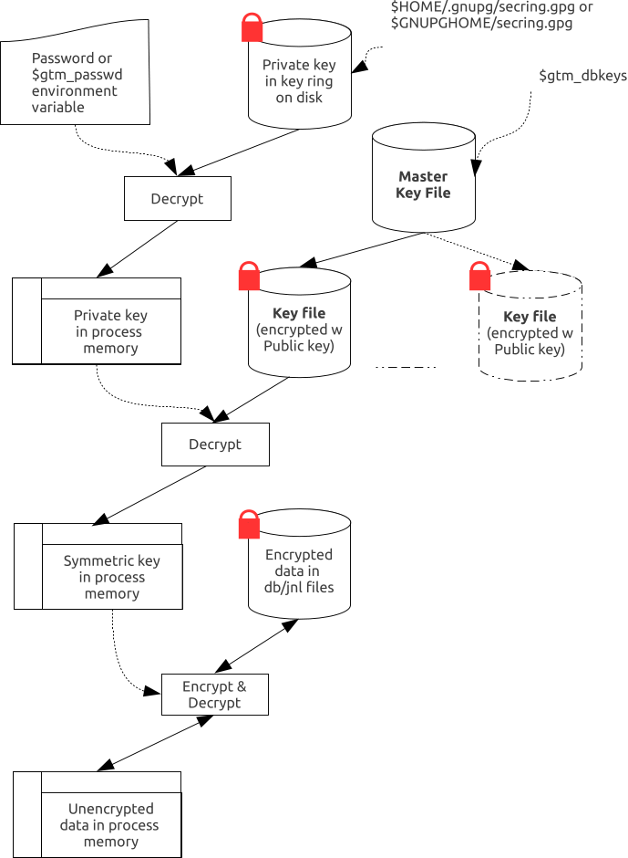
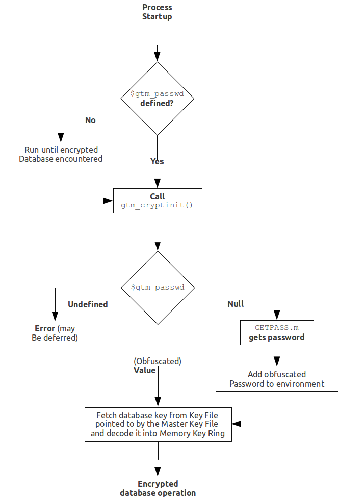
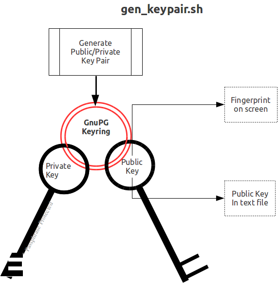
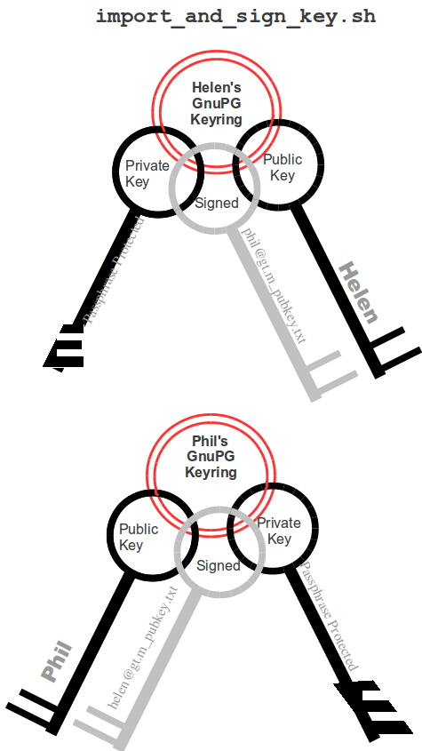
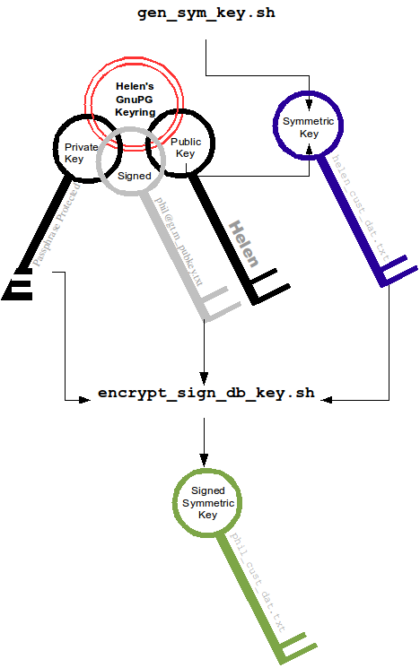
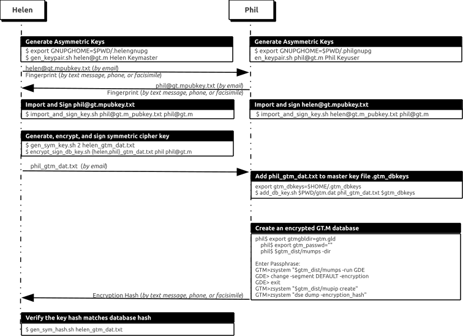

.. index::
   Database Encryption

================================
12. Database Encryption
================================

.. contents::
   :depth: 2

----------------------
Introduction
----------------------

++++++++++++++++++
Overview
++++++++++++++++++

YottaDB on selected platforms can encrypt data in database and journal files. Encryption protects data at rest (DAR), that is, it protects against unauthorized access to data by an unauthorized process that is able to access disk files.

A plug-in architecture allows you to use your choice of encryption package. The characteristics of encryption are entirely determined by the package you choose - for example, YottaDB implements no "back doors" or "key recovery", and if you want such functionality, you need to choose or construct an encryption package that provides the features you want.

YottaDB distributes only the source code for the reference implementation of a plug-in that uses popular, widely available, encryption libraries. If the reference implementation plug-in meets your needs, you are welcome to compile and use it as distributed, but please read and understand the section “Disclaimer” below. You can also use it as a base to implement your own plug-in.

In the reference implementation, YottaDB uses a symmetric cipher to encrypt data. The reference implementation encrypts the key for the symmetric cipher with an asymmetric cipher using public and private keys. The private keys are stored in a key ring on disk locked with a password (or passphrase - the terms are used interchangeably). 

+++++++++++++++++
Disclaimer
+++++++++++++++++

Database encryption is only useful as one component of a comprehensive security plan and is insufficient as the sole means of securing data. The use of database encryption should follow from a good security plan. This document describes implementing encrypted YottaDB databases; it does not discuss security plans.

Proper security protocol never places an unencrypted password, even in obfuscated form and/or in an obscure location, on disk. With YottaDB database encryption, unencrypted passwords exist in the address space of processes accessing the database, which means that unencrypted passwords can theoretically be written to swap files when process memory is paged out. To be secure, an installation must handle this by means such as: using encrypted swap devices or files, ensuring that YottaDB processes are not paged out, or some other means to ensure that information in swap files is available only to the running process. In other words, **even with respect to encryption, YottaDB database encryption is only part of a complete security infrastructure**.

Our expertise is in YottaDB, not in encryption. Encryption needs vary. Furthermore, the use of encryption may be restricted - or required - by regulations applicable to your location and circumstances. Therefore, our approach is to create a plug-in architecture where you can choose your preferred encryption software. In the course of development, we tested it primarily with `GNU Privacy Guard <http://gnupg.org/>`_, the widely available implementation of Pretty Good Privacy. Ensure that you have confidence in (and confidence in the support for) whichever encryption software you choose, because failure of the encryption software is likely to leave your data unrecoverable. YottaDB itself performs no encryption, and encryption is performed exclusively by software that you install and configure. **YottaDB neither endorses nor supports any specific encryption algorithm or library.**

Furthermore, just as YottaDB allows for the use of your choice of encryption libraries, encryption libraries in turn require keys that must be managed. In its simplest form, key management requires both that only those who need a key have that key, and also that keys are not lost. Key management is two steps removed from YottaDB's implementation of database encryption, but is important to the successful use of encrypted databases. It must be part of your operations policies and procedures. **YottaDB strongly recommends that you understand in detail how to implement the infrastructure for whichever specific encryption you choose.**

+++++++++++++++++++++++++++++++++++++++++++++++++
Limitations of YottaDB Database Encryption
+++++++++++++++++++++++++++++++++++++++++++++++++

Elements of your security infrastructure and management processes outside of YottaDB database encryption need to manage issues discussed in the following sections. 

**Data Not At Rest Not Protected**

YottaDB database encryption is designed to protect data at rest. Applications execute business logic to manipulate and produce unencrypted data. Unencrypted data must exist within application processes, and can be accessed by any process with access rights to the virtual address space of a process containing unencrypted data. Also, data in transit between systems and between processes is not protected by YottaDB database encryption. 

* Before creating a core dump, YottaDB attempts to clear any keys that it is aware of within the process address space. The reference implementation also uses the encryption libraries so as to minimize the probability of keys appearing in core dumps. Since it is not possible to guarantee that keys will not appear in a process core dump, depending on your security policy, YottaDB recommends that you consider whether to disable the creation of core dumps by YottaDB processes accessing encrypted databases, or use other means to limit access to core dumps. Note also that the use of random byte sequences as keys makes it harder to discern them in a core dump.

.. note::
   In the event core dumps are needed to troubleshoot operational issues, they can always be re-enabled.

**Keys in the Process Address Space/Environment**

This is a corollary of the fact that data not at rest is not protected by YottaDB database encryption.

In order to encrypt and decrypt databases, keys must exist in the address space/environment of YottaDB processes. Furthermore, with the reference implementation, processes also need to have access to the user's private key, and to get access to the private key, they need access to the passphrase of the user's GPG keyring. In order to pass encryption to child processes, the passphrase also exists in the process environment, even if obfuscated. This means that any process that can access the address space or environment of a YottaDB process accessing encrypted databases has access to the passphrases and keys.

* If an application provides some or all users access to a shell prompt or a YottaDB direct mode prompt, or allows that user to specify arbitrary code that can be XECUTE'd, those users can find ways to view and capture keys and passphrases. Note that, if a key or passphrase can be captured, it can be misused - for example, a captured GPG keyring passphrase is captured, it can be used to change the passphrase. You must therefore ensure that your application does not provide such access to users who should not view keys and passphrases.

* This limitation makes it all the more important that those who have access to shell prompts, YottaDB direct mode prompts, etc. not leave sessions unlocked, even briefly, if it is at all possible for someone who should not have knowledge of keys and passphrases to access the sessions during that time.

**Long lived Keys**

A database file has an extended life. In typical operation, only a minuscule fraction of the data within a database changes each day. As changing an encryption key requires re-encrypting all the data, this means encryption keys for files have long lives. Since long-lived keys are security risks - for example, they cannot be changed when an employee leaves - key management must therefore be part of the overall security plan. At a minimum, long lived keys require two stage key management - a database key with a long life, not normally accessed or viewed by a human, stored in a form encrypted by another key that can be changed more easily.

Furthermore, a key must be retained at least as long as any backup encrypted with that key; otherwise the backup becomes useless. You must have appropriate procedures to retain and manage old keys. Since successful data recovery requires both keys and algorithms, the retention processes must also preserve the encryption algorithm. 

**Voluminous Samples of Encrypted Data**

Database and journal files are large (GB to hundreds of GB). This large volume makes database encryption more amenable to attack than a small encrypted message because having many samples of encrypted material makes it easier to break a key. 

**Encryption Algorithms Neither Endorsed nor Supported by YottaDB**

YottaDB neither endorses nor supports any specific encryption algorithm.

The selection of an encryption algorithm is determined by many factors, including but not limited to, organizational preferences, legal requirements, industry standards, computational performance, robustness, the availability of encryption hardware, etc. No algorithm meets all needs.

Therefore, YottaDB provides a "plug-in" architecture for encryption algorithms, which allows you to integrate your preferred encryption software with YottaDB. In the YottaDB development environment, we created variations on a reference implementation using popular encryption packages for our validation. We tested each reference implementation variation on at least one computing platform, and one reference implementation variation on each computing platform. This document lists which encryption package we tested on which platform.

You take all responsibility for the selection and use of a specific encryption package. Please be aware that: 

* All encryption libraries that run within the address space of a YottaDB process must conform to the rules of any functions for YottaDB, as documented, including but not limited to being single threaded, not altering YottaDB's signal handlers, restricting the use of timers to the API provided by YottaDB, etc.

.. note::
   YottaDB provides functions gtm_hiber_start(), gtm_hiber_start_any(), gtm_start_timer(), gtm_cancel_timer(), gtm_jnlpool_detach(), gtm_malloc() and gtm_free() which can be freely used by plug-ins. 

* Malfunction of encryption software or hardware can render your data irrecoverable. As part of your comprehensive organizational risk management strategy, please consider the use of logical multi-site application configurations, possibly with different encryption packages and certainly with different encryption keys. 

* The cipher used for database encryption must not change the length of the encrypted sequence of bytes. In other words, if the cleartext string is n bytes, the encrypted string must also be n bytes. 

**No Key Recovery**

The reference implementation of YottaDB database encryption has no "back door" or other means to recover lost keys. We are also not aware of back doors in any of the packages used by the reference implementation.

Lost keys make your data indistinguishable from random ones and zeros. While YottaDB recommends implementing a documented key management process including techniques such as key escrow, ultimately, you take all responsibility for managing your keys. 

**Human Intervention Required**

At some point in the process invocation chain, the reference implementation requires a human being to provide a password that is placed (in obfuscated form) in the process environment where child processes can inherit it. If you want to be able to access encrypted databases without any human interaction, you must modify the reference implementation, or create your own implementation.

For example, if you have a YottaDB based application server process that is started by xinetd in response to an incoming connection request from a client, you may want to consider an approach where the client sends in a key that is used to extract an encrypted password for the master key ring from the local disk, obfuscates it, and places it in the environment of the server process started by xinetd. If the application protocol cannot be modified to allow the client to provide an additional password, xinetd can be started with the $gtm_passwd obfuscated password in its environment, and the xinetd passenv parameter used to pass $gtm_passwd from the xinetd process to the spawned server process. 

**MM Databases**

YottaDB database encryption is only supported for the Buffered Global (BG) access method. It is not supported for the Mapped Memory (MM) access method. See “Alternatives to Database Encryption ” below, for other options.

++++++++++++++++++++++++++++++++++++
Alternatives to Database Encryption
++++++++++++++++++++++++++++++++++++

On some platforms, you may be able to use disk drives with built-in encryption, or encrypted file systems to protect data at rest. These may or may not be as secure as YottaDB database encryption: for example, once an encrypted file system is mounted, the files can be accessed by any process that has appropriate permissions; with YottaDB database encryption each process accessing a database file must individually have access to the keys for that database file. 

+++++++++++++++
Device IO
+++++++++++++++

The built-in interface to encryption is implemented only for data in database, journal, backup and certain formats of extract files. To encrypt IO (say for sequential disk files), you can use IO to PIPE devices. Alternatively, you can call encryption routines from YottaDB using the external call interface. 

+++++++++++++
GT.CM
+++++++++++++

YottaDB does not encrypt GT.CM (GNP/OMI) network traffic. When needed, there are excellent third party products for implementing secure TCP/IP connections: software solutions as well as hardware solutions such as encrypting routers.

As with any YottaDB process that accesses databases, the Update Process, helper processes and GT.CM server all require provisioning with keys to enable their access to encrypted databases.

When a GT.CM server has a key for an encrypted database, any client connecting to the server can access encrypted records in that database. 

++++++++++++++
FIPS Mode
++++++++++++++

For database encryption, the plugin reference implementation also provides an option to use libgcrypt (from GnuPG) and libcrypto (OpenSSL) in "FIPS mode" removing a need to modify the plugin for sites that require certification for compliance with FIPS 140-2. When the environment variable $gtmcrypt_FIPS is set to 1 (or evaluates to a non-zero integer, or any case-independent string or leading substring of "TRUE" or "YES"), the plugin reference implementation attempts to use either OpenSSL or Libgcrypt to provide database encryption that complies with FIPS 140-2. The supported platforms are as follows:

+-------------------+---------------------------+------------------------------+--------------------------+
| Platform          | Libgcrypt                 | OpenSSL                      | OpenSSL FIPS             |
+===================+===========================+==============================+==========================+
| Linux x86_64      | 1.4.5                     | 1.0.0                        | 1.0.1e                   |
+-------------------+---------------------------+------------------------------+--------------------------+
| Linux x86         | 1.4.5                     | 1.0.0                        | 1.0.1e                   |
+-------------------+---------------------------+------------------------------+--------------------------+
| AIX RS600         | 1.5.1                     | 1.0.0e                       | 1.0.1e                   |
+-------------------+---------------------------+------------------------------+--------------------------+

Before using FIPS mode on these platforms, ensure that your OpenSSL or Libgcrypt installation provides a validated FIPS 140-2 implementation (see http://www.openssl.org/docs/fips/). 

.. note::
   Achieving FIPS 140-2 certification requires actions and controls well beyond the purview of YottaDB, including underlying cryptographic libraries that are certifiably FIPS compliant, administrative controls, and so on. YottaDB neither provides cryptographic libraries with YottaDB nor recommends the use of any specific library.

---------------------------
Theory of Operation
---------------------------

This section describes the operation of YottaDB database encryption with the reference implementation. A subsequent section describes the functions of the reference implementation which can be reworked or rewritten to use different encryption packages. 

+++++++++++++++++++++
Definition of Terms
+++++++++++++++++++++

+----------------------------------------+---------------------------------------------------------------------------------------------------------------------------------------------------------------------------------+
| Terms                                  | Description                                                                                                                                                                     |
+========================================+=================================================================================================================================================================================+
| Cipher                                 | An encryption algorithm or the implementation of an encryption algorithm, for example, the symmetric cipher AES 256 CFB.                                                        |
+----------------------------------------+---------------------------------------------------------------------------------------------------------------------------------------------------------------------------------+
| Hash (or Fingerprint)                  | A signature algorithmically derived from an object which is certain to a very impressive probability that uniquely identifies an object within a set of similar objects.        |
+----------------------------------------+---------------------------------------------------------------------------------------------------------------------------------------------------------------------------------+
| Key length                             | The number of bits comprising a key. Longer key lengths may result in stronger encryption (more difficult to break) but require more computation.                               |
+----------------------------------------+---------------------------------------------------------------------------------------------------------------------------------------------------------------------------------+
| Key management                         | The generation, distribution, and access of keys. The reference implementation of database encryption uses:                                                                     |
|                                        |                                                                                                                                                                                 |
|                                        | 1. symmetric keys to encrypt data and index records.                                                                                                                            |
|                                        | 2. public keys to encrypt symmetric keys (so they can be placed on disk).                                                                                                       |
|                                        | 3. private keys to decrypt symmetric keys.                                                                                                                                      |
|                                        | 4. passwords to encrypt private keys (so they can be placed on disk).                                                                                                           |
|                                        |                                                                                                                                                                                 |
+----------------------------------------+---------------------------------------------------------------------------------------------------------------------------------------------------------------------------------+
| Master key file                        | This file contains pairs of entries indicating which symmetric key is used to encrypt/decrypt database records. Database records can be found in database, journal, extract and |
|                                        | backup files.                                                                                                                                                                   |
+----------------------------------------+---------------------------------------------------------------------------------------------------------------------------------------------------------------------------------+
| Obfuscation                            | A technique used to make data difficult to discern on casual observation. A common example is "pig Latin". Since the password used for the GPG keyring exists in the process'   |
|                                        | environment with the reference implementation, YottaDB obfuscates it to reduce the chance that visual access to process information (say during debugging) inadvertently        |
|                                        | exposes the password.                                                                                                                                                           |
+----------------------------------------+---------------------------------------------------------------------------------------------------------------------------------------------------------------------------------+
| Password (or Passphrase)               | A secret word or phrase used in the reference implementation to protect a private key on disk (a password should never be on disk in the clear, which is the electronic         |
|                                        | equivalent of taping it to your monitor with a sticky note).                                                                                                                    |
+----------------------------------------+---------------------------------------------------------------------------------------------------------------------------------------------------------------------------------+
| Public key / Private key               | A pair of keys used so what one key encrypts the other can decrypt. The private key is sometimes referred to as the "secret" key (because it is not shared as opposed to the    |
| (or Asymmetric keys)                   | public key which is; the private key should never be on disk in the clear). In the reference implementation, asymmetric keys are used to encrypt the symmetric database key.    |
|                                        | This allows a master to encrypt a symmetric database key with a user's public key (so only the user can decrypt it with their private key).                                     |
|                                        |                                                                                                                                                                                 |
|                                        | Encryption using a public key / private key pair is referred to as "public key encryption". The reference implementation uses GNU Privacy Guard with associated libraries       |
|                                        | libgpgme and libgpg-error for asymmetric key encryption.                                                                                                                        |
+----------------------------------------+---------------------------------------------------------------------------------------------------------------------------------------------------------------------------------+
| Symmetric key                          | The same key used to both encrypt and decrypt. Symmetric ciphers are faster than asymmetric ciphers. Encryption using a symmetric key is referred to as "symmetric key          |
|                                        | encryption". Depending on the platform, the reference implementation uses either GNU Privacy Guard's libgcrypt, or libcrypto from OpenSSL (http://openssl.org/), for symmetric  |
|                                        | key encryption.                                                                                                                                                                 |
+----------------------------------------+---------------------------------------------------------------------------------------------------------------------------------------------------------------------------------+

+++++++++++++++++++
Overview
+++++++++++++++++++

**Warning**

YottaDB implements database encryption with a plug-in architecture that allows for your choice of cipher. Any code statically or dynamically linked in to a YottaDB process must meet the requirements of code used for external calls. The YottaDB distribution includes a source reference implementation that interfaces to several common packages and libraries. You are free to use the reference implementations as is, but remember that the choice of cipher and package is yours, and YottaDB neither recommends nor supports any specific package. 

.. note::
   In any given instance, you must use the same encryption libraries for all databases accessed by the processes of an application instance, but each database file can have its own key. Of course, all processes accessing a database or journal file must use the same encryption algorithm and key. 

**Data in Database and Journal Files**

A YottaDB database file contains several parts:

1. A file header containing information pertaining to the database file itself. 
2. Global and local bit maps, which together specify which blocks in the file are in use and which blocks are free. 
3. Data blocks containing the actual data, as well as index blocks containing structural information providing paths to the actual data (there is a directory tree, and one or more global variable trees). Each data or index block consists of a block header, and one or more data records. 

In an encrypted database, YottaDB encrypts only the index and data records in a database. The file header, bit maps, and block headers are not encrypted, i.e., information relating to database structure is not encrypted. This means some system administration operations such as turning journaling on and off, do not require the encryption key for a database file. Others, such as MUPIP EXTRACT, do.

Journal files contain data records, such as before image records, update records, and after image records, as well as structural information such as transaction markers, process records, etc. Again, only records that contain data - before image records, update records and after image records - are encrypted. Records that contain structural information remain in cleartext.

Records subject to encryption are collectively referred to in the document as data records.

**Symmetric and Asymmetric Ciphers**

For performance, a symmetric cipher is used to encrypt and decrypt data records. Asymmetric ciphers are used by the reference implementation to secure the symmetric cipher keys stored on disk. A password is used to secure the private key which is stored on a key ring on disk. The following illustration is an overview of YottaDB database encryption in the reference implementation using GNU Privacy Guard (GPG) to provide the ciphers.

**Key Ring on Disk**

In the reference implementation, a password protected key ring on disk contains the private key of the asymmetric cipher. A password is required to access the key ring on disk and obtain the private key. Password acquisition happens in one of three ways: 

1. When the environment variable $gtm_passwd is not set, before a YottaDB MUMPS process needs to open an encrypted database file, the application calls a program such as GETPASS.m to prompt for and obtain a password for the key ring on disk. 
2. When the environment variable $gtm_passwd is set to the null string, at process startup, YottaDB implicitly calls the program GETPASS.m to prompt for and obtain a password. The environment variable, $gtm_passwd is then set to an obfuscated version of the password required to unlock the key ring on disk.
3. The environment variable $gtm_passwd contains an obfuscated version of the password required to unlock the key ring on disk to obtain the private key. The environment variable can be passed in to YottaDB, or it can be prompted for and set, as described below.

Some graphical user interfaces, e.g., GNOME or KDE, may detect when you are being prompted for the GPG keyring password and use a graphical interface instead of the terminal interface. You may be able to disable this behavior if you unset the $DISPLAY environment variable, or use an ssh connection to localhost that disables X forwarding. Consult your Graphical User Interface documentation.

In order to enable the Job command, the password for the key ring on disk exists in the environment of the process in environment variable $gtm_passwd where it can be passed from a parent process to a child. In order to prevent inadvertent disclosure of the password, for example, in a dump of the environment submitted to YottaDB for product support purposes, the password in the environment is obfuscated using information available to processes on the system on which the process is running, but not available on other systems.

$gtm_passwd is the only way for a child process to receive a password from a parent. In the event that the parent process does not pass $gtm_passwd to the child, or passes an incorrect password, there is little a child without access to an input device can do except log an error and terminate.

An obfuscated password in the environment is the only way that other YottaDB processes (MUPIP and DSE) can be provided with a password. If they encounter an encrypted database or journal file, and do not have an obfuscated password to the key ring on disk in the environment, they terminate with the error message "YDB-E-CRYPTINIT, Error initializing encryption library. Environment variable gtm_passwd set to empty string. Password prompting not allowed for utilities". There are (at least) two ways to provide MUPIP and DSE processes with obfuscated passwords in $gtm_passwd: 

1. maskpass is a stand-alone program that prompts the user for the password to the key ring on disk, and returns an obfuscated password to which $gtm_passwd can be set. The environment variable $gtm_passwd should be not set, set to a null value, or set to a value produced by maskpass. Setting $gtm_passwd to an incorrect non-null value without using maskpass could result in undefined behavior of the encryption library. You can use maskpass in shell scripts. For example:

   .. parsed-literal::
      $ echo -n "Enter Password: ";export gtm_passwd=`$gtm_dist/plugin/gtmcrypt/maskpass|cut -f 3 -d " "`
      Enter Password: 
      $ 

2. Create a one line YottaDB program as follows: 

   .. parsed-literal::
      zcmd ZSYstem $ZCMdline Quit 

and use it invoke the MUPIP or DSE command. For example: 

   .. parsed-literal::
      $ gtm_passwd="" mumps -run zcmd mupip backup -region \"\*\" 

The empty string value of $gtm_passwd causes the MUMPS process to prompt for and set an obfuscated password in its environment which it then passes to the MUPIP program. Shell quote processing requires the use of escapes to pass the quotes from the ZSYstem command to the shell.

The environment variable $gtm_passwd should be one of the following:

* not set
* set to a null value
* set to a value corresponding to an obfuscated password (e.g., produced by maskpass)

The following schematic illustrates acquisition of the password for the key ring on disk. Note that an error (for example from the entry of an incorrect password) may not be triggered immediately - for example, DSE does not need an encryption key until you attempt to access data (since the file header is not encrypted, access to it does not require a key).

**Master Key File and Key Files**

The reference implementation uses a master key file for each user to obtain the symmetric keys for each database or journal file. The environment variable $gtmcrypt_config specifies the master key configuration file used for database encryption and TLS. The configuration file leverages the popular libconfig library (http://www.hyperrealm.com/libconfig). Please refer to the section called “Creating a configuration file” for instructions on creating the configuration file.

The functions look for a key file ~/.ydb_dbkeys (i.e., in the home directory of the process' userid). The master key file contains sections as follows:

.. parsed-literal::
   dat database_filename
   key key_filename

where database_filename is the name of a database file, for example, /var/xyzapp/gbls/accounts.dat and key_filename is the name of a key file containing a symmetric key encrypted with a public key, for example: /home/sylvia/dbkeys/accounts.key.

Key files are text files which can even be faxed or e-mailed: since they are secured with asymmetric encryption, you can transmit them over an insecure channel. As discussed below, the same database_filename can occur multiple times in a master key file.

**Memory Key Ring**

For each key_filename, the YottaDB process (MUMPS, MUPIP or DSE) builds a memory key ring from the key ring on disk and the master key file. The memory key ring contains a list of elements where each element consists of a filename, a symmetric cipher key, and a cryptographic hash of that symmetric cipher key. Using the private key obtained from the key ring on disk, YottaDB obtains the symmetric keys from key files pointed to by the master key file.

Database and journal file headers include a cryptographic hash of the encryption key and algorithm used for that file. When opening a file, YottaDB uses the key in the memory key ring whose hash matches that in the header - the database_filename in the key ring is ignored. Older keys need not be deleted until they are no longer required (for example, an older key may be required to access a restored backup copy of a database). Permitting the same database_filename to occur multiple times in a master key file also enables one master key file to be used for multiple instances of an application. This ensures that the correct key for a file is always used, even if the file has been renamed, copied from another location, etc. - the correct key must of course be available in the memory key ring; if no such key exists, YottaDB triggers a CRYPTKEYFETCHFAILED error.

Only for MUPIP CREATE does YottaDB rely on the database_filename in the key ring. MUPIP CREATE computes the cryptographic hash for the correct key to place in the database file header. If the same database_filename occurs more than once in the master key file (and hence in the memory key ring), MUPIP CREATE uses the key_filename associated with the last occurrence of that database_filename in the master key file.

This is illustrated by the following illustration:

.. image:: memory_key_ring.png

**Key Validation and Hashing**

As discussed earlier, a process uses the key in its memory key ring whose hash matches the hash in the database or journal file header; the file name is not checked. MUPIP CREATE computes the hash value for the key at database creation time, and writes it to the database file header. When YottaDB creates a new journal file for an encrypted database file, it copies the hash from the database file header into the journal file header. Similarly, MUPIP EXTRACT -FORMAT=BINARY, places the database file hash in the extract, which is encrypted; indeed, since an extract can come from multiple database files, extract places the hash from the file header of each encrypted database in the extract. When processing each section in the extract, MUPIP LOAD uses that key in its memory key ring that matches the hash for each section of the extract. 

**Database Operation**

On disk, database and journal files are always encrypted - YottaDB never writes unencrypted data to an encrypted database or journal file. YottaDB uses decryption when reading data records from disk, and encryption when it writes data records to disk.

With encrypted databases, the number of global buffers allocated is automatically doubled, for example, if the database file header specifies 2000 global buffers, when the file is opened, YottaDB automatically allocates 4000 global buffers. Global buffers are used in pairs: one global buffer has a copy of the encrypted database block as it exists on disk and the other has a copy of the unencrypted version. There is no change to the size of the control structures (including lock space and journal buffers) in shared memory. So, when using encrypted databases, you need to adjust your calculations of memory and shared memory usage accordingly: for each open database file, the shared memory usage will increase by the number of global buffers times the block size. For example, if the block size of a database file is 4KB, with 2048 global buffers, and the shared memory segment for that database file occupies 9MB when unencrypted, it occupies 17MB when the file is encrypted. Depending on your operating system you may need to change system configuration and tuning parameters. Other than global buffers, there is no change to memory usage with encryption.

Encrypted databases consume additional CPU resources for encryption and decryption. Without detailed knowledge of the chosen algorithms, the application patterns and hardware configuration, it is not possible to predict whether this will be appreciable, and whether application throughput will be affected. As far as possible, YottaDB has attempted to engineer YottaDB database encryption so that the additional CPU resources are consumed outside software critical sections. The intention is to minimize the impact of encryption on application throughput, at least on computer systems that are not starved of CPU resources. You should determine the actual impact of encryption on your application when it runs on your system, preferably using a test environment that exactly reflects your production environment. 

--------------------------
Examples of Use
--------------------------

The commands here are all line oriented to illustrate that they can be automated by being called from YottaDB or from a shell script. For interactive use, there are many graphical user interfaces (GUIs) usable with GPG. Although these examples were generated on Linux, usage on other UNIX systems should be virtually identical. 

++++++++++++++++++
Key Management
++++++++++++++++++

This is an example of key management using GPG and the reference implementation.

Helen Keymaster (helen@yottadb) is the master of keys, and provides a database key to Phil Keyuser (phil@yottadb). Helen does not manage the database. Phil is the database manager, but he is not the master of keys. In order to communicate securely, Helen and Phil each set up a GPG keyring, generate a public/private key pair, and exchange & authenticate each other's public keys. This permits a secure transfer of the key for the symmetric cipher used for the database. Warning: If you attempt key generation on a virtual machine, or other computer system that does not have a good supply of entropy, the gen_key_pair.sh script could take a very, very long time. Similarly, a key quality of 2 for the gen_sym_key.sh script on a machine without a plentiful supply of entropy can also tax your patience. Use a physical computer system with a lot of entropy. If you are able to, use an entropy gathering daemon such as egd (http://egd.sourceforge.net), or consider acquiring an entropy source such as the Entropy Key (http://www.entropykey.co.uk) that you can use to distribute entropy to your virtual machines. 

The workflow is as follows: 

Helen and Phil each create a new GPG keyring and a new public-private key pair (This step can be omitted if they already have GPG keyrings and public and private keys. However, see the section below on operation with Gnu Privacy Guard version 2.). In the gen_keypair.sh script GPG generates the key pair [see note], putting public and private keys in the key ring; the latter locked with a passphrase. The public key is also exported to a text file, and its fingerprint is displayed in the terminal session. Each of them e-mails (or otherwise sends) her/his public key text file to the other. One alternative to direct sending of of public keys is to upload them to a keyserver, such as the MIT PGP Public Key Server at http://pgp.mit.edu . This is illustrated below; first Helen, then Phil (if the GNUPGHOME environment variable is not set, it will default to $HOME/.gnupg).

.. note::
   Generating a public-private keypair can consume a significant amount of the entropy in a computer system. Running out of entropy can cause the operation to stall until sufficient entropy becomes available. You may need to consider external entropy sources or entropy gathering daemons for computer systems on which key generation will occur frequently. For encrypted databases on virtual machines, you may need to generate public-private keypairs on host computers and then ship the keyrings to the virtual guests.

Helen e-mails helen@yottadb_pubkey.txt the file containing her exported public key to Phil, and Phil sends phil@yottadb_pubkey.txt, his exported public key to Helen. To protect against "man in the middle" attacks, they speak on the phone to exchange key fingerprints, or send each other the fingerprints by text message, or facsimile - a different communication channel than that used to exchange the keys. They use the import_and_sign_key.sh shell script. After importing and signing each other's public keys, Phil and Helen can communicate securely with each other, even in the presence of eavesdroppers. Helen's keyring with Phil's imported key is shown below:

Using the gen_sym_key.sh script, Helen generates a symmetric cipher key for Phil to use in encrypting a new database file cust.dat. With a key strength of 2, a symmetric key is suitable for use in production and in the example is stored in file helen_cust_dat.txt encrypted with Helen's public key so that only she can decrypt it. The gen_sym_key.sh script never displays the symmetric cipher key; the key in the text file on disk can only be decrypted with Helen's private key.

With the encrypt_sign_db_key.sh script, Helen uses her private key to decrypt the symmetric cipher key in helen_cust_dat.txt, encrypts it with Phil's public key, and signs it with her private key, creating a file called phil_cust_dat.txt. She sends this file to Phil, either as an e-mail attachment, or putting it in a mutually agreed upon location on disk. As before, even though the key is on disk, it can be decrypted only with Phil's private key. Note that from this point on, even if Helen is hit by a truck, or resigns, Phil has access to the key and can use the same encrypt_sign_db_key.sh script to provide the key to, say, Xavier, Helen's successor. Helen preparing the key for Phil is shown below.

With the add_db_key.sh script, Phil now adds the key to his YottaDB master key file. He can then create the encrypted database file with mupip create, load it with data and use it. Until the database is created and loaded with data, the key has no value and can be discarded at will. Once the database is created and loaded with the data, the key must be retained as long as access to the database - or even a backup thereof - is ever required. The entire process is illustrated below: 

.. image:: add_db_key.png

As a final check to make sure that the database was created with the correct symmetric cipher key and the correct cipher, Helen can use the gen_sym_hash.sh script to compute a hash from the key in helen_cust_dat.txt while Phil uses YottaDB's dse dump -fileheader -all command to print the key from the file header of the database file he creates. If the hashes match, the database file has been correctly created.

Below are scripts of the key management example above.

Helen creates a new GPG keyring with a public and private key pair: 

.. parsed-literal::
   helen$ export GNUPGHOME=$PWD/.helengnupg
   helen$ $gtm_dist/plugin/gtmcrypt/gen_keypair.sh helen@yottadb Helen Keymaster
   Passphrase for new keyring:
   Verify passphrase:
   Key ring will be created in /home/helen/.helengnupg
   Key generation might take some time. Do something that will create entropy, like moving the mouse or typing in another session.
   gpg: checking the trustdb
   gpg: 3 marginal(s) needed, 1 complete(s) needed, PGP trust model
   gpg: depth: 0 valid: 1 signed: 0 trust: 0-, 0q, 0n, 0m, 0f, 1u
   /home/helen/.helengnupg/pubring.gpg
   ---------------------------------
   pub 1024D/BC4D0739 2018-02-07
   Key fingerprint = B38B 2427 5921 FFFA 5278 8A91 1F90 4A46 BC4D 0739
   uid Helen Keymaster <helen@yottadb>
   sub 2048R/A2E8A8E8 2018-02-07
   Key pair created and public key exported in ASCII to helen@yottadb_pubkey.txt
   helen$

Phil creates a new GPG keyring with a public and private key pair: 

.. parsed-literal::
   phil$ export GNUPGHOME=$PWD/.philgnupg
   phil$ $gtm_dist/plugin/gtmcrypt/gen_keypair.sh phil@yottadb Phil Keyuser
   Passphrase for new keyring:
   Verify passphrase:
   Key ring will be created in /home/phil/.philgnupg
   Key generation might take some time. Do something that will create entropy, like moving the mouse or typing in another session.
   gpg: checking the trustdb
   gpg: 3 marginal(s) needed, 1 complete(s) needed, PGP trust model
   gpg: depth: 0 valid: 1 signed: 0 trust: 0-, 0q, 0n, 0m, 0f, 1u
   /home/phil/.philgnupg/pubring.gpg
   ---------------------------------
   pub 1024D/A5719A99 2018-02-07
   Key fingerprint = 886A BAFC E156 A9AD 7EA9 06EA 8B8B 9FAC A571 9A99
   uid Phil Keyuser <phil@yottadb>
   sub 2048R/AD37D5A0 2018-02-07
   Key pair created and public key exported in ASCII to phil@yottadb_pubkey.txt
   phil$

Then Helen sends Phil the file helen@yottadb_pubkey.txt and Phil sends Helen the file phil@yottadb_pubkey.txt.

Helen imports Phil's public key into her keyring, verifying the fingerprint when she imports it, and signing it to confirm that she has verified the fingerprint: 

.. parsed-literal::
   helen$ $gtm_dist/plugin/gtmcrypt/import_and_sign_key.sh phil@yottadb_pubkey.txt phil@yottadb
   gpg: key A5719A99: public key "Phil Keyuser <phil@yottadb>" imported
   gpg: Total number processed: 1
   gpg: imported: 1
   #########################################################
   pub 1024D/A5719A99 2018-02-07
   Key fingerprint = 886A BAFC E156 A9AD 7EA9 06EA 8B8B 9FAC A571 9A99
   uid Phil Keyuser <phil@yottadb>
   sub 2048R/AD37D5A0 2018-02-07
   #########################################################
   Please confirm validity of the fingerprint above (y/n/[?]): y
   Passphrase for keyring:
   Successfully signed public key for phil@yottadb received in phil@yottadb_pubkey.txt
   helen$

Phil likewise imports, verifies and signs Helen's public key: 

.. parsed-literal::
   phil$ $gtm_dist/plugin/gtmcrypt/import_and_sign_key.sh helen@yottadb_pubkey.txt helen@yottadb
   gpg: key BC4D0739: public key "Helen Keymaster <helen@yottadb>" imported
   gpg: Total number processed: 1
   gpg: imported: 1
   #########################################################
   pub 1024D/BC4D0739 2018-02-07
   Key fingerprint = B38B 2427 5921 FFFA 5278 8A91 1F90 4A46 BC4D 0739 uid Helen Keymaster <helen@yottadb>
   sub 2048R/A2E8A8E8 2018-02-07
   #########################################################
   Please confirm validity of the fingerprint above (y/n/[?]): y
   Passphrase for keyring:
   Successfully signed public key for helen@yottadb received in helen@yottadb_pubkey.txt
   phil$

Helen and Phil can now securely exchange information.

Helen generates a symmetric cipher key for the new database file cust.dat: 

.. parsed-literal::
   helen$ $gtm_dist/plugin/gtmcrypt/gen_sym_key.sh 2 helen_cust_dat.txt
   helen$ 

Then she encrypts the symmetric cipher key with Phil's public key, signs it, and produces a file phil_cust_dat.txt that she can send Phil: 

.. parsed-literal::
   helen$ $gtm_dist/plugin/gtmcrypt/encrypt_sign_db_key.sh helen_cust_dat.txt phil_cust_dat.txt phil@yottadb
   Passphrase for keyring:
   gpg: checking the trustdb
   gpg: 3 marginal(s) needed, 1 complete(s) needed, PGP trust model
   gpg: depth: 0 valid: 1 signed: 1 trust: 0-, 0q, 0n, 0m, 0f, 1u
   gpg: depth: 1 valid: 1 signed: 0 trust: 1-, 0q, 0n, 0m, 0f, 0u
   helen$ 

Phil adds the key in phil_cust_dat.txt to his master key file $HOME/.ydb_dbkeys:

.. parsed-literal::
   phil$ export ydb_dbkeys=$HOME/.ydb_dbkeysphil$ $gtm_dist/plugin/gtmcrypt/add_db_key.sh $PWD/ydb.dat 
   phil_cust_dat.txt $ydb_dbkeys
   phil$ 

Phil creates a global directory, where he changes the configuration parameter for the database file cust.dat specifying that it be encrypted the next time it is created. (Remember that except for mapping from global variable names to database file names, configuration parameters in the global directory are used only when MUPIP creates new database files.) He then creates the database file, runs a DSE dump fileheader to extract the hash (highlighted in the output), and sends it to Helen for verification (notice that MUPIP CREATE generates an error for the mumps.dat file that exists already, but creates a new encrypted cust.dat file): 

.. parsed-literal::
   phil$ export gtmgbldir=yottadb.gld
   phil$ export gtm_passwd=""
   phil$ $gtm_dist/mumps -dir
   Enter Passphrase:
   YDB>zsystem "$gtm_dist/mumps -run GDE"
   %GDE-I-LOADGD, Loading Global Directory file
   /var/myApp/databases/ydb.gld
   %GDE-I-VERIFY, Verification OK
   GDE> change -segment DEFAULT -encryption
   GDE> exit
   %GDE-I-VERIFY, Verification OK
   %GDE-I-GDUPDATE, Updating Global Directory file
   /var/myApp/databases/yottadb.gld
   YDB>zsystem "$gtm_dist/mupip create"
   Created file /var/myApp/databases/yottadb.dat
   Error opening file /var/myMpp/databases/mumps.dat
   : File exists
   %YDB-F-DBNOCRE, Not all specified database files, or their associated journal files were created
    
   YDB>zsystem "dse"
 
   File    /var/myApp/databases/cust.dat
   Region  CUST
   DSE> dump -fileheader -all
 
   File            /var/myApp/databases/cust.dat
   Region          CUST
   Date/Time       04-FEB-2018 11:24:10 [$H = 61850,41050]
    Access method                          BG  Global Buffers                1024
    Reserved Bytes                          0  Block size (in bytes)         1024
    Maximum record size                   256  Starting VBN                   129
    Maximum key size                       64  Total blocks            0x00000065
    Null subscripts                     NEVER  Free blocks             0x00000062
    Standard Null Collation             FALSE  Free space              0x00000000
    Last Record Backup     0x0000000000000001  Extension Count                100
    Last Database Backup   0x0000000000000001  Number of local maps             1
    Last Bytestream Backup 0x0000000000000001  Lock space              0x00000028
    In critical section            0x00000000  Timers pending                   0
    Cache freeze id                0x00000000  Flush timer            00:00:01:00
    Freeze match                   0x00000000  Flush trigger                  960
    Current transaction    0x0000000000000001  No. of writes/flush              7
    Maximum TN             0xFFFFFFFFE3FFFFFF  Certified for Upgrade to        V5
    Maximum TN Warn        0xFFFFFFFF73FFFFFF  Desired DB Format               V5
    Master Bitmap Size                    112  Blocks to Upgrade       0x00000000
    Create in progress                  FALSE  Modified cache blocks            0
    Reference count                         1  Wait Disk                        0
    Journal State                    DISABLED
    Mutex Hard Spin Count                 128  Mutex Sleep Spin Count         128
    Mutex Spin Sleep Time                2048  KILLs in progress                0
    Replication State                     OFF  Region Seqno    0x0000000000000001
    Zqgblmod Seqno         0x0000000000000000  Zqgblmod Trans  0x0000000000000000
    Endian Format                      LITTLE  Commit Wait Spin Count          16
    Database file encrypted              TRUE
                                                  
    Dualsite Resync Seqno  0x0000000000000001  DB Current Minor Version         8
    Blks Last Record Backup        0x00000000  Last YottaDB Minor Version          8
    Blks Last Stream Backup        0x00000000  DB Creation Version             V5
    Blks Last Comprehensive Backup 0x00000000  DB Creation Minor Version        8
                                                           
    Total Global Buffers           0x00000400  Phase2 commit pid count 0x00000000
    Dirty Global Buffers           0x00000000  Write cache timer count 0xFFFFFFFF
    Free  Global Buffers           0x00000400  wcs_wtstart pid count   0x00000000
    Write Cache is Blocked              FALSE  wcs_wtstart intent cnt  0x00000000
    Actual kills in progress                0  Abandoned Kills                  0
    Process(es) inhibiting KILLs            0
    DB Trigger cycle of ^#t                 0
                                                                         
    MM defer_time                           0
    Database file encryption hash  12D119C93E28BBA9389C6A7FD53C2373CFF7181DF48FEF
    213523B7B38199EF18B4BADB232D30CBDA2DBFC5F85D97D7A5C4A3E3D13276DCBB63B30EBDAA6B5
    DD7
         
    Full Block Writes                     OFF  Full Block Write Len             0
            
           
    TP blkmod nomod                  0
    TP blkmod gvcst_srch             0
    TP blkmod t_qread                0
    TP blkmod tp_tend                0
    TP blkmod tp_hist                0
                    
    Free blocks                    992        Backup blocks                    0
    Reformat blocks                  0        Total blocks                   992
    Shmpool blocked              FALSE        File Offset     0x0000000000000000
    Shmpool crit holder              0        Backup_errno                     0
    Backup Process ID                0        Backup TN       0x0000000000000000
    Inc Backup TN   0x0000000000000000        Process Failed                   0
    Allocs since check               0        Backup Image Count               0
    Temp File:    
                                     
    Database is Fully Upgraded                :  TRUE
    Database WAS ONCE Fully Upgraded from V4  :  TRUE
    Blocks to Upgrade subzero(negative) error : 0x00000000
    TN when Blocks to Upgrade last became 0   : 0x0000000000000000
    TN when Desired DB Format last changed    : 0x0000000000000000
    TN when REORG upgrd/dwngrd changed dbfmt  : 0x0000000000000000
                                                 
    Block Number REORG upgrd/dwngrd will restart from : 0x00000000
                                                  
    Upd reserved area [% global buffers]   50  Avg blks read per 100 records  200
    Pre read trigger factor [% upd rsrvd]  50  Upd writer trigger [%flshTrgr]  33
                                                       
    Snapshot in progress                 FALSE   Number of active snapshots                            0
    Snapshot cycle                            0  Active snapshot PID                                   0
    Snapshot TN                               0  Total blocks                                          0
    Free blocks                               0  Process failed                                        0
    Failure errno                             0  Snapshot shared memory identifier                    -1
    Snapshot file name
   DSE> exit
     
   YDB>halt
   $

Phil calls Helen with the hash, texts her phone, or sends her an e-mail. Helen ensures that the hash of the key she generated matches the hash of the database file created by Phil, and communicates her approval to Phil. Phil can now use the database. Either Phil or Helen can provide the key to other users who are authorized to access the database and with whom they have securely exchanged keys.

.. parsed-literal::
   helen$ $gtm_dist/plugin/gtmcrypt/gen_sym_hash.sh helen_cust_dat.txt
   Passphrase for keyring:gpg: encrypted with 2048-bit RSA key, ID A2E8A8E8, created 2010-05-07"
   Helen Keymaster <helen@yottadb>"178E55E32DAD6BFF761BF917412EF31904C...
   helen$

The encrypted database file cust.dat is now ready for use. That file, all journal files, backups, and binary extracts will all have the same symmetric encryption cipher and key, which means that software libraries that provide that cipher and copies of the key (encrypted with the public keys of all those who are authorized to access them) must be retained as long as there may be any need to access data in that database file, its journal files, extracts and backups.

The following command sequence diagram illustrates how Helen and Phil operate with one another.

------------------------------------
Tested Reference Implementations
------------------------------------

YottaDB database encryption comes with a source reference implementation that should compile "out of the box" with selected encryption packages. You can use this for your initial development and testing with YottaDB database encryption. There are many encryption packages. As discussed earlier, YottaDB neither endorses nor supports any specific cipher or package. For your production use, you take responsibility for choosing, implementing and procuring support for your preferred package. Please remember that a malfunction in your chosen encryption package may result in unrecoverable data and YottaDB will be unable to help you.

The Plugin Architecture and Interface section below details the reference implementation, which is provided with full source code that you can freely modify for your own use.

For each platform on which YottaDB supports encryption, the following table lists the encryption packages and versions against which YottaDB was tested. Note that YottaDB was tested for operation against these packages; not the robustness of the encryption packages themselves.

+--------------------------------------+-------------------------+------------------------------+------------------------------------------------------------------------------------------+-----------------+
| OS (HW)                              | libgpgme                | libgpg-error                 | libgcrypt / libcrypto                                                                    | GPG             |
+======================================+=========================+==============================+==========================================================================================+=================+
| Ubuntu 14.04 LTS (x86_64)            | 1.4.3-0.1ubuntu5.1      | 1.12-0.2ubuntu1              | libgcrypt 1.5.3-2ubuntu4.4                                                               | 2.0.22          |
+--------------------------------------+-------------------------+------------------------------+------------------------------------------------------------------------------------------+-----------------+
| Ubuntu 16.04 LTS (x86_64)            | 1.6.0-1                 | 1.21-2ubuntu1                | libgcrypt 1.6.5-2                                                                        | 2.1.11          |
+--------------------------------------+-------------------------+------------------------------+------------------------------------------------------------------------------------------+-----------------+
| RHEL 6 (x86_64)                      | 1.1.6                   | 1.4-2                        | libgcrypt 1.4.4-5                                                                        | 2.0.14          |
+--------------------------------------+-------------------------+------------------------------+------------------------------------------------------------------------------------------+-----------------+
| RHEL 7                               | 1.3.2                   | 1.12                         | libgcrypt 1.5.3                                                                          | 2.0.22          |
+--------------------------------------+-------------------------+------------------------------+------------------------------------------------------------------------------------------+-----------------+
| AIX 6.1 and 7.1                      | 1.1.8 + fix             | 1.7                          | libcrypto from OpenSSL - (version >= 1.5)                                                | 1.4.10          |
|                                      |                         |                              |                                                                                          |                 |
|                                      |                         |                              | AES256CFB as implemented by OpenSSL - (version >= 0.9.8)                                 |                 |
+--------------------------------------+-------------------------+------------------------------+------------------------------------------------------------------------------------------+-----------------+

Where the table lists a package version number followed by "+ fix" it means that in the process of testing, we identified issues with the package that we fixed.

The reference implementation uses: 

* The key ring on disk implemented by GPG.
* For public key encryption including the generation of public/private key pairs: RSA as implemented by GPG.
* For the cryptographic hash: SHA-512.
* For a programmatic interface to GPG: libgpgme.
* To provide error messages for GPG: libgpg-error.
* For symmetric encryption: AES256CFB implemented by libgcrypt on all platforms.

When a YottaDB process first opens a shared library providing an encryption plugin, it ensures that the library resides in $gtm_dist/plugin or a subdirectory thereof. This ensures that any library implementing an encryption plugin requires the same permissions to install, and is protected by the same access controls, as the YottaDB installation itself.

On all platforms on which YottaDB supports encryption, compiling the source reference implementation produces the shared library plugins, libgtmcrypt_gcrypt_AES256CFB.so and libgtmcrypt_openssl_AES256CFB.so. On installation, platforms other than AIX, libgtmcrypt.so is a symbolic link to libgtmcrypt_gcrypt_AES256CFB.so; on AIX symbolic link is to libgtmcrypt_openssl_AESCFB.so.

.. note::
   Encrypted database files are compatible between different endian platforms as long as they use the same key and the same cipher. The sample shell scripts in the reference implementation use the standard shell (/bin/sh). 

.. note::
   YottaDB dropped support for the Blowfish encryption plugin. To migrate databases from Blowfish CFB to AES CFB requires that the data be extracted and loaded into newly created database files. To minimize the time your application is unavailable, you can deploy your application in a Logical Multi-Site (LMS) configuration, and migrate using a rolling upgrade technique Refer to the `Chapter 7: “Database Replication” <https://docs.yottadb.com/AdminOpsGuide/dbrepl.html>`_ for more complete documentation.

--------------------------------------------
Special Note - GNU Privacy Guard and Agents
--------------------------------------------

The GNU Privacy Guard (GPG) supports the use of an agent to manage encrypted keys. Agents allow for protocol independent access to keys stored in users' GPG keyrings.

YottaDB strongly recommends using a separate keyring and configuration for YottaDB applications. The GPG keyring and related configuration files reside in $GNUPGHOME. Using a separate $GNUPGHOME insulates the YottaDB application from interference with any user desktop/workstation environment. Configuration options necessary to support YottaDB could negatively impact other programs and vice versa.

Starting with GPG version 2, GPG required the use of the agent. However, in testing, YottaDB has found that GPG Classic versions 1.4.16 and up, may also require an agent. While the following information is valid as of GPG release 2.1.18, later versions may introduce some wrinkles in the agent operation. Users must familiarize themselves with GPG while setting up encryption.

While GPG comes with an agent program, gpg-agent, other parties often provide their own agent implementation, e.g. gnome-keyring-daemon. These third party agents often start up, as a convenience, during user login to provide password and key caching services. Agents typically define GPG_AGENT_INFO in the environment pointing to a socket file. Since third-party agents define GPG_AGENT_INFO in the environment, YottaDB scripts must undefine it to avoid communicating with the third party agents. It is possible that these third-party agents create the GPG default socket file $GNUPGHOME/S.gpg-agent. Using a separate $GNUPGHOME insulates a YottaDB application from third party agents.

When invoking GPG via GPGME, there is no convenient way to avoid invoking an agent that obtains the passphrase for the keyring from the user. When the reference implementation has placed an obfuscated password in the environment, the password should be derived from that obfuscated password, and the user should not be prompted for the password. By default the GPG agent calls /usr/bin/pinentry the pinentry program. YottaDB provides a custom pinentry function for YottaDB's encryption reference implementation (packaged in pinentry-gtm.sh and pinentry.m).

+++++++++++++++++++++++++++++++++++++++++++++++++++++++++++++
Using the Reference Implementation's Custom pinentry Program
+++++++++++++++++++++++++++++++++++++++++++++++++++++++++++++

To use the custom pinentry program, you need to perform the following setup actions:

At the OS level, ensure that the default pinentry program for servers is the "curses" pinentry executable and not the GUI version. Should the custom pinentry program fail, GPG invokes the default pinentry program. If the default pinentry program is for the GUI, a console user typically would not become aware of the password request.

For Redhat systems use 'yum search pinentry' to search for the available pinentry programs for the "curses" version.

For Debian and Ubuntu systems use 'apt search pinentry' to search for the available pinentry programs for the "curses" version.

YottaDB scripts must undefine GPG_AGENT_INFO.

YottaDB scripts must define GPG_TTY or the (GPG 2.1 and up) pinentry program may not work. e.g.: 

.. parsed-literal::
   export GPG_TTY=$tty

Set up the encryption keys using the gen_keypair.sh script. This script creates a file gpg-agent.conf in the GnuPG directory (specified by the environment variable $GNUPGHOME) with the following line directing GPG to invoke the reference implementation's custom pinentry program.

.. parsed-literal::
   pinentry-program <path to $gtm_dist>/plugin/gtmcrypt/pinetry-gtm.sh

When pinetry-gtm.sh finds the environment variable $gtm_passwd defined and an executable YottaDB, it runs the pinentry.m program which provides GnuPG with the keyring password from the obfuscated password. Otherwise, it calls /usr/bin/pinentry.

The custom pinentry program uses a YottaDB external call. Each YottaDB application that uses encryption must define the environment variable GTMXC_gpgagent to point to the location of gpgagent.tab. By default, the reference implementation places gpgagent.tab in the $gtm_dist/plugin/ directory. gpgagent.tab is an external call table that pinentry.m uses to create a a YottaDB pinentry function.

Direct the gpg-agent to use it's standard Unix domain socket file, $GNUPGHOME/S.agent, when listening for password requests. Enabling the standard socket simplifies the gpg-agent configuration. Enable the standard socket by adding the following configuration option to $GNUPGHOME/gpg-agent.conf.

.. parsed-literal::
   echo "use-standard-socket" >> $GNUPGHOME/gpg-agent.conf

When using GPG 2.1.12 and up, enable loopback pinentry mode by adding the following configuration option to $GNUPGHOME/gpg-agent.conf. With this option in place, the agent can call back to YottaDB directly for the passphrase if GPG directs it to do so.

.. parsed-literal::
   echo "allow-loopback-pinentry" >> $GNUPGHOME/gpg-agent.conf

.. note::
   The YottaDB pinentry function should not be used while changing the keyring passphrase, e.g., the passwd subcommand of the gpg --edit-key command. Depending upon the gpg version ("man gpg" to confirm) you can override the agent configuration. Otherwise, you will need to temporarily comment out the pinentry-program line in gpg-agent.conf by placing a "#" in front of the line, e.g.:

.. parsed-literal::
   #pinentry-program <path to $gtm_dist>/plugin/gtmcrypt/pinetry-gtm.sh

----------------------
Installation
----------------------

The normal YottaDB installation script does not automatically install YottaDB with the reference implementation plug-in. You will need to follow the compilation instructions in the Plugin Architecture and Interface section.

If the encryption libraries are not part of the automatic search path on your system, you will need to take action specific to your operating system and directory structure to make them accessible. For example, you may need to set one of the environment variables $LD_LIBRARY_PATH or $LIBPATH, for example: export LIBPATH="/lib:/usr/lib:/usr/local/lib" and/or run the ldconfig command.

You must also implement appropriate key management, including ensuring that users have appropriate values for $gtmcrypt_config.

The structure of the $gtm_dist/plugin directory on Linux x86 after plugin compilation is as follows: 

 .. parsed-literal::
   plugin/
   | -- gpgagent.tab
   | -- gtmcrypt
   |   | -- Makefile
   |   | -- README
   |   | -- encrypt_sign_db_key.sh
   |   | -- gen_keypair.sh
   |   | -- gen_sym_hash.sh
   |   | -- gen_sym_key.sh
   |   | -- gtm_tls_impl.c
   |   | -- gtm_tls_impl.h
   |   | -- gtm_tls_interface.h
   |   | -- gtmcrypt_dbk_ref.c
   |   | -- gtmcrypt_dbk_ref.h
   |   | -- gtmcrypt_interface.h
   |   | -- gtmcrypt_pk_ref.c
   |   | -- gtmcrypt_pk_ref.h
   |   | -- gtmcrypt_ref.c
   |   | -- gtmcrypt_ref.h
   |   | -- gtmcrypt_sym_ref.c
   |   | -- gtmcrypt_sym_ref.h
   |   | -- gtmcrypt_util.c
   |   | -- gtmcrypt_util.h
   |   | -- import_and_sign_key.sh
   |   | -- maskpass
   |   | -- maskpass.c
   |   | -- pinentry-gtm.sh
   |   | -- pinentry.m
   |   | -- show_install_config.sh
   |   ` -- source.tar
   | -- libgtmcrypt_gcrypt_AES256CFB.so
   | -- libgtmcrypt_openssl_AES256CFB.so
   | -- libgtmcrypt_openssl_BLOWFISHCFB.so
   | -- libgtmcrypt.so -> ./libgtmcrypt_gcrypt_AES256CFB.so
   | -- o
   ` -- r

----------------------------------------------------
Administration and Operation of Encrypted Databases
----------------------------------------------------

Utility programs written in M (such as %GO) run within mumps processes and behave like any other code written in M. Encryption keys are required if the mumps process accesses encrypted databases. A process running a utility program written in M that does not access encrypted databases (such as %RSEL) does not need encryption keys just to run the utility program.

Utility programs not written in M (e.g., MUPIP) that need access to encryption keys do not prompt for the password to the key ring on disk. They require the obfuscated password to be available in the environment. You can use the maskpass program to set the password in the environment or a mumps wrapper process as discussed earlier to set the obfuscated password in the environment. In some cases, if a required key is not supplied, or if an incorrect key is specified, the utility program defers reporting the error at process start up in case subsequent actions don't require access to encrypted data, and instead reports it when first attempting an encryption or decryption operation.

Since they do not access application data at rest, the GDE and LKE uitlities do not need access to encryption keys to operate with encrypted databases.

MUPIP and DSE use the same plug-in architecture as mumps processes - gtmcrypt_init() to acquire keys, gtmcrypt_encrypt() to encrypt, etc. 

+++++++++++++++++++
Utility Programs
+++++++++++++++++++

~~~
GDE
~~~

Since the global directory file is never encrypted, GDE does not need access to encryption keys. 

**Format/Upgrade**

The need to support encryption brings an upgrade to the global directory format, whether or not you use encryption. Simply opening an existing global directory with GDE and closing the program with an EXIT command upgrades the global directory. 

.. note::
   YottaDB strongly recommends you make a copy of any global directory before upgrading it. There is no way to downgrade a global directory - you need to recreate it. 

If you inadvertently upgrade a global directory to the new format and wish to recreate the old global directory, execute the SHOW ALL command with the new YottaDB release and capture the output. Use the information in the SHOW ALL command to create a new global directory file with the prior YottaDB release, or better yet, create a script that you can feed to GDE to create a new global directory.

**-[NO]ENcryption**

-[NO]ENcryption is a SEGMENT qualifier. When creating the database file for a segment that is flagged as encrypted, MUPIP CREATE acquires an encryption key for that file, and puts a cryptographic hash of the key in the database file header. 

~~~~~
MUPIP
~~~~~

Except for the following commands where it does not need encryption keys to operate on encrypted databases, MUPIP needs access to encryption keys to operate on encrypted databases: BACKUP -BYTESTREAM, EXIT, EXTEND, FTOK, HELP, INTRPT, REPLICATE, RUNDOWN, STOP. MUPIP looks for the password for the key ring on disk in the environment variable $gtm_passwd, terminating with an error if it is unable to get a matching key for any database, journal, backup or extract file that contains encrypted data. 

.. note::
   MUPIP JOURNAL operations that only operate on the journal file without requiring access to the database - EXTRACT and SHOW - require only the key for the journal file, not the current database file key. MUPIP SET operations that require stand-alone access to the database do not need encryption keys; any command that can operate with concurrent access to the database requires encryption keys. All other MUPIP operations require access to database encryption keys. MUPIP EXTRACT -FORMAT=ZWRITE or -FORMAT=GLO and MUPIP JOURNAL -EXTRACT are intended to produce readable database content, and produce cleartext output even when database and journal files are encrypted. Since a MUPIP EXTRACT -FORMAT=BINARY extract file can contain encrypted data from multiple database files, the extract file contains the hashes for all database files from which extracted data was obtained.

**MUPIP CREATE**

MUPIP CREATE is the only command that uses the database_filename in the master key file to obtain the key from the corresponding key_filename. As discussed elsewhere, all other commands use the key from the key ring in memory that matches the cryptographic hash for the encrypted data. If there are multiple files with the same file name, MUPIP CREATE uses the key specified in the last database_filename entry with that name in the master key file. 

**MUPIP JOURNAL**

The MUPIP JOURNAL -SHOW command now displays the cryptographic hash of the symmetric key stored in the journal file header (the output is one long line): 

.. parsed-literal::
   $ mupip journal -show -backward mumps.mjl 2>&1 | grep hash 
   Journal file hash F226703EC502E9757848 ... 
   $

**MUPIP LOAD**

Since an extract may contain the cryptographic hashes of multiple database files from which the data has been extracted, MUPIP LOAD may require multiple keys even to load one database file. Additionally, the database file into which the data is being loaded may have a different key from any data in the extract. 

~~~
DSE
~~~

Unless you are acting under the specific instructions of YottaDB support, please provide DSE with access to encryption keys by setting the value of $gtm_passwd in the environment.

DSE operations that operate on the file header (such as CHANGE -FILEHEADER) do not need access to database encryption keys, whereas DSE operations that access data blocks (such as DUMP -BLOCK) usually require access to encryption keys. However, all DSE operations potentially require access to encryption keys because if DSE is the last process to exit a database, it will need to flush dirty global buffers, for which it will need the encryption keys. DSE does not encrypt block dumps. There is a current misfeature, that access to the database key is needed to look at block 0 (a bitmap). In practical usage this is not a severe restriction since typically when a bitmap is examined data records are also examined (which require the key anyway).

Please remember that DSE is a low level utility for use by knowledgeable users, and does not check for reasonableness of commands and values.

The DSE DUMP -FILEHEADER -ALL command shows the database file header, including the encryption hash (the hash is a very long line): 

.. parsed-literal::
   $ dse dump -fileheader -all 2>&1 | grep hash 
   Database file encryption hash F226703EC502E9757848EEC733E1C3CABE5AC...  
   $

**Changing the hash in the database file header**

Under normal operating conditions, you should not need to change the cryptographic hash of the symmetric key. However, since there are theoretical attacks against hashes, and because a new cryptographic hash standard (SHA-3) is under development as of this date, DSE provides the ability to change the hash of the password stored in the database file header if and when you change the hash library.

The DSE CHANGE -FILEHEADER -ENCRYPTION_HASH function hashes the symmetric key in the key file and replaces the hash in the database file header with this new value. The procedure to change the hash is: 

* With the old hash function linked to your plug-in, ensure that the database is structurally sound with a MUPIP INTEG. Although changing the hash in the file header makes no change to any data block, you will have more confidence in your work, and easier troubleshooting in the event of subsequent problems, if you verify database wholesomeness before proceeding. 

* Switch the plug-in to use the new hash function. 

* Execute the DSE CHANGE -FILEHEADER -ENCRYPTION_HASH operation. 

* Since recovery is not possible with a prior generation journal file with a different hash, if the database is journaled, create a new journal file without a back-pointer using the MUPIP SET -JOURNAL -NOPREVJNL command. YottaDB suggests backing up the database at this time. 

* Verify the correctness of the new hash function by reading a global node or with a DSE DUMP -BLOCK command. 

As there is no way to change the hash in a journal file header, make sure that you retain access to the hash packages used for any journal file as long as you want the data in old journal files to be accessible. These old journal files with different hashes cannot be used for database recovery. The data in them can, however, be accessed with a MUPIP JOURNAL -EXTRACT command by a MUPIP process using the old hash function. 

+++++++++++++++++++++++++
Changing Encryption Keys
+++++++++++++++++++++++++

The only way to change the encryption key of a database file is to extract the data and load it into a new database file created with a different key. Use a logical multi site (LMS) application configuration to change keys while keeping the application available. For example, if A is initially the initiating (primary) instance and B the replicating (secondary) instance: 

* Bring down instance B and change the database keys with EXTRACT and LOAD. Remember to save the journal sequence numbers in the original database files, and to set the journal sequence number in all the newly created database files to the largest number in any original database file. 

* Bring up instance B and let it catch up with A. 

* At a convenient time, switchover. Now application logic executes on B and A is the replicating instance. 

* Bring down instance A and change the database keys with either EXTRACT / LOAD or using a backup from B. Then bring it back up and let it catch up. 

* To restore the original operating configuration, switchover at a convenient time. Now A again executes application logic which is replicated to B. 

YottaDB suggests using different encryption keys for different instances, so that if the keys for one instance are compromised, the application can be kept available from another instance whose keys are not compromised, while changing the encryption keys on the instance with compromised keys. 

++++++++++++++++++
Database Creation
++++++++++++++++++

Just as there is no way to change the encryption key of a database file, it is not possible to turn on encryption for an unencrypted database file, or to turn it off for an encrypted database file. Once a database file is created, its encryption attributes are immutable. To create an encrypted database, use GDE to specify encryption in the global directory file. Then use MUPIP CREATE to create an encrypted database and MUPIP LOAD to load data into it. 

-------------------------------------
Plugin Architecture and Interface
-------------------------------------

As noted in the Tested Reference Implementations, YottaDB includes the source code to a reference implementation that uses widely available encryption packages. It is your choice: you can decide to use the packages that YottaDB was tested against, or you can choose to interface YottaDB to another package of your choice. As noted earlier, YottaDB neither recommends nor supports any specific package (not even those that we test against) and you should ensure that you have confidence in and support for whichever package you intend to use in production. The reference implementation is provided compiled as ready to compile source code that you can customize to meet your needs.

Building the reference implementation from source code requires standard development tools for your platform, including C compiler, make, ld, standard header files, header files for encryption libraries, etc.

This section discusses the architecture of and interface between YottaDB and the plugin. You must ensure that any plugin you provide presents the same interface to YottaDB as the reference implementation.

+++++++++++++++++++
Packaging
+++++++++++++++++++

The reference implementation source code by default resides in $gtm_dist/plugin/gtmcrypt/source.tar.

The reference implementation includes: 

A $gtm_dist/plugin/gtmcrypt/source.tar archive with all source files and scripts. The archive includes a Makefile to build/install the plugins and "helper" scripts, for example, add_db_key.sh. A brief description of these scripts is as follows: 

+--------------------------------+------------------------------------------------------------------------------------------------------------------------------------------------------------------------------------------------------+
| show_install_config.sh         | Reports the cryptographic library and cipher that a YottaDB process would use, from $gtm_crypt_plugin, if it has a value and otherwise from the name of the library linked to by libgtmcrypt.so.     |
+--------------------------------+------------------------------------------------------------------------------------------------------------------------------------------------------------------------------------------------------+
| gen_sym_hash.sh                | Uses show_install_config.sh to identify the currently installed encryption configuration so that it can generate the appropriate cryptographic hash for the provided symmetric key.                  |
+--------------------------------+------------------------------------------------------------------------------------------------------------------------------------------------------------------------------------------------------+
| import_and_sign_key.sh         | Imports and signs one another's public keys.                                                                                                                                                         |
+--------------------------------+------------------------------------------------------------------------------------------------------------------------------------------------------------------------------------------------------+
| gen_sym_key.sh                 | Generates a symmetric cipher key for others to use in encrypting a database file.                                                                                                                    |
+--------------------------------+------------------------------------------------------------------------------------------------------------------------------------------------------------------------------------------------------+
| encrypt_sign_db_key.sh         | Uses a private key to decrypt the symmetric cipher key , encrypts it with other's public key, and signs it with the private key.                                                                     |
+--------------------------------+------------------------------------------------------------------------------------------------------------------------------------------------------------------------------------------------------+
| add_db_key.sh                  | Adds a key to the master key file.                                                                                                                                                                   |
+--------------------------------+------------------------------------------------------------------------------------------------------------------------------------------------------------------------------------------------------+

The plugin interface that YottaDB expects is defined in gtmcrypt_interface.h. Never modify this file - it defines the interface that the plugin must provide.

A Makefile to build and install each of the encryption plugin libraries. The Makefile conforms to the regular use pattern of "make && make install && make clean". Building the reference plugin libraries requires a compiler and development libraries for GPG and OpenSSL. Different computing platforms may use different file extensions for shared libraries, including .sl and .dll. This document uses .so for readability, but the actual name may vary on your platform. 

The reference plugins are:

+------------------------------------+------------------------------------------------------------------------------------------------+
| gpgagent.tab                       | Call-out interface table to let MUMPS programs unobfuscate $gtm_passwd                         |
+------------------------------------+------------------------------------------------------------------------------------------------+
| libgtmcrypt.so                     | A symlink to the default encryption library                                                    |
+------------------------------------+------------------------------------------------------------------------------------------------+
| libgtmcrypt_gcrypt_AES256CFB.so    | The reference plugin that leverages GPG for encryption using the AES256CFB algorithm           |
+------------------------------------+------------------------------------------------------------------------------------------------+
| libgtmcrypt_openssl_AES256CFB      | The reference plugin that leverages OpenSSL for encryption using the AES256CFB algorithm       |
+------------------------------------+------------------------------------------------------------------------------------------------+
| libgtmcrypt_openssl_BLOWFISHCFB.so | The reference plugin that leverages OpenSSL for encryption using the BLOWFISHCFB algorithm     |
+------------------------------------+------------------------------------------------------------------------------------------------+
| libgtmcryptutil.so                 | A reference plugin support library                                                             |
+------------------------------------+------------------------------------------------------------------------------------------------+
| libgtmtls.so                       | The reference plugin that leverages OpenSSL for transport encryption features for the MUMPS    |
|                                    | language                                                                                       |
+------------------------------------+------------------------------------------------------------------------------------------------+
| gtmpcrypt/maskpass                 | Program to mask the password stored in $gtm_passwd                                             |
+------------------------------------+------------------------------------------------------------------------------------------------+

++++++++++++++++++++++++++++++++++++++++++++++++++
Extensions to the YottaDB External Interface
++++++++++++++++++++++++++++++++++++++++++++++++++

YottaDB provides additional C structure types (in the gtmxc_types.h file):

* gtmcrypt_key_t - a datatype that is a handle to a key. The YottaDB database engine itself does not manipulate keys. The plug-in keeps the keys, and provides handles to keys that the YottaDB database engine uses to refer to keys.
* xc_fileid_ptr_t - a pointer to a structure maintained by YottaDB to uniquely identify a file. Note that a file may have multiple names - not only as a consequence of absolute and relative path names, but also because of symbolic links and also because a file system can be mounted at more than one place in the file name hierarchy. YottaDB needs to be able to uniquely identify files.

Although not required to be used by a customized plugin implementation, YottaDB provides (and the reference implementation uses) the following functions for uniquely identifying files: 

* xc_status_t gtm_filename_to_id(xc_string_t \*filename, xc_fileid_ptr_t \*fileid) - function that takes a file name and provides the file id structure for that file.
* xc_status_t gtm_is_file_identical(xc_fileid_ptr_t fileid1, xc_fileid_ptr_t fileid2) - function that determines whether two file ids map to the same file.
* gtm_xcfileid_free(xc_fileid_ptr_t fileid) - function to release a file id structure.

+++++++++++++++++
Operation
+++++++++++++++++

Mumps, MUPIP and DSE processes dynamically link to the plugin interface functions that reside in the shared library. The functions serve as software "shims" to interface with an encryption library such as libmcrypt or libgpgme / libgcrypt.

The plugin interface functions are: 

1. gtmcrypt_init()
2. gtmcrypt_getkey_by_name()
3. gtmcrypt_getkey_by_hash()
4. gtmcrypt_hash_gen()
5. gtmcrypt_encrypt()
6. gtmcrypt_decrypt()
7. gtmcrypt_close()
8. gtmcrypt_strerror()

A YottaDB database consists of multiple database files, each of which has its own encryption key, although you can use the same key for multiple files. Thus, the gtmcrypt* functions are capable of managing multiple keys for multiple database files. Prototypes for these functions are in gtmcrypt_interface.h.

The core plugin interface functions, all of which return a value of type xc_status_t are:

* gtmcrypt_init() performs initialization. If the environment variable $gtm_passwd exists and has an empty string value, YottaDB calls gtmcrypt_init() before the first M program is loaded; otherwise it calls gtmcrypt_init() when it attempts the first operation on an encrypted database file.

* Generally, gtmcrypt_getkey_by_hash or, for MUPIP CREATE, gtmcrypt_getkey_by_name perform key acquisition, and place the keys where gtmcrypt_decrypt() and gtmcrypt_encrypt() can find them when they are called.

* Whenever YottaDB needs to decode a block of bytes, it calls gtmcrypt_decrypt() to decode the encrypted data. At the level at which YottaDB database encryption operates, it does not matter what the data is - numeric data, string data whether in M or UTF-8 mode and whether or not modified by a collation algorithm. Encryption and decryption simply operate on a series of bytes.

* Whenever YottaDB needs to encrypt a block of bytes, it calls gtmcrypt_encrypt() to encrypt the data.

* If encryption has been used (if gtmcrypt_init() was previously called and returned success), YottaDB calls gtmcrypt_close() at process exit and before generating a core file. gtmcrypt_close() must erase keys in memory to ensure that no cleartext keys are visible in the core file.

More detailed descriptions follow. 

* gtmcrypt_key_t \*gtmcrypt_getkey_by_name(xc_string_t \*filename) - MUPIP CREATE uses this function to get the key for a database file. This function searches for the given filename in the memory key ring and returns a handle to its symmetric cipher key. If there is more than one entry for the given filename , the reference implementation returns the entry matching the last occurrence of that filename in the master key file.

* xc_status_t gtmcrypt_hash_gen(gtmcrypt_key_t \*key, xc_string_t \*hash) - MUPIP CREATE uses this function to generate a hash from the key then copies that hash into the database file header. The first parameter is a handle to the key and the second parameter points to 256 byte buffer. In the event the hash algorithm used provides hashes smaller than 256 bytes, gtmcrypt_hash_gen() must fill any unused space in the 256 byte buffer with zeros.

* gtmcrypt_key_t \*gtmcrypt_getkey_by_hash(xc_string_t \*hash) - YottaDB uses this function at database file open time to obtain the correct key using its hash from the database file header. This function searches for the given hash in the memory key ring and returns a handle to the matching symmetric cipher key. MUPIP LOAD, MUPIP RESTORE, MUPIP EXTRACT, MUPIP JOURNAL and MUPIP BACKUP -BYTESTREAM all use this to find keys corresponding to the current or prior databases from which the files they use for input were derived.

* xc_status_t gtmcrypt_encrypt(gtmcrypt_key_t \*key, xc_string_t \*inbuf, xc_string_t \*outbuf) and xc_status_t gtmcrypt_decrypt(gtmcrypt_key_t \*key, xc_string_t \*inbuf, xc_string_t \*outbuf)- YottaDB uses these functions to encrypt and decrypt data. The first parameter is a handle to the symmetric cipher key, the second a pointer to the block of data to encrypt or decrypt, and the third a pointer to the resulting block of encrypted or decrypted data. Using the appropriate key (same key for a symmetric cipher), gtmcrypt_decrypt() must be able to decrypt any data buffer encrypted by gtmcrypt_encrypt(), otherwise the encrypted data is rendered unrecoverable. (Such a failure in the cipher will likely appear to YottaDB as a damaged database.). As discussed earlier, YottaDB requires the encrypted and cleartext versions of a string to have the same length.

* char \*gtmcrypt_strerror() - YottaDB uses this function to retrieve addtional error context from the plug-in after the plug-in returns an error status. This function returns a pointer to additional text related to the last error that occurred. YottaDB displays this text as part of an error report. In a case where an error has no additional context or description, this function returns a null string.

The complete source code for reference implementations of these functions is provided, licensed under the same terms as YottaDB. You are at liberty to modify them to suit your specific YottaDB database encryption needs. 

-------------------------------------------------------
Using the Reference Implementation with Older Releases
-------------------------------------------------------

The interface between YottaDB and the encryption libraries has changed over time. Custom encryption libraries should be verified to work with newer version before deployment into production. 

