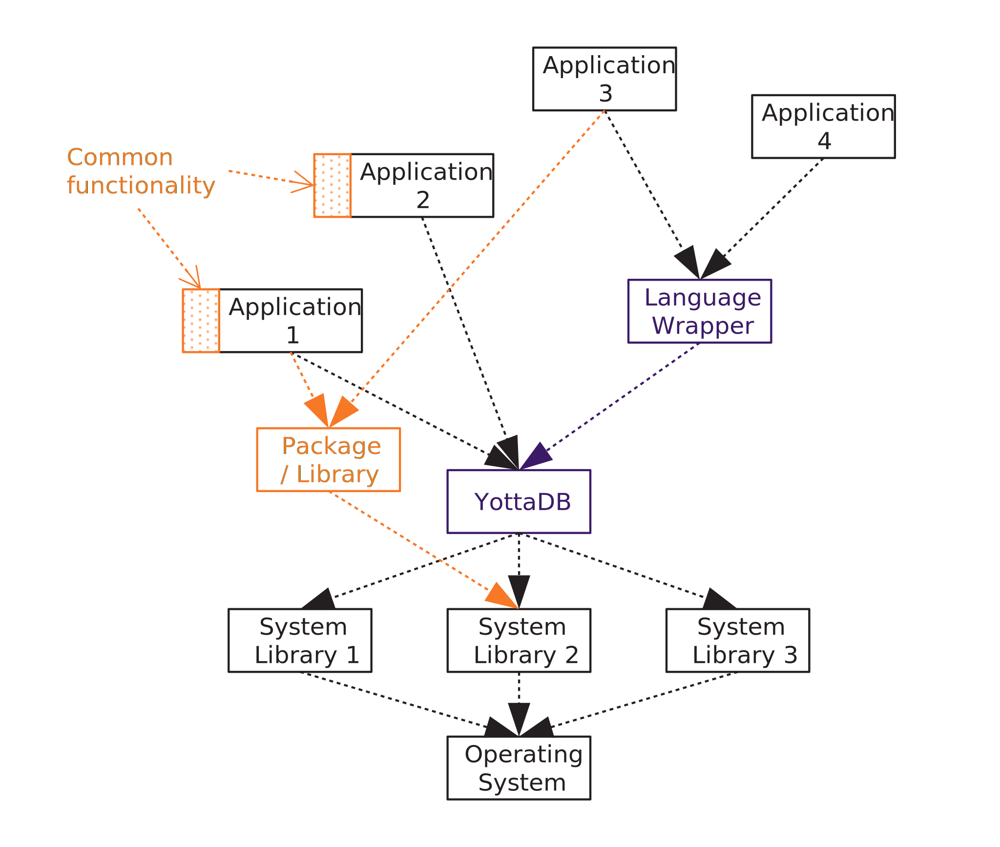
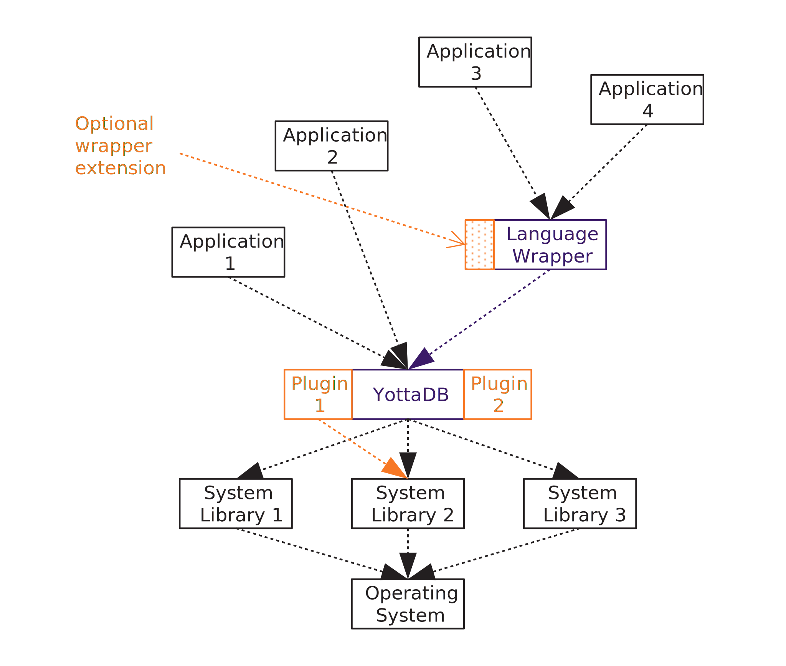

.. ###############################################################
.. #                                                             #
.. # Copyright (c) 2019-2025 YottaDB LLC and/or its subsidiaries.#
.. # All rights reserved.                                        #
.. #                                                             #
.. # Portions Copyright (c) Fidelity National                    #
.. # Information Services, Inc. and/or its subsidiaries.         #
.. #                                                             #
.. #     This document contains the intellectual property        #
.. #     of its copyright holder(s), and is made available       #
.. #     under a license.  If you do not know the terms of       #
.. #     the license, please stop and do not read further.       #
.. #                                                             #
.. ###############################################################

.. index::
   Extending YottaDB

=============================
Appendix G: Extending YottaDB
=============================

.. contents::
   :depth: 2

-----------------------------------
Applications, Wrappers, and Plugins
-----------------------------------

Broadly speaking, there are three ways to extend YottaDB functionality: applications, wrappers, and plugins.  YottaDB is systems software, i.e., infrastructure that is generally useful rather than solving the needs of specific end users. Applications like library catalogs, electronic health records, vehicle fleet managers, factory automation, and banking systems can be built on YottaDB to solve end user needs.

Native APIs in C and M expose the functionality of YottaDB. A wrapper accesses the native APIs to expand the availability of functionality in those APIs, for example, to application programs in another language. A wrapper does not necessarily add functionality. The `Go wrapper <https://docs.yottadb.com/MultiLangProgGuide/goprogram.html>`_ is a wrapper developed by YottaDB. `NodeM <https://github.com/dlwicksell/nodem>`_ and the `Perl YottaDB module <https://metacpan.org/pod/YottaDB>`_ are examples of wrappers developed by the YottaDB community.

Whether a wrapper is installed in the same directory as YottaDB or whether it is installed elsewhere depends on the language implementation. For example, `Go <https://golang.org>`_ expects the YottaDB wrapper to reside in its directory structure, whereas a C++ wrapper could reside in the YottaDB directory. From the perspective of YottaDB, there needs to be only one copy of a language wrapper for each language implementation; where multiple copies are needed, the need arises from the language implementation rather than from YottaDB.

Figure 1 shows a representative application software stack for YottaDB applications. YottaDB calls system libraries, which in turn rely on services provided by the operating system.

    Figure 1 - Software Layers

On a system, there is typically one copy of each version of a system library or a release of YottaDB - although a release of YottaDB can be installed in multiple directories on a system, there is no benefit to doing so. That single installation of YottaDB installed in a directory can be used by any number of applications on the system. Sometimes, these are different applications; at other times, they may be multiple installations of the same application, corresponding to multiple development and testing needs, or different production environments.

Also as shown in Figure 1, applications can call packages and libraries other than YottaDB, and packages may have common code. In Figure 1, Applications 1 and 2 may both include code to serialize a YottaDB local or global variable structure into `JSON <https://json.org>`_ and back. Applications 1 and 3 may both store time-series data in YottaDB, and include an interface to an external `Discrete Fourier Transform <https://en.wikipedia.org/wiki/Discrete_Fourier_transform>`_ package or library.

Although YottaDB itself is extended by YottaDB developers, additional functionality can be installed in :code:`$ydb_dist` so that applications using YottaDB can access the additional functionality as if that were part of YottaDB.  Installed in the YottaDB directory, :code:`$ydb_dist`, plugins increase the breadth of YottaDB's functionality. Potential benefits include:

- Simpler application configuration - access to a plugin residing in :code:`$ydb_dist` can be accessible to applications as part of their configuration to access YottaDB.
- Code sharing - common functionality can be reusably packaged, resulting in standardized code and in turn, less code to maintain.

A plugin increases the breadth of YottaDB's functionality, and if a wrapper is appropriately extended, can make that additional functionality available through the wrapper. `Octo <https://gitlab.com/YottaDB/DBMS/YDBOcto>`_ and the `GDE GUI <https://gitlab.com/YottaDB/UI/YDBGDEGUI>`_ are examples of plugins developed by YottaDB. The `M web server <https://github.com/shabiel/M-Web-Server>`_ is an example of a plugin developed by the YottaDB community.

Figure 2 shows the same software with functionality moved to plugins. The common functionality shared by Applications 1 and 2 has moved to Plugin 2. The external package / library called by Applications 1 and 3 has moved to Plugin 1. Depending on specific details of the functionality in and API of Plugin 1, the Language Wrapper may need an extension to access it.

    Figure 2 - Software Layers with Plugins

As plugins are installed in the YottaDB directory (under :code:`$ydb_dist`), and need to be available to all wrappers and all applications, they need to conform to rules described here.

-------
Plugins
-------

As both M and C have limitations in the information hiding they provide, plugins use namespacing to avoid colliding with applications and with one another. Some of the namespacing conventions are historical, as are the terms call-in (calling from C to M) and call-out (calling from M to C). Names of entities (variables, files, functions, etc.) in plugins are conceptually identified using a triple of (developer, plugin, entity).

A developer name has a long form (e.g., "YottaDB") and a short form (e.g., "YDB"). "YottaDB" and "YDB" are used in the examples below; substitute your developer names for your plugins.  While developer and plugin names are case-insensitive, file names and variable names may need to use specific cases, as described below.  As developer names must be unique, please email info@yottadb.com to reserve your short- and long-form names.

Except for `executable names`_, plugin names and entity names are entirely up to you. The examples below use "Octo" and "GDEGUI" as examples of plugin names.

The short form developer name concatenated with a plugin name is called a package name, e.g., "ydbocto" or "ydbgdegui".

An installed plugin consists of:

- C functions, all or some of which may be callable from M code. C functions are installed in shared libraries containing object code Call-out tables make C functions available to M code.

- M routines, all or some of whose entryrefs may be callable from C code. M routines are installed as shared libraries or object files for object code (shared libraries are preferred). Call-in tables make M entryrefs available to C code. Also:

  - As M programs can be introspective (i.e., access and act on their own source code), a plugin can also include :code:`.m` M source code files.
  - In addition to the standard M-mode object code, if YottaDB is installed with UTF-8 support, each M routine also has UTF-8 mode object code.

- Databases (database files and global directories used to access them).

- Environment variables.

- Executable files (either binary images or shell scripts) that can be executed directly from the shell.

- Include files, such as those needed to compile software that accesses plugins.

- Other (non-executable) files, such as configuration files. As C programs are not introspective, source code for C and other non-introspective languages would not be installed with plugins.

In addition to files installed under :code:`$ydb_dist` which are common to all application processes using them, when a plugin executes in an application environment or instance, it will almost certainly need local variables. It may also need permanent and temporary global variables, and may also need to dynamically generate code. For example, the YottaDB Octo plugin will need to compute and store statistics to speed up queries, and to generate code for SQL queries. These are specfic to each application environment or instance.

There are standards for all of the above, with the twin goals of:

- eliminating collisions between plugins and minimizing the potential for collision between plugins and applications; and

- enabling the environment set up by sourcing the :code:`ydb_env_set` file (e.g., with :code:`source /usr/local/etc/ydb_env_set`) to make YottaDB and installed plugins available.

+++++++++++
C Functions
+++++++++++

Externally visible C function names start with the short developer name, an underscore, the plugin name, an underscore, and the exposed function name, e.g., :code:`ydb_octo_dosql()`. C functions are installed as shared libraries.

- Shared library file names use the package name, e.g., :code:`libydbocto.so`. Optionally, a plugin may provide multiple shared libraries with the same prefix, e.g., :code:`libydboctodbg.so` and :code:`libydboctoopt.so`. Shared libraries of C functions are installed in :code:`$ydb_dist/plugin`.

- If a package exports any C functions, or makes M functions available to C code, it should provide a C function :code:`<developername>_<pluginname>_version()` which returns a version number for the package that complies with `Semantic Versioning <https://semver.org/>`_.

C functions can optionally be made available to M application code.

- Call-out tables to make C functions available to M code (as described in `Chapter 11. Integrating External Routines of the M Programmers Guide <../ProgrammersGuide/extrout.html>`_) use the package name, e.g., :code:`ydbocto.xc`. The first line of the call-out table is :code:`$ydb_dist/plugin/` followed by the shared library name, e.g., :code:`$ydb_dist/plugin/libydbocto.so`. [#]_

.. [#] Since environment variables are permitted in the shared library
  file name reference, an environment variable can be used to choose
  between the :code:`libydboctodbg.so` and :code:`libydboctoopt.so`
  examples above.

- Environment variables to allow M code to locate call-out tables are of the form :code:`ydb_xc_<packagename>`. For example, to expose an Octo :code:`select()` function in :code:`libydbocto.so` the environment variable :code:`ydb_xc_ydbocto` would point to :code:`$ydb_dist/plugin/ydbocto.xc` to allow M application code :code:`$&ydbocto.select(…)` to invoke the function.

For each :code:`$ydb_dist/plugin/<packagename>.xc` file, the :code:`ydb_env_set` file sets a :code:`ydb_xc_<packagename>` environment variable to point to that file.

++++++++++
M Routines
++++++++++

As the M routine namespace within a process is flat, the M routines of a plugin must be named to minimize the probability of collision not just with one another but also with applications. By convention, M applications are written to avoid names starting with :code:`%Y` or :code:`%y`.

- M routine names start with :code:`%Y` or :code:`%y`, followed by the package name followed by a specific routine name. The specific routine name is optional, if a package has only one routine.  If the package name starts with "Y", there is no need to start with a double letter, e.g., :code:`%YDBPOSIX` in routine :code:`_YDBPOSIX.m`. M routine source files are in :code:`$ydb_dist/plugin/r`.

- The M mode object code for plugins is in :code:`$ydb_dist/plugin/o`. While each routine can be compiled into its own :code:`.o` file, we recommend that each plugin have all its object code placed in a shared library named :code:`<packagename>.so`, with no :code:`.o` files installed.

- If YottaDB is installed with UTF-8 support, the UTF-8 mode object code is in :code:`$ydb_dist/plugin/o/utf8` with the same recommendation to use shared libraries rather than individual object files.

- If a package provides any M routines, or makes any C functions available to M code, it should provide an entryref :code:`$$version^<packagename>()` which returns a version number for the package that complies with `Semantic Versioning <https://semver.org/>`_.

M routines can optionally be made available to C application code.

- Call-in tables (as described in `Chapter 11. Integrating External Routines of the M Programmers Guide <../ProgrammersGuide/extrout.html>`_) use the package name and are placed in the plugin directory, e.g., :code:`$ydb_dist/plugin/ydbocto.cip`. C code selects the appropriate call-in table using :code:`ydb_ci_tab_set()` .  To avoid perturbing an application's call-in tables, C code in plugins must use :code:`ydb_ci_tab_get()` and :code:`ydb_ci_tab_set()` around their C→M calls to save and restore an application's call in table.

Sourcing the :code:`ydb_env_set` file in M mode includes any shared libraries in :code:`$ydb_dist/plugin/o` in :code:`$ydb_routines` as well as :code:`$ydb_dist/plugin/o($ydb_dist/plugin/r)` if there are any :code:`.o` files in :code:`$ydb_dist/plugin/o`. When sourced in UTF-8 mode (:code:`$ydb_chset=UTF-8`), :code:`ydb_env_set` includes any shared libraries in :code:`$ydb_dist/plugin/o/utf8` in :code:`$ydb_routines` as well as :code:`$ydb_dist/plugin/o/utf8($ydb_dist/plugin/r)` if there are any :code:`.o` files in :code:`$ydb_dist/plugin/o/utf8`.

Note that YottaDB implements M code introspection in two ways:

- Embedding the source code in the object file. This is accomplished with the `-embed_source compiler command line option <../ProgrammersGuide/devcycle.html#no-embed-src>`_.

- Embedding the path to the source code in the object file (the default). To provide introspection with this option the M routines should be placed in :code:`$ydb_dist/plugin/r` and then compiled.

+++++++++
Databases
+++++++++

Database files and global directories used to access them are located in :code:`$ydb_dist/plugin`. Database files and global directories use the package name, e.g., :code:`ydbocto.dat` and :code:`ydbocto.gld`.

Database files use the MM access method and are installed with read-only file permissions and are flagged as read-only in database file headers (modeled on help database files in :code:`$ydb_dist`).

Global directories specify :code:`$ydb_dist/plugin` as the directory path to database files.

Plugin M application code using databases in :code:`$ydb_dist/plugin` can use extended references or set the intrinsic special variable :code:`$zgbldir` and restore it after use. Plugin C application code must set :code:`$zgbldir` and restore it after use. As global directories provide complete global variable name isolation, plugins are free to use global variable names of their choice.

+++++++++++++++++++++
Environment Variables
+++++++++++++++++++++

While there is no YottaDB restriction on environment variables, our recommendation is to use environment variables consisting of the developer name, an underscore, the package name, and a variable name, e.g., :code:`ydb_gdegui_html` in the (admittedly unlikely) event that the YottaDB GDE GUI has an option to optimize for different levels of the HTML standard.

.. _executable names:

.. _executables:

+++++++++++
Executables
+++++++++++

Executables are files that can be directly executed from the shell. Executables are free to use package names, e.g., :code:`ydbocto` or :code:`ydbgdegui`. To reserve an executable name that is not a package name, please contact us at info@yottadb.com.

You may have an executable that is an executable shell script (or any script starting with :code:`#!` for which Linux provides an interpreter that sets up an environment and then calls a binary executable. To implement this, create the shell script with the package name, invoking the binary executable as :code:`$ydb_dist/plugin/bin/<packagename>.bin`.

Sourcing the :code:`ydb_env_set` file creates aliases for all executable files in :code:`$ydb_dist/plugin/bin` except executable :code:`.bin` files.

Other than :code:`.bin` files, executable files provided by packages should have a :code:`--version` or :code:`-v` command line option that reports a version number for the package that complies with `Semantic Versioning <https://semver.org/>`_.

+++++++++++++
Include Files
+++++++++++++

Include (header) files with templates and prototypes are optionally prefixed with a traditional prefix for the language (e.g., :code:`lib`), the package name, and optionally, additional names if a package has more than one include file. Include files are placed in :code:`$ydb_dist/plugin/inc`. For example, if there were a YottaDB time-series package called :code:`Times`, its C header file might be :code:`$ydb_dist/plugin/inc/libydbtimes.h`.

++++++++++++++++++++++++++++
Other (non-executable) Files
++++++++++++++++++++++++++++

Non-executable files (e.g., configuration files, meta data, header files) belong in the directory :code:`$db_dist/plugin/etc/<packagename>`. When creating the package name directory, the package installer should create the :code:`etc` sub-directory if it does not exist. Package installers must ensure that files in this directory do not have any execute bits set.

+++++++++++++++
Local Variables
+++++++++++++++

M code in plugins must NEW local variables that are not needed beyond the QUIT from the entryref call.

C code in plugins and M code that needs configuration or other state beyond the QUIT from an entryref call can use local variables prefixed with :code:`%y` followed by the package name. For package names starting with "Y", there is no need to double that initial letter.

.. _permanent global variable:

++++++++++++++++++++++++++
Permanent Global Variables
++++++++++++++++++++++++++

"Permanent" global variables are those which should persist beyond the lifetime of current processes, and which should be replicated, for example, global variables storing cross references to accelerate queries. Global variables used by plugins use :code:`^%y` followed by the package name. In this case, the "y" *must* be lower case. For package names starting with "Y", there is no need to double that initial letter.

++++++++++++++++++
Dynamic M Routines
++++++++++++++++++

Dynamically generated M routines go in the first source directory specified by :code:`$zroutines`.  To find the first source directory of $zroutines, discard any leading space separated pieces that end in :code:`.so`. Then take the shorter of (a) the the first space separated piece or (b) the first close parenthesis separated piece. From that piece, take the last open parenthesis separated piece. Discard any trailing asterisk (*).

There is no need to explicitly compile dynamically generated M routines, which will automatically be compiled on first use.

++++++++++++++++++++++++++
Temporary Global Variables
++++++++++++++++++++++++++

Temporary global variables are those which need not persist beyond the lifetime of current processes and need not be replicated, for example for multiple processes (or threads within a process) to collaborate on a computation such as a query which can be accelerated by having multiple parallel computations whose results can combined to produce a final result.

For temporary global variables, use :code:`mktemp -d` (or equivalent alternative) to create a temporary directory, preferably in non-persistent storage (so that if the system crashes, there is not a need to separately delete the space). In that directory, create a global directory file and database using the MM access method.

If an application uses a `permanent global variable`_ to share the location of the temporary directory, remember to include logic in the design of the plugin to delete the information once the temporary directory is no longer relevant.

.. raw:: html

    
