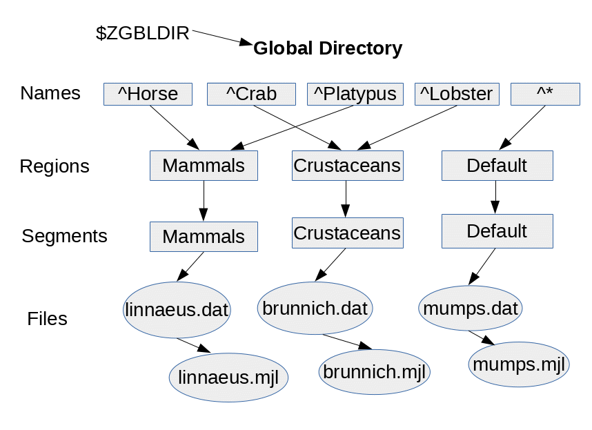
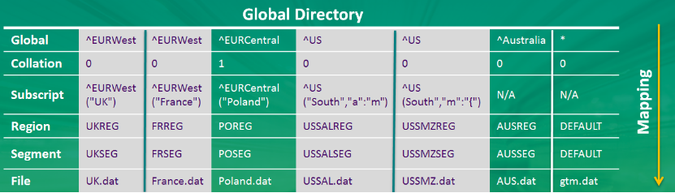

.. index:: 
   Global Directory Editor

=============================
4. Global Directory Editor
=============================

.. contents::
   :depth: 5

----------------------
Global Directory
----------------------

A global directory is analogous to a telephone directory. Just as a telephone directory helps you find a phone number (and an address) given a person's name, a global directory helps YottaDB processes find the database file of an M global variable node. But because its life is independent of the databases it maps, a global directory has a second purpose in addition to holding key mappings, which is to hold database characteristics for MUPIP CREATE. While changes to the mappings take effect as soon as a process loads a new global directory, MUPIP CREATE transfers the other characteristics to the database file. Other YottaDB processes never use the global directory defined characteristics, so they always use those in the database file.

YottaDB manages routines in files and libraries separately from globals. For more information on routine management, refer to the `Development Cycle chapter in the Programmer's Guide <https://docs.yottadb.com/ProgrammersGuide/devcycle.html>`_.

A set of M global variables (Names or Name spaces) and/or their subscripts map to Regions that define common sets of properties such as the maximum record length and whether null subscripts collate in conformance to the M standard. Each Region maps to a Segment that defines the properties relating to the file system such as the file name, the initial allocation, and number of global buffers. These properties and mapping rules are stored in a binary file called global directory. By default, a global directory file has an extension of .gld. You can specify any filename and extension of your choice for a global directory as long as it is valid on your operating system; the documentation always uses the default extension.

The location of the global directory is pointed to by the Intrinsic Special Variable $ZGBLDIR. YottaDB processes initialize $ZBGLDIR at process startup from the environment variable ydb_gbldir and can modify it during execution. For example, with a simple SET $ZGBLDIR command, a process can switch back and forth between development and testing databases.

Consider a global variable ^TMP that holds only temporary data that is no longer meaningful when a system is rebooted. A global directory can map ^TMP to region TEMP that maps to a database file called scratch.dat, with all other globals mapped to mumps.dat. A global directory allows the separation of persistent data (mumps.dat) from non-persistent data(scratch.dat), so that each database file may get appropriately configured for operations — for example, the database administrator may choose to exclude scratch.dat from backup/archival procedures or periodically delete and recreate scratch.dat using MUPIP CREATE.

Consider the following illustration: 

There are four M global variables--^Horse, ^Crab, ^Platypus, and ^Lobster. ^Horse and ^Platypus map to region MAMMALS that maps to database file linnaeus.dat and ^Crab and ^Lobster map to region CRUSTACEANS that maps to database file brunnich.dat. The default namespace * maps to a region called DEFAULT that maps to database file mumps.dat. * denotes all globals other than the explicitly named ^Horse, ^Platypus, ^Crab, and ^Lobster. All globals store data in their respective database files. Each database file has a single active journal file. To enforce access restrictions on globals so that only mammalogists have access to ^Horse and ^Platypus and only carcinologists have access to ^Crab and ^Lobster, one just needs to assign appropriate read/write permissions to linnaeus.dat and brunnich.dat.

.. note::
   Each database file can have a single active journal file. A journal can be linked to its predecessor journal file to form a chain of journal files. 

You can also map different subscripts of the same global to different regions when subscripts have logically separable data. Consider the following global directory example:

^US and ^EURWest have logically separable subscripts that map to different regions. ^EURCentral holds data that has a different collation order than the others, so it maps to a different region. Such mapping improves operational administration and permits a larger total size. It may also improve performance if the access patterns of the distinct parts allow accesses to all or some of them to use optimizations in the YottaDB database engine, for example, to optimize serial accesses. 

In a nutshell, the database attributes and mapping rules defined in a global directory allow you to: 

* **Finer-grained Access Control**- To block access, or updates, to a portion of the data.

* **Improve Operational Administration**- When a global becomes so big that breaking it up improves operational administration or permit a larger total size.

* **Compliment Application Design**- To separate globals and/or their subscripts in a way that achieves a design goal without writing additional code. For example, mapping globals to regions that are not replicated.

* **Manage Volatility**- some data is static, or relatively so, and you wish to leverage that to tailor your backup and integrity verification patterns, or to use MM access.

* **Improve Manageability and Performance**- When a global variable is overloaded with logically separate data, distributing the logically separate components each to its own database region improves manageability and performance when access patterns use optimization in the YottaDB database engine.

-----------------------
GDE Overview
-----------------------

The Global Directory Editor (GDE) is a utility for creating, examining, and modifying a global directory. GDE is a program written in M and you can invoke it from the shell with $ydb_dist/mumps -run ^GDE. If you invoke it from the shell, GDE returns a status indicating success (0) or an issue (non-zero).

Because GDE is an M program, you can also invoke GDE from a YottaDB process with DO ^GDE. If you invoke GDE with a DO and modify the map of globals that are currently directly opened by that process, you must HALT and restart the process for the process to pick up the revised mapping. YottaDB expects users to normally run GDE from the shell: --$ydb_dist/mumps -run GDE.

The input to GDE can be a command file. In a production environment, YottaDB recommends using command files to define database configurations and putting them under version control.

.. note::
   A global directory stores database attributes and mapping rules. Processes use mapping rules to determine which database file contains a global variable node. MUPIP CREATE uses database attributes to create new database file(s). Once MUPIP CREATE applies the database attributes to create a database file, YottaDB does not use the attributes until the next MUPIP CREATE. If you use MUPIP SET (or DSE) to change the attributes of a database file, always perform an equivalent change to any global directory used for a subsequent MUPIP CREATE. Conversely, if you change attributes with GDE, existing database files must be explicitly changed with MUPIP SET or DSE.

+++++++++++++++++++++++++++++++++++++++++
Identifying the Current Global Directory
+++++++++++++++++++++++++++++++++++++++++

At process startup, the environment variable ydb_gbldir identifies the global directory to the process. M application code can access and change the global directory through the $ZGBLDIR intrinsic special variable, which is initialized from $ydb_gbldir at process startup. M application code can also use extended global references with the || or {} syntax.

Note that $ydb_gbldir/$ZGBLDIR are pathnames. If they do not start with a "/", then the pathname is relative and YottaDB searches for the global directory starting in the current working directory.

To change the Global Directory used by processes, specify a new value for ydb_gbldir.

Example:

.. parsed-literal::
   $ export ydb_gbldir=/home/jdoe/node1/prod.gld

When you invoke GDE and no Global Directory exists for ydb_gbldir, GDE creates a minimal default Global Directory that is a starting point or template for building global directories for your specific needs.

To retain the default Global Directory, exit GDE without making any changes.

Example:

.. parsed-literal::
   $ export ydb_gbldir=/home/jdoe/node1/prod.gld

++++++++++++++++++++++++++++++++++++
Creating a Default Global Directory
++++++++++++++++++++++++++++++++++++

When you invoke GDE and no Global Directory exists for ydb_gbldir, GDE produces a default Global Directory that contains a minimal set of required components and values for database characteristics. It can be used for purposes such as development and testing work. A default Global Directory also serves as a starting point or template for building custom global directories.

To retain the default Global Directory, quit GDE without making any changes.

Example:

.. parsed-literal::
   $ ydb_gbldir=/usr/accntg/jones/mumps.gld
   $ export ydb_gbldir
   $ $ydb_dist/mumps -dir
   YDB>do ^GDE
   %GDE-I-GDUSEDEFS, Using defaults for Global Directory
   /usr/accntg/jones/mumps.gld
   GDE> EXIT
   %GDE-I-VERIFY, Verification OK
   %GDE-I-GDCREATE, Creating Global Directory file
   /usr/accntg/jones/mumps.gld

+++++++++++++++++++++++++++++++++++++++++++++++
 Mapping Global Variables in a Global Directory
+++++++++++++++++++++++++++++++++++++++++++++++

Mapping is the process of connecting a global variable name or a subtree or a subscript range to a database file.

A complete mapping has the following four components:

* NAME
* REGION
* SEGMENT
* FILE

These components may be defined in any order, but the final result must be a complete logical path from name to file:

.. parsed-literal::
   NAME(s) --> REGION --> SEGMENT --> FILE

The default Global Directory contains one complete mapping that comprises these entries for name, region, segment, and file.

.. parsed-literal::
   * --> DEFAULT --> DEFAULT --> mumps.dat
   (NAME) (REGION) (SEGMENT) (FILE)

The * wildcard identifies all possible global names. Subsequent edits create entries for individual global names or name prefixes.

Regions and segments store information used to control the creation of the file. The characteristics stored with the region and segment are passed to MUPIP only when creating the database file using the CREATE command, so subsequent changes to these characteristics in the Global Directory have no effect on an existing database.

On EXIT, GDE validates the global directory to ensure that every legal global variable node maps to exactly one region; that every region has at least one global variable node mapping to it and that it maps to exactly one segment; that every segment has exactly one region mapping to it; and that the attributes for each region and segment are internally consistent. GDE will not create a structurally unsound global directory, and will not exit until it validates the global directory. Informational messages advise you of structural inconsistencies.

+++++++++++++++++++++++++++++++++++++++
Examining the Default Global Directory
+++++++++++++++++++++++++++++++++++++++

A Global Directory looks like this:

.. parsed-literal::
                                         \*\*\* Templates \*\*\*
    Region                  Def Coll     Rec Size   Key Size   Null Subs   Std Null Coll   Jnl   Inst Freeze on Err   Qdb Rundown   Epoch Taper   AutoDb  Stats   Lock Crit
    ------------------------------------------------------------------------------------------------------------------------------------------------------------------------
    <default>                   0          256        64        NEVER           N           N              N               N             Y          N        Y      SEP

   
    Segment                Active        Acc   Typ    Block     Alloc   Exten   Options
    ---------------------------------------------------------------------------------------
    <default>                *           BG    DYN    4096       100     100    GLOB=1024
                                                                                LOCK=40
                                                                                RES=0
                                                                                ENCR=OFF
                                                                                MSLT=1024
                                                                                DALL=YES
                                                                                AIO=OFF
    <default>                            MM   DYN     4096       100      100   DEFER
                                                                                LOCK=40
                                                                                MSLT=1024
                                                                                DALL=YES

             \*\*\* NAMES \*\*\*
    Global                      Region
    -----------------------------------
      *                       DEFAULT

                                      \*\*\* REGIONS \*\*\*
    Region             Dynamic Segment        Def Coll   Rec Size   Key Size    Null Subs   Std Null Coll  Jnl  Inst Freeze on Err   Qdb Rundown  Epoch Taper  AutoDB  Stats   Lock Crit
    -------------------------------------------------------------------------------------------------------------------------------------------------------------------------------------
    DEFAULT            DEFAULT                  0         256         64           NEVER          N         N           N                 N            Y          N      Y       SEP

                                       \*\*\* SEGMENTS \*\*\*
    Segment                File (def ext: .dat)      Acc  Typ   Block   Alloc  Exten  Options
    ---------------------------------------------------------------------------------------------
    DEFAULT                  mumps.dat               BG   DYN    4096    100    100   GLOB=1024
                                                                                      LOCK=40
                                                                                      RES=0
                                                                                      ENCR=OFF
                                                                                      MSLT=1024
                                                                                      DALL=YES
                                                                                      AIO=OFF

                                        \*\*\* MAP \*\*\*
    ----------------------------- Names ---------------------------------------------
    From                Up to                      Region/Segment/File (def ext: .dat)
    ----------------------------------------------------------------------------------
    %                   ...                           REG=DEFAULT
                                                      SEG=DEFAULT
                                                      FILE=mumps.dat
    LOCAL LOCKS                                       REG=DEFAULT
                                                      SEG=DEFAULT
                                                      FILE=mumps.dat

There are five primary sections in a Global Directory

* TEMPLATES
* NAMES
* REGIONS
* SEGMENTS
* MAP

The function of each section in the Global Directory is described as follows:

**TEMPLATES**

This section of the Global Directory provides a default value for every database or file parameter passed to YottaDB as part of a region or segment definition. GDE uses templates to complete a region or segment definition where one of these necessary values is not explicitly defined.

GDE provides initial default values when creating a new Global Directory. You can then change any of the values using the appropriate -REGION or -SEGMENT qualifiers with the TEMPLATE command.

**NAMES**

An M program sees a monolithic global variable namespace. The NAMES section of the Global Directory partitions the namespace so that a global name or a global name with a subscript range reside in different database files. An M global can reside in one or more database files, each database file can store many M globals.

**REGIONS**

The REGIONS section lists all of the regions in the Global Directory. Each region defines common properties for a set of M global variables or nodes; therefore, multiple sets of names from the NAMES section map onto a single region.

You assign these values by specifying the appropriate qualifier when you create or modify individual regions. If you do not specify a value for a particular parameter, GDE assigns the default value from the TEMPLATES section.

**SEGMENTS**

This section of the Global Directory lists currently defined segments. While regions specify properties of global variables, segments specify the properties of files. There is a one-to-one mapping between regions and segments. You assign these values by specifying the appropriate qualifier when you create or modify individual segments. If you do not specify a value for a particular parameter, GDE assigns the default value from the TEMPLATES section.

**MAP**

This section of the Global Directory lists the current mapping of names to region to segment to file. In the default Global Directory, there are two lines in this section: one specifies the destination for all globals, the other one is for M LOCK resources with local variable names. If you add any new mapping component definitions (that is, any new names, regions, or segments), this section displays the current status of that mapping. Any components of the mapping not currently defined display "NONE". Because GDE requires all elements of a mapping to be defined, you will not be able to EXIT (and save) your Global Directory until you complete all mappings.

+++++++++++++++++++++++++++++++
Global Directory Abbreviations
+++++++++++++++++++++++++++++++

GDE uses the following abbreviations to display the output of a global directory. The following list show global directory abbreviations with the associated qualifiers. For a description of the function of individual qualifiers, see `"GDE Command Summary" <https://docs.yottadb.com/AdminOpsGuide/gde.html#gde-command-summary>`_. 

+-----------------------------------------+----------------------------------------+
| Abbreviation                            | Full Form                              |
+=========================================+========================================+
| Acc                                     | -ACCESS_METHOD                         |
+-----------------------------------------+----------------------------------------+
| AIO                                     | -[NO]ASYNCIO                           |
+-----------------------------------------+----------------------------------------+
| Alloc                                   | -ALLOCATION                            |
+-----------------------------------------+----------------------------------------+
| AutoDB                                  | -[NO]AUTODB                            |
+-----------------------------------------+----------------------------------------+
| Autoswitch                              | -AUTOSWITCHLIMIT                       |
+-----------------------------------------+----------------------------------------+
| Block                                   | -BLOCK_SIZE                            |
+-----------------------------------------+----------------------------------------+
| Buff                                    | -BUFFER-SIZE                           |
+-----------------------------------------+----------------------------------------+
| Dall                                    | -[NO]DEFER_ALLOCATE                    |
+-----------------------------------------+----------------------------------------+
| Def Coll                                | -COLLATION_DEFAULT                     |
+-----------------------------------------+----------------------------------------+
| Epoch Taper                             | -[NO]EPOCHTAPER                        |
+-----------------------------------------+----------------------------------------+
| Exten                                   | -EXTENSION_COUNT                       |
+-----------------------------------------+----------------------------------------+
| File                                    | -FILE_NAME                             |
+-----------------------------------------+----------------------------------------+
| GLOB                                    | -GLOBAL_BUFFER_COUNT                   |
+-----------------------------------------+----------------------------------------+
| Inst Freeze on Err                      | -[NO]INST_FREEZE_ON_ERROR              |
+-----------------------------------------+----------------------------------------+
| JNL                                     | -[NO]JOURNAL                           |
+-----------------------------------------+----------------------------------------+
| Key Size                                | -KEY_SIZE                              |
+-----------------------------------------+----------------------------------------+
| LOCK                                    | -LOCK_SPACE                            |
+-----------------------------------------+----------------------------------------+
| LOCK Crit                               | -[NO]LOCK_CRIT                         |
+-----------------------------------------+----------------------------------------+
| MSLT                                    | -MUTEX_SLOTS                           |
+-----------------------------------------+----------------------------------------+
| Null Subs                               | -[HO]NULL_SUBSCRIPTS                   |
+-----------------------------------------+----------------------------------------+
| Qdb Rndwn                               | -[NO]QDBRUNDOWN                        |
+-----------------------------------------+----------------------------------------+
| Std Null Coll                           | -[NO]STDNULLCOLL                       |
+-----------------------------------------+----------------------------------------+
| Rec Size                                | -RECORD_SIZE                           |
+-----------------------------------------+----------------------------------------+
| RES                                     | -RESERVED_BYTES                        |
+-----------------------------------------+----------------------------------------+
| Region                                  | -REGION                                |
+-----------------------------------------+----------------------------------------+
| Stats                                   | -[NO[STATS                             |
+-----------------------------------------+----------------------------------------+
| Typ                                     | -DYNAMIC_SEGMENT                       |
+-----------------------------------------+----------------------------------------+

++++++++++++++++++++++++++++++++
Customizing a Global Directory
++++++++++++++++++++++++++++++++

Once you have installed YottaDB and verified its operation, create Global Directories based on your needs. To create customized Global Directories, use the appropriate GDE commands and qualifiers to build each desired Global Directory. The GDE commands are described later in this chapter.

You can also create a text file of GDE commands with a standard text editor and process this file with GDE. In a production environment, this gives better configuration management than interactive usage with GDE.

**Adding a Journaling Information Section**

If you select the -JOURNAL option when you ADD or CHANGE a region in a Global Directory, the following section is added to your Global Directory and displays when you invoke SHOW. The columns provided display the values you selected with the journal options, or defaults provided by YottaDB for any options not explicitly defined.

.. parsed-literal::
                                            \*\*\* JOURNALING INFORMATION \*\*\*
   Region               Journal File (def extL .mjl)        Before     Buff    Alloc   Exten   Autoswitch
   --------------------------------------------------------------------------------------------------------
   DEFAULT           $gtmdir/$ydb_rel/g/yottadb.mjl         Y         2308    2048     2048    8386560

For more information about journaling, see the section on the JOURNAL qualifier in this chapter and `Chapter 6: “YottaDB Journaling” <https://docs.yottadb.com/AdminOpsGuide/ydbjournal.html>`_.

-----------------------
Using GDE
-----------------------

The default installation procedure places the GDE utility into a directory assigned to the environment variable ydb_dist.

To invoke GDE:

from within YottaDB, use the command:

.. parsed-literal::
   YDB>do ^GDE

from the shell, enter:

.. parsed-literal::
   $ mumps -r GDE

GDE displays informational messages like the following, and then the GDE> prompt:

.. parsed-literal::
   %GDE-I-LOADGD, loading Global Directory file /prod/mumps.gld
   %GDE-I-VERIFY, Verification OK
   GDE>

If this does not work, contact your system manager to investigate setup and file access issues.

.. note::
   Even when invoked from within YottaDB, GDE always uses the ydb_gbldir environment variable to identify its target.

To leave GDE:

* Use the GDE EXIT command to save all changes and return to the caller.

  .. parsed-literal::
     GDE> EXIT

* Use the GDE QUIT command to discard all changes and return to the caller. This will not save any changes.

  .. parsed-literal::
     GDE> QUIT

+++++++++++++++++++++++
Guidelines for Mapping
+++++++++++++++++++++++

This section lists the parameters that apply to defining each component of a mapping.

**NAMES**

The NAMES section contains mappings of M global name spaces. More than one name space can map to a single region but a single name space can only map to one region.

A name space:

* Is case-sensitive
* Must begin with an alphabetic character or a percent sign (%).
* Can be a discrete "global" name, for example, aaa corresponds to the global variable ^aaa.
* Can be a global name ending with a wild card ("*"), for example, abc* represents the set of global nodes which have abc as the starting prefix.
* Can be a subtree of a global name, for example, abc(1) represents a subtree of the global ^abc. 
* Can be a subscript range, for example, abc(1:10) represents all nodes starting from ^abc(1) up to (but not including) to ^abc(10).
* A global name can be one to 31 alphanumeric characters. However, the combined length of a global and its subscripts is limited to 1,019 bytes (the maximum key size supported by YottaDB). Note that the byte length of the subscripted global specification can exceed the maximum KeySize specified for its region. 
* Maps to only one region in the Global Directory.

**REGIONS**

The REGIONS section contains mappings of the database. A region is a logical structure that holds information about a portion of the database, such as key-size and record-size. A key is the internal representation of a global variable name. In this chapter the terms global variable name and key are used interchangeably. A record refers to a key and its data.

A Global Directory must have at least one region. A region only maps to a single segment. More than one name may map to a region.

A region name:

* Can include alphanumerics, dollar signs ($), and underscores ( _ ).
* Can have from 1 to 31 characters.

GDE automatically converts region names to uppercase, and uses DEFAULT for the default region name.

**SEGMENTS**

The SEGMENTS section contains mappings for segments. A segment defines file-related database storage characteristics. A segment must map to a single file. A segment can be mapped by only one region.

YottaDB uses a segment to define a physical file and an access method for the database stored in that file.

A segment-name:

* Can include alphanumerics, dollar signs ($), and underscores ( _ )
* Can have from one to 31 characters

GDE automatically converts segment names to uppercase. GDE uses DEFAULT for the default segment name.

**FILE**

Files are the structures provided by UNIX for the storage and retrieval of information. Files used by YottaDB must be random-access files resident on disk.

By default, GDE uses the file-name mumps.dat for the DEFAULT segment. GDE adds the .dat to the file name when you do not specify an extension. Avoid non-graphic and punctuation characters with potential semantic significance to the file system in file names as they will produce operational difficulties.

**Example of a Basic Mapping**

To complete this procedure, you must have already opened a Global Directory.

* ADD a new global variable name.

  .. parsed-literal::
     GDE> add -name cus -region=cusreg
  
This maps the global name cus to the region cusreg.

* ADD region cusreg, if it does not exist.

  .. parsed-literal::
     GDE> add -region cusreg -dynamic=cusseg

This creates the region cusreg and connects it to the segment cusseg. -d[ynamic] is a required qualifier that takes the associated segment-name as a value.

* ADD segment cusreg, if it does not exist, and link it to a file.

  .. parsed-literal::
     GDE> add -segment cusseg -file=cus.dat

This creates the segment cusseg and connects it to the file cus.dat.

To review the information you have added to the Global Directory, use the SHOW command.

To perform a consistency check of the configuration, use the VERIFY command.

To exit the Global Directory and save your changes, use the EXIT command. GDE performs an automatic verification. If successful, the mappings and database specifications become part of the Global Directory, available for access by processes, utilities, and the run-time system.

Only MUPIP CREATE uses the database specifications; run-time processes and other utility functions only use the map. 

-------------------------------
Global Director Editor Commands
-------------------------------

This section describes GDE commands. GDE allows abbreviations of commands. The section describing each command provides the minimum abbreviation for that command and a description of any qualifiers that are not object-related. The section discussing the object-type describes all the associated object-related qualifiers.

Command Syntax:

The general format of GDE commands is:

.. parsed-literal::
   command [-object-type] [object-name] [-qualifier]

where:

-object-type : Indicates whether the command operates on a -N[AME] space, -R[EGION], or -S[EGMENT].
object-name: Specifies the name of the N[AME] space, R[EGION], or S[EGMENT]. Objects of different types may have the same name. Name spaces may include the wildcard operator (*) as a suffix.
-qualifier: Indicates an object qualifier.

The format description for each individual command specifies required qualifiers for that command.

The @, EXIT, HELP, LOG, QUIT, SETGD, and SPAWN commands do not use this general format. For the applicable format, refer to the section explaining each of these commands.

Comments on command lines start with an exclamation mark (!) and run to the end of the line. 

.. note::
   An exclamation mark not enclosed in quotation marks ("")(for example in a subscript) causes GDE to ignore the rest of that input line.

++++++++++++++++++++++++++++++++++++++
Specifying File Names in Command Lines
++++++++++++++++++++++++++++++++++++++

File names must either appear as the last item on the command line or be surrounded by quotation marks. Because UNIX file naming conventions permit the use of virtually any character in a file-name, once a qualifier such as -FILE_NAME or -LOG introduces a file name and the first character after the equal sign is not a quotation mark, YottaDB treats the entire remainder of the line as the file-name. When using quotation marks around file-names, GDE interprets a pair of embedded quotation marks as a single quotation mark within the file-name. Note that the use of Ctrl or punctuation characters such as exclamation mark (!), asterisk (*), or comma (,) in a file-name is likely to create significant operational file management challenges. YottaDB strongly recommends against such practices.

+++++++++++++++++++++++++++++++++++++++++++++++++++++
Font/Capitalization Conventions Used in this Chapter
+++++++++++++++++++++++++++++++++++++++++++++++++++++

All YottaDB and GDE commands and qualifiers may be entered in either upper or lower case at the command prompt. However, when you SHOW your current Global Directory, GDE uses the following case conventions: 

* Region and segment names always display in uppercase

* Name space object names always appear in the case in which they are entered.

* File-names always appear in the case in which they are entered.

.. note::
   The .dat extension is appended to the file-name when the database file is created, but does not appear in the Global Directory listing, unless you enter it that way.

The descriptions of these commands and qualifiers appear in various cases and fonts throughout this documentation. This section describes the conventions used in describing these commands and qualifiers.

* In text: all YottaDB commands and qualifiers appear in uppercase.

* In examples: the entire command line is shown in lower case.

+++
\@
+++

The @ command executes a GDE command file. Use the @ command to execute GDE commands stored in a text file.

The format of the @ command is:

.. parsed-literal::
   @file-name

The file-name specifies the command file to execute. Use the file-name alone for a file in the current working directory or specify the relative path or the full path to the file.

GDE executes each line of the command file as if it were entered at the terminal.

Example:

.. parsed-literal::
   GDE> @standard

This command executes the GDE commands in the file "standard" in the current working directory. "standard" should contain GDE commands; comments should start with an exclamation mark (!). 

+++
Add
+++

The ADD command inserts a new name, region, or segment into the Global Directory.

The format of the ADD command is one of the following: 

.. parsed-literal::
   A[DD] -G[BLNAME] global-name [-GBLNAME-qualifier ...]
   A[DD] -N[AME] namespace -R[EGION]=region-name
   A[DD] -R[EGION] region-name -D[YNAMIC]=segment-name [-REGION-qualifier...]
   A[DD] -S[EGMENT] segment-name [-SEGMENT-qualifier...] -F[ILE_NAME]=file-name 

The ADD command requires specification of an object-type and an object-name. GDE supplies default values from the templates for qualifiers not explicitly supplied in the command.

namespace specifies a global name or a global name with subscript(s) or a global name with a subscript range in the form of global[[*]|[(from-subscript:[to-subscript])]].

Name spaces and file-names are case-sensitive; other objects are not case-sensitive.

~~~~~~~
-Name
~~~~~~~

Maps a namespace to a region in the global directory. The format of the ADD -NAME command is:

.. parsed-literal::
   A[DD]-N[AME] namespace -R[EGION]=region-name

* You can map a global and its subtrees to different regions.

* You can also use a colon (:) to map ranges of subscripted names and their subtrees to a region. Ranges are closed on the left and open on the right side of the colon. For example, add -name PRODAGE(0:10) -region DECADE0 maps ^PRODAGE(0) to ^PRODAGE(9), assuming the application always uses integer subscripts, to region DECADE0.

* You can also use $CHAR() and $ZCHAR() to specify unprintable characters as subscripts. "" (an empty string) or no value (e.g. 20: or :20 or :) specify open-ended ranges, which span, on the left, from the first subscript ("") to on the right, the last possible string.

* Regions that contain global variables sharing the same unsubscripted name that span regions must use standard null collation; attempting to use the deprecated original null collation produces an error.

Example:

.. parsed-literal::
   GDE> add    -name IMPL                             -region=OTHERMUMPS  ! Map MUMPS implementations to OTHERMUMPS
   GDE> add    -name IMPL("YottaDB")                  -region=MYMUMPS     ! While mapping YottaDB to MYMUMPS

These examples map an entire subtree of a global to a region.

Example:

.. parsed-literal::
   GDE> add    -name PRODAGE(0:10)                    -region=DECADE0     ! Ranges are closed on the left and open on the right
   GDE> add    -name PRODAGE(10:20)                   -region=DECADE1     ! PRODAGE(10) maps to DECADE1
   GDE> add    -name PRODAGE(20:30)                   -region=DECADE2

This example uses a colon (:) to map ranges of subscripted names and their subtrees to a region. Note that ranges are specific numbers or strings - GDE does not support wildcards (using "*") in ranges.

Example:

.. parsed-literal::
   GDE> add    -name=PRODAGE(:10)                     -region=DECADE0     ! This line and the next are equivalent
   GDE> add    -name PRODAGE("":10)                   -region=DECADE0     ! numbers up to, but not including, 10
   GDE> add    -name PRODAGE(20:)                     -region=DECADE2     ! 20 thru all numbers (> 20) + strings
   GDE> add    -name PRODAGE(20:"")                   -region=DECADE2     ! same as the add just above

These examples demonstrate the use of $CHAR() and $ZCHAR() to specify unprintable characters. Notice that the arguments are positive integers (exponential - E syntax not allowed), and valid code points for $CHAR() or in range for $ZCHAR(), both with respect to the current $ZCHSET. Also, "" (an empty string) or no value (e.g. 20: or :20 or :) specify open-ended ranges which span on the left, from the first subscript ("") to on the right, the last possible string.

Example:

.. parsed-literal::
   GDE> add    -name MODELNUM                         -region=NUMERIC
   GDE> add    -name MODELNUM($char(0):)              -region=STRING

This example map numeric subscripts and strings to separate regions.

Example:

.. parsed-literal::
   GDE> add    -name DIVISION("Europe","a":"m")       -region EUROPEAL
   GDE> add    -name DIVISION("Europe","m":"z")       -region EUROPEM
   GDE> add    -name DIVISION("Australia")            -region AUSTRALIA
   GDE> add    -name DIVISION("USA","South","a":"m")  -region USSAL
   GDE> add    -name DIVISION("USA","South","m":"{")  -region USSMZ
   GDE> add    -name DIVISION("USA","WestCoast")      -region USWC

This example maps global variables with the same unsubscripted name at multiple subscript levels.

Example:

.. parsed-literal::
   GDE> add    -name x                               -region=REG1
   GDE> add    -name x(5)                            -region=REG1
   GDE> add    -name x(5,10:)                        -region=REG2
   GDE> add    -name x(5:20)                         -region=REG2
   GDE> add    -name x(20)                           -region=REG2
   GDE> add    -name x(20,40)                        -region=REG2
   GDE> add    -name x(20,40,50:)                    -region=REG3
   GDE> add    -name x(20,40:)                       -region=REG3
   GDE> add    -name x(20:)                          -region=REG3

This example performs the following mapping:

* from ^x, up to but not including ^x(5,10), maps to REG1

* from ^x(5,10), up to but not including ^x(20,40,50), maps to REG2

* from ^x(20,40,50) through the last subscript in ^x maps to REG 3

~~~~~~~~~  
-Segment
~~~~~~~~~

Maps a segment to a database file. The syntax of the ADD -SEGMENT command is:

.. parsed-literal::
   A[DD]-S[EGMENT] segment-name [-SEGMENT-qualifier...] -F[ILE_NAME]=file-name

Example:

.. parsed-literal::
   GDE> add -segment temp -file_name=scratch

This command creates a segment-name TEMP and maps it to the file scratch.dat in the current working directory. However, if you were to specify scratch as the file-name, in other words an environment variable, each process uses the file using the translation of that environment variable at run-time.

~~~~~~~~
-Region
~~~~~~~~

Maps a region to a segment. The syntax of the ADD -REGION command is:

.. parsed-literal::
   A[DD]-R[EGION] region-name -D[YNAMIC]=segment-name [-REGION-qualifier...]

~~~~~~~~~
-Gblname
~~~~~~~~~

Provides a mechanism to specify the collation for global variables sharing the same unsubscripted name. Specifying a collation is necessary for globals that span multiple regions and and use an alternate collation. Because the global name EURCentral (described in the Introduction section) uses an alternate collation, it requires an entry in the GBLNAME section. The format of the ADD -GBLNAME command is:

.. parsed-literal::
   A[DD] -G[BLNAME] -C[OLLATION]=collation_number

* Because string subscripts are subject to collation (the unsubscripted portion of a global variable name and numeric subscripts are not), GDE needs to know the collation sequence number associated with each unsubscripted global variable name. M standard collation (the default) has a collation number of zero (0). As a consequence, when you use alternative collation(s) (other than 0), the collation transforms must be available to GDE in the same way as they are to other YottaDB components. All of a global (all nodes sharing the same unsubscripted global name) must have a single collation, which is implicitly the case for globals that do not span multiple regions.

* Globals that do not span multiple regions and do not have any collation characteristics defined in the GBLNAME section of the global directory take on the default collation characteristics defined in the database region to which they map. On the other hand, globals that span multiple regions have their collation implicitly (collation 0), or explicitly, established by the GBLNAME section of the global directory and cannot adopt a differing collation based on the region collation characteristic. Because YottaDB determines collation for globals spanning multiple regions by the GBLNAME characteristic, which cannot change once the database files are created, GDE reports collation on many error messages.

Example:

.. parsed-literal::
   GDE> add    -gblname EURCentral -collation=1
   GDE> show   -gblname
            \*\*\* GBLNAMES \*\*\*
   Global                             Coll  Ver
   ------------------------------------------------------------------------------
   EURCentral                           1    0

+++++++++++
Change
+++++++++++

The CHANGE command alters the name-to-region or region-to-segment mapping and/or the environment for a region or segment.

The format of the CHANGE command is: 

.. parsed-literal::
   C[HANGE] -G[BLNAME] -C[OLLATION]=collation_number
   C[HANGE] -I[INSTANCE] -F[ILE_NAME={repl_inst_filename|""}
   C[HANGE] -N[AME] namespace -R[EGION]=new-region
   C[HANGE] -R[EGION] region-name [-REGION-qualifier...]
   C[HANGE] -S[EGMENT] segment-name [-SEGMENT-qualifier...]

The CHANGE command requires specification of an object-type and object-name.

Once you exit GDE, mapping changes take effect for any subsequent image activation (for example, the next RUN or the mumps -direct command). Changes to database parameters only take effect for new database files created with subsequent MUPIP CREATE commands that use the modified Global Directory. Use the MUPIP SET command (or in some cases DSE) to change characteristics of existing database files.

Example:

.. parsed-literal::
   GDE> change -region master -dynamic=temp -key=100

This command changes the region "master" to use the segment "temp" and establishes a maximum KEY_SIZE of 100 characters for the next creation of a file for this region. The segment change takes effect the first time the system uses the Global Directory after the GDE session EXITs, while the KEY_SIZE change takes effect after the next MUPIP CREATE that creates a new database file for segment temp.

++++++++++++++
Delete
++++++++++++++

The DELETE command removes a name, region, or segment from the Global Directory. The DELETE command does not delete any actual data. However, YottaDB does not access database files that do not have mapped global variables except through extended references using an alternative global directory that does not map to them. Note that YottaDB replication does not support global updates made with extended references, unless they actually map to a database file that is a part of the replicated instance.

The format of the DELETE command is: 

.. parsed-literal::
   D[ELETE] -G[BLNAME] global-name
   D[ELETE] -N[AME] namespace
   D[ELETE] -R[EGION] region-name
   D[ELETE] -S[EGMENT] segment-name

The DELETE command requires specification of an object-type and object-name.

Deleting a name removes the namespace-to-region mapping. Deleting a region unmaps all names mapped to the region. Deleting a segment unmaps the region mapped to the segment.

You may map the deleted names to another region or the deleted region to another segment using the CHANGE command.

The default namespace (*) cannot be deleted.

Example:

.. parsed-literal::
   GDE> del -name T*

This command deletes the explicit mapping of all global names starting with the letter "T." This command does not delete any global variables. However, it may make preexisting globals starting with the letter "T" invisible, at least while using this global directory, because the T* global names map to the default namespace going forward. 

++++++++
Exit
++++++++

The EXIT command writes all changes made in the current GDE editing session to the Global Directory and terminates the current editing session.

The format of the EXIT command is:

.. parsed-literal::
   E\[XIT\]

GDE performs a full verification test (VERIFY) on the data. If the verification succeeds, GDE writes the new Global Directory to file system and issues a verification message.

If the verification fails, GDE displays a listing of all unverifiable mappings and waits for corrections. Make appropriate corrections, or leave the Global Directory in its original, unedited state by using the QUIT command.

If you have not made any changes to the Global Directory, GDE does not save a new Global Directory unless the original global directory had an older format which GDE has automatically upgraded. Note that while GDE upgrades older global directories to the current version, there is no facility to downgrade global directories to prior versions, so you should always save copies of any global directories that might be needed to retrieve archival data.

+++++
Help
+++++

The HELP command displays online information about GDE commands and qualifiers.

The format of the HELP command is:

.. parsed-literal::
   H\[ELP\] \[topic...\]

where topic specifies the GDE command for which you want information. If you omit the topic, GDE prompts you for it. 

++++++++
LOCKS
++++++++

The LOCKS command specifies the region into which YottaDB maps "local" locks(those with resource names not starting with a caret symbol ^). GDE maps locks on resource names starting with a caret symbol to the database region mapped for the global variable name matching the resource name.

The format of the LOCKS command is:

.. parsed-literal::
   LOC[KS] -R[EGION]=region-name

The LOCKS -REGION= qualifier allows specification of a region for local locks. By default, GDE maps local locks to the DEFAULT region.

Example:

.. parsed-literal::
   GDE> lock -region=main

This command maps all locks on resource names that don't start with the caret symbol, "^" to the region "main".

.. note::
   YottaDB associates LOCKs for global names with the database region holding the corresponding unsubscripted global name. Supposing a global called ^EURWest spans multiple regions in multiple global directories, a command like LOCK ^EURWest may not work in the same way as it would if ^EURWest did not span multiple regions. Before using a command like LOCK ^EURWest where ^EURWest spans multiple regions in multiple directories, ensure that the corresponding unsubscripted ^EURWest maps to the same region in all of the global directories. Alternatively, you can use LOCK globalname (with no leading up-arrow) and control LOCK interactions with the LOCKS global directory characteristic or use transaction processing to eliminate the use of LOCKs to protect global access. 

+++
LOG
+++

The LOG command creates a log file of all GDE commands and displays for the current editing session. The system places an exclamation point (!) (i.e., the comment symbol) before all display lines that are not entered by the user. In the log, the log can be used with the @ symbol as a command procedure.

The format of the LOG command is: 

.. parsed-literal::
   LOG
   LOG -ON[=file-name]
   LOG -OF[F]

The LOG command, without a qualifier, reports the current status of GDE logging. The LOG command displays a message showing whether logging is in effect and the specification of the current log file for the GDE session.

The log facility can be turned on and off using the -ON or -OFF qualifiers any time during a GDE session. However, GDE closes the log files only when the GDE session ends.

The -ON qualifier has an optional argument of a file, which must identify a legal UNIX file. If LOG -ON has no file-argument, GDE uses the previous log file for the editing session. If no log file has previously been specified during this editing session, GDE uses the default log file GDELOG.LOG.

Example:

.. parsed-literal::
   GDE> log -on="standard.log"

This command turns on logging for the session and directs the output to standard.log.

++++
Quit
++++

The QUIT command ends the current editing session without saving any changes to the Global Directory. GDE does not update the Global Directory file.

The format of the QUIT command is:

.. parsed-literal::
   Q\[UIT\]

If the session made changes to the Global Directory, GDE issues a message warning that the Global Directory has not been updated.

++++++
Rename
++++++

The RENAME command allows you to change a namespace, the name of a region, or the name of a segment.

The format of the RENAME command is:

.. parsed-literal::
   R[ENAME] -G[BLNAME] old-global-name new-global-name
   R[ENAME] -N[AME] old-name new-name
   R[ENAME] -R[EGION] old-region-name new-region-name
   R[ENAME] -S[EGMENT] old-segment-name new-segment-name

The RENAME command requires the specification of an object-type and two object-names.

When renaming a region, GDE transfers all name mappings to the new region. When renaming a segment, GDE transfers the region mapping to the new segment.

Example:

.. parsed-literal::
   GDE> rename -segment stable table

This command renames segment "stable" to "table" and shifts any region mapped to "stable" so it is mapped to "table".

+++++
SETGD
+++++

The SETGD command closes edits on one Global Directory and opens edits on another.

The format of the SETGD command is: 

.. parsed-literal::
   SE\[TGD\] -F\[ILE\]=file-name \[-Q\[UIT\]\]

The -FILE=file-name specifies a different Global Directory file. When you provide a file-name without a full or relative pathname, GDE uses the current working directory; if the file is missing an extension, then GDE defaults the type to .gld.

The -QUIT qualifier specifies that any changes made to the current Global Directory are not written and are lost when you change Global Directories.

SETGD changes the Global Directory that GDE is editing. If the current Global Directory has not been modified, or the -QUIT qualifier appears in the command, the change simply occurs. However, if the current Global Directory has been modified, GDE verifies the Global Directory, and if the verification is successful, writes that Global Directory. If the verification is not successful, the SETGD fails.

Example:

.. parsed-literal::
   GDE> SETGD -f="temp"

This changes the Global Directory being edited to "temp". The quotation marks around the file name identifies the name of the file unequivocally to UNIX. If the -f is the final qualifier on the line, then the quotation marks are unnecessary.

+++++++++
Show
+++++++++

The SHOW command displays information contained in the Global Directory about names, regions, and segments.

The format of the SHOW command is:

.. parsed-literal::
   SH[OW]
   SH[OW] -A[LL]
   SH[OW] -C[OMMAND] -F[ILE]=[gde-command-file]
   SH[OW] -G[BLNAME]
   SH[OW] -I[NSTANCE]
   SH[OW] -M[AP] [-R[EGION]=region-name]
   SH[OW] -N[AME] [namespace]
   SH[OW] -R[EGION] [region-name]
   SH[OW] -S[EGMENT] [segment-name]
   SH[OW] -T[EMPLATE]

-COMMAND: Displays GDE commands that recreate the current Global Directory state.

-F[ILE]=gde-command-file: Optionally specifies a file to hold the GDE commands produced by -COMMAND. -FILE must must always appear after -COMMAND.

Please consider using command files produced with the SHOW -COMMAND -FILE for creating new regions and segments in a global directory as the defaults come from the templates. If you inadvertently upgrade a global directory, you can use SHOW -COMMAND to create a file of commands that you can input to GDE with the prior YottaDB release to recreate the prior global directory file.

SHOW -COMMAND displays the GDE commands for creating names, regions, and segments of the current global directory state in a target environment. However, it does not always include the same template settings (SHOW -TEMPLATE) of the current global directory. SHOW -COMMAND creates an appropriate set of templates that minimize other adjustments to recreate the current global directory. If the current GDE template settings (SHOW -TEMPLATE) are important for your application, you need to set them again after applying the commands from GDE SHOW -COMMAND in the target environment.

.. note::
   When GDE encounters an error while executing the @command-file command, it stops processing the command file and returns to the operator prompt, which gives the operator the option of compensating for the error. If you subsequently issue @command-file command again in the same session for the same command-file, GDE resumes processing it at the line after the last error.

-ALL: Displays the entire Global Directory. This qualifier corresponds to displaying "all" sections of the SHOW report: 

.. parsed-literal::
   ***TEMPLATES***, ***NAMES***, ***REGIONS***, ***SEGMENTS***, ***MAP***, ***INSTANCE***.

By default, SHOW displays -ALL.

-GBLNAME, -INSTANCE, -MAP, -NAME, -REGION, -SEGMENT, and -TEMPLATE are qualifiers that cause GDE to display selected portions of the Global Directory as follows:

- INSTANCE: Displays the current Instance Mapping, if any. This qualifier corresponds to the section of the SHOW report titled:

.. parsed-literal::
   ***INSTANCE***
  
-MAP: Displays the current mapping of all names, regions, segments, and files. This qualifier corresponds to the section of the SHOW report titled \*\*\*MAP\*\*\*. The output of a SHOW -MAP may be restricted to a particular region by specifying a -REGION qualifier with a region name argument.

-TEMPLATE: Displays the current region and segment templates. This qualifier corresponds to the section of the SHOW report titled: 

.. parsed-literal::
  \*\*\* TEMPLATES \*\*\*

If you want to print the Global Directory, create a log file by executing LOG -ON= before executing the SHOW command. The -LOG command captures all the commands entered and output. You can print the log file if you want a hard-copy record.

If you want to export the current Global Directory state, create a GDE command file with the SHOW -COMMAND -FILE=gde-command-file and run it in the target environment.

Example:

.. parsed-literal::
   GDE>SHOW TEMPLATE

                           \*\*\* TEMPLATES \*\*\*
  Region              Def Coll     Rec Size   Key Size  Null Subs   Std Null Coll  Jnl   Inst Freeze on Err  Qdb Rndwn  Epoch Taper  AutoDB  Stats  LOCK Crit
  ------------------------------------------------------------------------------------------------------------------------------------------------------------
  <default>              0           256        64       NEVER            N         N             N              N           Y          N      Y      Sep

  Segment                 Active       Acc      Typ   Block        Alloc    Exten   Options
  -------------------------------------------------------------------------------------------
  <default>                 *          BG      DYN    4096         100       100   GLOB=1024
                                                                                   LOCK=40
                                                                                   RES=0
                                                                                   ENCR=OFF
                                                                                   MSLT=1024
                                                                                   DALL=YES
                                                                                   AIO=OFF
  <default>                            MM      DYN    4096         100       100   DEFER
                                                                                   LOCK=40
                                                                                   MSLT=1024
                                                                                   DALL=YES

This displays only the TEMPLATES section of the Global Directory.

.. parsed-literal::
   GDE>SHOW -command 
   TEMPLATE -REGION -NOAUTODB
   TEMPLATE -REGION -COLLATION_DEFAULT=0
   TEMPLATE -REGION -EPOCHTAPER
   TEMPLATE -REGION -NOINST_FREEZE_ON_ERROR
   TEMPLATE -REGION -JOURNAL=(ALLOCATION=2048,AUTOSWITCHLIMIT=8386560,BEFORE_IMAGE,BUFFER_SIZE=2312,EXTENSION=2048)
   TEMPLATE -REGION -KEY_SIZE=64
   TEMPLATE -REGION -NOLOCK_CRIT
   TEMPLATE -REGION -NULL_SUBSCRIPTS=NEVER
   TEMPLATE -REGION -NOQDBRUNDOWN
   TEMPLATE -REGION -RECORD_SIZE=256
   TEMPLATE -REGION -STATS
   TEMPLATE -REGION -NOSTDNULLCOLL
   !
   TEMPLATE -REGION -NOJOURNAL
   !
   TEMPLATE -SEGMENT -ACCESS_METHOD=BG
   TEMPLATE -SEGMENT -ALLOCATION=100
   TEMPLATE -SEGMENT -NOASYNCIO
   TEMPLATE -SEGMENT -BLOCK_SIZE=4096
   TEMPLATE -SEGMENT -DEFER_ALLOCATE
   TEMPLATE -SEGMENT -NOENCRYPTION_FLAG
   TEMPLATE -SEGMENT -EXTENSION_COUNT=100
   TEMPLATE -SEGMENT -GLOBAL_BUFFER_COUNT=1024
   TEMPLATE -SEGMENT -LOCK_SPACE=40
   TEMPLATE -SEGMENT -MUTEX_SLOTS=1024
   TEMPLATE -SEGMENT -RESERVED_BYTES=0
   !
   TEMPLATE -SEGMENT -ACCESS_METHOD=MM
   TEMPLATE -SEGMENT -ALLOCATION=100
   TEMPLATE -SEGMENT -NOASYNCIO
   TEMPLATE -SEGMENT -BLOCK_SIZE=4096
   TEMPLATE -SEGMENT -DEFER
   TEMPLATE -SEGMENT -DEFER_ALLOCATE
   TEMPLATE -SEGMENT -NOENCRYPTION_FLAG
   TEMPLATE -SEGMENT -EXTENSION_COUNT=100
   TEMPLATE -SEGMENT -GLOBAL_BUFFER_COUNT=1024
   TEMPLATE -SEGMENT -LOCK_SPACE=40
   TEMPLATE -SEGMENT -MUTEX_SLOTS=1024
   TEMPLATE -SEGMENT -RESERVED_BYTES=0
   !
   TEMPLATE -SEGMENT -ACCESS_METHOD=BG
   !
   DELETE -REGION DEFAULT
   DELETE -SEGMENT DEFAULT
   ADD -REGION AUSREG -DYNAMIC_SEGMENT=AUSSEG
   ADD -REGION DEFAULT -DYNAMIC_SEGMENT=DEFAULT
   ADD -REGION FRREG -DYNAMIC_SEGMENT=FRSEG
   ADD -REGION POREG -DYNAMIC_SEGMENT=POSEG
   ADD -REGION UKREG -DYNAMIC_SEGMENT=UKSEG
   ADD -REGION USSALREG -DYNAMIC_SEGMENT=USSALSEG
   ADD -REGION USSMZREG -DYNAMIC_SEGMENT=USSMZSEG
   !
   ADD -SEGMENT AUSSEG -FILE_NAME="AUS.dat"
   ADD -SEGMENT DEFAULT -FILE_NAME="mumps.dat"
   ADD -SEGMENT FRSEG -FILE_NAME="France.dat"
   ADD -SEGMENT POSEG -FILE_NAME="Poland.dat"
   ADD -SEGMENT UKSEG -FILE_NAME="UK.dat"
   ADD -SEGMENT USSALSEG -FILE_NAME="USSAL.dat"
   ADD -SEGMENT USSMZSEG -FILE_NAME="USSMZ.dat"
   !
   ADD -GBLNAME EURCentral -COLLATION=1
  !
   LOCKS -REGION=DEFAULT
   ADD -NAME Australia -REGION=AUSREG
   ADD -NAME EURCentral("Poland") -REGION=POREG
   ADD -NAME EURWest("France") -REGION=FRREG
   ADD -NAME EURWest("UK") -REGION=UKREG
   ADD -NAME US("South","a":"m") -REGION=USSALREG
   ADD -NAME US("South","m":"{") -REGION=USSMZREG
   !

This command displays the GDE commands to recreate the spanning region example described in the Introduction section. 

++++++++++++
Template
++++++++++++

The TEMPLATE command maintains a set of -REGION and -SEGMENT qualifier values for use as templates when ADDing regions and segments. When an ADD command omits qualifiers, GDE uses the template values as defaults.

GDE maintains a separate set of -SEGMENT qualifier values for each ACCESS_METHOD. When GDE modifies the ACCESS_METHOD, it activates the appropriate set of TEMPLATEs and sets all unspecified qualifiers to the template defaults for the new ACCESS_METHOD. Use the GDE SHOW command to display qualifier values for all ACCESS_METHODs.

The format of the TEMPLATE command is:

.. parsed-literal::
   T[EMPLATE] -R[EGION] [-REGION-qualifier...]
   T[EMPLATE] -S[EGMENT] [-SEGMENT-qualifier...]

The TEMPLATE command requires specification of an object-type.

Example:

.. parsed-literal::
   GDE> template -segment -allocation=200000

This command modifies the segment template so that any segments ADDed after this time produce database files with an ALLOCATION of 200,000 GDS blocks. 

+++++++
Verify
+++++++

The VERIFY command validates information entered into the current Global Directory. It checks the name-to-region mappings to ensure all names map to a region. The VERIFY command checks region-to-segment mappings to ensure each region maps to a segment, each segment maps to only one region, and the segment maps to a UNIX file. The EXIT command implicitly performs a VERIFY -ALL.

The format of the VERIFY command is: 

.. parsed-literal::
   V[ERIFY]
   V[ERIFY] -A[LL]
   V[ERIFY] -G[BLNAME]
   V[ERIFY] -M[AP]
   V[ERIFY] -N[AME] [namespace]
   V[ERIFY] -R[EGION] [region-name]
   V[ERIFY] -S[EGMENT] [segment-name]
   V[ERIFY] -T[EMPLATE]

The object-type is optional. -MAP, -TEMPLATE, and -ALL are special qualifiers used as follows:

-MAP : Checks that all names map to a region, all regions map to a segment, and all segments map to a file.
-TEMPLATE : Checks that all templates currently are consistent and useable.
-ALL : Checks all map and template data.
VERIFY with no qualifier, VERIFY -MAP, and VERIFY -ALL each check all current information.

Example:

.. parsed-literal::
   GDE> verify -region regis

This command verifies the region "regis".

-----------------------------------
Name, Region and Segment Qualifiers
-----------------------------------

The -NAME, -REGION, and -SEGMENT qualifiers each have additional qualifiers used to further define or specify characteristics of a name, region, or segment. The following sections describe these additional qualifiers. 

+++++++++++++++
Name Qualifiers
+++++++++++++++

The following -NAME qualifier can be used with the ADD or CHANGE commands.

.. parsed-literal::
   -REGION=region-name

Specifies the name of a region. Region names are not case-sensitive, but are represented as uppercase by GDE.

The minimum length is one alphabetic character.

The maximum length is 31 alphanumeric characters.

Example:

.. parsed-literal::
   GDE> add -name a* -region=areg

This command creates the namespace a*, if it does not exist, and maps it to the region areg.

**Summary**

+-------------------------------------+-------------------+-------------------------+-----------------------------------+
| Qualifier                           | Default           |  Minimum                | Maximum                           |
+=====================================+===================+=========================+===================================+
| -R[EGION]=region-name (characters)  | (none)            | 1A                      | 16 A/N                            |
+-------------------------------------+-------------------+-------------------------+-----------------------------------+

++++++++++++++++++
Region Qualifiers
++++++++++++++++++

The following -REGION qualifiers can be used with the ADD, CHANGE, or TEMPLATE commands.

~~~~~~~~~~~~~~
-[NO]AU[TODB]
~~~~~~~~~~~~~~

Specifies whether YottaDB should implicitly create a database file for the region if none exists when a process attempts to access it. Because it carries lower operational risk and provides better operational control, the common practice is to create database files with MUPIP CREATE. However, AUTODB may simplify operations when you have scratch or temporary databases which are best deleted and recreated as a part of standard operation procedures.

The default is NOAUTODB.

~~~~~~~~~~~~~~~~~~~~~~~~~~~~
-C[OLLATION_DEFAULT]=number
~~~~~~~~~~~~~~~~~~~~~~~~~~~~

Specifies the number of the collation sequence definition to be used as the default for this database file. The number can be any integer from 0 to 255. The number you assign as a value must match the number of a defined collation sequence that resides in the shared library pointed to by the environment variable ydb_collate_n. For information on defining this environment variable and creating an alternate collation sequence, refer to the `"Internationalization" chapter in the Programmer's Guide <https://docs.yottadb.com/ProgrammersGuide/internatn.html>`_.

The minimum COLLATION_DEFAULT number is zero, which is the standard M collation sequence.

The maximum COLLATION_DEFAULT number is 255.

By default, GDE uses zero (0) as the COLLATION_DEFAULT.

~~~~~~~~~~~~~~~~~~~~~~~~~~~~~~~~~
-D[YNAMIC_SEGMENT]=segment-name
~~~~~~~~~~~~~~~~~~~~~~~~~~~~~~~~~

Specifies the name of the segment to which the region is mapped. Segment-names are not case-sensitive, but are displayed as uppercase by GDE.

The minimum length is one alphabetic character.

The maximum length is 31 alphanumeric characters.

~~~~~~~~~~~~~~~~~
-[NO]EPOCHTAPER
~~~~~~~~~~~~~~~~~

Tries to minimize epoch duration by reducing the number of buffers to flush by YottaDB and the file system (via an fsync()) as the epoch (time-based or due to a journal file auto-switch) approaches. By default, EPOCHTAPER is enabled.

~~~~~~~~~~~~~~~~~~~~~~~~~~~~
-[NO]INST[_FREEZE_ON_ERROR]
~~~~~~~~~~~~~~~~~~~~~~~~~~~~

Controls whether custom errors in a region should automatically cause an Instance Freeze. This qualifier modifies the value of "Inst Freeze on Error" file header element.

For more information on setting up a list of custom errors that automatically invoke an Instance Freeze, refer to “Instance Freeze”.

For more information on setting or clearing an Instance Freeze on an instance irrespective of whether any region is enabled for the Instance, refer to “Starting the Source Server”.

~~~~~~~~~~~~~~~~~~~~~~~~~~~~~~~~~~~~~
-[NO]J[OURNAL][=journal-option-list]
~~~~~~~~~~~~~~~~~~~~~~~~~~~~~~~~~~~~~

This qualifier establishes characteristics for the journal file on newly created databases.

-NOJOURNAL specifies that updates to the database file are not journaled. -NOJOURNAL does not accept an argument assignment.

-JOURNAL specifies that journaling is allowed. -JOURNAL takes one or more arguments in a journal-option-list. The journal-option-list contains keywords separated with commas (,) enclosed in parentheses ( ) with file-names quoted (for example, change -region test -journal=(before,file="foo") . If the list contains only one keyword, the parentheses and quotes are optional.

Although you do not have to establish the criteria for your journaling process at this point, it is efficient to do so, even if you are not entirely sure you will use journaling. The options available for -JOURNAL set up the environment, so it is ready for you to enable with MUPIP SET -JOURNAL. You can also change or add any of the established options at that time.

For more information about journaling, see `Chapter 6: “YottaDB Journaling” <https://docs.yottadb.com/AdminOpsGuide/ydbjournal.html>`_.

The journal-option-list includes:

* A[LLOCATION]=blocks

* AUTOSWITCHLIMIT=blocks

* [NO]BE[FORE_IMAGE]

* BU[FFER_SIZE]=pages

* E[XTENSION]=blocks

* F[ILE_NAME]=file-specification-name

The following section describes some -JOURNAL options.

**-AU[TOSWITCHLIMIT]=blocks**

Specifies the limit on the size of a journal file. When the journal file size reaches the limit, YottaDB automatically switches to a new journal file with a back-pointer to the prior journal file.

**-[NO]BE[FORE_IMAGE]**

[NO]BEFORE_IMAGE controls whether the journal should include before-image records.

The BEFORE_IMAGE option is required if you plan to consider "roll-back" (Backward) recovery of the associated database file or if you plan to use certain database replication options. For a description of this type of recovery, refer to the "YottaDB Journaling" chapter.

**-F[ILE_NAME]="file-name"**

Specifies the name of the journal file.

Unless the name is the sole journaling option, and is the last parameter on the line, it should always be enclosed in quotation marks in this context.

Journal file-specification-names are limited to 255 characters.

By default, GDE derives the file-specification-name from the database "file-name".

By default, GDE uses a journal file extension of .mjl.

**Journal Options Summary**

With GDE, you can create the journal files and define the journal parameters; however, you must use MUPIP SET to explicitly turn it ON, and you must specify BEFORE/NOBEFORE at that time.

Example:

.. parsed-literal::
   CHANGE -REGION DEFAULT -JOURNAL=(ALLOCATION=2048,AUTOSWITCHLIMIT=8386560,BEFORE_IMAGE,BUFFER_SIZE=2312,EXTENSION=2048)

For information on all Journal options and their allowable minimum and maximum values, see “SET -JOURNAL Options ” in the "YottaDB Journaling" chapter.

~~~~~~~~~~~~~~~~~~~~~~~~~~
-K[EY_SIZE]=size in bytes
~~~~~~~~~~~~~~~~~~~~~~~~~~

Specifies the maximum size of keys, in bytes, which can be stored in the region. The KEY_SIZE must be less than the RECORD_SIZE. GDE rejects the command if the KEY_SIZE is inappropriate for the RECORD_SIZE.

The minimum KEY_SIZE is three bytes.

The maximum KEY_SIZE is 1,019 bytes.

When determining the maximum key size, applications should consider the following:

* YottaDB uses packed decimal representation for numeric subscripts which may be larger or smaller than the original representation.

* YottaDB substitutes an element terminator for the caret (^), any comma (,), and any right parenthesis ()).

* YottaDB adds an extra byte for every string element, including the global name.

For example, the key ^ACN ("Name", "Type") internally occupies 17 bytes.

By default, GDE uses a KEY_SIZE of 64 bytes

~~~~~~~~~~~~~~~~~
-[NO]L[OCK_CRIT]
~~~~~~~~~~~~~~~~~

Specifies whether YottaDB should share the resource management between a database and its corresponding LOCKs or use separate and different resource management for the two. Because, in the current implementation, YottaDB has not identified any reason to share resource management between LOCKs and database actions, we have no recommendations other than to choose what seems to work better for your application.

By default, GDE uses LOCK_CRIT Sep(arate) resource management for LOCKs and database actions.

~~~~~~~~~~~~~~~~~~~~~~~~~~~~~~~~~~~~~~~~~~~~~~~~
-[NO]N[ULL_SUBSCRIPTS]=[ALWAYS|NEVER|EXISTING]
~~~~~~~~~~~~~~~~~~~~~~~~~~~~~~~~~~~~~~~~~~~~~~~~

Indicates whether YottaDB allows null subscripts for global variables stored in the region (that is, whether YottaDB permits references such as ^aaa("",1)).

ALWAYS indicates that the null subscripts for global variables are allowed.

NEVER indicates that null subscripts for global variables are not allowed.

EXISTING indicates that null subscripts for global variables can be accessed and updated, but not created anew.

By default, regions have -NULL_SUBSCRIPTS=NEVER.

~~~~~~~~~~~~~~~~~~
-[NO]Q[DBRUNDOWN]
~~~~~~~~~~~~~~~~~~

Shortens normal process shutdown when a large number of processes accessing a database file need to shutdown almost simultaneously, for example, in benchmarking scenarios or emergencies.

When a terminating YottaDB process observes that a large number of processes are attached to a database file and QDBRUNDOWN is enabled, it bypasses checking whether it is the last process accessing the database. Such a check occurs in a critical section and bypassing it also bypasses the usual RUNDOWN actions which accelerates process shutdown removing a possible impediment to process startup. By default, QDBRUNDOWN is disabled.

Note that with QDBRUNDOWN there is a possibility that the last process to exit might leave the database shared memory and IPC resources in need of cleanup. Except after the number of concurrent processes exceeds 32Ki, QDBRUNDOWN minimizes the possibility of abandoned resources, but it cannot eliminate it. When using QDBRUNDOWN, use an explicit MUPIP RUNDOWN of the database file after the last process exits, to ensure the cleanup of database shared memory and IPC resources; not doing so risks database damage.

When a database has QDBRUNDOWN enabled, if the number of attached processes ever exceeds 32Ki, YottaDB stops tracking the number of attached processes, which means that it cannot recognize when the number reaches zero (0) and the shared resources can be released. The process that detects this event issues a NOMORESEMCNT in the system log. This means an orderly, safe shutdown requires a MUPIP JOURNAL -ROLLBACK -BACKWARD for replicated databases, a MUPIP JOURNAL -RECOVER -BACKWARD for unreplicated journaled databases and a MUPIP RUNDOWN for journal-free databases.

~~~~~~~~~~~~~~~~~~~~~~~~~~~~~~
-R[ECORD_SIZE]=size in bytes
~~~~~~~~~~~~~~~~~~~~~~~~~~~~~~

Specifies the maximum size (in bytes) of a global variable node's value that can be stored in a region.

If the size of a global exceeds one database block, YottaDB implicitly spans that global across multiple database blocks. In the event a global variable node spans multiple blocks, and the process is not already within a TP transaction, the YottaDB run-time system automatically and transparently performs the entire operation within an implicit TP transaction (as it does for Triggers).

The minimum RECORD_SIZE is zero. A RECORD_SIZE of zero only allows a global variable node that does not have a value. A typical use of a global variable node with a RECORD_SIZE of zero is for creating indices (where the presence of a node is all that is required).

The maximum RECORD_SIZE is 1,048,576 bytes (1MiB).

By default, GDE uses a RECORD_SIZE of 256 bytes.

~~~~~~~~~~~~~~
-[NO]STA[TS]
~~~~~~~~~~~~~~

Specifies whether YottaDB should permit processes to share their database access statistics for other processes to monitor. When on, this characteristic causes YottaDB to create a small MM database for the associated region to hold the shared statistics. There may be operational or security reasons to prohibit sharing of statistics. For example, YottaDB does not share statistics on database files that exist solely to support YottaDB features. 

By default, GDE uses STATS.

For more information, refer to VIEW "[NO]STATSHARE" and ^%YGBLSTAT in the Programmer's Guide and ydb_statshare and ydb_statsdir in “Environment Variables”.

~~~~~~~~~~~~~~~~~~~~
-[NO]STD[NULLCOLL]
~~~~~~~~~~~~~~~~~~~~

Determines whether YottaDB null subscripts collate in conformance to the M standard.

If STDNULLCOLL is specified, subscripts of globals in the database follow the M standard where the null subscript collates before all other subscripts.

If NOSTDNULLCOLL is specified, null subscripts collate between numeric and string subscripts. YottaDB strongly recommends that you use STDNULL and against using the non-standard null collation, which is the default for historical reasons.

The following table summarizes GDE region qualifiers. It provides their abbreviations, defaults (as provided by YottaDB), and allowable minimum and maximum values.

+---------------------------------------------------------------------------------------+--------------------------------+------------------------------+----------------------------+
| Qualifier                                                                             | Default                        | Minimum                      | Maximum                    |
+=======================================================================================+================================+==============================+============================+
| -[NO]AU[TODB]                                                                         | Disabled                       | \-                           | \-                         |
+---------------------------------------------------------------------------------------+--------------------------------+------------------------------+----------------------------+
| -C[OLLATION_DEFAULT]=number (integer)                                                 | 0                              | 0                            | 255                        |
+---------------------------------------------------------------------------------------+--------------------------------+------------------------------+----------------------------+
| -D[YNAMIC_SEGMENT] =segment-name (char)                                               | \-                             | 1                            | 16                         |
+---------------------------------------------------------------------------------------+--------------------------------+------------------------------+----------------------------+
| -[NO]EPOCHTAPER                                                                       | ENABLED                        | \-                           | \-                         |
+---------------------------------------------------------------------------------------+--------------------------------+------------------------------+----------------------------+
| -[NO]INST[_FREEZE_ON_ERROR]                                                           | DISABLED                       | \-                           | \-                         |
+---------------------------------------------------------------------------------------+--------------------------------+------------------------------+----------------------------+
| -[NO]J[OURNAL] [=journal-option-list]                                                 | -NOJ                           | \-                           | \-                         |
+---------------------------------------------------------------------------------------+--------------------------------+------------------------------+----------------------------+
| -K[EY_SIZE]=size in bytes (integer)                                                   | 64                             | 3                            | 1019                       |
+---------------------------------------------------------------------------------------+--------------------------------+------------------------------+----------------------------+
| -[NO]L[OCK_CRIT]                                                                      | ENABLED (Separate)             | \-                           | \-                         |
+---------------------------------------------------------------------------------------+--------------------------------+------------------------------+----------------------------+
| -N[ULL_SUBSCRIPTS]=[ALWAYS|NEVER|EXISTING]                                            | NEVER                          | \-                           | \-                         |
+---------------------------------------------------------------------------------------+--------------------------------+------------------------------+----------------------------+
| -[NO]Q[DBRNWDWN]                                                                      | DISABLED                       | \-                           | \-                         |
+---------------------------------------------------------------------------------------+--------------------------------+------------------------------+----------------------------+
| -R[ECORD_SIZE]=size in bytes (integer)                                                | 256                            | 7                            | 1,048,576 (1 MiB)          |
+---------------------------------------------------------------------------------------+--------------------------------+------------------------------+----------------------------+
| -[NO]STA[TS]                                                                          | ENABLED                        | \-                           | \-                         |
+---------------------------------------------------------------------------------------+--------------------------------+------------------------------+----------------------------+
| -[NO]STD[NULLCOLL]                                                                    | No                             | \-                           | \-                         |
+---------------------------------------------------------------------------------------+--------------------------------+------------------------------+----------------------------+

++++++++++++++++++++
Segment Qualifiers
++++++++++++++++++++

The following -SEGMENT qualifiers can be used with the ADD, CHANGE, or TEMPLATE commands.

~~~~~~~~~~~~~~~~~~~~~~
-AC[CESS_METHOD]=code
~~~~~~~~~~~~~~~~~~~~~~

Specifies the access method or the YottaDB buffering strategy for storing and retrieving data from the global database file.

* code can have 2 values - Buffered Global (BG) or Memory Mapped (MM). The default value is BG. 

* With BG, the global buffer pool manages the buffers (the OS/file system may also provide additional buffering). You get the choice of using BEFORE_IMAGE or NOBEFORE_IMAGE journaling for your database. For details on the implications of these forms of Journaling, see Chapter 6: “YottaDB Journaling”.
  - BG supports both forward and backward recovery and rollback to recover a database without a restore. For more information on forward and backward recovery and rollback, see Chapter 5: “General Database Management”.
  - BG is a likely choice when you need faster recovery times from system failures.

* With MM, YottaDB bypasses the global buffer pool and relies entirely on the OS/file system to manage the data traffic between memory and disk. YottaDB has no control over the timing of disk updates, therefore there is a greater reliance on the OS/file system for database performance.
  - MM supports NOBEFORE_IMAGE journaling only. YottaDB issues an error if you use MM with BEFORE_IMAGE Journaling. MM supports MUPIP JOURNAL -RECOVER -FORWARD and MUPIP JOURNAL -ROLLBACK -FORWARD. With MM, MUPIP JOURNAL -RECOVER -BACKWARD only generates lost and broken transaction files but cannot recover the database. 
  - Depending on your file system, MM may be an option when you need performance advantage in situations where the above restrictions are acceptable.

* GDE maintains a separate set of segment qualifier values for each ACCESS_METHOD. 

* When GDE modifies the ACCESS_METHOD, it activates the appropriate set of TEMPLATEs and sets all unspecified qualifiers to the default values of the new ACCESS_METHOD.

Example:

.. parsed-literal::
   GDE> change -segment DEFAULT -access_method=MM 

This command sets MM as the access method or the YottaDB buffering strategy for storing and retrieving the database for segment DEFAULT.

~~~~~~~~~~~~~~~~~~~~~
-AL[LOCATION]=blocks
~~~~~~~~~~~~~~~~~~~~~

Specifies the number of blocks YottaDB allocates to a disk file when MUPIP creates the file. For GDS files, the number of bytes allocated is the size of the database file header plus the ALLOCATION size times the BLOCK_SIZE. 

* The minimum ALLOCATION is 10 blocks.

* The maximum ALLOCATION is 1,040,187,392 blocks.

* By default, GDE uses an ALLOCATION of 100 blocks.

* The maximum size of a database file is 1,040,187,392(992Mi) blocks.

* The default ALLOCATION was chosen for initial development and experimentation with YottaDB. Because file fragmentation impairs performance, make the initial allocation for production files and large projects large enough to hold the anticipated contents of the file for a length of time consistent with your UNIX file reorganization schedule.

~~~~~~~~~~~~~~~
-[NO]AS[YNCIO]
~~~~~~~~~~~~~~~

Determines whether an access method BG database file uses asynchronous I/O rather than using synchronous I/O through the file system cache.

The performance characteristics of asynchronous IO are likely to be quite different from the traditional sequential IO. Although asynchronous IO in theory should be more efficient than synchronous IO by eliminating the need for the UNIX file buffer cache and eliminating certain filesystem locks - in practice, asynchronous IO is likely to emerge from the starting gate under-performing compared to synchronous IO because of the years during which synchronous IO has been the common IO model that applications used on operating systems and filesystems. So, you should anticipate extensive benchmarking and tuning for your application to achieve the best performance it can with asynchronous IO. Some notes and observations that we have to share:

* As asynchronous IO dispenses with the UNIX file buffer cache, YottaDB global buffers are the sole caching mechanism. To make asynchronous IO perform well, you will likely need to increase the number of global buffers considerably. With YottaDB's limit of 2GiB per shared memory segment, a database segment with 4KiB blocks has a limit of almost two million global buffers.

* A large number of global buffers potentially implies a large number of dirty global buffers to be flushed at an epoch. You should investigate the impact on application response time of YottaDB epoch tapering vs. turning off epoch tapering and using a separate stand-alone process that executes a line of code such as: for set x="" for set x=$view("gvnext",x) quit:""=x view "dbflush":x,"dbsync":x,"epoch":x hang n where n is a number that causes each region to be flushed at an appropriate interval. If you choose this option, remember to turn off epoch tapering, and to set the epoch interval in the file header to be large enough to prevent application processes from performing epochs, and consider scripted timely switching of journal files by other than application processes (switching journal files involves an epoch).

* On AIX, consider mounting file systems with the CIO mount option. The CIO mount option drops support for the file buffer cache (unused by asynchronous IO), and also eliminates a lock that is a potential bottleneck to YottaDB performance on the AIX jfs2 filesystem.

* For Linux x86_64, the ydb_aio_nr_events environment variable controls the number of structures a process has per global directory to manage asynchronous writes, and therefore determines the number of concurrent writes a process can manage across all regions within a global directory. If not specified, the value controlled by ydb_aio_nr_events defaults to 128. If a process encounters a situation where it needs to perform an asynchronous write, but has no available slots with which to manage an additional one, it either falls back to synchronous writing if the write is blocking other actions, and otherwise defers the write until a slot becomes available as other writes complete. Linux allocates the structures on a system-wide basis with the setting of /proc/sys/fs/aio-max-nr. Therefore, you should configure this parameter to account for the needs (as determined by ydb_aio_nr_events or the default) of all processes using asynchronous I/O. When processes use multiple global directories with asynchronous I/O, their need for system resources increases accordingly. For example, if an environment runs 10,000 processes, each of which open two global directories and /proc/sys/fs/aio-max-nr is set to a value of 200,000, then ydb_aio_nr_events needs to be set to a value <= 200,000 / (10,000 * 2) = 10. Conversely, if ydb_aio_nr_events is set to a value of 20, then aio-max-nr needs to be bumped up to (10,000 * 2 * 20) = 400,000. YottaDB captures the number of errors encountered when attempting to write database blocks for a region, and barring problems with the storage subsystem, hitting an asynchronous write limit would constitute primary (probably only) contribution to that value, which you can access with the following: 
 
  .. parsed-literal::
     $$^%PEEKBYNAME("sgmnt_data.wcs_wterror_invoked_cntr",<region>)

* Limited experience with solid-state storage (SSDs) on Linux in the YottaDB development environment suggests a considerable difference in asynchronous IO performance on the same underlying hardware, with f2fs performing better than xfs, which in turn performed better than ext4.

In YottaDB development, we have not benchmarked asynchronous IO on the types of storage commonly used for enterprise scale applications (as workloads vary widely, we do not routinely benchmark workloads in development). Please consider the above observations in this light.

By default, GDE uses NOASYNCIO. On segments with an access method of MM, YottaDB ignores this setting.

~~~~~~~~~~~~~~~~~~~
-BL[OCK_SIZE]=size
~~~~~~~~~~~~~~~~~~~

Specifies the size, in bytes, of each database block in the file system. The BLOCK_SIZE must be a multiple of 512. If the BLOCK_SIZE is not a multiple of 512, GDE rounds up the BLOCK_SIZE to the next highest multiple of 512 and issues a warning message.

If the specified BLOCK_SIZE is less than the minimum, GDE uses the minimum BLOCK_SIZE. If the specified BLOCK_SIZE is greater than the maximum, GDE issues an error message.

A BLOCK_SIZE that is equal to the page size used by your UNIX implementation serves well for most applications, and is a good starting point.

You should determine the block sizes for your application through performance timing and benchmarking. In general, larger block sizes are more efficient from the perspective of the input/output subsystem. However, larger block sizes use more system resources (CPU and shared memory) and may increase collision and retry rates for transaction processing.

.. note::
   Global nodes that span blocks incur some overhead and optimum application performance is likely to be obtained from a BLOCK_SIZE that accommodates the majority of nodes within a single block. If you adjust the BLOCK_SIZE, you should also adjust GLOBAL_BUFFER_COUNT.

GDE does not allow you to change the block size to an arbitrary number. It always rounds the block size to the next higher multiple of 512, because the database block size must always be a multiple of 512.

The minimum BLOCK_SIZE is 512 bytes.

The maximum BLOCK_SIZE is 65,024 bytes.

.. note::
   YottaDB recommends against using databases with block sizes larger than 16KiB. If a specific global variable has records that have large record sizes, YottaDB recommends placing that global variable in a file by itself with large block sizes and using more appropriate block sizes for other global variables. 4KiB and 8KiB are popular database block sizes.

By default, GDE uses a BLOCK_SIZE of 1024 bytes.

~~~~~~~~~~~~~~~~~~~~
-[NO]DEFER_ALLOCATE
~~~~~~~~~~~~~~~~~~~~

Determines whether MUPIP CREATE preallocates blocks on database creation, and determines whether subsequent extensions also preallocate. The default is DEFER_ALLOCATE. This provides an option to preallocate blocks from the file system when creating or extending a database file; by default, UNIX file systems and YottaDB use sparse (or lazy) allocation, which defers actual allocation until blocks are first written. Failures to preallocate space produce a PREALLOCATEFAIL error.

~~~~~~~~~~~~~~~~
-[NO]ENcryption
~~~~~~~~~~~~~~~~

Specifies whether or not the database file for a segment is flagged for encryption. Note that MUPIP CREATE acquires an encryption key for this file and puts a cryptographic hash of the key in the database file header.

~~~~~~~~~~~~~~~~~~~~~~~~~~~
-EX[TENSION_COUNT]=blocks
~~~~~~~~~~~~~~~~~~~~~~~~~~~

Specifies the number of extra GDS blocks of disk space by which the file should extend. The extend amount is interpreted as the number of usable GDS blocks to create with the extension. To calculate the number of host operating system blocks added with each extension, multiply the number of GDS blocks added by (GDS BLOCK_SIZE/host BLOCK_SIZE); add one local bitmap block for each 512 blocks added in each extension to the amount from step 1. If the extension is not a multiple of 512, remember to round up when figuring out the number of bitmap blocks.

When a MUPIP EXTEND command does not include a -BLOCKS= qualifier, EXTEND uses the extension size in the database header.

The extension amount may be changed with the MUPIP SET command.

The minimum EXTENSION is zero blocks.

When a database file with automatic extension disabled (EXTENSION_COUNT=0) starts to get full, YottaDB records the FREEBLSLOW warning in the system log. So as to not compromise performance, YottaDB checks whenever the master bit map must be updated to show that a local bit map is full, and issues the warning if there are fewer than 512 free blocks or if the number of free blocks is less than total blocks/32. This means that for databases whose size is 512 blocks or less, the warning comes at the last successful update before the database becomes full.

The maximum EXTENSION is 65,535 blocks.

By default, GDE uses an EXTENSION of 100 blocks.

Like allocation, the default extension amount was chosen for initial development and experimentation. Use larger extensions for larger actual applications. Because multiple file extensions adversely affect performance, set up extensions appropriate to the file allocation.

~~~~~~~~~~~~~~~~~~~~~~~~~
-F[ILE_NAME]=file-name
~~~~~~~~~~~~~~~~~~~~~~~~~

Specifies the file for a segment.

The maximum file name length is 255 characters.

By default, GDE uses a file-name of "mumps" followed by the default extension, which is .dat. You can specify any filename and extension of your choice for a database file as long as it is valid on your operating system.

~~~~~~~~~~~~~~~~~~~~~~~~~~~~
-G[LOBAL_BUFFER_COUNT]=size
~~~~~~~~~~~~~~~~~~~~~~~~~~~~

Specifies the number of global buffers for a file. Global buffers reside in shared memory and are part of the database caching mechanisms. Global buffers do not apply to MM databases.

Choose the settings for this qualifier carefully. Small numbers of global buffers tend to throttle database performance. However, if your system has limited memory and the database file traffic is not heavy enough to hold the cache in RAM, increasing GLOBAL_BUFFER_COUNT may trigger paging.

If database global buffers are paged out, it will result in poor performance. Therefore, do not increase this factor to a large value without careful observation.

The proper number of GLOBAL_BUFFERs depends on the application and the amount of primary memory available on the system. Most production databases exhibit a direct relationship between the number of GLOBAL_BUFFERs and performance. However, the relationship is not linear, but asymptotic, so that increases past some point have progressively less benefit. This point of diminishing returns depends on the application. For most applications, YottaDB expects the optimum number of GLOBAL_BUFFERs to be between 1K and 64K.

Because transaction processing can be involved in an update and a transaction is limited to half the GLOBAL_BUFFER_COUNT, the value for GLOBAL_BUFFER_COUNT should therefore be at least 32 plus twice the number of the blocks required by the largest global variable node in your application.

Generally, you should increase the number of GLOBAL_BUFFERs for production GDS database files. This is because YottaDB uses the shared memory database cache associated with each GDS file for the majority of caching.

The minimum GLOBAL_BUFFER_COUNT for BG is 64 blocks.

The maximum for GLOBAL_BUFFER_COUNT for BG is 2,147,483,647 blocks, but may vary depending on your platform.

By default, GDE uses a GLOBAL_BUFFER_COUNT that is appropriate for initial development use on each platform, but probably too small for production applications.

.. note::
   If global buffers are "paged out," improvements in system performance resulting from more global buffers will be more than offset by the dramatic slowdown that results from global buffers that are "paged out." Out of the requested allocation, YottaDB always reserves 32 global buffers for BG access method for read-only use to ensure that non-dirty global buffers are always available.

~~~~~~~~~~~~~~~~~~~~~~~
-L[OCK_SPACE]=integer
~~~~~~~~~~~~~~~~~~~~~~~

Specifies the number of pages of space to use for the lock database stored with this segment. The size of a page is always 512 bytes.

As YottaDB runs out of space to store LOCK control information, LOCKs become progressively less efficient. If a single process consumes all the LOCK space, it cannot continue, and any other processes cannot proceed using LOCKs.

The minimum LOCK_SPACE is 10 pages.

The maximum LOCK_SPACE is 262144 pages.

By default, GDE uses a LOCK_SPACE of 40 pages.

LOCK_SPACE usage depends on the number of locks and the number of processes waiting for locks. To estimate lock space needs, here is a rule of thumb:

* 1.5KiB overhead for the lock space, plus

* 640 bytes for each lock base name, plus

* 128 bytes for each subscript, plus

* 128 bytes for each waiting process.

Generally, you would limit LOCK_SPACE only when memory is scarce or when you want to be made aware of unexpected levels of LOCK usage. For most other cases, there is no reason to limit the LOCK_SPACE. If you are introducing new code, YottaDB recommends using TSTART and TCOMMIT as a more efficient alternative for most LOCKs because it pushes the responsibility for Isolation onto YottaDB, which internally manages them with optimistic algorithms.

~~~~~~~~~~~~~~~~~~~~~~~
-M[UTEX_SLOTS]=integer
~~~~~~~~~~~~~~~~~~~~~~~

Specifies the number of mutex slots for a database file. YottaDB uses mutex slots to manage database contention. YottaDB recommends you configure the slots to cover the maximum number of processes you expect to concurrently access the database file, as an insufficient number of slots can lead to much steeper and more severe degradation of performance under heavy loads. The minimum is 1Ki and the maximum is 32Ki.

~~~~~~~~~~~~~~~~~~~~~~~
-R[ESERVED_BYTES]=size
~~~~~~~~~~~~~~~~~~~~~~~

Specifies the size to be reserved in each database block. RESERVED_BYTES is generally used to reserve room for compatibility with other implementations of M or to observe communications protocol restrictions. RESERVED_BYTES may also be used as a user-managed fill factor.

The minimum RESERVED_BYTES is zero bytes.

The maximum Reserved_Bytes is the block size minus the size of the block header (which is 7 or 8 depending on your platform) minus the maximum record size.

By default, GDE uses a RESERVED_BYTES size of zero bytes.

**Summary**

The following table summarizes GDE segment qualifiers. It provides abbreviations, defaults (as provided by YottaDB), and allowable minimum and maximum values.

+------------------------------------------------------------------------+------------------------+----------------------------+--------------------------------+
| Qualifier                                                              | Default                | Minimum                    | Maximum                        |
+========================================================================+========================+============================+================================+
| -AC[CESS_METHOD]=BG|MM                                                 | BG                     | \-                         | \-                             |
+------------------------------------------------------------------------+------------------------+----------------------------+--------------------------------+
| -AL[LOCATION]=size (blocks)                                            | 100                    | 10                         | 1,040,187,392(992Mi)           |
+------------------------------------------------------------------------+------------------------+----------------------------+--------------------------------+
| -[NO]AS[YNCIO]                                                         | FALSE                  | \-                         | \-                             |
+------------------------------------------------------------------------+------------------------+----------------------------+--------------------------------+
| -BL[OCK_SIZE]=size (bytes)                                             | 1024                   | 512                        | 65024                          |
+------------------------------------------------------------------------+------------------------+----------------------------+--------------------------------+
| -[NO]DEFER_ALLOCATE                                                    | TRUE                   | \-                         | \-                             |
+------------------------------------------------------------------------+------------------------+----------------------------+--------------------------------+
| -[NO]ENCRYPTION                                                        | FALSE                  | \-                         | \-                             |
+------------------------------------------------------------------------+------------------------+----------------------------+--------------------------------+
| -[NO]EPOCHTAPER                                                        | TRUE                   | \-                         | \-                             |
+------------------------------------------------------------------------+------------------------+----------------------------+--------------------------------+
| -EX[TENSION_COUNT]=size (blocks)                                       | 100                    | 0                          | 65535                          |
+------------------------------------------------------------------------+------------------------+----------------------------+--------------------------------+
| -F[ILE_NAME]=file-name (chars)                                         | mumps.dat              | \-                         | 255                            |
+------------------------------------------------------------------------+------------------------+----------------------------+--------------------------------+
| -G[LOBAL_BUFFER_COUNT]=size (blocks)                                   | 1024\*                 | 64                         | 2,147,483,647                  |
+------------------------------------------------------------------------+------------------------+----------------------------+--------------------------------+
| -L[OCK_SPACE]=size (pages)                                             | 40                     | 10                         | 65536                          |
+------------------------------------------------------------------------+------------------------+----------------------------+--------------------------------+
| -M[UTEX_SLOTS]=integer                                                 | 1024                   | 1024                       | 32768                          |
+------------------------------------------------------------------------+------------------------+----------------------------+--------------------------------+
| -R[ESERVED_BYTES]=size (bytes)                                         | 0                      | 0                          | blocksize-7                    |
+------------------------------------------------------------------------+------------------------+----------------------------+--------------------------------+

**\*\* BLOCK_SIZE minus the size of the block header**

**\* May vary by platform**

++++++++++++++++++++++++++
Gblname Qualifiers 
++++++++++++++++++++++++++

The following -GBLNAME qualifier can be used with the ADD, CHANGE, or TEMPLATE commands.

~~~~~~~~~~~~~~~~~~~~~~~~~~~~~~
-C[OLLATION]=collation_number
~~~~~~~~~~~~~~~~~~~~~~~~~~~~~~

Specifies the collation number for a global name; a value of 0 specifies standard M collation. The first time that a YottaDB process accesses a global variable name in a database file, it determines the collation sequence as follows:

* If a Global Variable Tree (GVT) exists (that is, global variable nodes exist, or have previously existed, even if they have been KILLed), use the existing collation:
  
  - If there is a collation specified in the Directory Tree (DT) for that variable, use it after confirming that this matches the collation in the global directory.
  - else (that is, there is no collation specified in the DT): 
    
    * If there is collation specified for that global variable in the global directory, use it
    * else if there is a default for that database file, use it
    * else (i.e. neither exists), use standard M collation

* else (that is, a GVT does not exist, which in turn means there is no DT):
  
  - If there is collation specified for that global variable in the global directory, use it
  - else, if there is a default for that database file, use it
  - else (i.e. neither exists), use standard M collation

+++++++++++++++++++++++++++
Instance Qualifier
+++++++++++++++++++++++++++

The following -INSTANCE qualifier is used with the CHANGE command.

~~~~~~~~~~~~~~~~~~~~~~~~~~~~~~~~~~~~~~
-F[ILE_NAME=[repl_inst_filename|""] 
~~~~~~~~~~~~~~~~~~~~~~~~~~~~~~~~~~~~~~

* -FILE_NAME=repl_inst_filename maps a replication instance file with the global directory. -FILE_NAME="" removes the mapping of a global directory with a replication instance file. 

* When a global directory is used, the mapping set with CHANGE -INSTANCE FILE_NAME=repl_inst_filename overrides any setting of the ydb_repl_instance environment variable. However, other utilities (MUPIP, LKE, and DSE) use the setting of the ydb_repl_instance environment variable. 

-------------------------------------
GDE Command Summary
-------------------------------------

The following table summarizes GDE commands, abbreviations, object types, required object names, and optional qualifiers.

+--------------------------------------------------------------------------------+--------------------------------------------------+-----------------------------------------------------------------+
| Command                                                                        | Specified Object Type                            | Required Object Name/[Optional] Qualifier                       |
+================================================================================+==================================================+=================================================================+
| `\@ <https://docs.yottadb.com/AdminOpsGuide/gde.html#id1>`_                    | N/A                                              | file-name                                                       |
+--------------------------------------------------------------------------------+--------------------------------------------------+-----------------------------------------------------------------+
| `A[DD] <https://docs.yottadb.com/AdminOpsGuide/gde.html#add>`_                 |  -G[BLNAME]                                      | global-name                                                     |
|                                                                                |                                                  | -C[OLLATION]=collation                                          |
+--------------------------------------------------------------------------------+--------------------------------------------------+-----------------------------------------------------------------+
| \-                                                                             |  -N[AME]                                         | namespace                                                       |
|                                                                                |                                                  | -R[EGION]=region-name                                           |
+--------------------------------------------------------------------------------+--------------------------------------------------+-----------------------------------------------------------------+
| \-                                                                             | -R[EGION]                                        | region-name                                                     |
|                                                                                |                                                  | -D[YNAMIC]=segment-name [-REGION-qualifier...]                  |
+--------------------------------------------------------------------------------+--------------------------------------------------+-----------------------------------------------------------------+
| \-                                                                             |  -S[EGMENT]                                      | segment-name                                                    |
|                                                                                |                                                  | -F[ILE_NAME]=file-name [-SEGMENT-qualifier...]                  |
+--------------------------------------------------------------------------------+--------------------------------------------------+-----------------------------------------------------------------+
| `C[HANGE] <https://docs.yottadb.com/AdminOpsGuide/gde.html#change>`_           |  -G[BLNAME]                                      | global-name                                                     |
|                                                                                |                                                  | -C[OLLATION]=collation                                          |
+--------------------------------------------------------------------------------+--------------------------------------------------+-----------------------------------------------------------------+
| \-                                                                             | -I[NSTANCE]                                      | replication-instance                                            |
|                                                                                |                                                  | -F[ILE_NAME]=replication_instance_file                          |
+--------------------------------------------------------------------------------+--------------------------------------------------+-----------------------------------------------------------------+
| \-                                                                             |  -N[AME]                                         | namespace                                                       |
|                                                                                |                                                  | -R[EGION]=new-region                                            |
+--------------------------------------------------------------------------------+--------------------------------------------------+-----------------------------------------------------------------+
| \-                                                                             |  -R[EGION]                                       | region-name                                                     |
|                                                                                |                                                  | [-REGION-qualifier...]                                          |
+--------------------------------------------------------------------------------+--------------------------------------------------+-----------------------------------------------------------------+
| \-                                                                             |  -S[EGMENT]                                      | segment-name                                                    |
|                                                                                |                                                  | [-SEGMENT-qualifier]                                            |
+--------------------------------------------------------------------------------+--------------------------------------------------+-----------------------------------------------------------------+
| `D[ELETE] <https://docs.yottadb.com/AdminOpsGuide/gde.html#delete>`_           |  -G[BLNAME]                                      | global-name                                                     |
|                                                                                |                                                  | -C[OLLATION]=collation                                          |
+--------------------------------------------------------------------------------+--------------------------------------------------+-----------------------------------------------------------------+
| \-                                                                             |  -N[AME]                                         | namespace                                                       |
+--------------------------------------------------------------------------------+--------------------------------------------------+-----------------------------------------------------------------+
| \-                                                                             |  -R[EGION]                                       | region-name                                                     |
+--------------------------------------------------------------------------------+--------------------------------------------------+-----------------------------------------------------------------+
| \-                                                                             |  -S[EGMENT]                                      | segment-name                                                    |
+--------------------------------------------------------------------------------+--------------------------------------------------+-----------------------------------------------------------------+
| `E[XIT] <https://docs.yottadb.com/AdminOpsGuide/gde.html#exit>`_               | N/A                                              | N/A                                                             |
+--------------------------------------------------------------------------------+--------------------------------------------------+-----------------------------------------------------------------+
| `HE[LP] <https://docs.yottadb.com/AdminOpsGuide/gde.html#help>`_               | N/A                                              | Keyword                                                         |
+--------------------------------------------------------------------------------+--------------------------------------------------+-----------------------------------------------------------------+
| `LOC[KS] <https://docs.yottadb.com/AdminOpsGuide/gde.html#locks>`_             | N/A                                              | -R[EGION]=region-name                                           |
+--------------------------------------------------------------------------------+--------------------------------------------------+-----------------------------------------------------------------+
| `LOG <https://docs.yottadb.com/AdminOpsGuide/gde.html#log>`_                   | N/A                                              | [-ON][=file-name]                                               |
|                                                                                |                                                  | [-OF[F]]                                                        |
+--------------------------------------------------------------------------------+--------------------------------------------------+-----------------------------------------------------------------+
| `Q[UIT] <https://docs.yottadb.com/AdminOpsGuide/gde.html#quit>`_               | N/A                                              | N/A                                                             |
+--------------------------------------------------------------------------------+--------------------------------------------------+-----------------------------------------------------------------+
| `R[ENAME] <https://docs.yottadb.com/AdminOpsGuide/gde.html#rename>`_           |  -N[AME]                                         | old-name new-name                                               |
+--------------------------------------------------------------------------------+--------------------------------------------------+-----------------------------------------------------------------+
| \-                                                                             |  -R[EGION]                                       | old-reg-name new-reg-name                                       |
+--------------------------------------------------------------------------------+--------------------------------------------------+-----------------------------------------------------------------+
| \-                                                                             |  -S[EGMENT]                                      | old-seg-name new-seg-name                                       |
+--------------------------------------------------------------------------------+--------------------------------------------------+-----------------------------------------------------------------+
| \-                                                                             |  -G[BLNAME]                                      | global-name                                                     |
|                                                                                |                                                  | -C[OLLATION]=collation                                          |
+--------------------------------------------------------------------------------+--------------------------------------------------+-----------------------------------------------------------------+
| `SE[TGD] <https://docs.yottadb.com/AdminOpsGuide/gde.html#setgd>`_             | N/A                                              | -F[ILE]=file-name [-Q[UIT]]                                     |
+--------------------------------------------------------------------------------+--------------------------------------------------+-----------------------------------------------------------------+
| `SH[OW] <https://docs.yottadb.com/AdminOpsGuide/gde.html#show>`_               |  -A[LL]\*                                        | N/A                                                             |
+--------------------------------------------------------------------------------+--------------------------------------------------+-----------------------------------------------------------------+
| \-                                                                             |  -G[BLNAME]                                      | global-name                                                     |
|                                                                                |                                                  | -C[OLLATION]=collation                                          |
+--------------------------------------------------------------------------------+--------------------------------------------------+-----------------------------------------------------------------+
| \-                                                                             | -I[NSTANCE]                                      | replication-instance                                            |
|                                                                                |                                                  | -F[ILE_NAME]=replication_instance_file                          |
+--------------------------------------------------------------------------------+--------------------------------------------------+-----------------------------------------------------------------+
| \-                                                                             |  -M[AP]                                          | [R[EGION]=region-name]                                          |
+--------------------------------------------------------------------------------+--------------------------------------------------+-----------------------------------------------------------------+
| \-                                                                             |  -N[AME]                                         | [namespace]                                                     |
+--------------------------------------------------------------------------------+--------------------------------------------------+-----------------------------------------------------------------+
| \-                                                                             |  -R[EGION]                                       | [region-name]                                                   |
+--------------------------------------------------------------------------------+--------------------------------------------------+-----------------------------------------------------------------+
| \-                                                                             |  -S[EGMENT]                                      | [segment-name]                                                  |
+--------------------------------------------------------------------------------+--------------------------------------------------+-----------------------------------------------------------------+
| \-                                                                             | T[EMPLATE]                                       | N/A                                                             |
+--------------------------------------------------------------------------------+--------------------------------------------------+-----------------------------------------------------------------+
| `T[EMPLATE] <https://docs.yottadb.com/AdminOpsGuide/gde.html#template>`_       |  -R[EGION]                                       | [-REGION-qualifier...]                                          |
+--------------------------------------------------------------------------------+--------------------------------------------------+-----------------------------------------------------------------+
| \-                                                                             |  -S[EGMENT]                                      | [ -SEGMENT-qualifier...]                                        |
+--------------------------------------------------------------------------------+--------------------------------------------------+-----------------------------------------------------------------+
| `V[ERIFY] <https://docs.yottadb.com/AdminOpsGuide/gde.html#verify>`_           | -A[LL]*                                          | N/A                                                             |
+--------------------------------------------------------------------------------+--------------------------------------------------+-----------------------------------------------------------------+
| \-                                                                             | -G[BLNAME]                                       | global-name                                                     |
|                                                                                |                                                  | -C[OLLATION]=collation                                          |
+--------------------------------------------------------------------------------+--------------------------------------------------+-----------------------------------------------------------------+
| \-                                                                             |  -N[AME]                                         | [namespace]                                                     |
+--------------------------------------------------------------------------------+--------------------------------------------------+-----------------------------------------------------------------+
| \-                                                                             | -R[EGION]                                        | [region-name]                                                   |
+--------------------------------------------------------------------------------+--------------------------------------------------+-----------------------------------------------------------------+
| \-                                                                             |  -S[EGMENT]                                      | [segment-name]                                                  |
+--------------------------------------------------------------------------------+--------------------------------------------------+-----------------------------------------------------------------+
| \-                                                                             |  -M[AP]                                          | N/A                                                             |
+--------------------------------------------------------------------------------+--------------------------------------------------+-----------------------------------------------------------------+
| \-                                                                             |  -T[EMPLATE]                                     | N/A                                                             |
+--------------------------------------------------------------------------------+--------------------------------------------------+-----------------------------------------------------------------+

**\*-ALL is the default for the SHOW and VERIFY Commands.**

++++++++++++++++++++++++++++++
GDE Command Qualifier Summary
++++++++++++++++++++++++++++++

The following table summarizes all qualifiers for the ADD, CHANGE, and TEMPLATE commands. The defaults are those supplied by YottaDB.

+-----------------------------------------------------+----------------+----------------+--------------------------+--------------------+--------------+---------------+
| Qualifer                                            | Def            | Min            | Max                      | Nam                | Reg          | Seg           |
+=====================================================+================+================+==========================+====================+==============+===============+
| -AC[CESS_METHOD]=code                               | BG             | \-             | \-                       | \-                 | \-           | X             |
+-----------------------------------------------------+----------------+----------------+--------------------------+--------------------+--------------+---------------+
| -AL[LOCATION]=size(blocks)                          | 100            | 10             | 1,040,187,392(992Mi)     | \-                 | \-           | X             |
+-----------------------------------------------------+----------------+----------------+--------------------------+--------------------+--------------+---------------+
| -[NO]AS[YNCIO]                                      | FALSE          | \-             | \-                       | \-                 | \-           | X             |
+-----------------------------------------------------+----------------+----------------+--------------------------+--------------------+--------------+---------------+
| -[NO]AU[TODB]                                       | FALSE          | \-             | \-                       | \-                 | X            | \-            |
+-----------------------------------------------------+----------------+----------------+--------------------------+--------------------+--------------+---------------+
| -BL[OCK_SIZE]=size(bytes)                           | 1024           | 512            | 65024                    | \-                 | \-           | X             |
+-----------------------------------------------------+----------------+----------------+--------------------------+--------------------+--------------+---------------+
| -C[OLLATION_DEFAULT]=id-number (integer)            | 0              | 0              | 255                      | \-                 | X            | \-            |
+-----------------------------------------------------+----------------+----------------+--------------------------+--------------------+--------------+---------------+
| -[NO]DEFER_ALLOCATE                                 | TRUE           | \-             | \-                       | \-                 | \-           | X             |
+-----------------------------------------------------+----------------+----------------+--------------------------+--------------------+--------------+---------------+
| -D[YNAMIC_SEGMENT]=segment-name (chars)             | \*             | 1A             | 16 A/N                   | \-                 | X            | \-            |
+-----------------------------------------------------+----------------+----------------+--------------------------+--------------------+--------------+---------------+
| -[NO]ENCRYPTION                                     | FALSE          | \-             | \-                       | \-                 | \-           | X             |
+-----------------------------------------------------+----------------+----------------+--------------------------+--------------------+--------------+---------------+
| -[NO]EPOCHTAPER                                     | TRUE           | \-             | \-                       | \-                 | \-           | X             |
+-----------------------------------------------------+----------------+----------------+--------------------------+--------------------+--------------+---------------+
| -EX[TENSION_COUNT]=size (blks)                      | 100            | 0              | 65535                    | \-                 | \-           | X             |
+-----------------------------------------------------+----------------+----------------+--------------------------+--------------------+--------------+---------------+
| -F[ILE_NAME]=file-name (chars)                      | \*\*           | 1A             | 255 A/N                  | \-                 | \-           | X             |
+-----------------------------------------------------+----------------+----------------+--------------------------+--------------------+--------------+---------------+
| -G[LOBAL_BUFFER_COUNT]=size (blocks)                | 1,024 \*\*\*   | 64             | 2,147,483,647 \*\*\*     | \-                 | \-           | X             |
+-----------------------------------------------------+----------------+----------------+--------------------------+--------------------+--------------+---------------+
| -K[EY_SIZE]=size (bytes)                            | 64             | 3              | 1019                     | \-                 | X            | \-            |
+-----------------------------------------------------+----------------+----------------+--------------------------+--------------------+--------------+---------------+
| -[NO]L[OCK_CRIT]                                    | FALSE          | \-             | \-                       | \-                 | X            | \-            |
+-----------------------------------------------------+----------------+----------------+--------------------------+--------------------+--------------+---------------+
| -L[OCK_SPACE]=size (pages)                          | 40             | 10             | 65536                    | \-                 | \-           | X             |
+-----------------------------------------------------+----------------+----------------+--------------------------+--------------------+--------------+---------------+
| -M[UTEX_SLOTS]=integer                              | 1024           | 1024           | 32768                    | \-                 | \-           | X             |
+-----------------------------------------------------+----------------+----------------+--------------------------+--------------------+--------------+---------------+
| -[NO]INST[_FREEZE_ON_ERROR]                         | FALSE          | \-             | \-                       | \-                 | X            | \-            |
+-----------------------------------------------------+----------------+----------------+--------------------------+--------------------+--------------+---------------+
| -[NO]Q[DBRUNDOWN]                                   | FALSE          | \-             | \-                       | \-                 | X            | \-            |
+-----------------------------------------------------+----------------+----------------+--------------------------+--------------------+--------------+---------------+
| -[NO]J[OURNAL]=option-list                          | -NOJ           | \-             | \-                       | \-                 | X            | \-            |
+-----------------------------------------------------+----------------+----------------+--------------------------+--------------------+--------------+---------------+
| -N[ULL_SUBSCRIPTS]=[ALWAYS|NEVER|EXISTING]          | NEVER or \*\*\*| \-             | \-                       | \-                 | X            | \-            |
+-----------------------------------------------------+----------------+----------------+--------------------------+--------------------+--------------+---------------+
| -[NO]STDNULLCOLL[=TRUE|FALSE]                       | FALSE          | \-             | \-                       | \-                 | X            | \-            |
+-----------------------------------------------------+----------------+----------------+--------------------------+--------------------+--------------+---------------+
| -R[ECORD_SIZE]=size (bytes)                         | 256            | 7              | 1048576                  | \-                 | X            | \-            |
+-----------------------------------------------------+----------------+----------------+--------------------------+--------------------+--------------+---------------+
| -R[EGION] region-name (chars)                       | \*             | 1A             | 16 A/N                   | X                  | \-           | \-            |
+-----------------------------------------------------+----------------+----------------+--------------------------+--------------------+--------------+---------------+
| -R[ESERVED_BYTES]=size (bytes)                      | 0              | 0              | blocksize                | \-                 | \-           | X             |
+-----------------------------------------------------+----------------+----------------+--------------------------+--------------------+--------------+---------------+

**\* DEFAULT is the default region and segment name**

**\*\* MUMPS is the default file name**

**\*\*\* May vary by platform**

**\*\*\*\* - NONULL_SUBSCRIPTS**

