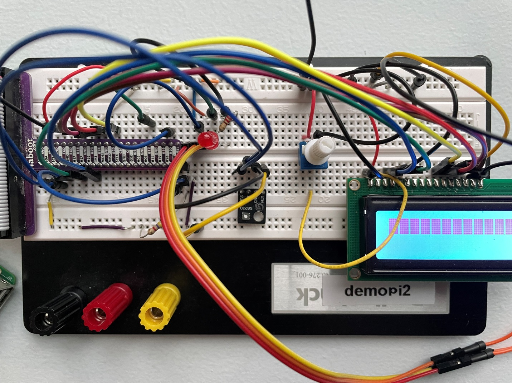
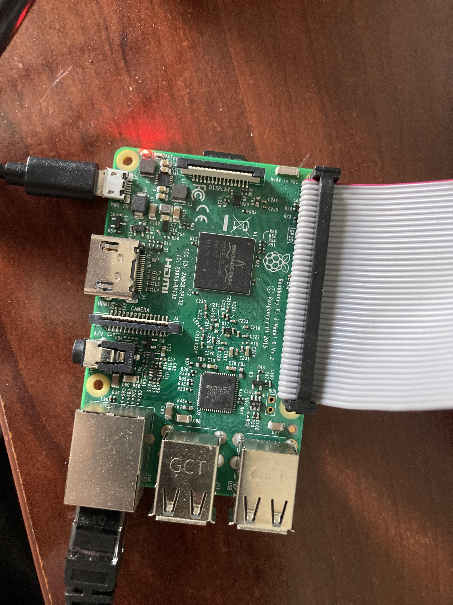
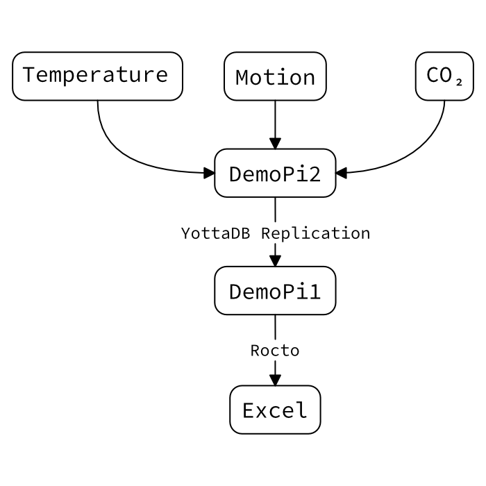
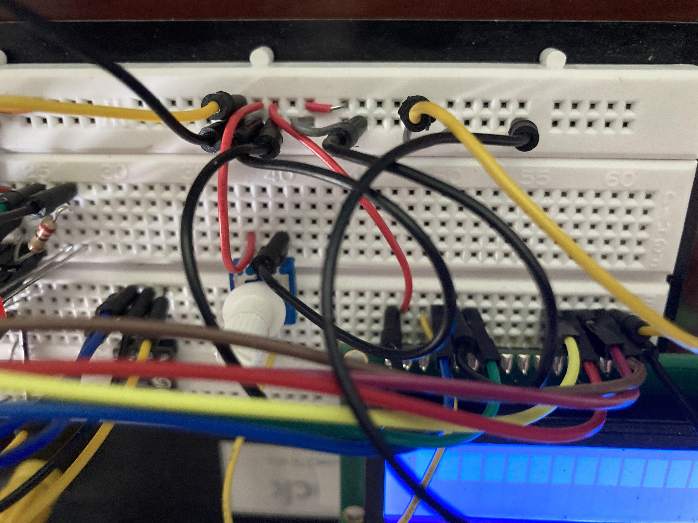
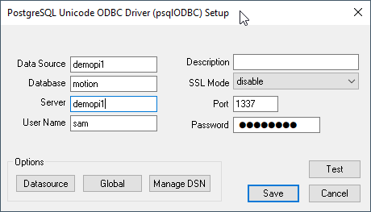
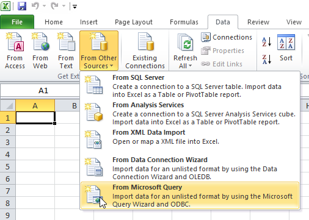
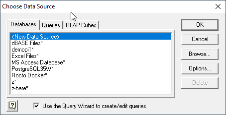
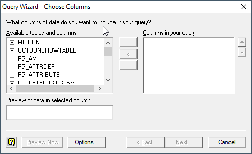
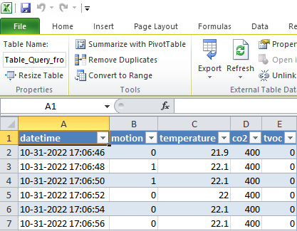
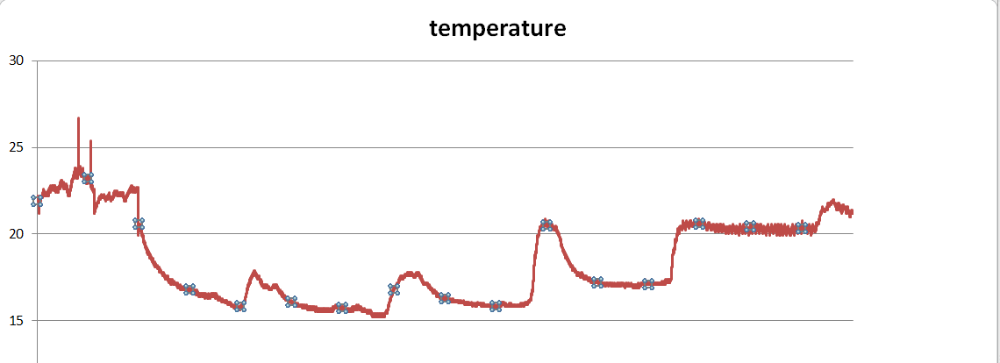

.. ###############################################################
.. #                                                             #
.. # Copyright (c) 2023-2024 YottaDB LLC and/or its subsidiaries.#
.. # All rights reserved.                                        #
.. #                                                             #
.. #     This document contains the intellectual property        #
.. #     of its copyright holder(s), and is made available       #
.. #     under a license.  If you do not know the terms of       #
.. #     the license, please stop and do not read further.       #
.. #                                                             #
.. ###############################################################

=============================
YottaDB and a tale of two Pis
=============================

.. contents::
   :depth: 5

    The full demopi2 breadboard.

This tutorial describes a YottaDB installation on two Raspberri Pis. The first Pi has Temperature, Motion, CO2, sensors with an LCD display to immediately display the data. This Pi stores the data in YottaDB, then streams it over to the second Pi using YottaDB’s replication. This data is then exposed via SQL and graphed in Excel.

The full code is available in `demopi.py <demopi.py>`_.

++++++++++
Components
++++++++++

* Two Rapsberry Pis 3 Model B
* 1-Wire Temperature sensor
* PIR Motion Sensor with Red LED Light
* CO2/Noxious Gases sensor
* LCD Display

+++++++++++++++++++++
Software Installation
+++++++++++++++++++++

Both Pi’s have straight Debian 11 (bullseye) installed and YottaDB per the instructions on how to `Get Started <https://yottadb.com/product/get-started/>`_:

.. code-block:: bash

    apt-get install -y --no-install-recommends file binutils libelf-dev libicu-dev nano wget ca-certificates
    mkdir /tmp/tmp
    wget -P /tmp/tmp https://download.yottadb.com/ydbinstall.sh
    cd /tmp/tmp
    chmod +x ydbinstall.sh
    sudo ./ydbinstall.sh --utf8 --verbose --octo
    ./ydbinstall.sh --help
    source $(pkg-config --variable=prefix yottadb)/ydb_env_set

On the Pi with the sensors, a.k.a. "demopi2", we first `enabled 1-wire protocol kernel support <https://www.raspberrypi-spy.co.uk/2018/02/enable-1-wire-interface-raspberry-pi/>`_. Then, we ran the following commands:

.. code-block:: bash

    sudo apt install python3-pip
    pip3 install yottadb --user

In the examples below, the hostname of the Pi receiving the sensor data is "demopi2". demopi2 sends the data over to demopi1 via YottaDB Replication. Then, data is graphed from demopi1 using Excel.

    demopi2 and its connections.

    The flow of data between demopi1 and demopi2.

+++++++++++++++++++++
Hardware Installation
+++++++++++++++++++++

~~~~~~~~~~~~~~~~~~~~~~~
Wire Temperature sensor
~~~~~~~~~~~~~~~~~~~~~~~

The wire temperature sensor was installed as directed in `Raspberry Pi DS18B20 Temperature Sensor Tutorial <https://www.circuitbasics.com/raspberry-pi-ds18b20-temperature-sensor-tutorial/>`_.

There are three connections, from the flat side facing you, left to right:

+---+------------------------------+------------+
|   | Input                        | Output     |
+===+==============================+============+
| 1 | 5V                           | N/A        |
+---+------------------------------+------------+
| 2 | 5V through 4.7k Ohm resistor | GPIO Pin 4 |
+---+------------------------------+------------+
| 3 | Ground                       | N/A        |
+---+------------------------------+------------+

.. figure:: images/demopi/temperature_sensor.jpg
    :alt: Temperature sensor

    The DS18B20 Temperature Sensor.

After you make the connections, you need to enable the 1-wire protocol. See the link above for instructions.

Here is the code for reading data from the wire temperature sensor:

.. code-block:: python

    temp_base_dir = glob.glob('/sys/bus/w1/devices/' + '28*')[0]
    temp_file = temp_base_dir + '/temperature'

    while True:
        # Other code...
        # Read temperature
        f = open(temp_file, 'r')
        raw_temp = f.readline().strip()

        # If nothing is read (hardware issue), try again…
        if raw_temp == '': continue

        temp_unrounded = int(raw_temp)/1000
        f.close()
    temp_rounded = round(temp_unrounded,1)
    # Other code...
    sleep(1)

~~~~~~~~~~~~~~~~~~~~~~~~~~~~~~~~~~~~
PIR Motion Sensor with Red LED Light
~~~~~~~~~~~~~~~~~~~~~~~~~~~~~~~~~~~~

The PIR motion sensor setup was derived from `How to Interface a PIR Motion Sensor With Raspberry Pi GPIO <https://maker.pro/raspberry-pi/tutorial/how-to-interface-a-pir-motion-sensor-with-raspberry-pi-gpio>`_.

PIR Motion Sensor Pinout:

+---+--------+-------------+
|   | Input  | Output      |
+===+========+=============+
| 1 | 5V     | N/A         |
+---+--------+-------------+
| 2 |        | GPIO Pin 20 |
+---+--------+-------------+
| 3 | Ground | N/A         |
+---+--------+-------------+

Led Pinout:

+-----------+------------------------------------+-------------+
|           | Input                              | Output      |
+===========+====================================+=============+
| Long leg  | GPIO 12 through a 220 Ohm resistor | N/A         |
+-----------+------------------------------------+-------------+
| Short leg | Ground                             | N/A         |
+-----------+------------------------------------+-------------+

.. figure:: images/demopi/pir_motion_sensor.jpg
    :alt: PIR motion sensor

    The PIR motion sensor.

.. figure:: images/demopi/pir_motion_sensor_connection.jpg
    :alt: PIR motion sensor connections

    How the PIR motion sensor connects into the breadboard.

Here is the code for the PIR motion sensor setup:

.. code-block:: python

    # pir at BCM port 20
    # PIR sensitivity (detect range) can be tuned by adjusting the screw on the right side of the buzzer
    # led at BCM port 12
    pir_gpio = 20
    led_gpio = 12

    GPIO.setmode(GPIO.BCM)
    GPIO.setup(pir_gpio, GPIO.IN)
    GPIO.setup(led_gpio, GPIO.OUT, initial=GPIO.LOW) # Led off by default

    while True:
        # Other code...
        # Read motion sensor
        pir_out = 0
        if(GPIO.input(pir_gpio) == 0):
            pir_out=0
            GPIO.output(led_gpio, GPIO.LOW)
        elif(GPIO.input(pir_gpio) == 1):
            pir_out=1
            GPIO.output(led_gpio, GPIO.HIGH)

    # Other code...

~~~~~~~~~~~~~~~~~~~~~~~~~~~~~~~~~~~
CO2/Noxious Gases sensor (gy-sgp30)
~~~~~~~~~~~~~~~~~~~~~~~~~~~~~~~~~~~

The CO2/Noxious gases sensor was set up by following the `SGP30 documentation <https://docs.circuitpython.org/projects/sgp30/en/latest/>`_.

Pinout:

+-----+--------+--------+
|     | Input  | Output |
+=====+========+========+
| VIN | 5V     | N/A    |
+-----+--------+--------+
| GND | Ground | N/A    |
+-----+--------+--------+
| SCL | N/A    | SCL    |
+-----+--------+--------+
| SDA | N/A    | SDA    |
+-----+--------+--------+

.. figure:: images/demopi/CO2_sensor.jpg
    :alt: CO2/Noxious Gases sensor

    The SGP30 CO2/Noxious Gases sensor

Here is the code for the CO2/noxious gases sensor:

.. code-block:: python

    import adafruit_sgp30
    import busio
    import board

    # Other code...

    while True:
        # Other code...
        # Read CO2, and TV0C
        try:
            i2c_bus = busio.I2C(board.SCL, board.SDA, frequency=100000)
            sgp30 = adafruit_sgp30.Adafruit_SGP30(i2c_bus)
            eCO2, TVOC = sgp30.iaq_measure()
        except:
            eCO2, TVOC = 0, 0
    # Other code...

~~~~~~~~~~~
LCD Display
~~~~~~~~~~~

The LCD display was set up by following `Drive a 16x2 LCD with the Raspberry Pi <https://learn.adafruit.com/drive-a-16x2-lcd-directly-with-a-raspberry-pi/overview>`_.

Pinout:

+---------+-------------------------+
| LCD Pin | Function                |
+=========+=========================+
| 01      | Ground                  |
+---------+-------------------------+
| 02      | 5V                      |
+---------+-------------------------+
| 03      | Middle of potentiometer |
+---------+-------------------------+
| 04      | GPIO22                  |
+---------+-------------------------+
| 05      | Ground                  |
+---------+-------------------------+
| 06      | GPIO17                  |
+---------+-------------------------+
| 11      | GPIO25                  |
+---------+-------------------------+
| 12      | GPIO24                  |
+---------+-------------------------+
| 13      | GPIO23                  |
+---------+-------------------------+
| 14      | GPIO18                  |
+---------+-------------------------+
| 15      | 5V                      |
+---------+-------------------------+
| 16      | Ground                  |
+---------+-------------------------+

.. figure:: images/demopi/lcd_display.jpg
    :alt: LCD display

    The LCD display.

    How the LCD display connects to the breadboard.

Here is the code for the LCD display:

.. code-block:: python

    import digitalio
    import adafruit_character_lcd.character_lcd as characterlcd
    import board
    from datetime import datetime
    # Modify this if you have a different sized character LCD
    lcd_columns = 16
    lcd_rows = 2

    # compatible with all versions of RPI as of Jan. 2019
    # v1 - v3B+
    lcd_rs = digitalio.DigitalInOut(board.D22)
    lcd_en = digitalio.DigitalInOut(board.D17)
    lcd_d4 = digitalio.DigitalInOut(board.D25)
    lcd_d5 = digitalio.DigitalInOut(board.D24)
    lcd_d6 = digitalio.DigitalInOut(board.D23)
    lcd_d7 = digitalio.DigitalInOut(board.D18)

    # Initialise the lcd class
    lcd = characterlcd.Character_LCD_Mono(lcd_rs, lcd_en, lcd_d4, lcd_d5, lcd_d6,
                                          lcd_d7, lcd_columns, lcd_rows)

    lcd.clear()

    while True:
        # date and time
    lcd_line_1 = datetime.now().strftime('%b %d  %H:%M:%S\n')
    # Other code...
    lcd_line_2 = str(pir_out) + '|' + str(temp_rounded) + '|' + str(eCO2) + '|' + str(TVOC) + '       '
    # Other code...
    # combine both lines into one update to the display
    lcd.message = lcd_line_1 + lcd_line_2

    sleep(1)

++++++++++++++++++++++
Saving data to YottaDB
++++++++++++++++++++++

Outside of Python, set-up a YottaDB database and set-up the environment like this:

.. code-block:: bash

    $ source $(pkg-config --variable=prefix yottadb)/ydb_env_set

Then execute this code:

.. code-block:: python

    import yottadb
    from datetime import datetime
    while True:
        # Other code...
        yottadb.Key('^motion')[datetime.now().strftime("%m-%d-%Y %H:%M:%S")].value = str(pir_out) + '|' + str(temp_rounded) + '|' + str(eCO2) + '|' + str(TVOC)
        # Other code...
        sleep(1)

++++++++++++++++++++++++++
YottaDB Replication Set-up
++++++++++++++++++++++++++

~~~~~~~~~~~~~~~~~~~~~~~~
The sending Pi (demopi2)
~~~~~~~~~~~~~~~~~~~~~~~~

From a terminal in demopi2, first install YottaDB using the instructions from the Software setup section. Then, set up YottaDB replication as follows:

First, source ``repl.env``, which contains these lines:

.. code-block:: bash

    export ydb_repl_instname=$HOSTNAME
    source $(pkg-config --variable=prefix yottadb)/ydb_env_set

Then run the ``repl_setup.sh`` script once and only once, since it is for first time set-up only. It contains these lines:

.. code-block:: bash

    #!/bin/bash
    $ydb_dist/mupip set -replication=on -region DEFAULT,YDBOCTO
    $ydb_dist/mupip replicate -instance_create -noreplace
    $ydb_dist/mupip backup -replinst=$ydb_repl_instname

Then, create ``originating_start.sh``:

.. code-block:: bash

    #!/bin/bash
    $ydb_dist/mupip replicate -source -start -instsecondary=demopi1 -secondary=demopi1.local:4000 -log=/home/pi/repl_scripts/origin_start.log
    $ydb_dist/mupip replicate -source -checkhealth
    tail -30 /home/pi/repl_scripts/origin_start.log

Then, create ``originating_stop.sh``:

.. code-block:: bash

    #!/bin/bash
    $ydb_dist/mupip replicate -source -shutdown -timeout=0
    $ydb_dist/mupip rundown -region "*"

Finally, run ``originating_start.sh``.

~~~~~~~~~~~~~~~~~~~~~~~~~~
The recieving Pi (demopi1)
~~~~~~~~~~~~~~~~~~~~~~~~~~

First, source ``repl.env``:

.. code-block:: bash

    export ydb_repl_instname=$HOSTNAME
    source $(pkg-config --variable=prefix yottadb)/ydb_env_set

Then, create the  ``repl_setup.sh``:

.. code-block:: bash

    #!/bin/bash
    $ydb_dist/mupip set -replication=on -region DEFAULT,YDBOCTO
    $ydb_dist/mupip replicate -instance_create -supplementary -noreplace
    $ydb_dist/mupip replicate -source -start -passive -instsecondary=dummy -log=/home/pi/repl_scripts/passive_server_start.log -updok
    $ydb_dist/mupip replicate -receive -start -listenport=4000 -log=/home/pi/repl_scripts/receive.log -updateresync=/home/pi/repl_scripts/demopi2.repl -initialize
    $ydb_dist/mupip replicate -receive -checkhealth
    tail -20 /home/pi/repl_scripts/receive.log

Next, create ``start.sh``:

.. code-block:: bash

    #!/bin/sh
    $ydb_dist/mupip replicate -source -start -passive -instsecondary=dummy -log=/home/pi/repl_scripts/passive_server_start.log -updok
    $ydb_dist/mupip replicate -receive -start -listenport=4000 -log=/home/pi/repl_scripts/receive.log -autorollback
    $ydb_dist/mupip replicate -receive -checkhealth
    tail -20 /home/pi/repl_scripts/receive.log

Then, create ``stop.sh``:

.. code-block:: bash

    #!/bin/sh
    $ydb_dist/mupip replicate -receive -shutdown -timeout=0
    $ydb_dist/mupip replicate -source -shutdown -timeout=0
    $ydb_dist/mupip rundown -region "*"

Next, create ``repl_status.sh``:

.. code-block:: bash

    #!/bin/bash
    echo "-----------------------------------------------------------------"
    echo "Source Server $ydb_repl_instname: "
    echo "-----------------------------------------------------------------"
    $ydb_dist/mupip replicate -source -check
    $ydb_dist/mupip replicate -source -showbacklog
    echo "-----------------------------------------------------------------"
    echo "Receiver Server $ydb_repl_instname: "
    echo "-----------------------------------------------------------------"
    $ydb_dist/mupip replicate -receive -check
    $ydb_dist/mupip replicate -rece –showbacklog

.. note:: Due to how replication works in YottaDB, ``repl_setup.sh`` combines both the set-up of supplementary replication and the first start-up. This means that you DO NOT run ``start.sh`` the first time you start replication. It’s confusing, but please keep that in mind.

The next time you start replication, do not use ``repl_setup.sh`` but use ``start.sh``.

+++++++++++
Octo Set-up
+++++++++++

You already installed Octo when you installed YottaDB using ``ydbinstall.sh`` above. Now, all you need to do is create a table and configure Octo for remote use with various clients.

First, load the "Motion" table into Octo and test it:

.. code-block:: bash

    cat > motion.sql << 'END'
    DROP TABLE IF EXISTS MOTION;
    CREATE TABLE MOTION(
            `DATETIME` TEXT PRIMARY KEY,
            MOTION INTEGER,
            TEMPERATURE NUMERIC,
            CO2 INTEGER,
            TVOC INTEGER
    ) GLOBAL "^motion" READONLY;
    END
    octo –f motion.sql
    octo <<< 'select count(*) from motion'

Then, configure remote access with Rocto:

.. code-block:: bash

    # Copy ``octo.conf`` to your home directory
    cp $ydb_dist/plugin/octo/octo.conf ~
    # Add a username/password (here "sam") to enable remote Rocto connections
    yottadb -r %ydboctoAdmin add user sam # (enter password)
    # Finally, start Rocto with the verbose flag.
    rocto -v

Next, on a Windows with Microsoft Excel installed, install version 13 of the Postgres ODBC driver from the `PostgreSQL ODBC downloads page <https://www.postgresql.org/ftp/odbc/releases/>`_. Then, using the ODBC administrator (``odbcad32.exe``) create a User DSN and set "Postgres Unicode(x64)" as the driver.

Next, set the following settings: adjust server, port, user name and password:

Then, press the "test" button to ensure that you can connect successfully. More information on these steps can be found in `Configure ODBC drivers for PostgreSQL <https://www.sqlshack.com/configure-odbc-drivers-for-postgresql/>`_.

Once you can connect successfully, in Excel in a new worksheet, click on Data Tab > From Other Sources > From Microsoft Query:

Then, select the data source (here demopi1):

.. note:: The new ODBC data source may not appear if the architecture targeted by the driver doesn't match the one used by Excel. For instance, if Excel is 32-bit (x32), but the 64-bit (x64) PostgreSQL ODBC driver is used, then any data source defined using this driver will not appear in Microsoft Query in Excel.

Choose the ``MOTION`` table and add all columns in the Query Wizard:

Press Next, Next, Finish, and wait for the query to finish executing.

The data will now be in Excel:

You can then graph the data. We will not describe this process, but we will leave it to the imagination of the end user.

Here's a sample result:

Rocto also accepts JDBC Postgres driver queries using LibreOffice sheets.

++++++++++++++++++++++++++
Shutdown/Start-up Sequence
++++++++++++++++++++++++++

After the above initial set-up the following commands can be used for to shut down and start up the Pi sensor application:

Shutdown:

1. Source ``repl.env``
2. On sensor Pi, stop ``demo.py``
3. On sensor Pi, stop replication (``originating_stop.sh``)
4. On receiving Pi, stop ``rocto``
5. On receiving Pi, stop replication (``stop.sh``)

Start-up:

1. Source ``repl.env``
2. On sensor Pi, start replication (``originating_start.sh``)
3. On sensor Pi, start ``demo.py``
4. On receiving Pi, start replication (``start.sh``)
5. On receiving Pi, check status using ``repl_status.sh`` until the status shows that the two machines are in sync
6. On receiving Pi, start ``rocto``

.. raw:: html

    
