.. ###############################################################
.. #                                                             #
.. # Copyright (c) 2024 YottaDB LLC and/or its subsidiaries.     #
.. # All rights reserved.                                        #
.. #                                                             #
.. #     This document contains the intellectual property        #
.. #     of its copyright holder(s), and is made available       #
.. #     under a license.  If you do not know the terms of       #
.. #     the license, please stop and do not read further.       #
.. #                                                             #
.. ###############################################################

========
YDBApron
========
.. contents::
   :depth: 5

`YDBApron <https://gitlab.com/YottaDB/Demo/YDBApron>`_ is a simple recipe management application that can be used to create recipes, track food costs, and plan production schedules. By the end of the following tutorial, you should have a fully-functional recipe management application and a solid grasp of how YottaDB can be used to develop Python applications.

YDBApron uses the YottaDB Python API, `YDBPython <https://gitlab.com/YottaDB/Lang/YDBPython>`_, in conjuction with the `Flask <https://flask.palletsprojects.com/>`_ web development framework and the `Bootstrap <https://getbootstrap.com/docs>`_ frontend toolkit.

Accordingly, the tutorial assumes a working knowledge of Python and passing familiarity with Flask and the `Jinja2 <https://svn.python.org/projects/external/Jinja-2.1.1/docs/_build/html/templates.html>`_ templating engine it uses.

In particular, this tutorial assumes you are familiar the following Python concepts:

* `Dictionaries <https://docs.python.org/3/tutorial/datastructures.html#dictionaries>`_
* `Loops <https://docs.python.org/3/tutorial/controlflow.html#for-statements>`_

And the following Flask concepts:

* `Views (routes) <https://flask.palletsprojects.com/en/2.3.x/tutorial/views/>`_
* `Templates <https://flask.palletsprojects.com/en/2.3.x/tutorial/templates/>`_

.. _ydbapron-tutorial:

--------
Tutorial
--------

YDBApron can be considered as a combination of frontend and backend components. Since these components depend on each other we'll develop them incrementally, side-by-side to show how everything fits together. By the end of the tutorial, we'll have a fully-functional application comprised of both frontend and backend components, using YottaDB for the application data store.

++++++++++++++++++++++++++++++++++++++++
1. Set up a development environment
++++++++++++++++++++++++++++++++++++++++

Before building YDBApron, you'll need a suitable development environment. For this tutorial, a simple Python virtual environment will do.

To set up a Python venv, first make sure you have the Python ``venv`` module installed, then use it to create a new virtual environment in a new directory:

.. code-block:: bash

    sudo apt install python3-venv
    mkdir ydbapron && cd ydbapron
    python3 -m venv .venv

This will create a new ``ydbapron`` directory and create a Python virtual environment there.

Next, activate the virtual environment and install the Python packages required by YDBApron:

.. code-block:: bash

   source .venv/bin/activate
   pip install flask yottadb flask_cors WTForms

Lastly, create the YDBApron directory structure to put application files in:

.. code-block:: bash

   mkdir -p YDBApron/templates

++++++++++++++++++++++++++++
2. Configure the application
++++++++++++++++++++++++++++

Now, you're ready to start building the application. To start with, you'll create a Flask `application factory <https://flask.palletsprojects.com/en/2.3.x/tutorial/factory/>`_ per the approach used in the Flask documentation.

This is done by defining a ``create_app()`` function that returns a ``Flask`` object that acts as the application instance.

Do this by creating a new ``__init__.py`` file in the YDBApron directory:

.. code-block::

    └── YDBApron
        └── __init__.py

Then write this code in it:

.. code-block:: python

    import os

    from flask import Flask
    from flask_cors import CORS

    # Create signal handler for SIGINT so that CTRL-C can be used to terminate the application
    def handle_sigint(sig, frame):
        sys.exit(0)

    signal.signal(signal.SIGINT, handle_sigint)

    def create_app(config=None):
        # Create a new application instance
        app = Flask(__name__, instance_relative_config=True)
        app.config.from_mapping(
            SECRET_KEY='dev',
        )

        # Enable CORS
        CORS(app, resources={r'/*': {'origins': '*'}})

        if config is None:
            # Load application configuration from file
            app.config.from_pyfile('config.py', silent=True)
        else:
            # Load configuration from argument
            app.config.from_mapping(config)

        # Ensure app folder exists
        try:
            os.makedirs(app.instance_path)
        except OSError:
            pass

        # Application routes go here...

        return app

Most of this is boilerplate taken from the Flask documentation, so we won't expound on it here.

Next, create a new ``globals.py`` file to hold a handful of variables used across various modules in YDBApron and add these lines to it:

.. code-block:: python

    GRAMS_PER_OUNCE = 28  # Approximate number of grams in an ounce
    OUNCES_PER_POUND = 16  # Number of ounces in a pound
    GRAMS_PER_MILLILITER = 1  # Number of grams in a milliliter. May be inaccurate for liquids other than water
    MAX_PRODUCT_SPECS = 6  # Maximum number of product specifications that can be defined for a single recipe
    MAX_INGREDIENTS = 200  # Maximum number of ingredients that can be stored. Needed for pre-allocation of form fields
    MAX_RECIPES = 100  # Maximum number of recipes that can be stored. Needed for pre-allocation of form fields

With ``__init__.py`` and ``globals.py`` in place, now it's time to start laying the real groundwork to build out YDBApron.

++++++++++++++++++++++++++++++
3. Stub out application routes
++++++++++++++++++++++++++++++

With the application setup out of the way, you can start stubbing out the routes used for mapping URLs to application behaviors.

These stubs will give us a roadmap of how to build up YDBApron incrementally. They will also allow us to build the application's navigation bar, giving us a working, but mostly useless, application.

Using the code below, you'll create three groups of routes, reflecting the three main high-level data objects of YDBApron: ingredients, recipes, and production schedules.

Each of these data objects will get a route for each of the following behaviors: add, list, edit, and delete. In other words, each data object supports `Create, Read, Update, and Delete (CRUD) operations <https://en.wikipedia.org/wiki/Create,_read,_update_and_delete>`_.

First, create a route for the application homepage by replacing the ``# Application routes go here...`` line from the previous section with the following:

.. code-block:: python

    def create_app(config=None):
        ...

        # Application routes
        @app.route('/')
        def home():
            return "<h1>Welcome to YDBApron!</h1>"

Next, import the Flask ``redirect`` method and add some routes for managing ingredients:

.. code-block:: python

    ...
    from flask import Flask, redirect
    ...

    def create_app(config=None):
        # Application routes
        ...

        # Ingredients
        @app.route("/ingredients/list", methods=("GET",))
        def list_ingredients():
            return "<h1>Ingredients</h1>"

        @app.route("/ingredients/add", methods=("GET", "POST"))
        def add_ingredient():
            return "<h1>Add Ingredient</h1>"

        @app.route("/ingredients/edit/<category>/<ingredient_name>", methods=("GET", "POST"))
        def edit_ingredient(category, ingredient_name):
            return "<h1>Edit Ingredient</h1>"

        @app.route("/ingredients/delete", methods=("POST",))
        def delete_ingredient():
            return redirect("/ingredients/list")

Now, check to see whether application runs by running it with:

.. code-block:: bash

    FLASK_APP=YDBApron flask run

You should receive a message like the following:

.. code-block:: bash

    * Serving Flask app 'YDBApron'
     * Debug mode: off
    WARNING: This is a development server. Do not use it in a production deployment. Use a production WSGI server instead.
     * Running on http://127.0.0.1:5000
    Press CTRL+C to quit

Then, using your browser, manually navigate to each of the URLs defined above to confirm the routes are working as expected, i.e.:

* ``localhost:5000/``:

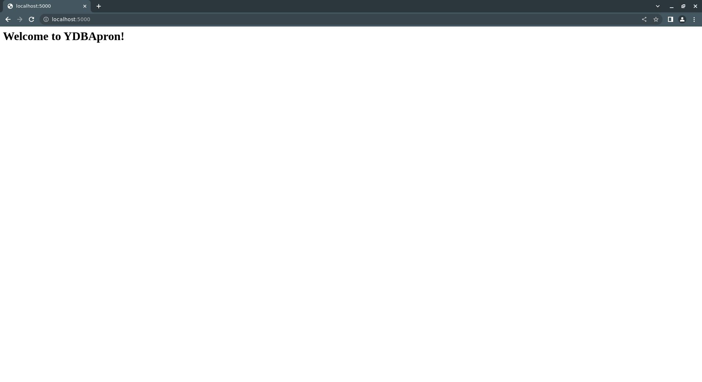

* ``localhost:5000/ingredients/list``:

* ``localhost:5000/ingredients/add``:

* ``localhost:5000/ingredients/edit/flour/rye`` (The route expects two URL parameters, so we add "flour" and "rye" here to satisfy it. More on this later.):

* ``localhost:5000/ingredients/delete``: Just redirects to ``localhost:5000/ingredients/list``.

Once the ingredient routes are working, go ahead and add the routes for recipes and production schedules:

.. code-block:: python

    ...

    def create_app(config=None):
        ...

        # Application routes
        ...

        # Ingredients
        ...

        # Recipes
        @app.route("/recipes/list", methods=("GET",))
        def list_recipes():
            return "<h1>Recipes</h1>"

        @app.route("/recipes/<category>/<recipe_name>", methods=("GET",))
        def show_recipe(category, recipe_name):
            return f"<h1>{category}: {recipe_name}</h1>"

        @app.route("/recipes/add", methods=("GET", "POST"))
        def add_recipe():
            return "<h1>Add Recipe</h1>"

        @app.route("/recipes/edit/<category>/<recipe_name>", methods=("GET", "POST"))
        def edit_recipe(category, recipe_name):
            return f"<h1>Edit Recipe: {category}: {recipe_name}</h1>"

        @app.route("/recipes/delete", methods=("POST", "GET"))
        def delete_recipe():
            return redirect("/recipes/list")

        # Production Schedules
        @app.route("/schedules/list", methods=("GET",))
        def list_schedules():
            return "<h1>Schedules</h1>"

        @app.route("/schedules/<schedule_name>", methods=("GET",))
        def show_schedule(schedule_name):
            return f"<h1>{schedule_name}</h1>"

        @app.route("/schedules/add", methods=("GET", "POST"))
        def add_schedule():
            return "<h1>Add Schedule</h1>"

        @app.route("/schedules/edit/<schedule_name>", methods=("GET", "POST"))
        def edit_schedule(schedule_name):
            return f"<h1>Edit Schedule: {schedule_name}</h1>"

        @app.route("/schedules/delete", methods=("POST", "GET"))
        def delete_schedule():
            return redirect("/schedules/list")

        ...

Now, again try running the application with ``flask --app YDBApron run`` and manually validating the new URL routes, i.e.:

* ``localhost:5000/recipes/list``:

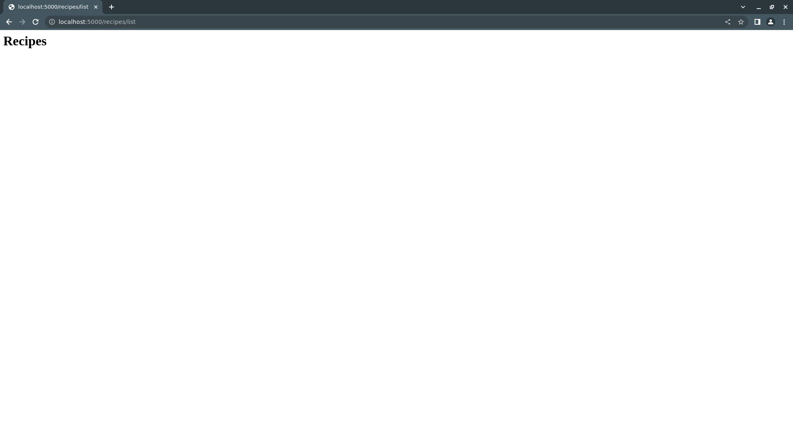

* ``localhost:5000/recipes/add``:

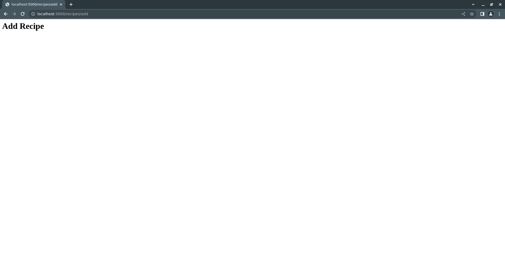

* ``localhost:5000/recipes/edit/bread/rye`` (The route expects two URL parameters, so we add "flour" and "rye" here to satisfy it. More on this later.):

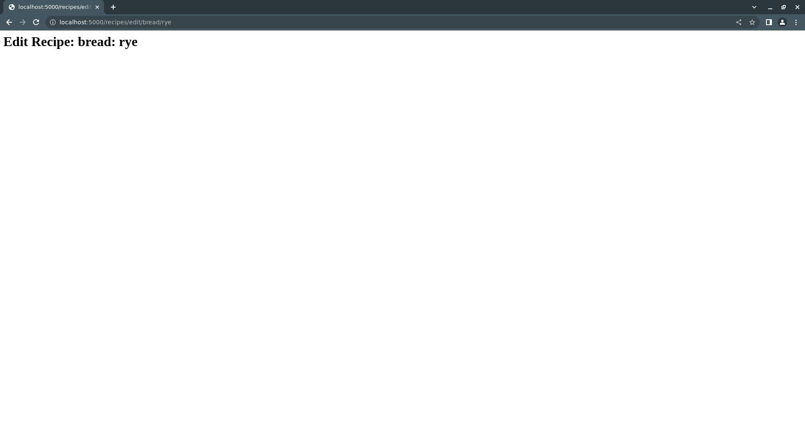

* ``localhost:5000/recipes/delete``: Just redirects to ``localhost:5000/recipes/list``.

* ``localhost:5000/schedules/list``:

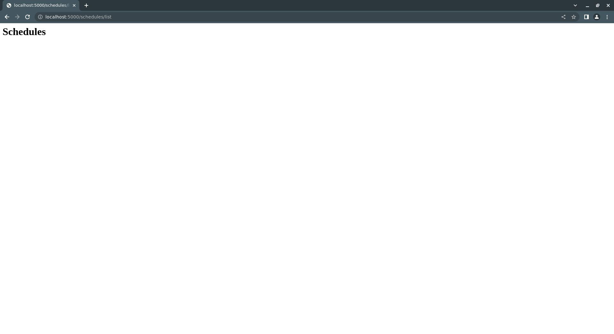

* ``localhost:5000/schedules/add``:

* ``localhost:5000/schedules/edit/Wednesday`` (The route expects one URL parameter, so we add "Wednesday" here to satisfy it. More on this later.):

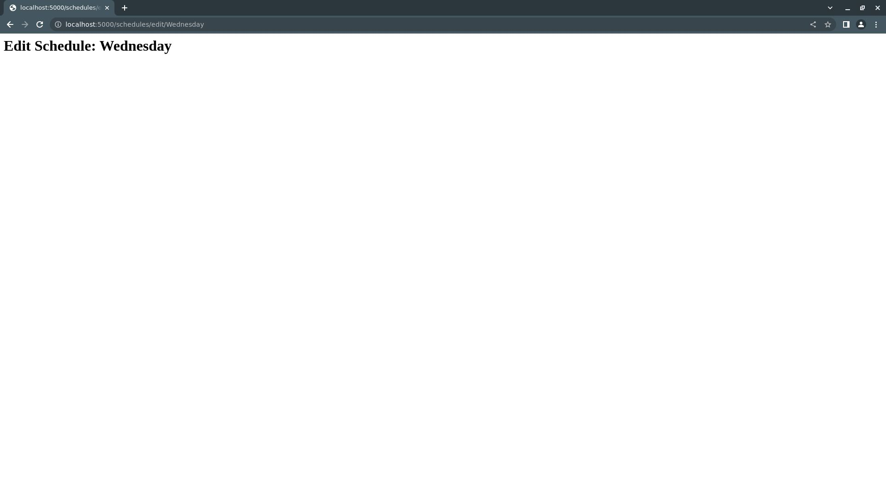

* ``localhost:5000/schedules/delete``: Just redirects to ``localhost:5000/schedules/list``.

Once all the routes are working, it's time to stub out the matching HTML templates and build the navigation bar.

+++++++++++++++++++++++++++++++++++++++++++++++
4. Define form classes for accepting user input
+++++++++++++++++++++++++++++++++++++++++++++++

In order to accept user input, you'll need some HTML forms to capture it. You can create these forms programmatically using the `WTForms <https://wtforms.readthedocs.io/en/3.0.x/>`_ Python library that you installed with ``pip`` during the setup instructions above.

YDBApron keeps all form classes in a single ``forms.py`` file, and imports them into other files as needed.

Start by creating a new ``forms.py`` in the ``YDBApron`` module directory, i.e.:

    └── YDBApron
        └── forms.py

Then, add the necessary imports at the top of the file:

.. code-block:: python

    import yottadb

    from wtforms import Form, FieldList, FormField, StringField, IntegerField, DecimalField, SelectField, TextAreaField
    from wtforms.validators import InputRequired, Length, Optional

    from YDBApron.globals import MAX_PRODUCT_SPECS, MAX_INGREDIENTS, MAX_RECIPES

Now, you can start adding form classes for each type of YDBApron data: ingredients, recipes, and production schedules.

For ingredients, define an ``IngredientForm`` class in ``forms.py`` below the imports:

.. code-block:: python

   # Imports...

    class IngredientForm(Form):
        ingredient_name = StringField("Name", [Length(min=2, max=100, message="Name must be between 4 and 100 characters long.")], render_kw={"placeholder": "e.g. whole wheat flour"})
        ingredient_category = StringField("Category", [Length(min=2, max=100, message="Category must be between 4 and 100 characters long.")], render_kw={"placeholder": "e.g. flour"})
        ingredient_amount = DecimalField("Amount", default=0, render_kw={"placeholder": "0"})
        ingredient_unit = SelectField("Unit", choices=[("g", "grams"), ("kg", "kilograms"), ("oz", "ounces"), ("lb", "pounds"), ("floz", "fluid ounces"), ("mL", "milliliters"), ("L", "liters"), ("one", "single item")])
        ingredient_price = DecimalField("Price", default=0, render_kw={"placeholder": "0"})
        ingredient_manufacturer = StringField("Manufacturer", [Length(min=2, max=100, message="Manufacturer must be between 4 and 100 characters long.")], render_kw={"placeholder": "e.g. King Arthur"})
        ingredient_vendor = StringField("Vendor", [Optional(), Length(min=2, max=100, message="Vendor must be between 4 and 100 characters long.")], render_kw={"placeholder": "e.g. Amazon"})

The ``IngredientForm`` class defines a number of fields for storing all ingredient-related information:

* ``ingredient_name``: The name of the ingredient, e.g. "rye flour"
* ``ingredient_category``: The type of ingredient, e.g. "flour"
* ``ingredient_amount``: The amount of the ingredient purchased at a time, e.g. "50"
* ``ingredient_unit``: The unit measure associated with the amount, e.g. "lb"
* ``ingredient_price``: The cost of the purchase amount, e.g. "32.99"
* ``ingredient_manufacturer``: The manufacturer of the given ingredient
* ``ingredient_vendor``: The vendor of the given ingredient

Next, define a series of classes for accepting recipe input from the user:

.. code-block:: python

    class RecipeIngredientForm(Form):
        ingredient_name = StringField("Name", [Optional(), Length(min=4, max=100)], render_kw={"placeholder": "e.g. whole wheat flour"})
        ingredient_category = StringField("Category", [Optional(), Length(min=4, max=100)], render_kw={"placeholder": "e.g. flour"})
        ingredient_amount = DecimalField("Weight/Volume", [Optional()], render_kw={"placeholder": "0"})
        ingredient_unit = SelectField("Unit", [Optional()], choices=[("g", "grams"), ("kg", "kilograms"), ("oz", "ounces"), ("lb", "pounds"), ("floz", "fluid ounces"), ("mL", "milliliters"), ("L", "liters"), ("one", "single item")])

    class ProductSpecificationForm(Form):
        specification_format = StringField("Format Type", [Optional(), Length(min=4, max=100)], render_kw={"placeholder": "e.g. loaf, roll, etc."})
        specification_format_size = StringField("Format Size", [Optional()], render_kw={"placeholder": "e.g. large, small, etc."})
        specification_size = DecimalField("Size", [Optional()], render_kw={"placeholder": "0"})
        specification_unit = SelectField("Unit", [Optional()], choices=[("g", "grams"), ("kg", "kilograms"), ("oz", "ounces"), ("lb", "pounds"), ("floz", "fluid ounces"), ("mL", "milliliters"), ("L", "liters"), ("it", "single item")])

    class RecipeForm(Form):
        recipe_name = StringField("Name", [Length(min=4, max=100), InputRequired()], render_kw={"placeholder": "e.g. Rustic Wheat Bread"})
        recipe_category = StringField("Category", [Length(min=4, max=100), InputRequired()], render_kw={"placeholder": "e.g. bread"})
        ingredients = FieldList(FormField(RecipeIngredientForm, [Optional()]), min_entries=MAX_INGREDIENTS)
        specifications = FieldList(FormField(ProductSpecificationForm, [Optional()]), min_entries=MAX_PRODUCT_SPECS)
        procedure = TextAreaField("Procedure", [Length(min=4, max=2000), InputRequired()], render_kw={"placeholder": "e.g. Step 1: ..."})

These classes together define a single recipe form composed of two subforms. ``RecipeForm`` acts as the main form, and contains two subforms: ``RecipeIngredientForm`` and ``ProductSpecificationForm``.

The subforms are represented by the ``ingredients`` and ``specifications`` fields of the ``RecipeForm`` class:

* ``ingredients``: A list of ``RecipeIngredientForm`` objects representing the ingredients in the recipe
* ``specifications``: A list of ``ProductSpecificationForm`` objects representing the product specifications for the recipe

Finally, define a series of fields for accepting production schedule information:

.. code-block:: python

    class ScheduleSpecificationForm(Form):
        specification_name = StringField("Specification Name", [Optional()])
        specification_size = StringField("Specification Size", [Optional()])
        specification_volume = DecimalField("Specification Volume", [Optional()], places=2, render_kw={"placeholder": 0})

    class ScheduleRecipeForm(Form):
        recipe_name = StringField("Recipe Name", [Optional()])
        recipe_category = StringField("Recipe Category", [Optional()])
        specifications = FieldList(FormField(ScheduleSpecificationForm, [Optional()]), min_entries=6)
        supplementary_yield = IntegerField("Gross Yield", [Optional()], render_kw={"placeholder": 0})
        gross_yield = IntegerField("Gross Yield", [Optional()], render_kw={"placeholder": 0})
        gross_cost = DecimalField("Gross Yield", [Optional()], places=2, render_kw={"placeholder": 0})

    class ScheduleForm(Form):
        schedule_name = StringField("Schedule Name", [Length(min=4, max=100), InputRequired()], render_kw={"placeholder": "e.g. Wednesday"})
        recipes = FieldList(FormField(ScheduleRecipeForm, [Optional()]), min_entries=MAX_RECIPES)

``ScheduleForm`` defines a single schedule form and its ``recipes`` field contains a list of ``ScheduleRecipeForm`` subforms. Each ``ScheduleRecipeForm`` also has a ``specifications`` field that contains a list of ``ScheduleSpecificationForm`` objects.

When you're done, your ``forms.py`` file should look like `forms.py <https://gitlab.com/YottaDB/Demo/YDBApron/-/blob/master/YDBApron/forms.py>`_.

Now that you've got form classes for every kind of data in the application, you can build out the application logic.

++++++++++++++++++++++++
5. Add application logic
++++++++++++++++++++++++

Now that you've got the application routes stubbed out, you can fill them in with application logic. By adding the application logic now, you'll later be able to test the templates and see results as you build them out in subsequent sections.

~~~~~~~~~~~~~~
ingredients.py
~~~~~~~~~~~~~~

Let's start with ``ingredients.py``. In the previous section, you created four routes for handling ingredient-related database operations: ``/list``, ``/add``, ``/edit``, and ``/delete``.

Each of these routes relies on one or more supporting functions that contain most of the actual route logic. So, before filling out the routes themselves, you'll need to write the supporting functions: ``total_ingredients()``, ``save_ingredient()``, ``list_ingredients()``, and ``get_ingredient()``.

Begin by creating ``ingredients.py`` and adding these import lines at the top:

.. code-block:: python

    import yottadb

    from typing import AnyStr

    from YDBApron.forms import RecipeForm, IngredientForm

Now, you can start adding the supporting functions.

^^^^^^^^^^^^^^^^^^^
total_ingredients()
^^^^^^^^^^^^^^^^^^^

First, add ``total_ingredients()``:

.. code-block:: python

    def total_ingredients() -> int:
        total = 0
        for category in yottadb.subscripts("^YDBApron", ("ingredients", "")):
            for ingredient in yottadb.subscripts("^YDBApron", ("ingredients", category, "")):
                total += 1
        return total

``total_ingredients()`` simply tallies the total number of ingredients in the database. This is done using the ``subscripts()`` function of the YottaDB Python API to loop through each ingredient category, then each ingredient in each category.

Each ``subscripts()`` call is composed by passing a YottaDB global variable name along with a tuple of subscript names. The function returns an iterator containing all the subscripts at the level of the last subscript in the tuple.

For example, the ``subscripts()`` call in the outermost loop of ``total_ingredients()`` returns an iterator with every subscript at the next level under the database node at ``^YDBApron("ingredients")``.

In other words, it returns an iterator with every possible value of ``category`` at ``^YDBApron("ingredients",category)``.

For example, if there are two ingredient categories, "wet" and "dry", then this ``subscripts()`` loop twice and return the values "wet" and "dry", successively.

Similarly, the ``subscripts()`` call in the innermost loop will return an iterator for looping over every ingredient name within the given category.

That is, it returns every possible value of ``ingredient`` at ``^YDBApron("ingredients",category,ingredient)``.

Putting these two ``subscripts()`` calls together, we can loop over every possible ingredient and ingredient category in the database using just two lines of code.

In this case, we just want to see how many ingredients there are, so we just increment the ``total`` variable by 1 for each iteration of the inner loop.

Once all the ingredients are tallied, the total is returned to the caller.

.. note::

    Both Python tuples and lists can be passed to ``subscripts()``.

^^^^^^^^^^^^^^^^^
save_ingredient()
^^^^^^^^^^^^^^^^^

Next, add the ``save_ingredient()`` function:

.. code-block:: python

    def save_ingredient(form: IngredientForm):
        ingredient_name = form.ingredient_name.data
        ingredient_category = form.ingredient_category.data
        amount = form.ingredient_amount.data
        unit = form.ingredient_unit.data
        price = form.ingredient_price.data
        manufacturer = form.ingredient_manufacturer.data
        vendor = form.ingredient_vendor.data
        yottadb.set("^YDBApron", ("ingredients", ingredient_category, ingredient_name), f"{amount}|{unit}|{price}|{manufacturer}|{vendor}")

``save_ingredient()`` is really just a wrapper around the ``set()`` function of the YottaDB Python API.

First, ``save_ingredient()`` extracts form data from the passed ``IngredientForm`` and stores each field value in a local variable. This is done simply for readability.

Then, these variables are used to construct a call to ``set()``. The call is composed by passing a YottaDB global variable name, then a tuple of subscripts, and finally a string value.

In this case, the value is a series of values delimited by the pipe (``|``) character. The value is stored on the node at ``^YDBApron("ingredients",ingredient_category,ingredient_name)``.

.. note::

    Numeric values can also be passed to ``set()``.

^^^^^^^^^^^^^^^^^^^
delete_ingredient()
^^^^^^^^^^^^^^^^^^^

Now, add the ``delete_ingredient()`` function:

.. code-block:: python

    def delete_ingredient(category: AnyStr, ingredient: AnyStr):
        yottadb.delete_node("^YDBApron", ("ingredients", category, ingredient))

``delete_ingredient()`` is simply a wrapper around the ``delete_node()`` function of the YottaDB Python API. The call is constructed by passing the name of the global variable used to store YDBApron data, ``^YDBApron``, followed by a tuple of subscripts defining the node to be deleted.

In this case, given values for ``category`` and ``ingredient``, the database value at ``^YDBApron("ingredients",category,ingredient)`` will be deleted, thus deleting the ingredient from the database.

Note that ``delete_tree()`` is not necessary in this case, since YDBApron doesn't create any subtrees under ``^YDBApron("ingredients",category,ingredient)``. Rather, it just stores all ingredient information as a node value. So, there are no trees to delete, and it's okay to just delete the node here.

^^^^^^^^^^^^^^^^^
list_ingredient()
^^^^^^^^^^^^^^^^^

Next, add the ``list_ingredients()`` function:

.. code-block:: python

    def list_ingredients() -> dict:
        ydbapron = yottadb.Key("^YDBApron")
        ingredients = {}
        for category in ydbapron["ingredients"].subscripts:
            category = category.decode("utf-8")
            ingredients[category] = {}
            for ingredient in ydbapron["ingredients"][category].subscripts:
                ingredient = ingredient.decode("utf-8")
                spec = ydbapron["ingredients"][category][ingredient].value.decode("utf-8").split("|")
                ingredients[category][ingredient] = {}
                ingredients[category][ingredient]["amount"] = spec[0]
                ingredients[category][ingredient]["unit"] = spec[1]
                ingredients[category][ingredient]["price"] = spec[2]
                ingredients[category][ingredient]["manufacturer"] = spec[3]
                ingredients[category][ingredient]["vendor"] = spec[4]
                ingredients[category][ingredient]["dependencies"] = []
                for recipe_category in ydbapron["recipes"].subscripts:
                    for recipe in ydbapron["recipes"][recipe_category].subscripts:
                        recipe = recipe.decode("utf-8")
                        if ydbapron["recipes"][recipe_category][recipe]["ingredients"][category][ingredient].data > 0:
                            ingredients[category][ingredient]["dependencies"].append({"category": recipe_category, "name": recipe})

        return ingredients

The purpose of this function is to build up a dictionary containing a list of all ingredients and ingredient data. This dictionary will later be used to populate the ingredients list page.

Unlike the previous functions you've defined, ``list_ingredients()`` doesn't use any YottaDB Python API functions. Rather, it uses the ``Key`` class from the API.

The ``Key`` class allows a YottaDB local or global variable name to be bound to a set of subscripts for ease of use and readability.

In this case, for example, we start by creating a new ``Key`` object that represents the YDBApron global variable, ``^YDBApron`` on its own:

.. code-block:: python

    ydbapron = yottadb.Key("^YDBApron")

The new ``Key`` object can now be used to perform database objects through its attributes and methods. Additionally, it can itself be subscripted, allowing database operations to be performed on child nodes of the global variable.

For example, the first loop in this function loops over all the subscripts representing ingredient categories under ``^YDBApron("ingredients")``:

.. code-block:: python

    for category in ydbapron["ingredients"].subscripts:
        ...

These subscripts can then used to construct another loop, this time over every ingredient in the given category:

.. code-block:: python

    for ingredient in ydbapron["ingredients"][category].subscripts:
        ...

``Key`` objects can also be used to access node values using the ``.value`` attribute, as is done in this second loop:

.. code-block:: python

    spec = ydbapron["ingredients"][category][ingredient].value.decode("utf-8").split("|")

This line uses the subscripts from the two previous loops to index the value at ``^YDBApron("ingredients",category,ingredient)``, then parse the data stored there using the Python string ``.split()`` method.

After extracting the parsed data into the return dictionary, ``list_ingredients()`` then uses the same ``Key`` object to loop over recipe categories and recipes:

.. code-block:: python

    for recipe_category in ydbapron["recipes"].subscripts:
        for recipe in ydbapron["recipes"][recipe_category].subscripts:
            ...

These loops work the same as those above, but instead target a different subtree of the ``^YDBApron`` global variable. This time, it loops over the subscripts under ``^YDBApron("recipes")`` and ``^YDBApron("recipes",category)``, respectively.

Finally, the ``.data.`` method of the ``Key`` class is used to check whether a given recipe references the given ingredient:

.. code-block:: python

    if ydbapron["recipes"][recipe_category][recipe]["ingredients"][category][ingredient].data > 0:
        ingredients[category][ingredient]["dependencies"].append({"category": recipe_category, "name": recipe})

If any recipe depends on an ingredient, that ingredient is noted down and later used to prohibit the user deleting that ingredient.

^^^^^^^^^^^^^^^^
get_ingredient()
^^^^^^^^^^^^^^^^

Now, add the ``get_ingredient()`` function:

.. code-block:: python

    def get_ingredient(category: AnyStr, ingredient_name: AnyStr) -> dict:
        ingredient = {}
        ingredient_spec = yottadb.get("^YDBApron", ("ingredients", category, ingredient_name)).decode("utf-8")
        ingredient["amount"] = ingredient_spec.split("|")[0]
        ingredient["unit"] = ingredient_spec.split("|")[1]
        ingredient["cost"] = ingredient_spec.split("|")[2]
        ingredient["manufacturer"] = ingredient_spec.split("|")[3]
        ingredient["vendor"] = ingredient_spec.split("|")[4]

        return ingredient

``get_ingredient()`` retrieves all the data for the specified ingredient, parses it into a dictionary, and returns it to the caller.

This function uses the ``get()`` YottaDB API function without a ``Key`` object. No ``Key`` object is used for simplicity, since only one database operation is performed.

^^^^^^^^^^^^^^^^^
get_ingredients()
^^^^^^^^^^^^^^^^^

Finally, add the ``get_ingredients()`` function:

.. code-block:: python

    def get_ingredients(form: RecipeForm = None) -> dict:
        ydbapron = yottadb.Key("^YDBApron")
        ingredients = {}
        ingredient_forms = iter(form.ingredients) if form is not None else None
        for category in ydbapron["ingredients"].subscripts:
            category = category.decode("utf-8")
            ingredients[category] = {}
            for ingredient in ydbapron["ingredients"][category].subscripts:
                ingredient = ingredient.decode("utf-8")
                ingredients[category][ingredient] = get_ingredient(category, ingredient)
                ingredients[category][ingredient]["form"] = next(ingredient_forms)

        return ingredients

``get_ingredients()`` retrieves all ingredients from the database and maps them to a corresponding ``RecipeIngredientForm`` from the received ``RecipeForm``.

This function again uses a ``Key`` object instead of API functions in order to reduce code duplication and improve readablity.

That's it for the main application logic in ``ingredients.py``.

~~~~~~~~~~
recipes.py
~~~~~~~~~~

Now let's write the logic for handling recipe data in ``recipes.py``. Start by creating the file in the YDBApron directory and adding these import lines at the top:

.. code-block:: python

    import yottadb

    from typing import AnyStr

    from YDBApron.globals import GRAMS_PER_OUNCE, OUNCES_PER_POUND, GRAMS_PER_MILLILITER
    from YDBApron.forms import RecipeForm, ScheduleForm

^^^^^^^^^^^^^^^
total_recipes()
^^^^^^^^^^^^^^^

First, write the ``total_recipes()`` function in ``YDBApron/recipes.py``:

.. code-block:: python

    def total_recipes() -> int:
        total = 0
        for category in yottadb.subscripts("^YDBApron", ("recipes", "")):
            for recipe in yottadb.subscripts("^YDBApron", ("recipes", category, "")):
                total += 1

        return total

Much like ``total_ingredients()``, ``total_recipes()`` uses the ``subscripts()`` API function to iterate over all the recipes in the database and take a tally of them.

^^^^^^^^^^^^^^^^
total_in_grams()
^^^^^^^^^^^^^^^^

Next, write the ``total_in_grams()`` function:

.. code-block:: python

    def total_in_grams(amount: float, unit: AnyStr) -> float:
        if unit == "g":
            return amount
        elif unit == "oz":
            return amount * GRAMS_PER_OUNCE
        elif unit == "lb":
            return amount * GRAMS_PER_OUNCE * OUNCES_PER_POUND
        elif unit == "ml":
            return amount * GRAMS_PER_MILLILITER
        else:
            assert(False)
            return amount

``total_in_grams()`` is a simple utility function that converts a measurement from the given unit into grams.

^^^^^^^^^^^^
add_recipe()
^^^^^^^^^^^^

Now, write the ``add_recipe()`` function:

.. code-block:: python

    def add_recipe(recipe_form: RecipeForm):
        ydbapron = yottadb.Key("^YDBApron")
        recipe_name = recipe_form.recipe_name.data
        recipe_category = recipe_form.recipe_category.data
        gross_yield = 0
        # Get the gross yield first in order calculate ingredient proportions below
        for ingredient in recipe_form.ingredients:
            if ingredient.ingredient_name.data and ingredient.ingredient_category.data and ingredient.ingredient_amount.data:
                gross_yield += float(ingredient.ingredient_amount.data)
        for ingredient in recipe_form.ingredients:
            ingredient_name = ingredient.ingredient_name.data
            ingredient_category = ingredient.ingredient_category.data
            ingredient_amount = ingredient.ingredient_amount.data
            ingredient_unit = ingredient.ingredient_unit.data
            if ingredient_amount and ingredient_unit:
                # Only add fully defined ingredients to the database
                ingredient_proportion = float(ingredient.ingredient_amount.data) / gross_yield
                ydbapron["recipes"][recipe_category][recipe_name]["ingredients"][ingredient_category][ingredient_name].value = f"{ingredient_amount}|{ingredient_unit}|{ingredient_proportion}"
            else:
                print("WARNING: Incomplete ingredient information received. Omitting entry from database.")

        for specification in recipe_form.specifications:
            specification_format = specification.specification_format.data
            specification_format_size = specification.specification_format_size.data
            specification_size = specification.specification_size.data
            specification_unit = specification.specification_unit.data
            if specification_format and specification_format_size and specification_size and specification_unit:
                # Only add fully defined product specifications to the database
                ydbapron["recipes"][recipe_category][recipe_name]["specifications"][specification_format][specification_format_size].value = f"{specification_size}|{specification_unit}"
            else:
                print("WARNING: Incomplete specification information received. Omitting entry from database.")
        ydbapron["recipes"][recipe_category][recipe_name]["procedure"].value = recipe_form.procedure.data.encode("utf-8")

        return

``add_recipe()`` processes a ``RecipeForm`` and uses a ``Key`` object to store the form data in the database.

The first loop in this function simply goes through all the ingredients in the form and sums their total weight or volume to get the gross yield of the recipe.

The second loop again loops through all the ingredients in the form, this time storing all the relevant ingredient information in the database.

The database update is done by indexing the ``Key`` object in the ``ydbapron`` variable and setting its ``.value`` member using the ``=`` operator. This syntax does the same thing as the ``set()`` API function, but in a more readable and reusable way.

Similarly, the third loop loops over all the product specifications defined in the form and adds the to the database. This is also done by setting the ``.value`` method on the ``ydbapron`` ``Key`` object.

Finally, the recipe's procedure is stored in the database in the same way.

^^^^^^^^^^^^^^^
delete_recipe()
^^^^^^^^^^^^^^^

Next, add ``delete_recipe()``:

.. code-block:: python

    def delete_recipe(category: AnyStr, name: AnyStr):
        yottadb.delete_tree("^YDBApron", ("recipes", category, name))

        return

Like ``delete_ingredient()``, ``delete_recipe()`` simply wraps a YottaDB API function to delete data from the database.

In this case, however, ``delete_recipe()`` calls ``delete_tree()`` instead of ``delete_node()`` in order to delete all nodes and subtrees under the recipe node at ``^YDBApron("recipes",category,name)``.

^^^^^^^^^^^^^^
list_recipes()
^^^^^^^^^^^^^^

Now, add ``list_recipes()``:

.. code-block:: python

    def list_recipes() -> dict:
        recipes = {}
        for category in yottadb.subscripts("^YDBApron", ("recipes", "")):
            category = category.decode("utf-8")
            recipes[category] = []
            for recipe in yottadb.subscripts("^YDBApron", ("recipes", category, "")):
                recipes[category].append(recipe.decode("utf-8"))

        return recipes

``list_recipes()``, like ``list_ingredients()``, uses the ``subscripts()`` API method to retrieve a list of recipe names and categories by looping through all the categories and recipes in the database.

^^^^^^^^^^^^
get_recipe()
^^^^^^^^^^^^

Next, write the ``get_recipe()`` function:

.. code-block:: python

    def get_recipe(category: AnyStr, recipe_name: AnyStr) -> dict:
        ydbapron = yottadb.Key("^YDBApron")
        recipe = {}
        recipe["name"] = recipe_name
        recipe["category"] = category
        recipe["ingredients"] = {}
        recipe["gross_cost"] = 0
        recipe["yield"] = 0
        # Retrieve recipe ingredient information
        for ingredient_category in ydbapron["recipes"][category][recipe_name]["ingredients"].subscripts:
            ingredient_category = ingredient_category.decode("utf-8")
            recipe["ingredients"][ingredient_category] = {}
            for ingredient in ydbapron["recipes"][category][recipe_name]["ingredients"][ingredient_category].subscripts:
                # Get amount of each ingredient used in the recipe
                ingredient_unit = ydbapron["recipes"][category][recipe_name]["ingredients"][ingredient_category][ingredient].value.decode("utf-8")
                ingredient = ingredient.decode("utf-8")
                recipe["ingredients"][ingredient_category][ingredient] = {}
                recipe["ingredients"][ingredient_category][ingredient]["amount"] = float(ingredient_unit.split("|")[0])
                recipe["ingredients"][ingredient_category][ingredient]["unit"] = ingredient_unit.split("|")[1]
                recipe["ingredients"][ingredient_category][ingredient]["proportion"] = float(ingredient_unit.split("|")[2])
                recipe["yield"] += total_in_grams(recipe["ingredients"][ingredient_category][ingredient]["amount"], recipe["ingredients"][ingredient_category][ingredient]["unit"])
                # Cross-reference the ingredient(s) used in the recipe with the specifications
                # recorded for the given ingredient to calculate recipe costs.
                ingredient_spec = ydbapron["ingredients"][ingredient_category][ingredient].value.decode("utf-8")
                # Ensure ingredient specification and recipe use same unit measure
                assert(recipe["ingredients"][ingredient_category][ingredient]["unit"] == ingredient_spec.split("|")[1])
                # Calculate cost of each unit of the given ingredient, e.g. $/g
                cost_per_unit = float(ingredient_spec.split("|")[2]) / float(ingredient_spec.split("|")[0])
                # Calculate total cost of the given ingredient in the given recipe
                recipe["ingredients"][ingredient_category][ingredient]["cost"] = cost_per_unit * recipe["ingredients"][ingredient_category][ingredient]["amount"]
                recipe["gross_cost"] += recipe["ingredients"][ingredient_category][ingredient]["cost"]
        recipe["unit_cost"] = recipe["gross_cost"] / recipe["yield"]

        # Retrieve product specification, e.g. the "German Rye" comes in a loaf format, each weighing 800 grams.
        recipe["specifications"] = {}
        for product_format in ydbapron["recipes"][category][recipe_name]["specifications"].subscripts:
            product_format = product_format.decode("utf-8")
            recipe["specifications"][product_format] = {}
            for product_size in ydbapron["recipes"][category][recipe_name]["specifications"][product_format].subscripts:
                product_spec = ydbapron["recipes"][category][recipe_name]["specifications"][product_format][product_size].value.decode("utf-8")
                product_size = product_size.decode("utf-8")
                recipe["specifications"][product_format][product_size] = {}
                recipe["specifications"][product_format][product_size]["amount"] = float(product_spec.split("|")[0])
                recipe["specifications"][product_format][product_size]["unit"] = product_spec.split("|")[1]
                recipe["specifications"][product_format][product_size]["cost"] = recipe["unit_cost"] * recipe["specifications"][product_format][product_size]["amount"]

        recipe["schedules"] = []
        for schedule in ydbapron["schedules"].subscripts:
            if ydbapron["schedules"][schedule][category][recipe_name].data > 0:
                recipe["schedules"].append(schedule.decode("utf-8"))
        recipe["procedure"] = ydbapron["recipes"][category][recipe_name]["procedure"].value.decode("utf-8")

        return recipe

``get_recipe()`` uses a ``Key`` object to retrieve all recipe information from the database.

First, it loops over each ingredient category and ingredient listed for the given recipe using the ``.subscripts`` attribute of the ``ydbapron`` ``Key`` object and extracting the data stored in the corresponding database node. Then, it loops over each product specification again using the ``.subscripts`` attribute.

The extracted data is stored in a Python dictionary that is then returned to the caller for use in template code.

Additionally, ``get_recipe()``  checks to make sure no schedules depend on the given recipe. If so, it notes them down so that ``recipe.html`` can prohibit recipe deletion in that case.

^^^^^^^^^^^^^
get_recipes()
^^^^^^^^^^^^^

Finally, add the ``get_recipes()`` function:

.. code-block:: python

    def get_recipes(form: ScheduleForm) -> dict:
        ydbapron = yottadb.Key("^YDBApron")
        recipes = {}
        recipe_forms = iter(form.recipes)
        for category in ydbapron["recipes"].subscripts:
            category = category.decode("utf-8")
            recipes[category] = {}
            for recipe in ydbapron["recipes"][category].subscripts:
                recipe = recipe.decode("utf-8")
                recipes[category][recipe] = get_recipe(category, recipe)
                try:
                    recipe_form = next(recipe_forms)
                except StopIteration:
                    break
                recipes[category][recipe]["form"] = recipe_form
                specification_forms = iter(recipe_form.specifications)
                for product_format in recipes[category][recipe]["specifications"]:
                    for product_size in recipes[category][recipe]["specifications"][product_format]:
                        try:
                            recipes[category][recipe]["specifications"][product_format][product_size]["form"] = next(specification_forms)
                        except StopIteration:
                            break

        return recipes

``get_recipes()`` uses a ``Key`` object to retrieve information for all recipes from the database using the object's ``.subscripts`` attribute.

For each recipe it stores the retrieved data on a Python dictionary, then assigns a ``RecipeForm`` for each recipe, and a ``ProductSpecificationForm`` for each product specification in each recipe.

The resulting dictionary is then returned to the caller for use in template code.

~~~~~~~~~~~~
schedules.py
~~~~~~~~~~~~

Lastly, let's add the application logic functions for handling production schedules to ``schedules.py``.

Start by creating the file and adding these import lines at the top:

.. code-block:: python

    import yottadb

    from typing import AnyStr

    from YDBApron.recipes import get_recipe
    from YDBApron.forms import ScheduleForm

^^^^^^^^^^^^^^^^
list_schedules()
^^^^^^^^^^^^^^^^

First, write the ``list_schedules()`` function:

.. code-block:: python

    def list_schedules() -> list:
        schedules = []
        for schedule in yottadb.subscripts("^YDBApron", ("schedules", "")):
            schedules.append(schedule.decode("utf-8"))

        return schedules

``list_schedules()`` simply loops over all the schedule names under ``^YDBApron("schedules")`` and adds them to a Python list for use in the ``schedules.html`` template.

^^^^^^^^^^^^^^
get_schedule()
^^^^^^^^^^^^^^

Next, add ``get_schedule()``:

.. code-block:: python

    def get_schedule(schedule_name: AnyStr) -> dict:
        ydbapron = yottadb.Key("^YDBApron")
        schedule = {}
        schedule["name"] = schedule_name
        schedule["recipes"] = {}
        for category in ydbapron["schedules"][schedule_name].subscripts:
            category = category.decode("utf-8")
            schedule["recipes"][category] = {}
            for recipe in ydbapron["schedules"][schedule_name][category].subscripts:
                recipe = recipe.decode("utf-8")
                schedule["recipes"][category][recipe] = get_recipe(category, recipe)
                schedule["recipes"][category][recipe]["gross_yield"] = 0
                for specification in ydbapron["schedules"][schedule_name][category][recipe]["specifications"].subscripts:
                    specification = specification.decode("utf-8")
                    schedule["recipes"][category][recipe][specification] = {}
                    for size in ydbapron["schedules"][schedule_name][category][recipe]["specifications"][specification].subscripts:
                        size = size.decode("utf-8")
                        product_volume = float(ydbapron["schedules"][schedule_name][category][recipe]["specifications"][specification][size].value.decode("utf-8"))
                        schedule["recipes"][category][recipe][specification][size] = product_volume
                        product_size = float(ydbapron["recipes"][category][recipe]["specifications"][specification][size].value.decode("utf-8").split("|")[0])
                        schedule["recipes"][category][recipe]["gross_yield"] += product_volume * product_size
                schedule["recipes"][category][recipe]["supplementary_yield"] = float(ydbapron["schedules"][schedule_name][category][recipe]["supplementary"].value)
                schedule["recipes"][category][recipe]["gross_yield"] += schedule["recipes"][category][recipe]["supplementary_yield"]

                cost = schedule["recipes"][category][recipe]["unit_cost"]
                schedule["recipes"][category][recipe]["cost"] = cost
                schedule["recipes"][category][recipe]["cost_unit"] = "g"
                schedule["recipes"][category][recipe]["gross_cost"] = cost * schedule["recipes"][category][recipe]["gross_yield"]

                for ingredient_category in schedule["recipes"][category][recipe]["ingredients"]:
                    for ingredient in schedule["recipes"][category][recipe]["ingredients"][ingredient_category]:
                        schedule["recipes"][category][recipe]["ingredients"][ingredient_category][ingredient]["amount"] = schedule["recipes"][category][recipe]["ingredients"][ingredient_category][ingredient]["proportion"] * schedule["recipes"][category][recipe]["gross_yield"]
                        schedule["recipes"][category][recipe]["ingredients"][ingredient_category][ingredient]["cost"] = schedule["recipes"][category][recipe]["ingredients"][ingredient_category][ingredient]["amount"] * cost
        return schedule

``get_schedule()`` retrieves all information for the given production schedule, as specified by ``schedule_name``.

Like ``get_recipe()``, ``get_schedule()`` does this using a YottaDB ``Key`` object to perform database operations.

Specifically, it uses the ``.subscripts`` attribute to loop through a variety of database nodes and uses the ``.value`` attribute to access them.

The first pair of nested loops iterate over each recipe category and recipe. Then, for each recipe, another pair of loops iterates over every product size and specification.

Finally, another pair of loops is used to iterate over every ingredient in the recipe and retrieve its information.

All retrieved information is stored in the ``schedule`` Python dictionary, which is then returned to the caller.

^^^^^^^^^^^^^^
add_schedule()
^^^^^^^^^^^^^^

Now, write the ``add_schedule()`` function:

.. code-block:: python

    def add_schedule(schedule_form: ScheduleForm):
        ydbapron = yottadb.Key("^YDBApron")
        schedule_name = schedule_form.schedule_name.data
        for recipe_form in schedule_form.recipes:
            recipe_name = recipe_form.recipe_name.data
            recipe_category = recipe_form.recipe_category.data
            if recipe_name is None or recipe_category is None:
                break
            supplementary_yield = recipe_form.supplementary_yield.data if recipe_form.supplementary_yield.data is not None else 0
            for specification_form in recipe_form.specifications:
                specification_name = specification_form.specification_name.data
                specification_size = specification_form.specification_size.data
                specification_volume = specification_form.specification_volume.data
                # Confirm the form was filled out. Blank forms will be present when the number
                # of recipe specifications in the database is fewer than the maximum allowed.
                if specification_name and specification_size and specification_volume:
                    ydbapron["schedules"][schedule_name][recipe_category][recipe_name]["specifications"][specification_name][specification_size].value = str(specification_volume)
                else:
                    # No more completed forms are present, so just break here
                    # and ignore any remaining blank forms.
                    break
            if supplementary_yield > 0 or ydbapron["schedules"][schedule_name][recipe_category][recipe_name].data > 0:
                # Only add the supplementary yield when it is non-zero, or when at least one recipe specification is present.
                # If there are no recipe specifications and the supplementary yield is 0, then the gross yield is 0.
                # In that case, the recipe can be omitted from the schedule since no product is scheduled to be produced.
                ydbapron["schedules"][schedule_name][recipe_category][recipe_name]["supplementary"].value = str(supplementary_yield)

        return

``add_schedule()`` processes form data from the ``add_schedule.html`` template and adds it to the database using a YottaDB ``Key`` object for database operations.

For each recipe form received from the template, ``add_schedule()`` iterates over each product specification and records how many of that product to produce, along with some other details.

Also, a ``supplementary_yield`` is recorded for each recipe, when present.

These database updates are done by setting the ``.value`` attribute of ``Key`` objects yielded by indexing the ``ydbapron`` ``Key`` variable.

^^^^^^^^^^^^^^^^^
delete_schedule()
^^^^^^^^^^^^^^^^^

Finally,  add the ``delete_schedule()`` function:

.. code-block:: python

    def delete_schedule(name: AnyStr):
        yottadb.delete_tree("^YDBApron", ("schedules", name))

        return

Like ``delete_recipe()``, ``delete_schedule()`` is a simple wrapper around the ``delete_tree()`` YottaDB API function. The call simply deletes all subtrees and nodes for the production schedule specified by ``name``.

++++++++++++++++++++++++++++++
6. Fill out application routes
++++++++++++++++++++++++++++++

Now that you've got the core application logic together, you can fill out the route stubs you wrote earlier so that they perform their intended functions.

However, before you do that, move each of the stubs you previously wrote in ``__init__.py`` to their appropriate file, e.g. ingredient routes should be moved to ``ingredients.py``, recipe routes to ``recipes.py``, etc. Your ``__init__.py`` file should now look like `__init__.py <https://gitlab.com/YottaDB/Demo/YDBApron/-/blob/master/YDBApron/__init__.py>`_.

Then, add these lines to ``ingredients.py`` after the ``import`` section:

.. code-block:: python

    from flask import Blueprint, render_template, request, redirect

    blueprint = Blueprint("ingredients", __name__, url_prefix="/ingredients")

And, these lines to ``recipes.py`` after the ``import`` section:

.. code-block:: python

    from flask import Blueprint, render_template, request, redirect

    blueprint = Blueprint("recipes", __name__, url_prefix="/recipes")

And, these lines to ``schedules.py`` after the ``import`` section:

.. code-block:: python

    from flask import Blueprint, render_template, request, redirect

    blueprint = Blueprint("schedules", __name__, url_prefix="/schedules")

Each of these lines groups all the routes in its respective file together under a single URL prefix, i.e. ``/ingredients``, ``/recipes``, or ``/schedules``. This means that these prefixes will must now be omitted from the route decorators you defined previously.

Next, revise ``__init__.py``, to include these lines:

.. code-block:: python

    # ... other imports
    from flask import render_template
    from . import recipes, ingredients, schedules

    # ... other code

    # Application routes
    @app.route('/')
    def home():
        return render_template('index.html')
    # Recipes
    app.register_blueprint(recipes.blueprint)
    # Ingredients
    app.register_blueprint(ingredients.blueprint)
    # Production Schedules
    app.register_blueprint(schedules.blueprint)

These lines register the blueprints and route groupings you just created with the Flask application instance, making the URLs they define accessible when the application is run.

Finally, download `testdata.zwr <https://gitlab.com/YottaDB/Demo/YDBApron/-/blob/master/tests/testdata.zwr>`_ and run the following shell commands to load some test data into YottaDB:

.. code-block:: bash

    source $(pkg-config --variable=prefix yottadb)/ydb_env_set
    mupip load -ignorechset testdata.zwr

Now, you can begin filling out the application routes proper and test them as you go.

.. _fill-routes-ingredients.py:

~~~~~~~~~~~~~~
ingredients.py
~~~~~~~~~~~~~~

Let's start again with ``ingredients.py``, which has four route functions to update. First, add the following import line:

.. code-block:: python

    from YDBApron.globals import MAX_INGREDIENTS

Then, update the ``/list`` route to look like this:

.. code-block:: python

    @blueprint.route("/list", methods=("GET",))
    def list():
        ingredients = list_ingredients()

        return render_template('ingredients.html', ingredients=ingredients)

``/list`` now just gets the full list of ingredients and passes them to the ``ingredients.html`` template using the Flask ``render_template()`` function.

Next, revise the ``/add`` route to look like the following:

.. code-block:: python

    @blueprint.route("/add", methods=("GET", "POST"))
    def add():
        form = IngredientForm(request.form)
        num_ingredients = total_ingredients()
        entries_available = num_ingredients < MAX_INGREDIENTS
        if request.method == "POST" and form.validate():
            if entries_available:
                save_ingredient(form)
                return redirect("/ingredients/list")
            else:
                return render_template('add_ingredient.html', ingredient_form=form, operation="Add", entries_available=entries_available, num_ingredients=num_ingredients)
        else:
            return render_template('add_ingredient.html', ingredient_form=form, operation="Add", entries_available=entries_available, num_ingredients=num_ingredients)

``/add`` will behave differently depending on what type of request it receives. If it receives a GET request, then it will render a form for the user to complete using ``render_template`` with the ``add_ingredient.html`` template.

If, on the other hand, a ``POST`` request is received, then ``/add`` will process the POSTed form with ``save_ingredient()`` then redirect the browser to the ingredient list page.

However, if there's not more ingredient entries available in the database, then the browser is redirected back to the ``add_ingredient.html`` page, albeit this time with an error message generated by the template.

In each of these cases, an ``IngredientForm`` and the number of ingredients is passed to the rendered template, along with a string indicating that the operation to be performed on the page is to ``"Add"`` opposed to ``"Edit"``.

Now, refactor the ``/edit`` route:

.. code-block:: python

    @blueprint.route("/edit/<category>/<ingredient_name>", methods=("GET", "POST"))
    def edit(category: AnyStr, ingredient_name: AnyStr):
        form = IngredientForm(request.form)
        if request.method == "POST" and form.validate():
            delete_ingredient(category, ingredient_name)
            save_ingredient(form)
            return redirect("/ingredients/list")
        else:
            ingredient = get_ingredient(category, ingredient_name)
            form.ingredient_name.data = ingredient_name
            form.ingredient_category.data = category
            form.ingredient_amount.data = float(ingredient["amount"])
            form.ingredient_unit.data = ingredient["unit"]
            form.ingredient_price.data = float(ingredient["cost"])
            form.ingredient_manufacturer.data = ingredient["manufacturer"]
            form.ingredient_vendor.data = ingredient["vendor"]

            return render_template('add_ingredient.html', ingredient_form=form, operation="Edit")

The ``/edit`` route also behaves differently, depending on the request method.

In the case of a GET request, ``/edit`` pulls the information for the specified ingredient from the database using ``get_ingredient()``, then uses it to prepopulate an ``IngredientForm``.

This form is then passed to the ``add_ingredient.html`` template, with an ``operation`` of ``"Edit"``, signalling that the ``add_ingedient.html`` template will be used for editing, rather than adding an ingredient.

In the case of a POST request, ``/edit`` will delete the specified ingredient then add the revised ingredient information to the database using ``save_ingredient()``. Then, it redirects to the ingredients list page.

Finally, revise the ``/delete`` route:

.. code-block:: python

    @blueprint.route("/delete", methods=("POST",))
    def delete():
        form = request.form
        delete_ingredient(form["deleteCategory"], form["deleteIngredient"])
        return redirect("/ingredients/list")

``/delete`` now just processes a simple POSTed form with an ingredient category and ingredient name, deletes that ingredient from the database, and redirects to the ingredient list page.

Now, your ``ingredients.py`` file should look like `ingredients.py <https://gitlab.com/YottaDB/Demo/YDBApron/-/blob/master/YDBApron/ingredients.py>`_.

.. _fill-routes-recipes.py:

~~~~~~~~~~
recipes.py
~~~~~~~~~~

Now, on to the routes in ``recipes.py``. First, add the following import lines:

.. code-block:: python

    from YDBApron.globals import MAX_RECIPES
    from YDBApron.ingredients import get_ingredients

Then, update ``/list``:

.. code-block:: python

    @blueprint.route("/list", methods=("GET", "POST"))
    def list():
        recipes = list_recipes()

        return render_template('recipes.html', recipes=recipes)

``/list`` simply retrieves a list of recipes with ``list_recipe()`` then passes it to the ``recipes.html`` template used the Flask ``render_template`` function.

Next, revise the single recipe route:

.. code-block:: python

    @blueprint.route("/<category>/<recipe_name>", methods=("GET", "POST"))
    def recipe(category: AnyStr, recipe_name: AnyStr):
        recipe = get_recipe(category, recipe_name.replace("-", " "))

        return render_template('recipe.html', recipe=recipe)

``/recipe`` now just retrieves the information for the specified recipe from the database using ``get_recipe()``, then passes it to the ``recipe.html`` template using ``render_template()``.

Now, refactor the ``/add`` route:

.. code-block:: python

    @blueprint.route("/add", methods=("GET", "POST"))
    def add():

        form = RecipeForm(request.form)
        num_recipes = total_recipes()
        entries_available = num_recipes < MAX_RECIPES
        if request.method == "POST":
            if entries_available:
                add_recipe(form)
                # Redirect browser to the recipe page for the newly added recipe. The URL directs to the recipe() route.
                return redirect(f"/recipes/{form.recipe_category.data.replace(' ', '-')}/{form.recipe_name.data.replace(' ', '-')}")
            else:
                return render_template('add_recipe.html', recipe_form=form, ingredients=get_ingredients(form), operation="Add", entries_available=entries_available, num_recipes=num_recipes)
        else:
            form.procedure.data = ""
            return render_template('add_recipe.html', recipe_form=form, ingredients=get_ingredients(form), operation="Add", entries_available=entries_available, num_recipes=num_recipes)

``/add`` behaves differently, depending on whether a GET or POST request is received.

In the case of a GET request, the total number of recipes along with a ``RecipeForm`` is passed to the ``add_recipe.html`` template via the ``render_template()`` function.

Also, an ``operation`` of ``"Add"`` is specified to distinguish the rendering from ``/edit``, and the number of available recipe entries is passed as well.

In the case of a POST request, ``/add`` processes the received form if there are recipe entries available in the database, and stores the recipe with ``add_recipe()``. Then, the browser is redirected to the recipe page for the newly added recipe.

If no entries are available, then the ``add_recipe.html`` template is again rendered, albeit this time with an error message saying that the recipe cannot be added due to insufficient entries being available in the database. This error message will be generated within the template itself, which contains the relevant code for it.

Next, revise the ``/edit`` route:

.. code-block:: python

    @blueprint.route("/edit/<category>/<recipe_name>", methods=("GET", "POST"))
    def edit(category: AnyStr, recipe_name: AnyStr):
        form = RecipeForm(request.form)
        if request.method == "POST":
            delete_recipe(category, recipe_name)
            add_recipe(form)
            return redirect(f"/recipes/{category}/{recipe_name}")
        else:
            recipe = get_recipe(category, recipe_name.replace("-", " "))
            ingredients = get_ingredients(form)
            # Pre-populate form with recipe information from database
            form.recipe_name.data = recipe["name"]
            form.recipe_category.data = recipe["category"]
            form.procedure.data = recipe["procedure"] if recipe["procedure"] is not None else ""
            # Pre-populate ingredient information
            for ingredient_category in recipe["ingredients"]:
                for ingredient in recipe["ingredients"][ingredient_category]:
                    ingredients[ingredient_category][ingredient]["form"].ingredient_amount.data = recipe["ingredients"][ingredient_category][ingredient]["amount"]
                    ingredients[ingredient_category][ingredient]["form"].ingredient_unit.data = recipe["ingredients"][ingredient_category][ingredient]["unit"]
            # Pre-populate product specification information
            specification_forms = iter(form.specifications)
            for product_format in recipe["specifications"]:
                for product_size in recipe["specifications"][product_format]:
                    specification_form = next(specification_forms)
                    specification_form.specification_format.data = product_format
                    specification_form.specification_format_size.data = product_size
                    specification_form.specification_size.data = recipe["specifications"][product_format][product_size]["amount"]
                    specification_form.specification_unit.data = recipe["specifications"][product_format][product_size]["unit"]
            return render_template('add_recipe.html', recipe_form=form, ingredients=ingredients, operation="Edit", entries_available=True)

The ``/edit`` route also handles GET and POST requests differently.

In the case of a GET request, the ``/edit`` route prepopulates a ``RecipeForm``  with recipe and ingredient data retrieved by ``get_recipe()`` and ``get_ingredient()``, respectively.

The ``RecipeForm`` is populated using two pairs of nested loops: the first populates the form with all ingredient information, while the second populates it with all product specification information.

The prepopulated form is then passed to the ``add_recipe.html`` template via ``render_template()`` with an ``operation`` of ``"Edit"`` to signal that an entry is being edited rather than added.

In the case of a POST request, the ``/edit`` route deletes the existing recipe entry and stores the revised entry in its place using ``add_recipe()``.

Finally, add the ``/delete`` route:

.. code-block:: python

    @blueprint.route("/delete", methods=("POST",))
    def delete():
        form = request.form
        delete_recipe(form["deleteCategory"], form["deleteRecipe"])

        return redirect("/recipes/list")

``/delete`` simply calls ``delete_recipe()`` using a recipe category and name from a simple form received from the client. After deleting the recipe entry, the browser is redirected to the recipe list page.

Now, your ``recipes.py`` file should look like `recipes.py <https://gitlab.com/YottaDB/Demo/YDBApron/-/blob/master/YDBApron/recipes.py>`_.

.. _fill-routes-schedules.py:

~~~~~~~~~~~~
schedules.py
~~~~~~~~~~~~

Finally, update the schedule routes in ``schedules.py``. First, add the following import line:

.. code-block:: python

    from YDBApron.recipes import get_recipes

Then, update the ``/list`` route:

.. code-block:: python

    @blueprint.route("/list", methods=("GET", "POST"))
    def list():
        schedules = list_schedules()

        return render_template('schedules.html', schedules=schedules)

``/list`` just retrieves a list of schedules with ``list_schedules()`` then passes the result to ``schedules.html`` using the Flask ``render_template()`` function.

Then, revise the single schedule route:

.. code-block:: python

    @blueprint.route("/<schedule_name>", methods=("GET", "POST"))
    def schedule(schedule_name: AnyStr):
        recipe_schedule = get_schedule(schedule_name)

        return render_template('schedule.html', schedule=recipe_schedule)

This route retrieves all the information for the production schedule specified by ``schedule_name`` with ``get_schedule()``, then passes the result to the ``schedule.html`` template to display it to the user.

Next, fill out the ``/add`` route:

.. code-block:: python

    @blueprint.route("/add", methods=("GET", "POST"))
    def add():
        form = ScheduleForm(request.form)
        if request.method == "POST":
            add_schedule(form)
            # Replace spaces with dashes to construct a valid URL, which cannot contain spaces
            return redirect(f"/schedules/{form.schedule_name.data.replace(' ', '-')}")
        else:
            recipes = get_recipes(form)
            return render_template('add_schedule.html', schedule_form=form, recipes=recipes, operation="Add")

``/add`` handles GET and POST requests differently. In the case of a POST request, the received form is passed to ``add_schedule()``, which adds the schedule to the database.

In the case of a GET request, the full list of recipes is retrieved using ``get_recipe()``. That list is then passed to ``add_schedule.html`` via ``render_template()`` with an ``operation`` of ``"Add"`` to signal the template to construct the page for adding rather than editing a schedule.

Then, refactor the ``/edit`` route:

.. code-block:: python

    @blueprint.route("/edit/<schedule_name>", methods=("GET", "POST"))
    def edit(schedule_name: AnyStr):
        form = ScheduleForm(request.form)
        if request.method == "POST":
            delete_schedule(schedule_name)
            add_schedule(form)
            return redirect(f"/schedules/{form.schedule_name.data.replace(' ', '-')}")
        else:
            schedule = get_schedule(schedule_name)
            recipes = get_recipes(form)
            # Pre-populate form with schedule information from database
            form.schedule_name.data = schedule_name
            # Pre-populate recipe information
            for recipe_category in recipes:
                for recipe in recipes[recipe_category]:
                    recipes[recipe_category][recipe]["form"].recipe_name.data = recipe
                    recipes[recipe_category][recipe]["form"].recipe_category.data = recipe_category
                    recipes[recipe_category][recipe]["form"].supplementary_yield.data = schedule["recipes"][recipe_category][recipe]["supplementary_yield"]
                    recipes[recipe_category][recipe]["form"].gross_yield.data = schedule["recipes"][recipe_category][recipe]["gross_yield"]
                    recipes[recipe_category][recipe]["form"].gross_cost.data = schedule["recipes"][recipe_category][recipe]["gross_cost"]
                    for product_format in recipes[recipe_category][recipe]["specifications"]:
                        for product_size in recipes[recipe_category][recipe]["specifications"][product_format]:
                            recipes[recipe_category][recipe]["specifications"][product_format][product_size]["form"].specification_name.data = product_format
                            recipes[recipe_category][recipe]["specifications"][product_format][product_size]["form"].specification_size.data = product_size
                            try:
                                recipes[recipe_category][recipe]["specifications"][product_format][product_size]["form"].specification_volume.data = schedule["recipes"][recipe_category][recipe][product_format][product_size]
                            except KeyError:
                                recipes[recipe_category][recipe]["specifications"][product_format][product_size]["form"].specification_volume.data = 0

            return render_template('add_schedule.html', schedule_form=form, recipes=recipes, operation="Edit")

``/edit`` also handles POST and GET requests differently.

In the case of a POST request, the existing version of the schedule is simply deleted with ``delete_schedule()``, then the revised version is saved with ``add_schedule()``. Finally, the browser is redirected to the schedule page for the newly added schedule.

In the case of a GET request, a ``ScheduleForm`` is prepopulated using schedule data retrieved by ``get_schedule()`` and recipe data retrieved by ``get_recipes()``.

This is done by looping over the fields of the Python dictionaries returned by each function and storing their values in the corresponding fields of a ``ScheduleForm`` object.

The prepopulated form and recipe data are then passed to ``add_schedule.html`` via ``render_template()``, along with an ``operation`` of ``"Edit"`` to distinguish the template from that generated by the ``/add`` route.

Finally, update the ``/delete`` route:

.. code-block:: python

    @blueprint.route("/delete", methods=("POST",))
    def delete():
        form = request.form
        delete_schedule(form["deleteSchedule"])

        return redirect("/schedules/list")

``/delete`` simply extracts a schedule name from a POSTed web form and passes it to ``delete_schedule()``, which then deletes the specified schedule. The browser is then redirected to the schedule list page.

Now, your ``schedules.py`` file should look like `schedules.py <https://gitlab.com/YottaDB/Demo/YDBApron/-/blob/master/YDBApron/schedules.py>`_.

++++++++++++++++++++++++++++++++++
7. Add HTML templates to view data
++++++++++++++++++++++++++++++++++

Each page of the application has a matching HTML template. All the application templates are stored in the ``templates`` directory under the ``YDBApron`` module directory:

.. code-block::

    YDBApron
    └── YDBApron
        └── templates
            ├── add_ingredient.html
            ├── add_recipe.html
            ├── add_schedule.html
            ├── base.html
            ├── index.html
            ├── ingredients.html
            ├── recipe.html
            ├── recipes.html
            ├── schedule.html
            └── schedules.html

The ``base.html`` template is shared by all other templates, so let's start there. To create it, open a new ``base.html`` file and add the following code to it:

.. code-block:: html+jinja

    <!doctype html>
    <html lang="en">
    <head>
        <meta charset="UTF-8">
        <meta name="viewport" content="width=device-width, initial-scale=1">
        <title>  | YDBApron</title>
        <link href="https://cdn.jsdelivr.net/npm/bootstrap@5.3.0/dist/css/bootstrap.min.css" rel="stylesheet" integrity="sha384-9ndCyUaIbzAi2FUVXJi0CjmCapSmO7SnpJef0486qhLnuZ2cdeRhO02iuK6FUUVM" crossorigin="anonymous">
    </head>
    <body>
        

            

                    <nav class="navbar navbar-expand-lg bg-body-tertiary">
                        

                            <a class="navbar-brand" href="/">YDBApron</a>
                            <ul class="navbar-nav mb-2 mb-lg-0 d-print-none">
                                <li class="nav-item"><a class="nav-link" href="{{ url_for('recipes.list') }}">Recipes</a></li>
                                <li class="nav-item"><a class="nav-link" href="{{ url_for('ingredients.list') }}">Ingredients</a></li>
                                <li class="nav-item"><a class="nav-link" href="{{ url_for('schedules.list') }}">Schedules</a></li>
                            </ul>
                        

                    </nav>
                </header>
            

            

                <section class="section col">
                     
                </section>
            

        

        
    </body>
    </html>

As you can see, ``base.html`` contains the code for the navigation bar as well as the links that pull in Bootstrap styles and scripts for use by all templates, as well as some helpful ``<meta>`` tags. And that's all there is to it for ``base.html``.

Next, create a new ``index.html`` for the homepage and add the following code:

.. code-block:: html+jinja

    

    
        <h1 class="mt-5 mb-5"> Home </h1>
        <h2>Welcome to YDBApron!</h2>
    

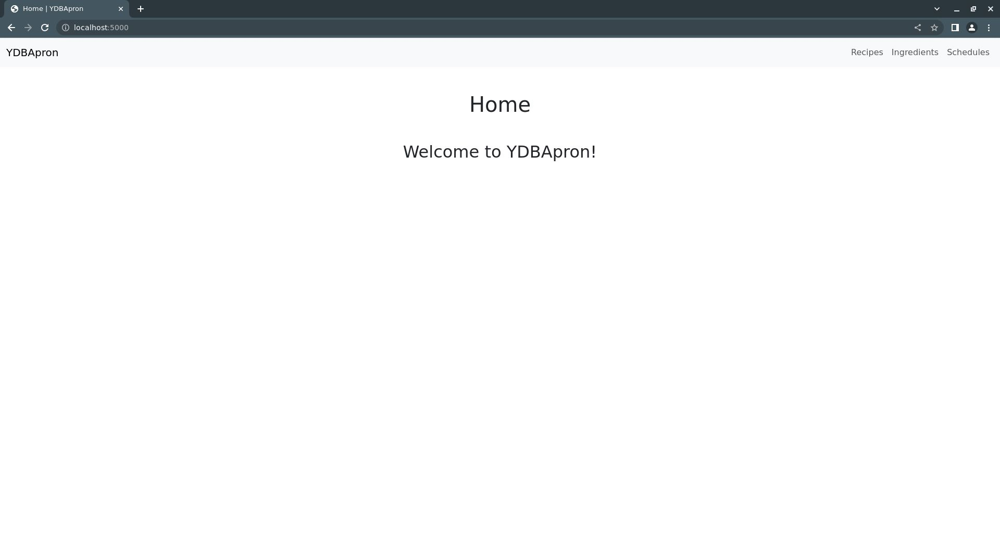

That's it for the homepage: just a couple of headings introducing the application. Now, let's move on to some more sophisticated templates: those for viewing ingredients, recipes, and production schedules.

~~~~~~~~~~~~~~~~~~~~~~~~~~~~~~~~~~~~~~~~~~~~~
Views for ingredients, recipes, and schedules
~~~~~~~~~~~~~~~~~~~~~~~~~~~~~~~~~~~~~~~~~~~~~

^^^^^^^^^^^^^^^^
Ingredient views
^^^^^^^^^^^^^^^^

Since ingredients are the most basic data objects in YDBPython, let's go start with the view for ingredients, ``ingredients.html``.

Start by adding a couple of headings and a table to a new ``ingredients.html`` in the ``templates`` directory.

.. code-block:: html+jinja

    

    
        <h1 class="mt-3 mb-5">Ingredients</h1>
        
            <article class="ingredient-category">
                <h2 class="mb-3">{{ category.title() }}</h2>
                <table class="ingredient-info table table-light table-striped table-hover align-middle mb-5">
                    <thead>
                        <tr>
                            <th scope="col">Ingredient</th>
                            <th scope="col">Amount</th>
                            <th scope="col">Unit</th>
                            <th scope="col">Price</th>
                            <th scope="col">Manufacturer</th>
                            <th scope="col">Vendor</th>
                            <th scope="col"></th>
                        </tr>
                    </thead>
                    <tbody>
                        
                            <tr>
                                <th scope="row">{{ ingredient.title() }}</th>
                                <td class="font-monospace">{{ ingredients[category][ingredient]["amount"] }}</td>
                                <td>{{ ingredients[category][ingredient]["unit"] }}</td>
                                <td  class="font-monospace">{{ ingredients[category][ingredient]["price"] }}</td>
                                <td>{{ ingredients[category][ingredient]["manufacturer"] }}</td>
                                <td>{{ ingredients[category][ingredient]["vendor"] }}</td>
                            </tr>
                        
                    </tbody>
                </table>
            </article>
        
    

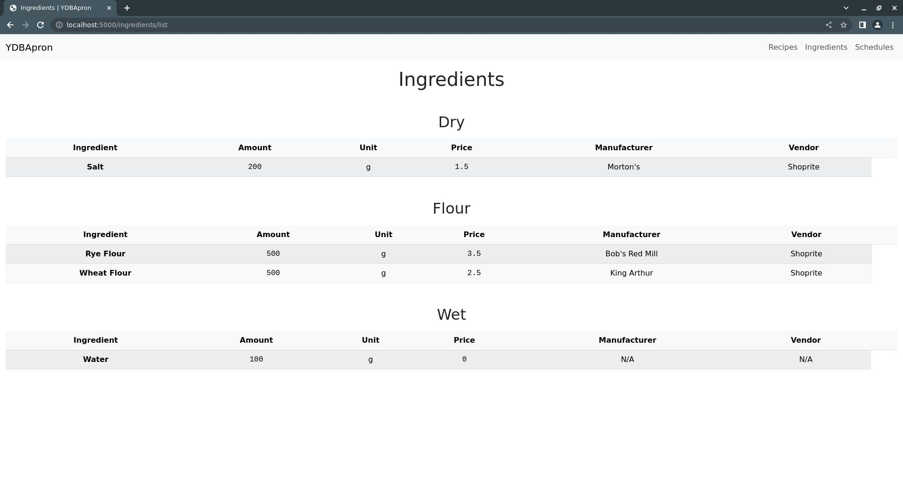

This code creates a table that lists ingredients, one per row. Columns are added for each field of that makes up an ingredient entry.

Don't mind the empty column header after the ``Vendor`` column - this just creates a column to hold the edit and delete buttons for each ingredient. You'll add these buttons a bit later when we revisit the templates to build them out fully.

For now, this is enough to at least all us to see what ingredients are in the database. Next, recipe views.

^^^^^^^^^^^^
Recipe views
^^^^^^^^^^^^

There are two recipe views: one for a single recipe, and another for multiple recipes.

First, create the recipe list page template by opening a new ``recipes.html`` file in the ``templates`` directory and adding this code:

.. code-block:: html+jinja

    

    
        <h1 class="mt-3 mb-5">Recipes</h1>
        
            <section class="recipe-category">
                <h2 class="mb-4 mt-5">{{ category.title() }}</h2>
                

                    
                        <a href="{{ url_for('recipes.recipe', category=category, recipe_name=recipe.replace(" ", "-")) }}" class="list-group-item list-group-item-action fs-4 w-50 m-auto">{{ recipe }}</a>
                    
                

            </section>
        
        <!-- Add recipe button... -->
    

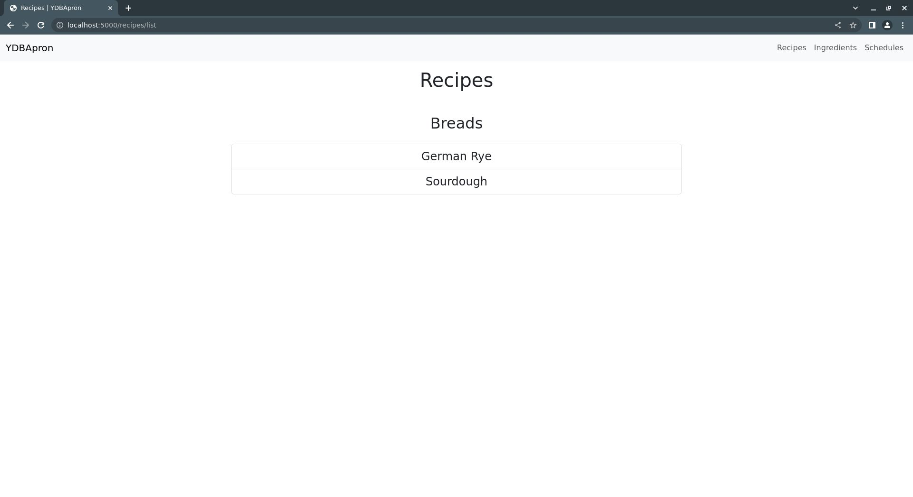

This code uses a pair of nested loops create a list a recipes, grouped by categories. Each recipe name links to the recipe page for the given recipe.

There's also a button for adding a new recipe, but you'll add that later when you add buttons to the rest of the view pages.

Next, create the single-recipe view by opening a new file named ``recipe.html`` in the ``templates`` directory, and adding the following code to it:

.. code-block:: html+jinja

    

    
    <h1> {{ recipe["name"] }} </h1>
        <article class="recipe">
            <section class="mb-5">
                <h2 class="mb-3">Ingredients</h2>
                    <table class="ingredient-list table table-light table-striped table-hover">
                        <thead>
                            <tr>
                                <th scope="col">Ingredient</th>
                                <th scope="col">Amount</th>
                                <th scope="col">Unit</th>
                                <th scope="col">Cost</th>
                            </tr>
                        </thead>
                        <tbody>
                            
                                
                                    <tr>
                                        <th scope="row">{{ ingredient }}</th>
                                        <td class="font-monospace">{{ recipe["ingredients"][category][ingredient]["amount"] }}</td>
                                        <td>{{ recipe["ingredients"][category][ingredient]["unit"] }}</td>
                                        <td class="font-monospace">{{ "${:.2f}".format(recipe["ingredients"][category][ingredient]["cost"]) }}</td>
                                    </tr>
                                
                            
                        </tbody>
                    </table>
            </section>
            <section class="mb-5">
                <h2 class="mb-3">Product Specifications</h2>
                <table class="product-specification table table-light table-striped table-hover">
                    <thead>
                        <tr>
                            <th scope="col">Format</th>
                            <th scope="col">Size</th>
                            <th scope="col">Amount</th>
                            <th scope="col">Unit</th>
                            <th scope="col">Cost</th>
                        </tr>
                    </thead>
                    <tbody>
                        
                            
                                <tr>
                                    <th scope="row">{{ product_format }}</th>
                                    <td>{{ product_size }}</td>
                                    <td class="font-monospace">{{ recipe["specifications"][product_format][product_size]["amount"] }}</td>
                                    <td>{{ recipe["specifications"][product_format][product_size]["unit"] }}</td>
                                    <td class="font-monospace">{{ "${:.2f}".format(recipe["specifications"][product_format][product_size]["cost"]) }}</td>
                                </tr>
                            
                        
                    </tbody>
                </table>
            </section>
            <section class="container w-75 mb-3">
                <h2 class="row justify-content-center">Procedure</h2>
                

                    <textarea class="form-control h-100" rows={{ recipe["procedure"].count('\n') + 1 }} disabled>{{ recipe["procedure"] }}</textarea>
                

            </section>
        </article>
    

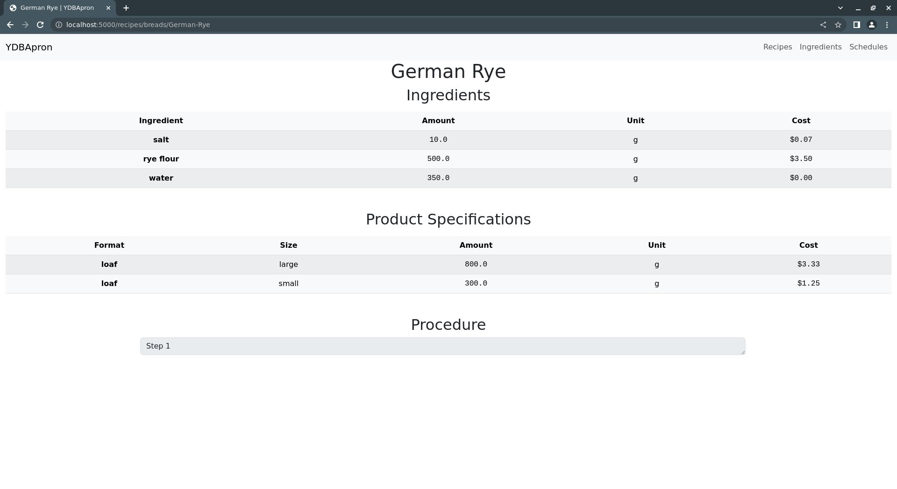

There are three ``<h2>`` tags that head off three different sections of the recipe page: an ingredient list, a list of product specifications, and a description of the procedure used to produce the recipe.

The ingredients list is a simple table consisting of rows representing ingredients. Each row contains information on how much of the ingredient to use, how much it costs, etc.

Rows are added to the ingredients table by doing a loop through a Python dictionary containing ingredient data received from the calling route, i.e. ``/recipe`` in ``recipes.py``.

Similarly, the product specification list is a table whose rows represent different products. Each row shows the product format, format size, amount (i.e. weight/volume), and cost.

Rows are added to the specifications table by doing a loop through another Python dictionary received from the calling route.

Finally, there is a section containing a ``<textarea>`` field for defining the recipe's production procedure.

Now, on to production schedule views.

^^^^^^^^^^^^^^^^^^^^^^^^^
Production schedule views
^^^^^^^^^^^^^^^^^^^^^^^^^

There are also two production schedule views: one for a single schedule, and one listing all schedules.

Start by creating the the schedule list view by opening a new ``schedules.html`` file in the ``templates`` directory and adding this code to it:

.. code-block:: html+jinja

    

    
        <h1 class="mt-3 mb-5">Schedules</h1>
        

            
                <a href="{{ url_for('schedules.schedule', schedule_name=schedule.replace(" ", "-")) }}" class="list-group-item list-group-item-action fs-4 w-50 m-auto">{{ schedule.title() }}</a>
            
        

        <!-- Add schedule button... -->
    

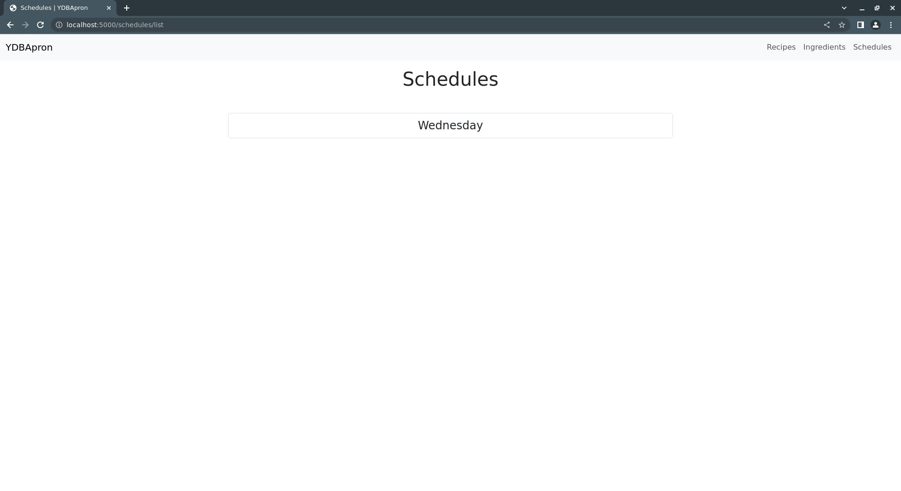

Like ``recipes.html``, ``schedules.html`` just creates a list of links to each production schedule stored in the database.

There is also a place for an "Add schedule" button, but you'll add that later along with the rest of the view buttons.

Next, you'll create the single schedule view. However, since the template for this view is more sophisticated than the others, you'll construct in two parts to make it a bit easier to see how it works.

First, add the following code to a new ``schedule.html`` file in the templates directory:

.. code-block:: html+jinja

    

    
        <article class="schedule">
            <h1 class="mt-3 mb-5">{{ schedule["name"].title() }} Schedule</h1>
            
                <section class="schedule-category">
                    <h2 class="mb-5 mt-5">{{ category.title() }}</h2>
                    
                        
                        <section class="schedule-recipe mt-5 mb-5">
                            <h3 class="fs-4 mb-3"><a href="{{ url_for('recipes.recipe', category=category, recipe_name=recipe.replace(" ", "-")) }}" class="link-primary link-offset-2 link-underline-opacity-25 link-underline-opacity-100-hover">{{ recipe.title() }}</a></h3>
                            <table class="recipe-schedule table table-light table-striped table-hover mb-4">
                                <thead>
                                    <tr>
                                        <th scope="col">Ingredient</th>
                                        <th scope="col">Amount</th>
                                        <th scope="col">Measure</th>
                                        <th scope="col">Cost</th>
                                    </tr>
                                </thead>
                                <tbody>
                                    
                                        
                                            <tr>
                                                <th scope="row">{{ ingredient }}</th>
                                                <td class="font-monospace">{{ "{:.1f}".format(schedule["recipes"][category][recipe]["ingredients"][ingredient_category][ingredient]["amount"]) }}</td>
                                                <td>{{ schedule["recipes"][category][recipe]["ingredients"][ingredient_category][ingredient]["unit"] }}</td>
                                                <td class="font-monospace">{{ "${:.2f}".format(schedule["recipes"][category][recipe]["ingredients"][ingredient_category][ingredient]["cost"]) }}</td>
                                            </tr>
                                        
                                    
                                </tbody>
                            </table>

                            <!-- Recipe yield section... -->

                        </section>
                        

                    
                </section>
            
        </article>
    

This will create list of recipes for the given schedule, grouped by recipe category. This is done by looping over each category in a recipe dictionary received from the calling route, ``/schedule`` in ``schedules.py``, then looping over each recipe in the dictionary representing the given category.

Each recipe consists of a table with ingredient amounts, as well the cost of each ingredient. Ingredients are also added by looping through a dictionary received from the calling route.

The ``break-after:page`` ``
`` tag is there simply to improve formatting when printing the production schedule.

Now, add a section for recipe yield information to the template after the table containing ingredient information:

.. code-block:: html+jinja

   <!-- ... recipe information. -->
    <section class="recipe-yield container">
        

            
                
                    
                    
                    
                    
                    

                        

                            <strong>{{ size.title() }} {{ specification.title() }}</strong>
                            {{ schedule["recipes"][category][recipe]["specifications"][specification][size]["amount"] }}
                            {{ schedule["recipes"][category][recipe]["specifications"][specification][size]["unit"] }}
                            <input type="number" class="form-control text-end font-monospace" disabled readonly id="{{ spec_volume_id }}" value="{{ schedule["recipes"][category][recipe][specification][size] if schedule["recipes"][category][recipe][specification][size] else 0 }}">
                        

                    

                
            
        

        

            

                

                    <strong>Supplementary Yield</strong>
                    <input type="number" class="form-control supplementary-yield text-end font-monospace" disabled readonly id="supplementaryYield-{{ (category.title() + recipe.title()).replace("", "") }}" value="{{ schedule["recipes"][category][recipe]["supplementary_yield"] }}">
                    {{ schedule["recipes"][category][recipe]["cost_unit"] }}
                

            

            

                

                    <strong>Gross Yield</strong>
                    <input type="number" class="form-control gross-yield text-end font-monospace" disabled readonly id="grossYield-{{ (category.title() + recipe.title()).replace(" ", "") }}" value="{{ schedule["recipes"][category][recipe]["gross_yield"] }}">
                    {{ schedule["recipes"][category][recipe]["cost_unit"] }}
                

            

            

                

                    <strong>Gross Cost</strong>
                    $
                    <input type="number" class="form-control gross-cost font-monospace text-end" disabled readonly id="grossCost-{{ (category.title() + recipe.title()).replace(" ", "") }}" value="{{ "{:.2f}".format(schedule["recipes"][category][recipe]["gross_cost"]) }}">
                

            

        

    </section>
   <!-- ... closing tags. -->

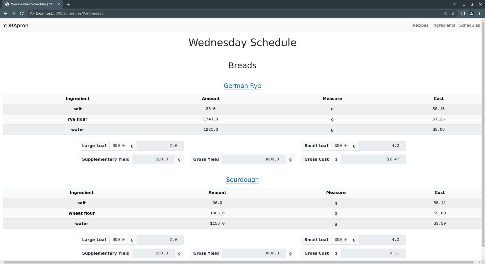

This code creates two rows of data: one that lists the number of each product type to produce, and another that lists the yield and cost information for the whole recipe.

The product type listings are created by looping over each product specification contained in a recipe dictionary received from the calling route, ``/schedule`` in ``schedules.py``.

The yield information is derived from the same recipe dictionary, but no loop is required since there is only one set of yield information per recipe.

Later, you'll add edit and delete buttons to the schedule view, but for now it's enough just to view the data.

Before creating template pages for adding and modifying data, you'll need to create some backend form objects to pass to them. So, let's create a few form classes before doing any more templating.

++++++++++++++++++++++++++++++++++++++++
8. Create templates to add and edit data
++++++++++++++++++++++++++++++++++++++++

There are three templates for adding and/or editing data in YDBApron, one each for each type of data: ingredients, recipes, and production schedules.

Again, let's start with the simplest case, ingredients, and work up to the more sophisticated.

~~~~~~~~~~~~~~~~~~~
add_ingredient.html
~~~~~~~~~~~~~~~~~~~

Start by creating a new ``add_ingredient.html`` file in the ``templates`` directory and adding the following code to it:

.. code-block:: html+jinja

    

    
    <h1 class="mb-5 mt-3"> {{ operation }} ingredient </h1>
        
            
Cannot add ingredient: ingredient limit reached ({{ num_ingredients }})

        
        <form action="{{ url_for('ingredients.add') }}" method="post">
            {{ ingredient_form.csrf_token }}
            <section class="border container mb-5 text-start">
                

                    

                        
                            

                                

                                    
<strong>{{ ingredient_form.ingredient_name.label }}</strong>

                                    {{ ingredient_form.ingredient_name(class_="form-control is-invalid") }}
                                

                                <ul class="errors list-group">
                                    
                                        <li class="list-group-item form-check text-danger">{{ error }}</li>
                                    
                                </ul>
                            

                        
                            

                                
<strong>{{ ingredient_form.ingredient_name.label }}</strong>

                                {{ ingredient_form.ingredient_name(class_="form-control") }}
                            

                        
                    

                    

                        
                                

                                

                                    
<strong>{{ ingredient_form.ingredient_category.label }}</strong>

                                    {{ ingredient_form.ingredient_category(class_="form-control is-invalid") }}
                                

                                <ul class="errors list-group"><li class="list-group-item form-check text-danger">{{ error }}</li></ul>
                            

                        
                            

                                
<strong>{{ ingredient_form.ingredient_category.label }}</strong>

                                {{ ingredient_form.ingredient_category(class_="form-control") }}
                            

                        
                    

                

                <!-- More form fields... -->
            </section>
            <button type="button" class="btn btn-secondary" onclick="javascript:history.back()">Cancel</button>
            <button type="submit" class="btn btn-primary">{{ "Add" if operation == "Add" else "Save" }}</button>
        </form>
    

This code sets up the overall structure of the "Add Ingredient" page and defines a section containing the first two form fields, ingredient name and ingredient category. It also includes a couple of buttons for submitting the form or cancelling the addition.

Now, add the remaining ingredient form fields in the space reserved for more form fields:

.. code-block:: html+jinja

   <!-- ... ingredient name and category fields ... -->
    

        

            

                
                    

                        

                            
<strong>{{ ingredient_form.ingredient_amount.label }}</strong>

                            {{ ingredient_form.ingredient_amount(class_="form-control is-invalid font-monospace text-end") }}
                        

                    

                    <ul class="errors list-group"><li class="list-group-item form-check text-danger">{{ error }}</li></ul>
            
                    

                        
<strong>{{ ingredient_form.ingredient_amount.label }}</strong>

                        {{ ingredient_form.ingredient_amount(class_="form-control font-monospace text-end") }}
                    

                
            

        

            
                

                    

                        
<strong>{{ ingredient_form.ingredient_unit.label }}</strong>

                        {{ ingredient_form.ingredient_unit(class_="form-control is-invalid col") }}
                    

                    <ul class="errors list-group">
                        <li class="list-group-item">
{{ error }}
</li></ul>
                

            
                

                    
<strong>{{ ingredient_form.ingredient_unit.label }}</strong>

                    {{ ingredient_form.ingredient_unit(class_="form-control") }}
                

            
        

        

            
                

                    

                        
<strong>{{ ingredient_form.ingredient_price.label }}</strong>

                        $
                        {{ ingredient_form.ingredient_price(class_="form-control is-invalid font-monospace text-end") }}
                    

                    <ul class="errors list-group"><li class="list-group-item form-check text-danger">{{ error }}</li></ul>
                

            
                

                    
<strong>{{ ingredient_form.ingredient_price.label }}</strong>

                    $
                    {{ ingredient_form.ingredient_price(class_="form-control font-monospace text-end") }}
                

            
        

    

    

        

            
                

                    

                        
<strong>{{ ingredient_form.ingredient_manufacturer.label }}</strong>

                        {{ ingredient_form.ingredient_manufacturer(class_="form-control is-invalid") }}
                    

                    <ul class="errors list-group"><li class="list-group-item form-check text-danger">{{ error }}</li></ul>
                

            
                

                    
<strong>{{ ingredient_form.ingredient_manufacturer.label }}</strong>

                    {{ ingredient_form.ingredient_manufacturer(class_="form-control") }}
                

            
        

        

            
                

                    {{ ingredient_form.ingredient_vendor.label }}
                    {{ ingredient_form.ingredient_vendor(class_="form-control is-invalid") }}
                    <ul class="errors list-group"><li class="list-group-item form-check text-danger">{{ error }}</li></ul>
                

            
                

                    
<strong>{{ ingredient_form.ingredient_vendor.label }}</strong>

                    {{ ingredient_form.ingredient_vendor(class_="form-control") }}
                

            
        

    

   <!-- ... buttons and section close ... -->

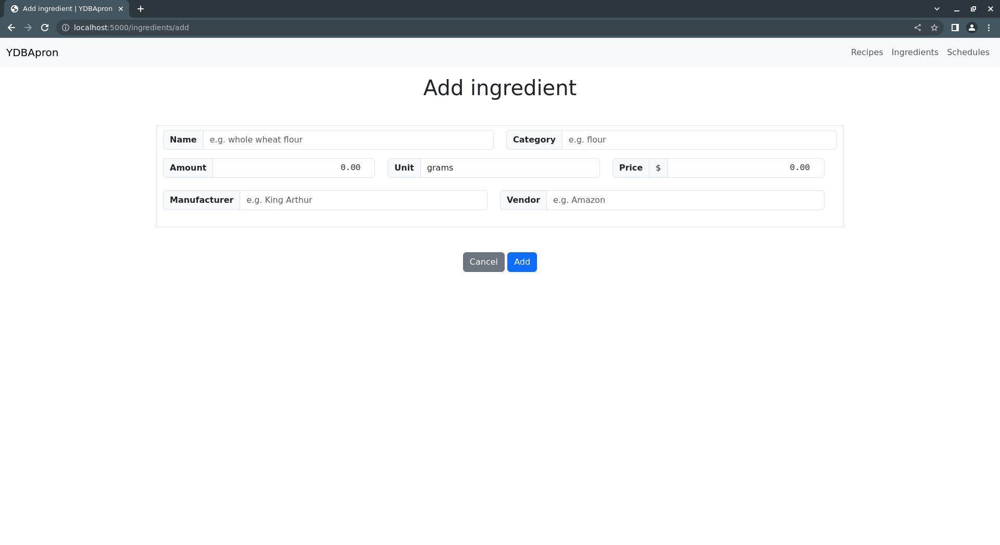

That was a lot of code, but it's all quite simple and repetitive: it just creates stylized markup for each field in the ``IngredientForm`` object received from the calling route, ``/add`` in ``ingredients.py``.

Now your ``add_ingredient.html`` file should look like `add_ingredient.html <https://gitlab.com/YottaDB/Demo/YDBApron/-/blob/master/YDBApron/templates/add_ingredient.html>`_.

Note also that for each field there's an ``if``/``else`` block that conditionally generates different markup depending on whether a previously submitted form, if any, had improperly completed fields.

~~~~~~~~~~~~~~~
add_recipe.html
~~~~~~~~~~~~~~~

Next, create an ``add_recipe.html`` file in the ``templates`` directory. This template will have several sections, so you can add them one by one to make it easier to see how it all fits together.

Start by adding this code:

.. code-block:: html+jinja

    

    
        <h1 class="mb-5 mt-3"> {{ operation }} recipe </h1>
        
            
Cannot add recipe: recipe limit reached ({{ num_recipes }})

        
        <form action="{{ url_for('recipes.add') if operation == 'Add' else url_for('recipes.edit', category=recipe_form.recipe_category.data, recipe_name=recipe_form.recipe_name.data )}}" method="post">
            {{ recipe_form.csrf_token }}
            <section class="container mb-5 text-start">
                

                    

                        
                            

                                

                                    
<strong>{{ recipe_form.recipe_name.label }}</strong>

                                    {{ recipe_form.recipe_name(class_="form-control is-invalid") }}
                                

                                <ul class="errors list-group"><li class="list-group-item form-check text-danger">{{ error }}</li></ul>
                            

                        
                            

                                
<strong>{{ recipe_form.recipe_name.label }}</strong>

                                {{ recipe_form.recipe_name(class_="form-control") }}
                            

                        
                    

                    

                        
                            

                                

                                    
<strong>{{ recipe_form.recipe_category.label }}</strong>

                                    {{ recipe_form.recipe_category(class_="form-control is-invalid") }}
                                

                                <ul class="errors list-group">
                                    
                                        <li class="list-group-item form-check text-danger">{{ error }}</li>
                                    
                                </ul>
                            

                        
                            

                                
<strong>{{ recipe_form.recipe_category.label }}</strong>

                                {{ recipe_form.recipe_category(class_="form-control") }}
                            

                        
                    

                

            </section>
            <!-- ... Ingredients form section ... -->
            <!-- ... Product specifications form section ... -->
            <!-- ... Procedure form section ... -->
            <button type="button" class="btn btn-secondary" onclick="javascript:history.back()">Cancel</button>
            <button type="submit" class="btn btn-primary">{{ "Add" if operation == "Add" else "Save" }}</button>
        </form>
    

This code structures the page and defines the first section, which contains the form fields for the recipe name and category. It also contains buttons for submitting the form or cancelling it.

Now, add the code for generating the ingredients form:

.. code-block:: html+jinja

    <!-- ... Recipe name and category fields ... -->
    <section class="ingredients container mb-5">
        <h2 class="mb-4">Ingredients</h2>
        
            <h3 class="mb-5 mt-3">{{ category.title() }}</h3>
            <section class="ingredient-category row">
                
                        
                        {{ ingredients[category][ingredient]["form"].ingredient_name(type="hidden", readonly=True, value=ingredient) }}
                        {{ ingredients[category][ingredient]["form"].ingredient_category(type="hidden", readonly=True, value=category) }}
                        <section class="ingredient col">
                                <strong>{{ ingredient.title() }}</strong>
                                

                                    
                                        

                                            

                                                
<strong>{{ ingredients[category][ingredient]["form"].ingredient_amount.label }}</strong>

                                                {{ ingredients[category][ingredient]["form"].ingredient_amount(class_="form-control ingredient-amount font-monospace text-end", id=("ingredientAmount-" + ingredient_id)) }}
                                            

                                            <ul class="errors list-group"><li class="list-group-item form-check text-danger">{{ error }}</li></ul>
                                        

                                    
                                        

                                            
<strong>{{ ingredients[category][ingredient]["form"].ingredient_amount.label }}</strong>

                                            {{ ingredients[category][ingredient]["form"].ingredient_amount(class_="form-control ingredient-amount font-monospace text-end", id=("ingredientAmount-" + ingredient_id)) }}
                                        

                                    
                                    
                                        

                                            

                                                
<strong>{{ ingredients[category][ingredient]["form"].ingredient_unit.label }}</strong>

                                                {{ ingredients[category][ingredient]["form"].ingredient_unit(class_="form-control ingredient-unit", id=("ingredientUnit-" + ingredient_id)) }}
                                            

                                            <ul class="errors list-group"><li class="list-group-item form-check text-danger">{{ error }}</li></ul>
                                        

                                    
                                        

                                            
<strong>{{ ingredients[category][ingredient]["form"].ingredient_unit.label }}</strong>

                                            {{ ingredients[category][ingredient]["form"].ingredient_unit(class_="form-control ingredient-unit", id=("ingredientUnit-" + ingredient_id)) }}
                                        

                                    
                                

                        </section>
                
            </section>
        
    </section>
    <!-- ... More fields ... -->

This section loops over each ingredient category and ingredient name to generate a list of ingredients, grouped by category.

Each entry in the list gets a field for specifying the amount of the ingredient to include in the recipe, along with a disabled field specifying the unit of measure for the ingredient amount.

Now, add the product specification form:

.. code-block:: html+jinja

    <!-- ... Ingredients form ... -->
    <section class="product-specifications container">
        <h2 class="mb-5">Product Specifications</h2>
        
            <section class="specification border-bottom row pb-4 mb-4">
                

                    

                        <strong>Format</strong>
                        {{ specification_form.specification_format(class_="form-control specification-format") }}
                    

                

                

                    

                        <strong>Format Size</strong>
                        {{ specification_form.specification_format_size(class_="form-control specification-format-size") }}
                    

                

                

                    

                        <strong>Size</strong>
                        {{ specification_form.specification_size(class_="form-control specification-size font-monospace text-end") }}
                        {{ specification_form.specification_unit(class_="form-control specification-unit") }}
                    

                

            </section>
        
    </section>
    <!-- ... More forms ... -->

Like the last block of code, this one also defines a form that contains a list of fields.

This time, the code loops over each product specification and creates four form fields for each: format, format size, specification size (a.k.a amount), and the unit measure of the specification size.

Finally, add the procedure form field:

.. code-block:: html+jinja

    <!-- ... Product specification forms ... -->
    <section class="procedure container mb-5 mt-3">
        <h2 class="mb-3">Procedure</h2>
        

            {{ recipe_form.procedure(class_="form-control", rows=(recipe_form.procedure.data.count('\n') + 1)) }}
        

    </section>
    <!-- ... Buttons and form end ... -->

This block defines a simple section with a single field for entering arbitrary text describing the procedure for producing the recipe.

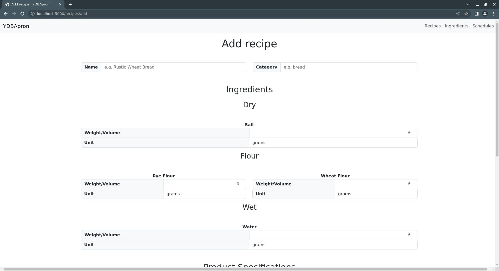

Now your ``add_recipe.html`` file should look like `add_recipe.html <https://gitlab.com/YottaDB/Demo/YDBApron/-/blob/master/YDBApron/templates/add_recipe.html>`_.

That's it for adding recipes. Now on to adding schedules.

~~~~~~~~~~~~~~~~~
add_schedule.html
~~~~~~~~~~~~~~~~~

The core of the ``add_schedule.html`` template is a list of recipes, each with form fields for specifying how much of each product specification to produce for that recipe.

However, before adding this logic, start by creating the new ``add_schedule.html`` file in the templates directory with this code:

.. code-block:: html+jinja

    

    
        <h1 class="mt-3 mb-5"> {{ operation }} Schedule</h1>
        <form action="{{ url_for('schedules.add') if operation == 'Add' else url_for('schedules.edit', schedule_name=schedule_form.schedule_name.data )}}" method="post">
            {{ schedule_form.csrf_token }}
            

                
                    

                        

                            <strong>{{ schedule_form.schedule_name.label }}</strong>
                            {{ schedule_form.schedule_name(class_="form-control is-invalid") }}
                        

                        <ul class="errors list-group">
                            
                                <li class="list-group-item form-check text-danger">{{ error }}</li>
                            
                        </ul>
                    

                
                    

                        <strong>{{ schedule_form.schedule_name.label }}</strong>
                        {{ schedule_form.schedule_name(class_="form-control") }}
                    

                
            

            <!-- ... Recipe scaling forms ... -->
            <button type="button" class="btn btn-secondary" onclick="javascript:history.back()">Cancel</button>
            <button type="submit" class="btn btn-primary">{{ "Add" if operation == "Add" else "Save" }}</button>
        </form>
        <!-- ... Yield calculation script ... -->
    

This code structures the page, creates the main form, adds a field for accepting the schedule name, and adds buttons to submit or cancel the form.

With this in place, add a section the recipe field generation logic:

.. code-block:: html+jinja

    <!-- ... Schedule name field -->
    <section class="schedule-add-recipes">
        
            <section class="recipe-category container">
                <h2 class="mb-5 mt-5">{{ category.title() }}</h2>
                
                    
                    {{ recipes[category][recipe]["form"].recipe_name(type="hidden", readonly=True, value=recipe) }}
                    {{ recipes[category][recipe]["form"].recipe_category(type="hidden", readonly=True, value=category) }}
                    <!-- ... Recipe form -->
                
            </section>
        
    </section>
    <!-- ... Buttons, script, etc. -->

This code creates a new section that holds the recipe subforms, one for each recipe in the database. These subforms are created by first looping through each recipe category and recipe name in the ``recipes`` dictionary received from the calling route, i.e. ``/add`` in ``schedules.py``.

Then, for each recipe, a ``recipe_id`` string is created for uniquely identifying each recipe for reference by the JavaScript you'll write below.

Also, two hidden form fields are added, containing the recipe name and recipe category. These hidden fields are used by the application logic in ``schedules.py`` to help store the schedule's recipe data in the database.

With these elements in place, now add section for holding the specification and yield subforms:

.. code-block:: html+jinja

    <!-- .. Recipe category and name loops, etc. ... -->
    <section class="recipe row mb-5">
        <h3 class="fs-4 mb-3"><a href="{{ url_for('recipes.recipe', category=category, recipe_name=recipe.replace(" ", "-")) }}" class="link-primary link-offset-2 link-underline-opacity-25 link-underline-opacity-100-hover">{{ recipe }}</a></h3>
        <!-- ... Specification subform ... -->
        <!-- ... Yield subform ... -->
    </section>
    <!-- ... End of recipe category and name loops ...  -->

Next, add a ``
`` tag containing the specification form fields:

.. code-block:: html+jinja

    <!-- ... Recipe heading ... -->
    

        
            
                
                
                
                
                

                    

                        <strong>{{ size.title() }} {{ specification.title() }}</strong>
                        {{ recipes[category][recipe]["specifications"][specification][size]["amount"] }}
                        {{ recipes[category][recipe]["specifications"][specification][size]["unit"] }}
                        {{ recipes[category][recipe]["specifications"][specification][size]["form"].specification_volume(class_="form-control recipe-specification font-monospace text-end", id=spec_volume_id) }}
                    

                

                {{ recipes[category][recipe]["specifications"][specification][size]["form"].specification_name(id=spec_name_id, type="hidden", readonly=True, value=specification) }}
                {{ recipes[category][recipe]["specifications"][specification][size]["form"].specification_size(id=spec_size_id, type="hidden", readonly=True, value=size) }}
            
        
    

    <!-- ... Yield subform ... -->

This code will add a subform for each product specification defined for the given recipe.

The subform consists of the specification format name, format size, amount of product, and unit of measure for the amount. Each of these fields is read-only and is for informational purposes only.

The sole editable field is the field for the specification volume. This field records the number of the specified product to produce. This is identified with a ``spec_volume_id`` for targeting by the JavaScript code you'll write below.

Finally, there are two more hidden fields, identifying the specification format name and format size. These fields are to help the application logic store the recipe specification information in the database.

Now, add the yield subform:

.. code-block:: html+jinja

    <!-- ... Specification subform ... -->
    

        

            

                <strong>Supplementary Yield</strong>
                {{ recipes[category][recipe]["form"].supplementary_yield(class_="form-control supplementary-yield font-monospace text-end", id=("recipeSpecification-supplementaryYield-" + recipe_id)) }}
                g
            

        

        

            

                <strong>Gross Yield</strong>
                {{ recipes[category][recipe]["form"].gross_yield(class_="form-control gross-yield font-monospace text-end", id=("grossYield-" + recipe_id), disabled=True, readonly=True) }}
                g
            

        

        

            

                <strong>Gross Cost</strong>
                $
                {{ recipes[category][recipe]["form"].gross_cost(class_="form-control gross-cost font-monospace text-end", id=("grossCost-" + recipe_id), disabled=True, readonly=True) }}
            

        

    

    <!-- End of the recipe form section, buttons, etc. -->

This ``
`` adds three fields that store the supplementary yield, gross yield, and gross cost of the recipe.

The supplementary yield field allows the user to specify an amount of product for production beyond the number of products specified in the previous form. It's basically just extra product.

The gross yield and gross cost fields are read-only, and are updated automatically using JavaScript based on the supplementary yield field and the product specification fields.

Finally, add that JavaScript by adding a ```` block just below the end of the form (after ``</form>``) with this code:

.. code-block:: javascript

    function update_yield(event) {
            let gross_yield_value = 0
            let recipe_id = event.target.id.split("-")[2];
            let recipe_supplementary_yield = document.getElementById("recipeSpecification-supplementaryYield-" + recipe_id);
            let recipe_gross_yield = document.getElementById("grossYield-" + recipe_id);
            let product_specs = document.querySelectorAll(`[id^="recipeSpecification-Volume-${recipe_id}"]`);

            for (const product_spec of product_specs) {
                let spec_suffix = product_spec.id.split("-")[3];
                let spec_amount = document.getElementById("specificationAmount-" + recipe_id + "-" + spec_suffix).innerHTML;
                gross_yield_value += (parseInt(product_spec.value || 0) * parseInt(spec_amount))
            }
            gross_yield_value += parseInt(recipe_supplementary_yield.value || 0)
            recipe_gross_yield.value = gross_yield_value
    }
    const recipe_specifications = document.getElementsByClassName("recipe-specification");
    for (let recipe_specification of recipe_specifications) {
        recipe_specification.addEventListener("change", update_yield)
    }
    const supplementary_yields = document.getElementsByClassName("supplementary-yield");
    for (let supplementary_yield of supplementary_yields) {
        supplementary_yield.addEventListener("change", update_yield)
    }

This code adds JavaScript event listeners for each product specification and supplementary yield field. The, whenever these fields are changed, it updates the gross cost and gross yield accordingly using the ``update_yield()`` function.

``update_yield()`` simply takes the value of each product specification field sums them, and adds them to the value of the supplementary yield field.

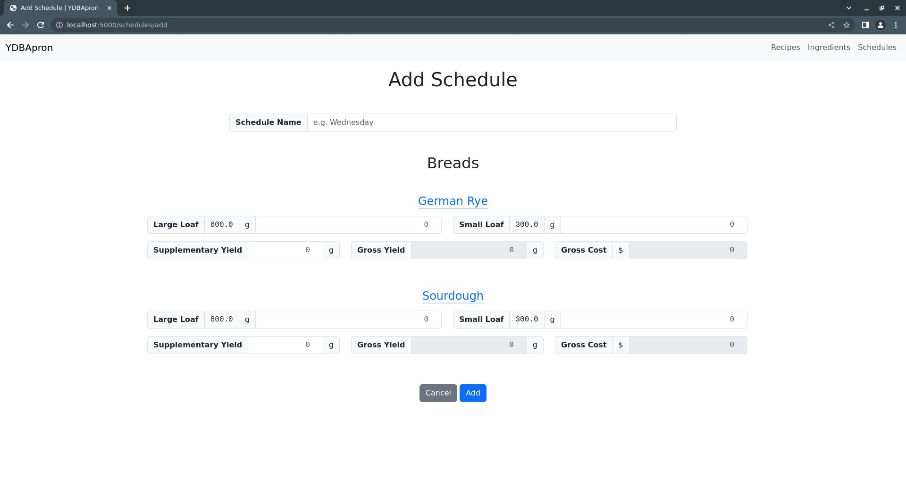

Now your ``add_schedule.html`` file should look like `add_schedule.html <https://gitlab.com/YottaDB/Demo/YDBApron/-/blob/master/YDBApron/templates/add_schedule.html>`_.

Whew, that's it for the add and edit templates.

++++++++++++++++++++++++++++++++
9. Add buttons to template pages
++++++++++++++++++++++++++++++++

With the bulk of the HTML templates written, now all you need to do is add some "Add", "Edit", and "Delete" buttons to some of the template pages. Once those are incorporated, the application will be complete.

First, insert an "Add ingredient" button to the end of ``ingredients.html``:

.. code-block:: html+jinja

    <!-- ... -->
        
        <button type="button" class="btn btn-primary mt-5 d-print-none" data-bs-toggle="modal"><a class="link-light link-underline-opacity-0" href="{{ url_for('ingredients.add') }}">Add ingredient</a></button>
    

Then add ingredient edit and delete buttons to the same file after the ``<td>{{ ingredients[category][ingredient]["vendor"] }}</td>`` line:

.. code-block:: html+jinja

    <td class="d-print-none">
        <button type="button" class="btn btn-secondary" data-bs-toggle="modal" data-bs-target="#edit{{ (category.title() + ingredient.title()).replace(" ", "-") }}">Edit</button>
        

            

                

                    

                        <h1 class="modal-title fs-5" id="edit{{ (category.title() + ingredient.title()).replace(" ", "-") }}">Edit ingredient</h1>
                        <button type="button" class="btn-close" data-bs-dismiss="modal" aria-label="Close"></button>
                    

                    
Edit details for ingredient <strong>{{ ingredient.title() }}</strong>?

                    

                        <button type="button" class="btn btn-secondary" data-bs-dismiss="modal">Close</button>
                        <a href="{{ url_for('ingredients.edit', category=category, ingredient_name=ingredient) }}" class="btn btn-primary">Edit</a>
                    

                

            

        

        
            <button type="button" class="btn btn-danger" data-bs-toggle="modal"
                data-bs-target="#delete{{ (category.title() + ingredient.title()).replace(" ", "-") }}">Delete</button>
            

                

                    

                        

                            <h1 class="modal-title fs-5" id="delete{{ (category.title() + ingredient.title()).replace(" ", "-") }}">Delete ingredient</h1>
                            <button type="button" class="btn-close" data-bs-dismiss="modal" aria-label="Close"></button>
                        

                        
Delete <strong>{{ ingredient }}</strong> from ingredient list?

                        

                            <button type="button" class="btn btn-secondary" data-bs-dismiss="modal">Close</button>
                            <form action="{{ url_for('ingredients.delete') }}" method="post">
                                <input type="hidden" id="deleteIngredient{{ (category.title() + ingredient.title()).replace(" ", "-") }}"
                                                     name="deleteIngredient"
                                                     value="{{ ingredient }}"/>
                                <input type="hidden" id="deleteCategory{{ (category.title() + ingredient.title()).replace(" ", "-") }}"
                                                     name="deleteCategory"
                                                     value="{{ category }}"/>
                                <button type="submit" class="btn btn-danger">Delete</button>
                            </form>
                        

                    

                

            

        
            <button type="button" class="btn btn-danger" data-bs-toggle="modal" data-bs-target="#delete{{ (category.title() + ingredient.title()).replace(" ", "-") }}">Delete</button>
            

                

                    

                        

                            <h1 class="modal-title fs-5" id="delete{{ (category.title() + ingredient.title()).replace(" ", "-") }}">Delete ingredient</h1>
                            <button type="button" class="btn-close" data-bs-dismiss="modal" aria-label="Close"></button>
                        

                        

                            
Cannot delete <strong>{{ ingredient }}</strong> from ingredient list.

                            
To delete <strong>{{ ingredient }}</strong>, first delete these recipes:

                            

                                
                                <a href="{{ url_for('recipes.recipe', category=recipe['category'], recipe_name=recipe['name']) }}" class="list-group-item list-group-item-action">{{ recipe['name'] }}</a>
                                
                            

                        

                        

                            <button type="button" class="btn btn-secondary" data-bs-dismiss="modal">Close</button>
                        

                    

                

            

        
    </td>

Now your ``ingredients.html`` file should look like `ingredients.html <https://gitlab.com/YottaDB/Demo/YDBApron/-/blob/master/YDBApron/templates/ingredients.html>`_.

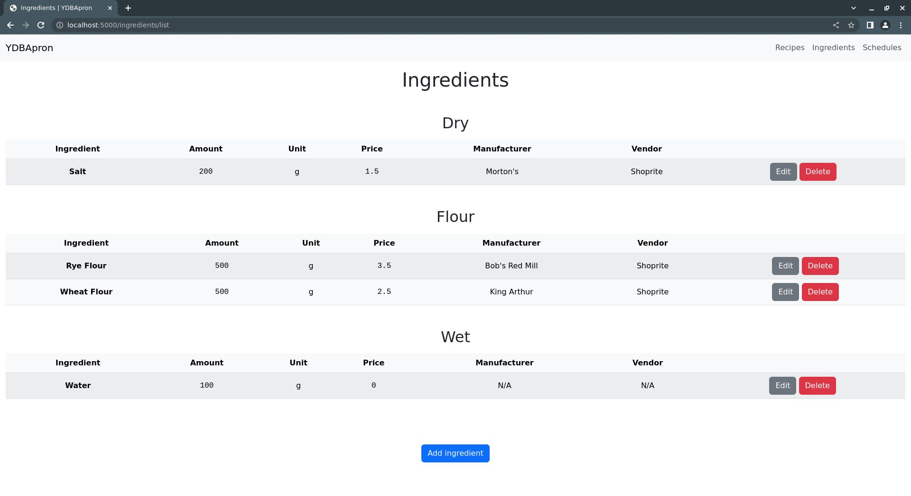

Then, insert an "Add recipe" button to ``recipes.html``:

.. code-block:: html+jinja

   <!-- ... -->
        
        <button type="button" class="btn btn-primary mt-5" data-bs-toggle="modal"><a class="link-light link-underline-opacity-0" href="{{ url_for('recipes.add') }}">Add recipe</a></button>
    

Now your ``recipes.html`` file should look like `recipes.html <https://gitlab.com/YottaDB/Demo/YDBApron/-/blob/master/YDBApron/templates/recipes.html>`_.

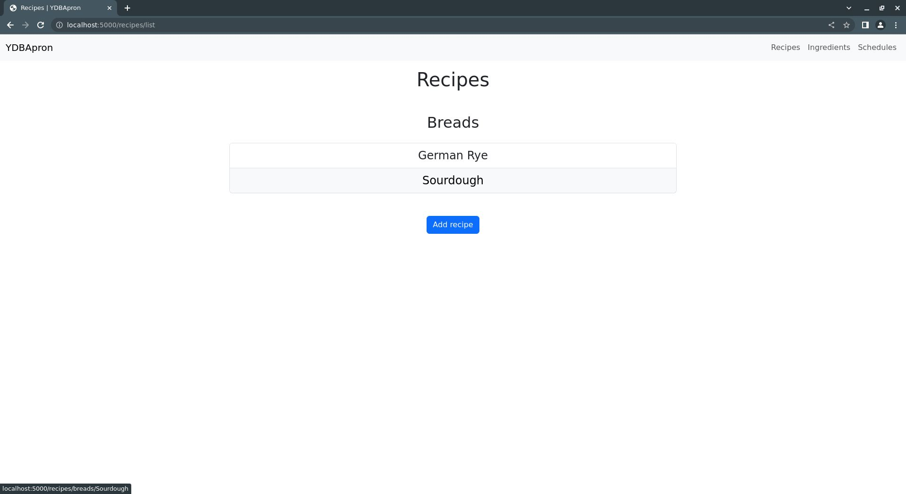

Next, create edit and delete buttons in ``recipe.html``:

.. code-block:: html+jinja

        <!-- ... Procedure section ... -->
        <section class="d-print-none">
            <button type="button" class="btn btn-secondary" data-bs-toggle="modal"
            data-bs-target="#edit{{ (recipe["category"].title() + recipe["name"].title()).replace(" ", "-") }}">Edit Recipe</button>
            

                

                    

                        

                            <h1 class="modal-title fs-5" id="edit{{ (recipe["category"].title() + recipe["name"].title()).replace(" ", "-") }}">Edit Recipe</h1>
                            <button type="button" class="btn-close" data-bs-dismiss="modal" aria-label="Close"></button>
                        

                        
Edit recipe for <strong>{{ recipe["name"] }}</strong>?

                        

                            <button type="button" class="btn btn-secondary" data-bs-dismiss="modal">Close</button>
                            <a href="{{ url_for('recipes.edit', category=recipe['category'], recipe_name=recipe['name'].replace(" ", "-")) }}" class="btn btn-primary">Edit</a>
                        

                    

                

            

            
                <button type="button" class="btn btn-danger" data-bs-toggle="modal"
                data-bs-target="#delete{{ (recipe["category"].title() + recipe["name"].title()).replace(" ", "-") }}">Delete Recipe</button>
                

                    

                        

                            

                                <h1 class="modal-title fs-5" id="delete{{ (recipe["category"].title() + recipe["name"].title()).replace(" ", "-") }}">Delete recipe</h1>
                                <button type="button" class="btn-close" data-bs-dismiss="modal" aria-label="Close"></button>
                            

                            
Delete <strong>{{ recipe["name"] }}</strong> from recipe list?

                            

                                <button type="button" class="btn btn-secondary" data-bs-dismiss="modal">Close</button>
                                <form action="{{ url_for('recipes.delete') }}" method="post">
                                    <input type="hidden" id="deleteRecipe{{ (recipe["category"].title() + recipe["name"].title()).replace(" ", "-") }}"
                                                         name="deleteRecipe"
                                                         value="{{ recipe["name"] }}"/>
                                    <input type="hidden" id="deleteCategory{{ (recipe["category"].title() + recipe["name"].title()).replace(" ", "-") }}"
                                                         name="deleteCategory"
                                                         value="{{ recipe["category"] }}"/>
                                    <button type="submit" class="btn btn-danger">Delete</button>
                                </form>
                            

                        

                    

                

            
                <button type="button" class="btn btn-danger" data-bs-toggle="modal" data-bs-target="#delete{{ (recipe["category"].title() + recipe["name"].title()).replace(" ", "-") }}">Delete Recipe</button>
                

                    

                        

                            

                                <h1 class="modal-title fs-5" id="delete{{ (recipe["category"].title() + recipe["name"].title()).replace(" ", "-") }}">Delete recipe</h1>
                                <button type="button" class="btn-close" data-bs-dismiss="modal" aria-label="Close"></button>
                            

                                

                                    
Cannot delete <strong>{{ recipe["name"] }}</strong> from recipe list.

                                    
To delete <strong>{{ recipe["name"] }}</strong>, first remove it from these schedules:

                                    

                                        
                                            <a href="{{ url_for('schedules.schedule', schedule_name=schedule) }}" class="list-group-item list-group-item-action">{{ schedule }}</a>
                                        
                                    

                                

                            

                                <button type="button" class="btn btn-secondary" data-bs-dismiss="modal">Close</button>
                            

                        

                    

                

            
        </section>
        <!-- /article  -->

Now your ``recipe.html`` file should look like `recipe.html <https://gitlab.com/YottaDB/Demo/YDBApron/-/blob/master/YDBApron/templates/recipe.html>`_.

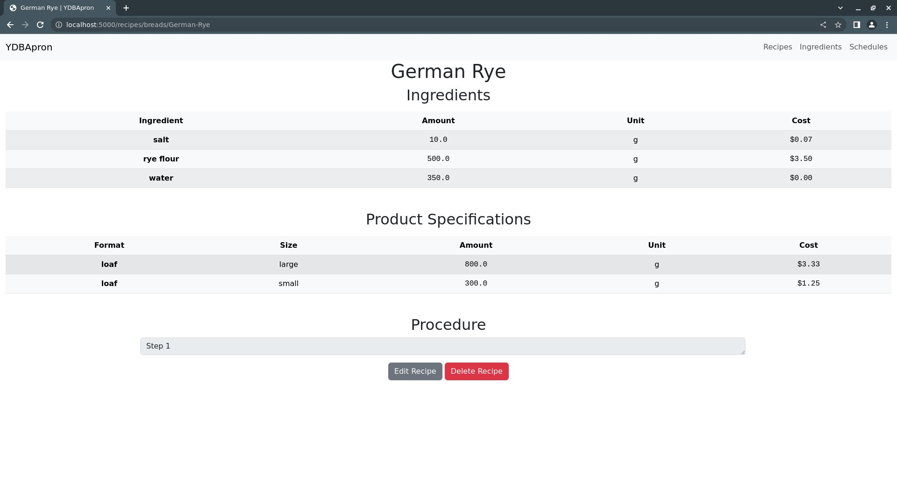

Now, create an "Add schedule" button in ``schedules.html`` just before the ````:

.. code-block:: html+jinja

	<button type="button" class="btn btn-primary mt-5" data-bs-toggle="modal">
		<a class="link-light link-underline-opacity-0" href="{{ url_for('schedules.add') }}">Add schedule</a>
	</button>

Now your ``schedules.html`` file should look like `schedules.html <https://gitlab.com/YottaDB/Demo/YDBApron/-/blob/master/YDBApron/templates/schedule.html>`_.

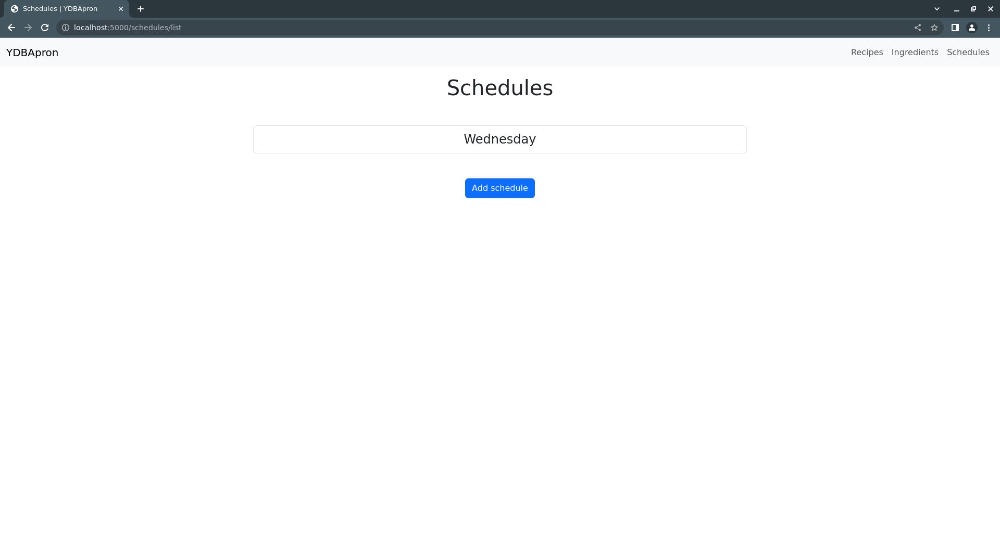

Finally, create edit and delete buttons in ``schedule.html``:

.. code-block:: html+jinja

		<!--  -->
		<section class="d-print-none">
			<button type="button" class="btn btn-secondary" data-bs-toggle="modal"
			data-bs-target="#edit{{ schedule["name"].title() }}">Edit Schedule</button>
			

				

					

						

							<h1 class="modal-title fs-5" id="edit{{ schedule["name"].title() }}">Edit Recipe</h1>
							<button type="button" class="btn-close" data-bs-dismiss="modal" aria-label="Close"></button>
						

						
Edit recipe for <strong>{{ schedule["name"].title() }}</strong>?

						

							<button type="button" class="btn btn-secondary" data-bs-dismiss="modal">Close</button>
							<a href="{{ url_for('schedules.edit', schedule_name=schedule["name"]) }}" class="btn btn-primary">Edit</a>
						

					

				

			

			<button type="button" class="btn btn-danger" data-bs-toggle="modal"
			data-bs-target="#deleteSchedule{{ schedule["name"].title() }}">Delete Schedule</button>
			

				

					

						

							<h1 class="modal-title fs-5" id="deleteSchedule{{ schedule["name"].title() }}">Delete schedule</h1>
							<button type="button" class="btn-close" data-bs-dismiss="modal" aria-label="Close"></button>
						

						
Delete <strong>{{ schedule["name"] }}</strong> from schedule list?

						

							<button type="button" class="btn btn-secondary" data-bs-dismiss="modal">Close</button>
							<form action="{{ url_for('schedules.delete') }}" method="post">
								<input type="hidden" id="deleteSchedule{{ schedule["name"].title() }}"
													 name="deleteSchedule"
													 value="{{ schedule["name"] }}"/>
								<button type="submit" class="btn btn-danger">Delete</button>
							</form>
						

					

				

			

		</section>
    <!-- /article -->

Now your ``schedule.html`` file should look like `schedule.html <https://gitlab.com/YottaDB/Demo/YDBApron/-/blob/master/YDBApron/templates/schedule.html>`_.

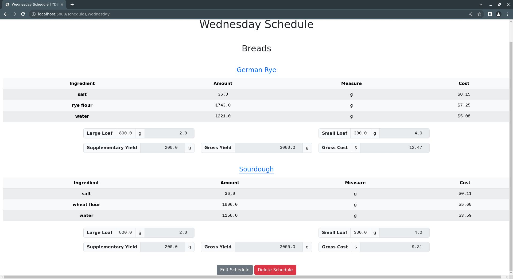

With this, YDBApron is now complete. Congratulations!

.. _ydbapron-summary:

------------------
Summary and Review
------------------

Now that you've worked through the tutorial and built the full YDBApron, let's break down its application structure and data model to drive home the fundamentals of application development with YDBPython.

+++++++++++++++++++++
Application Structure
+++++++++++++++++++++

In a nutshell, YDBApron is a simple `Model-View-Controller (MVC) <https://en.wikipedia.org/wiki/Model%E2%80%93view%E2%80%93controller>`_ application that uses a conventional `Flask application layout <https://flask.palletsprojects.com/en/2.3.x/tutorial/layout/>`_:

.. code-block::

    ├── COPYING
    ├── LICENSE
    ├── README.md
    ├── YDBApron
    │   ├── __init__.py
    │   ├── forms.py
    │   ├── globals.py
    │   ├── ingredients.py
    │   ├── recipes.py
    │   ├── schedules.py
    │   └── templates
    │       ├── add_ingredient.html
    │       ├── add_recipe.html
    │       ├── add_schedule.html
    │       ├── base.html
    │       ├── index.html
    │       ├── ingredients.html
    │       ├── recipe.html
    │       ├── recipes.html
    │       ├── schedule.html
    │       └── schedules.html
    ├── setup.py
    └── tests
        └── testdata.zwr

Note in particular the ``YDBApron`` directory under the top-level project directory. This directory represents the YDBApron Python module and contains all the application logic and HTML templates.

The ``YDBApron`` directory contains the following files:

* ``__init__.py``: Logic to create and initialize a Flask application.
* ``forms.py``: Class definitions for various web forms
* ``globals.py``: Definitions for Python global variables used in other modules
* ``ingredients.py``: Logic for adding, editing, and deleting ingredient information from the database.
* ``recipes.py``: Logic for adding, editing, and deleting recipe information from the database.
* ``schedules.py``: Logic for adding, editing, and deleting production schedule information from the database.

Together, these files represent the *controller* portion of this application.

Additionally, the ``YDBApron`` directory contains a ``templates`` directory with all the Jinja2 HTML templates used to generate the application web interface. This directory contains the following files:

* ``add_ingredient.html``: Template logic to display a form for adding and editing ingredients
* ``add_recipe.html``: Template logic to display a form for adding and editing recipes
* ``add_schedule.html``: Template logic to display a form for adding and editing production schedules
* ``base.html``: Template logic used across all other template pages
* ``index.html``: Homepage template
* ``ingredients.html``: Ingredient list page template
* ``recipe.html``: Individual recipe page template
* ``recipes.html``: Recipe list page template
* ``schedule.html``: Individual schedule page template
* ``schedules.html``: Schedule list page template

These templates represent the application *views* on the database, and so rely on the data structures and functions defined in the application controller files listed above.

The application data model itself is discussed in the following section.

The ``setup.py`` file contains basic application setup logic required for running YDBApron as a Python module.

The ``tests`` directory contains sample application data in ``testdata.zwr``, as well as a simple unit testing infrastructure.

Throughout the tutorial, the ``testdata.zwr`` file can be used to populate a YottaDB database with YDBApron application data for demonstration and testing. This can done by running the following shell command:

.. code-block:: bash

    ydb_chset=M mupip load tests/testdata.zwr

++++++++++++++++++++++
Application Data Model
++++++++++++++++++++++

The YDBApron data model uses simple tree structure to organize data, with some recipe and ingredient information fields stored in a delimited list format.

Specifically, YDBApron uses the native YottaDB tree model to categorize various data object types, e.g. recipes, ingredients, etc. For example, YDBApron defines a "recipes" node whose child branches represent recipe categories. Each recipe category branch has child branches that represent recipes, and so on.

``testdata.zwr`` contains sample data that demonstrates the tree structure throughout YDBApron:

.. code-block::

    ^YDBApron("recipes","breads","German Rye","ingredients","flour","rye flour")="500|g|0.581"
    ^YDBApron("recipes","breads","German Rye","ingredients","wet","water")="350|g|0.407"
    ^YDBApron("recipes","breads","German Rye","ingredients","dry","salt")="10|g|0.012"
    ^YDBApron("recipes","breads","German Rye","specifications","loaf","large")="800|g"
    ^YDBApron("recipes","breads","German Rye","specifications","loaf","small")="300|g"
    ^YDBApron("recipes","breads","German Rye","procedure")="Step 1"
    ^YDBApron("recipes","breads","Sourdough","ingredients","flour","wheat flour")="500|g|0.602"
    ^YDBApron("recipes","breads","Sourdough","ingredients","wet","water")="320|g|0.386"
    ^YDBApron("recipes","breads","Sourdough","ingredients","dry","salt")="10|g|0.012"
    ^YDBApron("recipes","breads","Sourdough","specifications","loaf","large")="800|g"
    ^YDBApron("recipes","breads","Sourdough","specifications","loaf","small")="300|g"
    ^YDBApron("recipes","breads","Sourdough","procedure")="Step 1"
    ^YDBApron("ingredients","flour","rye flour")="500|g|3.5|Bob's Red Mill|Shoprite"
    ^YDBApron("ingredients","flour","wheat flour")="500|g|2.5|King Arthur|Shoprite"
    ^YDBApron("ingredients","wet","water")="100|g|0|N/A|N/A"
    ^YDBApron("ingredients","dry","salt")="200|g|1.5|Morton's|Shoprite"
    ^YDBApron("schedules","Wednesday","breads","German Rye","specifications","loaf","large")=2
    ^YDBApron("schedules","Wednesday","breads","German Rye","specifications","loaf","small")=4
    ^YDBApron("schedules","Wednesday","breads","German Rye","supplementary")=200
    ^YDBApron("schedules","Wednesday","breads","Sourdough","specifications","loaf","large")=2
    ^YDBApron("schedules","Wednesday","breads","Sourdough","specifications","loaf","small")=4
    ^YDBApron("schedules","Wednesday","breads","Sourdough","supplementary")=200

Here's a diagram representing the same data as a tree:

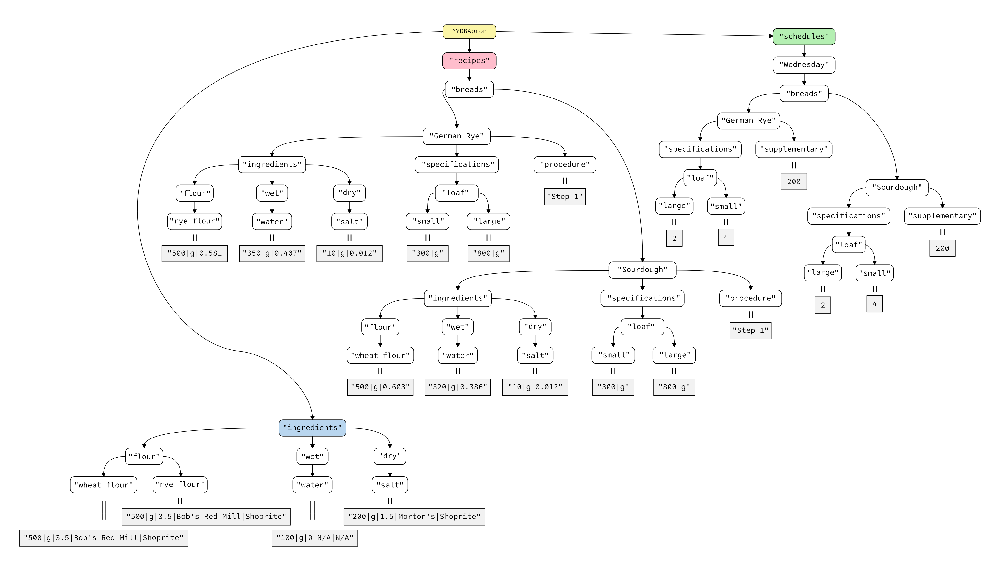

These nodes collectively represent a combination of recipes, ingredients, and production schedules. The following items are represented:

* Two recipes: "German Rye" and "Sourdough"
* Four ingredients: "rye flour", "wheat flour", "water", and "salt"
* One product schedule: "Wednesday"

Note that some data is stored in a delimited format as YottaDB node values. For example, consider the ingredient information for the "German Rye" bread recipe in ``testdata.zwr``:

.. code-block::

  ^YDBApron("recipes","breads","German Rye","ingredients","flour","rye flour")="500|g|0.581"
  ^YDBApron("recipes","breads","German Rye","ingredients","wet","water")="350|g|0.407"
  ^YDBApron("recipes","breads","German Rye","ingredients","dry","salt")="10|g|0.012"

The details for each ingredient are stored in a list of fields that is delimited by pipe (``|``) characters. The meaning of these fields is discussed in more detail in the sections below.

~~~~~~~~~~~~~~~~~
Recipe data model
~~~~~~~~~~~~~~~~~

Each recipe is stored across multiple nodes representing a combination of ingredient and product specification information. Each ingredient gets its own node in the sub-tree for the given recipe. Each node is referenced using a series of keys of the following format:

.. code-block::

  ^YDBApron("recipes",recipe_category,recipe_name,"ingredients",ingredient_category,ingredient_name)="weight|weight_unit|proportion"

For example:

.. code-block::

  ^YDBApron("recipes","breads","German Rye","ingredients","flour","rye flour")="500|g|0.581"
  ^YDBApron("recipes","breads","German Rye","ingredients","wet","water")="350|g|0.407"
  ^YDBApron("recipes","breads","German Rye","ingredients","dry","salt")="10|g|0.012"

Together, these nodes contain all recipe details for the following ingredients of the "German Rye" recipe: rye flour, water, and salt.

Note in particular that both recipe and ingredient information is stored in these keys. Each node value itself contains the following information about an ingredient in the "German Rye" recipe:

* Total weight
* Weight unit, e.g. grams
* Proportion of total recipe yield

Similarly, each product specification is stored using the following key layout:

.. code-block::

  ^YDBApron("recipes",recipe_category,recipe_name,"specifications",specification_format,specification_size)="weight|weight_unit"

For example:

.. code-block::

  ^YDBApron("recipes","breads","German Rye","specifications","loaf","large")="800|g"
  ^YDBApron("recipes","breads","German Rye","specifications","loaf","small")="300|g"

Each product specification node value contains the following information about a product specification defined for the "German Rye" recipe:

* Total weight
* Weight unit

~~~~~~~~~~~~~~~~~~~~~
Ingredient data model
~~~~~~~~~~~~~~~~~~~~~

Ingredients are stored in YDBApron using the following key-value layout:

.. code-block::

  ^YDBApron("ingredients",ingredient_category,ingredient_name)="ingredient_weight|weight_unit|price|manufacturer|vendor"

For example:

.. code-block::

  ^YDBApron("ingredients","flour","rye flour")="500|g|3.5|Bob's Red Mill|Shoprite"
  ^YDBApron("ingredients","flour","wheat flour")="500|g|2.5|King Arthur|Shoprite"
  ^YDBApron("ingredients","wet","water")="100|g|0|N/A|N/A"
  ^YDBApron("ingredients","dry","salt")="200|g|1.5|Morton's|Shoprite"

~~~~~~~~~~~~~~~~~~~
Schedule data model
~~~~~~~~~~~~~~~~~~~

Production schedules are stored in YDBApron using the following key-value layout:

.. code-block::

  ^YDBApron("schedules",schedule_name,recipe_category,recipe_name,"specifications",specification_format,specification_size)=specification_volume
  ^YDBApron("schedules",schedule_name,recipe_category,recipe_name,"supplementary")=supplementary_yield

For example:

.. code-block::

  ^YDBApron("schedules","Wednesday","breads","German Rye","specifications","loaf","large")=2
  ^YDBApron("schedules","Wednesday","breads","German Rye","specifications","loaf","small")=4
  ^YDBApron("schedules","Wednesday","breads","German Rye","supplementary")=200
  ^YDBApron("schedules","Wednesday","breads","Sourdough","specifications","loaf","large")=2
  ^YDBApron("schedules","Wednesday","breads","Sourdough","specifications","loaf","small")=4
  ^YDBApron("schedules","Wednesday","breads","Sourdough","supplementary")=200

In each case, the ``specification_volume`` is the total number of the given specification for the given recipe to be produced. For example, the "Wednesday" schedule calls for 2 large loaves of "German Rye" to be produced and 4 small loaves of "Sourdough" to be produced.

Additionally, each schedule allows for a supplementary yield to be specified for each recipe. This allows users to schedule recipe production that is not allocated to any particular product format.

For example, the "Wednesday" schedule specificies 200g of supplementary yield for the "Sourdough" recipe. So, in addition to the 2 large loaves and 4 small loaves scheduled to be produced, an additional 200g of "Sourdough" dough will also be produced.

++++++++++
Conclusion
++++++++++

The preceding tutorial demonstrated how to build a simple web application, YDBApron, from scratch using YottaDB as the backend data store.

YDBApron is just one example of the kinds of applications that you can build with YottaDB. It shows how to use a variety of the features of the YottaDB Python API, as well a little bit of administration and operations side of YottaDB.

Additionally, the summary sections above included examples of how to structure application data in YottaDB, showcasing how flexible the YottaDB data model can be.

With this, we hope you have come to a better understanding of how YottaDB works, what it can do, and whether it might be a good fit for your next application.

.. raw:: html

    
