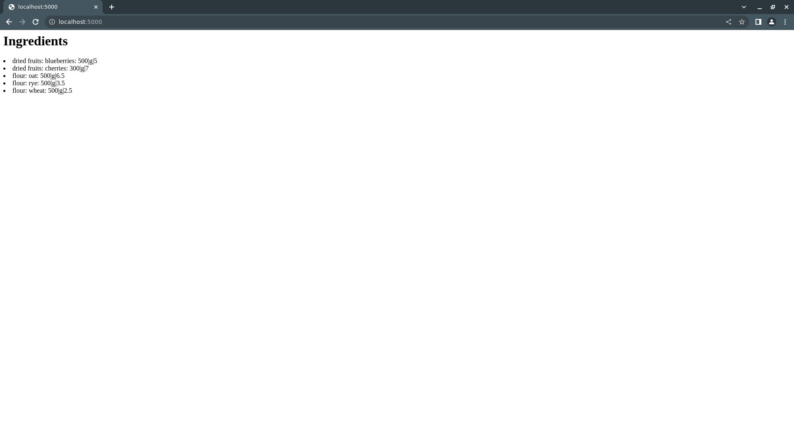

.. ###############################################################
.. #                                                             #
.. # Copyright (c) 2023 YottaDB LLC and/or its subsidiaries.#
.. # All rights reserved.                                        #
.. #                                                             #
.. #     This document contains the intellectual property        #
.. #     of its copyright holder(s), and is made available       #
.. #     under a license.  If you do not know the terms of       #
.. #     the license, please stop and do not read further.       #
.. #                                                             #
.. ###############################################################

=========================
Introduction to YDBPython
=========================
.. contents::
   :depth: 5

YDBPython is an Application Programming Interface (API) for accessing YottaDB with the Python programming language. It can be used to develop applications in a variety of domains, from the Web to the Internet of Things (IoT).

If you are unfamiliar with YottaDB or YDBPython, the following tutorials are for you. They will walk you through the very basics of developing with both YottaDB and YDBPython.

The first tutorial will show you how to:

1. Install and configure a YottaDB database
2. Install YDBPython and set up a simple development environment
3. Access YottaDB from the command line using the Python interpreter

The second tutorial will show you how to build a very simple web application using YDBPython.

.. _ydbpython-cli:

-------------------------------------
Using YDBPython from the command line
-------------------------------------

+++++++++++++++++++++++++++++
Install and configure YottaDB
+++++++++++++++++++++++++++++

To install YottaDB, you can follow the YottaDB `Get Started <https://yottadb.com/product/get-started>`_ guide.

Then create a new database and automatically setup the environment using the ``ydb_env_set`` source script:

.. code-block:: bash

   source $(pkg-config --variable=prefix yottadb)/ydb_env_set

Confirm YottaDB was installed correctly by checking its version:

.. code-block:: bash

    yottadb -version

You should see output similar to this:

.. code-block::

    YottaDB release:         r1.30
    Upstream base version:   GT.M V6.3-008
    Platform:                Linux x86_64
    Build date/time:         2020-08-11 20:55
    Build commit SHA:        177eb8e48098204dafe564cac2bcb84312b2853a

That's it! Now you have a fully-operational YottaDB installation and database. Next you'll install YDBPython and setup a Python development environment to test it out.

+++++++++++++++++
Install YDBPython
+++++++++++++++++

First, you'll install the prerequisite packages. Assuming you are on Debian or Ubuntu:

.. code-block:: bash

    # Debian/Ubuntu
    sudo apt install python3-dev python3-setuptools python3-venv libffi-dev
    # RHEL/Rocky Linux
    sudo yum install python3 python3-devel libffi-devel

Next, create a directory to use as a development environment:

.. code-block:: bash

    mkdir ydbpythonintro && cd ydbpythonintro

Then, create a Python virtual environment there and activate it:

.. code-block:: bash

    python3 -m venv .venv
    source .venv/bin/activate

Finally, install YDBPython:

.. code-block:: bash

    pip install yottadb

++++++++++++++++++++++++++++++++++++
Access YottaDB from the command line
++++++++++++++++++++++++++++++++++++

Now you're ready to start using YDBPython to access your new YottaDB database. To get started, start the Python interpreter:

.. code-block:: bash

    python3

Next, import the  ``yottadb`` module to make it accessible:

.. code-block:: python

    import yottadb

Then, store a few values in YottaDB using the ``set()`` function:

.. code-block:: python

    yottadb.set("^ingredients",("flour", "rye"), "500|g|3.5")
    yottadb.set("^ingredients",("flour", "wheat"), "500|g|2.5")
    yottadb.set("^ingredients",("flour", "oat"), "500|g|6.5")

Now, your YottaDB database has three nodes, each representing one ingredient of the category "flour". To retrieve these new nodes, you can loop over each ingredient name:

.. code-block:: python

    for ingredient_name in yottadb.subscripts("^ingredients",("flour", "")):
        print(yottadb.get("^ingredients",("flour", ingredient_name)).decode('utf-8'))

You should see the following output:

.. code-block::

    500|g|6.5
    500|g|3.5
    500|g|2.5

To make things a little more fancy, you can add a couple more entries to the database under a new ingredient category:

.. code-block:: python

    yottadb.set("^ingredients",("dried fruits", "cherries"), "300|g|7")
    yottadb.set("^ingredients",("dried fruits", "blueberries"), "500|g|5")

Now you can loop over the ingredient categories as well:

.. code-block:: python

    for ingredient_category in yottadb.subscripts("^ingredients",("",)):
        for ingredient_name in yottadb.subscripts("^ingredients",(ingredient_category, "")):
            details = yottadb.get("^ingredients",(ingredient_category, ingredient_name)).decode('utf-8')
            print(f"{ingredient_category.decode('utf-8')}: {ingredient_name.decode('utf-8')}: {details}")

You should see this output:

.. code-block::

    dried fruits: blueberries: 500|g|5
    dried fruits: cherries: 300|g|7
    flour: oat: 500|g|6.5
    flour: rye: 500|g|3.5
    flour: wheat: 500|g|2.5

Now you've got down the two most fundamental ways of accessing YottaDB: setting and getting. The next tutorial will show you how to use these fundamentals to build a very simple web application.

.. _ydbpython-webapp:

---------------------------------------
A simple web application with YDBPython
---------------------------------------

This tutorial will show you how to use YDBPython alongside the popular `Flask <https://flask.palletsprojects.com/en/2.3.x/>`_ Python web development framework to build a simple, single-page web application.

To get started, first create a new directory to host the application, and create a new Python virtual environment there:

.. code-block:: bash

    mkdir ydbpydemo
    cd ydbpydemo/
    python3 -m venv .venv
    source .venv/bin/activate

Then, install both Flask and YDBPython into the virtual environment:

.. code-block:: bash

    pip install flask yottadb

Next, open a new ``ydbpydemo.py`` file with your editor and add the following code to create a basic Flask application:

.. code-block:: python

    import yottadb
    from flask import Flask

    app = Flask(__name__)

    @app.route("/")
    def home():

        return "<h1>Ingredients</h1>"

You can then run this simple application with:

.. code-block:: bash

    flask --app ydbpydemo run

If you then direct your browser to ``localhost:5000``, you should see a page that says "Ingredients" at the top:

.. image:: images/ydbpython/YDBPython-Demo-Ingredients.jpg

Once you've got this working, run the following code from the previous tutorial in the Python interpreter if you haven't already:

.. code-block:: python

    yottadb.set("^ingredients",("flour", "rye"), "500|g|3.5")
    yottadb.set("^ingredients",("flour", "wheat"), "500|g|2.5")
    yottadb.set("^ingredients",("flour", "oat"), "500|g|6.5")
    yottadb.set("^ingredients",("dried fruits", "cherries"), "300|g|7")
    yottadb.set("^ingredients",("dried fruits", "blueberries"), "500|g|5")

This will add some data to the database for our application to retrieve. Alternatively, you could set the same nodes using a YottaDB ``Key`` object:

.. code-block:: python

    ingredients = yottadb.Key("^ingredients")
    ingredients["flour"]["rye"].value = "500|g|3.5"
    ingredients["flour"]["wheat"].value = "500|g|2.5"
    ingredients["flour"]["oat"].value = "500|g|6.5"
    ingredients["dried fruits"]["cherries"].value = "300|g|7"
    ingredients["dried fruits"]["blueberries"].value = "500|g|5"

Next, revise the ``home()`` function you just defined to look like this:

.. code-block:: python

    @app.route("/")
    def home():

        html = "<h1>Ingredients</h1><uo>"

        for ingredient_category in yottadb.subscripts("^ingredients", ("",)):
            for ingredient_name in yottadb.subscripts("^ingredients", (ingredient_category, "")):
                details = yottadb.get("^ingredients", (ingredient_category, ingredient_name)).decode('utf-8')
                html += (f"<li>{ingredient_category.decode('utf-8')}: {ingredient_name.decode('utf-8')}: {details}</li>")
        html += "</uo>"
        return html

Then, run the app again and return your browser to ``localhost:5000``. You should then see the "Ingredients" heading followed by a list of ingredient information derived from the database:

That's it! You've now got a very basic web application with YottaDB as the datastore and, hopefully, a idea of how YottaDB can be used for applications development.

