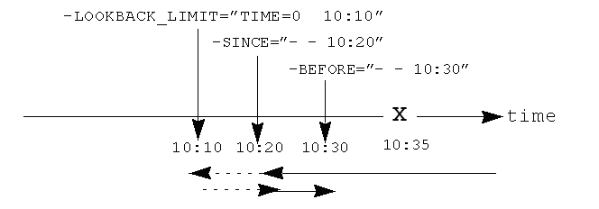
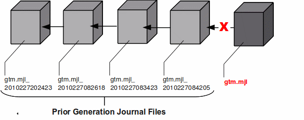

.. index::
   Journaling

===========================
6. YottaDB Journaling
===========================

.. contents::
   :depth: 2

----------------------
Introduction
----------------------

The four key properties of transaction processing systems, the so-called "ACID" properties are: Atomicity, Consistency, Isolation, and Durability. YottaDB transaction processing provides the first three by means of the TStart and TCommit commands and Durability through journaling.

YottaDB, like virtually all high performance databases, uses journaling (called "logging" by some databases) to restore data integrity and provide continuity of business after an unplanned event such as a system crash.

Note that journaling is not a substitute for good system configuration and design. For example, if a database and its journal files are on the same disk controller, a hardware failure on that controller can damage both files, and prevent recoverability. Journaling complements other techniques to build a robust system.

Journaling requires no M programming. However, the commands described later in this chapter may enhance the value of journaling. 

++++++++++++++
Journal Files
++++++++++++++

YottaDB journaling uses journal files to record information pertaining to database updates. A journal file has a default extension of mjl. If the new journal filename (the one specified in the FILENAME option or the default) already exists, YottaDB renames the existing journal file by appending a string that denotes the time of creation of the journal file in the form of "_YYYYJJJHHMMSS" where: 

YYYY           4-digit-year                                    such as 2018 
JJJ            3-digit-Julian-day (between 1 and 366)          such as 199 
HH             2-digit-hour in 24 hr format                    such as 14 
MM             2-digit minute                                  such as 40 
SS             2-digit seconds                                 such as 30

The following animation describes how YottaDB uses journal files to record information pertaining to database updates on gtm.dat (the default database file created by gtmprofile).

.. image:: dbupdate.gif

At any given time the database file (gtm.dat) has a single active journal file (gtm.mjl) with links to predecessor ("previous generation") journal files. The black arrow between the journal files demonstrate how a journal file is back-linked to its predecessor with a file name in the form of gtm.mjl_YYYYJJJHHMMSS to form a chain of journal files. When a switch of journal files occurs, either implicitly (for example, when AUTOSWITCHLIMIT is reached) or explicitly (for example, on a backup event or MUPIP SET -JOURNAL=ON), YottaDB renames the existing journal file with the timestamp of its last modification. YottaDB creates a new journal file with the name of the journal file for that database, and specifies the previous generation journal file name (after the rename), in the newly created journal file's header. YottaDB journaling provides mechanisms for durable recovery/extract from the journal files: replaying database updates to an active database, reverting the database state to a previous consistent state for when replication is in use, and so on. YottaDB automatically turns off journaling on encountering run-time conditions such as no available disk space or no authorization for a process attempting to auto-switch a journal file. In such a case, YottaDB also logs an appropriate message to the operator log to alert the operational staff. If YottaDB detects that the rename-logic yields a filename that already exists (a condition when journal files are switched in the same second), the string "_N[N[N[N...]]]" is appended to the renamed filename where "N[N[N...]]" denotes a sequence of numbers as follows:

0,1,2,3,4,5,6,7,8,9,90,91,92,93,94,95,96,97,98,99,990,991,...

YottaDB tries all numbers from the order in the above sequence until it finds a non-existing rename-filename. In the above illustration, if gtm.mjl_2010227 082618 is switched in the same second and gtm.mjl_2010227 082618_0 already exists, the renamed journal file would be gtm.mjl_2010227 082618_1. If the existing file renaming scheme or the default journal file naming scheme discussed above results in a filename longer than 255 characters (due to the suffix creation rules), YottaDB produces an error and turns off journaling.

.. note::
   In a very short time window just before switching a journal file, YottaDB creates a temporary file with an .mjl_new extension and attempts to write a few initialization journal records. After performing an initial verification, YottaDB renames the .mjl_new file to the current .mjl file. In rare cases, you might see an .mjl_new file if the journal file creation process was interrupted midway (possibly due to permission or disk space issues). If a subsequent MUPIP process detects an .mjl_new file and no .mjl file, it automatically deletes it and creates a new .mjl file.

There are two switches to turn on journaling - ENable / DISable and ON/OFF. Enabling or disabling journaling requires stand alone access to the database. Turning journaling on and off can be done when the database is in use. Note: Whenever YottaDB implicitly turns off journaling due to run-time conditions such as no available disk space or no authorization for a process attempting to auto-switch a journal file (and so on) , it produces an error with accompanying messages to alert operation staff. YottaDB on selected platforms can encrypt data in database and journal files. Encryption protects against unauthorized access to data by an unauthorized process which is able to access disk files, that is, encryption protects data at rest (DAR). Rather than build encryption into YottaDB, a plug-in architecture facilitates use of your preferred encryption software. For more information, refer to `Chapter 12: “Database Encryption” <https://docs.yottadb.com/AdminOpsGuide/encryption.html>`_.

++++++++++++++++++++++++++++++++++
Recovery from a Journal File
++++++++++++++++++++++++++++++++++

The following two procedures enable recovery of a database from a journal file:

* Forward Recovery (roll forward by applying )

* Backward Recovery (roll back to a checkpoint, optionally followed by a subsequent roll forward)

.. note::
   In a multi-site database replication configuration, you might use these recovery procedures to refresh a replicating instance from the backup of an originating instance. However, the steps for both these recovery procedures are different.

**Forward Recovery**

Forward recovery "replays" all database updates in forward direction until the specified point in the journal file. Forward recovery on a backup database starts from when the backup was taken and continues till the specified point in the journal files. Forward recovery on an empty database starts from the beginning of the journal files.

Suppose a system crash occurred at 08:50 hrs and a backup of the database was taken at 08:26 hrs. Using forward recovery, you can replay the database updates between 08:26 hrs to 8:50 hrs (in blue) on the backup copy of the database and restore the database to a state prior to the crash. In the process you can also identify unfinished or broken transactions that might have occurred at the time of the crash. In the following illustration, X denotes the crash time and the blue updates denote forward processing. 

.. image:: fwdrecov.gif

A command like mupip journal -recover -forward -before="--8:50" gtm.mjl performs this operation. From the current journal file, forward recovery moves back to the point where the begin transaction number of a journal file matches the current transaction number of the active database (the point when the backup was taken) and begins forward processing. Since a journal file is back-linked to its predecessor, YottaDB facilitates forward processing by activating temporary forward links between journal files that appear only during recovery. These forward links are temporary because they are expensive to maintain as new journal files are created. Note: Forward recovery, by design, begins from a journal file whose "Begin Transaction" matches the "Current Transaction" of the active database. This condition occurs only when a new journal file is created (switched) immediately after a backup. If a database is backed up with MUPIP BACKUP -NONEWJNLFILES (a backup option where journal files are not switched), forward recovery cannot find a journal file whose Begin Transaction matches the Current Transaction and therefore cannot proceed with forward recovery. Always use a backup option that switches a journal file or journal files explicitly after a backup. Also, once a database has been recovered using forward recovery, you can no longer use it for a future recovery unless you restore the database again from the backup.

**Backward Recovery**

Backward recovery restores a journaled database to a prior state. Backward processing starts by rolling back updates to a checkpoint (specified by -SINCE or -AFTER) prior to the desired state and replaying database updates forward till the desired state.

Backward Recovery uses "BEFORE_IMAGE" journaling. With BEFORE_IMAGE journaling, YottaDB captures the database updates, as well as "snapshots" of portions of the database immediately prior to the change caused by the update. Unlike forward recovery which works on a backup database, backward recovery works only on the production (current) database, provided it is usable and BEFORE_IMAGE journaling is enabled.

Suppose a system crash occurred at 10:35 hrs, a command like mupip journal recover backward -lookback_limit="TIME=0 10:10" -since="-- 10:20" -before="-- 10:30" performs backward recovery. The following illustration demonstrates how YottaDB performs a recovery after a system crash at 10:35. Backward recovery "un-does" the database updates backward to 10:20, then applies updates forward until the crash. By adding -BEFORE="- - 10:30" to the command, the recovery stops when forward processing encounters updates that originally occurred after 10:30. If the application includes ZTSTART and ZTCOMMIT commands to fence a group of transactions, backward processing may continue back prior to 10:10 searching to resolve fenced transactions that were incomplete at 10:20. 

-LOOKBACK_LIMIT controls the maximum amount of additional backward processing, in this case, 10 minutes. Note that the -SINCE time in this example is slightly exaggerated for the sake of the graphical representation. If the application includes TSTART and TCOMMIT commands to fence transactions, backward processing does not require LOOKBACK_LIMIT because TSTART/TCOMMIT transactions automatically resolve open transaction fences. So, in the above example, if the transactions are fenced with TSTART/TCOMMIT, backward recovery automatically increases the backward processing by 10 minutes. 

.. note::
   ZTSTART and ZTCOMMIT are deprecated in favor of TSTART and COMMIT. YottaDB no longer validates ZTSTART/ZTCOMMIT and -LOOPBACK_LIMIT (since it applies to ZTSTART/ZTCOMMIT). 

+++++++++++++++++++
rolled_bak* files
+++++++++++++++++++

YottaDB adds a prefix rolled_bak\_ to the journal file whose entire contents are eliminated (rolled back) by a backward recovery. YottaDB does not use these files after a successful recovery. Therefore, you might want to consider moving or deleting them. You should never use rolled_bak* files for any future database recovery. If there is a need to process rolled_bak* files, you should extract the journal records and process them using an M program. YottaDB recommends that you rename the roll back journal file immediately after a rollback if you want to save it, to prevent a subsequent rollback from overwriting it.

++++++++++++++++++++++++++++++++++++
 Journal Files Access Authorization
++++++++++++++++++++++++++++++++++++

YottaDB propagates access restrictions to the journal files, backup, and snapshot temporary files. Therefore, generally, journal files should have the same access authorization characteristics as their corresponding database files. In the rare case where database access is restricted but the owner is not a member of either the database group nor the group associated with the $gtm_dist directory, you should provide world read-write access to the journal files. As long as the operating system permits the access, YottaDB allows access to database files and journals in cases where the system has no user or group information available for the file. Such an unusual situation can arise, for example, when the user and group are provided via NIS, but if NIS is not currently operational the owner and group cannot be determined; or perhaps a user id is deleted while the YottaDB process is active.

++++++++++++++++++++++++++++++
 Triggers in Journal Files
++++++++++++++++++++++++++++++

YottaDB manages "trigger definitions" and "triggered updates" differently during journaling and replication. Trigger definitions appear in both journal files and replication streams so the definitions propagate to recovered and replicated databases. Triggered updates appear in the journal file, since MUPIP JOURNAL -RECOVER/-ROLLBACK does not invoke triggers. However, they do not appear in the replication stream since the Update Process on a replicating instance apply triggers and process their logic.

YottaDB implicitly wraps a trigger as an M transaction. Therefore, a journal extract file for a database that uses triggers always has Type 8 and 9 (TSTART/TCOMMIT) records even if the triggers perform no updates (that is, are effectively no-ops).

When journaling is ON, YottaDB generates journal records for database updates performed by trigger logic. For an explicit database update, a journal record specifies whether any triggers were invoked as part of that update. YottaDB triggers have no effect on the generation and use of before-image journal records, and the backward phase of rollback / recovery. A trigger associated with a global in a region that is journaled can perform updates in a region that is not journaled. However, if triggers in multiple regions update the same node in an unjournaled region concurrently, the replay order for recovery or rollback might differ from that of the original update and therefore produce a different result; therefore this practice requires careful analysis and implementation. Except when using triggers for debugging, YottaDB recommends journaling any region that uses triggers. If your database uses triggers, always ensure that unjournaled globals do not perform triggered updates in journaled globals and create procedures to handle trigger updates in the broken/lost transaction files. In broken/lost transaction files, you can identify these entries as + or - and appropriately deal with them using MUPIP TRIGGER and $ZTRIGGER().

+++++++++++++++++++++++++++
BEFORE_IMAGE_JOURNALING
+++++++++++++++++++++++++++

BEFORE_IMAGE is a form of Journaling that creates "mini-backups" preceding each database update. Backward Recovery uses these mini-backups to restore the database as far back in time then it replays the database updates."BEFORE_IMAGE" journaling requires more disk I/O and storage space than M-level (or NOBEFORE) journaling but delivers faster recovery times from system failures . 

.. note::
   As stated in the GDE chapter, the MM database access method bypasses the BG buffer pool and relies entirely on the operating/file system to manage traffic between memory and disk. Because with MM, YottaDB has no control over the timing of disk updates. Hence, BEFORE_IMAGE journaling is not an option with MM; attempts to use these two facilities together produce an error. 

++++++++++++++++++++++++++
NOBEFORE_IMAGE Journaling
++++++++++++++++++++++++++

"NOBEFORE_IMAGE" is a form of M-level Journaling that sequentially stores each database update in a journal file. A forward recovery operation restore the database by replaying these database updates."NOBEFORE_IMAGE" consumes less I/O bandwidth in normal use and helps obtain more throughput from the available servers. 

+++++++++++++++++++++++++++++++++++++++++++++++++
Choosing between BEFORE_IMAGE and NOBEFORE_IMAGE
+++++++++++++++++++++++++++++++++++++++++++++++++

The choice between BEFORE_IMAGE journaling and NOBEFORE_IMAGE journaling is important especially in a logical multi-site database replication deployment. If an application pushes the I/O bandwidth of the servers on which it runs, NOBEFORE_IMAGE journaling may help obtain more throughput from available servers. BEFORE_IMAGE journaling could be the likely choice if an application requires quicker recovery in the unlikely event of a crash. For a comprehensive discussion on the choosing the type of Journaling, refer to “Choosing between BEFORE_IMAGE and NOBEFORE_IMAGE journaling” in the  `"Implementing Replication and Recovery" section of the Database Replication chapter <https://docs.yottadb.com/AdminOpsGuide/dbrepl.html#implementing-replication-and-recovery>`.

+++++++++++++++++++++++++++++
Broken Transaction File
+++++++++++++++++++++++++++++

In the case of a catastrophic event, it is unlikely that YottaDB can properly complete writing all journal records to the file. YottaDB reports the unfinished records or incomplete fenced transactions as "broken transactions". YottaDB extracts broken transactions into a file called the broken transaction file.

+++++++++++++++++++++++
Lost Transaction File
+++++++++++++++++++++++

Any complete transaction that occurs after a broken transaction is a lost transaction. YottaDB does not play it into the database but extracts it as a lost transaction into a file called the lost transaction file.

All broken and lost transactions are made available as the result of a database recovery.

The operational procedures and the application tools should provide a means of recovering and reprocessing the information in the broken and lost transaction files after a recovery or rollback that places content in these files.

If there are no fences, repair any application-level integrity problems. In either case, MUPIP INTEG -FAST provides an excellent quick test of whether the database can support new updates with relative safety.

++++++++++++++++++++++++++
Journaling Benefits
++++++++++++++++++++++++++

It is important to understand the benefits of Journaling before you enable Journaling on your database. M database management ensures that multiple concurrent updates and retrievals of the same information (or information "close together" in ordered sequence) occur in a predictable and logical fashion. Sometimes a database manager may have to change multiple records, usually indices, as a result of a single update. Interrupting a process that is performing such a "multi-point" update violates a design assumption of the M implementation and also results in a malformed database. Under normal operation, the database logic handles interruptions by deferring their recognition until the update is complete. However, occurrences such as power failures or a KILL-9 can cause such interruptions. YottaDB Journaling helps maintain data integrity and continuity of business in the event of such interruptions.

Other benefits include (but not limited to): 

* Automatic replay of work to the last committed update recorded in a journal file. Note that with the use of transaction processing and journaling, YottaDB provides full ACID properties.

* Quick recovery options, such as processing only the information recorded immediately prior to failure. For example, you can recover just the last minute of work instead of replaying the entire journal file.

* Recorded database updates formatted appropriately for processing by an M program. For example, MUPIP JOURNAL -EXTRACT produces records specified by time, user, the process identification number, global variable, process name, and transaction type.

* Identification of processes active when the system failed. -SHOW identifies these processes, as well as what transactions were not completed, and other information about the database updates and processes contained in the journal file.

++++++++++++++++++++++++++
Backup Journal Files
++++++++++++++++++++++++++

YottaDB recommends separate backup schemes for database files and journal files. MUPIP BACKUP creates a backup copy of the database. You should backup journal files separately.

MUPIP BACKUP uses the -BKUPDBJNL and -NEWJNLFILES to interact with journal files. As stated in the `General Database Management chapter <https://docs.yottadb.com/AdminOpsGuide/dbmgmt.html>`_, BKUPDBJNL enables or turns off the journaling characteristics of the backup database and NEWJNLFILES sets the journaling characteristics of the database being backed up. The following illustration describes how MUPIP BACKUP -NEWJNLFILES=NOPREVLINK cuts the back link between the newly created journal file and the prior generation journal files. 

Since -NEWJNLFILES=NOPREVLINK cuts back link of the newly created journal file, any subsequent recovery or rollback will not be able to go back past this discontinuity.

.. note::
   When MUPIP SET changes the journal state from DISABLED or OFF to ON, YottaDB creates new journal files with no back-links which, like the above example, indicates a fresh start of journaling for the database.

+++++++++++++++++++++++++++++++++++++
Select Database Files for Journaling
+++++++++++++++++++++++++++++++++++++

You should journal any databases whose integrity you care about. Conversely, you need not journal any database that you are prepared to delete in the event of an untoward event like a system crash. 

YottaDB recommends considering the following aspects before you select database files for Journaling.

* *Always journal data that is worth preserving*: You can journal some or all database files. A quickly understood method of selecting database files for Journaling is as follows:

  * Do not journal any database that you are prepared to delete in the event of an untoward event like a system crash. Never journal temporary data.

  * Truly static data does not require journaling but produces no journal impact when held in journaled regions.

  * Move temporary information to separate database files that do not require journaling. If the globals contains process-local(temporary) information or possibly static information, move them to one or more separate database files and use other means (for example, MUPIP CREATE or MUPIP BACKUP) to manage the information in their region(s).

* *Weigh the deltas associated with manual re-entry and automatic re-play of transactions*: Most of the overhead costs associated with recovering from a failure usually derive from maintaining a state of preparedness for the manual recovery and the potential risk to the organization from damage to the information during the relatively infrequent and "abnormal" handling of a recovery. Therefore, always weigh the cost of reduced computer throughput or alternatively the additional hardware to support journaling with the same level of performance, against the reduced likelihood of a prolonged manual re-entry with its associated drawbacks.

* *Journal both frequently updated globals and infrequently updated globals*: You might journal only heavily updated globals. However, infrequently changed globals generate little additional load and may present significant control problems if not journaled, you might decide that these globals should also be journaled to maintain application integrity.

* *Separate the point of failure*: Always use different disks and different disk controllers (where possible) for the journal and the associated database files. 

+++++++++++++++++++++++++++++
Fencing Transactions
+++++++++++++++++++++++++++++

The programming practice of fencing logical transactions protects database integrity during a system interruption. A logical transaction is a logical unit that is not complete unless all parts of the transaction are captured. For instance, the logical transaction "transfer funds between accounts" consists of a debit update to one account and a credit update to another account.

Establishing fences around a logical transaction assures that the transaction is committed as a unit, thereby avoiding logical inconsistencies. These logical inconsistencies, sometimes referred to as application-level database integrity problems, manifest themselves as run-time errors, inappropriate branching, and incorrect reports.

The four ACID properties are Atomicity, Consistency, Isolation and Durability. YottaDB provides Durability with Journaling and Atomicity, Consistency, and Isolation with TSTART and TCOMMIT commands. The TSTART and TCOMMIT commands are replacements for the ZTSTART and ZTCOMMIT commands. The following table shows the benefits and drawbacks of each set of TSTART/TCOMMIT versus ZTSTART/ZTCOMMIT commands with their application transaction-fencing requirement.

+---------------------------------------------------------+----------------------------------------------------------------------+
| TSTART/TCOMMIT                                          | ZTSTART/ZTCOMMIT                                                     |
+=========================================================+======================================================================+
| Provide a transaction management facility that is fully | Provide journal enhancement to improve the quality of recoveries.    |
| ACID-compliant.                                         | With ZTSTART/ZTCOMMIT, programming logic, usually LOCK protocols,    |
|                                                         | must ensure Consistency and Isolation.                               |
+---------------------------------------------------------+----------------------------------------------------------------------+
| All updates stay private until the time of TCOMMIT.     | Atomicity is only ensured (within operationally set parameters)      |
| This ensures Atomicity.                                 | during journal recovery                                              |
+---------------------------------------------------------+----------------------------------------------------------------------+
| No cascading rollbacks                                  | A long-running transaction can trigger cascading rollbacks.          |
+---------------------------------------------------------+----------------------------------------------------------------------+
| TS[TART][:tvexpr] [([lvn...])|lvn|*|]|[:keyword|        | ZTS[TART][:tvexpr]                                                   |
| (keyword...)]                                           |                                                                      |
| \- TSTART can manage local variable state on restarts.  |                                                                      |
+---------------------------------------------------------+----------------------------------------------------------------------+
| Depth of "nested" transactions for TSTART and TCOMMIT   | Depth of "nested" transactions for ZTSTART and ZTCOMMIT is 25.       |
| is 127                                                  |                                                                      |
+---------------------------------------------------------+----------------------------------------------------------------------+

.. note::
   The term cascading roll-back describes the situation that occurs when dropping one transaction causes previous transactions to be sequentially dropped, until potentially all transactions are dropped. If an application violates this assumption, a JOURNAL -RECOVER may create a database with application-level integrity problems. M LOCKs ensure the isolation of a sequence of updates from interaction with any other updates. TSTART and TCOMMIT transaction fences implicitly exhibit the required isolation whether fences are used with or without associated LOCKs. 

For more information on TSTART/TCOMMIT, refer to the `"Commands" chapter of the Programmer's Guide <https://docs.yottadb.com/ProgrammersGuide/commands.html>`_ for more information. 

.. note::
   As stated in the beginning of this chapter, ZTSTART and TZTCOMMIT are deprecated in favor of TSTART and TCOMMIT. YottaDB no longer validates the ZTSTART and ZTCOMMIT functionality so you should always use TSTART and TCOMMIT to fence your transactions. 

++++++++++++++++++++++++++++++++
Deciding Whether to Use Fencing
++++++++++++++++++++++++++++++++

You might fence some, all, or no application programs. When you program with fences, it is possible to force a recovery to ignore the fences by using additional qualifiers to MUPIP JOURNAL -RECOVER. The following lists advantages and disadvantages for fencing transactions. 

**Fencing Advantages**

* Faster recovery

* Minimum risk recovery

* Databases recovered from journals that include fences do not require post-recovery checks and repairs for logical consistency

Note that TSTART/TCOMMIT pairs are the preferred method of fencing; see the sections on Transaction Processing in the `Programmer's Guide <https://docs.yottadb.com/ProgrammersGuide/index.html>`_ for addition benefits of this approach. 

**Fencing Disadvantages**

* Must be programmed into the M code

* If the application is already structured to minimize logical transaction breakage problems, inserting the fencing commands may be a largely mechanical task. In less structured applications, inserting fences immediately "inside" the M LOCKs associated with transactions may provide an excellent first approximation of proper fencing.

* Fencing adds some entries to the journal file(s)

* Fencing may duplicate methods of recovery already established to address these issues

* An application structured so that all information for each logical transaction is stored in a single global node (while other nodes hold only redundant information), permits rebuild programs to completely correct logical inconsistencies. With less restrictive designs, logical inconsistencies may be corrected manually or by using semi-automated techniques.

+++++++++++++++
VIEW Keywords
+++++++++++++++

YottaDB provides the JNLFLUSH and JNLWAIT keywords as arguments to the VIEW command. Normal operation does not require VIEW commands to control journaling. However, under special circumstances, such as debugging, VIEW commands with journal keywords allow an M program to ensure that YottaDB has transferred all its updates to the journal file(s).

VIEW "JNLFLUSH":region initiates a complete transfer of all buffered journal records for a given region from memory to the disk. Normally, the transfer of journal buffers to disk happens automatically. The transfer is triggered by room requirements to hold new journal records and/or the passage of time since the last update. VIEW "JNLFLUSH" (without a specified region) flushes all regions in the current Global Directory.

VIEW "JNLWAIT" causes to suspend process execution until all updates initiated by the process in all regions have been transferred to the journal file (on disk). Updates within M TRANSACTIONS typically behave as if they included an implicit VIEW "JNLWAIT" with their final TCOMMIT. TRANSACTIONS with a TRANSACTION ID="BATCH" or "BA" are exempted from the implicit "JNLWAIT". Normally, process execution for updates outside of M transactions continues asynchronously with the transfer of journal records to disk.

For more information on the VIEW command, refer to the `"Commands" chapter in the Programmer's Guide <https://docs.yottadb.com/ProgrammersGuide/commands.html>`_.

++++++++++++++++++++
$VIEW() Keywords
++++++++++++++++++++

YottaDB provides the JNLACTIVE, JNLFILE, REGION and JNLTRANSACTION keywords as arguments to the $VIEW function. Normal operation does not require $VIEW() to examine journaling status. However, under certain circumstances, such as during debugging of logical transaction design and implementation, $VIEW() may provide a useful tool.

$VIEW("JNLACTIVE", region) returns a zero (0) indicating journaling is disabled for the region, one (1) indicating journaling is enabled but OFF, or two (2) indicating journaling is enabled and ON for the named region.

$VIEW("JNLFILE", region) returns the journal file name. If no journal filename has been established it returns a null string. Otherwise it is a fully translated filename.

$VIEW("REGION", expr) where expr evaluates to a gvn, returns the name of the region associated with the named gvn. This parameter may be used in conjuction with the above two parameters (JNLACTIVE & JNLFILE), to get journaling status in a configuration-independent manner.

$VIEW("JNLTRANSACTION") returns the difference between the number of ZTSTARTs that have been issued and the number of ZTCOMMITs. If no fenced transaction is in progress, then a zero (0) is returned. This serves an analogous function to $TLEVEL for transactions that use TSTART and TCOMMIT.

For more information on $VIEW(), refer to the `"Functions" chapter in the Programmer's Guide <https://docs.yottadb.com/ProgrammersGuide/functions.html>`_.

---------------
SET
---------------

MUPIP SET is the primary utility used to establish and activate journaling (using the -JOURNAL) and replication (using the -REPLICATION).

When GDE creates a Global Directory, it stores either the explicitly specified journaling information, or the GDE default value (refer to “SET -JOURNAL Options ”) for any unspecified characteristics.

MUPIP CREATE copies existing journaling information from the Global Directory to the database file, establishing journaling characteristics for all GDE supported journal-options.

.. note::
   YottaDB applies journaling information in the Global Directory to a database file only when it is created. Thereafter use MUPIP, or under unusual circumstances DSE, to change journaling characteristics in database files. Be sure to use GDE to reflect current journaling needs so that the next time you use MUPIP CREATE you get the desired journaling characteristics.

DSE DUMP -FILEHEADER displays the current values for all established journaling characteristics.

This section provides a description of the MUPIP SET command with specific reference to the journaling related qualifiers. For information on the other MUPIP SET qualifiers, refer to `Chapter 5: “General Database Management” <https://docs.yottadb.com/AdminOpsGuide/dbmgmt.html>`_.

MUPIP SET -JOURNAL can change some database characteristics when journaling is active for a specific file or region(s). The first run of MUPIP SET -JOURNAL on an older database automatically changes the maximum/minimum journal settings to match those required by the current YottaDB version. MUPIP SET operates on database files, journal files, regions or replication state.

The format for the MUPIP SET command is:

.. parsed-literal::
   MUPIP SE[T] -qualifier... {-F[ILE] file-name|-JN[LFILE journal-file|-REG[ION] region-list}

The file-specification, journal file specification or region-list identifies the target of the SET. Region-names separated by commas (,) make up a region-list.

To establish journaling characteristics, use the MUPIP SET command with the -[NO]JOURNAL[=journal-option-list] qualifier and one of the following SET object identifying qualifiers:

.. parsed-literal::
   -F[ILE]
   -JN[LFILE]
   -R[EGION]

-FILE and -REGION act together with one or more of the SET action qualifiers:

.. parsed-literal::
   -[NO]JOURNAL[=journal-option-list] -REPLICATION=<replication-option>'

+++++++++++++++++++++++++++++++++
SET Object Identifying Qualifiers
+++++++++++++++++++++++++++++++++

The following qualifiers identify the journaling targets:

.. parsed-literal::
   -F[ILE] 

Specifies that the argument to the SET is a file-specification for a single database file. A journal file's name can include characters in Unicode.

Old journal files stay open for about 10 seconds after a switch to a new journal file.

.. parsed-literal::
   -R[EGION] 

Specifies that the argument to the SET is a list of one or more region-names, possibly including wildcards, which, through the mapping of the current Global Directory, identifies a set of database files. SET -REGION modifies multiple files when the parameter contains more than one name.

The -REGION qualifier is incompatible with the -FILE and -JNLFILE qualifiers.

.. parsed-literal::
   -JN[LFILE] 

Specifies that the target for SET is a journal file. The format of the JNLFILE qualifier is:

-jnlfile jnl_file [-[no]prevjnlfile[=jnlfilename]] [-bypass] [-repl_state={on|off}] [-dbfilename=file_name]

jnl_file specifies the name of the target journal file.

**-bypass**

Override the requirement that database files (or their corresponding journal files) affected by the set command be available standalone.

.. note::
   Changing the previous generation file link when a rollback operation is in progress or when the Source Server is actively replicating, can damage the journal file and hamper recoverability.

**-dbfilename=file_name**

Associates a journal file with a different database file; this command may be useful in arranging unusual RECOVER or ROLLBACK scenarios.

**-prevjnlfile=jnlfilename**

Changes the name of the previous generation of the journal file in the header of jnl_file to jnlfilename (for example, when moving the previous generation journal file to a different location). The file name can be a full path-name or a relative path name; however, before the file-name is stored in the header, it is expanded to its full path-name.

**-noprevjnlfile**

Cuts the generation link of the journal file jnl_file. The name of the previous generation journal file is nullified in the header of jnl_file. Such an operation is appropriate when it is assured that there will never be a reason for a rollback to the previous generation journal file.

**-repl_state={on|off}**

Change the replication state of a journal file; this command is intended for use only under instructions from your YottaDB support provider.

++++++++++++++++++++++
SET Action Qualifiers
++++++++++++++++++++++

The -JOURNAL and -REPLICATION qualifiers are the only SET qualifiers relevant for journaling. For information on the other MUPIP SET qualifiers, refer to `Chapter 5: “General Database Management” <https://docs.yottadb.com/AdminOpsGuide/dbmgmt.html>`_.

-[NO]J[OURNAL][=journal-option-list]

Enables or disables journaling for the specified database file or region(s). MUPIP SET commands with this qualifier also establish the characteristics for journal files. YottaDB believes the defaults and the minimum for journal file characteristics are in line with current hardware capabilities and suitable for a production environment.

The journal-option-list contains keywords separated with commas (,) enclosed in double quotes "". These double quotes are optional when the list contains only one keyword. This option list is a super set of the journal-option-list available through GDE.

* -NOJOURNAL specifies that the database does not allow journaling, or disables journaling for a database that currently has it enabled. It is equivalent to -JOURNAL=DISABLE.

* -NOJOURNAL does not accept an argument assignment. It does not create new journal files. When a database has been SET -NOJOURNAL, it appears to have no journaling file name or other characteristics.

* -JOURNAL= enables journaling for a database file. -JOURNAL= takes one or more arguments in a journal-option-list. As long as journaling is ENABLED and turned ON at the end of the command, SET -JOURNAL= always creates a new version of the specified journal file(s).

* -NOJOURNAL specifies that the database does not allow journaling, or disable journaling for a database where journaling is active.

* Enable BEFORE_IMAGE or NOBEFORE_IMAGE journaling for a database file.

* As long as journaling is ENABLED and turned ON at the end of the command, SET -JOURNAL= always creates a new version of the specified journal file(s).

* Every MUPIP SET -JOURNAL command on a database file that specifies an ON or OFF journal-activation option causes the values of all explicitly specified journal-file-options to be stored in the database overriding any previously established characteristics for those options.

* If you specify both -JOURNAL and -NOJOURNAL in the same command line, the latter takes effect.

* Whenever MUPIP SET creates a new journal file, it uses all values for journal-file-options that the user explicitly specifies in the command line for the new journal file. If you do not specify a journal-file-option, MUPIP SET takes the characteristics of the existing journal file.

* MUPIP SET supports qualifiers (like -ACCESS_METHOD, and so on) to change non-journaling characteristics of database file(s). If you specify these qualifiers -JOURNAL , MUPIP SET modifies the non-journaling characteristics first and then moves on to modify the journaling characteristics. Command execution stops when it encounters an error. If MUPIP SET encounters an error in processing the command line or the non-journaling characteristics, it makes no changes to any characteristics. However, if MUPIP SET encounters an error in processing the journaling characteristics, the non-journaling characteristics have already been successfully changed.

* -NOJOURNAL is equivalent to -JOURNAL=DISABLE.

* -NOJOURNAL does not accept an argument assignment. It does not create new journal files. When a database has been SET -NOJOURNAL, it appears to have no journaling file name or other characteristics.

For details on the journal-option-list refer to “SET -JOURNAL Options ”.

-REPLI[CATION]=replication-option

-REPLICATION sets journal characteristics and changes the replication state simultaneously. It can also be used with the -JOURNAL qualifier. If journaling is ENABLED and turned ON, SET -REPLICATION=ON creates new set of journal files, cuts the back-link to the prior generation journal files, and turns replication ON. 

**SET -JOURNAL OPTIONS**

**ALI[GNSIZE]=blocks**

* Specifies the number of 512-byte-blocks in the ALIGNSIZE of the journal file.

* If the ALIGNSIZE is not a perfect power of 2, YottaDB rounds it up to the nearest power of 2.

* The default and minimum ALIGNSIZE value is 4096 blocks. The maximum value is 4194304 (=2 GigaBytes).

* A journal file consists of a sequential stream of journal records each of varying size. It is typically not easy to detect the beginning of the last valid journal record in an abnormally terminated journal file (for example, system crash). To facilitate journal recovery in the event of a system crash, the YottaDB run-time system ensures that offsets in the journal file at multiples of ALIGNSIZE (except at offset 0 which houses the journal file header) always have a valid journal record. In order to ensure this, the YottaDB run-time system, as needed, writes padding data in the form of ALIGN journal records just before the ALIGNSIZE boundary. These ALIGN records also help in skipping past invalid records in the middle of a journal file allowing MUPIP JOURNAL -EXTRACT -FORWARD -FULL to extract as much data from a corrupt journal file as possible.

* While a larger align size trades off crash recovery time in favor of increased journaling throughput, especially when before image journaling is in use, there is marginal value in using an align size larger than a few MB.

* The minimum ALIGNSIZE supported is always be greater than or equal to the maximum journal record size, which in turn depends on the maximum database block size.

* Note that a large value of ALIGNSIZE implies infrequent boundaries for recovery to use, and hence slows backward recovery down so drastically that, for example, the maximum value of 4194304 causes backward recovery (in case of a crash) to take as much time as forward recovery using the same journal file(s). 

**ALL[OCATION]=blocks**

Sets the allocation size of the journal file. YottaDB uses this information to determine when it should first review the disk space available for the journal file. The size of the journal file at creation time is a constant (depending on the YottaDB version) but once the journal file reaches the size specified by ALLOCATION, every extension produces a check of free space available on the device used for the journal file.

YottaDB issues informational messages to the system log whenever the free space available is not much more than the extension size. YottaDB provides these extension checks as an operational aid for identifying, before space runs out, that a file system holding the journal file is low on space. When there is no more free space available on the file system holding a journal file, YottaDB shuts off journaling for the corresponding database file.

The default ALLOCATION value is 2048 blocks. The minimum value allowed is 2048. The maximum value is 8,388,607 (4GB-512 bytes, the maximum journal file size).

**AU[TOSWITCHLIMIT]=blocks**

Specifies the limit on the size of a journal file. When the journal file size reaches the limit, YottaDB automatically performs an implicit online switch to a new journal file.

.. note::
   It is possible to set the AUTOSWITCHLIMIT to a value higher than the maximum file size (in blocks) for the file system. Currently YottaDB does not attempt to check for this condition at specification time. YottaDB produces a run-time error when a journal file reaches the maximum size for the file system. Therefore, ensure that the AUTOSWITCHLIMIT never exceeds the file-system limit.

The default value for AUTOSWITCHLIMIT is 8386560 & the maximum value is 8388607 blocks (4GB-512 bytes). The minimum value for AUTOSWITCHLIMIT is 16384. If the difference between the AUTOSWITCHLIMIT and the allocation value is not a multiple of the extension value, YottaDB rounds-down the value to make it a multiple of the extension value and displays an informational message. YottaDB produces an error when the rounded value of AUTOSWITCHLIMIT is less that the minimum value.

If you specify values for ALLOCATION, EXTENSION, and AUTOSWITCHLIMIT for a region such that (ALLOCATION+EXTENSION>AUTOSWITCHLIMIT), either using GDE or MUPIP SET -JOURNAL, YottaDB sets ALLOCATION to match the AUTOSWITCHLIMIT, and produces a JNLALLOCGROW message.

At journal extension time, including journal autoswitch time, if (ALLOCATION+EXTENSION>AUTOSWITCHLIMIT) for a region, YottaDB uses the larger of EXTENSION and AUTOSWITCHLIMIT as the increment to warn of low available journal disk space. Otherwise, it uses EXTENSION.

**[NO]BEFORE_IMAGES**

Controls whether the journal should capture BEFORE_IMAGES of GDS blocks that an update is about to modify. A SET -JOURNAL=ON must include either BEFORE_IMAGES or NOBEFORE_IMAGES in the accompanying journal-option-list.

If you specify both NOBEFORE_IMAGES and BEFORE_IMAGES in the same journal-option-list, the last specification overrides any previous one(s).

As YottaDB creates new journal files only with the ON option and every ON specification must include either BEFORE_IMAGES or NOBEFORE_IMAGES. If the user specifies [NO]BEFORE_IMAGES along with the OFF option serve no purpose.

Although it is possible to perform an online switch of a database from (or to) NOBEFORE-IMAGE journaling to (or from) BEFORE-IMAGE journaling, it is important to understand that backward recovery can never succeed if it encounters even one in a set of journal files for a database without BEFORE-IMAGES.

**BU[FFER_SIZE]=blocks**

Specifies the amount of memory used to buffer journal file output.

MUPIP requires standalone access to the database to modify BUFFER_SIZE. Therefore, YottaDB restricts the use of the BUFFER_SIZE option to change the current journal-buffer-size as part of an online switch of the journal files.

The default value is 2312 blocks. The minimum BUFFER_SIZE is 2307 blocks. The maximum BUFFER_SIZE is 32K blocks which means that the maximum buffer you can set for your journal file output is 16MB.

**DISABLE**

Equivalent to the -NOJOURNAL qualifier of MUPIP SET. It specifies that journaling is not an option for the region or file named. If the user specifies DISABLE, then MUPIP SET ignores all other options in the journal-option-list.

**ENABLE**

Makes the database file or region available for journaling. By default, ENABLE turns journaling ON unless OFF is specified in the same option list. A command that includes ENABLE must also specify BEFORE_IMAGES or NOBEFORE_IMAGES.

**EP[OCH_INTERVAL]=seconds**

seconds specifies the elapsed time interval between two successive EPOCHs. An EPOCH is a checkpoint, at which all updates to a database file are committed to disk. All journal files contain epoch records.

A smaller EPOCH_INTERVAL reduces the time to recover after a crash at the cost of increased I/O load on the run-time system (due to more frequent checkpoints). A larger EPOCH_INTERVAL has the opposite effect. Therefore, set EPOCH=interval for a more efficient run-time with larger values of interval and more efficient -ROLLBACK processing with smaller values of interval.

The default EPOCH_INTERVAL value is 300 seconds (5 minutes). The minimum value is 1 second. The maximum value is 32,767 (one less than 32K) seconds, or approximately 9.1 hours. If you enable journaling and do not specify a value for EPOCH_INTERVAL, YottaDB inherits the value of EPOCH_INTERVAL of the last journal file in that region. EPOCH_INTERVAL only makes takes effect when the user turns journaling ON and there is no earlier journal file.

**EX[TENSION]=blocks**

blocks specifies the size of the journal file extension by which file expands and becomes full.

EXTENSION=blocks specifies when YottaDB should review disk space available for the journal file after the ALLOCATION has been used up. It also specifies how much space should be available at each review.

As UNIX file systems use lazy allocation schemes, allocation and extension values do not result in physical disk block allocation for the journal file.

The values determine when YottaDB checks the file systems to see if it has enough space to hold an extension worth of journal data. When a journal file reaches the size of ALLOCATION and any multiple of EXTENSION, YottaDB checks the file system for room, and if the available space is less than three times the EXTENSION, it writes warnings to the operator log. YottaDB provides these extension checks as an operational aid for identifying, before space runs out, that a file system holding the journal file is low on space. When there is no more free space available on the file system holding a journal file or when there is no authorization of a process attempting to autoswitch a journal file, YottaDB shuts off journaling for the corresponding database file.

The default EXTENSION value is 2048 blocks. The minimum EXTENSION is zero (0) blocks and the maximum is 1073741823 (one less than 1 giga) blocks.

**F[ILENAME]=journal_filename**

journal_filename specifies the name of the journal file. FILENAME is incompatible with SET -REGION, if you specify more than one region.

YottaDB treats the filename as having two components - basename and extension. The format of the journal filename is basename.extension, where extension does not contain any periods (.), but if the filename contains more than one period (.), basename contains all but the last period (.). Also note that "extension" is the empty string ("") if the filename does not contain any periods (.).

The convention of the default value for the FILENAME is as follows:

* YottaDB takes the basename of the database filename as the basename for the journal file with an extension of mjl if the database has a dat extension. For example, database name mumps.dat results in a default name mumps.mjl. If the database filename does not have a dat extension, YottaDB replaces all occurrences of periods (.) with underscores (_) with an extension of mjl and takes the full database filename. For example, database name mumps.acn results in a default name mumps_acn.mjl. Therefore, by default, a journal file has an extension of mjl unless you explicitly specify a different extension with the FILENAME journal option. If the new journal filename (the one specified in the FILENAME option or the default) already exists, YottaDB renames the existing file with the string "_YYYYJJJHHMMSS" appended to the existing file extension where the string denotes the time of creation of the existing journal file in the following format:

 .. parsed-literal::
    YYYY      4-digit-year                              such as 2011 
    JJ       3-digit-Julian-day (between 1 and 366)     such as 199 
    HH       2-digit-hour in 24 hr format               such as 14 
    MM       2-digit minute                             such as 40 
    SS       2-digit seconds                            such as 30

Assuming the above example for the string value, YottaDB renames a journal file mumps.mjl to mumps.mjl_2018199144030 when it switches to a new journal file.

* If YottaDB detects that the rename-logic yields a filename that already exists, the string "_N[N[N[N...]]]" is appended to the renamed filename where "N[N[N...]]" denotes the sequence of numbers 0,1,2,3,4,5,6,7,8,9,90,91,92,93,94,95,96,97,98,99,990,991,....YottaDB tries all numbers from the order in the above sequence until it finds a non-existing rename-filename.

  Taking the same example as above, in case mumps.mjl_2010199144030 and mumps.mjl_2010119144030_0 already exists, the rename string would be mumps.mjl_2010199144030_1.

* If the existing file renaming scheme or the default journal file naming scheme discussed above results in a filename longer than 255 characters (due to the suffix creation rules), YottaDB produces an error and turns off journaling. 

A journal file name can include characters in Unicode.

.. note::
   Whenever YottaDB implicitly turns off journaling due to run-time conditions such as no available disk space or no authorization for a process attempting to auto-switch a journal file (and so on) , it produces an error and accompanying messages identify the reason for that condition.

For journal recovery, YottaDB maintains a field in every journal file's header that stores the name of the previous generation journal file for the same database file. When a MUPIP SET changes the journal state from DISABLED or OFF to ON, YottaDB creates new journal files with no previous generation journal file name. This indicates that this is a fresh start of journaling for the particular database. When journaling is already ON, and YottaDB is implicitly (due to AUTOSWITCHLIMIT being reached) or explicitly (due to MUPIP SET -JOURNAL) required to create new journal files, YottaDB maintains the previous generation journal filename (after any appropriate rename), in the new journal file's header.

In all cases where journaling is ON both before and after a journal file switch, YottaDB maintains the previous generation journal file name in the new journal file's header except when YottaDB creates a new journal file due to an implicit switch because it detects an abnormal termination of the current journal file or if the current journal file was not properly closed due to a system crash and the database was the subject of a MUPIP RUNDOWN afterwards. 

.. note::
   In the event of a crash, YottaDB strongly recommends performing a MUPIP JOURNAL -ROLLBACK on a database with replication, MUPIP JOURNAL -RECOVER on a journaled database, and MUPIP RUNDOWN only if using neither journaling nor replication. YottaDB error messages provide context-specific instructions to promote this decision-making model which helps protect and recover data after a crash.

The previous generation journal filename is a back link from the current generation journal.

YottaDB produces an error and makes no change to the journaling state of the database when the FILENAME is an existing file and is not the active journal file for that database. In this way, YottaDB prevents possible cycles in the back-links (such as, a3.mjl has a back-link to a2.mjl which in turn has a back-link to a1.mjl which in turn has a back-link to a3.mjl thereby creating a cycle). Cycles could prevent journal recovery. Also, note that cycles in back-links are possible only due to explicit FILENAME specifications and never due to an existing FILENAME characteristics from the database or by using the default FILENAME.

**NOPREVJNLFILE**

Eliminates the back link of a journal file.

**[NO]S[YNC_IO]**

Directs YottaDB to open the journal file with certain additional IO flags (the exact set of flags varies by the platform where SYNC_IO is supported, for example on Linux you might utilize the O_DIRECT flag). Under normal operation, data is written to but not read from the journal files. Therefore, depending on your actual workload and your computer system, you may see better throughput by using the SYNC_IO journal option.

You should empirically determine the effect of this option, because there is no way to predict the performance gain or impact in advance. There is no functional difference in YottaDB behavior with the use of SYNC_IO. If you determine that different workloads perform best with a different setting of SYNC_IO, you can change it with MUPIP SET at any time.

The default is NOSYNC_IO. If you specify both NOSYNC_IO and SYNC_IO in the same journal-option-list, YottaDB uses the last occurrence.

**OFF**

Stops recording subsequent database updates in the journal file. Specify OFF to establish journaling characteristics without creating a journal file or starting journaling.

The default for SET -JOURNAL= is ON.

**ON**

Records subsequent database updates in that journal file. MUPIP SET -JOURNAL=ON must include either BEFORE_IMAGES or NOBEFORE_IMAGES in the accompanying journal-option-list. By default YottaDB sets journal operation to BEFORE_IMAGE if this command changes the database replication state (refer to `Chapter 7: “Database Replication” <https://docs.yottadb.com/AdminOpsGuide/dbrepl.html>`_ for more information) from OFF to ON and JOURNAL=NOBEFORE_IMAGE is not specified.

.. note::
   The ON keyword works only on previously ENABLEd regions. YottaDB ignores ON if Journaling is DISABLEd. In other words, an ENable / DISable is like the power switch on the back of many television sets and ON/OFF is like the ON/OFF on the remote control. The ON/OFF on the remote control works only when the power switch on the back of the television set is enabled.

If the current generation journal file is damaged/missing, MUPIP SET -JOURNAL=ON implicitly turns off journaling for the specified region, creates a new journal file with no back pointers to the prior generation journal file, and turns journaling back on. Further, if replication is enabled, MUPIP SET -JOURNAL=ON temporarily switches the replication WAS_ON state in the time window when MUPIP SET command turns off journaling and returns normal as long as it operates out of the journal pool buffer and doesn't need to reference the damaged journal file(s). During this operation, MUPIP SET -JOURNAL=ON also sends the PREJNLLINKCUT message for the region to the application and the operator log. While this operation ensures that journaling continues even if the current generation journal file is damaged/missing, creating a new journal file with no back pointers creates a discontinuity with the previous journal files. Therefore, YottaDB recommends taking a database backup at the earliest convenience because a MUPIP RECOVER/ROLLBACK will not be able to go back past this discontinuity. Also, consider switching the journal files on all regions in the instance (with REGION "*") to ensure the RECOVER/ROLLBACK for other regions remains unaffected.

The default for SET -JOURNAL= is ON. 

**Y[IELD_LIMIT]=yieldcount**

yieldcount specifies the number of times a process that tries to flush journal buffer contents to disk yields its timeslice and waits for additional journal buffer content to be filled-in by concurrently active processes, before initiating a less than optimal I/O operation.

A smaller YIELD_LIMIT is appropriate for light load conditions while larger values are appropriate as the load increases.

.. note::
   A small YIELD_LIMIT may cause performance loss due to partial page writes while a large YIELD_LIMIT may cause performance loss due to significant idle times (due to a lot of yields).

The minimum YIELD_LIMIT is zero (0), the maximum YIELD_LIMIT is 2048 and the default YIELD_LIMIT is 8.

As the disk can only write entire blocks of data, many I/O subsystems perform a READ-MODIFY-WRITE operation when data to be written is a partial block as opposed to simple writes for an entire block. The YIELD_LIMIT qualifier tries to reduce the frequency of sub-optimal partial block writes by deferring such writes as much as possible in the hope that in the meantime the journal buffer accumulates more content and qualifies for an optimal entire block write. 

++++++++++++++++++++++++++++++++++++
Examples for MUPIP SET
++++++++++++++++++++++++++++++++++++

.. parsed-literal::
   $ mupip set -journal="enable,nobefore" -file mumps.dat

This example enables NOBEFORE_IMAGE journaling on mumps.dat. If journaling is already enabled, this command switches the current journal file.

Example:

.. parsed-literal::
   $ mupip set -journal=on,enable,before -region "*"

This example turn on journaling with BEFORE_IMAGE journaling. If journaling is already enabled, this command switches the current journal file for all regions. 

.. parsed-literal::
   $ mupip set -file -journal="nobefore,buff=2307" ydb.dat

This example initiates NOBEFORE_IMAGE journaling for the database file ydb.dat with a journal buffer size of 2307 blocks. It also switches to new journal file. This command assumes that some prior MUPIP SET -JOURNAL specified ENABLE for ydb.dat.

Example:

.. parsed-literal::
   $ mupip set -region -journal=enable,before_images,allocation=50000,ext=5000 "*"

This example enables journaling with BEFORE_IMAGES on all regions of the current Global Directory and gives each journal file an ALLOCATION of 50000 blocks and an EXTENSION of 5000 blocks. If the regions have significantly different levels of update, use several MUPIP SET -FILE or -REGION commands.

Example:

.. parsed-literal::
   $ mupip set -region -journal="enable,before" areg,breg

This example declares journaling active with BEFORE_IMAGES for the regions areg and breg of the current Global Directory.

.. parsed-literal::
   $ mupip set -file -nojournal mumps.dat

This example disables journaling on the database file mumps.dat.

Example:

.. parsed-literal::
   $ mupip set -journal="ENABLE,BEFORE_IMAGES" -region "AREG"
   $ mupip set -journal="ON,BEFORE_IMAGES" -region "*"

This example turns on journaling only for the region AREG. Note that AREG is the only region that is "available" for journaling.

Example:

.. parsed-literal::
   $ mupip set -access_method=MM -file ydb.dat

This example sets MM (Memory Mapped) as the access method or the YottaDB buffering strategy for storing and retrieving data from the database file ydb.dat. Since MM is not supported with BEFORE_IMAGE journaling, this example produces an error on a database with BEFORE_IMAGE journaling enabled. You can also use -access_method=BG to set BG (Buffered Global) as your buffering strategy. For more information on the implications of these access methods, refer to `“Segment Qualifiers” <https://docs.yottadb.com/AdminOpsGuide/gde.html#segment-qualifiers>`_.

Example:

.. parsed-literal::
   $ mupip set -journal=before,noprevjnlfile,file=newmumps.mjl -file mumps.dat

The above command cuts the back link of the newly created journal file newmumps.mjl.

--------------------------------
JOURNAL
--------------------------------

MUPIP JOURNAL command analyzes, extracts from, reports on, and recovers journal files. The format for the MUPIP JOURNAL command is: 

.. parsed-literal::
   MUPIP J[OURNAL] -qualifier[...] file-selection-argument

file-selection-argument is a comma-separated list of journal files.

-qualifier [...] is a combination of Action, Direction, Time, Sequence Number, Control, and Selection qualifiers that perform various MUPIP JOURNAL operations. To create any MUPIP JOURNAL command, select an appropriate combination of qualifiers by moving horizontally from the Action column extending to the Selection column: 

+---------------------------------+-------------+---------------------------------+------------------------------------+-----------------------------------------+-------------------------------------+
| Action                          | Direction   | Time (optional)                 | Sequence Number (optional)         | Control (optional)                      | Selection (optional)                |
+=================================+=============+=================================+====================================+=========================================+=====================================+
| One or more                     | Only One    | One or more                     | Only One                           | One or more                             | One or more                         |
+---------------------------------+-------------+---------------------------------+------------------------------------+-----------------------------------------+-------------------------------------+
| * -EXTRACT[=file specification] | * -BACKWARD | * -AFTER=time                   | * -FETCH_RESYNC=port-number        | * -[NO]APPLY_AFTER_IMAGE                | * -GLOBAL=global-list               |
| * -RECOVER                      | * -FORWARD  | * -BEFORE=time                  | * -RESYNC=jnlsequence-number       | * -BROKENTRANS=extract file name        | * -ID=pid-list                      |
| * -ROLLBACK                     |             | * -[NO]LOOKBACK_TIME[=lookback  |                                    | * -[NO]CHAIN                            | * -TRANSACTION=transaction-type     |
| * -SHOW[=show-option-list]      |             |    option list]                 |                                    | * -[NO]CHECKTN                          | * -USER=user-list                   |
| * -[NO]VERIFY                   |             | * -SINCE=time                   |                                    | * -[NO]ERRORLIMIT[=integer]             |                                     |
|                                 |             |                                 |                                    | * -FENCES=fence option                  |                                     |
|                                 |             |                                 |                                    | * -FULL                                 |                                     |
|                                 |             |                                 |                                    | * -[NO]INTERACTIVE                      |                                     |
|                                 |             |                                 |                                    | * -LOSTTRANS=extract-file-name          |                                     |
|                                 |             |                                 |                                    | * -REDIRECT=file pair list              |                                     |
|                                 |             |                                 |                                    | * -VERBOSE                              |                                     |
|                                 |             |                                 |                                    | * -DETAIL                               |                                     |
+---------------------------------+-------------+---------------------------------+------------------------------------+-----------------------------------------+-------------------------------------+

Also ensure that you adhere to the following rules: 

1. -AFTER is incompatible with -RECOVER or -ROLLBACK; that is -AFTER requires -FORWARD, and only applies to action qualifiers: -EXTRACT, -SHOW, and -VERIFY.

2. -APPLY_AFTER_IMAGE is compatible only with -RECOVER, or -ROLLBACK.

3. -BACKWARD is incompatible with -FORWARD, -AFTER, -CHECKTN, -NOCHAIN, and -REDIRECT.

4. -BROKENTRANS is compatible only with -RECOVER, -ROLLBACK, or -EXTRACT.

5. -CHAIN is only compatible with -FORWARD.

6. -CHECKTN is incompatible with -BACKWARD.

7. -DETAIL is compatible only with -EXTRACT.

8. -FETCHRESYNC is only compatible with the -ROLLBACK action in the -FORWARD direction and is incompatible with RESYNC.

9. -FORWARD is incompatible with -BACKWARD, -FETCHRESYNC, -LOOKBACK_LIMIT, -ONLINE and -SINCE.

10. -FULL is compatible only with -EXTRACT, -SHOW, or -VERIFY.

11. -LOSTTRANS is compatible only with -RECOVER, -ROLLBACK, or -EXTRACT.

12. -REDIRECT is compatible only with -BACKWARD and -RECOVER.

13. -RESYNC is only compatible with the -ROLLBACK action and incompatible with FETCHRESYNC.

14. -ROLLBACK is incompatible with -RECOVER, -CHAIN, -CHECKTN, -REDIRECT, time qualifiers of -SHOW except -BEFORE.

15. -SINCE is incompatible with -FORWARD.

16. -TRANSACTION is compatible only with -EXTRACT and -SHOW.

17. -USER is compatible only with -EXTRACT and -SHOW.

18. file list must not be asterisk (*) for -REDIRECT.

19. file list must be asterisk (*) for -BACKWARD -ROLLBACK; -ROLLBACK -FORWARD accepts a list of journal file names.

20. Journal selection qualifiers are incompatible with -RECOVER, -ROLLBACK, and -VERIFY.

21. If -BEFORE (time-based) and -FETCHRESYNC/-RESYNC (sequence-number-based) are specified in the same MUPIP JOURNAL -ROLLBACK command, the qualifier that corresponds to an earlier database state or point in time prevails. For example, -BEFORE prevails when the update corresponding to the sequence number obtained through the -FETCHRESYNC command happened at a later time relative to the -BEFORE qualifier and vice versa.

22. -FETCHRESYNC, -ONLINE, and -RSYNC_STRM qualifiers are not compatible with -ROLLBACK -FORWARD.

For example, MUPIP JOURNAL -EXTRACT=ydb.mjf -FORWARD -DETAIL is a valid command which performs forward processing to extract detailed the journal records to ydb.mjf. However, MUPIP JOURNAL -EXTRACT -REDIRECT=ydb.dat=test/ydb.dat -FORWARD is an invalid command because -REDIRECT is not compatible with -EXTRACT.

MUPIP JOURNAL manipulates an inactive journal file that is available for exclusive (standalone) use. You can transcribe Journal files to tape. However, you must always restore them to disk for processing by MUPIP JOURNAL.

Press CTRL+C to stop JOURNAL processing. A JOURNAL command that terminates abnormally by operator action or error produces an incomplete result. In this case, the resulting database may be corrupt. If you stop a JOURNAL operation by mistake, reissue the command to produce the proper result for -RECOVER (or -ROLLBACK) -BACKWARD. For -RECOVER -FORWARD, restore the database from backup and reissue the command. 

++++++++++++++++++++++++++++++++++
Journal Action Qualifiers
++++++++++++++++++++++++++++++++++

This section describes the journaling action qualifiers.

**-EXtract[=<file-name>|-stdout]**

Transfers information from journal files into files formatted for processing by M routines. It reports the journal time stamps using the $H format, as controlled by the time zone setting from the OS and the process environment for the process running the EXTRACT.

-EXTRACT takes <file-name> or -stdout as an optional argument.

<file-name> specifies the name of the output file. -stdout specifies that -EXTRACT write to standard output (stdout) instead of writing to a file.

With no arguments, MUPIP JOURNAL derives the output file specification of the extract file using the name of the first journal file that is processed in the forward processing phase and a file type of .mjf. Note that, if multiple journal names are specified in the command line the first journal specified might be different from the first journal processed in the forward phase. When -EXTRACT is specified with -RECOVER (or -ROLLBACK), the -JOURNAL command extracts all the journal records processed during a -RECOVER -FORWARD command or the forward phase of (-RECOVER or -ROLLBACK) -BACKWARD command.

-EXTRACT applies to forward processing of the journal file; if the combined state of the journal file and the Journal Time qualifiers does not cause forward processing, -EXTRACT does not create an output file.

When used independent of -RECOVER (or -ROLLBACK), -EXTRACT option can produce a result even though the database file does not exist, although it does try to access the database if it is available.

If a database having custom collation is inaccessible or the replication instance is frozen with a critical section required for the access held by another process and the environment variable gtm_extract_nocol is defined and evaluates to a non-zero integer or any case-independent string or leading substrings of "TRUE" or "YES", MUPIP JOURNAL -EXTRACT issues the DBCOLLREQ warning and proceeds with the extract using the default collation. If gtm_extract_nocol is not set or evaluates to a value other than a positive integer or any case-independent string or leading substrings of "FALSE" or "NO", MUPIP JOURNAL -EXTRACT exits with the SETEXTRENV error if it encounters such a situation. Note that if default collation is used for a database with custom collation, the subscripts reported by MUPIP JOURNAL -EXTRACT are those stored in the database, which may differ from those read and written by application programs.

Note that, a broken transaction, if found, is extracted to a broken transaction file (refer to `“Journal Control Qualifiers” <https://docs.yottadb.com/AdminOpsGuide/ydbjournal.html#journal-control-qualifiers>`_ for details), and all future complete transactions are considered as lost transactions, and are extracted to a lost transaction file (refer to `“Journal Control Qualifiers” <https://docs.yottadb.com/AdminOpsGuide/ydbjournal.html#journal-control-qualifiers>`_ for details).

To avoid broken transaction or lost transaction processing and instead extract all journal records into one file, use the control qualifier -FENCES=NONE. YottaDB strongly recommends against using -FENCES=NONE if -RECOVER/-ROLLBACK is also specified.

**-PARA[LLEL][=n]**

PARA[LLEL][=n] specifies the number of parallel threads (for backward processing) and parallel processes (for forward processing). Parallel threads typically increase the speed of MUPIP JOURNAL RECOVER/ROLLBACK operations.

Omitting the qualifier or specifying a value of one (1) defaults to a single process with no threads. Omitting the value or specifying a value of zero (0) specifies one thread or process per region.

A value greater than one (1) specifies the maximum number of concurrent threads or processes MUPIP should use, although it never uses more than one per region. If the number of regions exceeds the specified value, MUPIP allocates one thread or processes in an order determined by timestamps in the journal records.

The environment variable gtm_mupjnl_parallel provides a value when the MUPIP JOURNAL command has no explicit -PARALLEL qualifier; when defined with no value gtm_mupjnl_parallel acts like -PARALLEL with no value. When the -PARALLEL qualifier (or the gtm_mupjnl_parallel environment variable) specifies the use of parallel processes in the forward phase of a MUPIP JOURNAL command, MUPIP may create temporary shared memory segments and/or extract files (corresponding to -extract or -losttrans or -brokentrans qualifiers) and clean these up at the end of the command; however an abnormal termination such as a kill -9 might cause these to be orphaned. Journal extract files (created by specifying one of -extract or -brokentrans or -losttrans to a MUPIP JOURNAL command) contain journal records sorted in the exact order their corresponding updates happened in time.

**-RECover**

Instructs MUPIP JOURNAL to initiate database recovery. -RECOVER initiates the central JOURNAL operation for non-replicated database. From the list of JOURNAL action qualifiers, select RECOVER alone or with any other action qualifiers except -ROLLBACK.

-RECOVER -FORWARD with time qualifiers initiates forward recovery. Forward recovery ignores the current journaling state of the target database file. It disables journaling of the target database file, (if currently ENABLE and ON), while playing forward the database updates. However, it restores the journaling state of the database at the end of a successful recovery (if necessary), except when journaling is ENABLE'd and ON before the recovery. In the latter case, the journaling state at the end of a successful recovery, is switched to ENABLE and OFF. No journaling is performed for the logical updates to the database for JOURNAL -RECOVER -FORWARD. If the target database's current transaction number is less than first transaction number to be processed in the specified journal file for that region, -RECOVER attempts to include previous generation journal file(s) in its processing, unless the -NOCHAIN qualifier is specified. Following the successive previous links of journal files -RECOVER tries to include previous generations of journal files until the transaction number when the journal file was created is less than, or equal to that of the target database. -RECOVER issues one or more informational messages when it includes previous generation journal files. If target database's current transaction number is not equal to the first transaction number of the earliest journal file to be processed for a region, -RECOVER exits with an error. If multiple journal files for a single region are specified with -RECOVER -FORWARD, it behaves as if -NOCHAIN was specified. If the journal files are not a complete set (for example mumps1.mjl and mumps3.mjl were specified, with mumps2.mjl missing from the command line), MUPIP JOURNAL produces an error because the journal files specified are discontinuous in terms of database transaction numbers. On the other hand, specifying just mumps3.mjl automatically includes mumps2.mjl and mumps1.mjl in the recovery.

-RECOVER -BACKWARD with time qualifiers initiates backward recovery. For backward recovery, the target database file should be the same as when YottaDB wrote the last complete transaction to the journal. Because the database may be in an indeterminate state due to a failure, exact checks for this match are not possible. If the target database has journaling DISABLE'd (or ENABLE, OFF), -RECOVER -BACKWARD exits with an error message.

If the target database has journaling ENABLE, ON, but the journal file name in database file header does not match the latest generation journal file name specified for that region, -RECOVER exits with an error.

During forward processing phase of JOURNAL -RECOVER -BACKWARD, MUPIP journals the logical updates to the database. It also creates before images. It is always required to have journaling ENABLE'd and ON for -RECOVER -BACKWARD or -ROLLBACK.

If a transaction is found with an incomplete fence, it is considered broken. During forward phase of recovery, if a complete transaction (fenced or unfenced) is found after a broken transaction. -RECOVER increments the error count. If -ERRORLIMIT is reached, the complete transaction goes to lost transaction file, otherwise, it is applied to the database.

All broken and lost transactions are made available as the result of the -RECOVERY. They are written as journal extract format in two different text files. They are the broken transaction file and the lost transaction file. Refer to the sections on BROKENTRANS and LOSTTRANS in `“Journal Control Qualifiers” <https://docs.yottadb.com/AdminOpsGuide/ydbjournal.html#journal-control-qualifiers>`_.

When performing JOURNAL -RECOVER with fences (FENCES="PROCESS" or FENCES="ALWAYS"), it is essential for the command to include all the journal files corresponding to the complete set of database files that make up the logical database. If the specified set of journals is incomplete, the recovery reports all transactions that included any missing region as broken. Typically, this means that the results of the recovery are unsatisfactory or even unusable.

MUPIP JOURNAL -RECOVER requires exclusive access to database files before recovery can occur. It keeps the exclusive access to the database files, which means that the database files become inaccessible during the time of recovery.

If time qualifiers are not specified, -BACKWARD -RECOVER/-ROLLBACK performs optimal recovery. An optimal recovery checks whether the datatabase is in a wholesome state and attempts to perform an automatic recovery if there is a crash. If needed, optimal recovery goes back to include some previous generation files in order to get a consistent starting point and then comes forward as far as the available journal record allow it to while preserving consistent application state. At the end, the journaling state of the database stays ENABLE, ON. Note that the ydb script performs an optimal recovery on every run.

When a database file is rolled back by -RECOVER -BACKWARD, the corresponding journal file is also rolled back so that the two are synchronized. -RECOVER -BACKWARD then creates a new journal file. If no forward play of journal records is neccessary, the newly created journal file stays empty and the database points to the new journal file. The values for journal allocation and extension in the new journal file, are copied over from the database. The autoswitchlimit value in the new journal file is the maximum of the autoswitchlimit values of all journal files from the latest generation journal file until the turnaround point journal file generation (turnaround point is the point in the journal file where backward processing stops and forward processing begins). The journal allocation/extension values in the new journal file are picked up from the earliest generation of the set of those journal files sharing the maximum autoswitchlimit value.

YottaDB adds a prefix rolled_bak\_ to the journal file whose entire contents are eliminated (rolled back) by -RECOVER -BACKWARD. YottaDB does not use these files after a successful recovery therefore you might want to consider moving or deleting them. You should never use rolled_bak* files for any future database recovery. If there is a need to process rolled_bak* files, you should extract the journal records from rolled_back* files and process them using a M program.

**-ROLLBACK [{-ON[LINE]|-NOO[NLINE]}]**

-ROLLBACK -FORWARD "*" command does what a -RECOVER -FORWARD "*" would do except that the ROLLBACK also updates sequence number related fields in the database file header and ensures update serialization across regions. -RECOVER can leave one database region ahead of another region. -RECOVER cannot ensure database Consistency across regions whereas -ROLLBACK can.

When used without time qualifiers, -ROLLBACK -FORWARD "*" applies update records in journal files to backed up copies of database files to bring them to the same state that -ROLLBACK -BACKWARD "*" would bring crashed database files. Note that, in the context of -RECOVER and -ROLLBACK, the "*" indicates the use of all the appropriate journal files in all the replicated regions and the quotes prevent inappropriate expansion by the OS shell.

Databases recovered with -ROLLBACK can be used in replicated instances. 

.. note::
   -ROLLBACK -FORWARD leaves the journaling state turned off in database files (as does MUPIP JOURNAL -RECOVER -FORWARD), which in turn means that replication is also turned off; re-enable journaling, and turn replication on, before using database files in environments where they can be updated, but journaling and replication may be left off if subsequent access is read-only. After a -ROLLBACK -FORWARD, recreate the replication instance file as part of turning replication on for the recovered database. -ROLLBACK -FORWARD can use both before-image and nobefore-image journal files. 

-ROLLBACK initiates the central JOURNAL operation for a replicated database. MUPIP JOURNAL commands may specify -ROLLBACK with other action qualifiers but not with -RECOVER. With -BACKWARD, if you do not specify -BEFORE or -FETCHRESYNC, the database rolls back to the last consistent state. With -BACKWARD, the command allows only an asterisk (*) argument for the journal file selection, that is, -ROLLBACK selects journal files by itself.

If a transaction is found with an incomplete fence, it is considered incomplete or broken.

During the forward phase of rollback, if a complete transaction (fenced or unfenced) is found after a broken transaction, it is considered a lost transaction. During the forward phase of rollback, MUPIP journals the logical updates to the database. All broken and lost transactions are made available as a result of the rollback. These are written as journal extract format in two different text files.

When a database file is rolled back by -ROLLBACK, the corresponding journal file is also rolled back so that the two are synchronized. -ROLLBACK then creates a new journal file. If no forward play of journal records is necessary, the newly created journal file is empty and the database points to the new journal file. The journal allocation/extension/autoswitchlimit values in the new journal file is set in the way as described for -RECOVER -BACKWARD in the previous section under -RECOVER.

A prefix rolled_bak\_ is added to the journal file, whose entire contents are eliminated by a -ROLLBACK. These files are not used by YottaDB after the MUPIP JOURNAL -RECOVER, and can be moved/deleted as needed.

For -ROLLBACK the target database file should be the same as when YottaDB wrote the last complete transaction to the journal.

If the -FETCHRESYNC or -RESYNC qualifiers are not specified, MUPIP does an optimal rollback (that is, check whether the database is in a wholesome state and attempt to automatically recover a database if there is a crash).

-ROLLBACK -BACKWARD exits with an error message if a database does not have both journaling and replication either enabled or disabled.

.. note::
   If ROLLBACK (either -NOONLINE or -ONLINE) terminates abnormally (say because of a kill -9), it leaves the database in a potentially inconsistent state indicated by the FILE corrupt field in the database file header. When a ROLLBACK terminates leaving this field set, all other processes receive DBFLCORRP errors any time they attempt to interact with the database. You can clear this condition as following in descending order of risk: Rerun ROLLBACK to completion, MUPIP SET -FILE -PARTIAL_RECOV_BYPASS, DSE CHANGE -FILEHEADER -CORRUPT=FALSE -NOCRIT. However, the MUPIP and DSE actions do not ensure that the database has consistent state; check for database integrity with MUPIP INTEG.

-NOO[NLINE]

Specifies that ROLLBACK requires exclusive access to the database and the replication instance file, which means the database and the replication instance files are inaccessible during a -ROLLBACK -NOONLINE.

-ROLLBACK -FORWARD does not support the -[NO]O[NLINE] qualifier.

-ON[LINE]

Specifies that ROLLBACK can run without requiring exclusive access to the database and the replication instance file.

Any utility/command attempted while MUPIP JOURNAL -ONLINE -ROLLBACK operates waits for ROLLBACK to complete; the $gtm_db_startup_max_wait environment variable configures the wait period. For more information on $gtm_db_startup_max_wait, refer to `“Environment Variables” <https://docs.yottadb.com/AdminOpsGuide/basicops.html#environment-variables>`_.

.. note::
   Because MUPIP ROLLBACK -ONLINE can take a database backwards in state space, please make sure that you understand what you intend it to do when you invoke it. YottaDB developed it as a step towards a much larger project and anticipates that it will not be broadly useful in its current form.

By default, MUPIP JOURNAL -ROLLBACK -BACKWARD is -NOONLINE.

YottaDB increments ISV $ZONLNRLBK every time a process detects a concurrent MUPIP JOURNAL -ONLINE -ROLLBACK.

The logical state of the database after the completion of MUPIP JOURNAL -ONLINE -ROLLBACK matches the logical state of the database at the start of MUPIP JOURNAL -ONLINE -ROLLBACK, that is, the ROLLBACK only removes any incompletely committed TP transactions or non-TP mini-transactions; any concurrent transaction (TP or Non-TP) incurs a restart.

If MUPIP JOURNAL -ONLINE -ROLLBACK changes the logical state of the database, the behavior is as follows:

* For the duration of the rollback, replication is turned OFF on all regions and turned back ON at the end of the rollback.

* -ONLINE -ROLLBACK increments ISV $ZONLNRLBK

* In a TP transaction including trigger code within a transaction, -ONLINE -ROLLBACK restarts the transaction.

* In a non-TP mini-transaction, including within an implicit transaction caused by a trigger, -ONLINE -ROLLBACK produces a DBROLLEDBACK error, which, in turn, invokes the error trap if $ETRAP or $ZTRAP are in effect.

**-SHow=show-option-list**

Specifies which information for the JOURNAL command to display about a journal file.

Use -FORWARD with -SHOW together (but without -RECOVER ) to process the entire journal file. Specify -SHOW with -RECOVER (or -ROLLBACK) to consider all the journal files/records processed during a -RECOVER -FORWARD command or forward phase of a -RECOVER (or -ROLLBACK) -BACKWARD command. Without -RECOVER (or -ROLLBACK), -SHOW does not require database access.

The show-option-list includes (these are not case-sensitive): 

* AL[L]: Displays all the available type of information about the journal file. ALL is the default if you omits the show-option-list.

* AC[TIVE_PROCESSES]: Displays all processes active at the end of the period specified implicitly or explicitly by the JOURNAL command time qualifiers.

* B[ROKEN_TRANSACTIONS]: Display all processes that had incomplete fenced transactions at the end of the period covered by the JOURNAL command.

* H[EADER]: Displays the journal file header information. If the MUPIP JOURNAL command includes only the -SHOW=HEADER action qualifier, YottaDB processes only the journal file header (not the contents) even if you specify -BACKWARD or -FORWARD with it. The size of a journal file header is 64K. HEADER displays almost all the fields in the journal file header. The NODE field is printed up to a maximum of the first 12 characters. The following is an example of SHOW=HEADER output:

 .. parsed-literal::
   -----------------------------------------------------------------------------
   SHOW output for journal file /home/jdoe/.fis-gtm/V6.3-002_x86/g/gtm.mjl
   -----------------------------------------------------------------------------
   Journal file name       /home/jdoe/.fis-gtm/V6.3-002_x86/g/gtm.mjl
   Journal file label      GDSJNL23
   Database file name      /home/jdoe/.fis-gtm/V6.3-002_x86/g/gtm.dat
   Prev journal file name /home/jdoe/.fis-gtm/V6.3-002_x86/g/gtm.mjl_2018310190106
   Next journal file name 
   Before-image journal                      ENABLED
   Journal file header size                    65536 [0x00010000]
   Virtual file size                            2048 [0x00000800] blocks
   Journal file checksum seed             2272485152 [0x87735F20]
   Crash                                       FALSE
   Recover interrupted                         FALSE
   Journal file encrypted                      FALSE
   Journal file hash                           00000000000000000000000000000000000
   Blocks to Upgrade Adjustment                    0 [0x00000000]
   End of Data                                 65960 [0x000101A8]
   Prev Recovery End of Data                       0 [0x00000000]
   Endian Format                              LITTLE
   Journal Creation Time         2018/01/29 17:30:33
   Time of last update           2018/01/29 17:30:33
   Begin Transaction                               1 [0x0000000000000001]
   End Transaction                                 1 [0x0000000000000001]
   Align size                                2097152 [0x00200000] bytes
   Epoch Interval                                300
   Replication State                          CLOSED
   Jnlfile SwitchLimit                       8386560 [0x007FF800] blocks
   Jnlfile Allocation                           2048 [0x00000800] blocks
   Jnlfile Extension                            2048 [0x00000800] blocks
   Maximum Journal Record Length             1048672 [0x00100060]
   Turn Around Point Offset                        0 [0x00000000]
   Turn Around Point Time                          0
   Start Region Sequence Number                    1 [0x0000000000000001]
   End Region Sequence Number                      1 [0x0000000000000001]
   Process That Created the Journal File:
   PID        NODE        USER         TERM JPV_TIME           
   ------------------------------------------------------------
   0000006706 jdoe-laptop jdoe         0    2018/01/29 17:30:33                   
   Process That First Opened the Journal File:
   PID        NODE        USER         TERM JPV_TIME           
   ------------------------------------------------------------
   0000006706 jdoe-laptop jdoe         0    2018/01/29 17:30:33

* P[ROCESSES] : Displays all processes active during the period specified implicitly or explicitly by the JOURNAL command time qualifiers. 

* S[TATISTICS]: Displays a count of all journal record types processed during the period specified implicitly or explicitly by the JOURNAL command time qualifiers.The following is an example of SHOW=STATISTICS output:

  .. parsed-literal::
     -------------------------------------------------------------------------------
     SHOW output for journal file /home/jdoe/.fis-gtm/V6.3-002_x86/g/gtm.mjl
     -------------------------------------------------------------------------------
     Record type    Count
     ----------------------
        *BAD*          0
        PINI           2
        PFIN           2
        ZTCOM          0
        KILL     1333533
        FKILL          0
        GKILL          0
        SET            0
        FSET           0
        GSET           0
        PBLK        4339
        EPOCH          2
        EOF            1
        TKILL          0
        UKILL          0
        TSET           0
        USET           0
        TCOM           0
        ALIGN         49
        NULL           0
        ZKILL          0
        FZKIL          0
        GZKIL          0
        TZKIL          0
        UZKIL          0
        INCTN       4314
        AIMG           0
        TZTWO          0
        UZTWO          0
        TZTRI          0
        UZTRI          0
        TRUNC          0
        %GTM-S-JNLSUCCESS, Show successful
        %GTM-S-JNLSUCCESS, Verify successful
        %GTM-I-MUJNLSTAT, End processing at Mon  Jan  29 17:42:21 2018

The following example displays the cryptographic hash of the symmetric key stored in the journal file header (the output is one long line). 

.. parsed-literal::
       $ mupip journal -show -backward mumps.mjl 2>&1 | grep hash
       Journal file hash F226703EC502E975784
       8EEC733E1C3CABE5AC146C60F922D0E7D7CB5E
       2A37ABA005CE98D908B219249A0464F5BB622B72F5FDA
       0FDF04C8ECE52A4261975B89A2

**-[NO]Verify**

Verifies journal files for integrity. This qualifier cannot have a value. -VERIFY scans journal files and checks if they have legal form, if not, it terminates without affecting the database files.

-NOVERIFY is the default for -RECOVER -FORWARD and -ROLLBACK -FORWARD. -VERIFY is the default for RECOVER -FORWARD -NOCHECKTN. -VERIFY is also the default for all other MUPIP JOURNAL commands (including -RECOVER -BACKWARD and -ROLLBACK -BACKWARD).

-VERIFY when specified along with -FORWARD verifies the entire journal file For -NOVERIFY -FORWARD, only the tail of a journal file is verified for cross region integrity. In both cases, if -RECOVER is also specified, the forward play of journal records is done in a separate pass only after the verification pass is complete and error-free.

-VERIFY along with -BACKWARD verifies all journal records from the end of the journal file till the turn around point. When -VERIFY -BACKWARD is specified along with -RECOVER or -ROLLBACK, backward processing involves two passes, the first pass to do the verification until the turn around point, and the second pass to apply before image (PBLK) records.

When -NOVERIFY -BACKWARD is specified along with -RECOVER or -ROLLBACK, PBLKs are applied to the database in the same pass as the verification. This speeds up processing. But the disadvantage of this approach is that in the event of verification terminating in the middle of backward processing, there is no protection of cross-region integrity. YottaDB recommends the use of -VERIFY (the default) when -BACKWARD is used with -RECOVER or -ROLLBACK. For -FORWARD, unless there is reason to suspect that the journal files have sustained structural damage, YottaDB suggests the use of -NOVERIFY (the default).

When used independent of -RECOVER (or -ROLLBACK), -[NO]VERIFY option does not need database access. In this case the default is -VERIFY.

+++++++++++++++++++++++++++++
Journal Direction Qualifiers
+++++++++++++++++++++++++++++

The following two qualifiers control the journal processing direction:

.. parsed-literal::
   -BACKWARD

Specifies that MUPIP JOURNAL processing should proceed from the end of the journal file. If the actions include -RECOVER, JOURNAL -BACKWARD restores before-images from the end-of the file back to an explicitly or implicitly specified point (the turn around point), before it reverses and processes database updates in the forward direction (the forward phase).

.. note::
   -BACKWARD is incompatible with -FORWARD. 

.. parsed-literal::
   -FO[RWARD]

Specifies that MUPIP JOURNAL processing for the specified action qualifier should proceed from the beginning of the given journal file. When processing a -RECOVER action qualifier, in certain cases, MUPIP JOURNAL may need to go before the first record of the specified journal file, that is, it can start from a previous generation journal file(refer to “-RECover ” for details).

If multiple journal files are specified in the command line, -FORWARD sorts the journal files within each region based on creation time and processes them starting from the earliest journal file. Unless the -NOCHECKTN qualifier is specified, -FORWARD performs checks on journal files corresponding to each region to ensure they are contiguous, both in terms of time span, as well as, transaction number span. -FORWARD errors out if it detects a discontinuity.

.. note::
  -FORWARD is incompatible with -BACKWARD and -ROLLBACK.

++++++++++++++++++++++++
Journal Time Qualifiers
++++++++++++++++++++++++

Journal qualifiers specifying time accept arguments in absolute or delta time format. Enclose time arguments in quotation marks (" ") . Include a back-slash (\) delimiter before both, the beginning and ending quotation marks to escape it from being processed by the UNIX shell.

Absolute format is day-mon-yyyy hh:mm:ss, where day denotes the date of the month, mon indicates the abbreviated 3-letter month name (for example, Jan, Feb,..) and the year yyyy and hour hh are separated by a space. Absolute time may indicate today's date with "-- " before the hours.

Delta format is day hh:mm:ss, indicating the number of days, hours, minutes, and seconds; where the day and the hours (hh) are separated by a space. If delta time is less than a day, it must start with zero (0) followed by a space.

Delta time is always relative to the maximum time of the last record in all journal files specified by arguments to the MUPIP JOURNAL command. 

.. note::
   All time qualifiers except -BEFORE are incompatible with -ROLLBACK. 

The following section describes the time qualifiers in more detail:

.. parsed-literal::
   -A[FTER]=time

Specifies reference time stamps in the journal and identifies the point after which JOURNAL starts processing in the journal file(s). This time qualifier applies to -FORWARD only.

If -AFTER= provides a time following the last time recorded in the journal file or following any -BEFORE= time, JOURNAL processing produces no result and MUPIP displays a warning message. If -AFTER provides a time preceding the first time recorded in the journal file specified in the command line, and, previous generation journal file(s) exists for that journal file, then previous generation journal file(s) are not included for the processing. You must specify previous generation journal files explicitly in the command line in order for them to be considered.

Using -BEFORE with -AFTER restricts processing to a particular period of time in the journal file.

.. parsed-literal::
   -BE[FORE]=time

Specifies an ending time for any action -FORWARD or -BACKWARD. The time specified references time stamps in the journal files. If -BEFORE= specifies a time preceding the first time recorded in the journal file, or preceding any -AFTER= or -SINCE= time, JOURNAL processing produces no result, and MUPIP displays a warning message.

If -BEFORE= time exceeds the last time recorded in journal files, JOURNAL processing effectively ignores the qualifier and terminates at the end of the journal file. By default, JOURNAL processing terminates at the end of the journal file.

When used with -ROLLBACK or -RECOVER, -BEFORE specifies the the time at which MUPIP stops applying updates to the database in its forward processing phase (i.e., no journal records with update times after the -BEFORE time are applied to the database).

When both -FETCHRESYNC/-RESYNC and -BEFORE are used with -ROLLBACK -BACKWARD, the qualifier corresponding to an earlier database state or point in time prevails. For example, -BEFORE prevails when the update corresponding to the sequence number obtained through the -FETCHRESYNC command happened at a later time relative -BEFORE and vice versa. 

.. parsed-literal::
   -[NO]LOO[KBACK_LIMIT][=lookback-option-list]

Specifies how far JOURNAL -RECOVER -BACKWARD processes past the turnaround point (the explicit or implicit point in journal file up to which -RECOVER proceeds backward before it reverses and processes database in forward direction), while attempting to resolve open transaction fences. This option is applicable only for transactions fenced with ZTSTART and ZTCOMMIT. For transaction fenced with TSTART and TCOMMIT, -RECOVER always resolves open transaction fences.

-LOOKBACK_LIMIT=options, include time and transaction counts. -NOLOOKBACK_LIMIT specifies that JOURNAL -BACKWARD can process all the way to the beginning of the journal file, if necessary, to resolve open transaction fences. -LOOKBACK_LIMIT= is incompatible with -FORWARD.

When -FENCES=NONE, JOURNAL processing ignores -LOOKBACK_LIMIT.

The -LOOKBACK_LIMIT options are:

* TIME=time: This limits LOOKBACK by a specified amount of delta or absolute journal time.

* OPERATIONS=integer: This limits LOOKBACK to the specified number of database transactions.

The TIME LOOKBACK option name and its value must be enclosed in quotes ("").

For example:

-lookback=\"time=0 00:00:30\"

When -LOOKBACK_LIMIT= specifies both options, they must be separated by a comma (,), for example:

-lookback=\"time=0 00:00:30,operations=35\"

When -LOOKBACK_LIMIT= specifies both options, the first limit reached terminates the LOOKBACK.

By default, MUPIP JOURNAL uses -LOOKBACK_LIMIT=\"TIME=0 00:05\" providing five minutes of journal time prior to -SINCE= to resolve open fences. A -LOOKBACK_LIMIT that specifies a limit much before the beginning of the earliest journal file acts as if -NOLOOKBACK_LIMIT was specified.

.. parsed-literal::
   -SI[NCE]=time

The -SINCE time qualifier applies to MUPIP JOURNAL -BACKWARD. The -SINCE qualifier specifies how far back in time MUPIP JOURNAL should at least process (from the end of the journal file), before starting the forward processing. The actual turn-around point for -RECOVER and -ROLLBACK in each database region is an epoch in the journal files before or at the -SINCE time, but not after it.

The time specified references time stamps in the journal files. If there are open fenced transactions when JOURNAL -BACKWARD locates the -SINCE= time, it continues processing backward to resolve them, unless the command also specifies -FENCES=NONE. If -SINCE= time exceeds the last time recorded in the journal files or, follows any -BEFORE=time, JOURNAL processing effectively ignores the qualifier, and displays a warning message.

By default, -SINCE= time is 0 00:00:00 which denotes the time at the end of the journal file (the time when the last journal record was updated). 

++++++++++++++++++++++++++++++++++
Journal Sequence Number Qualifiers
++++++++++++++++++++++++++++++++++

These qualifiers are compatible only with -ROLLBACK.

.. parsed-literal::
   -FET[CHRESYNC]=<port number>

In an LMS configuration, rolls back the replicating instance to a common synchronization point from which the originating instance can transmit updates to allow it to catch up. This command rolls back a former originating instance to the journal sequence number at which the current originating instance took over. The format of the fetchresync qualifier is:

.. parsed-literal::
   -fetchresync=<port number> -losttrans=<extract file> file-list

The <port number> is the communication port number that the rollback command uses when fetching the reference point. Always use the same <port number> on the originating instance for rollback as the one used by the Receiver Server.

.. note::
   YottaDB recommends unconditionally scripting the MUPIP JOURNAL -ROLLBACK -FETCHRESYNC command prior to starting any Source Server on the replicating instance to avoid a possible out-of-sync situation.

The reference point sent by the originating instance is the RESYNC_SEQNO (explained later) that the originating instance once maintained. The database/journal files are rolled back to the earlier RESYNC_SEQNO (that is, the one received from originating instance or the one maintained locally). If you do not use -fetchresync, the database rolls back to the last consistent replicating instance state.

The system stores extracted lost transactions in the file <extract file> specified by this mandatory qualifier. The starting point for the search for lost transactions is the JNL_SEQNO obtained from the originating instance in the -fetchresync operation. If -fetchresync is not specified, <extract file> lists the post-consistent-state transactions that were undone by the rollback procedure to reach a consistent state.

.. note::
   The extracted lost transactions list may contain broken transactions due to system failures that occurred during processing. Do not resolve these transactions --they are not considered to be committed. The database header may get corrupted if you suspend an ongoing ROLLBACK -FETECHRESYNC operation or if the TCP connection between the two instances gets broken. The workaround is to restart the ROLLBACK -FETCHRESYNC operation or wait 60 seconds for the FETCHRESYNC operation to timeout.

Example:

.. parsed-literal::
   $ mupip journal -rollback -fetchresync=2299 -losttrans="glo.lost" -backward 

This command performs a ROLLBACK -FETCHRESYNC operation on a replicating instance to bring it to a common synchronization point from where the originating instance can begin to transmit updates to allow it to catch up. It also generates a lost transaction file glo.lost of all those transactions that are present on the replicating instance but not on the originating instance at port 2299.

.. parsed-literal::
   -RES[YNC]=<journal sequence number>

Specifies the journal sequence number to which YottaDB must rollback the database/journal files need to be rolled back to a specific point. If you specify a journal sequence number that is greater than the last consistent state, YottaDB rolls back the database/journal files to the last consistent state. Under normal operating conditions, this qualifier is not needed.

++++++++++++++++++++++++++++++
Journal Control Qualifiers
++++++++++++++++++++++++++++++

The following qualifiers control journal processing:

.. parsed-literal::
   -[NO]AP[PLY_AFTER_IMAGE]

Specifies that after image records (AIMG) be applied to the database as part of forward processing of -RECOVERY or -ROLLBACK. AIMG are "snapshots" of the database updates captured by YottaDB immediately after the change caused by a DSE update. By default, during forward phase of backward recovery or rollback, AIMG records are applied to the database.

By default, -RECOVER -FORWARD does not apply AIMG record into the database. -APPLY_AFTER_IMAGE is compatible with -RECOVER, or -ROLLBACK action qualifiers only.

.. parsed-literal::
   -BR[OKENTRANS]=<extract file>

-BROKENTRANS is an optional qualifier for -ROLLBACK, -RECOVER and -EXTRACT. If this is not specified and a broken transaction file creation is necessary, MUPIP JOURNAL creates one using the name of the current journal file being processed with a .broken extension.

Note that, if selection qualifiers are specified, the broken transaction determination (and therefore lost transaction determination as well) is done based on the journal file that is filtered by the selection qualifiers. This means that a transaction's journal records may be considered complete or broken or lost, depending on the nature of the selection qualifiers. Using -FENCES=NONE along with the selection qualifiers will result in every journal record to be considered complete and hence prevent broken or lost transaction processing.

.. parsed-literal::
   -[NO]CHA[IN]

-CHAIN allows JOURNAL processing to include previous generations of journal files with -FORWARD. If JOURNAL -RECOVER needs to process previous generation journal file(s) and -NOCHAIN is specified, MUPIP JOURNAL exits with an error.

-CHAIN is the default. 

.. parsed-literal::
   -[NO]CHE[CKTN]

-CHECKTN specifies that JOURNAL -FORWARD must verify for each region that the begining transaction number of the earliest journal file to be processed for that region is same as the current transaction in the database file and that the ending transaction number of every journal file is equal to the begining transaction number of the next generation journal file for a given region. By default, -FORWARD uses -CHECKTN.

-NOCHECKTN forces forward recovery by overriding inbuilt mechanisms for checking transaction integrity. MUPIP performs -VERIFY when -NOCHECKTN is specified. Use -NOCHECKTN with caution because it may lead to integrity issues in the recovered database and journal files.

ROLLBACK -FORWARD accepts only -CHECKTN, which is the default, but does not accept -NOCHECKTN.

-CHECKTN is incompatible with -BACKWARD. 

.. parsed-literal::
   -[NO]ER[ROR_LIMIT][=integer]

Specifies the number of errors that MUPIP JOURNAL processing accepts. When the number of errors exceeds the -ERROR_LIMIT, the -INTERACTIVE qualifier determines whether JOURNAL processing halts or defers to the operator. -NOERROR_LIMIT prevents MUPIP JOURNAL from stopping because of errors. Journal processing continues until it reaches the end of the journal file, regardless of the number of errors.

Note that, -NOERROR_LIMIT is not the same as -ERROR_LIMIT=0.

By default, MUPIP JOURNAL uses -ERROR_LIMIT=0, causing the first error to initiate the appropriate error action. In case of a crash there could be some incomplete journal records at the end of a journal file. MUPIP JOURNAL does not consider these as errors. In addition, fenced transactions that are broken are not considered as errors.

During the forward phase of recovery, if journal processing finds a broken transaction, all the logical records processed afterwards are considered suspect. If a complete transaction is found after any broken transactions, MUPIP JOURNAL -RECOVER increments the error count and, if it is less than the error limit, it is applied to the database. Otherwise, it is treated as a lost transaction and extracted. If a complete transaction is found after any broken transactions, MUPIP JOURNAL -ROLLBACK treats it as a lost transaction and extracts it irrespective of the error limit.

If MUPIP JOURNAL needs to increment error count during its processing, a warning message is issued for every error encountered except in the following cases when the error count is incremented but no warning message is displayed:

* When a complete transaction is found after a broken transaction
* When -EXTRACT -FULL encounters errors

If MUPIP JOURNAL completes successfully with a non-zero value of error count, the return status is not a success, but a warning.

.. parsed-literal::
   -FE[NCES][=fence-option]

Specifies how JOURNAL processes fenced transactions. Fenced transactions are logical transactions made up of database updates preceded by a TSTART command followed by a TCOMMIT command. All updates between a TSTART and a TCOMMIT are designed to occur together so that after journal recovery the database contains either all the updates corresponding to a fenced transaction, or none of them.

The argument values for -FENCES option for MUPIP -RECOVER/-ROLLBACK are not case-sensitive.

The fence options are:

* NONE: This causes MUPIP JOURNAL -RECOVER to apply all individual updates as if transaction fences did not exist. Note that this means journal processing treats a SET/KILL within a TP transaction as if it was an unfenced SET/KILL. -FENCES=NONE is not permitted for MUPIP JOURNAL -ROLLBACK.

* ALWAYS: This causes MUPIP JOURNAL -RECOVER to treat any unfenced or improperly fenced updates as broken transactions. FENCES=ALWAYS is not permitted for MUPIP JOURNAL -ROLLBACK.

* PROCESS: This causes MUPIP JOURNAL to accept unfenced database updates, and also to observe fences when they appear, generating broken transaction files in the case of a TSTART with no corresponding TCOMMIT. It also generates broken transactions if a multi-region transaction with TSTART and TCOMMIT expects N regions to participate, but the number of TSTART/TCOMMIT pairs found is less than N. -ROLLBACK accepts -FENCES=PROCESS, which is the default.

By default, MUPIP JOURNAL uses -FENCES=PROCESS.

.. parsed-literal::
   -FU[LL]

-FULL when used with -EXTRACT, specifies that all journal records be extracted. A journal file's contents can be rolled back in case of backward recovery or rollback(refer to “-RECover ” or “-ROLLBACK [{-ON[LINE]|-NOO[NLINE]}] ” for more details) in order to keep the database and journal in sync. This is achieved not by truncating the contents of the journal file but instead setting a field in the journal file header, which shows up as "Prev Recovery End of Data" in a MUPIP JOURNAL -SHOW=HEADER output, to indicate the end of the journal file before rolling back and setting another field in the file header to indicate the new end of the journal file (this field shows up as "End of Data" in a MUPIP JOURNAL -SHOW=HEADER output). Once a journal file's contents are rolled back, all future MUPIP JOURNAL commands (including -EXTRACT) operate on the rolled back journal file only. But if -FULL is specified along with -EXTRACT, MUPIP extracts the entire journal file contents (including those records that were rolled back). This qualifier is to be used only as a diagnostic tool and not in normal operation.

-FULL qualifier is compatible with -EXTRACT only.

.. parsed-literal::
   -[NO]IN[TERACTIVE]

Specifies whether, for each error over the -ERROR_LIMIT, JOURNAL processing prompts the invoking operator for a response to control continuation of processing. If the operator responds that processing should not continue, the MUPIP JOURNAL command terminates.

-NOINTERACTIVE terminates the journal processing as soon as the MUPIP JOURNAL command generates the number of errors specified in -ERROR_LIMIT.

This qualifier applies when the MUPIP command is entered from a terminal. The default is -INTERACTIVE.

.. parsed-literal::
   -LOST[TRANS]=<extract file>

-LOSTTRANS is an optional qualifier for -RECOVER, -ROLLBACK and -EXTRACT. If this is not specified and a lost transaction file creation is necessary, MUPIP JOURNAL creates one using the name of the current journal file being processed with a .lost extension.

Journal processing treats any complete transactions after a broken transaction as a lost transaction, and writes such transactions into the lost transaction file. -RECOVER might consider it as good transaction and apply it to the database, if -ERROR_LIMIT qualifier allows it to do so.

Note that, if selection qualifiers are specified, journal processing does the broken transaction determination (and therefore lost transaction determination as well) based on the journal file that is filtered by the selection qualifiers. This means that a transaction's journal records may be considered complete or broken or lost, depending on the nature of the selection qualifiers. Using -FENCES=NONE along with the selection qualifiers results in every journal record being considered complete and hence preventing broken or lost transaction processing.

In the case of a replicated database, lost transaction can have an additional cause. If failover occurs (that is, the originating Source Server, A, fails and the replicating Source Server, B, assumes the originating instance's role), some transactions committed to A's database may not be reflected in B's database. Before the former originating instance becomes the new replicating instance, these transactions must be rolled back. These transactions are known as "lost transactions". Note that these are complete transactions and different from a broken transaction. MUPIP JOURNAL -ROLLBACK stores extracted lost transactions in the extract-file specified by this qualifier. The starting point for the search for lost transactions is the journal sequence number obtained from the originating Source Server in the -FETCHRESYNC operation.

.. parsed-literal::
   -RED[IRECT]=file-pair-list

Replays the journal file to a database different than the one for which it was created. Use -REDIRECT to create or maintain databases for training or testing.

This qualifier applies to -RECOVER action and -FORWARD direction qualifier only. JOURNAL rejects -REDIRECT unless it appears with -RECOVER.

The file-pair-list consists of one or more pairs of file-names enclosed in parentheses () and separated by commas (,). The pairs are separated by an equal sign in the form:

old-file-name=new-file-name

where the old file-name identifies the original database file and the new file-specification file-name identifies the target of the -RECOVER. The old-file-specification can always be determined using -SHOW.

By default, JOURNAL directs -RECOVER to the database file from which the journal was made. -REDIRECT is not compatible with -ROLLBACK.

Example:

.. parsed-literal::
   $ mupip journal -recover -forward -redirect="bgdbb.dat=test.dat" bgdbb.mjl

This JOURNAL command does a forward recovery that -REDIRECTs the updates in bgdbb.mjl from bgdbb.dat to test.dat.

.. parsed-literal::
   -VERB[OSE]

Prints verbose output in the course of processing. It is not negatable and it is set to OFF by default.

+++++++++++++++++++++++++++++
Journal Selection Qualifiers
+++++++++++++++++++++++++++++

Journal Selection Qualifiers are compatible with -EXTRACT and -SHOW operations only. This is because most applications are not constructed to safely remove a subset of transactions based on criteria that is exterior to the application design. To exclude transactions from a recovery based on some selection criteria, the methodology is to -EXTRACT the records, and then reapply them through application logic rather than by journal recovery. This approach permits the application logic to appropriately handle any interactions between the removed and the retained transactions. Note that, selection qualifiers might result in only a subset of a fenced transaction's journal records to be extracted (for example, a TSTART record may not be extracted because the first update in that transaction was filtered out by a selection qualifier, while the corresponding TCOMMIT record may get extracted). This can cause a fenced transaction to seem broken when actually it is not.

The following qualifiers control the selection criteria for journal processing.

Except for -TRANSACTION, all qualifiers allow for specifying a comma (,) seperated list of values.

.. parsed-literal::
   -G[LOBAL]=global-list

Specifies globals for MUPIP JOURNAL to include or exclude from processing. You might find this qualifier useful for extracting and analyzing specific data.

The global-list contains one or more global-names (without subscripts) preceded by a caret symbol (^). To include more than one global use one of the following syntaxes.

.. parsed-literal::
   $ mupip journal -forward -extract -global="^A*,^C" mumps.mjl 

or 

.. parsed-literal::
   $ mupip journal -forward -extract -global="(^A*,^C)" mumps.mjl 

The names may include the asterisk (*) wildcard. That is, -GLOBAL="^A*" selects all global variables with names starting with A. The entire list or each name may optionally be preceded by a tilde (~), requiring JOURNAL to exclude database updates to the specified global(s). When the global-list with a MUPIP JOURNAL -GLOBAL does not start with a tilde sign (~), JOURNAL processes only the explicitly named globals. By default, JOURNAL processes all globals.

To specify subscripts, using -GLOBAL="^A(1)" results in all keys under the ^A(1) tree to be included, that is, it is equivalent to using -GLOBAL="^A(1,*)". An asterisk (*) or a percent (%) anywhere in the global specification is permitted. Percent (%) matches any character, and asterisk (*) matches any string (possibly zero length too). The asterisk (*) or percent (%) specification can be used for -USER qualifier too.

Example:

To extract all ^GBL* except for ^GBLTMP:

.. parsed-literal::
   $ mupip journal -extract -global="^GBL*,~^GBLTMP" -forward mumps.mjl

To extract all ^GBL except for ^GBL(1,"TMP"):

.. parsed-literal::
   $ mupip journal -extract -global=\"^GBL,~^GBL\(1,\"\"TMP\"\"\)\" -forward mumps.mjl

The backslash (\) delimiter characters are required in UNIX to pass MUPIP the double quotes (") of the string subscript.

An INVGLOBALQUAL error is issued along with the error offset in the command line, whenever a parse error of the global qualifier string is encountered.

.. parsed-literal::
   -ID=pid-list

Specifies that JOURNAL processing include or exclude database updates generated by one or more processes, identified by process identification numbers (PIDs). The entire list or each PID may optionally be preceded by a tilde (~), requiring JOURNAL to exclude database updates initiated by the specified PID. You may use this qualifier for troubleshooting or analyzing data.

By default, JOURNAL processes database updates regardless of the PID that initiated it.

.. parsed-literal::
   -T[RANSACTION]=transaction-type

Specifies transaction-types for JOURNAL to include or exclude from processing. For example, you may use this qualifier to report only on KILL operations to locate possible causes for missing data.

The transaction-types are SET and KILL and can be negated. These types correspond to the M commands of the same names. When the transaction-type with a JOURNAL -TRANSACTION is not negated, JOURNAL processes only transactions of the type named (for example, -TRANSACTION=KILL), whereas if it is negated, JOURNAL does not process transactions of the type named (for exmaple, -TRANSACTION=NOKILL).

By default, JOURNAL processes transactions, regardless of its type. 

.. parsed-literal::
   -U[SER]=user-list

Specifies that MUPIP JOURNAL processing include or exclude database updates generated by one or more users. You can use this qualifier to audit the actions of a particular user. The user-list contains names of one or more users. Indicate multiple users by separating the names with commas (,). The names may include the wildcard asterisk (*). The entire list or each name may optionally be preceded by a minus sign (-) or a tilde (~), requiring JOURNAL to exclude database updates initiated by the specified user(s). When the user-list with a JOURNAL -USER does not start with a tilde (~), JOURNAL processes only those database updates, which are generated by explicitly named users. The asterisk (*) or percent (%) specification can be used for -USER qualifier. Percent (%) matches any character, and asterisk (*) matches any string (possibly zero length too).

By default, JOURNAL processes database updates regardless of the user who initiated them.

-----------------------------
JOURNAL EXTRACT FORMATS
-----------------------------

Journal EXTRACT files always start with a label. For the current release of YottaDB, the label is GDSJEX07 for a simple journal extract file. This label is necessary to identify the format of the file.

If the environment variable gtm_chset is set of UTF-8, then file format label is followed by another label called "UTF-8" to indicate UTF-8 mode.

After this label, the journal record extracts follow. These journal record extracts include fields or pieces delimited by a back slash (\).

The first piece of an -EXTRACT output record contains a two-digit decimal transaction record type (for example, 01 for a process initialization record). The second piece contains the full date and time of the operation, represented in the $HOROLOG format. The third piece contains a YottaDB assigned number (database transaction number) which uniquely identifies the transaction within the time covered by the journal file. The fourth piece contains the process ID (PID) of the process that performed the operation, represented as a decimal number. The remainder of the record depends on the record type.

Records of type SET, KILL, ZKILL, TSTART, and TCOMMIT include the token_seq as part of the output. It is the sixth field in the output of the journal record extract. When replication is in use, token_seq is a journal sequence number (jsnum) that uniquely identifies each transaction(for more information on journal sequence number refer to `Chapter 7: “Database Replication” <https://docs.yottadb.com/AdminOpsGuide/dbrepl.html>`_). When replication is not in use and the transaction is a TP transaction, token_seq is an 8-byte token that uniquely identifies the entire TP transaction. For non-replicated, non-TP journal records, token_seq has a zero (0) value.

The format of the plain journal extract is as follows:

.. parsed-literal::
   NULL    00\time\tnum\pid\clntpid\jsnum\strm_num\strm_seq
   PINI(U) 01\time\tnum\pid\nnam\unam\term\clntpid\clntnnam\clntunam\clntterm
   PINI(V) 01\time\tnum\pid\nnam\unam\term\mode\logintime\image_count\pname\clntpid\clntnnam\clntunam\clntterm\clntmode\clntlogintime\clntimage_count\clntpname
   PFIN    02\time\tnum\pid\clntpid
   EOF     03\time\tnum\pid\clntpid\jsnum
   KILL    04\time\tnum\pid\clntpid\token_seq\strm_num\strm_seq\updnum\nodeflags\node
   SET     05\time\tnum\pid\clntpid\token_seq\strm_num\strm_seq\updnum\nodeflags\node=sarg
   ZTSTART 06\time\tnum\pid\clntpid\token
   ZTCOM   07\time\tnum\pid\clntpid\token\partners
   TSTART  08\time\tnum\pid\clntpid\token_seq\strm_num\strm_seq
   TCOM    09\time\tnum\pid\clntpid\token_seq\strm_num\strm_seq\partners\tid
   ZKILL   10\time\tnum\pid\clntpid\token_seq\strm_num\strm_seq\updnum\nodeflags\node
   ZTWORM  11\time\tnum\pid\clntpid\token_seq\strm_num\strm_seq\updnum\ztwormhole
   ZTRIG   12\time\tnum\pid\clntpid\token_seq\strm_num\strm_seq\updnum\nodeflags\node
   LGTRIG  13\time\tnum\pid\clntpid\token_seq\strm_num\strm_seq\updnum\trigdefinition

where:

01 record indicates a process/image-initiated update (PINI) into the current journal file for the first time.

02 record indicates a process/image dropped interest (PFIN) in the current journal file.

03 record indicates all YottaDB/GT.M images dropped interest in this journal file and the journal file was closed normally.

04 record indicates a database update caused by a KILL command.

05 record indicates a database update caused by a SET command.

06 record indicates a ZTSTART command.

07 record indicates a ZTCOMMIT command.

08 record indicates a TSTART command.

09 record indicates a TCOMMIT command.

10 record indicates a database update caused by a ZKILL command.

11 records indicates a value for/from $ZTWORMHOLE (when replication is turned on).

12 record indicates a ZTRIGGER command.

13 record indicates a trigger definition as a logical action from an originating/primary instance to a replicating/secondary instance

Journal extracts contain NULL records only in a multisite replication configuration where triggers or external M-filters are active. Here are two examples when NULL records are sent to the journal files:

* An external filter on an instance transforms a SET record to a NULL record that has a different schema.

* If the source side has triggers enabled and its receiver side  runs on a platform where triggers are not supported, trigger definition journal records from the source side are transformed to NULL records on the receiver side.

.. note::
   A NULL record does not have global information. Therefore, it resides in the alphabetically last replicated region of the global directory.

The format of the detail journal extract is as follows: 

.. parsed-literal::
   PINI(U)  time\tnum\chksum\pid\nnam\unam\term\clntpid\clntnnam\clntunam\clntterm
   PINI(V)  time\tnum\chksum\pid\nnam\unam\term\mode\logintime\image_count\pname\clntpid\clntnnam\clntunam\clntterm\clntmode\clntlogintime\clntimage_count\clntpname
   PFIN     time\tnum\chksum\pid\clntpid
   EOF      time\tnum\chksum\pid\clntpid\jsnum
   SET      time\tnum\chksum\pid\clntpid\token_seq\strm_num\strm_seq\updnum\nodeflags\node=sarg
   KILL     time\tnum\chksum\pid\clntpid\token_seq\strm_num\strm_seq\updnum\nodeflags\node
   ZKILL    time\tnum\chksum\pid\clntpid\token_seq\strm_num\strm_seq\updnum\nodeflags\node
   ZTWORM   time\tnum\chksum\pid\clntpid\token_seq\strm_num\strm_seq\updnum\ztwormhole
   ZTRIG    time\tnum\chksum\pid\clntpid\token_seq\strm_num\strm_seq\updnum\nodeflags\node
   TSTART   time\tnum\chksum\pid\clntpid\token_seq\strm_num\strm_seq
   TSET     time\tnum\chksum\pid\clntpid\token_seq\strm_num\strm_seq\updnum\nodeflags\node=sarg
   TKILL    time\tnum\chksum\pid\clntpid\token_seq\strm_num\strm_seq\updnum\nodeflags\node
   TZKILL   time\tnum\chksum\pid\clntpid\token_seq\strm_num\strm_seq\updnum\nodeflags\node
   TZTWORM  time\tnum\chksum\pid\clntpid\token_seq\strm_num\strm_seq\updnum\ztwormhole
   TZTRIG   time\tnum\chksum\pid\clntpid\token_seq\strm_num\strm_seq\updnum\nodeflags\node
   TLGTRIG  time\tnum\chksum\pid\clntpid\token_seq\strm_num\strm_seq\updnum\trigdefinition
   USET     time\tnum\chksum\pid\clntpid\token_seq\strm_num\strm_seq\updnum\nodeflags\node=sarg
   UKILL    time\tnum\chksum\pid\clntpid\token_seq\strm_num\strm_seq\updnum\nodeflags\node
   UZKILL   time\tnum\chksum\pid\clntpid\token_seq\strm_num\strm_seq\updnum\nodeflags\node
   UZTWORM  time\tnum\chksum\pid\clntpid\token_seq\strm_num\strm_seq\updnum\ztwormhole
   UZTRIG   time\tnum\chksum\pid\clntpid\token_seq\strm_num\strm_seq\updnum\nodeflags\node
   ULGTRIG  time\tnum\chksum\pid\clntpid\token_seq\strm_num\strm_seq\updnum\trigdefinition
   TCOM     time\tnum\chksum\pid\clntpid\token_seq\strm_num\strm_seq\partners\tid
   INCTN    time\tnum\chksum\pid\clntpid\opcode\incdetail
   EPOCH    time\tnum\chksum\pid\clntpid\jsnum\blks_to_upgrd\free_blocks\total_blks\fully_upgraded[\strm_num\strm_seq]...
   PBLK     time\tnum\chksum\pid\clntpid\blknum\bsiz\blkhdrtn\ondskbver
   AIMG     time\tnum\chksum\pid\clntpid\blknum\bsiz\blkhdrtn\ondskbver
   NULL     time\tnum\chksum\pid\clntpid\jsnum\strm_num\strm_seq
   ZTSTART  time\tnum\chksum\pid\clntpid\token
   FSET     time\tnum\chksum\pid\clntpid\token_seq\strm_num\strm_seq\updnum\nodeflags\node=sarg
   FKILL    time\tnum\chksum\pid\clntpid\token_seq\strm_num\strm_seq\updnum\nodeflags\node
   FZKILL   time\tnum\chksum\pid\clntpid\token_seq\strm_num\strm_seq\updnum\nodeflags\node
   GSET     time\tnum\chksum\pid\clntpid\token_seq\strm_num\strm_seq\updnum\nodeflags\node=sarg
   GKILL    time\tnum\chksum\pid\clntpid\token_seq\strm_num\strm_seq\updnum\nodeflags\node
   GZKILL   time\tnum\chksum\pid\clntpid\token_seq\strm_num\strm_seq\updnum\nodeflags\node
   ZTCOM    time\tnum\chksum\pid\clntpid\token\partners
   ALIGN    time\tnum\chksum\pid\clntpid

where:

AIMG records are unique to DSE action and exist because those actions do not have a "logical" representation.

EPOCH records are status records that record information related to check pointing of the journal.

NCTN records are the transaction numbers of the sequence of critical sections in which the process and marked the database blocks of the globals as previously used but no longer in use in the bit maps.

PBLK records are the before image records of the bit maps.

ALIGN records pad journal records so every alignsize boundary (set with MUPIP SET -JOURNAL and is visible in DSE DUMP -FILEHEADER output) in the journal file starts with a fresh journal record. The sole purpose of these records is to help speed up journal recovery.

Legend (All hexadecimal fields have a 0x prefix. All numeric fields otherwise are decimal):

+------------------------------------------+------------------------------------------------------------------+
| tnum                                     | Transaction Number                                               |
+------------------------------------------+------------------------------------------------------------------+
| chksum                                   | Checksum for the record                                          |
+------------------------------------------+------------------------------------------------------------------+
| fully_upgraded                           | 1 if the db was fully upgraded (indicated by dse dump -file -all)|
|                                          | at the time of writing the EPOCH                                 |
+------------------------------------------+------------------------------------------------------------------+
| pid                                      | Process id that wrote the jnl record.                            |
+------------------------------------------+------------------------------------------------------------------+
| clntpid                                  | If non-zero, clntpid is the process id of the GT.CM client that  |
|                                          | initiated this update on the server side.                        |
+------------------------------------------+------------------------------------------------------------------+
| jsnum                                    | Journal sequence number.                                         |
+------------------------------------------+------------------------------------------------------------------+
| token                                    | Unique 8-byte token.                                             |
+------------------------------------------+------------------------------------------------------------------+
| strm_num                                 | If replication is true and this update originated in a non-      |
|                                          | supplementary instance but was replicated to and updated a       |
|                                          | supplementary instance, this number is a non-zero value anywhere |
|                                          | from 1 to 15 (both inclusive) indicating the non supplementary   |
|                                          | stream number. In all other cases, this stream # value is 0.     |
|                                          | In case of an EPOCH record, anywhere from 0 to 16 such "strm_num"|
|                                          | numbers might be displayed depending on how many sources of      |
|                                          | supplementary instance replication have replicated to the        |
|                                          | instance in its lifetime.                                        |
+------------------------------------------+------------------------------------------------------------------+
| strm_seq                                 | If replication is true and this update originated in a           |
|                                          | non-supplementary instance but was replicated to and updated a   |
|                                          | supplementary instance, this is the journal sequence number of   |
|                                          | the update on the originating non-supplementary instance. If     |
|                                          | replication is true and this update originated in a supplementary|
|                                          | instance, this is the journal sequence number of the update on   |
|                                          | the originating supplementary instance. In all other cases, this |
|                                          | stream sequence number is 0. Note that the journal seq no is     |
|                                          | actually 1 more than the most recent update originating on that  |
|                                          | stream number. In case of an EPOCH record, anywhere from 0 to 16 |
|                                          | such "strm_seq" numbers might be displayed depending on how many |
|                                          | sources of supplementary instance replication have replicated to |
|                                          | the instance in its lifetime.                                    |
+------------------------------------------+------------------------------------------------------------------+
| tid                                      | TRANSACTIONID string (BATCH or any string of descriptive text    |
|                                          | chosen by the application) specified as an argument of the       |
|                                          | corresponding TSTART command. If TRANSACTIONID is not specified  |
|                                          | with TSTART, YottaDB sets tid to null. TRANSACTIONID can         |
|                                          | specify any value for tid but affects YottaDB behavior only      |
|                                          | when TRANSACTIONID specifies BATCH or BA                         |
+------------------------------------------+------------------------------------------------------------------+
| token_seq                                | If replication is turned on, it is the journal sequence number.  |
|                                          | If not, it is a unique 8-byte token.                             |
+------------------------------------------+------------------------------------------------------------------+
| trigdefinition                           | Trigger definition string corresponding to an LGTRIG journal     |
|                                          | reord.                                                           |
+------------------------------------------+------------------------------------------------------------------+
| updnum                                   | =n where this is the nth update in the TP transaction. n=1 for   |
|                                          | the first update etc. 0 for non-TP                               |
+------------------------------------------+------------------------------------------------------------------+
| nodeflags                                | Decimal number interpreted as a binary mask. Currently only 5    |
|                                          | bits are used.                                                   |
|                                          |                                                                  |
|                                          | \* 00001 (1) => Update journaled but NOT replicated (For example,|
|                                          | update inside a trigger)                                         |
|                                          |                                                                  |
|                                          | \* 00010 (2) => update to a global that had at least one trigger |
|                                          | defined, even if no trigger matched this update                  |
|                                          |                                                                  |
|                                          | \* 00100 (4) => $ZTWORMHOLE holds the empty string ("") at the   |
|                                          | time of this update or was not referenced during this update     |
|                                          |                                                                  |
|                                          | \* 01000 (8) => update did not invoke any triggers even if they  |
|                                          | existed (for example, MUPIP LOAD)                                |
|                                          |                                                                  |
|                                          | \* 10000 (16) => whether the update (set or kill) is a duplicate.|
|                                          | In case of a KILL, it is a kill of some non-existing node aka    |
|                                          | duplicate kill. Note that the dupkill occurs only in case of the |
|                                          | Update Process. In case of YottaDB, the KILL is entirely         |
|                                          | skipped. In both cases (duplicate set or kill), only a jnl record|
|                                          | is written, the db is untouched.                                 |
|                                          |                                                                  |
|                                          | Combinations of the above bits would mean each of the individual |
|                                          | bit characteristics. For example, 00011 => update within a       |
|                                          | trigger context, and to a global with at least one trigger       |
|                                          | defined. Certain bit combinations are impossible. For example,   |
|                                          | 01001, since YottaDB replicates any update that does not         |
|                                          | invoke triggers.                                                 |
+------------------------------------------+------------------------------------------------------------------+
| node                                     | Key that is being updated in a SET or KILL                       |
+------------------------------------------+------------------------------------------------------------------+
| sarg                                     | Right-hand side argument to the SET (that is, the value that the |
|                                          | key is being SET to                                              |
+------------------------------------------+------------------------------------------------------------------+
| partners                                 | Number of journaled regions participating in this TP (TCOM/ZTCOM |
|                                          | record written in this TP)                                       |
+------------------------------------------+------------------------------------------------------------------+
| opcode                                   | Inctn opcode. See gdsfhead.h inctn_opcode_t for all possible     |
|                                          | values.                                                          |
+------------------------------------------+------------------------------------------------------------------+
| blknum                                   | Block number corresponding to a PBLK or AIMG or INCTN record.    |
+------------------------------------------+------------------------------------------------------------------+
| bsiz                                     | Block size from a header field of a PBLK or AIMG record.         |
+------------------------------------------+------------------------------------------------------------------+
| blkhdrtn                                 | Transaction number from the block header of a PBLK or AIMG record|
+------------------------------------------+------------------------------------------------------------------+
| ondskbver                                | On disk block version of this block at the time of writing the   |
|                                          | PBLK or AIMG record. 0 => V4 , 1 => V5                           |
+------------------------------------------+------------------------------------------------------------------+
| incdetail                                | 0 if opcode=1,2,3; blks2upgrd if opcode=4,5,6; blknum if opcode= |
|                                          | 7,8,9,10,11,12,13                                                |
+------------------------------------------+------------------------------------------------------------------+
| ztwormhole                               | string corresponding to $ZTWORMHOLE                              |
+------------------------------------------+------------------------------------------------------------------+
| blks2upgrd                               | # of new V4 format bitmap blocks created if opcode=4,5;          |
|                                          | csd -> blks_to_upgrd if opcode=6                                 |
+------------------------------------------+------------------------------------------------------------------+
| uname                                    | Name of the user that wrote this PINI record.                    |
+------------------------------------------+------------------------------------------------------------------+
| clntunam                                 | If non-empty, clntunam is the name of the GT.CM client that      |
|                                          | initiated this update on the server side.                        |
+------------------------------------------+------------------------------------------------------------------+

