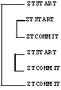

.. index::
   Commands

=====================
6. Commands
=====================

.. contents::
   :depth: 2

This chapter describes M language commands implemented in YottaDB. All commands starting with the letter Z are YottaDB additions to the ANSI standard command set. The M standard specifies standard abbreviations for commands and rejects any non-standard abbreviation. Behavior of I/O commands including OPEN, USE, READ, WRITE, and CLOSE is described in `Chapter 9: “Input/Output Processing” <https://docs.yottadb.com/ProgrammersGuide/ioproc.html>`_.

------------
Break
------------

The BREAK command pauses execution of the code and initiates Direct Mode.

The format of the BREAK command is:

.. parsed-literal::
   B[REAK][:tvexpr] [expr[:tvexpr][,...]]

* The optional truth-valued expression immediately following the command is a command postconditional that controls whether or not YottaDB executes the command.
* The optional expression contains a fragment of YottaDB code to XECUTE before the process enters Direct Mode.
* The BREAK command without an argument causes a pause in execution of the routine code and immediately initiates Direct Mode. In this case, at least two (2) spaces must follow the BREAK to separate it from the next command on the line.
* The optional truth-valued expression immediately following the expression is the argument postconditional that controls whether YottaDB XECUTEs the argument. If present and true, the process executes the code before entering Direct Mode. If present and false, the process does not execute the code before entering Direct Mode.
* If an argument postconditional is present and true, the process pauses code execution and initiates Direct Mode before and after XECUTing the argument.
* An indirection operator and an expression atom evaluating to a list of one or more BREAK arguments form a legal argument for a BREAK.

Issuing a BREAK command inside an M transaction destroys the Isolation of that transaction. Because of the way that YottaDB implements transaction processing, a BREAK within a transaction may cause the transaction to suffer an indefinite number of restarts ("live lock").

Generally, programs in production must not include BREAK commands. Therefore, YottaDB provides the ZBREAK and ZSTEP commands, which insert temporary breakpoints into the process rather than the source code. BREAKs inserted with ZBREAK only exist until the image terminates or until explicitly removed by another ZBREAK command. ZSTEP also inserts temporary BREAKs in the image that only exist for the execution of the ZSTEP command. In the YottaDB debugging environment, ZBREAKs and ZSTEPs that insert BREAKs provide a more flexible and less error-prone means of setting breakpoints than coding BREAKs directly into a routine. For more information on ZBREAK and ZSTEP, refer to the sections that describe those commands. Any BREAK commands in code intended for production should be conditionalized on something that is FALSE in production, as, unlike ZBREAK commands, YottaDB currently has no means to "turn off" BREAK commands.

ZCONTINUE resumes execution of the interrupted program.

YottaDB displays messages identifying the source of a BREAK as:

* The body of a program
* A ZBREAK action
* A device EXCEPTION
* A ZSTEP action

The VIEW "BREAKMSG" mask selectively enables or disables these messages. For an explanation of the mask, refer to `“View” <https://docs.yottadb.com/ProgrammersGuide/commands.html#view>`_. By default, a process executing a YottaDB image displays all BREAK messages.

When a process encounters a BREAK, it displays a prompt indicating readiness to process commands in Direct Mode. By default, Direct Mode displays the YDB> prompt. SETting the $ZPROMPT intrinsic special variable alters the prompt.

+++++++++++++++++++++++
Examples of BREAK
+++++++++++++++++++++++

Example:

.. parsed-literal::
   LOOP0     F  S act=$O(^act(act)) Q:act=""  B:debug  D LOOP1

This FOR loop contains a BREAK with a command postconditional.

Example:

.. parsed-literal::
   YDB>ZPRINT ^br
   br;
        kill
        for i=1:1:3 do break;
        quit
   break;
        write "Iteration ",i,?15,"x=",$get(x,"<UNDEF>"),!
        break:$data(x) "write ""OK"",!":x,"write ""Wrong again"",!":'x
        set x=$increment(x,$data(x))
        quit
   YDB>DO ^br
   Iteration 1    x=<UNDEF>
   Iteration 2    x=0
   %YDB-I-BREAK, Break instruction encountered
        At M source location break+2^br
   YDB>ZCONTINUE
        Wrong again
   %YDB-I-BREAK, Break instruction encountered
        At M source location break+2^br
   YDB>ZCONTINUE
   Iteration 3    x=1
        OK
   %YDB-I-BREAK, Break instruction encountered
        At M source location break+2^br
   YDB>ZCONTINUE
   %YDB-I-BREAK, Break instruction encountered
        At M source location break+2^br
   YDB>ZCONTINUE
   YDB>

This uses a BREAK with both command and argument postconditionals. The actions display debugging messages.

------------------
Close
------------------

The CLOSE command breaks the connection between a process and a device.

The format of the CLOSE command is:

.. parsed-literal::
   C[LOSE][:tvexpr] expr[:(keyword[=expr][:...])][,...]

* The optional truth-valued expression immediately following the command is a command postconditional that controls whether or not YottaDB executes the command.
* The required expression specifies the device to CLOSE.
* The optional keywords specify device parameters that control device behavior; some device parameters take arguments delimited by an equal sign (=). If there is only one keyword, the surrounding parentheses are optional.
* An indirection operator and an expression atom evaluating to a list of one or more CLOSE arguments form a legal argument for a CLOSE.

----------------
Do
----------------

The DO command makes an entry in the YottaDB invocation stack and transfers execution to the location specified by the entryref.

The format of the DO command is:

.. parsed-literal::
   D[O][:tvexpr] [entryref[(expr|.lvn[,...])][:tvexpr][,...]]

* The optional truth-valued expression immediately following the command is a command postconditional that controls whether or not YottaDB executes the command.
* The optional entryref specifies a location (with some combination of label, offset, and routinename) at which execution continues immediately following the DO.
* A DO command without an argument (that is, a DO followed by two (2) spaces) transfers execution to the next line in the routine if that line contains an appropriate number of periods (.) after the optional label and before the required linestart. These periods indicate the current level of "immediate" nesting caused by argumentless DOs. If the line following the DO contains too many periods, YottaDB reports an error; if the line following the DO contains too few periods, YottaDB ignores the DO command.
* A DO command without an argument stacks the current value of $TEST, in contrast to a DO with an argument, which does not protect the current value of $TEST.
* The optional parameter list enclosed in parentheses ( ) contains parameters to pass to the routine entry point.
* Label invocations using DO do not require parentheses for calls with no actuallist. If DO or a $$ that does not specify an actuallist invokes a label with a formallist, the missing parameters are undefined in the called routine.

 .. note::
    If DO or $$ specifies a routine but no label using an actuallist, then whether that routine's top label has a formallist or not, the actuallist applies to it directly, whereas before the actuallist would "fall through" to the first label with executable code.

* If the DO specifies a parameter list, the entryref location must start with a label and an argument list (M prohibits entryrefs with offsets during parameter passing).
* If an element in the parameter list starts with a period, it specifies an unsubscripted local variable name and the DO passes that variable by reference. Otherwise, the element specifies an expression that the DO evaluates and passes as a value.
* The optional truth-valued expression following the parameter list, or the entryref if the argument contains no parameter list, specifies the argument postconditional and controls whether YottaDB performs a DO using that argument.
* An indirection operator and an expression atom evaluating to a list of one or more DO arguments form a legal argument for a DO.

An explicit or implicit QUIT within the scope of the DO, but not within the scope of any other DO, FOR, XECUTE, or extrinsic, returns execution to the instruction following the calling point. This point may be the next DO argument or another command. At the end of a routine, or the end of a nesting level created by an argumentless DO, YottaDB performs an implicit QUIT. Any line that reduces the current level of nesting by changing the number of leading periods (.) causes an implicit QUIT, even if that line only contains a comment. Terminating the image and execution of ZGOTO commands are the only ways to avoid eventually returning execution to the calling point.

A DO command may optionally pass parameters to the invoked subroutine. For more information about entryrefs and parameter passing, refer to `Chapter 5: “General Language Features of M” <https://docs.yottadb.com/ProgrammersGuide/langfeat.html>`__.

+++++++++++++++++++++
Examples of DO
+++++++++++++++++++++

Example:

.. parsed-literal::
   YDB>DO ^%RD

This example invokes the routine directory utility program (%RD) from Direct Mode. The caret symbol (^) specifies that the DO command invokes %RD as an external routine.

Example:

.. parsed-literal::
   YDB>DO A(3)

This example invokes the subroutine at label A and passes the value 3 as a parameter. The DO argument does not have a caret symbol (^), therefore, it identifies A as a label in the current routine.

Example:

.. parsed-literal::
   ReportA ; Label for ReportA
           SET di="" OPEN outfile USE outfile 
           FOR  SET di=$ORDER(^div(di)) QUIT:di=""  DO PREP DO  DO POST
           .SET de="",(nr,gr)=0
           .WRITE "Division ",di,! F   S de=$ORDER(^de(di,de)) QUIT:de=""   DO
           ..WRITE "Department ",de," Gross Rev: ",^grev(di,de),!
           ..WRITE "Department ",de," Net Rev: ",^nrev(di,de),!
           ..SET gr=gr+^grev(di,de),nr=nr+^nrev(di,de)
           .W "Division Gross Rev: ",gr,!,"Division Net Rev: ",nr,!
           DO PRINT^OUTPUT(outfile)
           QUIT

This routine first uses a DO with a label argument (PREP) to do some pre-processing. Then, it uses an argumentless DO to loop through each division of a company to format a report. Within the first argumentless DO, a second argumentless DO (line 4) loops through and formats each department within a division. After the processing of all departments, control returns to the first argumentless DO, which prints a summary of the division. Following processing of all divisions, a DO with a label argument (POST) does some post-processing. Finally, at the next-to-last line, the routine uses a DO that invokes a subroutine at a label (PRINT) in an external routine (^OUTPUT), passing the name of the output file (outfile) as a parameter.

Example:

.. parsed-literal::
   YDB>zprint ^SQR
   SQR(z);
     set revert=0
     if $view("undef") set revert=1 view "noundef"
     if z="" write "Missing parameter.",!     view:revert "undef" quit
     else  write z*z,! view:revert "undef" quit  
   YDB>do ^SQR(10)
   100
   YDB>do ^SQR
   Missing parameter.

This example demonstrates label invocations using DO with and without parentheses.

-------------
Else
-------------

ELSE executes the remainder of the line after the ELSE if $TEST is FALSE (0). YottaDB does not execute the rest of the line if $TEST is TRUE (1).

The format of the ELSE command is:

.. parsed-literal::
   E[LSE]

* Because ELSE is a conditional command, it does not support a command postconditional.
* The scope of the ELSE is the remainder of the line. The scope of an ELSE can be extended with DO (or XECUTE) commands.
* Because the ELSE has no argument, at least two (2) spaces must follow the command to separate it from the next command on the line.

Because the scopes of both the IF and the ELSE commands extend to the rest of the YottaDB line, placing an ELSE on the same line as the corresponding IF cannot achieve the desired result (unless the intent of the ELSE is to test the result of a command using a timeout). If an ELSE were placed on the same line as its corresponding IF, then the expression tested by the IF would be either TRUE or FALSE. If that condition is TRUE, the code following the ELSE would not execute; if that condition is FALSE, the ELSE would not be in the execution path.

ELSE is analogous to IF '$TEST, except the latter statement switches $TEST to its complement and ELSE never alters $TEST.

.. note::
   Use ELSE with care. Because YottaDB stacks $TEST only at the execution of an extrinsic or an argumentless DO command, any XECUTE or DO with an argument has the potential side effect of altering $TEST. For information about $TEST, refer to `“$Test” <https://docs.yottadb.com/ProgrammersGuide/isv.html#test>`_.

+++++++++++++++++
Examples of ELSE
+++++++++++++++++

Example:

.. parsed-literal::
   If x=+x Set x=x+y
   Else  Write !,x

The IF command evaluates the conditional expression x=+x and sets $TEST. If $TEST=1 (TRUE), YottaDB executes the commands following the IF. The ELSE on the following line specifies an alternative action to take if the expression is false.

Example:

.. parsed-literal::
   If x=+x Do ^GOFISH
   Else  Set x=x\_"^"_y

The DO with an argument after the IF raises the possibility that the routine ^GOFISH changes the value of $TEST, thus making it possible to execute both the commands following the IF and the commands following the ELSE.

Example:

.. parsed-literal::
   Open dev::0 Else  Write !,"Device unavailable" QUIT

This ELSE depends on the result of the timeout on the OPEN command. If the OPEN succeeds, it sets $TEST to one (1) and YottaDB skips the rest of the line after the ELSE. If the OPEN fails, it sets $TEST to zero (0), and YottaDB executes the remainder of the line after the ELSE.

----------
For
----------

The FOR command provides a looping mechanism in YottaDB. FOR does not generate an additional level in the M standard stack model.

The format of the FOR command is:

.. parsed-literal::
   F[OR][lvn=expr[:numexpr1[:numexpr2]][,...]]]

* Because FOR is a conditional command, it does not support a command postconditional.
* The scope of the FOR is the remainder of the line. The scope of a FOR can be extended with DO (or XECUTE) commands.
* When the FOR has no argument, at least two (2) spaces must follow the command to separate it from the next command on the line. This specifies a loop that must be terminated by a QUIT, HALT, GOTO, or ZGOTO.
* The optional local variable name specifies a loop control variable delimited by an equal sign (=). A FOR command has only one control variable, even when it has multiple arguments.
* When initiating the FOR, YottaDB assigns the loop control variable the value of the expression. When only an initial value appears, YottaDB executes the remainder of the line once for that argument without forcing the control variable to be numeric.
* If the argument includes an increment and, optionally, a terminator, YottaDB treats the initial expression as a number.
* The optional numeric expression after the first colon (:) delimiter specifies the increment for each iteration. The FOR command does not increment the control variable on the first iteration.
* The optional numeric expression after the second colon (:) delimiter specifies the limiting value for the control variable. This terminating expression is evaluated only when the control variable is initialized to the corresponding initial value, then used for all subsequent iterations.
* YottaDB does not execute the commands on the same line following the FOR if:
   * The increment is non-negative and the initial value of the control variable is greater than the limiting value.
   * The increment is negative and the initial value of the control variable is less than the limiting value.

* After the first iteration, YottaDB does not alter the control variable and ceases execution under the control of the FOR if:
   * The increment is non-negative, and altering the control variable by the increment would cause the control variable to be greater than the limiting value.
   * The increment is negative, and altering the control variable by the increment would cause the control variable to be less than the limiting value.

* When the FOR has multiple arguments, each one affects the loop control variable in sequence. For an argument to gain control, no prior argument to the FOR can have an increment without a limit.

Increments and limits may be positive, negative, an integer, or a fraction. YottaDB never increments a FOR control variable "beyond" a limit. Other commands may alter a control variable within the extended scope of a FOR that it controls. When the argument includes a limit, such modification can cause the FOR argument to yield control at the start of the next iteration, or, less desirably loop indefinitely.

NOUNDEF does not apply to an undefined FOR control variable. This prevents an increment of an undefined FOR control variable from getting into an unintended infinite loop. For example, FOR A=1:1:10 KILL A gives an UNDEF error on the increment from 1 to 2 even with VIEW "NOUNDEF".

YottaDB terminates the execution of a FOR when it executes an explicit QUIT or a GOTO (or ZGOTO in YottaDB) that appears on the line after the FOR. FOR commands with arguments that have increments without limits and argumentless FORs can be indefinite loops. Such FORs must terminate with a (possibly postconditional) QUIT or a GOTO within the immediate scope of the FOR. FORs terminated by such commands act as "while" or "until" control mechanisms. Also, such FORs can, but seldom, terminate by a HALT within the scope of the FOR as extended by DOs, XECUTEs, and extrinsics. 

++++++++++++++++++
Examples of FOR
++++++++++++++++++

Example:

.. parsed-literal::
   YDB>Kill i For i=1:1:5 Write !,i
   1
   2
   3
   4
   5
   YDB>Write i
   5
   YDB>

This FOR loop has a control variable, i, which has the value one (1) on the first iteration, then the value two (2), and so on, until in the last iteration i has the value five (5). The FOR terminates because incrementing i would cause it to exceed the limit. Notice that i is not incremented beyond the limit.

Example:

.. parsed-literal::
   YDB>FOR x="hello",2,"goodbye" WRITE !,x
   hello
   2
   goodbye
   YDB>

This FOR loop uses the control variable x and a series of arguments that have no increments or limits. Notice that the control variable may have a string value.

Example:

.. parsed-literal::
   YDB>For x="hello":1:-1 Write !,x
   YDB>ZWRite x
   x=0
   YDB>

Because the argument has an increment, the FOR initializes the control variable x to the numeric evaluation of "hello" (0). Then, YottaDB never executes the remainder of the line because the increment is positive, and the value of the control variable (0) initializes to greater than the limiting value (-1).

Example:

.. parsed-literal::
   YDB>For y=-1:-3:-6,y:4:y+10,"end" Write !,y
   -1
   -4
   -4
   0
   4
   end
   YDB>

This FOR uses two limited loop arguments and one value argument. The first argument initializes y to negative one (-1), then increments y to negative four (-4). Because another increment would cause y to be less than the limit (-6), the first argument terminates with y equal to negative four (-4). The second argument initializes the loop control variable to its current value and establishes a limit of six (6=-4+10). After two iterations, incrementing y again would cause it to be greater than the limit (6), so the second argument terminates with y equal to four (4). Because the final argument has no increment, the FOR sets y to the value of the third argument, and YottaDB executes the commands following the FOR one more time.

Example:

.. parsed-literal::
   YDB>Set x="" For  Set x=$Order(ar(x)) Quit:x=""  Write !,x

This example shows an argumentless FOR used to examine all first level subscripts of the local array ar. When $ORDER() indicates that this level contains no more subscripts, the QUIT with the postconditional terminates the loop.

-----------------
Goto
-----------------

The GOTO command transfers execution to a location specified by its argument.

The format of the GOTO command is:

.. parsed-literal::
   G[OTO][:tvexpr] entryref[:tvexpr][,...]

* The optional truth-valued expression immediately following the command is a command postconditional that controls whether or not YottaDB executes the command.
* The required entryref specifies the target location for the control transfer.
* The optional truth-valued expression immediately following the entryref specifies the argument postconditional, and controls whether YottaDB performs a GOTO with that argument.
* Additional commands on a line following a GOTO do not serve any purpose unless the GOTO has a postconditional.
* An indirection operator and an expression atom evaluating to a list of one or more GOTO arguments form a legal argument to a GOTO.

A GOTO command within a line following a FOR command terminates that FOR command.

For more information on entryrefs, refer to `Chapter 5: “General Language Features of M” <https://docs.yottadb.com/ProgrammersGuide/langfeat.html>`__.

++++++++++++++++++++++++
Examples of GOTO
++++++++++++++++++++++++

Example:

.. parsed-literal::
   YDB>GOTO TIME+4

This GOTO command transfers control from Direct Mode to the line that is four (4) lines after the line labeled TIME (in the currently active routine). Using an offset is typically a debugging technique and rarely used in production code.

Example:

.. parsed-literal::
   GOTO A:x<0,^A:x=0,A^B

This GOTO command transfers control to label A in the current routine, if x is less than zero (0), to routine ^A if x is equal to zero (0), and otherwise to label A in routine ^B. Once any of the transfers occurs, the rest of the arguments have no effect.

--------------------------
Halt
--------------------------

The HALT command stops the program execution and causes YottaDB to return control to the operating system environment that invoked the YottaDB image.

The format of the HALT command is:

.. parsed-literal::
   H[ALT][:tvexpr]

* The optional truth-valued expression immediately following the command is a command postconditional that controls whether YottaDB executes the command.
* Because the HALT command has no argument, at least two (2) spaces must follow the command to separate it from the next command on the line. Note that additional commands do not serve any purpose unless the HALT has a postconditional.

A HALT releases all shared resources held by the process, such as devices OPENed in YottaDB, databases, and YottaDB LOCKs. If the the process has an active M transaction (the value of $TLEVEL is greater than zero (0)), YottaDB performs a ROLLBACK prior to terminating.

Because HALT and HANG share the same abbreviation (H), YottaDB differentiates them based on whether an argument follows the command.

Example:

.. parsed-literal::
   $ ydb
   YDB>HALT
   $

Because we invoke this YottaDB image interactively, the HALT in Direct Mode leaves the process at the shell prompt.

-------------------
Hang
-------------------

The HANG command suspends YottaDB program execution for a period of time specified by the command argument.

The format of the HANG command is:

.. parsed-literal::
   H[ANG][:tvexpr] numexpr[,...]

* The optional truth-valued expression immediately following the command is a command postconditional that controls whether or not YottaDB executes the command.
* The numeric expression specifies the time in seconds to elapse before resuming execution; actual elapsed time may vary slightly from the specified time. If the numeric expression is negative, HANG has no effect. Portability requirements for YottaDB only guarantee accuracy to the nearest second. However, more accuracy can be found on different UNIX systems.
* An indirection operator and an expression atom evaluating to a list of one or more HANG arguments form a legal argument to a HANG.

A process that repeatedly tests for some event, such as a device becoming available or another process modifying a global variable, may use a HANG to limit its consumption of computing resources.

Because HALT and HANG share the same abbreviation (H), YottaDB differentiates them based on whether an argument follows the command.

++++++++++++++++++
Examples of HANG
++++++++++++++++++

Example:

.. parsed-literal::
   For  Quit:$Data(^CTRL(1))  Hang 30

This FOR loop repeatedly tests for the existence of ^CTRL(1), and terminates when that global variable exists. Otherwise the routine HANGs for 30 seconds and tests again.

Example:

.. parsed-literal::
   SET t=1 For  Quit:$Data(^CTRL(1))  Hang t If t<30 Set t=t+1

This is similar to the previous example, except that it uses an adaptive time that lengthens from 1 second to a limit of 30 seconds if the routine stays in the loop.

-------------
If
-------------

The IF command provides conditional execution of the remaining commands on the line. When IF has an argument, it updates $TEST with the truth value of its evaluated argument. YottaDB executes the remainder of a line after an IF statement when $TEST is 1 (TRUE). When $TEST is 0 (FALSE), YottaDB does not execute the rest of the line. When the IF argument evaluates to a literal FALSE (0), YottaDB discards the command and its arguments at compile time, which means it does not perform any validity checking on the remainder of the line.

The format of the IF command is:

.. parsed-literal::
   I[F] [tvexpr[,...]]

* Because IF is a conditional command, it does not support a command postconditional.
* The scope of the IF is the remainder of the line. The scope of an IF can be extended with DO (or XECUTE) commands.
* The action of IF is controlled by the value of the expression and by $TEST, if there is no expression.
* IF with no argument acts on the existing value of $TEST (which it does not change); in this case, at least two (2) spaces must follow the IF to separate it from the next command on the line.
* An indirection operator, and an expression atom evaluating to a list of one or more IF arguments form a legal argument to IF.

.. note::
   Commands with timeouts also maintain $TEST. For information about $TEST, refer to `Chapter 8: “Intrinsic Special Variables” <https://docs.yottadb.com/ProgrammersGuide/isv.html>`_. Because YottaDB stacks $TEST only at the execution of an extrinsic or an argumentless DO command, any XECUTE or DO with an argument has the potential side effect of altering $TEST. Use the argumentless IF with caution.

Example:

.. parsed-literal::
   IF A,B ...
   is equivalent to
   IF A IF B

An IF with more than one argument behaves as if those arguments were logically "ANDed." However, execution of the line ceases with the evaluation of the first false argument. For IF argument expressions containing the "AND" operator (&), by default, execution still ceases with the evaluation of the first false argument, however any global references within the expression act in sequence to maintain the naked reference. The "FULL_BOOLEAN" and "SIDE_EFFECTS" compiler settings modify this behavior if you desire YottaDB to provide side effects it would otherwise bypass due to short-circiuting of Boolean expressions.

Postconditionals perform a function similar to IF; however, their scope is limited to a single command or argument, and they do not modify $TEST. For more information on postconditionals, see `Chapter 5: “General Language Features of M” <https://docs.yottadb.com/ProgrammersGuide/langfeat.html>`__.

++++++++++++++++
Examples of IF
++++++++++++++++

Example:

.. parsed-literal::
   IF x=+x!(x="") Do BAL

In this example, the DO executes if x contains a number or a null string.

Example:

.. parsed-literal::
   Write !,?50,BAL If 'BAL Write "\*\*\*\*"
   IF  Set EMPTY(acct)=""

The IF in the first line changes the value of $TEST, determining the execution of the code following the argumentless IF in the second line. Such argumentless IFs may serve as a form of line continuation.

Example:

.. parsed-literal::
   YDB>Set X=1,Y=1,Z=2 Kill UNDEF
   YDB>If X=1,Y=1,Z=3,UNDEF=0 Write "HI"
   YDB>

The IF command causes YottaDB to cease executing the line after it determines Z is not equal to three (3). Therefore, YottaDB never evaluates the reference to the undefined variable and never generates an error.

Example:

.. parsed-literal::
   YDB>Set X=1 Kill UNDEF
   YDB>If X=1!(UNDEF=3) Write "HI"
   HI
   YDB>

Because YottaDB recognizes that the X=1 fulfills the IF, it skips evaluation of the UNDEF variable and executes this IF command without generating an error. Because YottaDB does not require such optimizations and in fact, discourages them by requiring that all global references maintain the naked indicator, other implementations may generate an error.

-----------------
Job
-----------------

The JOB command initiates another YottaDB process that executes the named routine.

$ZJOB is set to the pid of the process created by the JOB command. For more details, refer to “$ZJob”.

The format of the JOB command is:

.. parsed-literal::
   J[OB][:tvexpr] entryref[(expr[,...])]
   [:[(keyword[=value][:...])][:numexpr]][,...]

* The optional truth-valued expression immediately following the command is a command postconditional that controls whether or not YottaDB executes the command.
* The required entryref specifies a location at which the new process starts.
* The optional parameter list enclosed in parentheses () contains parameters to pass to the routine entry point.
* If the JOB specifies a parameter list, the entryref location must start with a label and a formallist. M prohibits entryrefs with offsets during parameter passing.
* The optional elements in the parameter list specify expressions that the JOB evaluates and passes as values; because the JOB command creates a new process, its arguments cannot specify pass-by-reference.
* The keywords specify optional processparameters that control aspects of the environment for the new process.
* If the JOB command has only one processparameter, the surrounding parentheses are optional.
* Some keywords take numeric or string literals delimited by an equal sign (=) as arguments. Because the values are constants, strings must be enclosed in quotation marks (" "), and variable arguments require that the entire argument be constructed and referenced using indirection.
* The optional numeric expression specifies a time in seconds after which the command should timeout if unsuccessful; 0 results in a single attempt.
* When a JOB command contains no processparameters, double colons (::) separate the time-out numeric expression from the entryref.
* An indirection operator and an expression atom, evaluating to a list of one or more JOB command arguments, form a legal argument for a JOB command.
* The maximum command-line length for a JOB command is 8192 bytes.
* If the parent process is operating in UTF-8 mode, the JOB'd process also operates in UTF-8 mode.
* If your background process must have a different mode from its parent, then create a shell script to alter the environment as needed, and spawn it with a ZSYstem command using ZSYstem "/path/to/shell/script &".

The operating system deletes the resultant process when execution of its YottaDB process is complete. The resultant process executes asynchronously with the current process. Once YottaDB starts the resultant process, the current process continues.

If a JOB command specifies a timeout, and YottaDB creates the resultant process before the timeout elapses, JOB sets $TEST to true (1). If YottaDB cannot create the process within the specified timeout, JOB sets $TEST to false (0). If a JOB command does not specify a timeout, the execution of the command does not affect $TEST.

If YottaDB cannot create the process because of something that is unlikely to change during the timeout interval, such as invalid DEFAULT directory specification, or the parameter list is too long, the JOB command generates a run-time error. If the command does not specify a timeout and the environment does not provide adequate resources, the process waits until resources become available to create the resultant process.

+++++++++++++++++++++++++++++
The JOB Environment
+++++++++++++++++++++++++++++

When the JOB is forked, YottaDB creates the environment for the new jobbed off process by copying the environment of the process issuing the JOB command and making a few minor modifications. By default, the standard input is assigned to the null device, the standard output is assigned to routinename.mjo, and the standard error is assigned to routinename.mje. 

.. note::
   If the content of the $gtmroutines environment variable is different from the $ZROUTINES ISV, a jobbed off process will inherit $gtmroutines and not $ZROUTINES. If the M entryref (LABEL^PROGRAM) that is being jobbed off can be found only through $ZROUTINES, the jobbed off process will encounter a ZLINKFILE error (due to not being able to find the M program through $gtmroutines) whereas the program would be found in the jobbing process.

**JOB Implications for Directories**

By default, YottaDB uses the current working directory of the parent process for the working directory of the initiated process.

If the files specified by processparameters, do not exist, and YottaDB does not have permission to create them, the JOBed process terminates. When the corresponding files are in the current working directory, the OUTPUT, INPUT, and ERROR processparameters do not require a full pathname.

+++++++++++++++++++++++++
JOB processparameters
+++++++++++++++++++++++++

The following sections describe the processparameters available for the JOB command in YottaDB.

**CMD[LINE]="strlit"**

The string literal specifies the $ZCMDLINE of the JOB'd process.

**DEF[AULT]=strlit**

The string literal specifies the default directory.

The maximum directory length is 255 characters.

If the JOB command does not specify a DEFAULT directory, YottaDB uses the current default directory of the parent process.

**ERR[OR]=strlit**

strlit specifies the stderr of the JOBbed process. strlit can either be a file or a DETACHed socket (that is, a socket from the socket pool). To pass a DETACHed socket as the stderr of the JOBbed process, specify strlit in the form of "SOCKET:<handle>" where <handle> is the socket handle. On successful completion of the JOBbed process, the passed socket is closed and is no longer available to the parent process.

The maximum string length is 255 characters.

By default, JOB constructs the error file from the routinename using a file extension of .mje: the default directory of the process created by the JOB command.

**GBL[DIR]=strlit**

The string literal specifies a value for the environment variable gtmgbldir.

The maximum string length is 255 characters.

By default, the job uses the same specification for gtmgbldir as that defined in $ZGBLDIR for the process using the JOB command.

**IN[PUT]=strlit**

strlit specifies the stdin of the JOBbed process. strlit can either be a file or a DETACHed socket (that is, a socket from the socket pool). To pass a DETACHed socket as the stdin of the JOBbed process, specify strlit in the form of "SOCKET:<handle>" where <handle> is the socket handle. On successful completion of the JOB command, the passed socket is closed and is no longer available to the parent process.

.. note::
   Specify a DETACHed socket in both INPUT and OUTPUT parameters to pass it as the $PRINCIPAL of the JOBbed process. 

The maximum string length is 255 characters.

YottaDB does not supply a default file extension.

By default, the job takes its input from the null device.

**OUT[PUT]=strlit**

strlit specifies the stdout of the JOBbed process. strlit can either be a file or a DETACHed socket (that is, a socket from the socket pool). To pass a DETACHed socket as the stdout of the job, specify strlit in the form of "SOCKET:<handle>" where <handle> is the socket handle. On successful completion of the JOB command, the passed socket is closed and is no longer available to the parent process.

.. note::
   Specify a DETACHed socket in both INPUT and OUTPUT parameters to pass it as the $PRINCIPAL of the JOBbed process.

The maximum string length is 255 characters.

By default, JOB constructs the output file pathname from the routinename using a file extension of .mjo and the current default directory of the process created by the JOB command.

**PASS[CURLVN]**

With the PASSCURLVN jobparameter, the JOB'd process inherits the current collation, local variables, aliases, and alias containers from the current stack level of the parent process. Therefore, a ZWRITE in the JOB'd process has the same output, except for any out of scope aliases, as a ZWRITE in the context of the JOB command. If the JOB command finds a ZWRITE representation of any lvn, consisting of its full name, its subscripts, corresponding value, quotes and the equal-sign (=), exceeding 1MiB, it produces a JOBLVN2LONG error in the parent process, and a JOBLVNDETAIL error in the error output stream of the JOB'd process. If a JOB command does not specify PASSCURLVN, the JOB'd process(es) inherits no local variables from the parent, although it can receive values passed as parameters to an actuallist entryref. While not an inexpensive command, you can use the "exclusive" NEW command to control the context passed to the JOB'd process; for example, adding "NEW (LOCALA,LOCALB)" before the JOB command would pass only LOCALA and LOCALB.

If a parameter in the formal list of JOB'ed entryref shares the same name with a local in the parent process, the parameter passing facility applies the actuallist in the JOB command argument to the formallist at the invoked label superseding any local variable passed from the parent process by the PASSCURLVN option.

**STA[RTUP]="/path/to/shell/script"**

Specifies the location of the shell script that executes before running the named routine.

The JOBbed process spawns a shell session to execute the shell script. If the shell script fails, the JOB'd process terminates without running the named routine. Because STARTUP executes in a separate shell, it has no impact on the environment of the JOB'd process, which is inherited from the parent. STARTUP is useful for actions such as creating directories. Use PIPE devices instead of the JOB command to control the environment of a spawned process.

**JOB Processparameter Summary Table**

The processparameters are summarized in the following table.

+---------------------------+--------------------------+---------------------------------+------------------------------------+
| Parameter                 | Default                  | Minimum                         | Maximum                            |
+===========================+==========================+=================================+====================================+
| DEF[AULT]=strlit          | Same directory as the    | none                            | 255 characters                     |
|                           | process issuing the JOB  |                                 |                                    |
|                           | command                  |                                 |                                    |
+---------------------------+--------------------------+---------------------------------+------------------------------------+
| ERR[OR]=strlit            | ./routinename.mje        | none                            | 255 characters                     |
+---------------------------+--------------------------+---------------------------------+------------------------------------+
| GBL[DIR]                  | Same as gtmgbldir for    | none                            | 255 characters                     |
|                           | the process issuing the  |                                 |                                    |
|                           | JOB command              |                                 |                                    |
+---------------------------+--------------------------+---------------------------------+------------------------------------+
| IN[PUT]=strlit            | Null device              | none                            | 255 characters                     |
+---------------------------+--------------------------+---------------------------------+------------------------------------+
| OUT[PUT]=strlit           | ./routinename.mjo        | none                            | 255 characters                     |
+---------------------------+--------------------------+---------------------------------+------------------------------------+
| PASS[CURLVN]              | Only pass any formallist | N/A                             | ZWRITE key/value representations of|
|                           | values                   |                                 | any lvn must not exceed 1MiB       |
+---------------------------+--------------------------+---------------------------------+------------------------------------+
| STA[RTUP]=strlit          | none                     | none                            | Determined by the maximum length a |
|                           |                          |                                 | file pathname can have on the      |
|                           |                          |                                 | operating system, which is at least|
|                           |                          |                                 | 255 bytes on all systems which     |
|                           |                          |                                 | YottaDB currently supports.        |
+---------------------------+--------------------------+---------------------------------+------------------------------------+

+++++++++++++++++++++++++
Examples of JOB
+++++++++++++++++++++++++

Example:

.. parsed-literal::
   YDB>JOB ^TEST("V54001","")

This creates a job that starts doing the routine ^TEST (with 2 parameters) in the current working directory.

Example:

.. parsed-literal::
   JOB PRINTLABELS(TYPE,PRNTR,WAITIM)

This passes three values (TYPE, PRNTR, and WAITIM) to the new job, which starts at the label PRINTLABELS of the current routine.

Example:

Refer to the sockexamplemulti31.m program in the `Using Socket Devices <https://docs.yottadb.com/ProgrammersGuide/ioproc.html#using-socket-devices>`_ section for more examples on the JOB command.

----------------
Kill
----------------

The KILL command deletes local or global variables and their descendant nodes.

The format of the KILL command is:

.. parsed-literal::
   K[ILL][:tvexpr] [glvn | (lvn[,...]) | \*lname | \*lvn ]

* The optional truth-valued expression immediately following the command is a command postconditional that controls whether or not YottaDB executes the command.
* The optional global or local variable name specifies the variable to delete; KILL deletes not only the variable specified in the argument, but also all variables descended from that variable, that is, those starting with the identical key-prefix.
* KILLing a variable that does not currently exist has no effect.
* The KILL command without an argument deletes all currently existing local variables; in this case, at least two (2) spaces must follow the KILL to separate it from the next command on the line.
* When a KILL argument consists of local variable names enclosed in parentheses, that "exclusive" KILL deletes all local variables except those listed in the argument.
* KILL does not affect copies of local variables that have been "stacked" by NEW or parameter passing with the possible exception of the following: For KILL arguments enclosed in parentheses, the environment variable gtm_stdxkill enables the standard-compliant behavior to kill local variables in the exclusion list if they had an explicit or implicit (pass-by-reference) alias not in the exclusion list. By default, this behavior is disabled. If gtm_stdxkill is set to 1,"TRUE", or "YES", KILL deletes a local variable unless all its names are in the parenthesized list. If gtm_stdxkill is not defined or set to 0 KILL operations exclude the data associated with an item if any one of its names appears in the parenthesized list. While non-standard, the default behavior decouples call-by-reference functions or functions using aliases from needing knowledge of the caller's parameters.
* In conformance with the M standard, KILL of a variable joined by pass-by-reference to a formallist variable always KILLs the formalist variable when the actuallist variable is KILL'd even if the formallist variable is specified as protected by an exclusive KILL.
* KILL * removes the association between its argument and any associated arrays. The arguments are left undefined, just as with a standard KILL. If the array has no remaining associations after the KILL \*, YottaDB can reuse the memory it occupied. If there are no array(s) or association(s) the KILL * happily and silently does nothing.
* KILL * of an alias container variable is just like a KILL of an alias variable, and deletes the association between the lvn and the array.
* KILL * treats an alias formed though pass-by-reference the same as any alias variable by removing the alias association.
* KILL * with no arguments removes all aliases and alias containers connections.
* You can intermix KILL and KILL * in an argument list. For example, KILL \*A,B
* Kill * is not permitted inside a parenthesized list of exclusions, e.g.: KILL (\*A) is an error.
* An exclusive KILL where one associated name is inside the parenthetic list of exclusions and another associated name is not with that list kills the array through the name that is not inside the list. The association, however, is preserved.
* An indirection operator and an expression atom evaluating to a list of one or more KILL arguments form a legal argument for a KILL.

.. note::
   Use KILL with caution because it can have a major impact on the process environment (local variables) or shared data (global variables). 

+++++++++++++++++++++
Examples of KILL
+++++++++++++++++++++

Example:

.. parsed-literal::
   YDB>Kill  Set a=0,a(1)=1,a(1,1)="under" KILL a(1) ZWR
   a=0
   YDB>

This uses an argumentless KILL to get a "fresh start" by deleting all existing local variables. After SETting a, a(1), and a(1,1), the KILL deletes a(1) and its descendants. The ZWRITE shows only a remaining.

Example:

.. parsed-literal::
   YDB>Kill (a,b),^AB(a,b)

The first argument (an exclusive KILL) specifies to KILL all local variables except a and b. The second argument deletes ^AB(a,b) and any descendants of that global variable node.

Example:

.. parsed-literal::
   kill *
   write !,"gtm_stdxkill=",+$ztrnlnm("gtm_stdxkill"),!
   set (A,B,C,E)="input"
   do X(.A,.B)
   zwrite
   write !,"____________",!
   set (A,B,C,E)="input"
   do Y(.A,.B)
   zwrite
   write !,"____________",!
   set (A,B,C,E)="base"
   set \*C=A,\*D=B
   kill (C,D)
   zwrite
   quit
   X(C,D)    set (C,D)="output"
   kill (C,D)
   quit
   Y(C,D)    set (C,D)="output"
   kill (A,C,D)
   quit

Produces the following output:

.. parsed-literal::
   gtm_stdxkill=0
   A="output"
   B="output"
   C="input"
   ____________
   A="output"
   B="output"
   C="input"
   ____________
   A="base" ;*
   B="base" ;*
   \*C=A
   \*D=B

----------------------
Lock
----------------------

The LOCK command reserves and releases resource names, and provides a semaphore capability for YottaDB processes. This capability can be used for interprocess synchronization and signaling.

Assigning a LOCK does not specify any explicit control over variables and does not directly effect either read or write access to global (or local) data. However, an application that adheres to clearly defined conventions of LOCKing before any access can indirectly achieve such an effect.

YottaDB recommends implementing database Consistency using transaction processing rather than LOCKs. If you wish to avoid YottaDB's use of optimistic concurrency for TP, place the LOCK just before the original TSTART and release it after the final TCOMMIT.

The format of the LOCK command is:

.. parsed-literal::
   L[OCK][:tvexpr] [[-\|+]nref|(nref[,...])[:numexpr] [,...]]

* The optional truth-valued expression immediately following the command is a command postconditional that controls whether or not YottaDB executes the command.
* The nref argument specifies a resource name in the format of the YottaDB name, with or without subscripts and with or without a preceding caret (^). An nref can optionally have an environment specification, including one without a preceding caret (^).
* Outside of transactions, only one process in an environment can own a particular LOCK at any given time.
* Because the data storage in YottaDB uses hierarchical sparse arrays, and LOCK frequently serves to protect that data from inappropriate "simultaneous" access by multiple processes, LOCK treats resource names in a hierarchical fashion; a LOCK protects not only the named resource, but also its ancestors and descendants.
* When one or more nrefs are enclosed in parentheses (), LOCK reserves all the enclosed names "simultaneously," that is, it reserves none of them until all become available.
* A LOCK with no argument or an argument with no leading sign releases all names currently reserved with previous LOCK commands by the process; when a LOCK has no argument, at least two (2) spaces must follow the LOCK to separate it from the next command on the line.
* A LOCK argument with a leading plus sign (+) acquires the named resources without releasing currently held resources; if the named resource is already LOCKed, such a LOCK "counts up" the process interest in the resource.
* A LOCK argument with a leading minus sign (-) "counts down" the process interest in a named resource; if the count on a particular lock reaches zero (0), YottaDB releases the lock without releasing any other currently held locks; a LOCK that releases a named resource not currently owned by the process has no effect.
* YottaDB allows the "process interest" lock counter on a named resource to increment up to 511.
* The optional numeric expression specifies a time in seconds after which the command should timeout if unsuccessful; 0 provides a single attempt; timed LOCK commands maintain $TEST: 1 for a successful LOCK action, 0 for an unsuccessful (within the specified time) LOCK action. Note that untimed LOCK commands do not change $TEST.
* A LOCK operation that finds no room in LOCK_SPACE to queue a waiting LOCK so another process releasing a blocking LOCK can wake it, does a slow poll waiting for LOCK_SPACE to become available. If LOCK does not acquire the ownership of the named resource with the specified timeout, it returns control to the application with $TEST=0. If timeout is not specified, LOCK continues slow poll till space becomes available.
* If a LOCK command in a TP transaction specifies no timeout or a timeout that exceeds the limit specified by $gtm_tpnotacidtime when 2 is less than $TRESTART, the process releases the database critical sections and generates TPNOACID messages, which may live-lock the process, possibly until the transaction terminates because it reaches $ZMAXTPTIME. While such a process may have an impact on system performance this behavior moderates the impact of potential deadlocks on other database operations.
* An indirection operator and an expression atom evaluating to a list of one or more LOCK arguments form a legal argument for a LOCK.

YottaDB records LOCK and ZALLOCATE information in the "lock database." YottaDB distributes the lock database in space associated with the database identified by the current Global Directory. However, the lock database does not overlap or coincide with the body of the database files holding the global data. Only the LOCK, ZALLOCATE and ZDEALLOCATE commands, and the LKE utility program access the lock database.

YottaDB maps reservations of names starting with ^ to the database file used to map global variables of the same name. If the Global Directory maps the name A to file A.DAT, YottaDB maps all reservations on ^A to file space associated with A.DAT.

YottaDB maps reservations on names not starting with ^ to the region of the database specified with the GDE command LOCK -REGION=. By default, when GDE creates a Global Directory any reservations of local names are mapped to the region DEFAULT.

These two factors effect the following result in the programming environment:

* ^ reservations automatically intersect for all users of the same data in any database file independent of the Global Directory mapping that file.
* reservations without a leading ^ intersect in an arbitrary pattern dependent on the Global Directory and therefore controlled by a design decision potentially made independently of application code design.

Since YottaDB uses resource names as semaphores for signaling among multiple processes in a database environment, they interlock in a tree structured fashion. When LOCK or ZALLOCATE reserves a subscripted resource name such as ^D(1), other users of the database mapped by the LOCKing (or ZALLOCATEing) process cannot reserve ancestors of that name, such as ^D, or descendants, such as ^D(1,2), until LOCK or ZDEALLOCATE releases that name.

Execution of the LOCK command does not affect the value or the state of a variable. LOCK tests each argument to determine whether the process can claim the name space. If another YottaDB process has a LOCK on that name space, YottaDB suspends the current process until the other process releases the name space. To prevent the potential "indefinite" suspension of a routine execution, specify a timeout for the LOCK command.

LOCK with a leading plus (+) or minus (-) sign (incremental LOCKing) allows the acquisition and release of locks without releasing all currently held locks. This can lead to deadlocks. For example, a deadlock occurs if two users LOCK resources named A and B in the following sequence.

**Deadlock Situation**

+----------------------------------+------------------------------------+
| User X                           | User Y                             |
+==================================+====================================+
| L +A                             | L +B                               |
+----------------------------------+------------------------------------+
| L +B                             | L +A                               |
+----------------------------------+------------------------------------+

To avoid deadlocks, use LOCK without a leading + or - sign on its arguments because such a command releases all previously LOCKed resources, or uniformly implement well designed LOCK accumulation orders and/or use a timeout with the LOCK command.

If a LOCK command specifies a timeout, and YottaDB acquires ownership of the named resource before the timeout elapses, LOCK sets $TEST to TRUE (1). If YottaDB cannot acquire ownership of the named resource within the specified timeout, LOCK sets $TEST to FALSE (0). If a LOCK command does not specify a timeout, the execution of the command does not affect $TEST. If a LOCK with an argument having a leading minus sign (-) specifies a timeout, the command always sets $TEST to TRUE (1).

If a process issues a LOCK command for a named resource already ZALLOCATEd by that process, the resource is both ZALLOCATEd and LOCKed. LOCK does not release ZALLOCATEd resources. To release such a named resource, the process must both ZDEALLOCATE and unLOCK the resource. For more information, refer to “ZAllocate”.

Currently, LOCK of an argument within a parenthetical list where the argument includes an extrinsic function that performs LOCK, ZALLOCATE or ZDEALLOCATE actions produces a BADLOCKNEST error except where there is only one such argument, it is the first argument in the list and the LOCK'ng as a consequence of the extrinsic function(s) is simple. Note that this pattern may still produce some unintended outcomes, so YottaDB recommends against its use.

For more information on troubleshooting locks with the Lock Utility (LKE), refer to the `chapter on that utility in the Administration and Operations Guide <https://docs.yottadb.com/AdminOpsGuide/mlocks.html>`_.

+++++++++++++++++++++++++++++++++
Using Locks within Transactions
+++++++++++++++++++++++++++++++++

Within transactions, LOCKs are used by YottaDB to ensure the ability to serialize. There is no guarantee, however, that attempts by other processes to examine LOCKs held with a transaction will produce the same results as when LOCKs are outside of a transaction. In other words, LOCKs within transactions should never be used as simple semaphores.

The LOCK command locks a specified resource name that controls a tree structured name space. Outside of transactions when one process in an environment acquires a LOCK or a ZALLOCATE on a named resource, no other YottaDB process in that environment can LOCK a resource with an "overlapping" name until the first process releases the LOCK that it holds.

For information on the use of LOCKs within transactions, refer to `Chapter 5: “General Language Features of M” <https://docs.yottadb.com/ProgrammersGuide/langfeat.html>`__.

**Lock Command Operation Summary**

+-----------------+----------------------+------------------------------------------------------------------------------------------------------------+
| Commands Issued | Resulting Locks      | Comments                                                                                                   |
+=================+======================+============================================================================================================+
| L               | none                 | Remove all prior locks.                                                                                    |
+-----------------+----------------------+------------------------------------------------------------------------------------------------------------+
| L A             | A                    | Remove prior locks then lock A.                                                                            |
+-----------------+----------------------+------------------------------------------------------------------------------------------------------------+
| L               |                      | This sequence is equivalent to L A                                                                         |
| L +A            | A                    |                                                                                                            |
+-----------------+----------------------+------------------------------------------------------------------------------------------------------------+
| L A             |                      | Remove prior locks before locking A, then remove lock on A. This is equivalent to L A L                    |
| L -A            | none                 |                                                                                                            |
+-----------------+----------------------+------------------------------------------------------------------------------------------------------------+
| L A             |                      | Remove prior locks before locking A, increment lock on A without releasing prior lock on A, decrement lock |
| L +A            |                      | on A without releasing prior lock on A.                                                                    |
| L -A            | A                    |                                                                                                            |
+-----------------+----------------------+------------------------------------------------------------------------------------------------------------+
| L A             |                      | Remove prior locks before locking A, then lock B without releasing A.                                      |
| L +B            | A, B                 |                                                                                                            |
+-----------------+----------------------+------------------------------------------------------------------------------------------------------------+
| L A,B           | B                    | Remove prior locks before locking A, unlock A, then lock B.                                                |
+-----------------+----------------------+------------------------------------------------------------------------------------------------------------+
| L (A,B)         | A, B                 | Remove prior locks before locking A and B simultaneously.                                                  |
+-----------------+----------------------+------------------------------------------------------------------------------------------------------------+
| L A             |                      | Remove prior locks before locking A, lock B without releasing A, lock C without releasing A and B          |
| L +B            |                      |                                                                                                            |
| L +C            | A, B, C              |                                                                                                            |
+-----------------+----------------------+------------------------------------------------------------------------------------------------------------+
| L A             |                      | Remove prior locks before locking A, lock B and C simultaneously without releasing A.                      |
| L +(B,C)        | A, B, C              |                                                                                                            |
+-----------------+----------------------+------------------------------------------------------------------------------------------------------------+
| L (A,B,C)       |                      | Remove prior locks before locking A, B, and C simultaneously, remove lock on B without releasing A and C,  |
| L -B            |                      | remove lock on C without releasing A.                                                                      |
| L -C            | A                    |                                                                                                            |
+-----------------+----------------------+------------------------------------------------------------------------------------------------------------+
| L (A,B,C)       |                      | Remove prior locks before locking A, B, and C simultaneously, remove lock on B and C without releasing A.  |
| L -(B,C)        | A                    |                                                                                                            |
+-----------------+----------------------+------------------------------------------------------------------------------------------------------------+
| L (A,B)         |                      | Remove prior locks before locking A and B simultaneously, remove lock on B without releasing A.            |
| L -B            |                      |                                                                                                            |
+-----------------+----------------------+------------------------------------------------------------------------------------------------------------+

+++++++++++++++++++++
Examples of LOCK
+++++++++++++++++++++

Example:

.. parsed-literal::
   Lock A,^B,@C
   Lock (A,B,@C)

The first LOCK command LOCKs A and unLOCKs A before LOCKing ^B, then unLOCKs ^B before locking the name specified by the variable C. The second LOCK command acquires all three resources at once. YottaDB waits until all the named resources in the argument list become available before LOCKing all the resources. For example, if the resource specified by the variable C is not available for LOCKing, YottaDB waits until that resource becomes available before LOCKing A and ^B.

Example:

.. parsed-literal::
   LOCK (A,B)
   LOCK +C
   LOCK -B

This LOCKs A and B, then incrementally LOCKs C. Finally it releases the LOCK on B, while retaining the LOCKs on A and C.

Example:

.. parsed-literal::
   LOCK (A,B,C) 
   LOCK +(B,C)
   LOCK -(B)

This LOCKs A, B and C together. It then increments the lock "counts" of B and C. The last LOCK command removes one "count" of B, leaving one count of A and B and two counts of C.

Example:

.. parsed-literal::
   LOCK ^D:5

This command attempts to LOCK ^D with a timeout of five seconds. If LOCK acquires the named resource before the timeout elapses, YottaDB sets $TEST to 1 (TRUE). If LOCK fails to acquire the named resource before the timeout elapses, YottaDB sets $TEST to 0 (FALSE).

------------------
Merge
------------------

The MERGE command copies a variable and all its descendants into another variable. MERGE does not delete the destination variable, nor any of its descendants.

The format of MERGE command is:

.. parsed-literal::
   M[ERGE][:tvexpr] glvn1=glvn2[,...]

* The optional truth-valued expression immediately following the command is a command post conditional that controls whether or not YottaDB executes the command.
* When both glvn1 and glvn2 are local variables, the naked indicator does not change.
* If glvn2 is a global variable and glvn1 is a local variable, the naked indicator references glvn2.
* When both are global variables, the state of the naked indicator is unchanged if glvn2 is undefined ($DATA(glvn2)=0).
* In all other cases including $DATA(glvn2)=10, the naked indicator takes the same value that it would have if the SET command replaced the MERGE command and glvn2 had a value.
* If glvn1 is a descendant of glvn2, or if glvn2 is a descendant of glvn1; YottaDB generates an error.
* If $data(glvn2) is 0 then the command is a NOOP and YottaDB issues no errors.
* An indirection operator and an expression atom evaluating to a list of one or more MERGE arguments form a legal argument for a MERGE.

.. note::
   YottaDB may permit certain syntax or actions that are described by the standard as in error. For example, a MERGE command that specifies an operation where the source and destination overlap but $DATA(source)=0 does not produce an error (which is equivalent to a no-operation).

MERGE simplifies the copying of a sub-tree of a local or global variable to another local or global variable. A sub-tree is all global or local variables that are descendants of a specified variable. MERGE offers a one-command alternative to the technique of using a series of SET commands with $ORDER() or $QUERY() references for doing sub-tree copy.

+++++++++++++++++++++++
Examples of MERGE
+++++++++++++++++++++++

Example:

.. parsed-literal::
   YDB>Set ^gbl1="one"
   YDB>Set ^gbl1(1,1)="oneone"
   YDB>Set ^gbl1(1,1,3)="oneonethree"
   YDB>Set ^gbl1(1,2,4)="onetwofour"
   YDB>Set ^gbl2(2)="gbl2_2"
   YDB>Set ^gbl2(2,1,3)="gbl2_2_1_3"
   YDB>Set ^gbl2(2,1,4,5)="gbl2_2_1_4_5"
   YDB>Merge ^gbl1(1)=^gbl2(2)
   YDB>WRITE $Reference
   ^gbl1(1)
   YDB>ZWRite ^gbl1
   ^gbl1="one"
   ^gbl1(1)="gbl2_2"
   ^gbl1(1,1)="oneone"
   ^gbl1(1,1,3)="gbl2_2_1_3"
   ^gbl1(1,1,4,5)="gbl2_2_1_4_5"
   ^gbl1(1,2,4)="onetwofour"
   YDB>ZWRITE ^gbl2
   ^gbl2(2)="gbl2_2"
   ^gbl2(2,1,3)="gbl2_2_1_3"
   ^gbl2(2,1,4,5)="gbl2_2_1_4_5"
   YDB>

This example illustrates how MERGE copies a sub-tree of one global into another. The nodes in the sub-tree of ^gbl(2), for which $DATA() value is 1 or 11, are copied to sub-tree of ^gbl1(1) as follows:

.. parsed-literal::
   ^gbl1(1) is updated from the value of ^gbl2(2)
   ^gbl1(1,1,3) is updated from the value of ^gbl2(2,1,3)
   ^gbl1(1,1,4,5) is updated from the value of ^gbl2(2,1,4,5)

Since ^gbl1(2,1) and ^gbl2(2,2,4) do not have values ($DATA()=0), the corresponding nodes ^gbl1(1,1) and ^gbl(1,2,4) respectively are left unchanged. The naked indicator takes the value ^gbl(1) as if SET replaced MERGE. Notice that the MERGE command does not change ^gbl2(2) or its descendants. Ancestor nodes of ^gbl(1) are also left unchanged.

Example:

.. parsed-literal::
   YDB>Kill
                   
   YDB>Set ^gbl(1,2)="1,2"
   YDB>Merge lcl(3,4)=^gbl(1)
   YDB>Set ^("naked")=2
   YDB>ZWRite ^gbl
   ^gbl(1,2)="1,2"
   ^gbl("naked")=2
   YDB>ZWRite lcl
   lcl(3,4,2)="1,2"
   YDB>

This example illustrates how MERGE creates a sub-tree of a variable when the variable does not exist. Also, notice how the naked indicator is set when the source of the MERGE is a global and the destination a local.

-------------------
New
-------------------

The NEW command "stacks" copies of local variables and reinitializes those variables. An explicit or implicit QUIT from a DO, XECUTE or extrinsic function "unstacks" the NEWed variables, that is, restores the variable to the stacked value. A NEW lasts only while the current scope of execution is active.

The format of the NEW command is:

.. parsed-literal::
   N[EW][:tvexpr] [[(]lvn[,...][)][,...]]

* The optional truth-valued expression immediately following the command is a command postconditional that controls whether or not YottaDB executes the command.
* NEW arguments are unsubscripted local variable names; NEW affects not only the variable specified in the argument, but also all variables descended from that variable.
* When an undefined variable is NEWed, the fact that it is undefined is "stacked", and when leaving the current scope, it returns to being undefined, that is, the variable is implicitly KILLed during transfer of control.
* Without an argument YottaDB NEWs all currently existing local variables; in this case, at least two (2) spaces must follow the NEW to separate it from the next command on the line.
* For the scope of the NEW, a NEW of a name suspends its alias association. The association is restored when the scope of the New ends. The array remains in existence - it can be modified through other alias variables with which it is associated and which remain in scope. If none of its alias variables is in scope, the array remains intact and again becomes visible when the scope is restored.
* When a NEW argument is enclosed in parentheses, that NEW is considered "exclusive". An exclusive NEW creates a fresh data environment and effectively aliases the excluded variables with their original copies. This technique tends to improve performance and meets the M standard. However, it has two implications: The alias operation KILL \*, with no arguments, or naming an exclusively NEW'd variable, acts as a KILL in the current scope (has the same effect as a non-alias KILL), and ZWRITE, ZSHOW "V", $ZDATA() report any exclusively NEW'd variable as an alias. Refer to the section on the KILL command for a description of alternative behaviors for the interaction of KILL and exclusive NEW. 
* When the flow of execution terminates the scope of an argumentless or an exclusive NEW, YottaDB restores all stacked variables to their previous values, and deletes all other local variables.
* The intrinsic special variables $ESTACK, $ETRAP, $ZGBLDIR, and $ZYERROR can be an explicit argument of a NEW.For more information, refer to `Chapter 8: “Intrinsic Special Variables” <https://docs.yottadb.com/ProgrammersGuide/isv.html>`_.
* The intrinsic special variable $ZTRAP can also be an explicit argument of a NEW; this stacks the current value of $ZTRAP and assigns $ZTRAP a null value ($ZTRAP="").
* An indirection operator and an expression atom evaluating to a list of one or more NEW arguments form a legal argument for a NEW.

The NEW command provides a means of confining the scope of local variables. NEW operates only on unsubscripted local names and acts on the entire named array.

+++++++++++++++++++
Examples of NEW
+++++++++++++++++++

Example:

.. parsed-literal::
   NEW1;
     Set A(1)=1,B=4,C=5
     Write !,"VARIABLES BEFORE NEW:",!
     ZWRite
     Do LABEL
     Write !,"VARIABLES AFTER RETURN:",!
     ZWRite
     Quit
  LABEL    
     New A Set C=7
     Write !,"VARIABLES AFTER NEW:",!
     ZWRite
     Quit

Produces the results:

.. parsed-literal::
   VARIABLES BEFORE NEW:
   A(1)=1
   B=4
   C=5
   VARIABLES AFTER NEW:
   B=4
   C=7
   VARIABLES AFTER RETURN:
   A(1)=1
   B=4
   C=7

Example:

.. parsed-literal::
   NEW2;
     Set (A,B,C,D)="TEST"
     Do LABEL
     Write !,"VARIABLES AFTER RETURN:",!
     ZWRite
     Quit
   LABEL
     New (B,C) SET (A,B,Z)="NEW"
     Write !,"VARIABLES AFTER EXCLUSIVE NEW:",!
     ZWRite
     Quit

Produces the results:

.. parsed-literal::
   VARIABLES AFTER EXCLUSIVE NEW:
   A="NEW"
   B="NEW"
   C="TEST"
   Z="NEW"
   VARIABLES AFTER RETURN:
   A="TEST"
   B="NEW"
   C="TEST"
   D="TEST"

Example:

.. parsed-literal::
   /usr/lib/fis-gtm/V5.4-002B_x86/gtm -run ^stackalias   
   stackalias ; Demonstrate New with alias
     ZPrint ; Print this program
     Set A=1,*B=A,*C(2)=A ; Create some aliases
     Write "------------",!
     Write "ZWRite in the caller before subprogram",!
     ZWRite
     Do S1 ; Call a subprogram
     Write "------------",!
     Write "ZWRite in the caller after subprogram - A association is restored",!
     ZWRite
     Quit
     ;
   S1  ; Subprogram
     New A
     Set A="I am not an alias",B="I am an alias"
     Write "------------",!
     Write "ZWRite in the subprogram with new A and modified B",!
     ZWRite
     Quit
   ------------
   ZWRite in the caller before subprogram
   A=1 ;*
   \*B=A
   C=3
   \*C(2)=A
   D=4
   ------------
   ZWRite in the subprogram with new A and modified B
   A="I am not an alias"
   B="I am an alias" ;*
   C=3
   \*C(2)=B
   D=4
   ------------
   ZWRite in the caller after subprogram - A association is restored
   A="I am an alias" ;*
   \*B=A
   C=3
   \*C(2)=A
   D=4

The following is essentially the same as the prior example but using an exclusive NEW:

.. parsed-literal::
   $ /usr/lib/fis-gtm/V5.4-002B_x86/gtm -run ^stackalias1
   stackalias1 ; Demonstrate New with alias
     ZPrint ; Print this program
     Set A=1,*B=A,*C(2)=A ; Create some aliases
     Write "------------",!
     Write "ZWRite in the caller before subprogram",!
     ZWRite
     Do S1 ; Call a subprogram
     Write "------------",!
     Write "ZWRite in the caller after subprogram - A association is restored",!
     ZWRite
     Quit
     ;
   S1  ; Subprogram
     New (B)
     Set A="I am not an alias",B="I am an alias"
     Write "------------",!
     Write "ZWRite in the subprogram - Notice B is flagged as an alias",!
     ZWRite
     Quit
   ------------
   ZWRite in the caller before subprogram
   A=1 ;*
   \*B=A
   C=3
   \*C(2)=A
   D=4
   ------------
   ZWRite in the subprogram - Notice B is flagged as an alias
   A="I am not an alias"
   B="I am an alias" ;*
   -----------
   ZWRite in the caller after subprogram - A association is restored
   A="I am an alias" ;*
   \*B=A
   C=3
   \*C(2)=A
   D=4

An exclusive New can create a scope in which only one association between a name or an lvn and an array may be visible. In this case, ZWRITE nevertheless shows the existence of an alias, even when that array is accessible from only one name or lvn.

--------------------
Open
--------------------

The OPEN command creates a connection between a YottaDB process and a device.

The format of the OPEN command is:

.. parsed-literal::
   O[PEN][:tvexpr] expr[:[(keyword[=expr][:...])] [:numexpr]][,...]

* The optional truth-valued expression immediately following the command is a command postconditional that controls whether or not YottaDB executes the command.
* The required expression specifies the device to OPEN.
* The optional keywords specify deviceparameters that control device behavior; some deviceparameters take arguments delimited by an equal sign (=); if the argument only contains one deviceparameter, the surrounding parentheses are optional.
* The optional numeric expression specifies a time in seconds after which the command should timeout if unsuccessful; choosing 0 results in a single attempt to open the device.
* When an OPEN command specifying a timeout contains no deviceparameters, double colons (::) separate the timeout numeric expression from the device expression.
* An indirection operator and an expression atom evaluating to a list of one or more OPEN arguments form a legal argument for an OPEN.
* In UTF-8 mode, the OPEN command recognizes the ICHSET, OCHSET, and CHSET deviceparameters to determine the encoding of the the input / output devices.
* OPEN on a directory produces a GTMEISDIR error in both READONLY and NOREADONLY modes along with the directory name which failed to open. UNIX directories contain metadata that is only available to the file system. Note that you can use the ZSEARCH() function to identify files in a directory, and you can call the POSIX stat() function to access metadata. The optional YottaDB POSIX plug-in packages the stat() function for easy access from M application code.

---------------------
Quit
---------------------

Except when a QUIT appears on a line after a FOR, the QUIT command terminates the execution of the current YottaDB invocation stack level initiated by a DO, XECUTE, extrinsic function or special variable, and returns control to the next "lower" level. In this case, QUIT restores any values stacked at the current level by NEWs or by parameter passing. A QUIT command terminates any closest FOR command on the same line. Note that M overloads the QUIT command to terminate DO, FOR, XECUTE and extrinsics ($$) of which FOR is the most different.

The format of the QUIT command is:

.. parsed-literal::
   Q[UIT][:tvexpr] [expr | \*lname | \*lvn]

* The optional truth-valued expression immediately following the command is a command postconditional that controls whether or not YottaDB executes the command.
* When a QUIT terminates an extrinsic function, it must have an argument that supplies the value returned by the function; in all other cases, QUIT must not have an argument and must be followed by at least two (2) spaces to separate it from the next command on the line.
* An indirection operator and an expression atom evaluating to a QUIT argument form a legal argument for a QUIT.
* An unsubscripted lvn (lname) specifies the root of an array, while a subscripted lvn must specify an alias container.
* When QUIT * terminates an extrinsic function or an extrinsic special variable, it always returns an alias container. If lvn is an lname that is not an alias, QUIT * creates an alias container. 
* The QUIT performs two similar, but different, functions depending on its context. Because FORs do not add levels to the YottaDB invocation stack, QUITs inside FOR loops simply terminate the loop. QUITs that terminate DOs, XECUTEs and extrinsics remove a YottaDB invocation stack level and therefore may adjust the local variable environment resulting from previous NEWs or parameter passing. A QUIT from an extrinsic or a frame created by an argumentless DO restores $TEST to its stacked value.
* An indirection operator and an expression atom evaluating QUIT arguments forms a legal argument for a QUIT other than from a FOR.
* Attempting to QUIT (implicitly or explicitly) from code invoked by a DO, XECUTE or extrinsic after that code issued a TSTART not yet matched by a TCOMMIT, produces an error.

++++++++++++++++++++++
Examples of Quit
++++++++++++++++++++++

Example:

.. parsed-literal::
        Do A
        Quit
   A    Write !,"This is label A"

The explicit QUIT at the line preceding the label A prevents line A from executing twice. The sub-routine at line A terminates with the implicit QUIT at the end of the routine.

Example:

.. parsed-literal::
   Write $$ESV
    Quit
 ESV()
    QUIT "value of this Extrinsic Special Variable"

Because the label ESV has an argument list (which is empty), YottaDB can only legally reach that label with an extrinsic invocation. The QUIT on the second line prevents execution from erroneously "falling through" to the line labeled ESV. Because ESV identifies a subroutine that implements an extrinsic special variable, the QUIT on the line after ESV has an argument to provide the value of the extrinsic.

Example:

.. parsed-literal::
   Set x="" For  Set x=$Order(^BAL(x)) Quit:x]]"AR5999"!'$Length(x)  DO STF

The postconditional QUIT terminates the FOR loop. Note the two spaces after the QUIT because it has no argument.

----------------------
Read
----------------------

The READ command transfers the input from the current device to a global or local variable specified as a READ argument. For convenience, READ also accepts arguments that perform limited output to the current device.

The format of the READ command is:

.. parsed-literal::
   R[EAD][:tvexpr] (glvn|*glvn|glvn\#intexpr)[:numexpr]|strlit|fcc[,...]

* The optional truth-valued expression immediately following the command is a command postconditional that controls whether or not YottaDB executes the command.
* A subscripted or unsubscripted global or local variable name specifies a variable into which to store the input; the variable does not have to exist prior to the READ; if the variable does exist prior to the READ, the READ replaces its old value.
* When an asterisk (*) immediately precedes the variable name, READ accepts one character of input and places the ASCII code for that character into the variable.
* When a number-sign (#) and a positive non-zero integer expression immediately follow the variable name, the integer expression determines the maximum number of characters accepted as input to the read; such reads terminate when YottaDB reads the number of characters specified by the integer expression or a terminator character in the input stream or the optional timeout expires, whichever occurs first.
* The optional numeric expression specifies a time in seconds at most, for which the command waits for input to be terminated. When a timeout is specified, if the input has been terminated before the timeout expires, $TEST is set to 1 (true), otherwise, $TEST is set to 0 (false). When a READ times out, the target variable takes the value of the string received before the timeout.
* To provide a concise means of issuing prompts, YottaDB sends string literal and format control character (!,?intexpr,#) arguments of a READ to the current device as if they were arguments of a WRITE.
* An indirection operator and an expression atom evaluating to a list of one or more READ arguments form a legal argument for a READ.
* In UTF-8 mode, the READ command uses the character set value specified on the device OPEN as the character encoding of the input device. If character set "M" or "UTF-8" is specified, the data is read with no transformation. If character set is "UTF-16", "UTF-16LE", or "UTF-16BE", the data is read with the specified encoding and transformed to UTF-8. If the READ command encounters an illegal character or a character outside the selected representation, it generates a run-time error. The READ command recognizes all Unicode line terminators for non-FIXED devices.

For more information on READ, devices, input, output and format control characters, refer to `Chapter 9: “Input/Output Processing” <https://docs.yottadb.com/ProgrammersGuide/ioproc.html>`_.

--------------------
Set
--------------------

SET assigns values to variables or to a selected portion of a variable.

The format of the SET command is:

.. parsed-literal::
   S[ET][:tvexpr] setleft=expr | (setleft[,...])=expr | \*lvn=lname | aliascontainer[,...]

where

.. parsed-literal::
   setleft == glvn | $EXTRACT(glvn,[,intexpr1[,intexpr2]]) | $PIECE(glvn,expr1[,intexpr1[,intexpr2]]) | isv

and

.. parsed-literal::
   aliascontainer == lvn | exfunc | exvar

* The optional truth-valued expression immediately following the command is a command postconditional that controls whether or not YottaDB executes the command.
* A subscripted or unsubscripted local or global variable name on the left of the equal-sign (=) specifies a variable in which to store the expression found on the right side of the equal-sign; the variable need not exist prior to the SET; if the variable exists prior to the SET, the SET replaces its old value.
* During a SET, YottaDB evaluates the right side of the equal sign before the left; this is an exception to the left-to-right order of evaluation in YottaDB and means that YottaDB maintains the naked indicator using the expression on the right-hand side of the equal sign (=) before setting the variable.
* When the portion of the argument to the left of the equal sign is in the form of a $PIECE function, SET replaces the specified piece or pieces of the variable (specified as the first argument to the $PIECE() form) with the value of the expression on the right side of the equal-sign; if the variable did not exist prior to the SET or does not currently contain the pieces identified by the optional third and fourth arguments to the $PIECE() form, SET adds sufficient leading delimiters, as specified by the second argument to the $PIECE form, to make the assignment fit the $PIECE() form. Note that if the fourth argument exceeds the third argument, SET does not modify the target glvn or change the naked indicator.
* When the portion of the argument to the left of the equal sign is in the form of a $EXTRACT function, SET replaces the specified character or characters of the variable (specified as the first argument to the $EXTRACT() form) with the value of the expression on the right side of the equal-sign; if the variable did not exist prior to the SET or does not contain the characters identified by the optional second and third arguments to the $EXTRACT() form, SET adds sufficient leading spaces to make the assignment fit the $EXTRACT() form. Note that if the third argument exceeds the second argument, SET does not modify the target glvn or change the naked indicator .
* isv on the left-hand side of the equal-sign specifies an Intrinsic Special Variable. Not all ISVs permit SET updates by the application - see the description of the individual ISV.
* When the portion of the argument to the left of the equal-sign is in the form of a list of setlefts enclosed in parentheses, SET assigns the value of the expression on the right of the equal sign to all the destinations.
* If a SET updates a global node matching a trigger definition, YottaDB executes the trigger code after the node has been updated in the process address space, but before it is applied to the database. When the trigger execution completes, the trigger logic commits the value of a node from the process address space only if $ZTVALUE is not set. if $ZTVALUE is set during trigger execution, the trigger logic commits the value of a node from the value of $ZTVALUE. For more information on using SET in Triggers, refer to `“Set” section in the Triggers chapter <https://docs.yottadb.com/ProgrammersGuide/triggers.html#set>`_.
* A SET * command explicitly makes the lvn on the left-hand side of the equal-sign an alias if it is an unsubscripted lvn (the root of an array) or an alias container if it is a subscripted lvn. If the portion of the argument on the right-hand side of the equal-sign is other than an lname (the root of an array), it must evaluate to an alias or alias container. Extrinsic functions and extrinsic special variables return an alias container if they terminate with a QUIT \*. For more information on Alias Variables, refer to “Alias Variables Extensions”.
* In a SET * command, any previous array associated with the lvn on the left-hand side of the equal-sign ceases to be associated with it, and if lvn was the only lvn associated with that (old) array in any scope, YottaDB may reclaim the space it occupied. Alias assignment does not require that any data set exist for a name on the right-hand side of the equal-sign - the assignment simply creates an association.
* SET * left-hand side arguments cannot be parenthetically enclosed lists such as SET (a,*b)=c or SET (\*a,\*b)=c.
* SET and SET * assignments can be combined into one command in a comma separated list, for example, SET \*a=b,^c(3)=d(4).
* SET * only accepts argument indirection, that is, while SET accepts x="\*a=b",@x, SET does not permit x="\*a",@x=b or SET x="b",*a=@x.
* An indirection operator and an expression atom evaluating to a list of one or more SET arguments form a legal argument for a SET.
* A SET with proper syntax always succeeds regardless of the prior state or value of the variable, as long as YottaDB can evaluate the expression to the right of the equal sign (=).

For the syntax of $PIECE() or $EXTRACT(), refer to `Chapter 7: “Functions” <https://docs.yottadb.com/ProgrammersGuide/functions.html>`_.

+++++++++++++++++++++++++
Examples of SET
+++++++++++++++++++++++++

Example:

.. parsed-literal::
   YDB>Kill  Set a="x",(b,c)=1,@a="hello" ZWRite
   a=x
   b=1
   c=1
   x="hello"
   YDB>

The KILL command deletes any previously defined local variables. The SET command has three arguments. The first shows a simple direct assignment. The second shows the form that assigns the same value to multiple variables. The third shows atomic indirection on the left of the equal sign. The ZWRITE command displays the results of the assignments.

Example:

.. parsed-literal::
   YDB>Set ^(3,4)=^X(1,2)

As YottaDB evaluates the right-hand side of the equal sign before the left-hand side within a SET argument, the right-hand expression determines the naked reference indicator prior to evaluation of the left-hand side. Therefore, this example assigns ^X(1,3,4) the value of ^X(1,2).

Example:

.. parsed-literal::
   YDB>Kill x Set $Piece(x,"^",2)="piece 3" ZWRite x
   x="^^piece 3"
   YDB>

This SET demonstrates a "set piece" and shows how SET generates missing delimiters when required. For more information on $PIECE(), refer to `Chapter 7: “Functions” <https://docs.yottadb.com/ProgrammersGuide/functions.html>`_.

Example:

.. parsed-literal::
   YDB>Set x="I love hotdogs"
                   
   YDB>Set $Extract(x,3,6)="want"
   YDB>Write x
   I want hotdogs
   YDB>Set $Extract(x,7)=" many "
   YDB>Write x
   I want many hotdogs
   YDB>

The SET $EXTRACT command replaces and extracts the specified characters with the value of the expression on the right hand side of the equal-sign (=). For more information on $EXTRACT(), refer to `Chapter 7: “Functions” <https://docs.yottadb.com/ProgrammersGuide/functions.html>`_.

Example:

.. parsed-literal::
   YDB>kill A,B
           
   YDB>set A=1,A(1)=1,A(2)=2
   YDB>set \*B=A ; A & B are aliases. 
   YDB>zwrite B
   B=1 ;*
   B(1)=1
   B(2)=2
   YDB>

This SET * command creates an alias associated between A and B. It associates the entire tree of nodes of A including its root and all descendants with B.

Example:

.. parsed-literal::
   YDB>kill A,B,C
             
   YDB>set A=1,*C(2)=A ; C(2) is a container
   YDB>zwrite
   A=1 ;*
   \*C(2)=A
   YDB>set \*B=C(2) ; B is now an alias
   YDB>write B,":",$length(C(2)),":" ; An alias variable provides access but a container doesn't
   1:0:
   YDB>

This SET * command creates an alias by dereferencing an alias container. 

----------------------
TCommit
----------------------

The TCOMMIT command marks the end of a transaction or sub-transaction and decrements $TLEVEL. If TCOMMIT marks the end of a transaction (decrements $TLEVEL to zero), it invokes a COMMIT, which makes the database updates performed by the transaction generally available. A TCOMMIT issued when no transaction is in progress ($TLEVEL=0) produces an error.

The format of the TCOMMIT command is:

.. parsed-literal::
   TC[OMMIT][:tvexpr]

* The optional truth-valued expression immediately following the command is a command postconditional that controls whether or not YottaDB executes the command.
* Because TCOMMIT has no argument, at least two (2) spaces must follow the command to separate it from the next command on the line.

For an example of the use of the TCOMMIT command, see `Chapter 5: “General Language Features of M” <https://docs.yottadb.com/ProgrammersGuide/langfeat.html>`__.

-------------------
TREstart
-------------------

The TRESTART command attempts to RESTART the current transaction. A RESTART transfers control back to the initial TSTART and restores much of the process state to what it was when that TSTART was originally executed. A TRESTART issued when no transaction is in progress ($TLEVEL=0) or when the transaction does not have RESTART enabled produces an error.

A TRESTART command causes the TP transaction to RESTART in the same way that YottaDB uses to implicitly restart the transaction in case of resource conflicts. All restarts increment the internal transaction retry count to a maximum of three (3), at which point, YottaDB performs the entire TP transaction within a critical section on all databases referenced in the transaction.

YottaDB issues a TRESTMAX runtime error when application code attempts a TRESTART more than once during a transaction while $TRESTART=4 (note: in order to be wholesome, TRESTART usage in application code should always be conditional). In the final retry, YottaDB holds the critical section lock on all databases involved in the transaction. Since a TRESTART cancels all the work done in the current transaction and transfers control back to the TSTART, limiting the number of times this can be done in the final retry limits the time a process can (by virtue of holding a critical section lock on the databases) prevent other processes from updating the database.

YottaDB limits TP restarts in the final retry due to non-availability of M-locks in a similar fashion. YottaDB allows a maximum of 16 such restarts after which it issues a TPLOCKRESTMAX runtime error.

The format for the TRESTART command is:

.. parsed-literal::
   TRE[START][:tvexpr]

The optional truth-valued expression immediately following the command is a command postconditional that controls whether or not YottaDB executes the command.

Because TRESTART has no argument, at least two (2) spaces must follow the command to separate it from the next command on the line.

TRESTARTs (and implicit RESTARTs) do not restore any device states; they do restore the following to the state they had when YottaDB executed the initial TSTART:

* $TEST
* All global variables modified by the current base transaction and any of its sub-transactions
* The naked indicator
* LOCKs held by the process

A TP RESTART, either implicit or explicit, while executing $ZINTERRUPT in response to an interrupt (that is, $ZININTERRUPT is 1), and while error processing is in effect (that is, $ECODE'=""), raises a TPRESTNESTERR error and engages nested error handling, which unstacks M virtual machine frames back to where the incompletely handled error occurred, unstacks that frame and rethrows the error.

They also restore any local variables named by one or more active TSTARTs to the values they had when they were first named.

For an example of the use of the TRESTART command, see `Chapter 5: “General Language Features of M” <https://docs.yottadb.com/ProgrammersGuide/langfeat.html>`__.

----------------------
TROllback
----------------------

The TROLLBACK command terminates a transaction by causing a ROLLBACK, which removes all database updates performed within a transaction. A TROLLBACK without an argument also sets $TLEVEL and $TRESTART to zero (0). Issuing a TROLLBACK when no transaction is in progress ($TLEVEL=0) produces an error.

The format of the TROLLBACK command is:

.. parsed-literal::
   TRO[LLBACK][:tvexpr] [intexpr]

* The optional truth-valued expression immediately following the command is a command postconditional that controls whether or not YottaDB executes the command.
* The optional integer expression indicates an argument specifying incremental rollback. If the value of the argument expression is greater than zero, it specifies the value of $TLEVEL to be achieved by the rollback. If the value of the expression is less than zero, the result is the number of levels to rollback. For example; -1 means rollback one level. If the argument expression is zero, the effect is same as not specifying the argument, that is, the entire YottaDB transaction is rolled back.
* Attempting to rollback more than $TLEVEL levels (the outermost transaction) generates an error.
* When the TROLLBACK has no argument, at least two (2) spaces must follow the command to separate it from the next command on the line.
* In order to allow for error recovery and/or access to the global context of the error, errors do not initiate implicit ROLLBACKs. Therefore, the code for handling errors during transactions should generally include a TROLLBACK. Because the TROLLBACK releases resources held by the transaction, it should appear as early as possible in the error handling code.
* A TROLLBACK does not cause a transfer of control but is typically associated with one such as a QUIT (or GOTO).
* TROLLBACK to a $TLEVEL other than zero (0) leaves $REFERENCE empty. This behavior is same as a full TROLLBACK to $TEVEL=0.

For an example of the use of the TROLLBACK command, see `Chapter 5: “General Language Features of M” <https://docs.yottadb.com/ProgrammersGuide/langfeat.html>`__.

------------------
TStart
------------------

The TSTART command marks the beginning of a transaction or sub-transaction and increments $TLEVEL. When TSTART marks the beginning of a transaction ($TLEVEL=1), its arguments determine whether the transaction may RESTART and whether serializability is enforced. If a transaction may RESTART, the TSTART arguments determine which local variables are restored during a RESTART. Serializability is enforced by LOCK commands or, if the SERIAL keyword is specified, by YottaDB.

The format of the TSTART command is:

.. parsed-literal::
   TS[TART][:tvexpr] [([lvn...])\|lvn|*\|][:keyword|(keyword...)]

* The optional truth-valued expression immediately following the command is a command postconditional that controls whether or not YottaDB executes the command.
* If $TLEVEL is 0 before the TSTART, the TSTART starts a transaction; otherwise it starts a sub-transaction.
* If the TSTART initiates a transaction and the portion of the argument before the colon (:) delimiter is empty, the transaction is not eligible for RESTART. If the TSTART starts a transaction ($TLEVEL=0) and the portion of the argument before the colon is not empty, the transaction is eligible for RESTART. If the TSTART is nested (starts a sub-transaction), its arguments have no effect on whether the transaction is eligible for RESTART.
* If the portion of the argument before the colon is an asterisk (*), any subsequent RESTART restores all local variables to the value they had when the TSTART was executed.
* If the portion of the argument before the colon is an unsubscripted local variable name or a list of such names enclosed in parentheses, a RESTART restores the named variables to the value they had when the TSTART was executed.
* If the portion of the argument before the colon is a set of empty parentheses (), a RESTART does not restore any local variables.
* The optional portion of the argument after the colon is a keyword or a colon-separated list of keywords enclosed in parentheses, where the keywords specify transaction characteristics.
* An indirection operator and an expression atom evaluating to a TSTART argument form a legal argument for a TSTART.
* Using TSTART in direct mode may not behave as expected because there is no code repository to support an appropriate transaction restart.

A TSTART within a transaction starts a sub-transaction. The argument to such a TSTART has no effect on whether the existing transaction may RESTART or whether serializability of the transaction is enforced. This type of TSTART may add local variables to be restored in a transaction that has RESTART enabled.

It is good coding practice to synchronize enabling of RESTART on TSTARTs at all levels of a transaction. A nested TSTART that does not permit RESTART where the transaction does, may indicate that the sub-transaction has not been coded to properly handle RESTART.

Sub-transactions cannot COMMIT independently from the transaction, nor can they RESTART independently. Sub-transactions exist largely as a programming convenience to allow flexibility in organizing code in a modular fashion, and in addition to allow incremental ROLLBACKs.

When journaling, a transaction with an initial TSTART that has an argument specifying TRANSACTIONID=expr, where expr is an expression that evaluates to the keyword (case insensitive) BA[TCH], does not wait for the journal update to be written before returning control to the application after a successful TCOMMIT. The goal of this feature is to permit application control over any performance impact of journaling on any subset of transactions that can be recreated or recovered by means other than journaling.

For an example of the TSTART command, refer to `Chapter 5: “General Language Features of M” <https://docs.yottadb.com/ProgrammersGuide/langfeat.html>`__.

The following keywords may appear in a TSTART argument:

+++++++++++++++++++++
S[ERIAL]
+++++++++++++++++++++

The SERIAL keyword indicates that YottaDB must ensure the serializability of the transaction. Note that YottaDB always serializes transactions regardless of the SERIAL keyword. On a nested TSTART, this portion of the argument is irrelevant.

+++++++++++++++++++++
T[RANSACTIONID]=expr
+++++++++++++++++++++

The TRANSACTIONID keyword declares an arbitrary transaction identification.

If TRANSACTIONID="BATCH" or "BA" at transaction completion, the process immediately continues execution. When a process issues a [final] TCOMMIT for a transaction and journaling is active, by default the process waits until the entire transaction is written to the journal file(s) before executing the next command. This ensures that every transaction is durable before the process moves on to the next step. Transactions flagged as "BATCH" have lower latency and higher throughput, but a lower guarantee of durability. Normally this flag is used when operational procedures (such as a backup) or application code (such as a checkpoint algorithm) provides an acceptable alternative means of ensuring durability.

--------------------
Use
--------------------

The USE command selects the current device for READs (input) and WRITEs (output).

The format of the USE command is:

.. parsed-literal::
   U[SE][:tvexpr] expr[:(keyword[=expr][:...])][,...]

* The optional truth-valued expression immediately following the command is a command postconditional that controls whether or not YottaDB executes the command.
* The required expression specifies the device to make the current device.
* A USE that selects a device not currently OPENed by the process causes a run-time error.
* The optional keywords specify deviceparameters that control device behavior; some deviceparameters take arguments delimited by an equal sign (=); if the argument only contains one deviceparameter, the surrounding parentheses are optional.
* An indirection operator and an expression atom evaluating to a list of one or more USE arguments form a legal argument for a USE.

---------------------
View
---------------------

The VIEW command adjusts an environmental factor selected by a keyword argument. For example, VIEW controls journal buffer flushing, determines whether YottaDB reports undefined variables as errors or treats them as null, and determines which BREAK commands should display messages.

The format of the VIEW command is:

.. parsed-literal::
   V[IEW][:tvexpr] keyword[:expr2[:...]][,...]

* The optional truth-valued expression immediately following the command is a command postconditional that controls whether or not YottaDB executes the command.
* The keyword specifies the environmental factor to change.
* The optional expression following the keyword specifies the nature of the change to the environmental factor.
* An indirection operator and an expression atom evaluating to a list of one or more VIEW arguments form a legal argument for a VIEW

+++++++++++++++++++++++++
Key Words in VIEW Command
+++++++++++++++++++++++++

The following sections describe the keywords available for the VIEW command in YottaDB.

**"BREAKMSG":value**

Sets the value of the BREAK message mask. When YottaDB processes a BREAK command, the BREAK message mask controls whether to display a message describing the source of the BREAK.

The mask uses the following four values that are added together to provide the BREAKMSG value.

1 - BREAKs within the body of a program

2 - BREAKs within a ZBREAK action

4 - BREAKs within a device EXCEPTION

8 - BREAKs within a ZSTEP action

16 - ZBREAKs within a trigger removed due to updated trigger (TRIGZBREAKREM)

The default BREAKMSG mask is 31 (1+2+4+8+16) which means that YottaDB displays all BREAK messages.

Example:

.. parsed-literal::
   YDB>VIEW "BREAKMSG":5

In this example the BREAKMSG value is 5, representing the sum of 1 and 4. This enables BREAKS within the body of a program (value 1) and for a device EXCEPTION (value 4).

**[NO]BADCHAR**

Enables or disable the gneration of an error when character-oriented functions encounter malformed byte sequences (illegal characters).

At process startup, YottaDB initializes BADCHAR from the environment variable gtm_badchar. Set the environment variable $gtm_badchar to a non-zero number or "YES" (or "Y") to enable VIEW "BADCHAR". Set the environment variable $gtm_badchar to 0 or "NO" or "FALSE" (or "N" or "F") to enable VIEW "NOBADCHAR". By default, YottaDB enables VIEW "BADCHAR".

With VIEW "BADCHAR", YottaDB functions generate the BADCHAR error when they encounter malformed byte sequences. With this setting, YottaDB detects and clearly reports potential application program logic errors as soon as they appear. As an illegal UTF-8 character in the argument of a character-oriented function likely indicates a logic issue, YottaDB recommends using VIEW "BADCHAR" in production environments.

.. parsed-literal::
   When all strings consist of well-formed characters, the value of VIEW [NO]BADCHAR has no effect whatsoever. With VIEW "NOBADCHAR", the same functions treat malformed byte sequences as valid characters. During the migration of an application to add support for Unicode, illegal character errors are likely to be frequent and indicative of application code that is yet to be modified. VIEW "NOBADCHAR" suppresses these errors at times when their presence impedes development.

**"DBFLUSH"[:REGION[:N]]**

When using the BG access method, writes modified blocks in the global buffers to the database file. By default, this command option operates on all regions under the current global directory. N specifies the number of blocks to write; by default, DBFLUSH writes all modified blocks. Normally YottaDB schedules block flushing at appropriate times, but this option exists for an application to explore the impact of flushing on their work load. See also the DBSYNC and EPOCH VIEW Options.

**"DBSYNC"[:REGION]**

Performs a file system hardening sync - fsync() - operation on the database file. By default, this command option operates on all regions under the current global directory. Normally YottaDB schedules block flushing at appropriate times, but this option exists for an application to explore the impact of file hardening on their work load. See also the DBFLUSH and EPOCH VIEW Options.

**[NO]DMTERM**

Provides a mechanism to retain default line terminators for direct mode user interaction (including the BREAK command) independent of any TERMINATOR deviceparameter changes for $PRINCIPAL. With VIEW "NODMTERM", TERMINATOR deviceparameter apply to both READs from $PRINCIPAL and direct mode interactions. A case-insensitive value of the environment variable gtm_dmterm is "1", "yes", or "true" establishes a DMTERM state at process initiation; all other values, including no value, result in the default VIEW "NODMTERM" behavior. $VIEW("DMTERM") returns 1 for DMTERM mode or 0 for NODMTERM mode. 

**"EPOCH"[:REGION]**

Flushes the database buffers and, if journaling is enabled, writes an EPOCH record. By default, this command option operates on all regions under the current global directory. Normally YottaDB schedules epochs as a user controlled journaling characteristic, but this option exists for an application to explore the impact of epochs on their work load. See also the DBFLUSH and DBSYNC VIEW Options. Epochs include DBFLUSH and DBSYNC actions, but performing them before the epoch may reduce the duration of these actions within the epoch.

**"FLUSH"[:REGION]**

Flushes dirty global buffers from the global buffer pool. If journaling is turned on, "FLUSH" writes an EPOCH record and flushes dirty journal buffers prior to flushing dirty global buffers. If no region is specified, VIEW "FLUSH" flushes all regions in the current global directory that the YottaDB process has opened.

**[NO]FULL_BOOL[EAN][WARN]**

Controls the evaluation of Boolean expressions (expressions evaluated as a logical TRUE or FALSE).

By default, YottaDB enables VIEW "NOFULL_BOOLEAN" which means that YottaDB stops evaluating a Boolean expression as soon as it establishes a definitive result. For example, neither 0& $ $ abc^def() nor 1! $ $ abc^def() executes $$abc^def(). However, in the case of global references, such as 0&^a or 1!^a, YottaDB sets $reference and the naked indicator without actually accessing the global variable.

With VIEW "FULL_BOOLEAN", YottaDB ensures that all side effect expression atoms, extrinsic functions ($$), external functions ($&), and $INCREMENT() execute in left-to-right order.

With VIEW "FULL_BOOLWARN", YottaDB not only evaluates Boolean expressions like "FULL_BOOLEAN" but produces a BOOLSIDEFFECT warning when it encounters Boolean expressions that may induce side-effects; that is: expressions with side effects after the first Boolean operator - extrinsic functions, external calls and $INCREMENT().

YottaDB picks up the value of [NO]FULL_BOOL[EAN][WARN] from the environment variable gtm_boolean. If gtm_boolean is undefined or evaluates to an integer zero (0), the initial setting the default "NOFULL_BOOLEAN", if it evaluates to an integer one (1), the initial setting is "FULL_BOOLEAN" and if it evaluates to integer two (2) the initial setting is "FULL_BOOLWARN".

VIEW "[NO]FULL_BOOL[EAN][WARN]" takes effect immediately for indirection and XECUTE.

VIEW "NOFULLBOOLEAN" produces an error when gtm_side_effects is on. For more information on the gtm_side_effects environment variable, refer to the `Environment Variables section in the Basic Operations chapter <https://docs.yottadb.com/AdminOpsGuide/basicops.html#environment-variables>`_ of the Administration and Operations Guide.

**"GDSCERT":value**

Enables (value=1) or disables (value=0) database block certification.

Database block certification causes YottaDB to check the internal integrity of every block as it writes the block. Block certification degrades performance and exists primarily as a tool for use by YottaDB. The default is GDSCERT:0.

**"GVSRESET":"<region>"**

Resets the process-specific fields that are part of the ZSHOW "G" result and database file header fields holding records reported by: GVSTAT, BG trace, buffer pool accounting and the TP block modification details. Note a VIEW "GVSRESET" performed by a process with read-only database access changes only the process-specific information and has no effect on the database file header. DSE CHANGE -FILEHEADER -GVSTATSRESET clears the same database file header fields as VIEW "GVRESET"; 

**"GVDUPSETNOOP":value**

Enables (VIEW "GVDUPSETNOOP":1) or disables (VIEW "GVDUPSETNOOP":0) duplication set optimization.

Duplicate set optimization prevents a SET that does not change the value of an existing node from performing the update or executing any trigger code specified for the node. By default, duplicate set optimization is enabled.

**"JNLFLUSH"[:region]**

Writes or flushes journaling buffers associated with the given region to permanent storage, for example, to disk. If the VIEW "JNLFLUSH" does not specify the optional region, YottaDB flushes all journaled regions of the current Global Directory.

Normally YottaDB writes journal buffers when it completes a transaction (unless TRANSACTIONID="BATCH"), fills the journal buffer or when some period of time passes with no journal activity.

**JNLWAIT**

Causes a process to pause until its journaling buffers have been written. JNLWAIT ensures that YottaDB successfully transfers all database updates issued by the process to the journal file before the process continues. Normally, YottaDB performs journal buffer writes synchronously for TP updates, and asynchronously, while the process continues execution, for non-TP updates or TP updates with TRANSACTIONID=BATCH.

JNLWAIT operates only on those regions for which the current process has opened journal files. As all the journal activity for a TP transaction occurs at commit time, YottaDB ignores JNLWAIT when inside a TP TRANSACTION ($TLEVEL > 0). For more information on journaling, refer to the `"YottaDB Journaling" chapter in the Administration and Operations Guide <https://docs.yottadb.com/AdminOpsGuide/ydbjournal.html>`_.

**"JOBPID":"value"**

Enables (value=1) or disables (value=0) the addition of the child process ID to the output and error file names used (either implicitly generated or explicitly defined) by the JOB command. The default is 0.

Using the value=1 option prevents the JOB command from overwriting output files each time the same JOB command executes.

**"LABELS":"value"**

Enables (value="LOWER") or disables (value="UPPER") case sensitivity for labels within routines.

It is important to have the same case handling at compile-time and run-time.

Because YottaDB stores routines as regular files and file names are case sensitive on UNIX, YottaDB always treates routine names as case sensitive.

**"LINK":"[NO]RECURSIVE"**

Enables ("LINK":"RECURSIVE") or disables ("LINK":"RECURSIVE") the ZLINK command to accept and relink routines on the YottaDB invocation stack. With VIEW "LINK":"RECURSIVE" specified, the ZLINK command adds an executable routine even when a routine with the same name is active and available in the current stack. When a process links a routine with the same name as an existing routine, future calls use the new routine. Prior versions of that routine referenced by the stack remain tied to the stack until they QUIT, at which point they become inaccessible. This provides a mechanism to patch long-running processes.

The default is VIEW "LINK":"NORECURSIVE".

**[NO]LOGN[ONTP][=intexpr]**

Allows a process to dynamically change the logging of NONTPRESTART messages to the operator log established at process startup by the environment variables gtm_nontprestart_log_delta and gtm_nontprestart_log_first.

VIEW "NOLOGNONTP" turns off the logging of NONTPRESTART messages to the operator log.

VIEW "LOGNONTP"[=intexpr] turns on logging of NONTPRESTART messages to the operator log. If no intexpr is specified, YottaDB uses the value of environment variable gtm_nontprestart_log_delta, if it is defined, and one otherwise (that is, every transaction restart will be logged). A negative value of intexpr turns off the logging of NONTPRESTART messages.

Note that it is not possible to perform the operations of gtm_nontprestart_log_first with VIEW "LOGNONTP"[=intexpr].

**[NO]LOGT[PRESTART][=intexpr]**

Allows a process to dynamically change the logging of TPRESTART messages to the operator log established at process startup by the environment variables gtm_tprestart_log_delta and gtm_tprestart_log_first.

VIEW "NOLOGTPRESTART" turns off the logging of TPRESTART messages to the operator log.

VIEW "LOGTPRESTART"[=intexpr] turns on logging of TPRESTART messages to the operator log. If no intexpr is specified, YottaDB uses the value of environment variable gtm_tprestart_log_delta, if it is defined, and one otherwise (that is, every transaction restart will be logged). A negative value of intexpr turns off the logging of TPRESTART messages.

Note that it is not possible to perform the operations of gtm_tprestart_log_first with VIEW "LOGTPRESTART"[=intexpr].

**LV_GCCOL**

Starts a data-space garbage collection, which normally happens automatically at appropriate times.

.. note::
   There are no visible effects from LV_GCOL, LV_REHASH, and STP_GCOL except for the passage of time depending on the state of your process. YottaDB uses these VIEW "LV_GCOL","LV_REHASH","STP_GCOL" facilities in testing. They are documented to ensure completeness in product documentation. You may (or may not) find them useful during application development for debugging or performance testing implementation alternatives.

**LV_REHASH**

Starts a reorganization of the local variable look-up table, which normally happens automatically at appropriate times.

.. note::
   There are no visible effects from LV_REHASH, LV_GCOL, and STP_GCOL except for the passage of time depending on the state of your process. YottaDB uses these VIEW "LV_GCOL","LV_REHASH","STP_GCOL" facilities in testing. They are documented to ensure completeness in product documentation. You may (or may not) find them useful during application development for debugging or performance testing implementation alternatives.

**[NEVER]|[NO]LVNULLSUBS**

Disallows, partially disallows, or allows local arrays to have empty string subscripts. The default is LVNULLSUBS.

NOLVNULLSUBS disallows any variant of SET to operate on a local array having an empty string subscript.

NEVERLVNULLSUBS disallows any variant of SET or KILL ($DATA(),$GET(),$ORDER(), and $QUERY()) to operate on a local array having an empty string subscript. An empty string as the last subscript in $ORDER() and $QUERY() has the semantic significance of requesting the next lexical item and is not subject to NULLSUBS errors.

LVNULLSUBS allows local arrays to have empty string subscripts.

At process startup, YottaDB initializes [NEVER][NO]LVNULLSUBS from $gtm_lvnullsubs. Set the environment variable $gtm_lvnullsubsv to:

* 0 - equivalent to VIEW "NOLVNULLSUBS"
* 1 (the default) - equivalent to VIEW "LVNULLSUBS" or
* 2 - equivalent to VIEW "NEVERLVNULLSUBS".

.. note::
   Remember that for global variables, empty string subscript checking is controlled by a database region characteristic. YottaDB recommends using LVNULLSUBS, NOLVNULLSUBS, or NEVERLVNULLSUBS for local variables and NULLSUBS options ALWAYS or NEVER for global variables.

**"NOISOLATION":<expr>**

where expr must evaluate to one of the following forms:

* "", that is, the empty string : turn off the feature for all globals for which it has previously been turned on
* "^gvn1,^gvn2,..." : turn on the feature for the globals in the list, turning it off for globals for which it has previously been turned on
* "+^gvn1,^gvn2,..." : add these globals to the list of globals that have this feature turned on
* "-^gvn1,^gvn2,..." : turn off the feature for these globals leaving the status for other globals unchanged

YottaDB transaction processing permits the application to specify a set of globals that do not require YottaDB to preserve Isolation, one of the "ACID" properties of TP. This shifts the responsibility for Isolation from YottaDB to the application logic, and permits YottaDB to relax its TP Isolation rules. This avoids TP restarts in certain cases thus improving the performance of the application. For example, if a global variable includes $JOB as a subscript, the application may be written and scheduled in such a way that no more than one process uses a node of that global at any given time. Specifying such a global as "NOISOLATED" avoids transaction restarts that occur when different processes concurrently update and access nodes that share the same GDS block.

The rules for enforcement by YottaDB of Isolation, and therefore potentially Consistency, are relaxed for application-specified global variables in order to allow the application to manage these properties. YottaDB is responsible for Atomicity and Durability, as well as for database integrity for all variables, and for Isolation and Consistency for any global variables for which the application does not accept responsibility.

Note that if an application incorrectly specifies a global to be NOISOLATED, severe, and possibly intermittent and difficult to diagnose damage to application-level integrity is likely to result. A thorough understanding of the application is necessary before declaring a global to be noisolated. YottaDB preserves database integrity (accessibility) for NOISOLATED, as well as ISOLATED global variables.

YottaDB ignores attempts to turn on (or off) the feature for globals that already have the feature turned on (or off). It is an error to modify the isolation-status of a global variable within a transaction across different references (either reads or writes) of that global variable. The VIEW command by itself is not considered to be a reference of the global variable. While not recommended programming practice, this means that a process can change a global's isolation-status within a transaction as long as it hasn't referenced it yet.

Any reads on a NOISOLATION global are validated at the time of the read and not re-validated at TCOMMIT time. This means that if the value that was read changed after the read but before the TCOMMIT, the transaction would still be committed. Therefore it is important that any reads on a NOISOLATED global (if any) should be of data insensitive to change with time (unchanging or where consistency with other data accessed by the transaction doesn't matter). 

**"PATCODE":"tablename"**

Identifies the alternative table of unique patterns for use with the "?" operator to be loaded from the pattern definition file. For additional information, refer to `Chapter 12: “Internationalization” <https://docs.yottadb.com/ProgrammersGuide/internatn.html>`_.

**"PATLOAD":"file-specification"**

Identifies the file containing definitions of unique patterns for use with the "?" operator. These pattern definitions can be used in place of, or in addition to, the standard C, N, U, L, and P. For more information on creating the file-specification, refer to `Chapter 12: “Internationalization” <https://docs.yottadb.com/ProgrammersGuide/internatn.html>`_.

**"POOLLIMIT":<region>:expr**

VIEW "POOLLIMIT":<region>:expr, where expr is of the form n[%] provides a mechanism for a process that has the potential to "churn" global buffers to limit the potential impact on other processes by restricting the number of global buffers it uses. If the expression ends with a per-cent sign (%), the number is taken as an as a percentage of the configured global buffers and otherwise as an ordinal number of preferred buffers; standard M parsing and integer conversions apply. Preferred buffer values are limited to between 32 and one less than half the buffer pool inclusive; with the exception of zero (0) or 100 per cent, which turn off the limitation; specifications exceeding those limits provide the value of the nearer limit. If the argument specifies "*" for the region, the command applies to all regions. $VIEW("POOLLIMIT",<region>) returns the current value for the region as an ordinal number - zero (0) when there is no limit in place. Note that this facility is designed for use by a relatively small subset of processes. In addition, MUPIP REORG uses this facility to limit its buffers to a value established by the environment variable gtm_poollimit using the syntax described for VIEW "POOLLIMIT" with a default of 64 if gtm_poollimit is not specified. Note that this may slightly slow a standalone REORG but can be overridden by defining gtm_poollimit as 0 or "100%". 

**RCTLDUMP**

Displays the created relinkctl files and the routines looked for in their related directories. An entry in these files does not mean that a given routine was found there. It merely means it was looked for there and shows a cycle number (which ZRUPDATE bumps) whose change indicates a new published version of the given object file. As it is a diagnostic tool for the new feature, YottaDB may remove or modify this VIEW option in subsequent releases.

.. note::
   YottaDB no longer supports VIEW "RCTLDUMP" as it has been supplanted by ZSHOW "A" and MUPIP RCTLDUMP.

**RESETGVSTATS**

Resets all the process-private global access statistics to 0. This is particularly useful for long running processes which would periodically like to restart the counting without requiring a shut down and restart.

**[NO]STATSHARE**

Opt in or out of sharing process statistics for monitoring by other processes.

YottaDB provides a fast and efficient mechanism for processes to share their database access statistics for other processes to monitor. Processes opt in or out with the VIEW "[NO]STATSHARE" command, defaulting to VIEW "NOSTATSHARE". At process startup, a value of 1, or any case-independent string or leading substrings of "TRUE" or "YES" in the environment variable gtm_statshare provides an initial setting of VIEW "STATSHARE". When a process changes whether it is opting in or out, there is no change to the output of a ZSHOW "G" within that process. YottaDB does not permit this form of the VIEW command within a TP transaction. Monitoring the statistics of other processes does not require opting-in.

Processes opted-in place their statistics as binary data in database files located in the directory specified by the gtm_statsdir environment variable. All processes that share statistics MUST use the same value for $gtm_statsdir. The ^%YGBLSTAT utility program gathers and reports statistics. 

**STP_GCOL**

Starts a string-pool garbage collection, which normally happens automatically at appropriate times. 

.. note::
   There are no visible effects from STP_GCOL, LV_GCOL and LV_REHASH except for the passage of time depending on the state of your process. YottaDB uses these VIEW "LV_GCOL","LV_REHASH","STP_GCOL" facilities in testing. They are documented to ensure completeness in product documentation. You may (or may not) find them useful during application development for debugging or performance testing implementation alternatives.

**[NO]UNDEF**

Enables or disables handling of undefined variables as errors. With UNDEF, YottaDB handles all references to undefined local or global variables as errors. With NOUNDEF, YottaDB handles all references to undefined local or global variables as if the variable had a value of the empty string. In other words, YottaDB treats all variables appearing in expressions as if they were the argument of an implicit $GET(). UNDEF is the default.

The environment variable $gtm_noundef specifies the initial value value of [NO]UNDEF at process startup. If it is defined, and evaluates to a non-zero integer or any case-independent string or leading substring of "TRUE" or "YES", then YottaDB treats undefined variables as having an implicit value of an empty string. 

.. note::
   NOUNDEF does not apply to an undefined FOR control variable. This prevents an increment (or decrement) of an undefined FOR control variable from getting into an unintended infinite loop. For example, FOR A=1:1:10 KILL A gives an UNDEF error on the increment from 1 to 2 even with VIEW "NOUNDEF". 

**"TRACE":value:<expr>**

Traces YottaDB program execution and generates profiling information about the lines and functions executed; with low impact on the run-time performance.

The feature turns on (value=1) or turns off (value=0) M-profiling. This expression must evaluate to a string containing the name of a YottaDB global variable. The global may also have subscripts; however the subscripts must be literals or the special variable $JOB. For the $JOB process identifier description, refer to `Chapter 8: “Intrinsic Special Variables” <https://docs.yottadb.com/ProgrammersGuide/isv.html>`_.

The expression is optional when turning M-profiling off, if it exists, it overrides the global variable set when M-profiling was turned on.

gtm_trace_gbl_name enables YottaDB tracing at process startup. Setting gtm_trace_gbl_name to a valid global variable name instructs YottaDB to report the data in the specified global when a VIEW command disables the tracing, or implicitly at process termination. This setting behaves as if the process issued a VIEW "TRACE" command at process startup. However, gtm_trace_gbl_name has a capability not available with the VIEW command, such that if the environment variable is defined but evaluates to zero (0) or, only on UNIX, to the empty string, YottaDB collects the M-profiling data in memory and discards it when the process terminates (this feature is mainly used for in-house testing). Note that having this feature activated for process that otherwise do not open a database file (such as GDE) can cause them to encounter an error.

In addition, if a process issues a malformed VIEW command that attempts to turn tracing off, YottaDB issues an error but retains all accumulated profiling data and continues tracing. If the tracing is still enabled at the process shutdown and the trace start specified a reporting location, YottaDB attempts to place the trace data there. Note that if there is a problem updating the specified trace-reporting global variable, YottaDB issues an error at process termination.

M-profiling uses a technique called Basic Block Counting where calls are made to special profiling functions at key points in a YottaDB program. A trace consists of the following run-time data as output for each YottaDB function, as well as for each YottaDB statement:

* The number of times it is executed.
* The total CPU time, subject to the granularity of the operating system provided time functions, spent across all invocations for each function and each YottaDB statement as five values: count, user time, system time, total time, and elapsed time.

VIEW "TRACE" also reports details of child processes using two aggregate entries -- "\*RUN" for the current process and "\*CHILDREN" for all of child processes spawned by the current process, each containing user, system, and combined CPU times. The "CHILD" category data excludes processes that result from the JOB command, PIPE devices OPENed with the INDEPENDENT device parameter and processes from PIPE devices that are still active.

Instead of modifying the generated code as done by common profiling tools, such as gprof, M-profiling operates entirely within the YottaDB run-time system; therefore, this feature does not require a special compilation, has no effect on code size and minimizes run-time overhead.

When M-profiling is activated, it gathers profiling information for each line and YottaDB function invocation. The reported time for a YottaDB line is the time spent in generated code for that line, and does not include time spent in entreyrefs called from that line. When M-profiling is deactivated, the accumulated statistics are loaded into a YottaDB global. YottaDB profiling accumulates and provides the data; the user chooses tools and techniques to analyze the data.

The M-profiling information is stored in the variable in the following format:

* If the expression is a global variable without subscripts such as "^foo", the M-profiling information is stored in the nodes ^foo(<routine>,<label>) and ^foo(<routine>,<label>,<offset>), each holding a value in the form "<count>:<usertime>,:<systemtime>,:<total_time>".
* If the expression has a value such as "^foo("MYTRACE",$J)", the trace information is stored in the nodes ^foo("MYTRACE",<pid>,<routine>,<label>) and ^foo("MYTRACE",<pid>,<routine>,<label>,<offset>), each of which has a value in the form "<count>,<usertime>,<systemtime>,<total_time>" as described above.
* For FOR loops, information for each level of the loop is stored in the nodes as described above, with the extra subscipts "FOR LOOP". <for_level> is the value of the number of iterations at that level of the FOR loop.

Example:

.. parsed-literal::
   YDB>zprint ^profiling
   ; In this example, query^profiling, order^profiling, and merge^profling perform the same operation -- store even-numbered subscripts of a global to a subscripted loc
   al variable. M-profiling results show which yields the fastest execution between the three.
   profiling
     kill ^TMP,^trc
     view "trace":1:"^trc"
     set ulimit=1500
     for i=1:1:ulimit set ^TMP(i)=i
     do qom("^TMP")
     view "trace":0:"^trc"
     zwrite ^trc
     quit
   qom(y)
     do query(y)
     do order(y)
     do merge(y)
     quit
   query(y)
     new i,qryval
     set i=0,y=$query(@y)
     for  quit:y=""   do
     .      set:i#2 qryval(i)=@y
     .      set y=$query(@y)
     .      set i=i+1
     quit
   order(y)
     new i,ordval
     set x="",i=0,y=y_"(x)",x=$order(@y)
     for  quit:x=""  do
     .      set:i#2 ordval(i)=x
     .      set x=$order(@y)
     .      set i=i+1
     quit
   merge(y)
     new i,merval
     set i=0,merval=0
     merge merval=@y
     for i=1:1:$order(merval(""),-1)  do
     .      kill:i#2 merval(i)
     quit

This example produces an output like the following:

.. parsed-literal::
   YDB>do ^profiling
   ^trc("\*CHILDREN")="0:0:0"
   ^trc("\*RUN")="144009:76004:220013"
   ^trc("profiling","merge")="1:8001:12000:20001:16231"
   ^trc("profiling","merge",0)="1:0:0:0:5"
   ^trc("profiling","merge",1)="1:0:0:0:4"
   ^trc("profiling","merge",2)="1:0:0:0:4"
   ^trc("profiling","merge",3)="1:8001:0:8001:8044"
   ^trc("profiling","merge",4)="1:0:12000:12000:7992"
   ^trc("profiling","merge",4,"FOR_LOOP",1)=1500
   ^trc("profiling","merge",5)="1500:0:0:0:4"
   ^trc("profiling","merge",6)="1:0:0:0:174"
   ^trc("profiling","order")="1:12001:8001:20002:25720"
   ^trc("profiling","order",0)="1:0:0:0:8"
   ^trc("profiling","order",1)="1:0:0:0:6"
   ^trc("profiling","order",2)="1:0:0:0:90"
   ^trc("profiling","order",3)="1:0:8001:8001:7160"
   ^trc("profiling","order",3,"FOR_LOOP",1)=1501
   ^trc("profiling","order",4)="1500:0:0:0:6319"
   ^trc("profiling","order",5)="1500:12001:0:12001:12069"
   ^trc("profiling","order",6)="1500:0:0:0:0"
   ^trc("profiling","order",7)="1:0:0:0:63"
   ^trc("profiling","profiling",3)="1:0:0:0:9"
   ^trc("profiling","profiling",4)="1:52003:20001:72004:74499"
   ^trc("profiling","profiling",4,"FOR_LOOP",1)=1500
   ^trc("profiling","profiling",5)="1:0:0:0:14"
   ^trc("profiling","profiling",6)="1:0:0:0:10"
   ^trc("profiling","qom")="1:0:0:0:78"
   ^trc("profiling","qom",0)="1:0:0:0:18"
   ^trc("profiling","qom",1)="1:0:0:0:11"
   ^trc("profiling","qom",2)="1:0:0:0:9"
   ^trc("profiling","qom",3)="1:0:0:0:11"
   ^trc("profiling","qom",4)="1:0:0:0:5"
   ^trc("profiling","query")="1:72004:20001:92005:88031"
   ^trc("profiling","query",0)="1:0:0:0:5"
   ^trc("profiling","query",1)="1:0:0:0:14"
   ^trc("profiling","query",2)="1:0:0:0:108"
   ^trc("profiling","query",3)="1:12000:0:12000:7625"
   ^trc("profiling","query",3,"FOR_LOOP",1)=1501
   ^trc("profiling","query",4)="1500:8000:0:8000:28256"
   ^trc("profiling","query",5)="1500:52004:20001:72005:51919"
   ^trc("profiling","query",6)="1500:0:0:0:0"
   ^trc("profiling","query",7)="1:0:0:0:85"

* CPU times are reported in microseconds. 1 second = 1,000,000 microseconds.
* ^trc("\*CHILDREN")="0:0:0" indicates that the main process did not spawn any child process.
* ^trc("\*RUN")="144009:76004:220013" : the three pieces specify the aggregate User Time, System Time and Total Time values for the main process.
* ^trc("profiling","query",3,"FOR_LOOP",1)=1501 specifies the number of times the FOR loop was executed on line #3 of query^profiling.
* ^trc("profiling","merge")="1:8001:12000:20001:16231", ^trc("profiling","order")="1:12001:8001:20002:25720", ^trc("profiling","query")="1:72004:20001:92005:88031": the five pieces specify the aggregate Execution Count, User Time, System,Time, Total Time and the Elapsed Time of the code execution for merge^profiling, order^profling, and query^profiling. merge^profiling has the fastest execution time followed by order^profiling. query^profiling is the slowest amongst the three.
* ^trc("profiling","merge",3)="1:8001:0:8001:8044" and others like it specifies the cumulative Execution Count, User Time, System Time, Total Time and the Elapsed Time of the code execution of line 3 of merge^profiling.
* The M-profiling results are subject to the granularity of the operating system provided time functions. CPU time entries having 0:0:0 values indicate lightweight M mode having 0 to less than 1 microsecond.

Consider the following program that presents the output of this M-profiling result in a tabular report. 

.. parsed-literal::
   YDB>zprint ^tracereport
   tracereport(gbl,label,rtn)
     set gap=15
     set $piece(x,".",gap*6)="" write x,!
     write "Line #",?gap,"Count",?gap*2,"User Time",?gap*3,"System Time",?gap*4,"Total Time",?gap*5,"Elapsed Time",!
     set $piece(x,".",gap*6)="" write x,!
     for  set gbl=$query(@gbl) quit:gbl=""  do
     .      if ($length(@gbl,":")=5)&($qsubscript(gbl,1)=rtn)&($qsubscript(gbl,2)=label) do
            ..      set gap=15 set lineno=$qsubscript(gbl,3)
            ..      if lineno="" write label," total",?gap set zp=""
            ..      else  write lineno,?gap set zp=label\_"+"_lineno_"^"_rtn
            ..      for i=1:1:5 set gap=gap+15 write $piece(@gbl,":",i),?gap
            ..      write !
            ..      set maxlines=$qsubscript(gbl,3)
      for i=0:1:maxlines do
      .      set zp=label\_"+"_i_"^"_rtn
      .      write "Line #",i,": ",?9
      .      zprint @zp
   
   YDB>do ^tracereport("^trc","order","profiling")
   .........................................................................................
   Line #         Count          User Time      System Time    Total Time     Elapsed Time
   .........................................................................................
   order total    1              12001          8001           20002          25720
   0              1              0              0              0              8
   1              1              0              0              0              6
   2              1              0              0              0              90
   3              1              0              8001           8001           7160
   4              1500           0              0              0              6319
   5              1500           12001          0              12001          12069
   6              1500           0              0              0              0
   7              1              0              0              0              63
   Line #0: order(y)
   Line #1:   new i,ordval
   Line #2:   set x="",i=0,y=y\_"(x)",x=$order(@y)
   Line #3:   for  quit:x=""  do
   Line #4:   .      set:i#2 ordval(i)=x
   Line #5:   .      set x=$order(@y)
   Line #6:   .      set i=i+1
   Line #7:   quit

This shows that order^profiling has an elapsed time of 25720 and the maximum elapsed time was on line #5, which was executed 1500 times.

.. parsed-literal::
   YDB>do ^tracereport("^trc","merge","profiling")
   .........................................................................................
   Line #         Count          User Time      System Time    Total Time     Elapsed Time
   .........................................................................................
   merge total    1              8001           12000          20001          16231
   0              1              0              0              0              5
   1              1              0              0              0              4
   2              1              0              0              0              4
   3              1              8001           0              8001           8044
   4              1              0              12000          12000          7992
   5              1500           0              0              0              4
   6              1              0              0              0              174
   Line #0: merge(y)
   Line #1:   new i,merval
   Line #2:   set i=0,merval=0
   Line #3:   merge merval=@y
   Line #4:   for i=1:1:$order(merval(""),-1)  do
   Line #5:   . kill:i#2 merval(i)
   Line #6:   quit
   YDB>

This shows that merge^profiling has an elapsed time of 16231 and the maximum elapsed time was on line #3, which was executed once.

Note that M-profiling results are reported for each line. While reporting time for a line containing an invocation of a label, M-profiling excludes the execution time of that label.

Here is an example:

.. parsed-literal::
   YDB>do ^tracereport("^trc","qom","profiling")
   .........................................................................................
   Line #         Count          User Time      System Time    Total Time     Elapsed Time
   .........................................................................................
   qom total      1              0              0              0              78
   0              1              0              0              0              18
   1              1              0              0              0              11
   2              1              0              0              0              9
   3              1              0              0              0              11
   4              1              0              0              0              5
   Line #0: qom(y)
   Line #1:   do query(y)
   Line #2:   do order(y)
   Line #3:   do merge(y)
   Line #4:   quit

Notice that the execution of do merge(y) reports an Elapsed Time of 9 whereas merge^profiling reported an Elapsed Time of 1149.

You can write programs like tracereport.m to interpret the results of the M-profiling data and also use them to analyze your code execution path based on your unique requirements.

view "trace":1: "<gbl>" and view "trace":0: "<gbl>" commands enable and disable M-profiling.

To perform entryref-specific M-profiling without modifying the source program, use ZBREAK. For example, to perform M-profiling of the entryref merge^profiling, remove VIEW "TRACE" commands from profiling.m and then execute the following commands:

.. parsed-literal::
   YDB>ZBREAK merge^profiling:"view ""TRACE"":1:""^mtrc"" write ""Trace"""
   YDB>do ^profiling
   Trace
   YDB>view "TRACE":0:"^mtrc"
    
   YDB>zwrite ^mtrc
   ^mtrc("\*CHILDREN")="0:0:0"
   ^mtrc("\*RUN")="132008:52003:184011"
   ^mtrc("GTM$DMOD","^")="1:0:0:0:4"
   ^mtrc("profiling","merge")="1:8001:0:8001:13450"
   ^mtrc("profiling","merge",1)="1:0:0:0:6"
   ^mtrc("profiling","merge",2)="1:0:0:0:5"
   ^mtrc("profiling","merge",3)="1:8001:0:8001:6188"
   ^mtrc("profiling","merge",4)="1:0:0:0:7149"
   ^mtrc("profiling","merge",4,"FOR_LOOP",1)=1500
   ^mtrc("profiling","merge",5)="1500:0:0:0:4"
   ^mtrc("profiling","merge",6)="1:0:0:0:63"
   ^mtrc("profiling","profiling")="1:0:0:0:9"
   ^mtrc("profiling","profiling",8)="1:0:0:0:4"
   ^mtrc("profiling","qom")="1:0:0:0:9"
   ^mtrc("profiling","qom",4)="1:0:0:0:4" 

Example:

If prof.m is:

.. parsed-literal::
   prof;
       set start=1
       set finish=1000
       view "TRACE":1:"^trc"
       kill cycle S max=$$docycle(start,finish,"cycle")
       view "TRACE":0:"^trc"
       zwrite ^trc
       quit
       ;
   docycle(first,last,var)
       new i,currpath,current,maxcycle,n
       set maxcycle=1
       for current=first:1:last do cyclehelper
       quit maxcycle
       ;
   cyclehelper
       set n=current
       kill currpath
       for i=0:1 quit:$data(@var@(n))!(1=n)  D
       .    set currpath(i)=n
       .    do iterate
       if 0<i do
       .    if 1=n set i=i+1
       .    else  set i=i+@var@(n)
       .    do updatemax
       .    set n="" for  set n=$O(currpath(n)) Q:""=n  S @var@(currpath(n))=i-n
       Q
       ;
    iterate
       if 0=(n#2) set n=n/2
       else  set n=3*n+1
       quit
       ;
    updatemax
       set:i>maxcycle maxcycle=i
       quit
       ;

On executing prof, the output looks like the following (times in the example were chosen for clarity of illustration and are not typical).

.. parsed-literal::
   ^trc("\*CHILDREN")="0:0:0"
   ^trc("\*RUN")="224014:12000:236014"
   ^trc("prof","cyclehelper")="1000:200013:0:200013:206318"
   ^trc("prof","cyclehelper",1)="1000:12001:0:12001:3202"
   ^trc("prof","cyclehelper",2)="1000:0:0:0:3766"
   ^trc("prof","cyclehelper",3)="1000:64004:0:64004:94215"
   ^trc("prof","cyclehelper",3,"FOR_LOOP",1)=3227
   ^trc("prof","cyclehelper",4)="2227:0:0:0:9864"
   ^trc("prof","cyclehelper",5)="2227:0:0:0:7672"
   ^trc("prof","cyclehelper",6)="1000:12000:0:12000:3758"
   ^trc("prof","cyclehelper",7)="432:0:0:0:1520"
   ^trc("prof","cyclehelper",8)="432:8000:0:8000:11003"
   ^trc("prof","cyclehelper",9)="432:0:0:0:3298"
   ^trc("prof","cyclehelper",10)="432:104008:0:104008:61564"
   ^trc("prof","cyclehelper",10,"FOR_LOOP",1)=2659
   ^trc("prof","cyclehelper",11)="1000:0:0:0:3424"
   ^trc("prof","docycle")="1:12001:0:12001:4886"
   ^trc("prof","docycle",0)="1:0:0:0:83"
   ^trc("prof","docycle",1)="1:0:0:0:36"
   ^trc("prof","docycle",2)="1:0:0:0:4"
   ^trc("prof","docycle",3)="1:12001:0:12001:4706"
   ^trc("prof","docycle",3,"FOR_LOOP",1)=1000
   ^trc("prof","docycle",4)="1:0:0:0:1718579845"
   ^trc("prof","iterate")="2227:12000:12000:24000:30240"
   ^trc("prof","iterate",1)="2227:0:0:0:8271"
   ^trc("prof","iterate",2)="2227:12000:0:12000:7727"
   ^trc("prof","iterate",3)="2227:0:0:0:7658"
   ^trc("prof","prof",4)="1:0:0:0:22"
   ^trc("prof","prof",5)="1:0:0:0:8"
   ^trc("prof","updatemax")="432:0:0:0:4276"
   ^trc("prof","updatemax",1)="432:0:0:0:1465"
   ^trc("prof","updatemax",2)="432:0:0:0:1496"

Example:

If fortypes.m is:

.. parsed-literal::
   fortypes;
       new i,j,k,v
       set k=1
       view "TRACE":1:"^trc"
       for i=1:1:3  set v=i
       for i=1:1  set v=0  quit:i=3
       for i=1,2:1:4,6  set v=0
       for i=1:1,2  set v=0  quit:i=3
       for i=1:1:2  for j=1:1:3  set v=0
       for i=1:1:2  
       .    for j=1:1:1  do
       ..        set v=0
       set j=5  for i=1:1:j  do
       .    set j=(j-1)
       for i=1:1:2  for j=1:1:3  do
       .    set v=0
       for i=1:1:2  do
       .    for j=1:1:3  set v=0
       for i=1:1:2  do
       .    for j=1:1:3  do
       ..        set v=0
       for i="foo","bar",1:1  set v=0  quit:i=3
       for  set k=k+1  quit:k=3
       for i=1:1:3  for j=1:1:(3-i)  set v=0
       for i=1:1:3  for j=1:1:(3-i)  for k=1:1:(j+1)  set v=0
       set k=3  view "TRACE":0:"^trc"
       zwrite ^trc
       quit

On executing fortypes, the output looks something like the following:

.. parsed-literal::
   ^trc("\*CHILDREN")="4000:0:4000"
   ^trc("\*RUN")="468029:48003:516032"
   ^trc("fortypes","fortypes",5)="1:0:0:0:9"
   ^trc("fortypes","fortypes",5,"FOR_LOOP",1)=3
   ^trc("fortypes","fortypes",7)="1:0:0:0:6"
   ^trc("fortypes","fortypes",7,"FOR_LOOP",1)=3
   ^trc("fortypes","fortypes",9)="1:0:0:0:6"
   ^trc("fortypes","fortypes",9,"FOR_LOOP",1)=5
   ^trc("fortypes","fortypes",11)="1:0:0:0:6"
   ^trc("fortypes","fortypes",11,"FOR_LOOP",1)=3
   ^trc("fortypes","fortypes",13)="1:0:0:0:8"
   ^trc("fortypes","fortypes",13,"FOR_LOOP",1)=2
   ^trc("fortypes","fortypes",13,"FOR_LOOP",2)=6
   ^trc("fortypes","fortypes",15)="1:0:0:0:4"
   ^trc("fortypes","fortypes",15,"FOR_LOOP",1)=2
   ^trc("fortypes","fortypes",19)="1:0:0:0:26"
   ^trc("fortypes","fortypes",19,"FOR_LOOP",1)=5
   ^trc("fortypes","fortypes",20)="5:0:0:0:4"
   ^trc("fortypes","fortypes",22)="1:0:0:0:27"
   ^trc("fortypes","fortypes",22,"FOR_LOOP",1)=2
   ^trc("fortypes","fortypes",22,"FOR_LOOP",2)=6
   ^trc("fortypes","fortypes",23)="6:0:0:0:3"
   ^trc("fortypes","fortypes",25)="1:0:0:0:11"
   ^trc("fortypes","fortypes",25,"FOR_LOOP",1)=2
   ^trc("fortypes","fortypes",26)="2:0:0:0:6"
   ^trc("fortypes","fortypes",26,"FOR_LOOP",1)=6
   ^trc("fortypes","fortypes",28)="1:0:0:0:8"
   ^trc("fortypes","fortypes",28,"FOR_LOOP",1)=2
   ^trc("fortypes","fortypes",29)="2:0:0:0:26"
   ^trc("fortypes","fortypes",29,"FOR_LOOP",1)=6
   ^trc("fortypes","fortypes",30)="6:0:0:0:4"
   ^trc("fortypes","fortypes",32)="1:0:0:0:8"
   ^trc("fortypes","fortypes",32,"FOR_LOOP",1)=5
   ^trc("fortypes","fortypes",34)="1:0:0:0:5"
   ^trc("fortypes","fortypes",34,"FOR_LOOP",1)=2
   ^trc("fortypes","fortypes",36)="1:0:0:0:8"
   ^trc("fortypes","fortypes",36,"FOR_LOOP",1)=3
   ^trc("fortypes","fortypes",36,"FOR_LOOP",2)=3
   ^trc("fortypes","fortypes",38)="1:0:0:0:14"
   ^trc("fortypes","fortypes",38,"FOR_LOOP",1)=3
   ^trc("fortypes","fortypes",38,"FOR_LOOP",2)=3
   ^trc("fortypes","fortypes",38,"FOR_LOOP",3)=7

**"ZDATE_FORM":"value"**

Determines whether four digit year code is active for $ZDATE() function. YottaDB defaults to zero (0), that is, two digit output. For more usage information, refer to `“$ZDate()” <https://docs.yottadb.com/ProgrammersGuide/functions.html#zdate>`_.

If no value is given with the VIEW command, it turns four digit code on. It is equivalent to the intrinsic special variable $ZDATEFORM. Use $ZDATEFORM to set this VIEW keyword. Also, logical name environment variable gtm_zdate_form may be used to set the initial value to this factor.

++++++++++++++++++++++++
Examples of VIEW
++++++++++++++++++++++++

Example:

.. parsed-literal::
   YDB>Kill A
                   
   YDB>View "NOUNDEF"
   YDB>Write A,?10,$L(A)
         0
   YDB>

This demonstrates how a VIEW that specifies NOUNDEF prevents UNDEFined errors.

Example 2:

.. parsed-literal::
   YDB>ZLink "NOSENSE"
   %YDB-E-LABELMISSING Label referenced but
   not defined:lab
   %YDB-I-SRCNAM in source module /home/gtmuser1/.fis-gtm/V5.4-002B_x86/r/
   NOSENSE.m
   YDB>ZPrint ^NOSENSE
   NOSENSE;
           Do lab
           Quit
   LAB  Write !,"THIS IS NOSENSE"
           Quit
   YDB>View "LABELS":"UPPER"
   YDB>ZLink "NOSENSE.m"
   YDB>Do ^NOSENSE
   THIS IS NOSENSE
   YDB>

This demonstrates use of VIEW "LABELS" to make label handling case insensitive. Notice that the routine was ZLINKed with an extension of .m to force a recompile and ensure that the object code and the run-time handling of labels is the same.

------------------
Write
------------------

The WRITE command transfers a character stream specified by its arguments to the current device.

The format of the WRITE command is:

.. parsed-literal::
   W[RITE][:tvexpr] expr\|\*intexpr\|fcc[,...]

* The optional truth-valued expression immediately following the command is a command postconditional that controls whether or not YottaDB executes the command.
* An expression argument supplies the text of a WRITE.
* When a WRITE argument consists of a leading asterisk (*) followed by an integer expression, WRITE outputs one ASCII character associated with the ASCII code specified by the integer evaluation of the expression.
* WRITE arguments may also be format control characters; format control characters modify the position of a virtual cursor: an exclamation point (!) produces a new line, a number-sign (#) produces a new page and a question-mark (?) followed by an expression moves the virtual cursor to the column specified by the integer evaluation of the expression provided that the virtual cursor is to the "left" of the specified column; if the virtual cursor is not to the left of the specified column, then the text is printed at the current cursor position.
* An indirection operator and an expression atom evaluating to a list of one or more WRITE arguments form a legal argument for a WRITE.
* In the UTF-8 mode, the WRITE command uses the character set specified on the device OPEN as the character encoding of the output device. If character set specifies "M" or "UTF-8", YottaDB WRITEs the data with no transformation. If character set specifies "UTF-16", "UTF-16LE" or "UTF-16BE", the data is assumed to be encoded in UTF-8 and WRITE transforms it to the character encoding specified by character set device parameter.
* If a WRITE command encounters an illegal character in UTF-8 mode, it produces a run-time error irrespective of the setting of VIEW "BADCHAR".

-----------------------
Xecute
-----------------------

The XECUTE command makes an entry in the YottaDB invocation stack and executes the argument as YottaDB code.

The format of the XECUTE command is:

.. parsed-literal::
   X[ECUTE]:tvexpr expr[:tvexpr][,...]

* The optional truth-valued expression immediately following the command is a command postconditional that controls whether or not YottaDB executes the command.
* The required expression specifies a fragment of YottaDB source code. The maximum length of the expression is 8192 bytes.
* The optional truth-valued expression immediately following the argument expression specifies the argument postconditional and controls whether YottaDB performs an XECUTE with that argument.
* An indirection operator and an expression atom evaluating to a list of one or more XECUTE arguments form a legal argument for an XECUTE.
* Run-time errors from indirection or XECUTEs maintain $STATUS and $ZSTATUS related information and cause normal error handling but do not provide compiler supplied information on the location of any error within the code fragment.

An explicit or implicit QUIT within the scope of the XECUTE, but not within the scope of any closer DO, FOR, XECUTE or extrinsic, returns execution to the instruction following the calling point. This may be the next XECUTE argument or another command. At the end of the code specified by the XECUTE argument expression, YottaDB performs an implicit QUIT.

Because XECUTE causes run-time compilation in YottaDB, and because it tends to obscure code, use XECUTE only when other approaches clearly do not meet your particular requirement.

YottaDB compiles XECUTE <literal> at compile time when the literal is valid YottaDB code that has minimal impact on the M virtual machine. An XECUTE literal containing GOTO, NEW, QUIT, (nested) XECUTE and indirection can't be precompiled because of the interaction of those features with the stack architecture of the M virtual machine. Precompiled XECUTE literals do not show up in $STATCK() as having a separate stack level, but rather "disappear" into the stack level of the original XECUTE. Please observe the following cautions: 

* ensure you compile with the same YottaDB version, $gtm_chset, $gtm_local_collate, $gtm_patnumeric, $gtm_pattern_file and $gtm_pattern_table values (or lack thereof) as those used to run your application.
* If the application changes the run time values controlled by those environment variables, use variable operands or indirection, rather than literals for operands with pattern match (?) or sorts-after (]]).

Note that indirection almost always performs better than an XECUTE that can't be precompiled. Note also that adding a QUIT at the end of an XECUTE that does not contain a FOR will leave it for run time compilation.

+++++++++++++++++++++
Examples of XECUTE
+++++++++++++++++++++

Example:

.. parsed-literal::
   YDB>Xecute "Write ""HELLO"""
   HELLO
   YDB>

This demonstrates a simple use of Xecute.

Example:

.. parsed-literal::
   Set x="" For Set x=$Order(^%x(x)) Quit:x=""  Xecute x

This $ORDER() loop XECUTEs code out of the first level of the global array ^%x. Note that, in most cases, having the code in a YottaDB source file, for example TMPX.m, and using a Do ^TMPX improves efficiency.

--------------------
ZAllocate
--------------------

The ZALLOCATE command reserves the specified name without releasing previously reserved names. Other YottaDB processes cannot reserve the ZALLOCATEd name with a ZALLOCATE or LOCK command.

The ZALLOCATE command provides compatibility with some other YottaDB implementations. The M Development Committee chose to add the + and - delimiters to the LOCK command (incremental locking) rather than adopt the ZALLOCATE and ZDEALLOCATE approach. Therefore, when a design requires an incremental lock mechanism, LOCK +/- has the advantage over ZALLOCATE / ZDEALLOCATE of being part of the M standard. LOCK +/- also has the advantage of working symmetrically when routines using LOCKs are nested. That is, a ZALLOCATE command issued by a process for a named resource already ZALLOCATEd by that process results in no change of state. This means that routines that do ZALLOCATE followed by a ZDEALLOCATE on a named resource that is already ZALLOCATEd by the same process (at routine entry time), will end up ZDEALLOCATEing the named resource (which might not be desired). On the other hand, a LOCK + command issued by a process for a named resource already LOCKed by that process causes the LEVEL of the LOCK to be incremented (as seen in a ZSHOW "L" output). Every LOCK - command on that named resource causes the LEVEL to be decremented. When the LEVEL becomes 0, the named resource is no longer LOCKed.

For more information on troubleshooting LOCKs with the M Lock Utility (LKE), refer to the `appropriate chapter of the Administration and Operations Guide <https://docs.yottadb.com/AdminOpsGuide/mlocks.html>`_.

The format of the ZALLOCATE command is:

.. parsed-literal::
   ZA[LLOCATE][:tvexpr] [(]nref[,...][)][:intexpr][,...]

* The optional truth-valued expression immediately following the command is a command postconditional that controls whether or not YottaDB executes the command.
* The nref argument specifies a name in the format of a YottaDB name with or without subscripts, and with or without a preceding caret (^).
* Outside of transactions, only one process in an environment can ZALLOCATE (or LOCK) a particular resource name at any given time.
* Because the data storage in YottaDB uses hierarchical sparse arrays and ZALLOCATE may serve to protect that data from inappropriate "simultaneous" access by multiple processes, ZALLOCATE treats resource names in a hierarchical fashion; a ZALLOCATE protects not only the named resource, but also its ancestors and descendants.
* When one or more nrefs are enclosed in parentheses (), ZALLOCATE reserves all the enclosed names "simultaneously," that is, it reserves none of them until all become available.
* The optional numeric expression specifies a time in seconds after which the command should timeout if unsuccessful; choosing 0 results in a single attempt. If a ZALLOCATE command specifies a timeout that do not exceed $ZMAXTPTIME and the resource name is locked on the final retry, the process may generate TPNOACID messages while it tries to ensure there is no possibility of a deadlock.
* An indirection operator and an expression atom evaluating to a list of one or more ZALLOCATE arguments form a legal argument for a ZALLOCATE.

For additional information on the locking mechanism, refer to the "LOCK" section in the `M LOCK Utility chapter of the Administration and Operations Guide <https://docs.yottadb.com/AdminOpsGuide/mlocks.html>`_.

If a ZALLOCATE command specifies a timeout, and YottaDB acquires ownership of the named resource before the timeout elapses, ZALLOCATE sets $TEST to TRUE (1). If YottaDB cannot acquire ownership of the named resource within the specified timeout, ZALLOCATE sets $TEST to FALSE (0). If a ZALLOCATE command does not specify a timeout, the execution of the command does not affect $TEST.

When given a list of nrefs, ZALLOCATE tries to reserve each nref from left to right in the order specified taking into account the timeout specified for each. If the timeout elapses before reserving an nref, YottaDB terminates the ZALLOCATE command. Any nrefs already acquired as part of the current ZALLOCATE command stay acquired.

+++++++++++++++++++++++
Examples of ZALLOCATE
+++++++++++++++++++++++

Example:

.. parsed-literal::
   ZAllocate A
   ZAllocate ^A
   ZAllocate ^A(1)
   ZAllocate (^B("smith"),^C("jones"))
   ZAllocate @A

The first command ZALLOCATEs A; the second, ^A; the third, ^A(1) and the fourth, both ^B("smith") and ^C("jones") simultaneously. The last command ZALLOCATEs the resources named by the value of the variable A.

Example:

.. parsed-literal::
   ZAllocate A,^B,@C
   ZALLOCATE (A,B,C)

If ZALLOCATE arguments are enclosed in parentheses, the command waits until all names in the argument list become available before reserving any of the names. For example, in the statement ZA (A,B,C), if the resource named C is not available, ZALLOCATE waits until C becomes available before reserving A and B. Using the format illustrated in the first line above, can cause deadlocks because the resource names are reserved as they come available.

When a process attempts to ZALLOCATE a name currently ZALLOCATEd or LOCKed (with the LOCK command) by another process, the ZALLOCATEing process hangs until the other process releases the name. In the event that names remain unavailable for significant periods of time, timeouts allow the process issuing a ZALLOCATE to regain program control.

Example:

.. parsed-literal::
   ZAllocate ^D:5

This example specifies a timeout of five seconds. If YottaDB reserves ^D before the five seconds elapses, ZALLOCATE sets $TEST to TRUE. If YottaDB cannot reserve ^D within the five second timeout, ZALLOCATE sets $TEST to FALSE.

At the time of ZALLOCATEing a name, no names previously reserved with ZALLOCATE or the LOCK command are released (similarly, LOCKing a name does not release names that have been ZALLOCATEd). For example, after ZALLOCATEing A and LOCKing B, LOCKing B does not release A, and ZALLOCATEing C does not release A or B.

ZDEALLOCATE releases ZALLOCATED resource names. The ZDEALLOCATE command can only release previously ZALLOCATEd (not LOCKed) names.

Resource name arguments for LOCKs and ZALLOCATEs intersect. That is, if one process holds a LOCK or ZALLOCATE, another process can neither LOCK nor ZALLOCATE any name falling in the hierarchy of the resource name held by the first process. When a process holds a LOCK or ZALLOCATE, that same process may also LOCK or ZALLOCATE resource names falling in the hierarchy of the currently held resource name. When a single process holds both LOCKs and ZALLOCATEs, a LOCK does not release the ZALLOCATEd resource(s) and a ZDEALLOCATE does not release the LOCKed resource(s).

Also see the description of the ZDEALLOCATE command described later in this chapter.

Example:

.. parsed-literal::
   Lock ^AR(PNT)
   .
   .
   .
   ZAllocate ^AR(PNT,SUB)
   .
   .
   .
   Lock ^TOT(TDT)
   .
   .
   ZDEALLOCATE ^AR(PNT,SUB)

This LOCKs ^AR(PNT)and all its descendents, then, after performing some unspecified commands, it ZALLOCATEs ^AR(PNT,SUB). ZALLOCATE does not imply any change to LOCKs or existing ZALLOCATEd resource names, therefore, the LOCK of ^AR(PNT) remains in effect. ^AR(PNT,SUB) is already protected by the LOCK. Next, because an unsigned LOCK releases all resource names currently LOCKed by the process, the routine releases ^AR(PNT) with the LOCK of ^TOT(TDT). This leaves the ZALLOCATE of ^AR(PNT,SUB). The name ^AR and all its subscripts except for ^AR(PNT) and those that begin with ^AR(PNT,SUB) are now available for LOCKing by other processes. Finally the routine releases ^AR(PNT,SUB) with a ZDEALLOCATE command. The ZDEALLOCATE does not affect the LOCK on ^TOT(TDT). Note that this example was constructed to illustrate the interaction between LOCK, ZALLOCATE and ZDEALLOCATE, and not to illustrate sound programming practice..

Because the ZALLOCATE command reserves names without releasing previously reserved names, it can lead to deadlocks. For example, a deadlock occurs if two users ZALLOCATE names A and B in the following sequence:

**Deadlock Situation**

+------------------------+-------------------------------+
| User X                 | User Y                        |
+========================+===============================+
| ZAllocate A            | ZAllocate B                   |
+------------------------+-------------------------------+
| ZAllocate B            | ZAllocate A                   |
+------------------------+-------------------------------+

To avoid deadlocks, use a timeout. Because unsigned LOCKs always release previously reserved names, such LOCKs inherently prevent deadlocks.

**ZAllocate Operation Summary**

+----------------------------+-------------------------------------+----------------------------------------------------------------------------------------------------------------------+
| Preexisting Condition      | Command Issued                      | Result                                                                                                               |
+============================+=====================================+======================================================================================================================+
| Another user reserved M    | ZA M                                | Your process waits                                                                                                   |
+                            +-------------------------------------+----------------------------------------------------------------------------------------------------------------------+
|                            | LOCK M                              | Your process waits                                                                                                   |
+                            +-------------------------------------+----------------------------------------------------------------------------------------------------------------------+
|                            | ZD M                                | No effect                                                                                                            |
+----------------------------+-------------------------------------+----------------------------------------------------------------------------------------------------------------------+
| You reserved M with LOCK M | ZA M                                | M is ZALLOCATEd and LOCKed; use both ZDEALLOCATE and LOCK (L or L -M) to clear M                                     |
+                            +-------------------------------------+----------------------------------------------------------------------------------------------------------------------+
|                            | LOCK M                              | Release M and reserve M again                                                                                        |
+                            +-------------------------------------+----------------------------------------------------------------------------------------------------------------------+
|                            | ZD M                                | No effect                                                                                                            |
+----------------------------+-------------------------------------+----------------------------------------------------------------------------------------------------------------------+
| You reserved M with ZA M   | ZA M                                | No effect                                                                                                            |
+                            +-------------------------------------+----------------------------------------------------------------------------------------------------------------------+
|                            | LOCK M                              | M is ZALLOCATEd and LOCKed; use both ZDEALLOCATE and LOCK (L or L -M) to clear M                                     |
+                            +-------------------------------------+----------------------------------------------------------------------------------------------------------------------+
|                            | ZD M                                | No effect                                                                                                            |
+----------------------------+-------------------------------------+----------------------------------------------------------------------------------------------------------------------+

------------------------
ZBREAK
------------------------

The ZBREAK command sets or clears routine breakpoints during debugging.

The format of the ZBREAK command is:

.. parsed-literal::
   ZB[REAK][:tvexpr] [-]entryref[:[expr][:intexpr]][,...]

* The optional truth-valued expression immediately following the command is a command postconditional that controls whether or not YottaDB executes the command.
* The required entryref specifies a location within a routine or a trigger at which to set or remove a breakpoint.
* The optional minus sign (-) specifies that ZBREAK remove the breakpoint; -* means remove all breakpoints.
* The optional expression specifies a fragment of YottaDB code to XECUTE when YottaDB execution encounters the breakpoint; if the ZBREAK argument does not specify an action, the default action is "BREAK".
* The optional integer expression immediately following the expression specifies a count of process transits through the breakpoint before the breakpoint action takes effect; once YottaDB exhausts the count and the action takes effect, the action occurs every time the process encounters the breakpoint. If the action expression is omitted, the optional integer expression must be separated from the entryref by two adjacent colons (::).
* An indirection operator and an expression atom evaluating to a list of one or more ZBREAK arguments form a legal argument for a ZBREAK.
* If a concurrent process reloads a trigger in which a process has an active ZBREAK, YottaDB automatically removes the breakpoint and issues a TRIGZBRKREM warning message when it refreshes the trigger; the TRIGZBRKREM warning message respects a message mask of 8 as maintained by the VIEW "BREAKMSG" command.

When YottaDB encounters the entryref, YottaDB suspends execution of the routine code and XECUTEs the breakpoint action before executing any of the commands on the line. For more information on entryrefs, see `Chapter 5: “General Language Features of M” <https://docs.yottadb.com/ProgrammersGuide/langfeat.html>`__.

When the optional integer expression is used, YottaDB activates the breakpoint on the intexpr-th time the process encounters the breakpoint during routine execution. Once YottaDB activates the breakpoint, that breakpoint remains active for the process until explicitly replaced or removed, or until the process terminates.

For more information, refer to `Chapter 4: “Operating and Debugging in Direct Mode” <https://docs.yottadb.com/ProgrammersGuide/opdebug.html>`_.

++++++++++++++++++
Examples of ZBREAK
++++++++++++++++++

Example:

.. parsed-literal::
   YDB>ZPRint ^ZBTEST
   ZBTEST;
        Do SUB
        Quit
   SUB  Write !,"This is ZBTEST"
        Quit
   YDB>ZBREAK SUB^ZBTEST
   YDB>Do ^ZBTEST
   %YDB-I-BREAKZBA, Break instruction encountered during ZBREAK action
   At M source location SUB^ZBTEST
   YDB>ZSHOW "B"
   SUB^ZBTEST

This inserts a ZBREAK with a default action at SUB^ZBTEST. After YottaDB encounters the BREAK, the ZSHOW "B" displays this as the only ZBREAK in the image.

Example:

.. parsed-literal::
   YDB>ZBREAK -*
                   
   YDB>ZGOTO
   YDB>ZBREAK SUB^ZBTEST:"W !,""Trace"""
   YDB>Do ^ZBTEST
   Trace
   This is ZBTEST
   YDB>

This removes all existing ZBREAKs with a ZBREAK -\*. Note that it is not necessary to remove ZBREAKs before modifying them. It also clears the process invocation stack with an argumentless ZGOTO. Then it uses a ZBREAK to insert a trace-point. Every time YottaDB executes the line to where ZBREAK has established a trace-point, it performs the specified action without entering Direct Mode.

Example:

.. parsed-literal::
   ZBreak PRINT^TIME::5

This BREAKs execution at line PRINT in routine just before the fifth time the line is executed.

Example:

.. parsed-literal::
   ZBREAK PRINT^TIME:"WRITE AVE BREAK":3

This inserts a ZBREAK action of WRITE AVE and BREAK before the third execution of PRINT^TIME.

------------------------------
ZCOMpile
------------------------------

The ZCOMPILE command invokes the YottaDB compiler from within the YottaDB run-time environment.

Within YottaDB itself, ZCOMPILE provides the functionality of the mumps command, except for mumps -direct.

The format of the ZCOMPILE command is:

.. parsed-literal::
   ZCOM[PILE][:tvexpr] expr[,...]

* The optional truth-valued expression immediately following the command is a command postconditional that controls whether or not YottaDB executes the command.
* The expression argument specifies one or more relative or absolute paths to filenames, which must include the .m extension. Wildcards are acceptable in the path specification. The specification can be optionally prefixed by qualifiers valid for a mumps command.

The $ZCSTATUS intrinsic special variable holds the value of the status code for the compilation performed by a ZCOMPILE command.

For a description of the arguments and qualifiers of the mumps command, refer to `Chapter 3: “Development Cycle” <https://docs.yottadb.com/ProgrammersGuide/devcycle.html>`_.

+++++++++++++++++++++++++++++
Examples of ZCOMPILE
+++++++++++++++++++++++++++++

Example:

.. parsed-literal::
   ZCOMPILE "EXAMPLE'.m"

This compiles EXAMPLE.m in the current working directory.

Example:

.. parsed-literal::
   ZCOMPILE "-list A*.m"

This compiles all files starting with a [capital] A and an extension of .m in the current working directory and produces corresponding listing files for each source / object.

-------------------
ZContinue
-------------------

The ZCONTINUE command continues routine execution after a BREAK command or a <CTRL-C>.

The format of the ZCONTINUE command is:

.. parsed-literal::
   ZC[ONTINUE][:tvexpr]

* The optional truth-valued expression immediately following the command is a command postconditional that controls whether or not YottaDB executes the command.
* Because ZCONTINUE changes the flow of execution away from control of the principal device back to the current routine, it is usually the final command on a line; however, if it is not, because the ZCONTINUE has no argument, at least two (2) spaces must follow the command to separate it from the next command on the line.
* If the process is not in Direct Mode, ZCONTINUE has no effect.

For more information, refer to `Chapter 4: “Operating and Debugging in Direct Mode” <https://docs.yottadb.com/ProgrammersGuide/opdebug.html>`_.

-----------------------
ZDeallocate
-----------------------

The ZDEALLOCATE command releases a specified resource name or names previously reserved by the ZALLOCATE command. The ZDEALLOCATE command releases only the specified name(s) without releasing other names previously reserved with the ZALLOCATE or LOCK command.

The ZDEALLOCATE command provides compatibility with some other YottaDB implementations. The M Development Committee choose to add the + and - delimiters to the LOCK command rather than adopt the ZALLOCATE and ZDEALLOCATE approach. Therefore, when a design requires an incremental lock mechanism, LOCK +/- has the advantage of being part of the M standard. LOCK +/- also has the advantage of working symmetrically when routines using LOCKs are nested.

The format of the ZDEALLOCATE command is:

.. parsed-literal::
   ZD[EALLOCATE][:tvexpr] [nref[,...]]

* The optional truth-valued expression immediately following the command is a command postconditional that controls whether or not YottaDB executes the command
* The nref argument specifies a name in the format of a YottaDB name with or without subscripts and with or without a leading caret (^).
* A ZDEALLOCATE with no argument releases all names currently reserved with ZALLOCATE by the process; in this case, at least two (2) spaces must follow the ZDEALLOCATE to separate it from the next command on the line.
* ZDEALLOCATEing a named resource that is not currently owned by the process has no effect.
* An indirection operator and an expression atom evaluating to a list of one or more ZDEALLOCATE arguments form a legal argument for a ZDEALLOCATE.

++++++++++++++++++++++++
Examples of ZDEALLOCATE
++++++++++++++++++++++++

Example:

For examples of ZDEALLOCATE, refer to “Examples of ZALLOCATE”.

---------------------
ZEdit
---------------------

The ZEDIT command invokes the editor specified by the EDITOR environment variable for YottaDB and opens the specified file for editing. If the EDITOR environment variable is undefined, ZEDIT tries to invoke the UNIX vi editor.

By default, ZEDIT puts a new file into the first source directory in $ZROUTINES. You can specify a file path explicitly in the argument to the ZEDIT command, for example: the current working directory: 

.. parsed-literal::
   ZEDIT "./file"

The format of the ZEDIT command is:

.. parsed-literal::
   ZED[IT][:tvexpr] [expr[,...]]

* The optional truth-valued expression immediately following the command is a command postconditional that controls whether or not YottaDB executes the command.
* The optional expression(s) specifies the name of a file to edit; note the argument is an expression rather than a routinename; ZEDIT rejects arguments with a file extension of .o as illegal. A valid YottaDB file name with no extension will be given an extension of .m; therefore it is not possible, through ZEDIT, to edit a file with a valid YottaDB filename and no extension.
* If ZEDIT has an argument, it not only invokes the editor, but also sets $ZSOURCE=expr.
* If ZEDIT has no argument or expr="", the command acts as a ZEDIT $ZSOURCE; at least two (2) spaces must follow a ZEDIT command with no argument to separate it from the next command on the line.
* YottaDB stores source code in files with standard operating system format; generally the file name is the same as the YottaDB routinename with a default extention or type of .m.
* An indirection operator and an expression atom evaluating to a list of one or more ZEDIT arguments form a legal argument for a ZEDIT

If the expression includes a directory, ZEDIT searches only that directory. If $ZROUTINES is not null, a ZEDIT command that does not specify a directory uses $ZROUTINES to locate files. If $ZROUTINES is equal to an empty string, ZEDIT edits a file in the current working directory. For more information on $ZROUTINES, see the appropriate `section in Chapter 8: “Intrinsic Special Variables” <https://docs.yottadb.com/ProgrammersGuide/isv.html#zroutines>`_.

When the argument to a ZEDIT includes a file or path name, $ZSOURCE maintains that as a default for ZEDIT and ZLINK. For more information on $ZSOURCE see the `appropriate section in Chapter 8: “Intrinsic Special Variables” <https://docs.yottadb.com/ProgrammersGuide/isv.html#zsource>`_.

++++++++++++++++++
Examples of ZEDIT
++++++++++++++++++

Example:

.. parsed-literal::
   YDB>ZEDIT "BAL"

This invokes the editor for a file with a name of BAL and an extension of .m. Notice that BAL is a string literal.

Example:

.. parsed-literal::
   YDB>Set prog="BAL"
                   
   YDB>ZEDit prog

This is similar to the first example except that it uses a variable argument rather than a string literal.

Example:

.. parsed-literal::
   YDB>zedit ".login"

This invokes the editor for a file with the name .login. Notice that in this case the file is not a YottaDB file, since .login starts with a period, and therefore, cannot be a YottaDB file.

-----------
ZGoto
-----------

The ZGOTO command transfers control to various levels in the YottaDB invocation stack. It also can transfer control from one part of the routine to another or from one routine to another using the specified entryref.

The format of the ZGOTO command is:

.. parsed-literal::
   ZG[OTO][:tvexpr] [[intexpr][:entryref[:tvexpr]],...]

* The optional truth-valued expression immediately following the command is a command postconditional that controls whether or not YottaDB executes the command.
* The optional integer expression specifies the stack frame nesting level reached by performing the ZGOTO. If the optional integer expression specifies a negative level, ZGOTO treats it as $zlevel-intexpr.
* A ZGOTO with no argument returns control to the next command at the bottom of the stack (level 1); in this case, at least two (2) spaces must follow the command to separate it from the next command on the line.
* The optional entryref specifies a location to which ZGOTO transfers control.
* If ZGOTO specifies no entryref, it returns control to the next command at the level specified by the integer expression.
* The optional truth-valued expression immediately following the entryref specifies the argument postconditional and controls whether YottaDB uses the argument.
* If the ZGOTO includes the level and the argument postconditional but not the entryref, two colons (::) separate the integer expression from the truth-valued expression.
* An indirection operator and an expression atom evaluating to a list of one or more ZGOTO arguments form a legal argument for a ZGOTO.
* ZGOTO accepts a trigger entryref (with a trailing hash-sign (#)); if the trigger is not currently loaded (by some previous trigger action), YottaDB generates a ZLINKFILE error. Note that ZGOTO should be reserved for error handling and testing, as it is a very unstructured operation.

A ZGOTO command with an entryref performs a similar function to the GOTO command, with the additional capability of reducing the YottaDB stack level. In a single operation, ZGOTO executes ($ZLEVEL - intexpr) implicit QUITs and a GOTO operation, transferring control to the named entryref. For more information on entryrefs, refer to `Chapter 5: “General Language Features of M” <https://docs.yottadb.com/ProgrammersGuide/langfeat.html>`__.

The ZGOTO command leaves the invocation stack at the level specified by the integer expression. YottaDB implicitly terminates any intervening FOR loops and unstacks variables stacked with NEW commands as appropriate.

Using ZGOTO 0 results in an exit from the current YottaDB invocation.

Using ZGOTO 0:entryref invokes the "unlink all" facility. It allows a process to disassociate itself from all routines it has linked, releases memory, and continue execution with entryref as the only current entry in the M virtual stack. ZGOTO 0:entryref preserves local variables and IO devices across this transition and performs the following:

* Stops M-profiling (if active).
* Unwinds all routines in the M stack.
* Unlinks all routines, releases allocated memory, and closes any shared libraries containing YottaDB generated object code.
* Purges all cached objects (code generated for XECUTE and indirection).
* Resets $ECODE, $REFERENCE, and $TEST to their initial (empty) values.

ZGOTO resembles HALT (and not QUIT) in that it causes an exit regardless of the number of active levels in the current invocation. ZGOTO resembles QUIT (and not HALT) in that it destroys the YottaDB context and terminates the process only if the current YottaDB invocation is at the base of the process. Understanding the difference between ZGOTO and HALT has an impact only in an environment where YottaDB is invoked recursively from other languages.

ZGOTO $ZLEVEL:LABEL^ROUTINE produces identical results to GOTO LABEL^ROUTINE. ZGOTO $ZLEVEL-1 responds like a QUIT (followed by ZCONTINUE, if in Direct Mode). If the integer expression evaluates to a value greater than the current value of $ZLEVEL or less than zero (0), YottaDB issues a run-time error.

If ZGOTO has no entryref, it performs some number of implicit QUITs and transfers control to the next command at the specified level. If ZGOTO has no argument, it behaves like ZGOTO 1, which resumes operation of the lowest level YottaDB routine as displayed by ZSHOW "S". In the image invoked by $gtm_dist mumps -direct, a ZGOTO without arguments returns the process to Direct Mode.

ZGOTO provides a useful debugging tool in Direct Mode. However, because ZGOTO is not conducive to structured coding, it is best to restrict its use in production programs to error handling. For more information on YottaDB error handling, refer to `Chapter 13: “Error Processing” <https://docs.yottadb.com/ProgrammersGuide/errproc.html>`_.

++++++++++++++++++
Examples of ZGOTO
++++++++++++++++++

Example:

.. parsed-literal::
   YDB>ZGOTO
   YDB>ZSHow
   +1^GTM$DMOD (Direct mode)
   YDB>

This uses ZGOTO to clear all levels of the YottaDB invocation stack. ZSHOW with no arguments displays the stack.

Example:

.. parsed-literal::
   SET $ZTRAP="ZGOTO "_$ZLEVEL\_":^ERROR"

This SETs $ZTRAP to contain a ZGOTO, so if an error causes YottaDB to XECUTE $ZTRAP, the routine ERROR executes at the same level as the SET command shown in the example.

---------------
ZHALT
---------------

The ZHALT command stops program execution and causes YottaDB to return control to the invoking environment/program with a return code.

The format of the ZHALT command is:

.. parsed-literal::
   ZHALT[:tvexpr] [intexpr]

* The optional truth-valued expression immediately following the command is a command postconditional that controls whether YottaDB executes the command.
* The optional integer expression specifies the return code. If an integer expression is not specified, ZHALT returns 0. Because UNIX limits return codes to zero through 255, ZHALT returns intexpr modulo 256, unless the intexpr is non-zero but the intexpr modulo 256 is zero, in which case ZHALT returns a (non-success) value of 255 so that the return code is non-zero.
* If no arguments are specified, at least two (2) spaces must follow the command to separate it from the next command on the line. Note that additional commands do not serve any purpose unless the ZHALT has a postconditional.
* A ZHALT releases all shared resources held by the process, such as devices OPENed in YottaDB, databases, and YottaDB LOCKs. If the the process has an active M transaction (the value of $TLEVEL is greater than zero (0)), YottaDB performs a ROLLBACK prior to terminating.

+++++++++++++++++
Examples of ZHALT
+++++++++++++++++

Example:

.. parsed-literal::
   YDB>zhalt 230
   $ echo $?
   230

Example:

.. parsed-literal::
   YDB>zhalt 257
   $ echo $?
   1

----------------
ZHelp
----------------

The ZHELP command accesses the help information from the YottaDB help library or from any help library specified in the command argument.

The format of the ZHELP command is:

.. parsed-literal::
   ZH[ELP][:tvexpr] [expr1[:expr2],...]

* The optional truth-valued expression immediately following the command is a command postconditional that controls whether or not YottaDB executes the command.
* The optional first expression specifies the help topic.
* If ZHELP has no argument or expr1="", ZHELP invokes base level help; at least two (2) spaces must follow a ZHELP command with no argument to separate it from the next command on the line.
* The optional second expression specifies the name of a Global Directory containing ^HELP.
* If ZHELP does not specify the second expression, the Global Directory defaults to $gtm_dist/gtmhelp.gld.
* An indirection operator and an expression atom evaluating to a list of one or more ZHELP arguments form a legal argument for a ZHELP

++++++++++++++++++
Examples of ZHELP
++++++++++++++++++

Example:

.. parsed-literal::
   YDB>zhelp "func $data"

This lists the help for function $DATA, which is a subtopic of functions topic.

Example:

.. parsed-literal::
   YDB>zhelp

This uses ZHELP to list all the keywords in the help library.

Example:

.. parsed-literal::
   YDB>zhelp "ZSHOW"

This lists the help for command ZSHOW.

---------------------
ZKill
---------------------

The ZKILL command KILLs the data value for a variable name without affecting the nodes descended from that node.

The format of the ZKILL command is:

.. parsed-literal::
   ZK[ILL][:tvexpr] glvn

The functionality of ZKILL is identical to ZWITHDRAW. For a comprehensive description of the format and usage, refer to “ZWIthdraw”.

-------------------
ZLink
-------------------

The ZLINK command adds an executable YottaDB routine to the current process if the current process does not contain a copy of a routine. If the current process contains a copy of a routine and the routine is not active, the ZLINK command replaces the current routine process with a "new" version. If necessary, the ZLINK command compiles the routine prior to integrating it with the process.

With VIEW "LINK":"RECURSIVE" specified or by starting the process with the environment variable gtm_link set to "RECURSIVE", the ZLINK command adds an executable routine even when a routine with the same name is active and available in the current stack. When a process links a routine with the same name as an existing routine, future calls use the new routine. Prior versions of that routine referenced by the stack remain tied to the stack until they QUIT, at which point they become inaccessible. This provides a mechanism to patch long-running processes.

.. note::
   An active routine is displayed with $STACK() or ZSHOW "S" of the M virtual stack. By default, an attempt to replace an active routine results in a run-time error . To replace an active routine with a new version, either use VIEW "LINK":"RECURSIVE" or  remove the active routine from the stack using ZGOTO or the appropriate number of QUITs and then execute the ZLINK command.

The format of the ZLINK command is:

.. parsed-literal::
   ZL[INK][:tvexpr] [expr1[:expr2][,...]]

* The optional truth-valued expression immediately following the command is a command postconditional that controls whether or not YottaDB executes the command.
* The optional first expression specifies the pathname of a routine to ZLINK; if ZLINK has an argument, it not only adds the routine to the image, but also sets $ZSOURCE=expr.
* If ZLINK has no argument, or expr="", it uses value of $ZSOURCE as the routine specification filename; at least two (2) spaces must follow a ZLINK command with no argument to separate it from the next command on the line.
* The optional second expression specifies a string holding MUMPS command qualifiers delimited by a dash (-); the qualifiers control compile options when the current ZLINK requires a compile; if ZLINK omits the second expression, the command uses the $ZCOMPILE intrinsic special variable to determine the compile qualifiers.
* An indirection operator and an expression atom evaluating to a list of one or more ZLINK arguments form a legal argument for a ZLINK.
* When ZLINK encounters a bad object file it produces an INVOBJFILE error that identifies the problem object file.

When the ZLINK command specifies a file, YottaDB sets $ZSOURCE to that filename. By default, ZLINK and ZEDIT use $ZSOURCE for a filename when they have a missing or null argument. A subsequent ZLINK without an argument is equivalent to ZLINK $ZSOURCE. For more information on $ZSOURCE, see the appropriate section in `Chapter 8: “Intrinsic Special Variables” <https://docs.yottadb.com/ProgrammersGuide/isv.html>`_.

.. note::
   In order to ensure compatibility with YottaDB versions that do not permit the percent sign (%) in a file name, use an underscore (_) in place of the percent in the ZLINK file name for routines beginning with a percent sign.

If the expression includes an explicit directory, ZLINK searches only that directory. Otherwise, if $ZROUTINES is not null, a ZLINK command uses $ZROUTINES to locate files. If $ZROUTINES is null, ZLINK uses the current directory. For more information on $ZROUTINES, see the appropriate section in `Chapter 8: “Intrinsic Special Variables” <https://docs.yottadb.com/ProgrammersGuide/isv.html>`_.

If the filename contains an explicit file extension, ZLINK processes the file according to the extension, object (.o) or source (usually .m). If the file name does not specify a file extension, ZLINK attempts to find and match both the object and source for a routine.

The following table illustrates how ZLINK processes the three possibilities of file extension.

**ZLink Operation Summary**

+-----------------------------+--------------------------------------------------------+------------------------------------------------------------+--------------------------------------+
| Extension Specified         | Extension Sought by ZLINK                                                                                           | Result                               |
+=============================+========================================================+============================================================+======================================+
|                             | .o                                                     | .m                                                         |                                      |
+-----------------------------+--------------------------------------------------------+------------------------------------------------------------+--------------------------------------+
| .o                          | found                                                  | N/A                                                        | Link only                            |
+-----------------------------+--------------------------------------------------------+------------------------------------------------------------+--------------------------------------+
|                             | not found                                              | N/A                                                        | Error                                |
+-----------------------------+--------------------------------------------------------+------------------------------------------------------------+--------------------------------------+
| .m                          | N/A                                                    | found                                                      | Compile and Link                     |
+-----------------------------+--------------------------------------------------------+------------------------------------------------------------+--------------------------------------+
|                             | N/A                                                    | not found                                                  | Error                                |
+-----------------------------+--------------------------------------------------------+------------------------------------------------------------+--------------------------------------+
| none                        | not found                                              | found                                                      | Compile and Link                     |
+-----------------------------+--------------------------------------------------------+------------------------------------------------------------+--------------------------------------+
|                             | found                                                  | not found                                                  | Link only                            |
+-----------------------------+--------------------------------------------------------+------------------------------------------------------------+--------------------------------------+
|                             | not found                                              | not found                                                  | Error                                |
+-----------------------------+--------------------------------------------------------+------------------------------------------------------------+--------------------------------------+
|                             | found .o file newer than .m and version okay           | found .m file older than .o                                | Link only                            |
+-----------------------------+--------------------------------------------------------+------------------------------------------------------------+--------------------------------------+
|                             | found .o file older than .m or version mismatch        | found .m file newer than .o                                | Compile and Link                     |
+-----------------------------+--------------------------------------------------------+------------------------------------------------------------+--------------------------------------+

++++++++++++++++++++++
ZLINK Compilation
++++++++++++++++++++++

If ZLINK compiles a routine and the -OBJECT= qualifier does not redirect the output, it places the resulting object file in the directory indicated by the search criteria. ZLINK incorporates the new object file into the image, regardless of its directory placement.

If the command does not specify compile qualifiers (with expr2) and $ZCOMPILE is null, YottaDB uses the default M command qualifiers, -ignore, -labels=lower, -nolist, and -object. For more information on $ZCOMPILE, refer to the appropriate section in Chapter 8: “Intrinsic Special Variables”. For detailed descriptions of the M command qualifiers, see `Chapter 3: “Development Cycle” <https://docs.yottadb.com/ProgrammersGuide/devcycle.html>`_.

For information on producing object files, but not adding them to the current image, see “ZCOMpile”.

++++++++++++++++++++
Examples of ZLINK
++++++++++++++++++++

Example:

.. parsed-literal::
   YDB>ZLINK "test"

If ZLINK finds test.m or test.o, it adds the routine test to the current image. If ZLINK does not find test.o, or finds that test.o is older than test.m, YottaDB compiles test.m to produce a new test.o, and adds the contents of the new object file to the image. This example assumes "test" is not on the current M stack - if it is on the stack, YottaDB gives an error.

Example:

.. parsed-literal::
   YDB>zlink "test.m":"-noobject -list"

This compiles the routine "test" and produces a listing but no object file. Because the example produces no object file, it must locate an existing object file (which might be the same as any copy in the current image); if there is noexisting object file, YottaDB produces an error. While this example shows the use of compilation qualifiers with ZLINK, a -noobject -list compilation might better be done with ZCOMPILE.

Example: 

.. parsed-literal::
   YDB>zlink "sockexamplemulti2"
   %YDB-E-LOADRUNNING, Cannot ZLINK an active routine sockexamplemulti2
   YDB>zshow "S"
   sockexamplemulti2+12^sockexamplemulti2    (Direct mode)
   YDB>view "LINK":"RECURSIVE"
   YDB>zlink "sockexamplemulti2"
   YDB>

This example demonstrates how VIEW "LINK":"RECURSIVE" command ZLINKs a routine when its prior version is already there in the active M virtual stack. 

++++++++++++++++++++++
Auto ZLINK
++++++++++++++++++++++

If a YottaDB routine refers to a routine that is not linked in the process memory, YottaDB automatically attempts to ZLINK that routine. An auto-ZLINK is functionally equivalent to an explicit ZLINK of a routine without a specified directory or file extension.

The following YottaDB commands and functions can initiate auto-ZLINKing:

* DO
* GOTO
* ZBREAK
* ZGOTO
* ZPRINT
* $TEXT()

YottaDB auto-ZLINKs the routine if the following conditions are met:

* ZLINK can locate and process the routine file, as indicated in the previous ZLINK Operation Summary table
* The name of the routine is the same as the name of the source file; the only exception is that YottaDB converts a leading percent sign (%) in a file name to an underscore (_).

++++++++++++++++++
Auto ZLINK Setup
++++++++++++++++++

This section describes the procedure to setup the auto-relink functionality. YottaDB loads an object file linked from an object directory (in $ZROUTINES) with a \*-suffix (i.e. auto-relink-enabled) into a shared memory segment (referred to henceforth as a Rtnobj shared memory segment). At the invocation of DO, GOTO, or ZGOTO, extrinsic functions, ZBREAK, ZPRINT or $TEXT() that specify an entryref which includes a routine name (in contrast to a label without a routine name), YottaDB processes (and MUPIP processes executing trigger logic) automatically relink ("auto-relink") and execute published new versions of routines.

.. note::
   Label references (that is, without a routine name), whether direct or through indirection, always refer to the current routine, and do not invoke auto-relink logic. Use shell quoting rules when appending asterisks to directory names in the gtmroutines environment variable - asterisks must be passed in to YottaDB, and not expanded by the shell. YottaDB accepts but ignores asterisk suffixes to directory names on 32-bit Linux on x86 platforms, where it does not provide auto-relinking.

The ZRUPDATE command publishes of new versions of routines to subscribers. To remove routines, delete the object files and publish the names of the deleted object files. Removal requires file names to be explicitly specified, because patterns with wildcards cannot match deleted files.

If the path to a file is non-existent, the request is ignored except in the case where one desires a currently shared object file (one that was accessed before it was deleted) to no longer be shared.

For each auto-relink enabled directory which a YottaDB process accesses while searching through $ZROUTINES, YottaDB creates a small control file (Relinkctl) in the directory identified by $gtm_linktmpdir (defaulting to $gtm_tmp, which in turn defaults to /tmp, if unspecified). The names of these files are of the form gtm-relinkctl-<murmur> where <murmur> is a hash of the realpath() to an auto-relink directory; for example: /tmp/gtm-relinkctl-f0938d18ab001a7ef09c2bfba946f002). With each Relinkctl file, YottaDB creates and associates a block of shared memory that contains associated control structures. Among the structures is a cycle number corresponding to each routine found in the routine directory; a change in the cycle number informs a process that it may need to determine whether there is a new version of a routine. Although YottaDB only creates relinkctl records for routines that actually exist on disk, it may increment cycle numbers for existing relinkctl records even if they no longer exist on disk.

YottaDB creates both the Relinkctl file and shared memory with permissions based on the logic described in the "IPC Permissions" column of the "Shared Resource Authorization Permissions" section in the `Administration and Operations Guide <https://docs.yottadb.com/AdminOpsGuide/index.html>`_, except that the object directory, rather than the database file, provides the base permissions.

The MUPIP RCTLDUMP command reports information related to relinkctl files and their associated shared memory segments.

The environment variable gtm_autorelink_keeprtn if set to 1, t[rue], or y[es] causes exiting processes to leave auto-relinked object code in the shared memory repositories, while if undefined, 0, f[alse] or n[o] causes exiting processes to purge any routines currently use by no processes. All values are case-independent. When gtm_autorelink_keeprtn is defined and TRUE:

* Process exit is simplified, with the performance gain - faster process termination - likely to be observable only when a large number of processes exit concurrently.
* Where routines are likely to be repeatedly used by other processes, such as in a production environment, leaving a routine in shared memory even when no longer used by existing processes, results in slightly faster linking of that routine by future processes, although the effect may not be observable except when an application frequently uses short-lived processes, such as YottaDB routines invoked by web servers using a CGI interface.

YottaDB recommends that a directory in the $zroutines of a process be either auto-relink-enabled or auto-relink-disabled for the life of the process. Changing the auto-relink mode of the directory within a process is likely to result in counter-intuitive results..

As arguments, ZRUPDATE takes object file names, including wild-cards of the form accepted by $ZSEARCH(). If ZRUPDATE fails to find at least one file to match an argument with a wild card, it issues an INFO message (seen only if $PRINCIPAL has CENABLE). When the argument specifies an explicit name without a wild card, but there is no file in the directory or a corresponding entry in the Relinkctl, ZRUPDATE produces an error. ZRUPDATE issues most errors as FILEPARSE errors with a secondary error describing the actual issue although some errors, depending on the reason and path by which ZRUPDATE detects them, can be rather cryptic.

An explicit ZLINK or an auto-relink check the hash of an object and its replacement. If they are identical, YottaDB may take no action to replace the current object, saving both memory and time. YottaDB bypasses the dynamic link of a routine when it determines the requested object matches the currently linked object file under either of the following circumstances:

* auto-relink from the same directory
* explicit ZLINK where neither the original object nor the new object are auto-relinked

In other cases YottaDB always performs the dynamic link.

An explicit ZLINK from an auto-relink directory acts as an implicit ZRUPDATE.

Any ZBREAK in a routine disables that routine from auto-relinking by a process until all ZBREAKs are removed.

If recursive relink is not enabled, routines currently active in the M virtual machine stack are disabled from auto-relinking until they complete (or are removed from the stack by a ZGOTO).

**Auto-Zlink Benefits and Example**

The benefits of auto-relink are as follows:

* Auto-relink provides the convenience of automatically running the current routine under most conditions. When combined with VIEW "LINK":"RECURSIVE", auto-relink automatically relinks routines even when they are active and available in the current stack. While it is possible to run auto-relink without VIEW "LINK":"RECURSIVE", routines currently active in a stack do not auto-relink and, if explicitly ZLINK'd, induce a LOADRUNNING error until they complete or are removed from the stack.
* Use of auto-relink loads routine object files into the shared memory. Therefore, the use of a given routine by multiple processes results in significant memory savings (one copy per system instead of one copy per user). This is analogous to the memory sharing from using shared object libraries, but allows dynamic updates, where shared libraries do not.
* When combined with routines explicitly compiled with the -embed_source option or auto-compiled with $ZCOMPILE set to "-embed_source", auto-relink may improve the performance of $TEXT() and ZPRINT as they access source code from shared memory instead of the disk.
* When $gtm_autorelink_keeprtn is defined and TRUE, applications that frequently invoke YottaDB routines in short running processes (such as those over interfaces like CGI) may give better performance because it keeps routines in shared memory so that they can be reused when short running processes need them.

The use and setup of the auto-relink facility depends upon the requirements. Here is an example:

.. parsed-literal::
   $ ydb
   YDB>w $zroutines
   /home/jdoe/.fis-gtm/V6.2-001_x86_64/o*(/home/jdoe/.fis-gtm/V6.2-001_x86_64/r /home/jdoe/.fis-gtm/r) /usr/local/lib/yottadb/r1.10/plugin/o/_POSIX.so /usr/local/lib/yottadb/r1.10/plugin/o(/usr/local/lib/yottadb/r1.10/plugin/r) /usr/local/lib/yottadb/r1.10/libgtmutil.so /usr/local/lib/yottadb/r1.10

In $ZROUTINES, the \*-suffix after the object directory enables the auto-relink facility. By default, the ydb/ydb_env_set scripts that are available as part of YottaDB distribution on sourceforge.net have auto-relink enabled.

With auto-relink enabled, YottaDB loads an object file from an object directory into Rtnobj shared memory segment on an explicit ZLINK, implicit ZLINK (DO, GOTO, ZPRINT, $TEXT()), and extrinsic function invocations ($$) enabling the routines to be accessed by other concurrent/future processes.

With auto-relink, YottaDB creates an initial Rtnobj shared memory segment of 1 MiB (2 MiB or more if hugepages is configured) and allocates 92MiB of shared memory segment for managing the auto-relink facility. Therefore, always ensure that your system has adequate shared memory configured; if not, YottaDB displays messages along the lines of: 

.. parsed-literal::
   %YDB-E-SYSCALL, Error received from system call shmget() failed

Refer to your OS documentation to configure shared memory limits (for example, on common Linux systems, the kernel.shmmax parameter in /etc/sysctl.conf).

If your routines require more MiB shared memory, set the environment variable $gtm_autorelink_shm to an integer value (in powers of two). When auto-relink needs more shared memory for storing routines, YottaDB automatically allocates twice the size of $gtm_autorelink_shm MiB for auto-relink operations.

.. parsed-literal::
   YDB>zedit "myprogram.m"
   YDB>

ZEDIT puts a new file into the first source directory in $ZROUTINES, that is, in the /home/jdoe/.fis-gtm/V6.2-001_x86_64/r directory.

.. parsed-literal::
   YDB>do ^myprogram

The first invocation of an implicit ZLINK (DO, GOTO ZGOTO, ZPRINT, $TEXT() or function/extrinsic invocation) or an explicit ZLINK "myprogram.m" or ZRUPDATE "/home/jdoe/.fis-gtm/V6.2-001_x86_64/myprogram.o" creates a Relinkctl file if one does not already exist and the associated shared memory. The relinkctl file has a name associated with the hash of the directory to provide a pointer in the form of segment ids to shared memory so that processes can locate routines.

As the gtm_linktmpdir environment variable is not set by default in the ydb/ydb_env_set scripts, YottaDB stores the Relinkctl file in the directory pointed to by the gtm_tmp environment variable.

.. parsed-literal::
   YDB>zshow "A"
   Object Directory : /home/jdoe/.fis-gtm/V6.2-001_x86_64/o
   Relinkctl filename : /tmp/fis-gtm/V6.2-001_x86_64/gtm-relinkctl-43b26ca8384ddbf74b94d90a830c0bc9
   # of routines : 1
   # of attached processes : 1
   Relinkctl shared memory : shmid: 375586821 shmlen: 0x5800000
   Rtnobj shared memory # 1 : shmid: 375619590 shmlen: 0x200000 shmused: 0x400 shmfree: 0x1ffc00 objlen: 0x280
   rec#1: rtnname: myprogram cycle: 1 objhash: 0xd81f1cdcc275e13d numvers: 1 objlen: 0x280 shmlen: 0x400

ZSHOW "A" command displays information related to relinkctl file and the routine records that it points to in the shared memory segments. The routine records appears in the order in which they were inserted into the shared memory in the context of the relinkctl file.

.. parsed-literal::
   YDB>zedit "myprogram2.m"

ZEDIT puts a new file into the first source directory in $ZROUTINES, that is, in the /home/jdoe/.fis-gtm/V6.2-001_x86_64/r directory.

.. parsed-literal::
   YDB> zrupdate "/home/jdoe/.fis-gtm/V6.2-001_x86_64/o/\*.o"

The ZRUPDATE command increments the cycle counter of those routine records whose object hash is different than the one last loaded in the Rtnobj shared memory. In this case, it would be rec#2, that is, myprogram.o. ZRUPDATE does not recompile/relink the routines. Instead, it instructs all current and future processes that the object code is out-of-date and must be auto-relinked (if required) on the next invocation. An explicit ZLINK or an auto-relink (whichever happens first) checks the hash of an object and its replacement and initiates recompile/relink on finding that are they not identical.

.. parsed-literal::
   YDB>zshow "A":zru

If there are hundreds of routines, a command like ZSHOW "A":zru transfers the output of ZSHOW "A" to a local variable. The following example uses that result to display the information on all routines that contain the string passed to the disprtn function:

.. parsed-literal::
   YDB>zprint ^disprtn
   disprtn(rtn)
   set x="" for set x=$order(zru("A",x)) quit:x="" write:$piece(zru("A",x),":",3)[rtn zru("A",x),!
   quit ""

and produces a result like the following:

.. parsed-literal::
   YDB>w $$^disprtn("myprogram")
   rec#1: rtnname: myprogram2 cycle: 1 objhash: 0x436c855d5891e7cf numvers: 1 objlen: 0x370 shmlen: 0x400
   rec#2: rtnname: myprogram cycle: 1 objhash: 0xd81f1cdcc275e13d numvers: 1 objlen: 0x280 shmlen: 0x400
   YDB>

++++++++++++++++++++++++++++++++++++
ZLINK, auto-ZLINK and Routine Names
++++++++++++++++++++++++++++++++++++

In YottaDB, the name of the source file determines the name of the YottaDB routine. The file name of the object file is not required to match the name of the routine. Linking the object file makes the internal routine name (derived from the source file) known to YottaDB. This can lead to potential confusion, however, since both ZLINK and auto-ZLINK use the name of the object file to find the routine. When the object file name differs from the name of the routine, auto-ZLINK generates a run-time error.

.. note::
   Auto-ZLINK and ZLINK commands without a .m or .o file extension in their argument determine the need to recompile based on whether the object file was more recently modified than the source file using time in nanoseconds, as provided by the underlying system call. Note that, although the format of the file modification timestamps provides a nanosecond granularity, many supported OSs currently update the file timestamps with an accuracy of one second.

------------------
ZMessage
------------------

The ZMESSAGE command raises an exception condition based on the specified message code.

The format of the ZMESSAGE command is:

.. parsed-literal::
   ZM[ESSAGE][:tvexpr] intexpr[:expr2][:...]

The optional truth-valued expression immediately following the command is a command postconditional that controls whether or not YottaDB executes the command.

The required integer expression specifies the message code. There are two types of message codes:

* Message codes from 150339592 are raised from YottaDB. For examining the text of a message code, refer to $ZMESSAGE().

The three least significant bits (lsb) of these message codes indicate the severity which determines the error handling action: 

+----------------+----------------------------------+---------------------------------------------------------------------------------------------------------+
| 3 lsb          | Severity                         | Action                                                                                                  |
+================+==================================+=========================================================================================================+
| 0              | Warning                          | XECUTEs $ETRAP or $ZTRAP and terminates the process                                                     |
+----------------+----------------------------------+---------------------------------------------------------------------------------------------------------+
| 1              | Success                          | Displays the associated message and continues execution                                                 |
+----------------+----------------------------------+---------------------------------------------------------------------------------------------------------+
| 2              | Error                            | XECUTEs $ETRAP or $ZTRAP and terminates the process                                                     |
+----------------+----------------------------------+---------------------------------------------------------------------------------------------------------+
| 3              | Information (success & error)    | Displays the associated message and continues execution. It does not invoke $ETRAP or $ZTRAP.           |
+----------------+----------------------------------+---------------------------------------------------------------------------------------------------------+
| 4              | Severe/Fatal                     | Displays the associated message and terminates the process.                                             |
+----------------+----------------------------------+---------------------------------------------------------------------------------------------------------+
| 5, 6, 7        | Unassigned/Unsupported           | \-                                                                                                      |
+----------------+----------------------------------+---------------------------------------------------------------------------------------------------------+

* Message codes between 1 and 132 come from OS services. ZMESSAGE treats all such codes as a either a trappable error or a fatal event.

ZMESSAGE can be used as a tool to simulate an error condition. The additional expressions specified after a colon ":" are the ordered context substitutions for the given exception condition. For example, if the message associated with the condition contains a substitution directive, passing a string as an additional expression causes the string to be inserted in the message text dat the point of the corresponding substitution directive.

ZMESSAGE transforms two sets of error messages into SPCLZMSG errors:

* The internal error messages which should not be user visible.
* The error messages which are expected to be driven when their corresponding internal state is available. The list of such errors is as follows: CTRLY, CTRLC, CTRAP, JOBINTRRQST, JOBINTRRETHROW, REPEATERROR, STACKCRIT, SPCLZMSG, TPRETRY, UNSOLCNTERR.
* ZMESSAGE is conceptually similar to SET $ECODE=",<expr>,".

+++++++++++++++++++++++++++++
Examples of ZMESSAGE
+++++++++++++++++++++++++++++

All of the following examples issue ZMESSAGE from Direct Mode where exception conditions do not invoke $ZTRAP.

Example:

.. parsed-literal::
   YDB>ZMessage 2
   %SYSTEM-E-ENO2, No such file or directory

This ZMESSAGE does not specify substitution text and the message does not include any substitution directives.

Example:

.. parsed-literal::
   YDB>ZMESSAGE 150372994
   %YDB-E-GVUNDEF, Global Variable undefined:

The message specified by this ZMESSAGE command includes a substitution directive but the command does not supply any text.

Example:

.. parsed-literal::
   YDB>ZMESSAGE 150373850:"x"
   %YDB-E-GVUNDEF, Undefined local variable: x

This ZMESSAGE command supplies the substitution text for the message.

YottaDB treats its own odd-numbered conditions as "successful." YottaDB handles successful conditions by displaying the associated message and continuing execution. YottaDB treats its own even-numbered conditions as failures. YottaDB handles failure conditions by storing the error information in $ZSTATUS and XECUTEing $ETRAP or $ZTRAP In Direct Mode, YottaDB only reports failure conditions to the principal device and does not XECUTE $ETRAP or $ZTRAP or set $ZSTATUS; if $PRINCIPAL is in CENABLE mode, YottaDB sends it Informational messages which are not errors but a form of success. System service errors do not follow the YottaDB odd/even pattern.

---------------------
ZPrint
---------------------

The ZPRINT command displays the source code lines selected by its argument.

The format of the ZPRINT command is:

.. parsed-literal::
   ZP[RINT][:tvexpr][entryref[:label[+intexpr]][,...]

* The optional truth-valued expression immediately following the command is a command postconditional that controls whether or not YottaDB executes the command.
* A ZPRINT with no argument prints the entire current routine or the current trigger. The current routine is the routine closest to the top of an invocation stack, as displayed by a ZSHOW "S"; in this case, at least two (2) spaces must follow the command to separate it from the next command on the line.
* The optional entryref specifies the location in a routine at which to start printing; the entryref can include either a routinename or a label plus a routinename in the format LABEL^ROUTINENAME or LABEL+OFFSET^ROUTINENAME; if the entryref does not contain a routinename, ZPRINT defaults to the current routine.
* The optional label following the entryref identifies a location at which to stop printing; the optional integer expression specifies an offset from the label; the label and offset together are referred to as a lineref and this lineref identifies the last line to print; if the offset is specified without the label, the offset in the optional lineref is always counted from the beginning of the routine, even when the entryref specifies a label.
* If the ZPRINT argument includes the colon (:) delimiter, then the argument must also include at least one component of the optional lineref.
* If the ZPRINT argument contains only the entryref, with no components of the optional lineref and the entryref contains a label or offset, ZPRINT displays only the one line that occurs at that entryref.
* If the entryref contains only a routinename, ZPRINT displays the entire routine.
* If the entryref contains a trigger name, ZPRINT displays its trigger code.
* If the entryref contains only a routinename and the argument includes the optional lineref, ZPRINT starts the display at the beginning of the routine.
* If the optional lineref specifies a line prior to the lineref specified within the entryref, ZPRINT does not display any lines.
* If the offset in the optional lineref specifies a line beyond the end of the routine, ZPRINT displays the remainder of the routine.
* If ZPRINT cannot locate the routine or if either of the labels does not appear in the routine, ZPRINT issues an error.
* An indirection operator and an expression atom evaluating to a list of one or more ZPRINT arguments form a legal argument for a ZPRINT.

Note that the routinename may only appear before the colon (:) delimiter. The integer expression offsets may be positive or negative, but they must always be delimited by a plus sign (+).

For more information on entryrefs, refer to `Chapter 5: “General Language Features of M” <https://docs.yottadb.com/ProgGuide/langfeat.html>`__.

++++++++++++++++++++++++
Examples of ZPRINT
++++++++++++++++++++++++

Example:

.. parsed-literal::
   YDB>ZPRINT X^RTN

This example displays the line beginning with the label X in the routine RTN.

Example:

.. parsed-literal::
   YDB>ZPRINT X^RTN:X+5
       
   YDB>ZPRINT X+-5^RTN:X
   YDB>ZPRINT X^RTN:X+-5^RTN

The first line displays the line beginning with the label X and the next 5 lines in routine RTN. The second line displays the 5 lines preceding label X in the same routine and the line beginning with label X. The third line generates a run-time error because the routine name must appear only before the colon in the argument.

Example:

.. parsed-literal::
   YDB>zprint ^A#1#
    do ^test1
     do stop^test2
   YDB>

This command displays the trigger code for trigger name A#1#. 

.. parsed-literal::
   ZPRINT ^x#/BREG : Print trigger routine user-named "x" in region BREG
   ZPRINT ^x#1#/BREG : Print trigger routine auto-named "x#1" in region BREG
   ZPRINT ^x#1#A/BREG : Print trigger routine auto-named "x#1", runtime disambiguated by "#A", AND in region BREG
   ZPRINT +1^x#1#A/BREG : Print line 1 of trigger routine auto-named "x#1", runtime disambiguated by "#A", AND in region BREG

These are some examples of disambiguator combinations.

-----------------------
ZRUPDATE
-----------------------

Publishes the new versions of routines to subscribers. The format of the ZRUPDATE command is:

.. parsed-literal::
   ZRUP[DATE][:tvexpr] expr [,...]

* The optional truth-valued expression immediately following the command is a command postconditional that controls whether or not YottaDB executes the command.
* expr contains a list of object file names, with or without wildcards, which ZRUPDATE publishes new versions to subscribers.
* To remove routines, delete the object files and publish the names of the deleted object files. Removal requires file names to be explicitly specified, because patterns with wildcards cannot match deleted files.
* ZRUPDATE rejects file-name arguments that are symbolic links or start with a percent-sign (%)
* ZRUPDATE recognizes question-mark (?) as a single character wild-card
* If the path to a file is non-existent, the request is ignored except in the case where one desires a currently shared object file (one that was accessed before it was deleted) to no longer be shared.
* To effect auto-relink, YottaDB creates small temporary files in the directory referred to by $gtm_linktmpdir (defaulting to $gtm_tmp, which in turn defaults to /tmp, if unspecified). The names of these files are of the form gtm-relinkctl<md5sum> where <md5sum> is a hash of the realpath() to an auto-relink directory. The group and permissions match those for the directory as described in the section `Shared Resources Authorization Permissions in Appendix E (YottaDB Security Philosophy) <https://docs.yottadb.com/AdminOpsGuide/securityph.html#shared-resource-authorization-permissions>`_ of the Administration and Operations Guide. YottaDB recommends that all processes that share a directory whose contents are subject to ZRUPDATE use the same value for $gtm_linktmpdir so that all processes see update notifications - with different values of $gtm_linktmpdir, a ZRUPDATE by a process with one value of $gtm_linktmpdir would not be observed by a process with a different value of that environment variable.
* ZRUPDATE always updates the existing shared memory relinkctl information for a file with an existing entry.

-----------------------
ZSHow
-----------------------

The ZSHOW command displays information about the current YottaDB environment.

The format of the ZSHOW command is:

.. parsed-literal::
   ZSH[OW][:tvexpr][expr[:glvn][,...]]

* The optional truth-valued expression immediately following the command is a command postconditional that controls whether or not YottaDB executes the command.
* The optional expression specifies one or more codes determining the nature of the information displayed.
* A ZSHOW with no argument defaults to ZSHOW "S"; in this case, at least two (2) spaces must follow the ZSHOW to separate it from the next command on the line.
* The optional global or local variable name specifies the destination for the ZSHOW output; if the ZSHOW argument does not contain a global or local variable name, ZSHOW directs its display to the current device ($IO).
* When the desination for the ZSHOW output is a local variable or the current device ($IO), ZSHOW sets the maximum length of a ZSHOW line output to 8192 bytes. ZSHOW stores information that does not fit within 8192 bytes in the next line.
* When the destination for the ZSHOW output is a global variable, ZSHOW sets the maximum length of a ZSHOW line output to the maximum database record size. ZSHOW stores information that does not fit within the maximum database record size as immediate descendants, using ordinal subscripts starting at one (1), of the node holding the beginning of the information.
* When the destination for the ZSHOW "V" output is a global variable, the %ZSHOWVTOLCL utility program can be used to restore data from that global variable into its original local variables. For more information refer to “ %ZSHOWVTOLCL”.
* An indirection operator and an expression atom evaluating to a list of one or more ZSHOW arguments form a legal argument for a ZSHOW.

++++++++++++++++++++++++++
ZSHOW Information Codes
++++++++++++++++++++++++++

A ZSHOW argument is an expression containing codes selecting one or more types of information.

A: A stands for Autorelink and provides output in the same format as MUPIP RCTLDUMP, but restricted to the routines contained in the relinkctl areas in use by the process issuing the command. ZSHOW "*" does not include ZSHOW "A" because of an expectation that the typical volume of the information does not provide a good return for its value. If you wish your error handling or INTRPT routines to dump this information, ask for it explicitly, possibly by doing a ZSHOW "A" into a local variable before doing a ZSHOW "*".

B: displays active ZBREAK breakpoints

C: provides the list of loaded external call packages and their routines. ZSHOW "C" does not report packages that are accessible but have not been accessed by the process.

D: displays device information

G: displays the access statistics for global variables and access to database file since process startup

I: displays the current values of all intrinsic special variables

L: displays LOCKs and ZALLOCATEs held by the process

R: displays the invocation stack and a hash based on the MurmurHash3 algorithm of M source code for each routine on the stack.

S: displays the invocation stack

V: displays local and alias variables

\* displays all possible types of ZSHOW information

Codes may be upper- or lower-case. Invalid codes produce a run-time error. Multiple occurrences of the same code in one ZSHOW argument only produce one output instance of the corresponding information. The order of the first appearance of the codes in the argument determines the order of the corresponding output instances.

If you are using a local variable destination and place another code ahead of "V", the effect is to have the results of the earlier code also appear in the results of the "V" code.

If the wildcard (\*) occurs in the list, ZSHOW uses the default order (ZSHOW "IVBDLGR" ):

* intrinsic special variables
* local variables
* ZBREAK information
* device information
* LOCK and ZALLOCATE information
* Access statistics for global variables and database files(s).
* YottaDB invocation stack and an MD5 checksum of M source code for each routine on the stack.
* the YottaDB stack

If G occurs in the list, the statistics are displayed in the following order in a comma-separated list where each item has its mnemonic followed by a colon and a counter. YottaDB maintains the counter in DECIMAL. Each counter has 8-byte (can get as high as 2**64). If these counters exceed 18 decimal digits (somewhere between 2**59 and 2**60), which is the current YottaDB numeric representation precision threshold, their use in arithmetic expressions in YottaDB results in loss of precision. The mnemonics are:

.. parsed-literal::
   SET : # of SET operations (TP and non-TP) 
   KIL : # of KILl operations (kill as well as zwithdraw, TP and non-TP) 
   GET : # of GET operations (TP and non-TP) 
   CAT : total of critical section acquisitions successes
   CFE : total attempts in CFT caused by epochs
   CFS : sum of squares of blocked critical section acquisitions
   CFT : total of blocked critical section acquisitions
   CQS : sum of squares of critical section acquisition queued sleeps
   CQT : total of critical section acquisition queued sleeps
   CYS : sum of squares of critical section acquisition processor yields
   CYT : total of critical section acquisition processor yields
   DTA : # of DaTA operations (TP and non-TP) 
   ORD : # of $ORDer() operations (TP and non-TP). The count of $Order(xxx,1) operations are reported under this item. 
   ZPR : # of $ZPRevious() (reverse order) operations (TP and non-TP). The count of $Order(xxx,-1) operations are reported under this item. 
   QRY : # of $QueRY() operations (TP and non-TP) 
   LKS : # of LocK calls (mapped to this db) that Succeeded 
   LKF : # of LocK calls (mapped to this db) that Failed 
   CTN : Current Transaction Number of the database for the last committed read-write transaction (TP and non-TP) 
   DRD : # of Disk ReaDs from the database file (TP and non-TP, committed and rolled-back).This does not include reads that are satisfied by buffered globals for databases that use the BG (Buffered Global) access method. YottaDB always reports 0 for databases that use the MM (memory-mapped) access method as this has no real meaning in that mode. 
   DWT : # of Disk WriTes to the database file (TP and non-TP, committed and rolled-back). This does not include writes that are satisfied by buffered globals for databases that use the BG (Buffered Global) access method. YottaDB always reports 0 for databases that use the MM (memory-mapped) access method as this has no real meaning in that mode.
   NTW : # of Non-TP committed Transactions that were read-Write on this database 
   NTR : # of Non-TP committed Transactions that were Read-only on this database 
   NBW : # of Non-TP committed transaction induced Block Writes on this database 
   NBR : # of Non-TP committed transaction induced Block Reads on this database 
   NR0 : # of Non-TP transaction Restarts at try 0 
   NR1 : # of Non-TP transaction Restarts at try 1 
   NR2 : # of Non-TP transaction Restarts at try 2 
   NR3 : # of Non-TP transaction Restarts at try 3 
   TTW : # of TP committed Transactions that were read-Write on this database 
   TTR : # of TP committed Transactions that were Read-only on this database 
   TRB : # of TP read-only or read-write transactions that got Rolled Back (incremental rollbacks are not counted) 
   TBW : # of TP transaction induced Block Writes on this database 
   TBR : # of TP transaction induced Block Reads on this database 
   TR0 : # of TP transaction Restarts at try 0 (counted for all regions participating in restarting TP transaction)
   TR1 : # of TP transaction Restarts at try 1 (counted for all regions participating in restarting TP transaction)
   TR2 : # of TP transaction Restarts at try 2 (counted for all regions participating in restarting TP transaction)
   TR3 : # of TP transaction Restarts at try 3 (counted for all regions participating in restarting TP transaction)
   TR4 : # of TP transaction Restarts at try 4 and above (restart counted for all regions participating in restarting TP transaction) 
   TC0 : # of TP transaction Conflicts at try 0 (counted only for that region which caused the TP transaction restart)
   TC1 : # of TP transaction Conflicts at try 1 (counted only for that region which caused the TP transaction restart)
   TC2 : # of TP transaction Conflicts at try 2 (counted only for that region which caused the TP transaction restart)
   TC3 : # of TP transaction Conflicts at try 3 (counted only for that region which caused the TP transaction restart)
   TC4 : # of TP transaction Conflicts at try 4 and above (counted only for that region which caused the TP transaction restart)
   DFL : # of times a process flushes the entire set of dirty database global buffers in shared memory to disk.
   DFS : # of times a process does an fsync of the database file. For example: a) after writing an epoch journal record, b) as part of database file extension c) during database rundown d) as part of mupip reorg -truncate etc.
   JFL : # of times a process flushes all dirty journal buffers in shared memory to disk. For example: when switching journal files etc.
   JFS : # of times a process does an fsync of the journal file. For example: when writing an epoch record, switching a journal file etc.
   JBB : # of bytes written to the journal buffer in shared memory.
   JFB : # of bytes written to the journal file on disk. For performance reasons, YottaDB always aligns the beginning of these writes to file system block size boundaries. On Unix, JFB counts all bytes including those needed for alignment in order to reflect the actual IO load on the journal file. Since the bytes required to achieve alignment may have already been counted as part of the previous JFB, processes may write the same bytes more than once, causing the JFB counter to typically be higher than JBB.
   JFW : # of times a process invokes a write system call for a journal file.
   JRL : # of logical journal records (e.g. SET, KILL etc.)
   JRP : # of PBLK and AIMG journal records written to the journal file (these records are seen only in a -detail journal extract)
   JRE : # of regular EPOCH journal records written to the journal file (only seen in a -detail journal extract); these are written every time an epoch-interval boundary is crossed while processing updates
   JRI : # of idle EPOCH journal records written to the journal file (only seen in a -detail journal extract); these are written when a burst of updates is followed by an idle period, around 5 seconds of no updates after the database flush timer has flushed all dirty global buffers to the database file on disk
   JRO : # of all journal records other than logical, PBLK, AIMG and EPOCH records written to the journal file (for example, PINI, PFIN, and so on.)
   JEX : # of times a process extends the journal file
   DEX : # of times a process extends the database file
   [NT]B[WR] mnemonics are satisfied by either disk access or, for databases that use the BG (buffered global) access method, global buffers in shared memory.
   ZTR : # of ZTRIGGER command operations
   DFL : # of Database FLushes
   DFS : # of Database FSyncs
   JFL : # of Journal FLushes
   JFS : # of Journal FSyncs
   JBB : # of Bytes written to Journal Buffer
   JFB : # of Bytes written to Journal File
   JFW : # of Journal File Writes
   JRL : # of Logical Journal Records
   JRP : # of Pblk Journal Records
   JRE : # of Regular Epoch Journal Records
   JRI : # of Idle epoch Journal Records
   JRO : # of Other Journal Records
   JEX : # of Journal file EXtensions
   DEX : # of Database file EXtensions
   CAT : # of crit acquired total successes
   CFE : # of attempts in CFT caused by epochs
   CFS : sum of squares grab crit failed
   CFT : # of grab crit failures
   CQS : sum of squares grab crit queued sleeps
   CQT : # of grab crit queued sleeps
   CYS : sum of squares grab crit yields
   CYT : # of grab crit yields
   BTD : # of Block Transitions to Dirty

If an operation is performed inside a TP transaction, and not committed as a consequence of a rollback, or an explicit or implicit restart, YottaDB still counts it.

KILL/GET/DATA/QUERY/ORDER/ZPREVIOUS operations on globals that never existed are not counted, while the same operations on globals that once existed but have since been killed are counted.

Name-level ORDER/ZPREVIOUS operations (for example, $ORDER(^a) with no subscripts) increment the count for each transition into a region as they process the global directory map up to the point they find a global with data .

.. note::
   The use of comma-separated pieces for ZSHOW "G" allows for future releases of YottaDB to provide additional data while facilitating upward compatibility of application code. Since YottaDB reserves the right to change the order in which statistics are reported in future versions of YottaDB, application programs should use the names (mnemonics) when picking pieces from the string instead of relying on field position or ordering.

In addition, "G" also displays a line containing aggregated statistics (GLD:\*,REG:* line) for all database files for the global directory and region name. If two or more regions (in the same or different global directories) map to the same physical database file, the ZSHOW "G" reports identical statistics for those two regions, but counts them only once across all database files in this line. It always reports the value for CTN as 0 because this statistic makes sense only for individual database files.

ZSHOW "G" can be used for a benchmark exercise. A process can make periodic commands to ZSHOW "G" and store the returned strings in a local variable - a fast storage mechanism in YottaDB - for subsequent analysis.

Alternatively, since the $ZJOBEXAM() function by default performs a ZSHOW "*" which in turn automatically includes the "G" information code, invoking MUPIP INTRPT commands periodically on a particular process causes it to additionally record all global access statistics in the $ZJOBEXAM dump file.

ZSHOW "G" reports process private global access statistics only for regions whose corresponding segments have an access method of BG or MM in the global directory. For regions with other access methods, for example GT.CM GNP, which maps a region/segment to a remote database file, ZSHOW "G" does not report any process private statistics even though aggregated statistics (across all processes) will continue to be gathered in the remote database file header.

If "L" occurs in the list, ZSHOW displays the current active M LOCKs and their corresponding LEVEL. On a active M lock, a LOCK+ increases LEVEL by 1 and LOCK- decreases the LEVEL by 1. YottaDB increments MLG (M Locks Granted) by 1 for every LOCK successful LOCK acquiring action. YottaDB treats LOCKs grouped into a single action by specifying them within parentheses as a single lock action. For example, LOCK (^SUCCESS1,^SUCCESS2) increments MLG by 1.

YottaDB increment MLT (M Locks Timeout) by 1 for every failed (timeout) attempt to LOCK a resource.

Every user level lock request in turn translates to one or more calls to the database lock code (depending on the timeout and the number of lock names specified in the same lock command) which increments the LKS and/or LKF statistics of the ZSHOW "G" output appropriately.

When $PRINCIPAL input and output are different devices, ZSHOW "D" shows them as separate items identified as 0 for input and 0-out for output. ZSHOW "D" includes "TLS" in the second line of the output for an encrypted socket. ZSHOW "D" reports available information on both the local and remote sides of a TCP socket.

In UTF-8 mode, the ZSHOW command exhibits byte-oriented and display-oriented behavior as follows:

* ZSHOW targeted to a device (ZSHOW "*") aligns the output according to the numbers of display columns specified by the WIDTH deviceparameter.
* ZSHOW targeted to a local (ZSHOW "*":lcl) truncates data exceeding 2048KB at the last character that fully fits within the 2048KB limit.
* ZSHOW targeted to a global (ZSHOW "*":^CC) truncates data exceeding the maximum record size for the target global at the last character that fully fits within that record size. 
* ZSHOW "L" displays the following M-lock statistics in one line just before displaying the LOCKs held by the process.

++++++++++++++++++++
Examples of ZSHOW
++++++++++++++++++++

Example:

.. parsed-literal::
   YDB>ZSHOW "db"

This command displays all devices with deviceparameters reflecting their current characteristics followed by any current ZBREAK locations with their corresponding actions.

Example:

.. parsed-literal::
   YDB>ZSHOW "dbd"

This command displays the same output as the previous example.

Example:

.. parsed-literal::
   YDB>ZSHOW "ax"

This command generates a run-time error.

Example:

.. parsed-literal::
   LAB1  DO LAB2
         Quit
   LAB2  Do LAB3
         Quit
   LAB3  ZSHow
         Quit

Produces the results:

.. parsed-literal::
   LAB3^RTN
   LAB2^RTN
   LAB1^RTN

Example:

.. parsed-literal::
   YDB>ZSHOW "G"

For process that has access to two database files produces results like the following:

.. parsed-literal::
   GLD:*,REG:*,SET:205,KIL:0,GET:1,DTA:0,ORD:0,ZPR:0,QRY:0,LKS:0,LKF:0,CTN:0,DRD:9,DWT:15,
   NTW:203,NTR:4,NBW:212,NBR:414,NR0:0,NR1:0,NR2:0,NR3:0,TTW:1,TTR:0,TRB:0,TBW:2,TBR:6,
   TR0:0,TR1:0,TR2:0,TR3:0,TR4:0,TC0:0,TC1:0,TC2:0,TC3:0,TC4:0,ZTR:0,DFL:0,DFS:0,JFL:0,JFS:0,JBB:0,JFB:0,JFW:0,JRL:0,JRP:0,
   JRE:0,JRI:0,JRO:0,JEX:0,DEX:0,CAT:4,CFE:0,CFS:0,CFT:0,CQS:0,CQT:0,CYS:0,CYT:0,BTD:0
   GLD:/home/gtmuser1/.fis-gtm/V5.4-002B_x86/g/mumps.gld,REG:DEFAULT,SET:205,KIL:0,GET:1,
   DTA:0,ORD:0,ZPR:0,QRY:0,LKS:0,LKF:0,CTN:411,DRD:9,DWT:15,NTW:2
   03,NTR:4,NBW:212,NBR:414,NR0:0,NR1:0,NR2:0,NR3:0,TTW:1,TTR:0,TRB:0,TBW:2,TBR:6,TR0:0,
   TR1:0,TR2:0,TR3:0,TR4:0,TC0:0,TC1:0,TC2:0,TC3:0,TC4:0
   GLD:/tmp/tst/test.gld,REG:DEFAULT,SET:205,KIL:0,GET:1,DTA:0,ORD:0,ZPR:0,QRY:0,LKS:0,LKF:0,
   CTN:411,DRD:9,DWT:15,NTW:203,NTR:4,NBW:212,NBR:414,NR0:0,NR1:0,NR2:0,NR3:0,TTW:1,TTR:0,TRB:0,
   TBW:2,TBR:6,TR0:0,TR1:0,TR2:0,TR3:0,TR4:0,TC0:0,TC1:0,TC2:0,TC3:0,TC4:0,ZTR:0,DFL:0,DFS:0,JFL:0,JFS:0,JBB:0,JFB:0,JFW:0,
   JRL:0,JRP:0,JRE:0,JRI:0,JRO:0,JEX:0,DEX:0,CAT:4,CFE:0,CFS:0,CFT:0,CQS:0,CQT:0,CYS:0,CYT:0,BTD:0

Example:

.. parsed-literal::
   YDB>ZSHOW "G"

Assuming that a YottaDB process uses the global directory "/tmp/x1.gld" and opens two regions REG1 and REG2 corresponding to two database files, the above command produces results like the following:

.. parsed-literal::
   GLD:*,REG:*,SET:0,KIL:0,GET:0,DTA:0,ORD:0,ZPR:0,QRY:0,LKS:0,LKF:0,CTN:0,DRD:0,DWT:0,NTW:0,
   NTR:0,NBW:0,NBR:0,NR0:0,NR1:0,NR2:0,NR3:0,TTW:0,TTR:0,TRB:0,
   TBW:0,TBR:0,TR0:0,TR1:0,TR2:0,TR3:0,TR4:0,TC0:0,TC1:0,TC2:0,TC3:0,TC4:0
   GLD:/tmp/x1.gld,REG:REG1,SET:0,KIL:0,GET:0,DTA:0,ORD:0,ZPR:0,QRY:0,LKS:0,LKF:0,CTN:0,DRD:0,
   DWT:0,NTW:0,NTR:0,NBW:0,NBR:0,NR0:0,NR1:0,NR2:0,NR3:0,TTW:0,
   TTR:0,TRB:0,TBW:0,TBR:0,TR0:0,TR1:0,TR2:0,TR3:0,TR4:0,TC0:0,TC1:0,TC2:0,TC3:0,TC4:0,ZTR:0,DFL:0,DFS:0,JFL:0,JFS:0,JBB:0,
   JFB:0,JFW:0,JRL:0,JRP:0,JRE:0,JRI:0,JRO:0,JEX:0,DEX:0,CAT:4,CFE:0,CFS:0,CFT:0,CQS:0,CQT:0,CYS:0,CYT:0,BTD:0
   GLD:/tmp/x1.gld,REG:REG2,SET:0,KIL:0,GET:0,DTA:0,ORD:0,ZPR:0,QRY:0,LKS:0,LKF:0,CTN:0,DRD:0,
   DWT:0,NTW:0,NTR:0,NBW:0,NBR:0,NR0:0,NR1:0,NR2:0,NR3:0,TTW:0,
   TTR:0,TRB:0,TBW:0,TBR:0,TR0:0,TR1:0,TR2:0,TR3:0,TR4:0,TC0:0,TC1:0,TC2:0,TC3:0,TC4:0,ZTR:0,DFL:0,DFS:0,JFL:0,JFS:0,JBB:0,
   JFB:0,JFW:0,JRL:0,JRP:0,JRE:0,JRI:0,JRO:0,JEX:0,DEX:0,CAT:4,CFE:0,CFS:0,CFT:0,CQS:0,CQT:0,CYS:0,CYT:0,BTD:0

Example:

.. parsed-literal::
   YDB>ZSHOW "G":zgbl

This example redirects the output of ZSHOW "G" into a local variable zgbl:

.. parsed-literal::
   zgbl("G",0)="GLD:*,REG:*,SET:0,KIL:0,GET:0,DTA:0,ORD:0,
   ZPR:0,QRY:0,LKS:0,LKF:0,CTN:0,DRD:0,DWT:0,NTW:0,NTR:0,NBW:0,NBR:0,NR0:0,NR1:0,NR2:0,NR3:0,TTW:0,
   TTR:0,TRB:0,TBW:0,TBR:0,TR0:0,TR1:0,TR2:0,TR3:0,TR4:0,TC0:0,TC1:0,TC2:0,TC3:0,TC4:0,ZTR:0,DFL:0,DFS:0,JFL:0,JFS:0,JBB:0,
   JFB:0,JFW:0,JRL:0,JRP:0,JRE:0,JRI:0,JRO:0,JEX:0,DEX:0,CAT:4,CFE:0,CFS:0,CFT:0,CQS:0,CQT:0,CYS:0,CYT:0,BTD:0"
   zgbl("G",1)="GLD:/tmp/x1.gld,REG:REG1,SET:0,KIL:0,GET:0,DTA:0,ORD:0,ZPR:0,QRY:0,
   LKS:0,LKF:0,CTN:0,DRD:0,DWT:0,NTW:0,NTR:0,NBW:0,NBR:0,NR0:0,NR1:0,NR2:0,
   NR3:0,TTW:0,TTR:0,TRB:0,TBW:0,TBR:0,TR0:0,TR1:0,TR2:0,TR3:0,TR4:0,TC0:0,TC1:0,TC2:0,TC3:0,TC4:0,ZTR:0,DFL:0,DFS:0,JFL:0,
   JFS:0,JBB:0,JFB:0,JFW:0,JRL:0,JRP:0,JRE:0,JRI:0,JRO:0,JEX:0,DEX:0,CAT:4,CFE:0,CFS:0,CFT:0,CQS:0,CQT:0,CYS:0,CYT:0,BTD:0"
   zgbl("G",2)="GLD:/tmp/x1.gld,REG:REG2,SET:0,KIL:0,GET:0,DTA:0,ORD:0,ZPR:0,QRY:0,LKS:0,
   LKF:0,CTN:0,DRD:0,DWT:0,NTW:0,NTR:0,NBW:0,NBR:0,NR0:0,NR1:0,NR2:0,
   NR3:0,TTW:0,TTR:0,TRB:0,TBW:0,TBR:0,TR0:0,TR1:0,TR2:0,TR3:0,TR4:0,TC0:0,TC1:0,TC2:0,TC3:0,TC4:0,ZTR:0,DFL:0,DFS:0,JFL:0,
   JFS:0,JBB:0,JFB:0,JFW:0,JRL:0,JRP:0,JRE:0,JRI:0,JRO:0,JEX:0,DEX:0,CAT:4,CFE:0,CFS:0,CFT:0,CQS:0,CQT:0,CYS:0,CYT:0,BTD:0"

Example:

.. parsed-literal::
   YDB>LOCK ^FAIL:10
   YDB>lock (^SUCCESS1,^SUCCESS2)
   YDB>zshow "L"
   MLG:1,MLT:1
   LOCK ^SUCCESS1 LEVEL=1
   LOCK ^SUCCESS2 LEVEL=1

This output shows that a process locked ^SUCCESS1 and ^SUCCESS2 and another the lock on ^FAIL failed due to time out.

Note that even though two lock resources ^SUCCESS1 and ^SUCCESS2 were specified in the LOCK command that succeeded, YottaDB increments the MLG counter by only 1 because they are part of the same LOCK command. A ZSHOW "L":var by the same process (redirecting the output of ZSHOW into a local or global variable) would result in <var> holding the following contents.

.. parsed-literal::
   var("L",0)="MLG:1,MLT:1"
   var("L",1)="LOCK ^SUCCESS1 LEVEL=1"
   var("L",2)="LOCK ^SUCCESS2 LEVEL=1"

Example:

.. parsed-literal::
   YDB>ZSHOW "L":var
   YDB>ZWRITE var
   var("L",0)="MLG:1,MLT:1"
   var("L",1)="LOCK ^SUCCESS1 LEVEL=1"
   var("L",2)="LOCK ^SUCCESS2 LEVEL=1"

This example shows how ZSHOW "L" redirects it output into a local variable var.

Example:

Suppose a process runs LOCK (^SUCCESS1,^SUCCESS2) which succeeds and a LOCK +^FAIL:1 which times out due to another process holding that lock. A ZSHOW "L" at this point displays the following output.

++++++++++++++++++++++++++++
ZSHOW Destination Variables
++++++++++++++++++++++++++++

ZSHOW may specify an unsubscripted or subscripted global or local variable name (glvn) into which ZSHOW places its output. If the argument does not include a global or local variable name, ZSHOW directs its output to the current device.

When ZSHOW directs its output to a variable, it adds two levels of descendants to that variable. The first level subscript contains a one-character string from the set of upper-case ZSHOW action codes, identifying the type of information. ZSHOW implicitly KILLs all descendants of the first level nodes. ZSHOW stores information elements at the second level using ascending integers, starting at 1.

When a ZSHOW "V" directs its output to a local variable (lvn), the result does not contain a copy of the descendants of the resulting "V" node.

Example:

.. parsed-literal::
   YDB>Kill  Set b(1,"two")="test" ZSHow "v":a ZWRite
   a("V",1)="b(1,""two"")=""test"""
   b(1,"two")="test"
   YDB>

This ZSHow stores all local variables in the local variable a. Note that ZSHOW does not replicate a("V") and a("V",1).

Example:

.. parsed-literal::
   YDB>KILL  SET a(1,"D",3,5)="stuff",a(1,"X",2)="",a(1)=1
   YDB>ZSHow "d":a(1)
   YDB>ZWRite
   a(1)=1
   a(1,"D",1)="/dev/pts/1 OPEN TERMINAL NOPAST NOESCA NOREADS TYPE WIDTH=80 LENG=24 
   EDIT "
   a(1,"X",2)="" 
   YDB>

This ZSHOW stores the current open device information under a(1). Notice how the ZSHOW overlays the prior value of a(1,"D",3,5).

Example:

.. parsed-literal::
   YDB>KILL ^ZSHOW
                   
   YDB>ZB -\*,lab^rout ZSH "B":^ZSHOW
   YDB>ZWRite ^ZSHOW
   ^ZSHOW("B",1)="LAB^ROUT"
   YDB>

This ZSHOW stores the current ZBREAK information under the global variable ^ZSHOW.

+++++++++++++++++++++
Use of ZSHOW
+++++++++++++++++++++

Use ZSHOW as

* a debugging tool to display information on the environment.
* an error-handling tool to capture context information after an unpredictable error with output directed to a sequential file or a global.
* part of a context-switching mechanism in a server program that must manage multiple contexts.
* a development tool to determine the external call table entries available from the current process.

To minimize confusing data interactions, limit instances of directing ZSHOW output into variables holding other kinds of information and directing ZSHOW "V" output into local variables. For a comparison of ZSHOW "V" and ZWRITE, refer to “ZWRite”.

--------------------
ZSTep
--------------------

The ZSTEP command provides the ability to control YottaDB execution. When a ZSTEP is issued from Direct Mode, execution continues to the beginning of the next target line and then YottaDB XECUTEs the ZSTEP action. The keyword in the optional ZSTEP argument determines the class of eligible target lines.

The format of the ZSTEP command is:

.. parsed-literal::
   ZST[EP][:tvexpr] [keyword[:expr]][,...]

* The optional truth-valued expression immediately following the command is a command postconditional that controls whether or not YottaDB executes the command.
* The optional keyword specifies the nature of the step; the keywords are INTO, OVER, and OUTOF.
* A ZSTEP with no argument performs the default action OVER; in this case, at least two (2) spaces must follow the ZSTEP to separate it from the next command on the line, which will be ignored.
* The optional expression specifies YottaDB code to XECUTE when the ZSTEP arrives at its destination.
* If the ZSTEP argument does not contain an expression argument, ZSTEP defaults the action to the value of $ZSTEP, which defaults to "BREAK."

.. note::
   The ZSTEP argument keywords are not expressions and ZSTEP does not accept argument indirection.

In Direct Mode, ZSTEP performs an implicit ZCONTINUE and therefore YottaDB ignores all commands on the Direct Mode command line after the ZSTEP.

The keyword arguments define the class of lines where ZSTEP next pauses execution to XECUTE the ZSTEP action. When a ZSTEP command has multiple arguments, it ignores all arguments except the last.

++++++++++++++++++
ZSTEP INTO
++++++++++++++++++

ZSTEP INTO pauses at the beginning of the next line, regardless of transfers of control. When the ZSTEPed line invokes another routine or a subroutine in the current routine, ZSTEP INTO pauses at the first line of code associated with the new YottaDB stack level.

++++++++++++++++++
ZSTEP OUtof
++++++++++++++++++

ZSTEP OUTOF pauses at the beginning of the next line executed after an explicit or implicit QUIT from the current YottaDB invocation stack level. A ZSTEP OUTOF does not pause at lines associated with the current YottaDB stack level or with levels invoked from the current level.

+++++++++++++++++
ZSTep OVer
+++++++++++++++++

ZSTEP OVER pauses at the beginning of the next line in the code associated with either the current YottaDB stack level or a previous YottaDB stack level if the ZSTEPed line contains an explicit or implicit QUIT from the current level. A ZSTEP OVER does not pause at lines invoked from the current line by DOs, XECUTEs or extrinsics.

+++++++++++++++++++
ZStep Actions
+++++++++++++++++++

The optional action parameter of a ZSTEP must contain an expression evaluating to valid YottaDB code. By default, ZSTEP uses the value of $ZSTEP, which defaults to "B" ("BREAK"), and enters Direct Mode. When a ZSTEP command specifies an action, the process does not enter Direct Mode unless the action explicitly includes a BREAK command.

+++++++++++++++++++
ZStep Interactions
+++++++++++++++++++

ZSTEP currently interacts with certain other elements in the YottaDB environment.

* If a <CTRL-C> or a CTRAP character arrives at certain points in ZSTEP processing, there is a small chance YottaDB may ignore the <CTRL-C> or CTRAP; in a later release, <CTRL-C> and CTRAPs will always have priority over ZSTEP.
* If GT.CM reports an asynchronous network error, a ZSTEP may cause the network error to go unreported; the chance of such an occurrence is small and the chance the error would subsequently be reported is high; in a later release, network errors will always be given priority over ZSTEP.

+++++++++++++++
Use of ZSTEP
+++++++++++++++

Use ZSTEP to incrementally execute a routine or series of routines. Execute any YottaDB command from Direct Mode at any ZSTEP pause. To resume normal execution, use ZCONTINUE.

Note that ZSTEP arguments are keywords rather than expressions. They do not allow indirection, and argument lists have no utility.

ZSTEP actions that include commands followed by a BREAK perform some action before entering Direct Mode. ZSTEP actions that do not include a BREAK perform the command action and continue execution. Use ZSTEP actions that issue conditional BREAKs and subsequent ZSTEPs to do such things as test for changes in the value of a variable.

++++++++++++++++++++++++
Examples of ZSTEP
++++++++++++++++++++++++

Example:

.. parsed-literal::
   YDB>ZSTEP INTO:"W ! ZP @$ZPOS W !"

This ZSTEP resumes execution of the current routine. At the beginning of the next line executed, the ZSTEP action ZPRINTs the source code for that line. Because the specified action does not contain a BREAK command, execution continues to the next line and all subsequent lines in the program flow.

Example:

.. parsed-literal::
   YDB>Set curx=$get(x),zact="ZSTEP:$get(curx)=$get(x) INTO:zact Break:$get(curx)'=$get(x)"
   YDB>ZSTEP INTO:zact

This sequence uses ZSTEP to invoke Direct Mode at the beginning of the first line after the line that alters the value of x.

------------------------
ZSYstem
------------------------

The ZSYSTEM command creates a child of the current process .

The format of the ZSYSTEM command is:

.. parsed-literal::
   ZSY[STEM][:tvexpr] [expr][,...]]

* The optional truth-valued expression immediately following the command is a command postconditional that controls whether or not YottaDB executes the command.
* The optional expression specifies the command passed to the shell; after processing the command, the shell returns control to YottaDB. The maximum length for the optional expression is 4K bytes.
* An indirection operator and an expression atom evaluating to a list of one or more ZSYSTEM arguments form a legal argument for a ZSYSTEM.

The ZSYSTEM command creates a new process and passes its argument to a shell for execution. The new process executes in the same directory as the initiating process using the shell specified by the SHELL environment variable, or if that is not defined, the default shell (typically Bourne). The new process has the same operating system environment, such as environment variables and input/output devices, as the initiating process. The initiating process pauses until the new process completes before continuing execution. After control returns to YottaDB, $ZSYSTEM contains the return status of the forked process.

A ZSYSTEM with a null argument creates a shell with the standard input and output devices. When the shell exits, control is returned to YottaDB. For an interactive process, both stdin and stdout are generally the user's terminal, in which case the shell prompts for input until provided with an exit command. A ZSYSTEM with no arguments must be followed by two (2) spaces before any following command on the same line and is equivalent to a ZSYSTEM with a single null string argument.

If a ZSYSTEM command has multiple arguments, it starts a new process for each argument, one at a time. ZSYSTEM waits for one process to complete before starting the next one.

A ZSYSTEM command within a TP transaction, violates the property of Isolation. Consequently because of the way that YottaDB implements transaction processing, a ZSYSTEM within a transaction may suffer an indefinite number of restarts ("live lock").

An indirection operator and an expression atom evaluating to a list of one or more ZSYSTEM arguments form a legal argument for a ZSYSTEM.

.. note::
   PIPE devices are frequently a better alternative to ZSYSTEM commands as they have timeouts, can perform controlled co-processing, easily return more information and are more efficient where you need multiple operations.

+++++++++++++++++++++++++++
Examples of ZSYSTEM
+++++++++++++++++++++++++++

Example:

.. parsed-literal::
   YDB>zsystem "ls \*.m"

This uses ZSYSTEM to fork a process that then performs the ls command with \*.m as an argument to ls. Once the command completes, the forked process terminates.

.. parsed-literal::
   YDB>zsystem "echo 'hello world'"
   hello world

This examples show a possible use of quoting with ZSYSTEM to run the echo command.

Example:

.. parsed-literal::
   YDB>zsystem
   $

This ZSYSTEM has no argument so the forked process prompts for input.

------------------
ZTCommit
------------------

The ZTCOMMIT command marks the end of a logical transaction within a YottaDB program. ZTCOMMIT used with ZTSTART "fences" transactions (that is, marks the end and beginning). Fencing transactions allows the MUPIP JOURNAL facility to prevent incomplete application transactions consisting of multiple global updates from affecting the database during a database recovery. YottaDB strongly recommends the use of the M transaction processing commands such as TSTART and TCOMMIT rather than ZTSTART and ZTCOMMIT. YottaDB no longer tests the deprecated ZTSTART / ZTCOMMIT functionally.

The format of the ZTCOMMIT command is:

.. parsed-literal::
   ZTC[OMMIT][:tvexpr] [intexpr]

* The optional truth-valued expression immediately following the command is a command postconditional that controls whether or not YottaDB executes the command.
* The optional integer expression specifies the number of currently open ZTSTARTs for the ZTCOMMIT to close.
* A ZTCOMMIT with no argument closes one ZTSTART; in this case, at least two (2) spaces must follow the command to separate it from the next command on the line; with an argument of 0, ZTCOMMIT closes all open ZTSTARTs.
* When an application requires sub-transactions, it may nest ZTSTARTs and ZTCOMMITs to a maximum depth of 255. However, a ZTCOMMIT must "close" the outer-most ZTSTART before journaling accepts any part of the "transaction" as complete.
* An indirection operator and an expression atom evaluating to a list of one or more ZTCOMMIT arguments form a legal argument for a ZTCOMMIT.

++++++++++++++++++++++
Examples of ZTCOMMIT
++++++++++++++++++++++

Example:

.. parsed-literal::
   YDB>ZTCOMMIT 0

This ZTCOMMIT issued from Direct Mode would close any open ZTSTARTs.

Example:

This shows a transaction with two independent nested sub-transactions. For additional examples, refer to the ZTSTART examples.

------------------------
ZTRigger
------------------------

Invokes all triggers with signatures matching the global variable name and the command type of ZTR[IGGER]. The format of the ZTRIGGER command is:

.. parsed-literal::
   ZTR[IGGER] gvn 

* ZTRIGGER allows an application to invoke triggers without a specific global update.
* ZTRIGGER actions are Atomic whether they are executed inside or outside a TP transaction; but inside TP they remain process-private until the TCOMMIT of the full transaction. ZTRIGGER might be associated with a series of updates grouped into a TP transaction or to perform an implicit transaction without a TSTART/TCOMMIT.
* A ZTRIGGER operation sets $ZTRIGGEROP to ZTR.

Example:

.. parsed-literal::
   YDB>write $ztrigger("S")
   ;trigger name: C#1#  cycle: 1
   +^C -commands=ZTR -xecute="write ""ZTR trigger invoked"""
   1
   YDB>ztrigger ^C
   ZTR trigger invoked
   YDB>

--------------------
ZTStart
--------------------

The ZTSTART command marks the beginning of a logical transaction within a YottaDB program. ZTSTART and ZTCOMMIT "fence" transactions (that is, mark the beginning and end). Fenced transactions prevent the MUPIP JOURNAL facility from recovering incomplete transactions. All ZTSTARTs must be matched with ZTCOMMITs before the journal processing facility recognizes the transaction as complete. YottaDB strongly recommends the use of the M transaction processing commands such as TSTART and TCOMMIT rather than ZTSTART and ZTCOMMIT. YottaDB no longer tests the deprecated ZTSTART / ZTCOMMIT functionally.

The format of the ZTSTART command is:

.. parsed-literal::
   ZTS[TART][:tvexpr]

* The optional truth-valued expression immediately following the command is a command postconditional that controls whether or not YottaDB executes the command.
* Because ZTSTART has no argument, at least two (2) spaces must follow the command to separate it from the next command on the line.

For more information on Journaling and transaction fencing, refer to the `"YottaDB Journaling" chapter in the Administration and Operations Guide <https://docs.yottadb.com/AdminOpsGuide/ydbjournal.html>`_.

-------------------
ZWIthdraw
-------------------

The ZWITHDRAW command KILLs the data value for a variable name without affecting the nodes descended from that node.

The format of the ZWITHDRAW command is:

.. parsed-literal::
   ZWI[THDRAW][:tvexpr] glvn

* The optional truth-valued expression immediately following the command is a command postconditional that controls whether or not YottaDB executes the command.
* The global or local variable name identifies the variable for which ZWITHDRAW removes the data value.
* An indirection operator and an expression atom evaluating to a list of one or more ZWITHDRAW arguments form a legal argument for a ZWITHDRAW.

ZWITHDRAW provides a tool to quickly restore a node to a state where it has descendants and no value-- that is, where $DATA for that node will have a value of 10 -- for the case where such a state has some control meaning. YottaDB also provides the ZKILL command, with functionality identical to ZWITHDRAW.

++++++++++++++++++++++
Examples of ZWITHDRAW
++++++++++++++++++++++

Example:

.. parsed-literal::
   Kill A
   Set A="A",A(1)=1,A(1,1)=1
   WRite $Data(A(1)),!
   ZWIthdraw A(1)
   WRite $D(A(1)),!
   ZWRite A
   Quit

produces the result:

.. parsed-literal::
   11
   10
   A="A"
   A(1,1)=1

This sets up local variables A and A(1) and A(1,1). It then deletes the data for A(1) with ZWITHDRAW. The ZWRITE command shows ZWITHDRAW KILLed A(1) but left A and A(1,1).

-------------------
ZWRite
-------------------

The ZWRITE command displays the current value of one or more local , alias variables, ISVs, or global variables. ZWRITE formats its output so that each item in the display forms a valid argument to a SET @ command. This means ZWRITE encloses string values in quotes and represents non-graphic (control) characters in $CHAR() syntax.

The format of the ZWRITE command is:

.. parsed-literal::
   ZWR[ITE][:tvexpr] [zwrglvn[,...]]

* The optional truth-valued expression immediately following the command is a command postconditional that controls whether or not YottaDB executes the command.
* The optional global or local variable name specifies the variable for ZWRITE to display.
* ZWRITE accepts several alternative syntaxes in place of subscripts; ZWRITE also accepts arguments specifying naked references to globals. Because ZWRITE is primarily a debugging tool, ZWRITE does not affect the naked indicator.
* ZWRITE accepts null subscripts in its arguments, when these are allowed, and reports array nodes that have null subscripts.
* A ZWRITE with no arguments displays all the currently available local variables; in this case, at least two (2) spaces must follow the command to separate it from the next command on the line.
* If the specified global or local variable name is unsubscripted, ZWRITE displays the unsubscripted variable and all subscripted descendants.
* If an asterisk (*) appears in the space normally occupied by the last subscript in a subscripted variable name, ZWRITE displays all variable nodes descended from the previously specified subscripts.
* ZWRITE accepts YottaDB pattern-match syntax in place of both variable names and subscripts.
* ZWRITE <name>(), where <name> is a local or a global is treated as a synonym for ZWRITE <name>.
* A colon acts as a range operator for subscript values; ZWRITE displays all subscripts of the variable starting with the value on the left side of the colon and ending with the value on the right side of the colon; if the range delimiter has no left-hand value, or has the empty string as the left-hand value, the display begins at the first subscript; if the range delimiter has no right-hand value or has the empty string as the right-hand value, the display ends at the last subscript at that level; if the range delimiter has no values or empty strings on either side, ZWRITE displays all subscripts at that level; an empty subscript level also displays all subscripts at that level.
* An indirection operator and an expression atom evaluating to a list of one or more ZWRITE arguments form a legal argument for a ZWRITE.
* Long ZWRITE format records can be loaded.
* ZWRITE as applied to local variables and ZSHOW "V" are conceptually similar, with two differences:

  * ZWRITE allows the use of patterns to specify variables and subscripts to display whereas ZSHOW "V" applies to all local variables.
  * ZSHOW "V" optionally allows the output to be directed to a global or local variable, whereas ZWRITE always directs its output to the current output device.

+++++++++++++++++++++++++++++++++++
ZWRITE Format for Alias Variables
+++++++++++++++++++++++++++++++++++

ZWRITE and ZSHOW "V" dump the values of alias variables, alias container variables, and the associated data as described below, in ZWRITE format. In the ZWRITE format, the contents of an array are displayed with the name associated with that array that appears first in the lexical ordering of names. YottaDB displays both the unsubscripted and subscripted nodes and values, appending a notational space-semicolon-asterisk (";*") sequence to the unsubscripted value, if any. The ZWRITE format output can be read into a YottaDB process with the commands Read x and Set @x (where x is any name) executed in a loop. ";*" acts as a comment ignored by the SET command. In the following example, since A and C are aliases associated with the same array, the nodes of that array are output with A, which occurs lexically before C, even though the values were assigned to C:

.. parsed-literal::
   YDB>Set C=1,C("Malvern")="Wales",*A=C,*B(-3.14)=C
           
   YDB>ZSHow "V" ; ZWRite would produce the same output
   A=1 ;*
   A("Malvern")="Wales"
   \*B(-3.14)=A
   \*C=A
   YDB>ZWRite C ; Only one is name associated with the array on this ZWRite command
   C=1 ;*
   C("Malvern")="Wales"
   YDB>

Continuing the example, if the variables selected for the ZWRITE command do not include any of the the associated alias variables, the output shows only the reference, not the data:

.. parsed-literal::
   YDB>ZWRITE B ; B only has a container
   \*B(-3.14)=A
   YDB>

When ZWRITE / ZSHOW "V" encounters an alias container for an array with no current alias variable, it uses a name $ZWRTACn as the made-up name of an alias variable for that array, where n is an arbitrary but unique integer. The SET command recognizes this special name, thus enabling the output of a ZWRITE / ZSHOW "V" to be used to recreate alias containers without associated alias variables. Continuing the above example:

.. parsed-literal::
   YDB>Kill \*A,\*C ; Delete alias variables and associations, leaving only the container
           
   YDB>ZWRite
   $ZWRTAC=""
   \*B(-3.14)=$ZWRTAC1
   $ZWRTAC1=3 ;*
   $ZWRTAC1("Malvern")="Wales"
   $ZWRTAC=""
   YDB> 

ZWRITE produces $ZWRTACn names to serve as data cell anchors which SET @ accepts as valid set left targets. $ZWRTACn names are created and destroyed when using ZWRITE output to drive restoration of a previously captured variable state. Except for their appearance in ZWRITE output and as left-hand side SET @ targets, they have no function. Other than SET, no other commands can use $ZWRTAC* in their syntax. Although $ZWRTACn superficially looks like an intrinsic special variable (ISV), they are not ISVs. $ZWRTACn with no subscripts can serve as the target (left side of the equals-sign) of a SET * command. SET $ZWRTAC (no trailing integer) deletes all data cell associations with the $ZWRTAC prefixed aliases. YottaDB only recognizes the upper-case unabbreviated name and prefix $ZWRTAC.

When ZWRITE displays values for an alias variable, it appends a " ;*" to the name which visually tags the alias without interfering with use of ZWRITE output as arguments to a SET @. ZWRITE can only identify alias variables when at least two aliases for the same data match its argument. When ZWRITE encounters an alias container variable with no current associated alias, it uses the ZWRTAC mechanism to expose the data; SET @ can restore data exposed with the ZWRTAC mechanism. 

.. note::
   YottaDB strongly recommends that you should not create or manipulate your own $ZWRTACn "variables". They are not part of the supported functionality for implementing alias variables and containers, but are rather a part of the underlying implementation that is visible to you, the YottaDB user. YottaDB can arbitrarily, for its own convenience change the use of $ZWRTAC in YottaDB at any time. They are only documented here since you may see them in the output of ZWRITE and ZSHOW "V".

++++++++++++++++++++++++++++
Examples of ZWRITE
++++++++++++++++++++++++++++

Example:

.. parsed-literal::
   YDB>ZWRITE ^?1"%"2U(0:":",)

This command displays the descendants of all subscripts between 0 and ":" of all global names starting with a "%" and having two upper case letters -- for example, "%AB".

Example:

.. parsed-literal::
   YDB>ZWRITE A(,:,3)

This command displays all of the third level nodes with a subscript of 3 for local variable A.

Example:

.. parsed-literal::
   ZWRITE ?1"A".E(?1"X"3N)

This displays data for any local variables starting with "A", optionally followed by any characters, and having any subscripts starting with "X" followed by three numerics.

Example:

.. parsed-literal::
   YDB>Set A=1,*B=A ; Create an array and an alias association
                   
   YDB>ZWRite ; Show that the array and association exist
   A=1 ;*
   \*B=A

