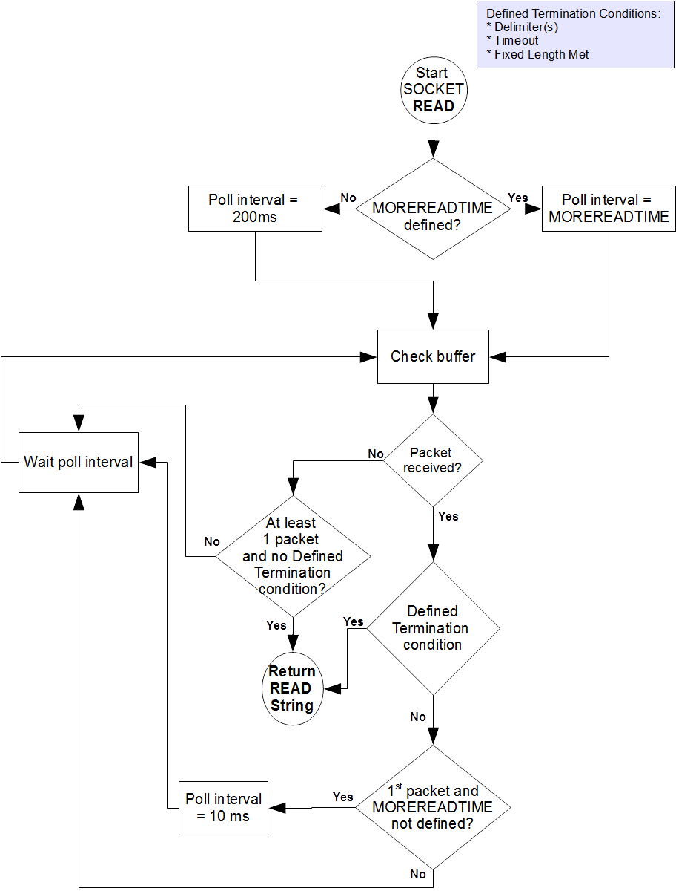

.. index::
   Input/Output Processing

========================
Input/Output Processing
========================

.. contents::
   :depth: 2

This chapter describes the following topics which relate to input and output processing:

* Input/Output Intrinsic Special Variables, and their Maintenance : YottaDB/GT.M provides several intrinsic special variables that allow processes to examine, and in some cases change, certain aspects of the input/output (I/O) processing. The focus in this chapter is how YottaDB/GT.M handles the standard ones, such as $IO, $X, $Y, and those that are YottaDB/GT.M-specific (for example, $ZA, $ZB).

* Input/Output Devices: Each device type supported by YottaDB/GT.M responds to a particular subset of deviceparameters, while ignoring others. Devices may be programmed in a device-specific manner, or in a device-independent manner. This chapter discusses each device type, and provides tables of their deviceparameters.

* Input/Output Commands and their Deviceparameters: YottaDB/GT.M bases its I/O processing on a simple character stream model. YottaDB/GT.M does not use any pre-declared formats. This chapter describes the YottaDB/GT.M I/O commands OPEN, USE, READ, WRITE, and CLOSE.

OPEN, USE, and CLOSE commands accept deviceparameters, which are keywords that permit a YottaDB/GT.M program to control the device state. Some deviceparameters require arguments. The current ANSI standard for YottaDB/GT.M does not define the deviceparameters for all devices. This chapter includes descriptions of the YottaDB/GT.M deviceparameters in the sections describing each command.

.. note::
   The term "device" can refer to an entity manipulated by application code using Open, Use, Close, Read and Write commands as well as a device from the perspective of the operating system.  We endeavor herein to always make it clear from the context which meaning is intended.

----------------------------------
I/O Intrinsic Special Variables
----------------------------------

YottaDB/GT.M intrinsic special variables provide a mean for application code to communicate and manage the state of a device.

++++++++++++++++++++++++
Device Name Variables
++++++++++++++++++++++++

YottaDB/GT.M provides three intrinsic special variables that identify devices.

**$IO**

$I[O] contains the name of the current device specified by the last USE command. A SET command cannot modify $IO. USE produces the same $IO as USE $PRINCIPAL, but $P is the preferred construct.

**$PRINCIPAL**

A process inherits three open file descriptors from its parent - STDIN, STDOUT and STDERR - which can all map to different files or devices. YottaDB/GT.M provides no way for M application to access STDERR. Although STDIN and STDOUT may map to different devices, files, sockets, pipes, etc. in the operating system, M provides for only device $PRINCIPAL, to refers to both. At process startup, and when $PRINCIPAL is selected with a USE command, READ commands apply to STDIN and WRITE commands apply to STDOUT. The device type of the standard input determines which USE deviceparameters apply to $PRINCIPAL.

For an interactive process, $PRINCIPAL is the user's terminal. YottaDB/GT.M ignores a CLOSE of the principal device. YottaDB/GT.M does not permit a SET command to modify $PRINCIPAL.

0 is an alternate for $PRINCIPAL (for example, USE 0). YottaDB/FIS recommends that application code use $PRINCIPAL. The environment variable gtm_principal can be used to set a string reported by YottaDB/GT.M for $PRINCIPAL and which can be used in lieu of $PRINCIPAL for the USE command.

**$ZIO**

$ZIO contains the translated name of the current device, in contrast to $IO, which contains the name as specified by the USE command.

++++++++++++++++++++++++++
Cursor Position Variables
++++++++++++++++++++++++++

YottaDB/GT.M provides two intrinsic special variables for determining the virtual cursor position. $X refers to the current column, while $Y refers to the current row.

**$X**

$X contains an integer value ranging from 0 to 65,535, specifying the horizontal position of a virtual cursor in the current output record. $X=0 represents the initial position on a new record or row.

Every OPENed device has a $X. However, YottaDB/GT.M only has access to $X of the current device.

Generally, in M mode YottaDB/GT.M increments $X for every character written to and read from the current device; see below for behavior of a UTF-8 mode device. YottaDB/GT.M format control characters, FILTER, and the device WIDTH and WRAP also have an effect on $X.

As $X is only a counter to help a program track output, SET $X does not reposition the cursor or perform any other IO. Conversely, if a sequence of characters sent to a terminal or other device with a WRITE causes it to be repositioned except as described below, $X will not reflect this change.

**$Y**

$Y contains an integer value ranging from 0 to 65,535, specifying the vertical position of a virtual cursor in the current output record. $Y=0 represents the top row or line.

Every OPEN device has a $Y. However, YottaDB/GT.M only accesses $Y of the current device.

When YottaDB/GT.M finishes the logical record in progress, it generally increments $Y. YottaDB/GT.M recognizes the end of a logical record when it processes certain YottaDB/GT.M format control characters, or when the record reaches its maximum size, as determined by the device WIDTH, and the device is set to WRAP. The definition of "logical record" varies from device to device. For an exact definition, see the sections on each device type. FILTER and the device LENGTH also have an effect on $Y.

As $Y is only a counter to help a program track output, SET $Y does not reposition the cursor or perform any other IO. Conversely, if a sequence of characters sent to a terminal or other device with a WRITE causes it to be repositioned except as described below, $Y will not reflect this change. 

**Maintenance of $X and $Y**

The following factors affect the maintenance of the virtual cursor position ($X and $Y):

* The bounds of the virtual "page"
* Format control characters
* YottaDB/GT.M character filtering

Each device has a WIDTH and a LENGTH that define the virtual "page." The WIDTH determines the maximum size of a record for a device, while the LENGTH determines how many records fit on a page. YottaDB/GT.M starts a new record when the current record size ($X) reaches the maximum WIDTH and the device has WRAP enabled. When the current line ($Y) reaches the maximum LENGTH, YottaDB/GT.M starts a new page.

YottaDB/GT.M has several format control characters (used in the context of a WRITE command) that allow the manipulation of the virtual cursor. For all I/O devices, the YottaDB/GT.M format control characters do the following:

* ! Sets $X to zero (0) and increments $Y, and terminates the logical record in progress. The definition of "logical record" varies from device to device, and is discussed in each device section.
* # Sets $X and $Y to zero (0), and terminates the logical record in progress.
* ?n If n is greater than $X, writes n-$X spaces to the device, bringing $X to n. If n is less than or equal to $X, ?n has no effect. When WRAP is enabled and n exceeds the WIDTH of the line, WRITE ?n increments $Y and sets $X equal to n#WIDTH, where # is the YottaDB/GT.M modulo operator.

In UTF-8 mode, YottaDB/GT.M maintains $X in the following measurement units:

+--------------------------------------------+--------------------------------------------------+---------------------------------------------------+
| Devices                                    | Input                                            | Output                                            |
+============================================+==================================================+===================================================+
| FIFO                                       | code points                                      | display columns                                   |
+--------------------------------------------+--------------------------------------------------+---------------------------------------------------+
| PIPE                                       | code points                                      | display columns                                   |
+--------------------------------------------+--------------------------------------------------+---------------------------------------------------+
| SD                                         | code points                                      | display columns                                   |
+--------------------------------------------+--------------------------------------------------+---------------------------------------------------+
| SOC                                        | code points                                      | code points                                       |
+--------------------------------------------+--------------------------------------------------+---------------------------------------------------+
| TRM                                        | display columns                                  | display columns                                   |
+--------------------------------------------+--------------------------------------------------+---------------------------------------------------+

YottaDB/GT.M provides two modes of character filtering. When filtering is enabled, certain <CTRL> characters and/or escape sequences have special effects on the cursor position (for example, <BS> (ASCII 8) may decrement $X, if $X is non-zero). For more information on write filtering, refer to “FILTER”.

+++++++++++++++++++++++++++++++++
Status Variables
+++++++++++++++++++++++++++++++++

**$DEVICE**

If the last commanded resulted in no error-condition, the value of $DEVICE, when interpreted as a truth-value is 0 (FALSE). If the status of the device reflect any error-condition, the value of $DEVICE, when interpreted as a truth-value is 1 (TRUE).

For PIPE :

0 indicates for READ with a zero (0) timeout that available data has been read.

"1,Resource temporarily unavailable" indicates no input available for a READ with a zero (0) timeout.

"1,<error signature>" indicates a read error.

0 indicates for a WRITE that it was successful.

"1,Resource temporarily unavailable" indicates a failure of a WRITE where the pipe is full and the WRITE would block.

This condition also causes an exception.

"1,<error signature>" indicates a write error 

**$KEY**

$K[EY] contains the string that terminated the most recent READ command from the current device (including any introducing and terminating characters). If no READ command is issued to the current device or if no terminator is used, the value of $KEY is an empty string.

For PIPE:

$KEY contains the UNIX process id of the created process shell which executes the command connected to the PIPE.

For more information, refer to “$Key”.

**$ZA**

$ZA contains the status of the last read on the device. The value is a decimal integer with a meaning as follows:

For Terminal I/O:

0: Indicates normal termination of a read operation

1: Indicates a parity error

2: Indicates the terminator sequence was too long

9: Indicates a default for all other errors

For Sequential Disk :

0: Indicates normal termination of a read operation

9: Indicates a failure of a read operation

For FIFO:

0: Indicates normal termination or time out

9: Indicates a failure of a read operation

For SOCKET:

0: Indicates normal termination or time out

9: Indicates failure of a read operation

For PIPE:

0: Indicates normal termination or time out when using READ x:n, where n >0

9: Indicates failure of a READ x or READ x:n, where n>0

9: Indicates failure of a WRITE where the pipe is full and the WRITE would block

.. note::
   $ZA refers to the status of the current device. Therefore, exercise care in sequencing USE commands and references to $ZA.

**$ZB**

$ZB contains a string specifying the input terminator for the last terminal READ. $ZB is null, and it is not maintained for devices other than terminals. $ZB may contain any legal input terminator, such as <CR> (ASCII 13) or an escape sequence starting with <ESC> (ASCII 27), from zero (0) to 15 bytes in length. $ZB is null for any READ terminated by a timeout or any fixed-length READ terminated by input reaching the maximum length.

$ZB contains the actual character string, not a sequence of numeric ASCII codes.

If a device is opened with CHSET set to UTF-8 or UTF-16*, $ZB contains the bad character if one is encountered. This holds true for sockets, sequential files (and thus FIFOs and PIPEs) and terminals.

Example:

.. parsed-literal::
   set zb=$zb for i=1:1:$length(zb) write !,i,?5,$ascii(zb,i)

This example displays the series of ASCII codes for the characters in $ZB.

$ZB refers to the last READ terminator of the current device. Therefore, be careful when sequencing USE commands and references to $ZB. 

**$ZEOF**

$ZEOF contains a truth-valued expression indicating whether the last READ operation reached the end-of-file. $ZEOF is TRUE(1) at EOF and FALSE (0) at other positions. GT.M does not maintain $ZEOF for terminal devices.

$ZEOF refers to the end-of-file status of the current device. Therefore, be careful when sequencing USE commands and references to $ZEOF.

$ZEOF is set for terminals if the connection dropped on read. 

**$ZPIN**

When $PRINCIPAL has different input/output devices, the USE command recognizes intrinsic special variable $ZPIN to apply appropriate deviceparameters to the input side of $PRINCIPAL. A USE with $ZPIN sets $IO to $PRINCIPAL for READs and WRITEs from the input and output side of $PRINCIPAL. $ZSOCKET() also accepts $ZPIN as its first argument and, if the device is a split SOCKET device, supplies information on the input SOCKET device. In any context other than USE or $ZSOCKET(), or if $PRINCIPAL is not a split device, $PRINCIPAL, $ZPIN and $ZPOUT are synonyms. In the case of a split $PRINCIPAL, $ZPIN returns the value of $PRINCIPAL followed by the string "< /" Any attempt to OPEN $ZPIN results in a DEVOPENFAIL error. 

**$ZPOUT**

When $PRINCIPAL has different input/output devices, the USE command recognizes intrinsic special variables $ZPOUT to apply appropriate deviceparameters to the output side of $PRINCIPAL. A USE with $ZPOUT sets $IO to $PRINCIPAL for READs and WRITEs from the input and output side of $PRINCIPAL. $ZSOCKET() also accepts $ZPOUT as its first argument and, ifthe device is a split SOCKET device, supplies information on the output SOCKET device. In any context other than USE or $ZSOCKET(), or if $PRINCIPAL is not a split device, $PRINCIPAL, $ZPIN and $ZPOUT are synonyms. In the case of a split $PRINCIPAL, $ZPOUT returns the value of $PRINCIPAL followed by the string "> /" Any attempt to OPEN $ZPOUT results in a DEVOPENFAIL error.

-------------------
I/O Devices
-------------------

Each device type supported by YottaDB/GT.M responds to a particular subset of deviceparameters, while ignoring others. Devices may be programmed in a device-specific manner, or in a device-independent manner. Device-specific I/O routines are intended for use with only one type of device. Device-independent I/O routines contain appropriate deviceparameters for all devices to be supported by the function, so the user can redirect to a different device output while using the same program.

YottaDB/GT.M supports the following I/O device types:

* Terminals and Printers
* Sequential Disk Files
* FIFOs
* Null Devices
* Socket Devices
* PIPE Devices

++++++++++++++++++++++++
I/O Device Recognition
++++++++++++++++++++++++

YottaDB/GT.M OPEN, USE, and CLOSE commands have an argument expression specifying a device name.

During an OPEN, YottaDB/GT.M attempts to resolve the specified device names to physical names. When YottaDB/GT.M successfully resolves a device name to a physical device, that device becomes the target of the OPEN. If the device name contains a dollar sign ($), YottaDB/GT.M attempts an environment variable translation; the result becomes the name of the device. If it does not find such an environment variable, it assumes that the dollar sign is a part of the filename, and opens a file by that name.

.. note::
   Note: YottaDB/GT.M resolves the device name argument for menemonicspace devices (SOCKET or PIPE) to a arbitrary handle instead of a physical name.

Once a device is OPEN, YottaDB/GT.M establishes an internal correspondence between a name and the device or file. Therefore, while the device is OPEN, changing the translation of an environment variable in the device specification does not change the device.

The following names identify the original $IO for the process:

* $PRINCIPAL
* 0

++++++++++++++++++++++++++++++
Device Specification Defaults
++++++++++++++++++++++++++++++

YottaDB/GT.M uses standard filenames for device specifiers.

The complete format for a filename is:

.. parsed-literal::
   /directory/file

If the expression specifying a device does not contain a complete filename, the expression may start with an environment variable that translates to one or more leading components of the filename. YottaDB/GT.M applies default values for the missing components.

If the specified file is not found, it is created unless READONLY is specified.

The YottaDB/GT.M filename defaults are the following:

Directory: Current working directory

File: No default (user-defined filename)

Filetype: No default (user-defined filetype)

+++++++++++++++++++++++++++++++
How I/O Device Parameters Work
+++++++++++++++++++++++++++++++

I/O deviceparameters either perform actions that cause the device to do something (for example, CLEARSCREEN), or specify characteristics that modify the way the device subsequently behaves (for example, WIDTH). When an I/O command has multiple action deviceparameters, YottaDB/GT.M performs the actions in the order of the deviceparameters within the command argument. When a command has characteristic deviceparameters, the last occurrence of a repeated or conflicting deviceparameter determines the characteristic.

Deviceparameters often relate to a specific device type. YottaDB/GT.M ignores any deviceparameters that do not apply to the type of the device specified by the command argument. Specified device characteristics are in force for the duration of the YottaDB/GT.M image, or until modified by an OPEN, USE, or CLOSE command.

When reopening a device that it previously closed, a YottaDB/GT.M process restores all characteristics not specified on the OPEN to the values the device had when it was last CLOSEd. YottaDB/GT.M treats FIFO, PIPE, and SD differently and uses defaults for unspecified device characteristics on every OPEN (that is, YottaDB/GT.M does not retain devices characteristics on a CLOSE of SD, FIFO, and PIPE).

The ZSHOW command with an argument of "D" displays the current characteristics for all devices OPENed by the process. ZSHOW can direct its output into a YottaDB/GT.M variable. For more information on ZSHOW, refer to “ZSHow”.

+++++++++++++++++++++++++++++++
Abbreviating Device Parameters
+++++++++++++++++++++++++++++++

.. note::
   Most Z* deviceparameters have the same functionality as their counterparts and are supported for compatibility reasons.

YottaDB/GT.M deviceparameters do not have predefined abbreviations. YottaDB/GT.M recognizes deviceparameters using a minimum recognizable prefix technique. Most deviceparameters may be represented by four leading characters, except ERASELINE, all deviceparameters starting with WRITE, and Z* deviceparameters in a mnemonicspace (such as SOCKET). The four leading characters recognized do not include a leading NO for negation.

For compatibility with previous versions, YottaDB/GT.M may recognize certain deviceparameters by abbreviations shorter than the minimum. While it is convenient in Direct Mode to use shorter abbreviations, YottaDB/FIS may add additional deviceparameters, and therefore, recommends all programs use at least four characters. Because YottaDB/GT.M compiles the code, spelling out deviceparameters completely has no performance penalty, except when used with indirection or XECUTEd arguments.

+++++++++++++++++++++++++++
Document Conventions
+++++++++++++++++++++++++++

This chapter uses the following mnemonics to describe when a deviceparameter applies:

TRM: Valid for terminals

SD: Valid for sequential disk files

FIFO: Valid for FIFOs

NULL: Valid for null devices

SOC: Valid for both socket devices (TCP and LOCAL)

SOC(LOCAL): Valid for LOCAL sockets devices

SOC(TCP): Valid for TCP sockets devices

PIPE: Valid for PIPE devices

.. note::
   Lower case "pipe" refers to a UNIX pipe and the upper case "PIPE" to the YottaDB/GT.M device.

Some of the deviceparameter defaults shown are the basic operating system defaults, and may be subject to modification before the invocation of YottaDB/GT.M.

+++++++++++++++++++++++++++++++
Device-Independent Programming
+++++++++++++++++++++++++++++++

When a user may choose a device for I/O, YottaDB/GT.M routines can take one of two basic programming approaches.

* The user selection directs the program into different code branches, each of which handles a different device type.
* The user selection identifies the device. There is a single code path written with a full complement of deviceparameters to handle all selectable device types.

The latter approach is called device-independent programming. To permit device independent programming, YottaDB/GT.M uses the same deviceparameter for all devices that have an equivalent facility, and ignores deviceparameters applied to a device that does not support that facility.

Example:

.. parsed-literal::
   OPEN dev:(EXCE=exc:REWIND:VARIABLE:WRITEONLY)

This example OPENs a device with deviceparameters that affect different devices. The EXCEPTION has an effect for all device types. When dev is a terminal or a null device, YottaDB/GT.M ignores the other deviceparameters. When dev is a sequential file on disk, YottaDB/GT.M uses REWIND and VARIABLE. This command performs a valid OPEN for all the different device types.

------------------------------
Using Terminals
------------------------------

A YottaDB/GT.M process assigns $PRINCIPAL to the UNIX standard input of the process (for READ) and standard output (for WRITE). For a local interactive process, $PRINCIPAL identifies the "terminal" from which the user is signed on.

While all terminals support the CTRAP deviceparameter, only $PRINCIPAL supports CENABLE. While CTRAP allows terminal input to redirect program flow, CENABLE allows the terminal user to invoke the Direct Mode.

Directly connected printers often appear to YottaDB/GT.M as a terminal (although printers generally do not provide input) regardless of whether the printer is connected to the computer with a high speed parallel interface, or an asynchronous terminal controller. 

+++++++++++++++++++++++++++++++++
Setting Terminal Characteristics
+++++++++++++++++++++++++++++++++

YottaDB/GT.M does not isolate its handling of terminal characteristics from the operating system environment at large. YottaDB/GT.M inherits the operating system terminal characteristics in effect at the time the YottaDB/GT.M image is invoked. When YottaDB/GT.M exits, the terminal characteristics known by the operating system are restored.

However, if the process temporarily leaves the YottaDB/GT.M environment with a ZSYSTEM command , YottaDB/GT.M does not recognize any changes to the terminal characteristics left by the external environment. This may cause disparities between the physical behavior of the terminal, and the perceived behavior by YottaDB/GT.M.

UNIX enforces standard device security for explicit OPENs of terminals other than the sign-in terminal ($PRINCIPAL). If you are unable to OPEN a terminal, contact your system manager.

USE of a terminal causes the device driver to flush the output buffer. This feature of the USE command provides routine control over the timing of output, which is occasionally required. However, it also means that redundant USE commands may induce an unnecessary performance penalty. Therefore, YottaDB/FIS recommends restricting USE commands to redirecting I/O, modifying deviceparameters, and initiating specifically required flushes.

The terminal input buffer size is fixed at 1024 on UNIX and a variable read terminates after 1023 characters. 

**Setting the Environment Variable TERM**

The environment variable $TERM must specify a terminfo entry that accurately matches the terminal (or terminal emulator) settings. Refer to the terminfo man pages for more information on the terminal settings of the platform where YottaDB/GT.M needs to run.

Some terminfo entries may seem to work properly but fail to recognize function key sequences or position the cursor properly in response to escape sequences from YottaDB/GT.M. YottaDB/GT.M itself does not have any knowledge of specific terminal control characteristics. Therefore, it is important to specify the right terminfo entry to let YottaDB/GT.M communicate correctly with the terminal. You may need to add new terminfo entries depending on their specific platform and implementation. The terminal (emulator) vendor may also be able to help.

YottaDB/GT.M uses the following terminfo capabilities. The full variable name is followed by the capname in parenthesis:

.. parsed-literal::
   auto_right_margin(am), clr_eos(ed), clr_eol(el), columns(cols), cursor_address(cup), cursor_down(cud1),cursor_left(cub1), cursor_right(cuf1), cursor_up(cuu1), eat_newline_glitch(xenl), key_backspace(kbs), key_dc(kdch1),key_down(kcud1), key_left(kcub1), key_right(kcuf1), key_up(kcuu1), key_insert(kich1), keypad_local(rmkx),keypad_xmit(smkx), lines(lines). 

YottaDB/GT.M sends keypad_xmit before terminal reads for direct mode and READs (other than READ \*) if EDITING is enabled. YottaDB/GT.M sends keypad_local after these terminal reads.

++++++++++++++++++++++++++++++
Logical Records for Terminals
++++++++++++++++++++++++++++++

A logical record for a terminal equates to a line on the physical screen. The WIDTH device characteristic specifies the width of the screen, while the LENGTH device characteristic specifies the number of lines on the screen. 

+++++++++++++++++++++++++++++
Read \* Command for Terminals
+++++++++++++++++++++++++++++

If the terminal has ESCAPE sequencing enabled, and the input contains a valid escape sequence or a terminator character, YottaDB/GT.M stores the entire sequence in $ZB and returns the ASCII representation of the first character.

Example:

.. parsed-literal::
   GTM>kill
   GTM>use $principal:escape
   GTM>read \*x set zb=$zb zwrite
   (Press the F11 key on the VT220 terminal keyboard)
   x=27
   zb=$C(27)_"[23~"

This enters an escape sequence in response to a READ \*. The READ * assigns the code for <ESC> to the variable X. YottaDB/GT.M places the entire escape sequence in $ZB. As some of the characters are not graphic, that is, visible on a terminal, the example transfers the contents of $ZB to the local variable ZB and uses a ZWRITE so that the non-graphic characters appear in $CHAR() format.

When escape processing is disabled, READ \*x returns 27 in x for an <ESC>. If the escape introducer is also a TERMINATOR, $ZB has a string of length one (1), and a value of the $ASCII() representation of the escape introducer; otherwise, $ZB holds the empty string. YottaDB/GT.M stores the remaining characters of the escape sequence in the input stream. A READ command following a READ * command returns the remaining characters of the escape sequence.

Example:

.. parsed-literal::
   GTM>kill
   GTM>use $principal:(noescape:term=$char(13))
   GTM>read \*x set zb=$zb read y:0 zwrite
   (Press the F11 key on the terminal keyboard)
   [23~x=27
   y="[23~"
   zb=""
   GTM>use $principal:noecho read \*x set zb=$zb read y:0 use $principal:echo zwrite
   x=27
   y="[23~"
   zb=""
   GTM>read \*x set zb=$zb use $principal:flush read y:0 zwrite
   x=27
   y=""
   zb=""

While the first READ Y:0 picks up the sequence after the first character, notice how the graphic portion of the sequence appears on the terminal – this is because the READ \*X separated the escape character from the rest of the sequence thus preventing the terminal driver logic from recognizing it as a sequence, and suppressing its echo. The explicit suppression of echo removes this visual artifact. In the case of the final READ \*X, the FLUSH clears the input buffer so that it is empty by the time of the READ Y:0.

++++++++++++++++++++++++++++++++++++
READ X#maxlen Command for Terminals
++++++++++++++++++++++++++++++++++++

Generally, YottaDB/GT.M performs the same maintenance on $ZB for a READ X#maxlen as for a READ. However, if the READ X#maxlen terminates because the input has reached the maximum length, YottaDB/GT.M sets $ZB to null. When the terminal has ESCAPE sequencing enabled, and the input contains an escape sequence, YottaDB/GT.M sets $ZB to contain the escape sequence.

+++++++++++++++++++++++++++++++++
Terminal Deviceparameter Summary
+++++++++++++++++++++++++++++++++

The following tables provide a brief summary of deviceparameters for terminals, grouped into related areas. For detailed information, refer to “Open”, “Use”, and “Close”.

**Error Processing Deviceparameters**

+-----------------------------------------+-----------------------------+------------------------------------------------+
| Device Parameter                        | Command                     | Comment                                        |
+=========================================+=============================+================================================+
| EXCEPTION=expr                          | O/U/C                       | Controls device-specific error handling.       |
+-----------------------------------------+-----------------------------+------------------------------------------------+

**Interaction Management Deviceparameters**

+-------------------------------+--------------------------+---------------------------------------------------------------------------------------------------+
| Device Parameter              | Command                  | Comment                                                                                           |
+===============================+==========================+===================================================================================================+
| [NO]CENABLE                   | U                        | Controls whether <CTRL-C> on $PRINCIPAL causes YottaDB/GT.M to go to direct mode.                 |
+-------------------------------+--------------------------+---------------------------------------------------------------------------------------------------+
| CTRAP=expr                    | U                        | Controls vectoring on trapped <CTRL> characters.                                                  |
+-------------------------------+--------------------------+---------------------------------------------------------------------------------------------------+
| [NO]EDITING                   | U                        | Controls the editing mode for $PRINCIPAL.                                                         |
+-------------------------------+--------------------------+---------------------------------------------------------------------------------------------------+
| [NO]EMPTERM                   | U                        | Control whether an "Erase" character on an empty input line should terminate a READ or READ #     |
|                               |                          | command.                                                                                          |
+-------------------------------+--------------------------+---------------------------------------------------------------------------------------------------+
| [NO]ESCAPE                    | U                        | Controls escape sequence processing.                                                              |
+-------------------------------+--------------------------+---------------------------------------------------------------------------------------------------+
| [NO]INSERT                    | U                        | Controls insert or overstrike on input.                                                           |
+-------------------------------+--------------------------+---------------------------------------------------------------------------------------------------+
| [NO]PASTHRU                   | U                        | Controls interpretation by the operating system of special control characters (for example        |
|                               |                          | <CTRL-B>).                                                                                        |
+-------------------------------+--------------------------+---------------------------------------------------------------------------------------------------+
| [NO]TERMINATOR[=expr]         | U                        | Controls characters that end a READ                                                               |
+-------------------------------+--------------------------+---------------------------------------------------------------------------------------------------+

**Flow Control Deviceparameters**

+-------------------------------+--------------------------+---------------------------------------------------------------------------------------------------+
| Device Parameter              | Command                  | Comment                                                                                           |
+===============================+==========================+===================================================================================================+
| [NO]CONVERT                   | U                        | Controls forcing input to uppercase.                                                              |
+-------------------------------+--------------------------+---------------------------------------------------------------------------------------------------+
| [NO]FILTER                    | U                        | Controls some $X, $Y maintenance.                                                                 |
+-------------------------------+--------------------------+---------------------------------------------------------------------------------------------------+
| FLUSH                         | U                        | Clears the typeahead buffer.                                                                      |
+-------------------------------+--------------------------+---------------------------------------------------------------------------------------------------+
| [NO]HOSTSYNC                  | U                        | Controls host's use of XON/XOFF.                                                                  |
+-------------------------------+--------------------------+---------------------------------------------------------------------------------------------------+
| [NO]READSYNC                  | U                        | Controls wrapping READs in XON/XOFF.                                                              |
+-------------------------------+--------------------------+---------------------------------------------------------------------------------------------------+
| [NO]TTSYNC                    | U                        | Controls input response to XON/XOFF.                                                              |
+-------------------------------+--------------------------+---------------------------------------------------------------------------------------------------+
| [NO]TYPEAHEAD                 | U                        | Controls unsolicited input handling.                                                              |
+-------------------------------+--------------------------+---------------------------------------------------------------------------------------------------+

**Screen Management Deviceparameters**

+-------------------------------+--------------------------+---------------------------------------------------------------------------------------------------+
| Device Parameter              | Command                  | Comment                                                                                           |
+===============================+==========================+===================================================================================================+
| CLEARSCREEN                   | U                        | Clears from cursor to end-of-screen.                                                              |
+-------------------------------+--------------------------+---------------------------------------------------------------------------------------------------+
| DOWNSCROLL                    | U                        | Moves display down one line.                                                                      |
+-------------------------------+--------------------------+---------------------------------------------------------------------------------------------------+
| [NO]ECHO                      | U                        | Controls the host echo of input.                                                                  |
+-------------------------------+--------------------------+---------------------------------------------------------------------------------------------------+
| ERASELINE                     | U                        | Clears from cursor to end-of-line.                                                                |
+-------------------------------+--------------------------+---------------------------------------------------------------------------------------------------+
| [Z]LENGTH=intexpr             | U                        | Controls maximum number of lines on a page ($Y).                                                  |
+-------------------------------+--------------------------+---------------------------------------------------------------------------------------------------+
| UPSCROLL                      | U                        | Moves display up one line.                                                                        |
+-------------------------------+--------------------------+---------------------------------------------------------------------------------------------------+
| [Z]WIDTH=intexpr              | U                        | Controls the maximum width of an output line ($X).                                                |
+-------------------------------+--------------------------+---------------------------------------------------------------------------------------------------+
| [Z][NO]WRAP                   | U                        | Controls handling of output lines longer than the maximum width.                                  |
+-------------------------------+--------------------------+---------------------------------------------------------------------------------------------------+
| X=intexpr                     | U                        | Positions the cursor to column intexpr.                                                           |
+-------------------------------+--------------------------+---------------------------------------------------------------------------------------------------+
| Y=intexpr                     | U                        | Positions the cursor to row intexpr.                                                              |
+-------------------------------+--------------------------+---------------------------------------------------------------------------------------------------+

**O** : Applies to the OPEN command

**U** : Applies to the USE command

**C** : Applies to the CLOSE command

+++++++++++++++++++++
Terminal Examples
+++++++++++++++++++++

This section contains examples of YottaDB/GT.M terminal handling.

Example:

.. parsed-literal::
   use $principal:(exception="zg "_$zl\_":C^MENU")

This example USEs the principal device, and sets up an EXCEPTION handler. When an error occurs, it transfers control to label C in the routine ^MENU at the process stack level where the EXCEPTION was established.

Example:

.. parsed-literal::
   use $principal:(x=0:y=0:clearscreen)

This example positions the cursor to the upper left-hand corner and clears the entire screen.

Example:

.. parsed-literal::
   use $principal:(noecho:width=132:wrap)

This example disables ECHOing, enables automatic WRAPping, and sets the line width to 132 characters.

Note that YottaDB/GT.M enables WRAP automatically when you specify the WIDTH deviceparameter.

Example:

.. parsed-literal::
   use $principal:nocenable

This example disables <CTRL-C>.

--------------------------
Using Sequential Files
--------------------------

YottaDB/GT.M provides access to sequential files. These files allow linear access to records. Sequential files are used to create programs, store reports, and to communicate with facilities outside of YottaDB/GT.M.

+++++++++++++++++++++++++++++++++++++++++
Setting Sequential File Characteristics
+++++++++++++++++++++++++++++++++++++++++

The ANSI standard specifies that when a process CLOSEs and then reOPENs a device, YottaDB/GT.M restores any characteristics not explicitly specified with deviceparameters to the values they had prior to the last CLOSE. However, because it is difficult for a large menu-driven application to ensure the previous OPEN state, YottaDB/GT.M always sets unspecified sequential file characteristics to their default value on OPEN. This approach also reduces potential memory overhead imposed by OPENing and CLOSEing a large number of sequential files during the life of a process.

YottaDB/GT.M does not restrict multiple OPEN commands. However, if a file is already open, YottaDB/GT.M ignores attempts to modify sequential file OPEN characteristics, except for RECORDSIZE and for deviceparameters that also exist for USE.

Sequential files can be READONLY, or read/write (NOREADONLY).

Sequential files can be composed of either FIXED or VARIABLE (NOFIXED) length records. By default, records have VARIABLE length.

UNIX enforces its standard security when YottaDB/GT.M OPENs a sequential file. This includes any directory access required to locate or create the file. If you are unable to OPEN a file, contact your system manager.

++++++++++++++++++++++++++++++
Sequential File Pointers
++++++++++++++++++++++++++++++

Sequential file I/O operations use a construct called a file pointer. The file pointer logically identifies the next record to read or write. OPEN commands position the file pointer at the beginning of the file (REWIND) or at the end-of-file (APPEND). APPEND cannot reposition a file currently open. Because the position of each record depends on the previous record, a WRITE destroys the ability to reliably position the file pointer to subsequent records in a file. Therefore, by default (NOTRUNCATE), YottaDB/GT.M permits WRITEs only when the file pointer is positioned at the end of the file.

A file that has been previously created and contains data that should be retained can also be opened with the device parameter APPEND.

If a device has TRUNCATE enabled, a WRITE issued when the file pointer is not at the end of the file causes all contents after the current file pointer to be discarded. This effectively moves the end of the file to the current position and permits the WRITE.

++++++++++++++++++++++++
Line Terminators
++++++++++++++++++++++++

LF ($CHAR(10)) terminates the logical record for all M mode sequential files, TRM, PIPE, and FIFO. For non FIXED format sequential files and terminal devices for which character set is not M, all the standard Unicode line terminators terminate the logical record. These are U+000A (LF), U+0000D (CR), U+000D followed by U+000A (CRLF), U+0085 (NEL), U+000C (FF), U+2028 (LS) and U+2029 (PS). 

++++++++++++++++++++++++
READ/WRITE Operations
++++++++++++++++++++++++

The following table describes all READ and WRITE operations for STREAM, VARIABLE, and FIXED format sequential files having automatic record termination enabled (WRAP) or disabled (NOWRAP).

+-------------------------------+-------------------------------+-------------------------------------------------------------------------------------------------+------------------------------------------------------------------+
| Command                       | WRAP or NOWRAP                | STREAM or VARIABLE format file behavior                                                         | FIXED format file behavior                                       |
+===============================+===============================+=================================================================================================+==================================================================+
| READ format or WRITE or WRITE | WRAP                          | Write the entire argument, but anytime $X is about to exceed WIDTH: insert a <LF> character,    | Similar to VARIABLE but no <LF>                                  |
| \*                            |                               | set $X to 0, increment $Y                                                                       |                                                                  |
+-------------------------------+-------------------------------+-------------------------------------------------------------------------------------------------+------------------------------------------------------------------+
| READ format or WRITE or WRITE | NOWRAP                        | Update $X based on STREAM or VARIABLE format as described below:                                | Same as VARIABLE                                                 |
| \*                            |                               |                                                                                                 |                                                                  |
|                               |                               | STREAM: Write all of the argument with no truncation nor with a line terminator being inserted. |                                                                  |
|                               |                               | Add length of argument to $X.                                                                   |                                                                  |
|                               |                               |                                                                                                 |                                                                  |
|                               |                               | VARIABLE ($X=WIDTH): Write up to WIDTH-$X characters. Write no more output to the device until a|                                                                  |
|                               |                               | WRITE ! or a SET $X makes $X less than WIDTH.                                                   |                                                                  |
+-------------------------------+-------------------------------+-------------------------------------------------------------------------------------------------+------------------------------------------------------------------+
| READ or WRITE !               | either                        | Write <LF>, set $X to 0, increment $Y                                                           | Write PAD bytes to bring the current record to WIDTH             |
+-------------------------------+-------------------------------+-------------------------------------------------------------------------------------------------+------------------------------------------------------------------+
| WRITE #                       | either                        | Write <FF>,<LF>, set $X to 0, increment $Y                                                      | Write PAD bytes to bring the current record to WIDTH, then a <FF>|
|                               |                               |                                                                                                 | followed by WIDTH-1 PAD bytes                                    |
+-------------------------------+-------------------------------+-------------------------------------------------------------------------------------------------+------------------------------------------------------------------+
| CLOSE                         | either                        | After a WRITE, if $X > 0, Write <LF>                                                            | After a WRITE, if $X >0, perform an implicit "WRITE !" adding PAD|
|                               |                               |                                                                                                 | bytes to create a full record. If you need to avoid trailing PAD |
|                               |                               |                                                                                                 | bytes set $X to 0 before closing a FIXED format file.            |
+-------------------------------+-------------------------------+-------------------------------------------------------------------------------------------------+------------------------------------------------------------------+
| READ X                        | either                        | Return characters up to $X=WIDTH, or until encountering an <LF> or EOF. If <LF> encountered, set| Return WIDTH characters; no maintenance of $X and $Y, except that|
|                               |                               | $X to 0, increment $Y                                                                           | EOF increments $Y                                                |
+-------------------------------+-------------------------------+-------------------------------------------------------------------------------------------------+------------------------------------------------------------------+
| READ X#len                    | either                        | Return characters up to the first of $X=WIDTH or len characters, or encountering a <LF> or EOF; | Return MIN(WIDTH, len) characters; no maintenance of $X and $Y,  |
|                               |                               | if up to len characters or EOF update $X, otherwise set $X to 0 and increment $Y                | except that EOF increments $Y                                    |
+-------------------------------+-------------------------------+-------------------------------------------------------------------------------------------------+------------------------------------------------------------------+
| READ \*X                      | either                        | Return the code for one character and increment $X, if WIDTH=$X or <LF> encountered, set $X=0,  | Return the code for one character, if EOF return -1; no          |
|                               |                               | increment $Y; if EOF return -1                                                                  | maintenance of $X and $Y, except that EOF increments $Y          |
+-------------------------------+-------------------------------+-------------------------------------------------------------------------------------------------+------------------------------------------------------------------+

**Notes**

* EOF == end-of-file; <FF>== ASCII form feed; <LF> == ASCII line feed; 
* In M mode, and by default in UTF-8 mode PAD == <SP> == ASCII space.
* "READ format" in this table means READ ? or READ <strlit>
* A change to WIDTH implicitly sets WRAP unless NOWRAP follows in the deviceparameter list
* In VARIABLE and STREAM mode, READ (except for READ \*) never returns <LF> characters
* In M mode, the last setting of RECORDSIZE or WIDTH for the device determines WIDTH
* In M Mode, a WRITE to a sequential device after setting $X to a value greater than the device WIDTH or a reducing WIDTH to less than the current $X acts as if the first character caused $X to exceed the WIDTH induces an immediate WRAP, if WRAP is enabled
* In UTF-8 mode, RECORDSIZE is in bytes and WIDTH is in characters and the smaller acts as the WIDTH limit in the table.
* In UTF-8 mode, FIXED mode writes <SP> to the RECORDSIZE when the next character won't fit.
* In UTF-8 mode, all READ forms do not return trailing  PAD characters.
* In UTF-8 mode, all characters returned by all forms of FIXED mode READ are from a single record. 
* WRITE for a Sequential Disk (SD) device works at the current file position, whether attained with APPEND, REWIND or SEEK.
* YottaDB/GT.M manages any BOM for UTF mode files by ensuring they are at the beginning of the file and produces a BOMMISMATCH error for an attempt to change the byte-ordering on OPEN for an existing file.
* An attempt to OPEN a non-zero length file WRITEONLY without either NEWVERSION or TRUNCATE in UTF mode produces an OPENDEVFAIL due to the fact that any existing BOM information cannot be verified.
* Note that with YottaDB/GT.M SD encryption, because of the state information associated with encryption processing, encrypted files require the file to be WRITEn or READ from the beginning rather than from an arbitrary position. 

++++++++++++++++++++++++++++
Writing Binary Files
++++++++++++++++++++++++++++

To write a binary data file, open it with FIXED:WRAP:CHSET="M" and set $X to zero before the WRITE to avoid filling the last record with spaces (the default PAD byte value). 

.. note::
   With CHSET not "M", FIXED has a different definition. Each record is really the same number of bytes as specified by RECORDSIZE. Padding bytes are added as needed to each record.

Example:

.. parsed-literal::
   bincpy(inname,outname); YottaDB/GT.M routine to do a binary copy from file named in argument 1 to file named in argument 2
           ;
     new adj,nrec,rsize,x
     new $etrap
     set $ecode="",$etrap="goto error",$zstatus=""
     set rsize=32767                          ; max recordsize that keeps $X on track
     open inname:(readonly:fixed:recordsize=rsize:exception="goto eof")
     open outname:(newversion:stream:nowrap:chset="M")
     for nrec=1:1 use inname read x use outname write x
   eof     
     if $zstatus["IOEOF" do  quit
     . set $ecode=""
     . close inname
     . use outname
     . set adj=$x
     . set $x=0 close outname
     . write !,"Copied ",$select((nrec-1)<adj:adj,1:((nrec-1)*rsize)+adj)," bytes from ",inname," to ",outname
     else  use $principal write !,"Error with file ",inname,":"
  error   
     write !,$zstatus
     close inname,outname
     quit

++++++++++++++++++++++++++++++++++++++++
Sequential File Deviceparameter Summary
++++++++++++++++++++++++++++++++++++++++

The following tables provide a brief summary of deviceparameters for sequential files grouped into related areas. For more detailed information, refer to “Open”, “Use”, and “Close”.

**Error Processing Deviceparameters**

+-----------------------------------+--------------------------+---------------------------------------------------------------------+
| Deviceparameter                   | Command                  | Comment                                                             |
+===================================+==========================+=====================================================================+
| EXCEPTION=expr                    | O/U/C                    | Controls device-specific error handling.                            |
+-----------------------------------+--------------------------+---------------------------------------------------------------------+

**File Pointer Positioning Deviceparameters**

+-----------------------------------+--------------------------+------------------------------------------------------------------------------------------------------------------------------------------------------+
| Deviceparameter                   | Command                  | Comment                                                                                                                                              |
+===================================+==========================+======================================================================================================================================================+
| APPEND                            | O                        | Positions file pointer at EOF.                                                                                                                       |
+-----------------------------------+--------------------------+------------------------------------------------------------------------------------------------------------------------------------------------------+
| REWIND                            | O/U/C                    | Positions file pointer at start of the file.                                                                                                         |
+-----------------------------------+--------------------------+------------------------------------------------------------------------------------------------------------------------------------------------------+
| SEEK=strexpr                      | O/U                      | Positions the current file pointer to the location specified in strexpr. The format of strexpr is a string of the form "[+|-]integer" where unsigned |
|                                   |                          | value specifies an offset from the beginning of the file, and an explicitly signed value specifies an offset relative to the current file position.  |
|                                   |                          | For STREAM or VARIABLE format, the positive intexpr after any sign is a byte offset, while for a FIXED format, it is a record offset. In order to    |
|                                   |                          | deal with the possible presence of a Byte Order Marker (BOM), SEEK for a FIXED format file written in a UTF character set must follow at least one   |
|                                   |                          | prior READ since the device was created.                                                                                                             |
+-----------------------------------+--------------------------+------------------------------------------------------------------------------------------------------------------------------------------------------+

**File Format Deviceparameters**

+-----------------------------------+--------------------------+------------------------------------------------------------------------------------------------------------------------------------------------------+
| Deviceparameter                   | Command                  | Comment                                                                                                                                              |
+===================================+==========================+======================================================================================================================================================+
| [NO]FIXED                         | O                        | Controls whether records have fixed length.                                                                                                          |
+-----------------------------------+--------------------------+------------------------------------------------------------------------------------------------------------------------------------------------------+
| [Z]LENGTH=intexpr                 | U                        | Controls virtual page length.                                                                                                                        |
+-----------------------------------+--------------------------+------------------------------------------------------------------------------------------------------------------------------------------------------+
| RECORDSIZE=intexpr                | O                        | Specifies maximum record size.                                                                                                                       |
+-----------------------------------+--------------------------+------------------------------------------------------------------------------------------------------------------------------------------------------+
| STREAM                            | O                        | Specifies the STREAM format.                                                                                                                         |
+-----------------------------------+--------------------------+------------------------------------------------------------------------------------------------------------------------------------------------------+
| VARIABLE                          | O                        | Controls whether records have variable length.                                                                                                       |
+-----------------------------------+--------------------------+------------------------------------------------------------------------------------------------------------------------------------------------------+
| [Z]WIDTH=intexpr                  | U                        | Controls maximum width of an output line.                                                                                                            |
+-----------------------------------+--------------------------+------------------------------------------------------------------------------------------------------------------------------------------------------+
| [Z][NO]WRAP                       | O/U                      | Controls handling of records longer than device width.                                                                                               |
+-----------------------------------+--------------------------+------------------------------------------------------------------------------------------------------------------------------------------------------+

**File Access Deviceparameters**

+-----------------------------------+--------------------------+------------------------------------------------------------------------------------------------------------------------------------------------------+
| Deviceparameter                   | Command                  | Comment                                                                                                                                              |
+===================================+==========================+======================================================================================================================================================+
| DELETE                            | C                        | Specifies file be deleted by CLOSE.                                                                                                                  |
+-----------------------------------+--------------------------+------------------------------------------------------------------------------------------------------------------------------------------------------+
| GROUP=expr                        | O/C                      | Specifies file permissions for other users in the owner's group.                                                                                     |
+-----------------------------------+--------------------------+------------------------------------------------------------------------------------------------------------------------------------------------------+
| NEWVERSION                        | O                        | Specifies YottaDB/GT.M create a new version of file.                                                                                                 |
+-----------------------------------+--------------------------+------------------------------------------------------------------------------------------------------------------------------------------------------+
| OWNER=expr                        | O/C                      | Specifies file permissions for the owner of file.                                                                                                    |
+-----------------------------------+--------------------------+------------------------------------------------------------------------------------------------------------------------------------------------------+
| [NO]READONLY                      | O                        | Controls read-only file access.                                                                                                                      |
+-----------------------------------+--------------------------+------------------------------------------------------------------------------------------------------------------------------------------------------+
| RENAME=expr                       | C                        | Specifies CLOSE replace name of a disk file with name specified by expression.                                                                       |
+-----------------------------------+--------------------------+------------------------------------------------------------------------------------------------------------------------------------------------------+
| SYSTEM=expr                       | O/C                      | Specifies file permissions for the owner of the file (same as OWNER).                                                                                |
+-----------------------------------+--------------------------+------------------------------------------------------------------------------------------------------------------------------------------------------+
| [NO]TRUNCATE                      | O/U                      | Controls overwriting of existing data in file.                                                                                                       |
+-----------------------------------+--------------------------+------------------------------------------------------------------------------------------------------------------------------------------------------+
| UIC=expr                          | O/C                      | Specifies file's owner ID.                                                                                                                           |
+-----------------------------------+--------------------------+------------------------------------------------------------------------------------------------------------------------------------------------------+
| WORLD=expr                        | O/C                      | Specifies file permissions for users not in the owner's group.                                                                                       |
+-----------------------------------+--------------------------+------------------------------------------------------------------------------------------------------------------------------------------------------+

O: Applies to the OPEN command

U: Applies to the USE command

C: Applies to the CLOSE command

+++++++++++++++++++++++++++
Sequential File Examples
+++++++++++++++++++++++++++

This section contains a few brief examples of YottaDB/GT.M sequential file handling.

Example:

.. parsed-literal::
   GTM>do ^FREAD
   FREAD;
    zprint ^FREAD 
    read "File > ",sd
    set retry=0
    set $ztrap="BADAGAIN"
    open sd:(readonly:exception="do BADOPEN")
    use sd:exception="goto EOF"
    for  use sd read x use $principal write x,!
   EOF;
    if '$zeof zmessage +$zstatus
    close sd
    quit
   BADOPEN;
    set retry=retry+1 
    if retry=2 open sd
    if retry=4 halt
    if $piece($zstatus,",",1)=2 do  
    . write !,"The file ",sd," does not exist. Retrying in about 2 seconds ..."
    . hang 2.1
    . quit 
    if $piece($zstatus,",",1)=13 do  
    . write !,"The file ",sd," is not accessible. Retrying in about 3 seconds ..."
    . hang 3.1
    . quit
    quit
   BADAGAIN;
    w !,"BADAGAIN",!
                           
  File >

This example asks for the name of the file and displays its contents. It OPENs that file as READONLY and specifies an EXCEPTION. The exception handler for the OPEN deals with file-not-found and file-access errors and retries the OPEN command on error. The first USE sets the EXCEPTION to handle end-of-file. The FOR loop reads the file one record at a time and transfers each record to the principal device. The GOTO in the EXCEPTION terminates the FOR loop. At label EOF, if $ZEOF is false, the code reissues the error that triggered the exception. Otherwise, the CLOSE releases the file.

Example:

.. parsed-literal::
   GTM>do ^formatACCT
   formatACCT;
    zprint ^formatACCT; 
    set sd="temp.dat",acct=""
    open sd:newversion 
    use sd:width=132
    for  set acct=$order(^ACCT(acct)) quit:acct=""  do  
    . set rec=$$FORMAT(acct)
    . write:$y>55 #,hdr write !,rec
    close sd
    quit

This OPENs a NEWVERSION of file temp.dat. The FOR loop cycles through the ^ACCT global formatting (not shown in this code fragment) lines and writing them to the file. The FOR loop uses the argumentless DO construct to break a long line of code into more manageable blocks. The program writes a header record (set up in initialization and not shown in this code fragment) every 55 lines, because that is the application page length, allowing for top and bottom margins.

------------------------
FIFO Characteristics
------------------------

FIFOs have most of the same characteristics as other sequential files, except that READs and WRITEs can occur in any order.

The following characteristics of FIFO behavior may be helpful in using them effectively.

With READ:

* If a READ is done while there is no data in the FIFO: 
* The process hangs until data is put into the FIFO by another process, or the READ times out, when a timeout is specified.

The following table shows the result and the values of I/O status variables for different types of READ operations on a FIFO device. 

+-------------------------+-----------------------------------------+----------------------------------+----------------------------+-------------------+------------------+------------------+
| Operation               | Result                                  | $DEVICE                          | $ZA                        | $TEST             | X                | $ZEOF            |
+=========================+=========================================+==================================+============================+===================+==================+==================+
| READ X:n                | Normal Termination                      | 0                                | 0                          | 1                 | DATA READ        | 0                |
+-------------------------+-----------------------------------------+----------------------------------+----------------------------+-------------------+------------------+------------------+
| READ X:n                | Timeout with no data read               | 0                                | 0                          | 0                 | empty string     | 0                |
+-------------------------+-----------------------------------------+----------------------------------+----------------------------+-------------------+------------------+------------------+
| READ X:n                | Timeout with partial data read          | 0                                | 0                          | 0                 | partial data     | 0                |
+-------------------------+-----------------------------------------+----------------------------------+----------------------------+-------------------+------------------+------------------+
| READ X:n                | End of File                             | 1,Device detected EOF            | 9                          | 1                 | empty string     | 1                |
+-------------------------+-----------------------------------------+----------------------------------+----------------------------+-------------------+------------------+------------------+
| READ X:0                | Normal Termination                      | 0                                | 0                          | 1                 | DATA READ        | 0                |
+-------------------------+-----------------------------------------+----------------------------------+----------------------------+-------------------+------------------+------------------+
| READ X:0                | No data available                       | 0                                | 0                          | 0                 | empty string     | 0                |
+-------------------------+-----------------------------------------+----------------------------------+----------------------------+-------------------+------------------+------------------+
| READ X:0                | Timeout with partial data read          | 0                                | 0                          | 0                 | Partial data     | 0                | 
+-------------------------+-----------------------------------------+----------------------------------+----------------------------+-------------------+------------------+------------------+
| READ X:0                | End of File                             | 1,Device detected EOF            | 9                          | 1                 | empty string     | 1                |
+-------------------------+-----------------------------------------+----------------------------------+----------------------------+-------------------+------------------+------------------+
| READ X                  | Error                                   | 1,<error signature>              | 9                          | n/c               | empty string     | 0                |
+-------------------------+-----------------------------------------+----------------------------------+----------------------------+-------------------+------------------+------------------+

With WRITE:

* The FIFO device does non-blocking writes. If a process tries to WRITE to a full FIFO and the WRITE would block, the device implicitly tries to complete the operation up to a default of 10 times. If the gtm_non_blocked_write_retries environment variable is defined, this overrides the default number of retries. If the retries do not succeed (remain blocked), the WRITE sets $DEVICE to "1,Resource temporarily unavailable", $ZA to 9, and produces an error. If the YottaDB/GT.M process has defined an EXCEPTION, $ETRAP or $ZTRAP, the error trap may choose to retry the WRITE after some action or delay that might remove data from the FIFO device.
* While it is hung, the process will not respond to <CTRL-C>.

With CLOSE:

* The FIFO is not deleted unless the DELETE qualifier is specified.
* If a process closes the FIFO with the DELETE qualifier, the FIFO becomes unavailable to new users at that time.
* All processes currently USEing the FIFO may continue to use it, until the last process attached to it CLOSES it, and is destroyed.
* Any process OPENing a FIFO with the same name as a deleted FIFO creates a new one to which subsequent OPENs attach.
* The default access permissions on a FIFO are the same as the mask settings of the process that created the FIFO. Use the SYSTEM, GROUP, WORLD, and UIC deviceparameters to specify FIFO access permissions. File permissions have no affect on a process that already has the FIFO open. 

++++++++++++++++++++++++++++++++++++++
Considerations in implementing FIFOs
++++++++++++++++++++++++++++++++++++++

As you establish FIFOs for interprocess communication, consider whether, and how, the following issues will be addressed:

* Do READs occur immediately, or can the process wait?
* Are timed READs useful to avoid system hangs and provide a way to remove the process?
* Does the WRITE process need to know whether the READ data was received?
* Will there be multiple processes READing and WRITEing into a single FIFO?

+++++++++++++++++++++++++++++
Error Handling for FIFOs
+++++++++++++++++++++++++++++

Deleting devices (or files) created by an OPEN which has an error has deeper implications when that device, especially a FIFO, serves as a means of communications between a two processes. If one process OPENs a FIFO device for WRITE, there is an interval during which another process can OPEN the same device for READ. During that interval the writer process can encounter an error (for example, an invalid parameter) causing YottaDB/GT.M to delete the device, but the reader process can complete its OPEN successfully. This sequence results in a process with an orphaned device open for READ. Any other process that OPENs the same device for WRITE creates a new instance of it, so the reader can never find data to READ from the orphaned device. Since YottaDB/GT.M has insufficient context to enforce process synchronization between reader and writer, the application must use appropriate communication protocols and error handling techniques to provide synchronization between processes using files and FIFOs for communication.

+++++++++++++++++++++++++++++++++
YottaDB/GT.M Recognition of FIFOs
+++++++++++++++++++++++++++++++++

Like a sequential file, the path of a FIFO is specified as an argument expression to the OPEN, USE, and CLOSE commands. A device OPENed with a FIFO deviceparameter becomes a FIFO unless another device of that name is already OPEN. In that case, OPENing a device that has previously been OPENed by another process as a FIFO causes the process (the process here is the process trying to open the FIFO) to attach to the existing FIFO.

.. note::
   If an existing named pipe (aka fifo special file) is OPENed even without specifying the FIFO deviceparameter, it is treated as if FIFO had been specified.

+++++++++++++++++++++++++++++
FIFO Device Examples
+++++++++++++++++++++++++++++

The following two examples represent a master/slave arrangement where the slave waits in a read state on the FIFO until the master sends it some data that it then processes.

Example:

.. parsed-literal::
   set x="named.pipe"
   open x:fifo
   do getres
   use x write res,!

This routine opens the FIFO, performs its own processing which includes starting the slave process (not shown in this code fragment).

Example:

.. parsed-literal::
   set x="named.pipe"
   open x:fifo
   use x read res
   do process(res)

This routine waits for information from the master process, then begins processing.

+++++++++++++++++++++++++++++++++
FIFO Deviceparameter Summary
+++++++++++++++++++++++++++++++++

The following table summarizes the deviceparameters that can be used with FIFOs.

**File Format Deviceparameters**

+---------------------------+-------------------------------+-----------------------------------------------------------------------------------------------------------------------------------------+
| Deviceparameter           | Command                       | Description                                                                                                                             |
+===========================+===============================+=========================================================================================================================================+
| [NO]FIXED                 | O                             | Controls whether records have fixed length.                                                                                             |
+---------------------------+-------------------------------+-----------------------------------------------------------------------------------------------------------------------------------------+
| [Z]LENGTH=intexpr         | U                             | Controls the virtual page length.                                                                                                       |
+---------------------------+-------------------------------+-----------------------------------------------------------------------------------------------------------------------------------------+
| RECORDSIZE=intexpr        | O                             | Specifies the maximum record size                                                                                                       |
+---------------------------+-------------------------------+-----------------------------------------------------------------------------------------------------------------------------------------+
| VARIABLE                  | O                             | Controls whether records have variable length.                                                                                          |
+---------------------------+-------------------------------+-----------------------------------------------------------------------------------------------------------------------------------------+
| [Z]WIDTH=intexpr          | U                             | Sets the device's logical record size and enables WRAP.                                                                                 |
+---------------------------+-------------------------------+-----------------------------------------------------------------------------------------------------------------------------------------+
| [Z][NO]WRAP               | O/U                           | Controls the handling of records longer than the device width.                                                                          |
+---------------------------+-------------------------------+-----------------------------------------------------------------------------------------------------------------------------------------+

**File Access Deviceparameters**

+---------------------------+-------------------------------+------------------------------------------------------------------------------------------------------------------------------------------+
| Deviceparameter           | Command                       | Description                                                                                                                              |
+===========================+===============================+==========================================================================================================================================+
| DELETE                    | C                             | Specifies that the FIFO should be deleted when the last user closes it. If specified on an OPEN, DELETE is activated only at the time of |
|                           |                               | the close. No new attachments are allowed to a deleted FIFO and any new attempt to use a FIFO with the name of the deleted device creates|
|                           |                               | a new device.                                                                                                                            |
+---------------------------+-------------------------------+------------------------------------------------------------------------------------------------------------------------------------------+
| GROUP=expr                | O/C                           | Specifies file permissions for other users in owner's group.                                                                             |
+---------------------------+-------------------------------+------------------------------------------------------------------------------------------------------------------------------------------+
| [NO]READONLY              | O                             | OPENs a device for reading only (READONLY) or reading and writing (NOREADONLY).                                                          |
+---------------------------+-------------------------------+------------------------------------------------------------------------------------------------------------------------------------------+
| OWNER=expr                | O/C                           | Specifies file permissions for owner of file.                                                                                            |
+---------------------------+-------------------------------+------------------------------------------------------------------------------------------------------------------------------------------+
| RENAME=expr               | C                             | Specifies that CLOSE replace the name of a disk file with the name specified by the expression.                                          |
+---------------------------+-------------------------------+------------------------------------------------------------------------------------------------------------------------------------------+
| SYSTEM=expr               | O/C                           | Specifies file permissions for owner of file (same as OWNER).                                                                            |
+---------------------------+-------------------------------+------------------------------------------------------------------------------------------------------------------------------------------+
| UIC=expr                  | O/C                           | Specifies the file's owner ID.                                                                                                           |
+---------------------------+-------------------------------+------------------------------------------------------------------------------------------------------------------------------------------+
| WORLD=expr                | O/C                           | Specifies file permissions for users not in the owner's group.                                                                           |
+---------------------------+-------------------------------+------------------------------------------------------------------------------------------------------------------------------------------+

-----------------------------------
Using NULL Devices
-----------------------------------

Null devices comprise of a collection of system purpose devices that include /dev/null, /dev/zero, /dev/random, and /dev/urandom.

* /dev/null returns a null string on READ and sets $ZEOF
* /dev/random and /dev/urandom return a random value on READ and set $ZEOF
* /dev/zero returns 0's on READ and does not set $ZEOF

A null device discards all output. YottaDB/GT.M maintains a virtual cursor position for null devices as it does for terminals on output. Use null devices for program testing and debugging, or for jobs that permit I/O to be discarded under certain circumstances. For example, JOB processes must have input and output devices associated with them, even though they do not use them. Null devices are low overhead never-fail alternatives for certain classes of I/O.

++++++++++++++++++++++++++++
NULL Deviceparameter Summary
++++++++++++++++++++++++++++

The following table provides a brief summary of deviceparameters for null devices. For more detailed information, refer to “Open”, “Use”, and “Close”.

+----------------------------+------------------------------+---------------------------------------------------------------------------------------------------------------------------------------------+
| Deviceparameter            | Command                      | Comment                                                                                                                                     |
+============================+==============================+=============================================================================================================================================+
| EXCEPTION=expr             | O/U/C                        | Controls device-specified error handling. For the null device this is only EOF handling and therefore exceptions can never be invoked except|
|                            |                              | by a READ.                                                                                                                                  |
+----------------------------+------------------------------+---------------------------------------------------------------------------------------------------------------------------------------------+
| [NO]FILTER[=expr]          | U                            | Controls some $X,$Y maintenance.                                                                                                            |
+----------------------------+------------------------------+---------------------------------------------------------------------------------------------------------------------------------------------+
| [Z]LENGTH=intexpr          | U                            | Controls the length of the virtual page.                                                                                                    |
+----------------------------+------------------------------+---------------------------------------------------------------------------------------------------------------------------------------------+
| [Z]WIDTH=intexpr           | U                            | Controls maximum size of a record.                                                                                                          |
+----------------------------+------------------------------+---------------------------------------------------------------------------------------------------------------------------------------------+
| [Z][NO]WRAP                | O/U                          | Controls handling of records longer than the maximum width.                                                                                 |
+----------------------------+------------------------------+---------------------------------------------------------------------------------------------------------------------------------------------+
| X=intexpr                  | U                            | Sets $X to intexpr.                                                                                                                         |
+----------------------------+------------------------------+---------------------------------------------------------------------------------------------------------------------------------------------+
| Y=intexpr                  | U                            | Sets $Y to intexpr.                                                                                                                         |
+----------------------------+------------------------------+---------------------------------------------------------------------------------------------------------------------------------------------+

O: Applies to the OPEN command

U: Applies to the USE command

C: Applies to the CLOSE command

++++++++++++++++++++++++
NULL Device Examples
++++++++++++++++++++++++

This section contains examples of null device usage.

Example:

.. parsed-literal::
   GTM>do ^runrep
   runrep;
    zprint ^runrep
    set dev="/dev/null"
    set hdr="********* REPORT HEADER ************"
    open dev use dev
    set x="" write hdr,!,$zdate($horolog),?30,$job,!
    for  set x=$order(^tmp($job,x)) quit:x=""  do REPORT
    quit
   REPORT;
    ;large amount of code
    quit;

This program produces a report derived from the information in the global variable ^tmp. The unspecified routine REPORT may potentially contain a large amount of code. To see that the basic program functions without error, the programmer may discard the output involved in favor of watching the function. To run the program normally, the programmer simply has to change the variable dev to name another device and the routine REPORT writes to the dev device.

Example:

.. parsed-literal::
   job ^X:(in="/dev/null":out="/dev/null":err="error.log")
   JOB ^X:(IN="/dev/null":OUT="/dev/null":ERR="error.log") 

This example issues a YottaDB/GT.M JOB command to execute the routine ^X in another process. This routine processes a large number of global variables and produces no output. In the example, the JOBbed process takes its input from a null device, and sends its output to a null device. If the JOBbed process encounters an error, it directs the error message to error.log.

---------------------------
Using PIPE Devices
---------------------------

A PIPE device is used to access and manipulate the input and/or output of a shell command as a YottaDB/GT.M I/O device. YottaDB/GT.M maintains I/O status variables for a PIPE device just as it does for other devices. An OPEN of the device starts a sub-process. Data written to the device by the M program is available to the process on its STDIN. The M program can read the STDOUT and STDERR of the sub-process. This facilitates output only applications, such as printing directly from a YottaDB/GT.M program to an lp command; input only applications, such as reading the output of a command such as ps; and co-processing applications, such as using iconv to convert data from one encoding to another.

A PIPE is akin to a FIFO device. Both FIFO and PIPE map YottaDB/GT.M devices to UNIX pipes, the conceptual difference being that whereas a FIFO device specifies a named pipe, but does not specify the process on the other end of the pipe, a PIPE device specifies a process to communicate with, but the pipes are unnamed. Specifically, an OPEN of a PIPE creates a subprocess with which the YottaDB/GT.M process communicates.

A PIPE device is specified with a "PIPE" value for mnemonicspace on an OPEN command. 

.. note::
   YottaDB/GT.M ignores the mnemonicspace specification on an OPEN of a previously OPEN device and leaves the existing device with its original characteristics.

++++++++++++++++++++++++
Modes of PIPE Operation
++++++++++++++++++++++++

The OPEN command for a PIPE provides a number of variations in the use of UNIX pipes shown below as Examples 1-4.

Example:

.. parsed-literal::
   set p="Printer"
   open p:(command="lpr":writeonly)::"PIPE" 

This shows the use of a PIPE device to spool data to the default printer by spooling to the lpr command, opened via the default shell (the shell specified by the SHELL environment variable, and the shell used to start YottaDB/GT.M if SHELL is unspecified). The WRITEONLY device parameter specifies that the YottaDB/GT.M process not read data back from the lpr command. Use WRITEONLY when no errors are expected from the application(s) in the pipe. WRITEONLY tends not to serve most applications well.

Example:

.. parsed-literal::
   set p="MyProcs"
   open p:(command="ps -ef|grep $USER":readonly)::"PIPE"

This shows the use of a PIPE device to identify processes belonging to the current userid. The READONLY device parameter specifies that the YottaDB/GT.M process only read the output of the pipe, and not provide it with any input. This example illustrates the fact that the command can be any shell command, can include environment variables and pipes within the command.

.. note::
   Flags to the ps command vary for different UNIX platforms. 

Example:

.. parsed-literal::
   set p="Convert"
   open p:(shell="/bin/csh":command="iconv -f ISO_8859-1 -t WINDOWS-1252")::"PIPE"

This shows the use of a process to whose input the YottaDB/GT.M process writes to and whose output the YottaDB/GT.M process reads back in, in this example converting data from an ISO 8859-1 encoding to the Windows 1252 encoding. This example also shows the use of a different shell from the default. If the OPEN deviceparameters don't specify a SHELL, the PIPE device uses the shell specified by the environment variable SHELL; if it does not find a definition for SHELL, the device uses the system default /bin/sh.

Example:

.. parsed-literal::
   set p="Files"
   set e="Errors"
   open p:(command="find /var/log -type d -print":readonly:stderr=e)::"PIPE" 

YottaDB/GT.M uses the standard system utility find to obtain a list of subdirectories of /var/log, which are read back via the device with handle "Files" with any errors (for example, "Permission denied" messages for sub-directories that the find command cannot process) read back via the device with handle "Errors".

+++++++++++++++++++++++++++++++
PIPE Characteristics
+++++++++++++++++++++++++++++++

The following characteristics of PIPE may be helpful in using them effectively.

With Read:

A READ with no timeout reads whatever data is available to be read; if there is no data to be read, the process hangs until some data becomes available.

A READ with a timeout reads whatever data is available to be read, and returns; if there is no data to be read, the process waits for a maximum of the timeout period, an integer number of seconds, for data to become available (if the timeout is zero, it returns immediately, whether or not any data was read). If the READ returns before the timeout expires, it sets $TEST to TRUE(1); if the timeout expires, it sets $TEST to FALSE (0). When the READ command does not specify a timeout, it does not change $TEST. READ specifying a maximum length (for example, READ X#10 for ten characters) reads until either the PIPE has supplied the specified number of characters, or a terminating delimiter.

The following table shows the result and values of I/O status variables for various READ operations on a PIPE device.

+-----------------------+---------------------------------+-------------------------+--------------------+---------------------------+----------------------------------+---------------------------+
| Operation             | Result                          | $DEVICE                 | $ZA                | $TEST                     | X                                | $ZEOF                     |
+=======================+=================================+=========================+====================+===========================+==================================+===========================+
| READ X:n              | Normal Termination              | 0                       | 0                  | 1                         | Data Read                        | 0                         |
+-----------------------+---------------------------------+-------------------------+--------------------+---------------------------+----------------------------------+---------------------------+
| READ X:n              | Timeout with no data read       | 0                       | 0                  | 0                         | empty string                     | 0                         |
+-----------------------+---------------------------------+-------------------------+--------------------+---------------------------+----------------------------------+---------------------------+
| READ X:n              | Timeout with partial data read  | 0                       | 0                  | 0                         | Partial data                     | 0                         |
+-----------------------+---------------------------------+-------------------------+--------------------+---------------------------+----------------------------------+---------------------------+
| READ X:n              | End of File                     | 1,Device detected EOF   | 9                  | 1                         | empty string                     | 1                         |
+-----------------------+---------------------------------+-------------------------+--------------------+---------------------------+----------------------------------+---------------------------+
| READ X:0              | Normal Termination              | 0                       | 0                  | 1                         | Data Read                        | 0                         |
+-----------------------+---------------------------------+-------------------------+--------------------+---------------------------+----------------------------------+---------------------------+
| READ X:0              | No data available               | 0                       | 0                  | 0                         | empty string                     | 0                         |
+-----------------------+---------------------------------+-------------------------+--------------------+---------------------------+----------------------------------+---------------------------+
| READ X:0              | Timeout with partial data read  | 0                       | 0                  | 0                         | Partial data                     | 0                         |
+-----------------------+---------------------------------+-------------------------+--------------------+---------------------------+----------------------------------+---------------------------+
| READ X:0              | End of File                     | 1,Device detected EOF   | 9                  | 1                         | empty string                     | 1                         |
+-----------------------+---------------------------------+-------------------------+--------------------+---------------------------+----------------------------------+---------------------------+
| READ X                | Error                           | 1,<error signature>     | 9                  | n/c                       | empty string                     | 0                         |
+-----------------------+---------------------------------+-------------------------+--------------------+---------------------------+----------------------------------+---------------------------+

With WRITE:

The PIPE device does non-blocking writes. If a process tries to WRITE to a full PIPE and the WRITE would block, the device implicitly tries to complete the operation up to a default of 10 times. If the gtm_non_blocked_write_retries environment variable is defined, this overrides the default number of retries. If the retries do not succeed (remain blocked), the WRITE sets $DEVICE to "1,Resource temporarily unavailable", $ZA to 9, and produces an error. If the YottaDB/GT.M process has defined an EXCEPTION, $ETRAP or $ZTRAP, the error trap may choose to retry the WRITE after some action or delay that might remove data from the PIPE device.

With WRITE /EOF:

WRITE /EOF to a PIPE device flushes, sets $X to zero (0) and terminates output to the created process, but does not CLOSE the PIPE device. After a WRITE /EOF, any additional WRITE to the device discards the content, but READs continue to work as before. A WRITE /EOF signals the receiving process to expect no further input, which may cause it to flush any output it has buffered and terminate. You should explicitly CLOSE the PIPE device after finishing all READs. If you do not want WRITE /EOF to flush any pending output including padding in FIXED mode or a terminating EOL in NOFIXED mode, SET $X=0 prior to the WRITE /EOF.

To avoid an indefinite hang doing a READ from a created process that buffers its output to the input of the PIPE device, READ with timeout (typically 0).

With CLOSE:

The CLOSE of a PIPE device prevents all subsequent access to the pipes associated with the device. Unless the OPEN that created the device specified INDEPENDENT, the process terminates. Note that any subsequent attempt by the created process to read from its stdin (which would be a closed pipe) returns an EOF and typical UNIX behavior would be to terminate on such an event.

++++++++++++++++++++++++++++
PIPE Device Examples
++++++++++++++++++++++++++++

The following examples show the use of deviceparameters and status variables with PIPE devices.

Example:

.. parsed-literal::
   pipe1;
  set p1="test1" 
  open p1:(shell="/bin/sh":comm="cat")::"PIPE"
  for i=1:1:10 do
  . use p1 
  . write i,":abcdefghijklmnopqrstuvwxyz abcdefghijklmnopqrstuvwxyz ",! 
  . read x
  . use $P 
  . write x,! 
  close p1
  quit    

This WRITEs 10 lines of output to the cat command and reads the cat output back into the local variable x. The YottaDB/GT.M process WRITEs each line READ from the PIPE to the principal device. This example works because "cat" is not a buffering command. The example above would not work for a command such as tr that buffers its input.

Example :

.. parsed-literal::
   pipe3;
  set p1="test1"
  open p1:(shell="/bin/sh":command="tr -d e")::"PIPE"
  for i=1:1:1000 do
  . use p1
  . write i,":abcdefghijklmnopqrstuvwxyz abcdefghijklmnopqrstuvwxyz ",!
  . read x:0
  . if '+$device use $principal write x,! 
  use p1
  write /EOF
  for  read x quit:$zeof  use $principal write x,! use p1
  close p1
  quit           

This shows the use of tr (a buffering command) in the created process for the PIPE device. To see the buffering effect the YottaDB/GT.M process WRITEs 1000 lines to the PIPE device. Different operating systems may have different buffer sizes. Notice the use of the r x:0 and the check on $DEVICE in the loop. If $DEVICE is 0, WRITE x writes the data read to the principal device. No actual READs complete, however, until tr reaches its buffer size and writes to its stdout. The final few lines remain buffered by tr after the process finishes the first loop. The YottaDB/GT.M process then issues a WRITE /EOF to the PIPE causing tr to flush its buffered lines. In the final for loop the YottaDB/GT.M process uses the simple form of READ x from the PIPE followed by a WRITE of each line to the principal device until $zeof becomes TRUE.

Example :

.. parsed-literal::
   pipe4;
  set a="test"
  open a:(command="nestin":independent)::"PIPE"
  use a 
  set key=$KEY
  write "Show ntestin still running after CLOSE of a",!
  write "The parent process of 1 shows the parent shell has exited after CLOSE of a"
  read line1,line2
  use $principal
  write !,line1,!,line2,!,!
  set k="ps -ef | grep -v grep | grep -v sh | grep -w '"_key_"' | awk '{print $2}'"
  set b="getpid"
  open b:(command=k:readonly)::"PIPE"
  use b
  read pid
  close a
  close b
  set k2="ps -ef | grep -v grep | grep -v sh | grep -w '"_pid_"'"
  set c="psout"
  open c:(command=k2:writeonly)::"PIPE"
  close c
  quit      

This demonstrates that the created process nestin keeps running as an INDEPENDENT process after the YottaDB/GT.M process CLOSEs the pipe. This YottaDB/GT.M process uses another PIPE device to return the process id of ntestin and READ it into pid so that it may be killed by this or another process, should that be appropriate.

.. note::
   "nestin.c" is a program which reads from standard input and writes to standard output until it see and EOF.  It then loops for 300 1sec sleeps doing nothing.  The purpose of using independent is as a server process which continues until it receives some other signal for termination.

Example:

.. parsed-literal::
   GTM>kill ^a
   GTM>zprint ^indepserver
   indepserver;
     read x
     write "received = ",x,!
     set ^quit=0
     for  do  quit:^quit
     . if $data(^a) write "^a = ",^a,!
     . Hang 5
   GTM>set a="test"
   GTM>open a:(command="mumps -run ^indepserver>indout":independent)::"pipe"
   GTM>use a
   GTM>write "instructions",!
   GTM>close a
   GTM>zsystem "cat indout"
   received = instructions
   GTM>set ^a=1
   GTM>zsystem "cat indout"
   received = instructions
   ^a = 1
   ^a = 1
   ^a = 1
   GTM>s ^quit=1
   GTM>zsystem "cat indout"
   received = instructions
   ^a = 1
   ^a = 1
   ^a = 1
   ^a = 1
   GTM>

This is a simple example using a mumps process as a server.

Example:

.. parsed-literal::
   pipe5;
  set p1="test1"
  set a=0
  open p1:(shell="/bin/sh":command="cat":exception="goto cont1")::"PIPE"
  set c=":abcdefghijklmnopqrstuvwxyz abcdefghijklmnopqrstuvwxyz"
  for i=1:1:10000  do
  . use p1
  . write i_c,!
  . use $principal write i,!
  use p1
  write /EOF
  for  read x quit:$zeof  use $principal write x,! use p1
  close p1
  quit
  cont1
  if $zeof quit
  if a=0 set a=i/2
  set z=$za
  ; use $device to make sure ztrap is caused by blocked write to pipe 
  set d=$device
  if "1,Resource temporarily unavailable"=d DO 
  . use $p
  . write "pipe full, i= ",i," $ZA = ",z,!
  . set i=i-1 
  . use p1
  . for j=1:1:a  read x use $principal write j,"-",x,! use p1
  quit    
   

This demonstrates how to deal with write blocking of a PIPE device. The loop doing the WRITE does not READ from the PIPE. Eventually causing the output of cat to block on its output and stop reading input from the pipe. When the process takes the $ZTRAP to cont1 it tests $DEVICE to determine if the trap is caused by the full pipe. If so, it uses the for loop to read half the number of lines output by the main loop. It decrements i and returns to the original WRITE loop to retry the failed line and continue with the WRITEs to the pipe. Depending upon the configuration of the environment, it may trap several times before processing all lines.

Example:

.. parsed-literal::
   sh> mumps -run pipexample induceEAGAIN
   The active device is pipe OPEN PIPE SHELL="/bin/bash" COMMAND="$gtm_dist/mumps -run induceEAGAIN^pipexample" STDERR="piperr" 
   $ZSTATUS="11,pipexample+9^pipexample,%SYSTEM-E-ENO11, Resource temporarily unavailable"
        
   sh> mumps -run retry^pipexample induceEAGAIN
   Try 0   pipe OPEN PIPE SHELL="/bin/bash" COMMAND="$gtm_dist/mumps -run induceEAGAIN^pipexample 0" STDERR="piperr"
   ...Failed to perform non-blocked writes... Retrying write # 54
   ...Failed to perform non-blocked writes... Retrying write # 63
   ...Failed to perform non-blocked writes... Retrying write # 69
   ...Failed to perform non-blocked writes... Retrying write # 78
       Writes completed

This example demonstrates handling WRITE errors, like ENO11 or EAGAIN, that do not terminate the PIPE device. The PIPE device does non-blocking writes. If a process tries to WRITE to a full PIPE and the WRITE would block, the device implicitly tries to complete the operation up to a default of 10 times. YottaDB/GT.M sleeps 100 micro seconds between each retry. When dealing with programs that can take a while to process input, it's a good idea to either schedule a delay between WRITEs or come up with a mechanism to back off the WRITEs when the buffer fills up.

.. parsed-literal::
   sh> mumps -run pipexample induceEPIPE
   The active device is pipe OPEN PIPE SHELL="/bin/bash" COMMAND="$gtm_dist/mumps -run induceEPIPE^pipexample" STDERR="piperr" 
       stdout:My PID is 12808
       stderr:%GTM-F-FORCEDHALT, Image HALTed by MUPIP STOP
   $ZSTATUS="32,pipexample+9^pipexample,%SYSTEM-E-ENO32, Broken pipe"
        
   sh> mumps -run retry^pipexample induceEPIPE
   Try 0   pipe OPEN PIPE SHELL="/bin/bash" COMMAND="$gtm_dist/mumps -run induceEPIPE^pipexample 0" STDERR="piperr" 
   ...Caught on try 0, write 49... 32,retry+13^pipexample,%SYSTEM-E-ENO32, Broken pipe
       stdout:My PID is 16252
       stderr:%GTM-F-FORCEDHALT, Image HALTed by MUPIP STOP
   Try 1   pipe OPEN PIPE SHELL="/bin/bash" COMMAND="$gtm_dist/mumps -run induceEPIPE^pipexample 1" STDERR="piperr" 
   ...Caught on try 1, write 697... 32,retry+13^pipexample,%SYSTEM-E-ENO32, Broken pipe
       stdout:My PID is 16403
       stdout:$ZSTATUS="150373210,induceEPIPE+5^pipexample,%GTM-E-DIVZERO, Attempt to divide by zero"
   Try 2   pipe OPEN PIPE SHELL="/bin/bash" COMMAND="$gtm_dist/mumps -run induceEPIPE^pipexample 2" STDERR="piperr" 
       Writes completed
      
This example demonstrates how to create a separate STDERR pipe device from which to read the STDERR output of the program(s) inside the pipe. Reading the STDERR is important when dealing with failures from Unix programs. It is possible to read the errors without creating a STDERR pipe device, however the error messages are commingled with the output of the programs inside the pipe which could make diagnosis of the underlying problem harder. Notice that YottaDB/GT.M writes fatal errors, GTM-F types, to STDERR, but all others go to STDOUT.

Additionally, this example demonstrates handling errors that terminate the PIPE device. In this example, the PIPE device is terminated when a program inside the pipe terminates before reading all of the driving MUMPS program's output causing an EPIPE or ENO32, a broken pipe. In such a situation the MUMPS program must capture the error that caused the termination and respond accordingly. The program may need to call out to other programs to determine the status of a service it is using or to alert the operator of an error with an external program or service. To operate successfully, the program must recreate the pipe and retry the operation.

Example: 

.. parsed-literal::
   ; Example program that starts another program in a pipe and traps the errors. The called
   ; programs intentionally induce errors
   pipexample
     set $etrap="do readfrompipe(.pipe,.piperr) use $p zwrite $zstatus zhalt 99"
     set pipe="pipe"
     set piperr="piperr"
     set writesize=1024
     set cmd=$piece($zcmdline," ") set:'$length(cmd) cmd="induceEPIPE"
     open pipe:(shell="/bin/bash":command="$gtm_dist/mumps -run "_cmd_"^pipexample":stderr=piperr)::"pipe"
     zshow "D":devicelist write "The active device is ",devicelist("D",2),!
     use pipe
     for i=1:1:1024 write $tr($justify(i,writesize)," ","X"),!
     close pipe
     quit
   ; Same as above, but without defining the PIPE's standard error
   nostderr
     set $etrap="do readfrompipe(.pipe) use $p zshow ""*"" zhalt 99"
     set pipe="pipe"
     set writesize=1024
     set cmd=$piece($zcmdline," ",2) set:'$length(cmd) cmd="induceEAGAIN"
     open pipe:(shell="/bin/bash":command="$gtm_dist/mumps -run "_cmd_"^pipexample")::"pipe"
     zshow "D":devicelist write "The active device is ",devicelist("D",2),!
     write !,!
     use pipe
     for i=1:1:1024 write $tr($justify(i,writesize)," ","X"),!
     close pipe
     quit
   ; This routine intentionally delays reading from the pipe to induce an EAGAIN
   induceEAGAIN
     set $etrap="use $p zwrite $zstatus zhalt 99"
     set hangtime=+$zcmdline set:'hangtime hangtime=5 set add=1
     for i=1:1:1024 read x(i) quit:$zeof  do
     . set delay(i)=1/(add+$random(hangtime))
     . hang delay(i)
     . set:i=30 add=10
     halt
   ; This routine intentionally induces an EPIPE by immediately sending a SIGTERM to itself causing
   ; a FORCEDHALT error which goes to STDERR. Subsequently, a random DIVZERO error occurs, but this
   ; error goes to STDOUT since it is not a fatal error
   induceEPIPE
     set $etrap="use $p zwrite $zstatus zhalt 99"
     set divzero=150373210 ; DIVZERO goes to stdout
     write "My PID is ",$job,!
     zsystem:'$zcmdline "kill -15 "_$job  ; FORCEDHALT error goes to stderr
     for i=1:1 read x(i) quit:$zeof  zmessage:'$random(1000) divzero
     halt
   ; Read the contents of the pipe on failure. Messages from the programs inside the pipe aid
   ; in undestanding the underlying problem(s)
   readfrompipe(pipe,piperr)
     new i
     new $etrap
     set $etrap="set x=$zjobexam() zhalt 88"
     use pipe
     for i=1:1  read pipe(i):0 quit:'$test!$zeof
     zkill pipe(i)
     do:$data(piperr)
     . use piperr
     . for i=1:1  read piperr(i):0 quit:'$test!$zeof
     . zkill piperr(i)
     close pipe
     use $p
     for i=1:1  quit:'$data(pipe(i))  write ?4,"stdout:",pipe(i),!
     for i=1:1  quit:'$data(piperr(i))  write ?4,"stderr:",piperr(i),!
     quit
   ; Example of trapping an error and retrying the operation as necessary. Error conditions
   ; used are EPIPE, aka "Broken pipe" or ENO32, and EAGAIN, aka ENO11.
   retry
     set $etrap="use $p zshow ""*"" zhalt 99"
     set pipe="pipe"
     set piperr="piperr"
     set writesize=1024
     set cmd=$piece($zcmdline," ") set:'$length(cmd) cmd="induceEPIPE"
     for try=0:1  do  quit:$get(readcomplete,0)
     . new $etrap set $etrap="goto retryEPIPE"
     . open pipe:(shell="/bin/bash":command="$gtm_dist/mumps -run "_cmd_"^pipexample "_try:stderr=piperr)::"pipe"
     . zshow "D":devicelist write "Try ",try,$char(9),devicelist("D",2),!
     . use pipe
     . for i=1:1:1024 do
     . . new $etrap set $etrap="goto retryEAGAIN^pipexample"
     . . write $tr($justify(i,writesize)," ","X"),!
     . set readcomplete=1
     close pipe
     use $p
     write ?4,"Writes completed",!
     quit
   retryEPIPE
     quit:$zstatus'["ENO32"
     use $p
     write "...Caught on try ",try,", write ",i,"... ",$zstatus,!
     set $ecode=""
     do readfrompipe(.pipe,.piperr)
     quit
   retryEAGAIN
     quit:$zstatus'["ENO11"
     use $p
     write "...Failed to perform non-blocked writes... Retrying write # ",$increment(i,-1),!
     set $ecode=""
     hang 1+$random(5)
     use pipe
     quit

This example demonstrates how to handle PIPE device errors, whether with the device itself or from programs inside the PIPE device.

++++++++++++++++++++++++++++
PIPE Deviceparameter Summary
++++++++++++++++++++++++++++

The following table summarizes the PIPE format deviceparameters.

+---------------------------------+---------------------------------+-------------------------------------------------------------------------------+
| Deviceparameter                 | Command                         | Description                                                                   |
+=================================+=================================+===============================================================================+
| [NO]FIXED                       | O                               | Controls whether records have fixed length                                    |
+---------------------------------+---------------------------------+-------------------------------------------------------------------------------+
| RECORDSIZE=intexpr              | O                               | Specifies the maximum record size.                                            |
+---------------------------------+---------------------------------+-------------------------------------------------------------------------------+
| VARIABLE                        | O                               | Controls whether records have variable length.                                |
+---------------------------------+---------------------------------+-------------------------------------------------------------------------------+
| [Z]WIDTH=intexpr                | U                               | Sets the device's logical record size and enables WRAP.                       |
+---------------------------------+---------------------------------+-------------------------------------------------------------------------------+
| [Z][NO]WRAP                     | O/U                             | Controls the handling of records longer than the device width.                |
+---------------------------------+---------------------------------+-------------------------------------------------------------------------------+

The following table summarizes PIPE access deviceparamters.

+-------------------------+----+-------------------------------------------------------------------------------------------------------------------------------------------------------+
| COMMAND=string          | o  | Specifies the command string to execute in a created process for the PIPE device. YottaDB/GT.M uses the default searching mechanism of the UNIX shell |
|                         |    | for creating the process and initiating its command(s).                                                                                               |
+-------------------------+----+-------------------------------------------------------------------------------------------------------------------------------------------------------+
| SHELL=string            | o  | Specifies the path to a shell to be used instead of the default shell                                                                                 |
+-------------------------+----+-------------------------------------------------------------------------------------------------------------------------------------------------------+
| STDERR=string           | o  | Specifies a device handle for a return pipe to which the created process writes any standard error output. The YottaDB/GT.M process can USE, READ, and|
|                         |    | CLOSE it, but cannot WRITE to it. When the YottaDB/GT.M process CLOSEs the PIPE device, the PIPE device CLOSEs STDERR, if still OPEN.                 |
+-------------------------+----+-------------------------------------------------------------------------------------------------------------------------------------------------------+
| WRITEONLY               | o  | Specifies that the YottaDB/GT.M process may only WRITE to the created process via the PIPE device.                                                    |
+-------------------------+----+-------------------------------------------------------------------------------------------------------------------------------------------------------+
| READONLY                | o  | Specifies that the YottaDB/GT.M process may only READ from the created process via the PIPE device. Output from both the standard output and the      |
|                         |    | standard error output of the created process is available unless STDERR is specified.                                                                 |
+-------------------------+----+-------------------------------------------------------------------------------------------------------------------------------------------------------+
| PARSE                   | o  | Specifies that YottaDB/GT.M parse the COMMAND and issue an OPEN exception for any invalid command.                                                    |
+-------------------------+----+-------------------------------------------------------------------------------------------------------------------------------------------------------+
| INDEPENDENT             | o  | Specifies that the created process continues to execute after the PIPE device is CLOSEd.                                                              |
+-------------------------+----+-------------------------------------------------------------------------------------------------------------------------------------------------------+

-------------------------------
Using Socket Devices
-------------------------------

SOCKET devices are used to access and manipulate sockets. A SOCKET device can have unlimited associated sockets. The default limit is 64. Set the environment variable gtm_max_sockets to the number of maximum associated sockets sockets that you wish to set for a YottaDB/GT.M process. $VIEW("MAX_SOCKETS")returns the current value of the maximum number of associated sockets.

At any time, only one socket from the collection can be the current socket. If there is no current socket, an attempt to READ from, or WRITE to the device, generates an error.

Sockets can be attached and detached from the collection of sockets associated with a device. Detached sockets belong to a pseudo-device called the "socketpool". A process can detach a socket from a device and later attach it to the same device or another device.

.. note::
   Currently, YottaDB/GT.M does not produce an error if a socket is attached to a device having a different CHSET.
   
.. note::
   Exception handler (EXCEPTION) operates at the SOCKET device level and error trapping (IOERROR) operates the socket-level. So, one EXCEPTION operates on all sockets of a SOCKET device and IOEROR can be individually turned on or off for each socket.

+++++++++++++++++++++++++++++
Message Management
+++++++++++++++++++++++++++++

From an application perspective, the transport layers used by a socket device are stream-oriented, with no provisions for implicit application messages. Therefore, the following are two common protocols used to segment application messages.

1. One method is to use a, typically small, fixed length message containing the length of the next, variable length, message. In YottaDB/GT.M a simplistic writer might be:

   .. parsed-literal::
      Write $Justify($Length(x),4),x

A corresponding simplistic reader might be:
   
   .. parsed-literal::
      read len#4,x#len

The advantage of this approach is that the message content (the value of x in the code fragments above) can contain any character. The disadvantage is that detecting that the protocol has become desynchronized is a problem.

2. The other common method is to place a delimiter between each application message. The protocol breaks if a message ever includes a delimiter as part of its content.

The SOCKET device provides a facility for recognizing delimiters to simplify parsing messages.

+++++++++++++++++++++++
Socket Read Operation
+++++++++++++++++++++++

TCP/IP is a stream-based protocol that guarantees that bytes arrive in the order in which they were sent. However, it does not guarantee that they will be grouped in the same packets.

If packets arrive infrequently, or at varying rates that are sometimes slow, a short interval can waste CPU cycles checking for an unlikely event. On the other hand, if the handling of packets is time critical, a long interval can introduce an undesirable latency. If packets arrive in a rapid and constant flow (an unusual situation), the interval doesn't matter as much, as there is always something in the buffer for the READ to work with. If you do not specify MOREREADTIME, SOCKET READ implements a dynamic approach of using a longer first interval of 200 ms when it finds no data, then shortening the interval to 10 ms when data starts to arrive. If you specify an interval, the SOCKET device always uses the specified interval and does not adjust dynamically. For more information on MOREREADTIME, refer to “MOREREADTIME”.

Most SOCKET READ operations terminate as a result of the first condition detected from (a) receipt of delimiters, (b) receipt of the maximum number of characters, or (c) expiration of a timeout. Note that all of these conditions are optional, and a specific READ may specify zero or more of them. This section refers to these three conditions as "defined terminating conditions". If a SOCKET READ is not subject to any of the defined terminating conditions, it terminates after it has received at least one character followed by an interval with no new characters. An error can also terminate a READ. While none of the terminating conditions is satisfied, the READ continues.

The following flowchart represents the logic of a SOCKET READ.

+++++++++++++++++++++++++++++++++++
Socket Read Termination Conditions
+++++++++++++++++++++++++++++++++++

A SOCKET READ operation terminates if any of the following conditions are met:

+-----------------------------------+------------------------------------------------------------------------------------------------------+------------------+-----------------+----------------+
| Terminating Conditions            | Argument Conditions                                                                                  | $Device          | $Key            | $Test          |
+===================================+======================================================================================================+==================+=================+================+
| Error                             | Empty String                                                                                         | Error String     | Empty String    | 1              |
+-----------------------------------+------------------------------------------------------------------------------------------------------+------------------+-----------------+----------------+
| Timeout\*                         | Data received before timeout                                                                         | Empty String     | Empty String    | 0              |
+-----------------------------------+------------------------------------------------------------------------------------------------------+------------------+-----------------+----------------+
| Delimiter\*                       | Data up to, but not including the delimiter                                                          | Empty String     | Delimiter String| 1              |
+-----------------------------------+------------------------------------------------------------------------------------------------------+------------------+-----------------+----------------+
| Fixed Length Met\*                | String of Fixed Length                                                                               | Empty String     | Empty String    | 1              |
+-----------------------------------+------------------------------------------------------------------------------------------------------+------------------+-----------------+----------------+
| Width                             | Full width String                                                                                    | Empty String     | Empty String    | 1              |
+-----------------------------------+------------------------------------------------------------------------------------------------------+------------------+-----------------+----------------+
| Buffer Emptied                    | One (1) to as many characters as provided by the transport interface before waiting for an interval  | Empty String     | Empty String    | 1              |
|                                   | (in milliseconds) specified by MOREREADTIME with no additional input. If MOREREADTIME is not         |                  |                 |                |
|                                   | specified, buffer is checked every 200 milliseconds for its first input and then every 10            |                  |                 |                |
|                                   | milliseconds until no new input arrives and no other terminating conditions are met.                 |                  |                 |                |
|                                   |                                                                                                      |                  |                 |                |
|                                   | IF MOREREADTIME is specified, READ uses that value exclusively for buffer checks.                    |                  |                 |                |
+-----------------------------------+------------------------------------------------------------------------------------------------------+------------------+-----------------+----------------+

\* denotes Defined Terminating Conditions

A non-fixed-length read, with no timeout and no delimiters (the sixth row in the above table) requires a complex implementation of sequence of READs to ensure a predictable result. This is because the transport layer stream fragments delivered to the reader has only accidental correspondence with the operations performed by the writer. For example, the following:

Write "Message 1","Message 2" is presented to the reader as the stream "Message1Message2" but it can take from one (1) to 18 READ commands to retrieve the entire stream.

Messaging protocol should implement READ in any of the following ways:

1. Use a delimiter to separate messages (generic READ and possibly a larger value for MOREREADTIME).
2. Specify messages as <length, value> pairs (a pair of fixed-length READs (READ # ) and possibly a larger value for MOREREADTIME).
3. Parse the bytes or characters as they come in (possibly a smaller value for MOREADTIME)

+++++++++++++++++++++++
Message Delimiters
+++++++++++++++++++++++

Each device can have from zero (0) to 64 delimiters associated with it. Each delimiter can be from one (1) to 64 characters. All the delimiters declared for a device are valid for any READ from any associated socket, which means, any of the defined delimiters terminate the READ. The actual terminating delimiter is available in $KEY. A WRITE to a socket associated with a device with one or more delimiters inserts the first of the delimiters for any WRITE ! format.

+++++++++++++++++++++++++
READ Commands
+++++++++++++++++++++++++

The READ command may be used to obtain data from a socket. A READ operation terminates if any of the following are detected, in the order specified below:

+-------------------------------------+----------------------------------------------------------------------------------------------------+------------------+---------------------+
| Terminating Conditions              | Argument Conditions                                                                                | $Device          | $Key (Continued)    |
+=====================================+====================================================================================================+==================+=====================+
| Error                               | Empty String                                                                                       | Error String     | Empty String        |
+-------------------------------------+----------------------------------------------------------------------------------------------------+------------------+---------------------+
| Timeout                             | Data received before timeout                                                                       | Empty String     | Empty String        |
+-------------------------------------+----------------------------------------------------------------------------------------------------+------------------+---------------------+
| Delimiter                           | Data up to, but not including the delimiter                                                        | Empty String     | Delimiter String    |
+-------------------------------------+----------------------------------------------------------------------------------------------------+------------------+---------------------+
| Fixed Length Met                    | String of fixed length                                                                             | Empty String     | Empty String        |
+-------------------------------------+----------------------------------------------------------------------------------------------------+------------------+---------------------+
| Buffer Emptied                      | One (1) to as many characters as happen to be provided by the transport interface                  | Empty String     | Empty String        |
+-------------------------------------+----------------------------------------------------------------------------------------------------+----------------------------------------+

A non-fixed-length read, with no timeout and no delimiters requires a complex implementation of sequence of READs to ensure a predictable result. This is because the transport layer stream fragments delivered to the reader has only accidental correspondence with the operations performed by the writer. For example, the following:

.. parsed-literal::
   Write "Message 1","Message 2"

is presented to the reader as the stream "Message1Message2" but it can take from one (1) to 18 READ commands to retrieve the entire stream.

++++++++++++++++++++++
WRITE Command
++++++++++++++++++++++

The WRITE command sends data to a socket.

WRITE ! inserts the character(s) of the first I/O delimiter (if any) to the sending buffer. If "ZFF=expr" has been specified, WRITE # inserts the characters of expr. Otherwise WRITE # has no effect. WRITE ! and WRITE # always maintain $X and $Y in a fashion that emulates a terminal cursor position except when the device is OPENed with a UTF CHSET because the units for $X and $Y for terminals are in display columns while for sockets they are in codepoints.

The WRITE command for SOCKET devices accepts the following control mnemonics:

.. parsed-literal::
   /L[ISTEN][(numexpr)]

where numexpr is in the range 1-5 and specifies the listen queue depth for a listening socket. By default, an OPEN or USE with LISTEN immediately sets the listen queue size to 1.

.. parsed-literal::
   /W[AIT][(timeout)]

where timeout is a numeric expression that specifies how long in seconds a server waits for a connection or data to become available on one of the sockets in the current Socket Device.

.. note::
   If the current Socket Device is $PRINCIPAL and input and output are different SOCKETs, WRITE /WAIT applies to the input side of the device.

.. parsed-literal::
   WRITE /PASS([targetpid],[timeout],handle[,handle]...)

WRITE /PASS allows a YottaDB/GT.M process to send DETACHed TCP or LOCAL sockets (that is, sockets in the socket pool) to another YottaDB/GT.M process. The receiving process should execute WRITE /ACCEPT to receive the socket.

* If a numeric targetpid is specified, YottaDB/GT.M matches the value against the process id ($JOB) of the process receiving the sockets. YottaDB/GT.M uses a system service to perform this check on platforms that support it - currently: Linux and AIX. If the pids do not match, YottaDB/GT.M issues a PEERPIDMISMATCH error and does not transfer the sockets.
* If a numeric timeout is specified, YottaDB/GT.M sets $TEST to 1 if the transfer completes within the specified time, and otherwise sets $TEST to 0 and does not transfer any of the sockets.
* Each handle specifies a socket in the socket pool.
* On a successful transfer, YottaDB/GT.M eliminates access by the sending process to the specified and sent sockets. In any case where the transfer does not complete, YottaDB/GT.M retains all the sockets in the socket pool of the sender.

.. parsed-literal::
   WRITE /ACCEPT(.lvar,[sourcepid],[timeout][,[handle]]...)

WRITE /ACCEPT allows a YottaDB/GT.M process to receive a DETACHed TCP or LOCAL sockets (that is, sockets in the socket pool) from another YottaDB/GT.M process . The sending process should execute WRITE /PASS to send the socket.

* lvar is an unsubscripted local variable name (lvn) which must be passed by reference indicated with a period (".") prefix. On successful completion, the specified unsubscripted lvn contains the handles of the received socket, in the order they were sent, delimited with a vertical bar ("|"). YottaDB/GT.M places the sockets in the socket pool, so the process can ATTACH them to an appropriate SOCKET device for subsequent use.
* If a numeric sourcepid is specified, YottaDB/GT.M matches the value against the process id ($JOB) of the process sending the sockets. If the pids do not match, YottaDB/GT.M issues a PEERPIDMISMATCH error and does not transfer the sockets.
* If a numeric timeout is specified, YottaDB/GT.M sets $TEST to 1 if the transfer completes within the specified time, and otherwise sets $TEST to 0 and does not transfer the sockets.
* If any handles are specified, YottaDB/GT.M assigns the provided handles to the received sockets in the order in which they appear in the WRITE /PASS of the sending process; empty items in the comma delimited handle list act to preserve ordering. Where the list provides no handle, the socket retains the handle provided by the sender. In either case, if there is already a socket with the transfer handle in the socket pool, YottaDB/GT.M generates a new handle for the transfer socket. YottaDB/GT.M ignores excess handles specified beyond the number of incoming sockets.

Both WRITE /PASS and WRITE /ACCEPT require the current $IO to be a SOCKET device with a CONNECTed (not LISTENing) and LOCAL domain (not TCP) current socket. YottaDB/GT.M issues CONNSOCKREQ or LOCALSOCKREQ errors, respectively, when those conditions are not met.

SOCKET devices do not support mixing other READs and WRITEs with socket passing on the same CONNECTED LOCAL socket and produce SOCKPASSDATAMIX errors. The application may perform multiple WRITE /PASS and WRITE /ACCEPT operations in either direction on the socket before issuing a CLOSE.

Note that the receiving process must establish desired deviceparameters (e.g., DELIMITER) for a socket either by ATTACHing it to a SOCKET device that provides the characteristic for all its sockets, or by a subsequent USE that specifies the appropriate deviceparameter(s). GT.M transfers only the socket connection itself, the socket handle, and buffered socket data (if any).

.. parsed-literal::
   WRITE /TLS(option[,[timeout][,tlsid[,cfg-file-options]])

SOCKET devices support encrypted connections with TLS using an encryption plugin. YottaDB/GT.M ships with a reference implementation of the plugin which uses OpenSSL; the reference implementation also supports TLS for YottaDB/GT.M replication streams. OpenSSL options are controlled by a configuration file. The WRITE /TLS command activates this feature for connected sockets.

* option is "server", "client", or "renegotiate". "server" or "client" indicates which TLS role to assume. The server role requires a certificate specified in the configuration file section with the label matching tlsid. The client role may require a certificate depending on the OpenSSL options. If a timeout is specified for options "client" or "server", YottaDB/GT.M sets $TEST to 1 if the command successfully completed or to 0 if it timed out. $DEVICE provides status information in case of an error. ZSHOW "D" includes "TLS" in the second line of the output for an encrypted socket.
* "renegotiate" applies only to a server socket. It allows applications to request a TLS renegotiation. Renegotiation requires the suspension of application communication and the application must read all pending data before initiating a renegotiation. This means that in the communication protocol used, both parties must be at a known state when renegotiating keys. For example, in YottaDB/GT.M replication, one party sends a renegotiation request and waits for an acknowledgement before initiating the renegotiation.
* tlsid refers to the name of a section in the configuration file specified by the gtmcrypt_config environment variable. If tlsid is not specified with the "renegotiate" option and cfg-file-options are specified, YottaDB/GT.M creates a virtual section by appending "-RENEGOTIATE" to the tlsid used to enable TLS on the socket. For the renegotiate option, if no section named tlsid is present in the configuration file, YottaDB/GT.M creates a virtual section with that name for the life of the process.
* cfg-file-options specifies configuration file options. Note cfg-file-options override those options if they are already specified in the configuration file except ssl-options and verify-level which are merged.
* Supported cfg-file-options for the "renegotiate" command are (case-sensitive): verify-depth, verify-level, verify-mode, session-id-hex, and CAfile. WRITE /TLS ignores all other configuration file options whether given on the command or in the configuration file. For more information on the supported configuration options, refer to the Creating a Configuration File section of the Administration and Operations Guide.

.. note::
   Note that SOCKET device actions may produce the following errors: TLSDLLOPEN, TLSINIT, TLSCONVSOCK, TLSHANDSHAKE, TLSCONNINFO, TLSIOERROR, and TLSRENEGOTIATE.

The TLS plugin uses OpenSSL options in the configuration file specified under the tls: label as the default for all TLS connections and under the specific labels to override the defaults for corresponding connections.

YottaDB/GT.M buffers WRITEs to TLS enabled sockets until a subsequent USE :FLUSH, WRITE !, WRITE #, or an internal 400 millisecond timer expires.

.. note::
   Because this functionality has a wide variety of user stories (use cases) and has substantial complexity, although the code appears robust, we are not confident that we have exercised a sufficient breadth of use cases in testing. Also we may make changes in future releases that are not entirely backwards compatible. We encourage you to use with this facility in development and testing, and to provide us with feedback. If you are an YottaDB/FIS customer and wish to use this in production, please contact us beforehand to discuss your use case(s).

.. note::
   Owing to the range of OpenSSL versions in use across the breadth of platforms and versions supported by YottaDB/GT.M, on all platforms, but especially on non-Linux UNIX platforms, YottaDB/FIS recommends rebuilding the plugin from sources included with the YottaDB/GT.M binary distribution with the specific version of OpenSSL installed on your systems for any production or production staging environments that use TLS. For more information on recompiling the reference implementation, refer to the Installing YottaDB chapter of the Administration and Operations Guide.

++++++++++++++++++++++++++
Socket Device Operation
++++++++++++++++++++++++++

Each socket may be in one of the following states (observable through $KEY):

* CREATE-indicates that the socket exists.
* ESTABLISHED-After a successful OPEN or USE with the CONNECT device parameter or when YottaDB/GT.M was started with a socket as the $PRINCIPAL device.
* LISTENING-indicates that the OPEN or USE with the LISTEN deviceparameter was successful and a listen queue was established.

A listening socket used for accepting new connections goes through these three states in one step with a single OPEN or USE. When a server does a WRITE /WAIT, a client can establish a connection which creates a new server socket. $KEY includes information about this new socket in the form of CONNECT|handle|<address> where <address> is the IP address for TCP sockets and path for LOCAL sockets.

Each socket may have one or more sockets waiting for either an incoming connection or data available to READ (observable through $ZKEY). $ZKEY contains semi- colon (";") separated list of entries detailing any waiting sockets for a current SOCKET device.

For more information on $KEY and $ZKEY, refer to “Intrinsic Special Variables”.

+++++++++++++++++++++++++++++++
Socket Deviceparameter Summary
+++++++++++++++++++++++++++++++

The following table provides a brief summary of deviceparameters for socket devices.

**Error Processing Deviceparameters**

+------------------------+--------------------------------+------------------------------------------------------------------------------------------+
| Deviceparameter        | Command                        | Comment                                                                                  |
+========================+================================+==========================================================================================+
| EXCEPTION=expr         | O/U/C                          | Controls device-specific error handling.                                                 |
+------------------------+--------------------------------+------------------------------------------------------------------------------------------+
| IOERROR=strexpr        | O/U                            | use [NO]TRAP as strexpr                                                                  |
|                        |                                |                                                                                          |
|                        |                                | If $LENGTH(strexpr)&("Tt"[$EXTRACT(strexpr)) then Error Trapping is enabled; otherwise   |
|                        |                                | the application must check $DEVICE for errors.                                           |
+------------------------+--------------------------------+------------------------------------------------------------------------------------------+

**Format Deviceparameters**

+------------------------+--------------------------------+-------------------------------------------------------------------------------------------+
| Deviceparameter        | Command                        | Comment                                                                                   |
+========================+================================+===========================================================================================+
| [NO]DELIMITER[=strexpr]| O/U                            | strexpr specifies socket delimiter(s); use a colon (:) to separate a list.                |
+------------------------+--------------------------------+-------------------------------------------------------------------------------------------+
| [NO]FILTER[=strexpr]   | U                              | strexpr specifies character filtering for socket output.                                  |
+------------------------+--------------------------------+-------------------------------------------------------------------------------------------+
| LENGTH=intexpr or      | U                              | Sets virtual page length for socket device.                                               |
| ZLENGTH=intexpr        |                                |                                                                                           |
+------------------------+--------------------------------+-------------------------------------------------------------------------------------------+
| ICHSET=strexpr         | O/U/C                          | strexpr specifies input character set                                                     |
+------------------------+--------------------------------+-------------------------------------------------------------------------------------------+
| OCHSET=strexpr         | O/U/C                          | strexpr specifies output character set                                                    |
+------------------------+--------------------------------+-------------------------------------------------------------------------------------------+
| [NO]WRAP               | O/U                            | Controls handling of records longer than the device width.                                |
+------------------------+--------------------------------+-------------------------------------------------------------------------------------------+
| WIDTH=intexpr          | U                              | Controls the maximum length of an output message.                                         |
+------------------------+--------------------------------+-------------------------------------------------------------------------------------------+
| Z[NO]FF[=strexpr]      | O/U                            | Controls whether and what characters to send in response to a WRITE #.                    |
+------------------------+--------------------------------+-------------------------------------------------------------------------------------------+

**Buffer Deviceparameters**

+------------------------+--------------------------------+-------------------------------------------------------------------------------------------+
| Deviceparameter        | Command                        | Comment                                                                                   |
+========================+================================+===========================================================================================+
| ZBFSIZE =intexpr       | O/U                            | Allocates a buffer used by YottaDB/GT.M when reading from a socket.                       |
+------------------------+--------------------------------+-------------------------------------------------------------------------------------------+
| ZIBFSIZE=intexpr       | O/U                            | Sets the buffer size used by the network software (setsockopt SO_RCVBUF).                 |
+------------------------+--------------------------------+-------------------------------------------------------------------------------------------+

++++++++++++++++++++++++++++++++++
Socket Device Examples
++++++++++++++++++++++++++++++++++

The sockexamplemulti31.m routine shows the use of $KEY and $ZKEY in a basic socket I/O setup. It's functionality is atypical in order to demonstrate a number of features. It launches two jobs: a server process which opens a listening socket and a client process which makes five connections to the server. The server sends a message to each connection socket. Even-numbered client sockets read the message partially but do not send a response back to the server. Odd-numbered client sockets receive the full message and respond to the server with the message "Ok.". The server reads two characters (but the client sends three) and $ZKEY shows sockets with unread characters.

You can download sockexamplemulti31.m from http://tinco.pair.com/bhaskar/gtm/doc/books/pg/UNIX_manual/sockexamplemulti31.m and follow instructions in the comments near the top of the program file. 

You can start a YottaDB/GT.M process in response to a connection request made using inetd/xinetd. The following example uses inetd/xinetd to implement a listener which responds to connections and messages just as the prior example.

In the configuration file for xinetd, define a new service called gtmserver. Set socket_type to "stream" and wait to "no" as in the following snippet:

.. parsed-literal::
   service gtmserver 
   { 
   disable = no 
   type = UNLISTED 
   port = 7777 
   socket_type = stream 
   wait = no 
   user = gtmuser 
   server = /path/to/startgtm 
   }

If you define the server in /etc/services, the type and port options are not needed. For more information, the xinetd.conf man page for more details.

If you are using inetd, add a line to /etc/inetd.conf with the sockettype "stream", protocol "tcp", and specify the "nowait" flag as in the example below, which assumes a gtmserver service is defined in /etc/services:

.. parsed-literal::
   gtmserver stream tcp nowait gtmuser /path/to/startgtm 

In both of the above examples, "gtmuser" is the name of the user to own and run the gtmserver service, and "/path/to/startgtm" is the name of a script which defines some environment variables needed before invoking YottaDB/GT.M. Please check the man page for inetd.conf on your system as the details may be slightly different.

The minimum variables are: $gtm_dist, which specifies the directory containing the YottaDB/GT.M distribution, and $gtmroutines, which specifies the paths used to locate the YottaDB/GT.M routines. As an example: 

.. parsed-literal::
   #!/bin/bash 
   cd /path/to/workarea 
   export gtm_dist=/usr/local/gtm 
   export gtmroutines="/var/myApp/o(/var/myApp/r) $gtm_dist" 
   export gtmgbldir=/var/myApp/g/mumps.dat 
   $gtm_dist/mumps -r start^server 

When start^server begins, the $PRINCIPAL device is the current device connected a socket and $KEY contains "ESTABLISHED|socket_handle| remote_ip_address". In most cases, a USE command near the beginning of the routine sets various device parameters such as delimiters.

The ZSHOW "D" command reports available information on both the local and remote sides of a TCP socket including local and remove addresses and ports.

.. parsed-literal::
   0 OPEN SOCKET TOTAL=1 CURRENT=0 
   SOCKET[0]=h11135182870 DESC=0 CONNECTED ACTIVE NOTRAP 
   REMOTE=10.1.2.3@53731 LOCAL=10.2.3.4@7777 
   ZDELAY ZIBFSIZE=1024 ZIBFSIZE=0 

----------------------------
I/O Commands
----------------------------

This section describes the following YottaDB/GT.M I/O commands:

* OPEN establishes a connection from a YottaDB/GT.M process to a device.
* USE declares a device as the current source of input and destination for output.
* READ accepts characters from the current device into a global or local variable.
* WRITE sends characters to the current device.
* CLOSE breaks the connection between a YottaDB/GT.M process and a device.

+++++++++++++
Open
+++++++++++++

The OPEN command establishes a connection from a YottaDB/GT.M process to a device.

The format of the OPEN command is:

.. parsed-literal::
  O[PEN][:tvexpr] expr[:[(keyword[=expr][:...])][:numexpr][:expr]][,...]

* The optional truth-valued expression immediately following the command is a command postconditional that controls whether or not YottaDB/GT.M executes the command.
* The required expression specifies the device to OPEN.
* The optional keywords specify deviceparameters that control device behavior; some deviceparameters take arguments delimited by an equal sign (=); if the argument only contains one deviceparameter, the surrounding parentheses are optional.
* The optional numeric expression specifies a time in seconds after which the command should timeout if unsuccessful; 0 provides a single attempt to open the device.
* When an OPEN command specifying a timeout contains no deviceparameters, double colons (::) separate the timeout numeric expression from the device expression.
* The optional expression specifies a mnemonicspace that selects a device binding. The only mnemonicspaces that YottaDB/GT.M currently accepts are SOCKET and PIPE.
* When an OPEN command specifies a mnemonicspace with no timeout, double colons separate the mnemonicspace string expression from the deviceparameters; if there are neither a timeout nor deviceparameters, triple colons separate the SOCKET mnemonicspace from the device expression.
* A triple colon for the PIPE menemonicspace produces an error.
* An indirection operator and an expression atom evaluating to a list of one or more OPEN arguments form a legal argument for an OPEN.
* For sequential files, multiple processes can open the same file for reading with the OPEN command.
 
By default, when a device is unavailable, YottaDB/GT.M retries the OPEN indefinitely at approximately one second intervals. A device is unavailable when another process is using it exclusively, or when the OPENing process does not have the resources left to open the device.

All other errors on OPEN raise an error condition and interrupt program flow. A timeout is a tool that lets a YottaDB/GT.M routine regain program control when a device remains unavailable. When the OPEN specifies a timeout, YottaDB/GT.M keeps retrying until either the OPEN succeeds or the timeout expires.

If OPEN establishes a connection with a device before the timeout expires, YottaDB/GT.M sets $TEST to TRUE (1). If the timeout expires, YottaDB/GT.M sets $TEST to FALSE (0). If an OPEN command does not specify a timeout, the execution of the command does not affect $TEST.

If a process has not previously OPENed a device, any deviceparameters not supplied on the OPEN take their default values. When reOPENing a device that it previously closed, a YottaDB/GT.M process restores all characteristics not specified on the OPEN to the values the device had when it was last CLOSEd, except with SD, FIFO, and PIPE. YottaDB/GT.M treats sequential disk files differently and uses defaults for unspecified sequential disk file characteristics on every OPEN; in other words, by default CLOSE of a sequential disk file acts as if DESTROY were specified and it requires an explicit NODESTROY to retain sequential disk file characteristics on a CLOSE.

For a sequential disk device CLOSEd with the NODESTROY deviceparameter, a subsequent OPEN of the device with no deviceparameters restores the device state including its file position; or to the file position specified by a SEEK deviceparameter. Note that when $ZCHSET specifies a UTF character set in FIXED format, the device must have done at least one READ prior to its close. An OPEN with additional deviceparameters positions the device to the beginning of the file or to the end of file if APPEND is specified. Any SEEK specified as a deviceparameter is then applied.

If you have a menu-driven application that OPENs and CLOSEs devices based on user selections, take care that every OPEN explicitly includes all deviceparameters important to the application.

If a process OPENs an already OPEN device, YottaDB/GT.M modifies any characteristics that accept changes when a device is OPEN to reflect any new deviceparameter specifications.

In UTF-8 mode, the OPEN command recognizes ICHSET, OCHSET, and CHSET as three additional deviceparameters to determine the encoding of the the input / output devices.

In M mode, the OPEN command ignores ICHSET, OCHSET, CHSET, and PAD device parameters.

If an I/O device uses a multi-byte character encoding, every READ and WRITE operation of that device checks for well-formed characters according to the specified character encoding with ICHSET or OCHSET. If the I/O commands encounter an illegal sequence of bytes, they always trigger a run-time error; a VIEW "NOBADCHAR" does not prevent such errors. Strings created by $ZCHAR() and other Z equivalent functions may contain illegal sequences. The only way to input or output such illegal sequences is to specify character set "M" with one of these deviceparameters. 

~~~~~~~~~~~~~~~~~~~~~~~~~~~~~~
Examples of OPEN
~~~~~~~~~~~~~~~~~~~~~~~~~~~~~~

Example:

.. parsed-literal::
   set sd="report.dat" open sd:newversion

This OPENs a NEWVERSION of a sequential disk file named report.dat for both read and write access.

~~~~~~~~~~~~~~~~~~~~~~~~~~~~~
OPEN Deviceparameters
~~~~~~~~~~~~~~~~~~~~~~~~~~~~~

**APPEND**

APPEND Applies to: SD

Positions the file pointer at the end-of-file. This deviceparameter only affects the device on the first OPEN command or OPEN command if the file is CLOSEd NODESTROY. Re-OPENing an already OPEN device with this deviceparameter has no effect. By default, OPEN sets the file pointer to the beginning-of-file.

.. note::
   If an APPEND is combined with a SEEK deviceparameter the APPEND is done first - regardless of deviceparameter order.

Example:

.. parsed-literal::
   set sd="foo.txt"
   open sd:(append:recordsize=70:wrap)
   use sd

This example opens file foo.txt and positions the file pointer at the end of the file.

**ATTACH**

ATTACH=expr Applies to: SOC

ATTACH assigns expr as the handle name to the newly created socket. When ATTACH is used and one of LISTEN or CONNECT is specified on the same OPEN, the value of expr becomes the identifier of the newly created socket. If neither LISTEN nor CONNECT is specified, ATTACH is ignored.

For information on using the ATTACH with USE, refer to “ATTACH” in the USE Deviceparameters section.

Example:

.. parsed-literal:: 
   open tcpdev:(ichset="M":connect=hostname\_":"_portno\_":TCP":attach="client"):timeout:"SOCKET"

This example uses the ATTACH deviceparameter to specify "client" as the identifier of the newly created socket. Note that YottaDB/GT.M recognizes ICHSET only in UTF-8 mode. 

**CHSET**

CHSET=expr Applies to: All devices

Establishes a common encoding for both input and output devices for the device being OPENed in UTF-8 mode. The value of the expression can be M, UTF-8, UTF-16, UTF-16LE, or UTF-16BE. For more information, refer to “ICHSET” and “OCHSET”.

**COMMAND**

COMMAND=expr Applies to: PIPE

Specifies the UNIX command the newly created shell process performs. An invalid command value triggers an error in the new process, not the process issuing the OPEN. This can make diagnosis difficult - see the “PARSE” deviceparameter for potential assistance.

**CONNECT**

CONNECT=expr Applies to: SOC

Creates a client connection with a server, which is located by the information provided by expr. A new socket is allocated for the client connection and is made the current socket for the device, if the operation is successful.

expr specifies the protocol and the protocol-specific information. Currently, YottaDB/GT.M supports TCP/IP and LOCAL (also known as UNIX domain) socket protocols. For TCP/IP sockets, specify expr in the form of "<host>:<port>:TCP", where host is an IPv4 or IPv6 address optionally encapsulated by square-brackets ([]) like "127.0.0.1", "::1", "[127.0.0.1]", or "[::1]" or a IPv4 or IPv6 hostname like server.fis-gtm.com. When a hostname is specified, YottaDB/GT.M uses the IP version of the first address returned by DNS:

* that is supported by the operating system, and
* for which a network interface exists.

For LOCAL sockets, specify expr in the form of "<pathname>:LOCAL", where <pathname> is the name of the file to be used for communication. <pathname> may contain a dollar sign ($) followed by the name of an environment variable which YottaDB/GT.M expands in the same way as the device name for a sequential file. The maximum allowed length of the expanded path name depends on the OS.

For LOCAL sockets, CONNECT attempts to open the specified file. If it doesn't exist or there is no listener, CONNECT retries until it succeeds or a specified timeout expires.

.. note::
   CONNECT is not compatible with LISTEN.

If the OPEN does not specify a timeout, a SOCKET OPEN waits for the connection to complete or an event that terminates the attempt.

Example:

.. parsed-literal::
   open tcpdev:(connect=hostname\_":"_portno\_":TCP":attach="client":ioerror="TRAP"):timeout:"SOCKET" 

This example establishes a client connect with the server using the connection string in the format of "hostname:port:TCP".

**DELIMITER**

[NO]DELIMITER=expr Applies to: SOC

DELIMITER establishes or replaces the list of delimiters used by the newly created socket. The default is NODELIMITER. The delimiter list on a preexisting device remains the same until it is explicitly replaced or deleted.

expr is a string where the following characters have special interpretation:

* ':' is used to separate delimiters (it is the delimiter for delimiters).
* '/' serves as an character, so use /: to use colon as part of a delimiter and // to use slash as part of a delimiter.

.. parsed-literal::
   expr "ab:/:://:bc" is interpreted as four delimiters, which are "ab", ":", "/", and "bc". One socket can have 0-64 delimiters and each delimiter can contain 1-64 characters.

Example:

.. parsed-literal::
   open tcpdev:(connect=host\_":"_portno\_":TCP":delim=$c(13):attach="client"):timeout:"SOCKET"

This command specifies $CHAR(13) as the delimiter for the socket tcpdev.

**EXCEPTION**

EXCEPTION=expr Applies to: All devices

Defines an error handler for an I/O device. The expression must contain a fragment of YottaDB/GT.M code (for example, GOTO ERRFILE) that YottaDB/GT.M XECUTEs when YottaDB/GT.M detects an error, or an entryref to which YottaDB/GT.M transfers control, as appropriate for the current gtm_ztrap_form, setting except that there is never any implicit popping with EXCEPTION action.

A device EXCEPTION gets control after a non-fatal device error and $ETRAP/$ZTRAP get control after other non-fatal errors.

Example:

.. parsed-literal::
   GTM>do ^FREAD
   FREAD;
    zprint ^FREAD 
    read "File > ",sd
    set retry=0
    set $ztrap="BADAGAIN"
    open sd:(readonly:exception="do BADOPEN")
    use sd:exception="goto EOF"
    for  use sd read x use $principal write x,!
   EOF;
    if '$zeof zmessage +$zstatus
    close sd
    quit
   BADOPEN;
    set retry=retry+1 
    if retry=2 open sd
    if retry=4 halt
    if $piece($zstatus,",",1)=2 do  
    . write !,"The file ",sd," does not exist. Retrying in about 2 seconds ..."
    . hang 2.1
    . quit 
    if $piece($zstatus,",",1)=13 do  
    . write !,"The file ",sd," is not accessible. Retrying in about 3 seconds ..."
    . hang 3.1
    . quit
    quit
   BADAGAIN;
    w !,"BADAGAIN",!
 
   File >

This example asks for the name of the file and displays its contents. It OPENs that file as READONLY and specifies an EXCEPTION. The exception handler for the OPEN deals with file-not-found and file-access errors and retries the OPEN command on error. The first USE sets the EXCEPTION to handle end-of-file. The FOR loop reads the file one record at a time and transfers each record to the principal device. The GOTO in the EXCEPTION terminates the FOR loop. At label EOF, if $ZEOF is false, the code reissues the error that triggered the exception. Otherwise, the CLOSE releases the file. 

**EMPTERM**

[NO]EMPT[ERM] Applies to: TRM

Allows an "Erase" character on an empty input line to terminate a READ or READ # command. The default is NOEMPTERM. The gtm_principal_editing environment variable specifies the initial setting of [NO]EMPTERM. The TERMINFO specified by the current value of the TERM environment variable defines capnames values "kbs" and/or "kdch1" with character sequences for "Erase." If "kbs" or "kdch1" are multi-character values, you must also specify the ESCAPE or EDIT deviceparameters for EMPTERM recognition.

The erase character as set and shown by stty also terminates a READ command with an empty input line. You can set this erase character to various values using the stty shell command. Typical values of an erase character are <CTRL-H> and <CTRL-?>. Characters set and shown with stty setting must match what the terminal emulator sends.

The environment variable TERM must specify a terminfo entry that matches both what the terminal (or terminal emulator) sends and expects.

**FIFO**

FIFO Applies to: FIFO

Specifies that the device for the OPEN is a FIFO name. YottaDB/GT.M creates the FIFO if it does not already exist and if the process has adequate privileges. However, in the event that the process does not have adequate privileges, the process generates a run-time error. A process does not require any special privileges to OPEN an existing FIFO. The FIFO needs to be readable (or writeable) just like any other file.

Example:

.. parsed-literal::
   open file:(fifo:read:recordsize=1048576):100 

**FIXED**

[NO]FIXED Applies to: SD FIFO PIPE

Selects a fixed-length record format for sequential disk files. FIXED does not specify the actual length of a record. Use RECORDSIZE to specify the record length.

NOFIXED specifies a variable-length record format for sequential disk files. NOFIXED is a synonym for VARIABLE. FIXED is incompatible with STREAM and VARIABLE. By default, records have VARIABLE length record format.

.. note::
   FIXED length records do not implicitly use embedded record terminators such as line feeds.

In UTF-8 mode, YottaDB/GT.M I/O enforces a more record-oriented view of the file, treating each record as RECORDSIZE bytes long. Note that a Unicode code-point never splits across records. If a multi-byte character (when CHSET is UTF-8) or a surrogate pair (when CHSET is UTF-16) does not fit into the record (either logical as given by WIDTH or physical as given by RECORDSIZE), the WRITE command uses the byte values as specified by the PAD deviceparameter to fill the physical record. A combining character may end up in the subsequent record if it does not fit in the current record.

.. note::
   PAD is effective only for devices opened with a Unicode CHSET. In M mode PAD is always <SP>

Example:

.. parsed-literal::
   GTM>do ^fixedex
   fixedex;
     zprint ^fixedex
     set file="fix.txt"
     open file:(newversion:fixed:recordsize=4)
     use file
     write "Hello, World",!
     close file
     set file="fixnowrap.txt"
     open file:(newversion:fixed:recordsize=4:nowrap)
     use file
     write "Hel",!
     write "lo, World",! ; This writes only 'lo, '
     close file
     zsystem ("more fix*.txt")
     zsystem ("od -cb fix.txt")
     zsystem ("od -cb fixnowrap.txt")
     quit
   ::::::::::::::
   fix.txt
   ::::::::::::::
   Hello, World
   ::::::::::::::
   fixnowrap.txt
   ::::::::::::::
   Hel lo,
   0000000   H   e   l   l   o   ,       W   o   r   l   d
           110 145 154 154 157 054 040 127 157 162 154 144
   0000014
   0000000   H   e   l       l   o   ,
           110 145 154 040 154 157 054 040
   0000010

Example:

.. parsed-literal::
   GTM>zprint ^gtmcp
   gtmcp ; Copy a binary file using GT.M
     new dest,line,max,src
     if 2>$length($zcmdline," ") write "$gtm_dist/mumps -r source target",!
     set dest=$piece($zcmdline," ",2)
     set src=$piece($zcmdline," ",1)
     set max=1024*1024 ; the maximum GT.M string size
     open src:(readonly:FIXED:WRAP:CHSET="M") ;
     open dest:(newversion:FIXED:WRAP:CHSET="M") ; use FIXED format because it does not insert carriage control characters after $X reaches its maximum value.
     for  use src read line#max quit:$zeof  use dest write line
     close src
     use dest
     set $x=0
     close dest
     quit

This example copies a binary file using YottaDB/GT.M. 

**FOLLOW**

[NO]FOLLOW Applies to: SD

Configures READ to return only when it has a complete record or reaches any specified timeout; it waits for more input rather than terminating on an EOF (end-of-file) condition.

The USE command can switch a device from NOFOLLOW to FOLLOW or from FOLLOW to NOFOLLOW. This provides a READ mode of operation similar to a tail -f in UNIX.

**GROUP**

GROUP=expr Applies to: SOC(LOCAL) SD FIFO

Specifies access permission on a UNIX file for other users in the file owner's group. The expression is a character string evaluating to null or to any combination of the letters RWX, indicating respectively Read, Write, and eXecute access. When permission controlling deviceparameters (OWNER,GROUP,WORLD) appears on an OPEN of a new file, any user category (OWNER, SYSTEM, WORLD), that is not explicitly specified is given the default access permissions. When any one of these deviceparameters appears on an OPEN of an existing device, any user category that is not explicitly specified remains unchanged.

In order to modify file security, the user who issues the OPEN must have ownership.

If none of GROUP, SYSTEM, OWNER, or WORLD are specified on OPEN, YottaDB/GT.M does not modify the permissions on an existing file and new files are created using the standard UNIX rules.

Example:

.. parsed-literal::
   open "test52.txt":(append:group="rw") 

This examples open file test52.txt in append mode with Read Write group access. Note that the user who opens file text52.txt must have ownership permissions for it.

**ICHSET**

ICHSET=expr

Applies to: All devices

Establishes the character encoding of an input device being OPENed and USEed in the UTF-8 mode. The value of the expression can be M, UTF-8, UTF-16, UTF-16LE, or UTF-16BE. In M mode, ICHSET has no effect.

If ICHSET is not specified, YottaDB/GT.M assumes UTF-8 as the default character set for input from the device.

If expr is set to a value other than M, UTF-8, UTF-16, UTF-16LE or UTF-16BE, YottaDB/GT.M produces a run-time error. UTF-16, UTF-LE, and UTF-16BE are not supported for $Principal and Terminal devices.

.. note::
   ICHSET is a deviceparameter of both the OPEN and USE commands. As ICHSET can change the character set of an already OPENed device, it can help deal with binary data intermixed with character data. 

**INDEPENDENT**

INDEPENDENT Applies to: PIPE

The INDEPENDENT deviceparameter specifies that the newly created process will not be terminated by the CLOSE of the device. The input and output of INDEPENDENT processes should be handled in such a way that it runs independently even after the CLOSE of the device. By default, CLOSE terminates the process associated with the PIPE device.

**IKEY**

Applies to: SD, PIPE, and FIFO

IKEY allows the use of a seperate key for READ to a device; for example, when a YottaDB/GT.M process is an element of a UNIX pipe. The format of the IKEY deviceparameter is:

IKEY="key_name [IV]"

key_name is case-sensitive and must match a key name in the "files" section of the gtmcrypt_config file. The optional IV specifies an initialization vector to use for encryption and decryption.

For more information, refer to the description of KEY deviceparameter of OPEN or USE.

**IOERROR**

IOERROR=expr Applies to: SOC

Enables exception handling in socket devices. expr specifies the I/O error trapping mode. A value equal to "TRAP" specifies that I/O errors on a device raise error conditions. A value equal to "NOTRAP", or when IOERROR is not specified, indicates that I/O error on a device does not raise error conditions.

.. note::
   The IOERROR setting is associated with sockets while EXCEPTION is associated with the SOCKET device. In other words, IOERROR can be turned on or off for each of the sockets associated with a SOCKET device but there is only one EXCEPTION value which is used for all the sockets.

Example:

.. parsed-literal::
   open sock:(connect=host\_":"_port\_":TCP":delim=$char(13,10):ioerror="TRAP")::"SOCKET" 

This example opens a socket connection and specifies that I/O errors on the device raises error conditions.

If $LENGTH(strexpr)&("Tt"[$EXTRACT(strexpr)) then Error Trapping is enabled; otherwise the application must check $DEVICE for errors.

**KEY**

Applies to: SD, PIPE, and FIFO

Specifies information about the key file to use for reading and writing encrypted data. The syntax of the KEY deviceparameter is as follows:

KEY="key_name [IV]"

key_name is case-sensitive and must match a key name in the "files" section of the gtmcrypt_config file. The optional IV specifies an initialization vector to use for encryption and decryption.

To perform encryption and description, YottaDB/GT.M calls an encryption plugin using the YottaDB/GT.M encryption API and can use any library that conforms to the API. The encryption plugin in turn can call user-selected cryptographic libraries for cryptographic functionality. The key name and IV are passed as binary sequences of bytes to the reference implementation plugin. Because YottaDB/GT.M only uses the first space in the deviceparameter to delimit the end of the key, the IV can include any content, including spaces. The YottaDB/GT.M runtime system uses the plugin to pass the IV to the cryptographic libraries used, which use the length of the IV, to determine whether an IV less than the required size it is zero padded, and whether an IV that is longer than the required length generates an error. YottaDB/FIS suggests using $ZCHAR() in preference to $CHAR() when building IV byte sequences, and to make sure that IV sequences are not unintentionally subjected to numeric conversion.

A USE command with a KEY/IKEY/OKEY deviceparameter that attempts to change the cipher key or IV, including disabling encryption (by specifying an empty key), only succeeds prior to the first WRITE or READ, or after the encryption or decryption state has been reset, such as after a REWIND (only for READ) or a TRUNCATE at the start of a file (for both READ and WRITE).

Separate IKEY and OKEY deviceparameters allow different keys for READ from and WRITE to a device; for example, when a YottaDB/GT.M process is an element of a UNIX pipe. Because encryption ciphers use state machines (which are initialized with the IV at the beginning of the file), YottaDB/GT.M permits READ and WRITE operations only either starting at the beginning of a file, or at the position at which the last READ or WRITE operation completed. In particular, non-empty files cannot be opened in APPEND mode; the SEEK deviceparameter is prohibited; and the TRUNCATE is only permitted at the beginning of a file or at the end, the former deleting the contents, and the latter effectively a no-op.

.. parsed-literal::
   Encrypted files must be written and read sequentially from the beginning (including the Byte Order Marker for UTF files); YottaDB/GT.M supports READ and WRITE operations at arbitrary locations in a file only for unencrypted files.

Example:

The basic steps to use a key and IV to create an encrypted file and decrypt its data in a testing environment are as follows. These steps are solely for demonstration purposes. You must understand and appropriately adjust the steps before using them in a production environment. For example, in a production environment you should keep the key files in a secure location, protected with appropriate permissions from unauthorized access (such as 0500 for directories and 0400 for individual files). File encryption is just one of many components of a comprehensive security plan.

.. parsed-literal::
   export LD_LIBRARY_PATH=/usr/local/lib
   export GNUPGHOME=$PWD/mygnupg
   $gtm_dist/plugin/gtmcrypt/gen_keypair.sh mykeypair@gtm Keymaster
   $gtm_dist/plugin/gtmcrypt/gen_sym_key.sh 0 Sunday.key
   $gtm_dist/plugin/gtmcrypt/gen_sym_key.sh 0 Monday.key
   $gtm_dist/plugin/gtmcrypt/gen_sym_key.sh 0 Tuesday.key
   $gtm_dist/plugin/gtmcrypt/gen_sym_key.sh 0 Wednesday.key
   $gtm_dist/plugin/gtmcrypt/gen_sym_key.sh 0 Thursday.key
   $gtm_dist/plugin/gtmcrypt/gen_sym_key.sh 0 Friday.key
   $gtm_dist/plugin/gtmcrypt/gen_sym_key.sh 0 Saturday.key
   echo -n "Enter password for gtm_passwd";export gtm_passwd="`$gtm_dist/plugin/gtmcrypt/maskpass|cut -f 3 -d " "`"
   export gtmcrypt_config=mygtmcryptfile
   cat mygtmcryptfile
    files: {
    CustomerReportKey1: "Sunday.key";
    CustomerReportKey2: "Monday.key";
    CustomerReportKey3: "Tuesday.key";
    CustomerReportKey4: "Wednesday.key";
    CustomerReportKey5: "Thursday.key";
    CustomerReportKey6: "Friday.key";
    CustomerReportKey7: "Saturday.key";
   };
   $gtm_dist/mumps -dir
   GTM>zprint ^encrfile
   encrfile
    set now=$horolog
    set timestamp=$zdate(now,"YYYYMMDDAM1260SS")
    set dayofweek=$zdate(now,"DAY","","1,2,3,4,5,6,7")
    set file="Customers"_timestamp_".log"
    open file:(newversion:key="CustomerReportKey"_dayofweek_" "_timestamp)
    use file
    write "Customer Report - Page 1",!
    close file
    write "IV : ",timestamp,!,"Key : CustomerReportKey"_dayofweek
   GTM>do ^encrfile
   IV : 20140911AM042419
   Key : CustomerReportKey5
   GTM>zprint ^readencrfile
   readencrfile(key,iv)
    set file="Customers"_iv_".log"
    open file:(key=key\_" "_iv)
    use file
    for read data use $principal write data,! use file quit:$zeof
    close file
   GTM>do ^readencrfile("CustomerReportKey5","20140911AM042419")
   Customer Report - Page 1
   GTM>

In this example, the key name is CustomerReportKey followed by the number representing the day of the week, and IV is a timestamp, which is also a part of the file name. Although all reports start with the same string "Customer Report - Page 1", using a different IV for each file ensures that encrypted data begins with a different sequence of bytes, and making that IV a part of the file name ensures that the recipient of a report (who would have access to the key) can easily deduce the IV needed to decrypt the contents.

**LISTEN**

LISTEN=expr Applies to: SOC

A new socket is allocated to listen for a connection. It is made the current socket for the device, if the operation is successful. Upon successful completion, $KEY is set to the format of "LISTENING|<socket_handle>|{<portnumber>|</path/to/LOCAL_socket>}" otherwise, $KEY is assigned the empty string.

expr specifies the protocol and protocol specific information. Currently, YottaDB/GT.M supports TCP/IP and LOCAL (also known as UNIX domain) socket protocols. For TCP/IP sockets, specify expr in the form of "<port>:TCP".

If <port>=0 is specified, the system chooses the port for the TCP/IP socket.

For LOCAL sockets:

* Specify expr in the form of "<pathname>:LOCAL", where <pathname> is the name of the file to be used for communication. <pathname> may contain a dollar sign ($) followed by the name of an environment variable which YottaDB/GT.M expands in the same way as the device name for a sequential file. The maximum allowed length of the expanded path name depends on the OS.
* LISTEN creates the file if it doesn't exist. If the OPEN command specifies the NEWVERSION deviceparameter, the file specified by the pathname exists, and is a socket file, that file is deleted and YottaDB/GT.M creates a new file.
* LISTEN with an OPEN processes the GROUP, OWNER, SYSTEM, WORLD, UIC, and NEWVERSION deviceparameters the same as OPEN for sequential files.

**MOREREADTIME**

MOREREADTIME=intexpr Applies to: SOC

MOREREADTIME specifies the polling interval (in milliseconds) that a SOCKET device uses to check for arriving packets.

With no MOREREADTIME specified, SOCKET READ implements a dynamic approach of using a longer first interval of 200 ms when it finds no data, then shortening the interval to 10 ms when data starts to arrive.

If an interval is specified, the SOCKET device always uses the specified interval and doesn't adjust dynamically. This applies to any SOCKET READ. For more information on implementing SOCKET READ, refer to “Socket Read Operation”.

If a SOCKET READ is not subject to any of the defined terminating conditions, it terminates either after it has at least one character followed by an interval with no new packets, or reading 1,048,576 bytes.

If you use the MOREREADTIME behavior, bear in mind that:

* Usually, it is more efficient and responsive for an application to wait and process input in larger chunks. Therefore, a larger value for MOREREADTIME can bring larger chunks of input to the application. However, large values may make for sluggish response.
* A short value for MOREREADTIME may consume considerable CPU cycles, especially on a lightly loaded system.
* The maximum value of MORETREADTIME is 999 (basically 1 second). Never set MOREREADTIME to 0 as it causes excessive CPU "spinning".

Example:

.. parsed-literal::
   Use tcpdev:morereadtime=200 

This example specifies that all READs for socket device tcpdev must wait for 200 milliseconds for input.

**NEWVERSION**

NEWVERSION Applies to: SD FIFO SOC(LOCAL)

The NEWVERSION deviceparameter assures that when an existing file is used, it is empty upon the OPEN.

By default, if any version of the file exists, OPEN accesses the current version. If no version of the file exists, OPEN without READONLY creates a new file.

Example:

.. parsed-literal::
   GTM>file1="foo.txt"
   GTM>open file1:newversion:recordsize=5000 
   GTM>

This example creates a new version of sequential file foo.txtwith RECORDSIZE of 5000 bytes.

Example:

.. parsed-literal::
   GTM>set delim=$c(13)
   GTM>set tcpdev="server$"_$j,timeout=30
   GTM>open tcpdev:(LISTEN="local.socket"_":LOCAL":delim=$c(13):attach="server":newversion):timeout:"SOCKET"

This example deletes the old local.socket file (if it exists) and creates a new LISTENING local.socket file.

**OCHSET**

OCHSET=expr Applies to: All devices

Establishes the character encoding of the output device OPENed and USEed in the UTF-8 mode. The value of the expression can be M, UTF-8, UTF-16, UTF-16LE, or UTF-16BE. In M mode, OCHSET has no effect.

If \*CHSET is not specified, YottaDB/GT.M assumes UTF-8 as the default character set for all the input / output devices.

If expr is set to a value other than M, UTF-8, UTF-16, UTF-16LE or UTF-16BE, YottaDB/GT.M produces a run-time error. UTF-16, UTF-LE, and UTF-16BE are not supported for $Principal and Terminal devices.

.. note::
   OCHSET is a deviceparameter of both the OPEN and USE commands. As OCHSET can change the character set of an already OPENed device, it can help deal with binary data intermixed with character data. 

Example:

.. parsed-literal::
   GTM>SET file1="mydata.out" 
   GTM>SET expr="UTF-16LE" 
   GTM>OPEN file1:(ochset=expr) 
   GTM>SET DS=$CHAR($$FUNC^%HD("0905"))_$CHAR($$FUNC^%HD("091A"))
   GTM>SET DS=DS_$CHAR($$FUNC^%HD("094D"))_$CHAR($$FUNC^%HD("091B"))_$CHAR($$FUNC^%HD("0940"))
   GTM>USE file1 WRITE DS,! 
   GTM>CLOSE file1 

This example opens a new file called mydata.out and writes Devanagari characters in the UTF-16LE encoding.

**OKEY**

Applies to: SD, PIPE, and FIFO

OKEY allows the use of a seperate key for WRITE to a device; for example, when a YottaDB/GT.M process is an element of a UNIX pipe. The format of the IKEY deviceparameter is:

OKEY="key_name [IV]"

key_name is case-sensitive and must match a key name in the "files" section of the gtmcrypt_config file. The optional IV specifies an initialization vector to use for encryption and decryption.

For more information, refer to the description of KEY deviceparameter of OPEN or USE.
   
**OWNER**

OWNER=expr Applies to: SOC(LOCAL) SD FIFO

Specifies access permission on a UNIX file for the owner of the file. The expression is a character string evaluating to null or to any combination of the letters RWX, indicating Read, Write, and eXecute access. When any one of these deviceparameters appears on an OPEN of a new file, any user category that is not explicitly specified is given the default mask. When any one of these deviceparameters (OWNER, GROUP, , WORLD) appears on an OPEN of an existing file, any user category that is not explicitly specified remains unchanged.

To modify file security, the user who issues the OPEN must have ownership.

If none of GROUP, SYSTEM, OWNER, or WORLD are specified on OPEN, YottaDB/GT.M does not modify the permissions on an existing file and new files are created using the standard UNIX rules.

Example:

.. parsed-literal::
   open "test49.txt":(newversion:owner="rw":group="rw":world="rw")

This example opens a new version of test49.txt with Read Write acess for the owner.

**PAD**

PAD=expr Applies to: SD FIFO PIPE

For FIXED format sequential files when the character set is not M, if a multi-byte character (when CHSET is UTF-8) or a surrogate pair (when CHSET is UTF-16) does not fit into the record (either logical as given by WIDTH or physical as given by RECORDSIZE) the WRITE command uses bytes with the value specified by the PAD deviceparameter to fill out the physical record. READ ignores the pad bytes when found at the end of the record. The value for PAD is given as an integer in the range 0-127 (the ASCII characters). PAD is always a byte value and the default is $ZCHAR(32) or [SPACE].

In UTF-8 mode, there are three cases that cause YottaDB/GT.M to insert PAD characters when WRITEing. When READing YottaDB/GT.M attempts to strip any PAD characters. This stripping only works properly if the RECORDSIZE and PAD are the same for the READ as when the WRITEs occurred. WRITE inserts PAD characters when:

* The file is closed and the last record is less than the RECORDSIZE. Records are padded (for FIXED) by WRITE ! as well as when the file is closed.
* $X exceeds WIDTH before the RECORDSIZE is full.
* The next character won't fit in the remaining RECORDSIZE.

.. note::
   In all UTF-16 character sets, RECORDSIZE must be even and PAD bytes occupy two bytes with the high order byte zero. 

Example:

.. parsed-literal::
   GTM>do ^padexample
   padexample 
    zprint ^padexample
    set a="主要雨在西班牙停留在平原"
    set encoding="UTF-8"
    set filename="bom"_encoding_".txt"
    open filename:(newversion:fixed:record=8:pad=66:chset=encoding)
    use filename
    write a
    close filename
    halt
   $ cat bomUTF-8.txt 
   主要BB雨在BB西班BB牙停BB留在BB平原
   $ od -tcd1 bomUTF-8.txt 
   0000000  344  270  273  350  246  201    B    B  351  233  250  345  234  250    B    B
            -28  -72  -69  -24  -90 -127   66   66  -23 -101  -88  -27 -100  -88   66   66
   0000020  350  245  277  347  217  255    B    B  347  211  231  345  201  234    B    B
            -24  -91  -65  -25 -113  -83   66   66  -25 -119 -103  -27 -127 -100   66   66
   0000040  347  225  231  345  234  250    B    B  345  271  263  345  216  237
            -25 -107 -103  -27 -100  -88   66   66  -27  -71  -77  -27 -114  -97   32   32

In this example, the local variable a is set to a string of three-byte characters. PAD=66 sets padding byte value to $CHAR(66)

**PARSE**

PARSE Applies to: PIPE

The PARSE deviceparameter invokes preliminary validation of the COMMAND value. When debugging, PARSE provides more accessible diagnosis for COMMAND values. By default, OPEN does not validate command values before passing them to the newly created process. PARSE has certain limitations, which may, or may not map to, those of the shell.

* PARSE searches for the command in the environment variables PATH and gtm_dist and produces an error if it is not found.
* PARSE does not resolve aliases, so they produce an error.
* PARSE does not resolve environment variables, except $gtm_dist (as mentioned above), so they trigger an error.
* PARSE does not recognize built-in commands other than nohup and cd unless $PATH or $gtm_dist contain a version with the same name (as the built-in). In the case of nohup, PARSE looks for the next token in $PATH and $gtm_dist. "When PARSE encounters cd it ignores what follows until the next "|" token (if one appears later in the COMMAND value).
* PARSE rejects parentheses around commands.

The following example fails:

* OPEN p:(COMM="(cd; pwd)":WRITEONLY)::"PIPE"

  which could be specified without a PARSE error as:

  OPEN p:(COMM="cd; pwd":WRITEONLY)::"pipe"

  This restriction does not include parentheses embedded in character strings as in:

* OPEN p:(COMM="echo ""(test)""":WRITEONLY)::"pipe"

  or parameters to a command as in:

  OPEN p:(COMM="tr -d '()'":WRITEONLY)::"PIPE"

* The following are examples of valid OPEN commands using PARSE:

  .. parsed-literal::
     OPEN a:(COMM="tr e j | echoback":STDERR=e:exception="g BADOPEN":PARSE)::"PIPE"
     OPEN a:(SHELL="/usr/local/bin/tcsh":COMM="/bin/cat \|& nl":PARSE)::"PIPE"
     OPEN a:(COMM="mupip integ -file mumps.dat":PARSE)::"PIPE"
     OPEN a:(COMM="$gtm_dist/mupip integ -file mumps.dat":PARSE)::"PIPE"
     OPEN a:(COMM="nohup cat":PARSE)::"PIPE" 

**READONLY**

[NO]READONLY Applies to: SD FIFO PIPE

OPENs a device for reading only (READONLY) or reading and writing (NOREADONLY).

To open a sequential file using the READONLY parameter, the file must exist on the disk. If it does not, YottaDB/GT.M issues a run-time error.

When YottaDB/GT.M encounters a WRITE directed to a file, OPENed READONLY, YottaDB/GT.M issues a run-time error.

By default, OPEN accesses the device or file NOREADONLY (read-write).

Example:

.. parsed-literal::
   GTM>set filename="foo.txt"
   GTM>open filename:(readonly:recordsize=1048576) 
   GTM>

This example open the file foo.txt with read permission.

