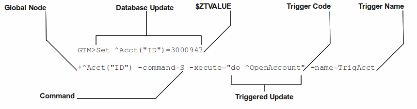
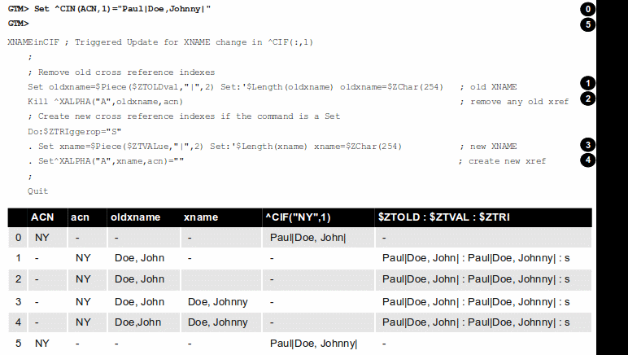
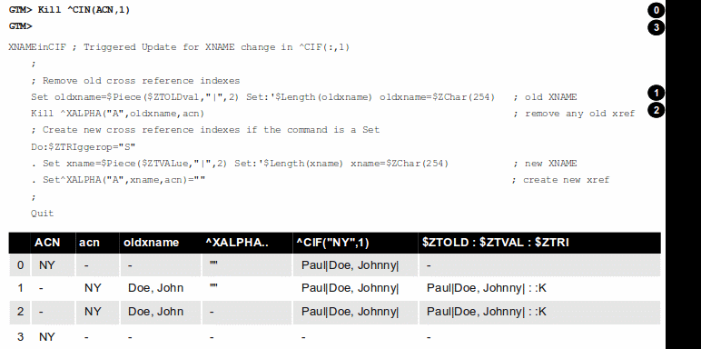

.. index::
   Triggers

===================
14. Triggers
===================

.. contents::
   :depth: 2

--------------------
Triggers
--------------------

YottaDB allows you to set up a trigger mechanism that automatically executes a defined action in response to a database update operation on a matching global node. The trigger mechanism executes a fragment of M code (trigger code) "before" or "as part of" a database update. You can define the specifications of this mechanism in a Trigger Definition File. For a trigger on KILL (and ZKILL), YottaDB executes trigger code "before" the KILL operation. For example, a trigger on KILL ^CIF(:,1) might clear old cross references. For a trigger on SET, YottaDB executes trigger code "as part of" the SET operation. Within trigger logic, the ISV $ZTOLDVAL provides read access to the value of global node prior to the update and $ZTVALUE provides read/write access to the tentative SET value. This allows you to modify the tentative SET value before YottaDB commits it to the database. The term "as part of" means that SET triggers execute intertwined with the SET operation. Although it is not yet committed the database, the tentative new value appears to the process as assigned but the process must SET $ZTVALUE to make any revision to the tentative value, because a SET of the global node would nest the trigger recursively - a pathological condition. YottaDB executes SET triggers during a MERGE update where YottaDB internally performs a series of SET operations and while performing a $INCREMENT() operation where YottaDB internally performs a SET operation. For all triggers, YottaDB handles the database update event and the triggered actions as an Atomic (all or nothing) transaction. Because triggers use application code and are always part of an implicit or explicit TP transaction, trigger code must conform to the ACID conventions discussed in the TP documentation.

Triggers meet many application needs including (but not limited to) the following:

* **Enforce schema-level consistency**: Since database schema created in a normal M application are implicit, M applications implement logic to maintain and enforce conformance with an application schema. Using triggers to enforce schema-level consistency ensures all processes invoke the code uniformly, and increases code modularity and maintainability.
* **Allow an application to maintain one or more non-primary key indices**. For example, a trigger on updates to global nodes containing a customer id can maintain an index on the last name.
* **Implement business logic**: For example, an update to an account could automatically trigger updates to related accounts.
* **Reducing replication traffic**: Since the YottaDB replication stream carries only the triggering updates, not the triggered updates, triggers reduce network traffic.
* **Automate application defined logging or journaling of updates or maintaining historical records**. Triggers can be used to control these.
* **Implement referential integrity**: For example, a trigger can prevent the posting of a bank transaction for an inactive account and display a rule violation message.
* **Debugging**: Debugging an application with multiple concurrent accesses is hard. You can use triggers to establish "watch points" on global variable updates to trap incorrect accesses. For example, if an application is failing because certain global variable nodes either have incorrect values or when previously set values disappear. A trigger can be used to trap all such accesses.
* **Implement a dataflow based programming paradigm**. Although not a primary goal of the implementation of triggers, you can use them to implement applications that use a dataflow programming paradigm.

-------------------------
Trigger Definition File
-------------------------

A trigger definition file is a text file used for adding new triggers, modifying existing triggers, or removing obsolete triggers. A trigger definition file consists of one or more trigger definitions. A trigger definition includes the following information:

* **Trigger signature**: A trigger signature consists of global variable, subscripts, value, command, and trigger code. YottaDB uses a combination of global variable, subscripts, value, and command to find the matching trigger to invoke for a database update.

  * Global Variable: The name of a specific global to which this trigger applies.
  * Subscripts: Subscripts for global variable nodes of the named global, specified using the same patterns as the ZWRITE command.
  * Value: For commands that SET or update the value at a node, YottaDB honors an optional pattern to screen for changes to delimited parts of the value. A value pattern includes a piece separator and a list of pieces of interest.
  * Command: There are four commands: SET, KILL, ZTRIGGER, and ZKILL (ZWITHDRAW is identical to ZKILL) the shorter name for the command is used when specifying triggers. MERGE is logically treated as equivalent to a series of SET operations performed in a loop. YottaDB handles $INCREMENT() of a global matching a SET trigger definition as a triggering update.
  * Trigger code: A string containing M code that YottaDB executes when application code updates, including deletions by KILL and like commands, a global node with a matching trigger. The specified code can invoke additional routines and subroutines.

.. note::
   While YottaDB does not restrict trigger code from performing I/O operations, YottaDB recommends against using OPEN, USE, READ, WRITE and CLOSE within trigger application code. Such operations may be useful for development and diagnostic purposes. However, triggers implicitly run as TP transactions and I/O violates the ACID property of Isolation. In addition, MUPIP has somewhat different I/O handling characteristics than the main YottaDB run-time, so I/O within triggers run by MUPIP may behave differently than within the originating application environment.

* **ACID property modifiers for triggered database updates**: Currently, YottaDB merely performs a syntax check on this part of a trigger definition. YottaDB ensures the triggering database update, and any updates generated by trigger logic executed with transaction semantics. With the VIEW "NOISOLATION" command, YottaDB transaction processing has long provided a mechanism for an application to inform the YottaDB runtime system that it need not enforce Isolation. In such a case, the application and schema design provides Isolation by ensuring only one process ever updates nodes in a particular global at any given time, say by using $JOB as a subscript. This property anticipates a time when a trigger specification can provide NOISOLATION for particular nodes, in contrast to entire globals, and for every update to that node, in contrast to by process use of a VIEW command. Currently, the YottaDB runtime system enforces Consistency for application logic inside a transaction and for triggered updates. This property anticipates a time when a trigger specification permits an application to inform the runtime system the application and schema design ensures appropriate Consistency for a trigger and its logic, thus relieving the YottaDB runtime system from that task.

* **Trigger Name**: You can optionally specify a trigger name that uniquely identifies each trigger. YottaDB uses a trigger name for error reporting and configuration management of triggers - for example, a ZSHOW "S" reports the name of each trigger on the stack. If you do not specify a trigger name, YottaDB automatically generates one using the global name as a base. User-specified trigger names and automatically generated trigger names occupy different name space; both last for the life of the definition. A user-specified trigger name is an alphanumeric string of up to 28 characters. It must start with an alphabetic character or a percent sign (%). For a trigger name, YottaDB uses the same naming convention as an M name. In other contexts, YottaDB truncates M names at 31 characters. However, YottaDB treats a trigger name of over 28 characters as an error. This is because a trigger name uniquely identifies a trigger and truncation may cause duplication.

An automatically generated trigger name is a string comprised of two parts. Using the global name as a base, YottaDB takes the first part as an alphanumeric string of up to 21 characters starting with an alphabetic character or a percent sign (%). The trailing part consists of an automatically incremented number in the form of #n# where n is a whole number that monotonically increases from 1 to 999999 that uniquely identifies a trigger for the same update. For example, if no trigger names are specified in the trigger definition file, YottaDB automatically generates trigger names Account#1#, Account#2#, and Account#3# for the first three triggers defined for global variable ^Account. An attempt to use automatic assignment for more than a million triggers produces an error. Once the numeric portion of the auto generated names reaches 999999, you must reload all triggers associated with the global variables that use the auto generated name space. At run-time YottaDB generates a trailing suffix of a hash-sign (#) followed by up to two characters to ensure that every trigger has a unique designation, even when the environment is complex. The run-time suffix applies to both user-specified and automatically generated trigger names. It helps in differentiating triggers with the same name in different database files.

Suppose you want to set up a trigger called TrigAcct on every s ^Acct("ID") to invoke the routine ^OpenAccount. Your trigger definition file may have an entry like +^Acct("ID") -command=S -xecute="do ^OpenAccount" -name=TrigAcct. The following diagram identifies the different parts of this trigger definition:

To apply this trigger definition file to YottaDB, all you do is to load it using MUPIP TRIGGER -TRIGGERFILE or $ZTRIGGER(). YottaDB would invoke trigger name TrigAcct on every SET operation on ^Acct("ID"). Internally, YottaDB stores trigger TrigAcct in the same database file where ^Acct is stored. The syntax of an entry in a trigger definition file is:

{-triggername\|-triggername-prefix\*\|-\*\|{+|-}trigvn -commands=cmd[,...] -xecute=strlit1 [-[z]delim=expr][-pieces=[lvn=]int1[:int2][;...]] [-options={[no]i[solation]|[no]c[onsistencycheck]}...] [-name=strlit2]}

**-triggername\|-trigger-name-prefix\*\|-\* .**

-triggername deletes a user-specified trigger name called triggername from the database. -triggername* deletes all those user-defined triggers whose starting name match triggername. -* deletes all triggers; if the MUPIP TRIGGER command does not specify -NOPROMPT , YottaDB displays a warning and asks for user confirmation before deleting all triggers. If MUPIP TRIGGER command specifies -NOPROMPT and the definition file includes a -* line, YottaDB deletes all the triggers without user confirmation. $ZTRIGGER() performs deletions -NOPROMPT.+triggername issues an error; to add a new user-specified trigger name, use -name=strlit2.

**\{\+\|-\}trigvn**

trigvn is a global node on which you set up a trigger.-trigvn deletes any triggers in the database that match the specified trigger. +trigvn adds or replaces the specified trigger. If the specified trigger exists (with a matching specification), MUPIP TRIGGER or $ZTRIGGER() treats the matching definition as a no-op, resulting in no database update. If you want to specify more than one global node for the same trigger code, the following rules apply:

1. You can use patterns and ranges for subscripts.
2. You can specify a semicolon (;) separated list for subscripts.
3. You can specify a selection list that includes a mix of points, ranges and patterns, but a pattern cannot serve as either end of a range. For example, :,"a":"d";?1U is a valid specification but :,"a":?1A is not.
4. You can specify a local variable name for each subscript. For example instead of ^X(1,:,:), you can specify ^X(1,lastname=:,firstname=:). This causes YottaDB to define local variables lastname and firstname to the actual second and third level subscripts respectively from the global node invoking this trigger. The trigger code can then use these variables just like any other M local variable. As described in the Trigger Execution Environment section, trigger code executes in a clean environment - as if all code is preceded by an implicit NEW - the implicit assignments apply only within the scope of the trigger code and don't conflict or affect any run-time code or other triggers.
5. You cannot use the @ operator, unspecified subscripts (for example, ^A() or ^A(:,)) or local or global variable names as subscripts.
6. You cannot use patterns and ranges for the global variable name. Therefore, you cannot set a single trigger for ^Acct*.

In order to account for any non-standard collation, YottaDB evaluates string subscript ranges using the global specific collation when an application update first invokes a trigger - as a consequence, it detects and reports range issues at run-time rather than from MUPIP TRIGGER or $ZTRIGGER(), so test appropriately. For example, YottaDB reports a run-time error for an inverted subscript range such as (ASCII) C:A.

**-command=cmd**

cmd is the trigger invocation command. Currently, you can specify one or more of S[ET], K[ILL], ZTR[IGGER], or ZK[ILL]. A subsequent YottaDB release may support ZTK[ILL] for triggering on descendent nodes of a KILLed ancestor, but, while current versions accept ZTK, they convert it into K. If cmd specifies multiple command values, YottaDB treats each M command as a separate trigger. Note that even if you specify both SET and KILL, only one M command matches at any given time. Trigger code is not executed in the following conditions:

* A KILL of a node that does not exist.
* A KILL of a node that has a cmd=ZK trigger, but no cmd=K trigger.
* A ZKILL or ZWITHDRAW of a node that has descendents but no data and a trigger with cmd=ZK.
* The trigger uses the "piece" syntax (described below) and no triggering piece changes in the update.

**-xecute="|<<strlit1"|>>**

strlit1 specifies the trigger code that is executed when an update matches trigvn. If strlit1 is a single line, enclose it with quotes (") and make sure that the quotes inside strlit1 are doubled as in normal M syntax.

If strlit1 is in multiple lines, mark the beginning with << which must immediately follow the = after the -xecute. A newline must immediately follow the <<. >> should mark the end of multiple-line strlit1 and must be at the beginning of a line. The lines in strlit1 follow the standard conventions of a YottaDB program, that is, optional label, line start, and M code.

The maximum length of strlit1 (even if multi-line) is 1048576 (ASCII) characters or 4096 DB records, whichever is smaller.

To validate strlit1, MUPIP TRIGGER or $ZTRIGGER() compiles it before applying the trigger definition to the database and issues a TRGCOMPFAIL error if it contains any invalid code.

.. note::
   Trigger compilation detects compilation errors, but not run-time errors. Therefore, you should always test your trigger code before applying trigger definitions to the database. 

.. note::
   As stated in the Trigger Definition File section, the text of trigger code is a part of the trigger signature. If you use two trigger signatures that have the same semantics (global variable, subscript, value, and command) but different text (for example: set foo=$ztoldval, s foo=$ztoldval, and set foo=$ztol), their signatures become different and YottaDB treats them as different triggers. YottaDB recommends you to use comprehensive and strong coding conventions for trigger code or rely on user-specified names in managing the deletion and replacement of triggers.

Example:

.. parsed-literal::
   +^multi -commands=set -name=example -xecute=<<
    do ^test1
    do stop^test2
    >>

**[-pieces=int1[:int2][;...]]**

f cmd is S[et], you can specify an optional piece list sequence where int2>int1 and int1:int2 denotes a integer range from int1 to int2. The trigger gets executed only when any piece from the specified piece list changes. Suppose your trigvn has a list "Window|Chair|Table|Door" and you want to execute the trigger only when the value of the 3rd or 4th piece changes so you might specify the following trigger definition:

.. parsed-literal::
   +^trigvn -commands=S -pieces=3;4 -delim="|" -options=NOI,NOC -xecute="W ""3rd or 4th element updated."""
   YDB>W ^trigvnWindow\|Chair\|Table\|Door\|
   YDB>s $Piece(^trigvn,"|",3)="Dining Table"
   3rd or 4th element updated.

This trigger is not executed if you change the first element. For example:

S $Piece(^trigvn,"|",1)="Chandelier"

does not invoke the trigger.

You can also specify a range for your piece sequence. For example, 3:5;7;9:11 specifies a trigger on pieces 3 through 5,7 and 9 through 11. YottaDB merges any overlapping values or ranges - for example, 3:6;7 is the same as 3:7.

**[-[z]delim=expr]**

If cmd is S[ET] , you can specify an optional piece delimiter using -[z]delim=expr where expr is a string literal or an expression (with very limited syntax) evaluating to a string separating the pieces (e.g., "|") in the values of nodes, and is interpreted as an ASCII or UTF-8 string based on the environment variable ydb_chset. To allow for unprintable delimiters in the delimiter expression, MUPIP TRIGGER only accepts $CHAR() and $ZCHAR() and string concatenation (_) as embellishments to the string literals. If zdelim specifies a delimiter, YottaDB uses the equivalent of $ZPIECE() to match pieces and to identify changes in $ZTUPDATE() (refer to the ISV description for additional information); otherwise, if delim specifies a delimiter, YottaDB uses the equivalent of $PIECE() for the current mode (M or UTF-8). Specifying a delimiter for cmd other than S[ET] or specifying both delim and zdelim for the same trigger each produce an error.

**[-options= {no]i[solation]\|[[no]c[onsistencycheck]}...**

You can specify [NO] ISOLATION or [NO]CONSISTENCYCHECK as a property of the triggered database updates. NOISOLATION is a facility for your application to instruct YottaDB where the application logic and database schema take responsibility for ensuring the ACID property of ISOLATION, and that any apparent collisions are purely coincidental from multiple global nodes resident in the same physical block which serves as the YottaDB level of granularity in conflict checking. In the current release this trigger designation is notational only - you must still implement NOISOLATION at the process level with the VIEW command, but you can use the trigger designation in planning to move to schema-based control of this facility. NOCONSISTENCYCHECK is a facility for your application to instruct YottaDB that application logic and schema take responsibility for ensuring the ACID property of CONSISTENCY. The [NO]CONSISTENCYCHECK feature is not yet implemented and will be made available in a future YottaDB release. For now, you can plan to move CONSISTENCY responsibility from your application to a trigger and implement it later when this feature becomes available. Note: -options are not part of the trigger signature and so can be modified without deleting an existing trigger.

**[-name=strlit2]**

strlit2 is a user-specified trigger name. It is an alphanumeric string of up to 28 characters. It must start with an alphabetic character or a percent sign (%). Note: -name is not part of the trigger signature and so can be modified without deleting an existing trigger. Note also that the name can be used to delete a trigger - this alternative avoids potential issues with text variations in the code associated with the -xecute qualifier which is part of the trigger signature when the variations do not have semantic significance.

---------------------------------------
Trigger ISVs Summary
---------------------------------------

The following table briefly describes all ISVs (Intrinsic Special Variables) available for use by application logic using triggers. With the exception of $ZTWORMHOLE they return zero (0) if they have numeric values or an empty string when referenced by code outside of a trigger context. For more comprehensive description and usage examples of these ISVs, refer to “Trigger ISVs”.

+-----------------------+-----------------------------------------------------------------------------------------------------------------------------------------------------------+
| Trigger ISV           | Description                                                                                                                                               |
+=======================+===========================================================================================================================================================+
| $ZTNAME               | Within a trigger context, $ZTNAME returns the trigger name. Outside a trigger context, $ZTNAME returns an empty string.                                   |
+-----------------------+-----------------------------------------------------------------------------------------------------------------------------------------------------------+
| $ZTDATA               | A fast path alternative to $DATA(@$REFERENCE)#2 for a SET or $DATA(@$REFERENCE) of the node for a KILL update.                                            |
+-----------------------+-----------------------------------------------------------------------------------------------------------------------------------------------------------+
| $ZTDELIM              | Within a SET trigger context, $ZTDE[LIM] returns the piece separator, as specified by -delim in the trigger definition. This allows triggers to extract   |
|                       | updated pieces defined in $ZTUPDATE without having the piece separator hard coded into the routine. Outside of a SET trigger context, $ZTDELIM is null.   |
+-----------------------+-----------------------------------------------------------------------------------------------------------------------------------------------------------+
| $ZTLEVEL              | Returns the current level of trigger nesting (invocation by an update in trigger code of an additional trigger).                                          |
+-----------------------+-----------------------------------------------------------------------------------------------------------------------------------------------------------+
| $ZTOLDVAL             | Returns the prior (old) value of the node whose update caused the trigger invocation or an empty string if node had no value; refer to $ZTDATA to         |
|                       | determine if the node had a data value.                                                                                                                   |
+-----------------------+-----------------------------------------------------------------------------------------------------------------------------------------------------------+
| $ZTRIGGEROP           | For SET (including MERGE and $INCREMENT() operations), $ZTRIGGEROP returns the value "S". For KILL, $ZTRIGGEROP returns the value "K". For ZKILL or       |
|                       | ZWITHDRAW, $ZTRIGGEROP returns the value "ZK". For ZTR, $ZTRIGGEROP returns the value "ZTR"                                                               |
+-----------------------+-----------------------------------------------------------------------------------------------------------------------------------------------------------+
| $ZTSLATE              | $ZTSLATE allows you to specify a string that you want to make available in chained or nested triggers invoked for an outermost transaction (when a TSTART |
|                       | takes $TLEVEL from 0 to 1).                                                                                                                               |
+-----------------------+-----------------------------------------------------------------------------------------------------------------------------------------------------------+
| $ZTVALUE              | For SET, $ZTVALUE has the value assigned to the node which triggered the update. Initially this is the value specified by the explicit (triggering) SET   |
|                       | operation. Modifying $ZTVALUE within a trigger modifies the value YottaDB eventually assigns to the node.                                                 |
+-----------------------+-----------------------------------------------------------------------------------------------------------------------------------------------------------+
| $ZTUPDATE             | For SET commands where the YottaDB trigger specifies a piece separator, $ZTUPDATE provides a comma separated list of ordinal piece numbers of pieces      |
|                       | that differ between the current values of $ZTOLDVAL and $ZTVALUE.                                                                                         |
+-----------------------+-----------------------------------------------------------------------------------------------------------------------------------------------------------+
| $ZTWORMHOLE           | $ZTWORMHOLE allows you to specify a string up to 128KB that you want to make available during trigger execution. You can use $ZTWORMHOLE to supply        |
|                       | application context or process context to your trigger logic. Because $ZTWORMHOLE is retained throughout the duration of the process, you can read/write  |
|                       | $ZTWORMHOLE both from inside and outside a trigger. Note that if trigger code does not reference $ZTWORMHOLE, YottaDB does not make it available to       |
|                       | MUPIP (via the journal files or replication stream). Therefore, if a replicating secondary has different trigger code than the initiating primary (an     |
|                       | unusual configuration) and the triggers on the replicating node require information from $ZTWORMHOLE, the triggers on the initiating node must reference  |
|                       | $ZTWORMHOLE to ensure YottaDB maintains the data it contains for use by the update process on the replicating node. YottaDB allows you to change          |
|                       | $ZTWORMHOLE within trigger code so that a triggered update can trigger other updates but because of the arbitrary ordering of triggers matching the same  |
|                       | node (refer to the discussion on trigger chaining below), such an approach requires careful design and implementation.                                    |
+-----------------------+-----------------------------------------------------------------------------------------------------------------------------------------------------------+

The Trigger Execution Environment section describes the interactions of the following ISVs with triggers: $ETRAP, $REFERENCE, $TEST, $TLEVEL, and $ZTRAP.

-----------------------------------
Chained and Nested Triggers
-----------------------------------

Triggers are chained or nested when a database update sets off more than one trigger. A nested trigger is a trigger set off by another trigger. YottaDB assigns a nesting level to each nested trigger to up to 127 levels. While nested triggers are always Atomic with their triggering update YottaDB gives each nested trigger a new trigger context rather than a part of the triggering update. A chained trigger is an arbitrary sequence of matching triggers for the same database update. Consider the following trigger definition entries:

.. parsed-literal::
   +^Acct("ID") -commands=Set -xecute="Set ^Acct(1)=$ZTVALUE+1"
   +^Acct(sub=:) -command=Set -xecute="Set ^X($ZTVALUE)=sub"

This example sets off a chained sequence of two triggers and one nested trigger. On Set ^Acct("ID")=10, YottaDB chains together an arbitrary sequence of triggers for ^Acct("ID") and ^Acct(sub:). It is possible for either the ^Acct(sub=:) trigger or the ^Acct("ID") trigger to execute first and the other to follow because the trigger execution sequence is arbitrary. Whenever YottaDB invokes the trigger for ^Acct("ID"), the Set ^Acct(1)=$ZTVALUE+1 code sets off the trigger for ^Acct(sub=:) as a nested trigger.

.. note::
   YottaDB recommends against using chained and nested triggers that potentially update the same piece of a global variable. You should always assess the significance of having chained triggers for a database update especially because of the arbitrary trigger execution order. The following table shows the stacking behavior of some Intrinsic Special Variables in chained and nested triggers.

+----------------------------+------------------------------------+------------------------------------------+
| ISV                        | Chained Triggers                   | Nested Triggers                          |
+============================+====================================+==========================================+
| $REFERENCE                 | Shared                             | Stacked                                  |
+----------------------------+------------------------------------+------------------------------------------+
| $TEST                      | Stacked                            | Stacked                                  |
+----------------------------+------------------------------------+------------------------------------------+
| $ZTVALUE                   | Shared (updatable)                 | Stacked                                  |
+----------------------------+------------------------------------+------------------------------------------+
| $ZTOLDVAL                  | Shared                             | Stacked                                  |
+----------------------------+------------------------------------+------------------------------------------+
| $ZTDATA                    | Shared                             | Stacked                                  |
+----------------------------+------------------------------------+------------------------------------------+
| $ZTSLATE                   | Not Stacked                        | Not Stacked                              |
+----------------------------+------------------------------------+------------------------------------------+
| $ZTRIGGEROP                | Shared                             | Stacked                                  |
+----------------------------+------------------------------------+------------------------------------------+
| $ZTWORMHOLE                | Not Stacked                        | Not Stacked                              |
+----------------------------+------------------------------------+------------------------------------------+
| $ZTLEVEL                   | Shared                             | Stacked                                  |
+----------------------------+------------------------------------+------------------------------------------+
| $ZTUPDATE                  | depends on $ZTVALUE when trigger   | Stacked                                  |
|                            | starts                             |                                          |
+----------------------------+------------------------------------+------------------------------------------+

*Stacked* denotes an ISV whose value is restored at the completion of the trigger.

*Not Stacked* denotes an ISV whole value is retained after the completion of the trigger.

*Shared* denotes an ISV whose value is the same, possibly subject to updates, across chained updates

Note that a trigger that is both nested and chained has the characteristics from both columns - the "Chained" column is really about the relationship between triggers invoked by the same update and the "Nested" is really about the isolation of a trigger from the context that invoked it, whether or not that context is inside the context of another trigger.

--------------------------------
A Simple Example
--------------------------------

This section contains a simple example showing how a YottaDB trigger can automatically maintain cross references in response to a SET or KILL operation on ^CIF(ACN,1). It also reinforces the basic trigger concepts explained above. Global nodes in ^CIF(ACN,1) have a structure ^CIF(ACN,1)=NAM|XNAME| where the vertical-bars are delimiters and XNAME is a customer's canonical name (e.g., "Doe, Johnny"). The application schema has one cross reference index, ^XALPHA("A",XNAME,ACN)="". A YottaDB trigger specified for ^CIF(:,1) nodes can automatically maintain the cross references.

Using your editor, create a trigger definition file called triggers.trg with the following entry:

+^CIF(acn=:,1) -delim="|" -pieces=2 -commands=SET,KILL -xecute="Do ^XNAMEinCIF"

In this definition: 

* ^CIF - specifies the global variable to which the trigger applies.
* acn=: - in ZWRITE syntax, ":" specifies any value for the first subscript.
* acn= prefix requests YottaDB assign the value of the first subscript (ACN) to the local variable acn before invoking the trigger logic.
* 1 - specifies that the trigger matches only if the second subscript is 1 (one).
* -delim="|" - specifies that YottaDB use "\|" as the piece separator when checking the value of the node to see whether to invoke the trigger. The use of the keyword delim tells YottaDB to use $PIECE() semantics for the value at the node; zdelim, instead, would instruct YottaDB to use $ZPIECE() semantics.
* -pieces=2 - specifies that YottaDB should only invoke the trigger when the update changes the second piece (XNAME) not for a change to the first piece (NAM), or any other piece without a change to XNAME.
* -commands=SET,KILL - specifies that YottaDB invoke the trigger for SET and KILL updates (but not a ZKILL/ZWITHDRAW command).
* -xecute="Do ^XNAMEinCIF" - provides code for YottaDB to invoke to perform the trigger logic.

Execute a command like the following:

.. parsed-literal::
   $ mupip trigger -triggerfile=triggers.trg

This command adds a trigger for ^CIF(:,1). On successful trigger load, this command displays an output like the following:

.. parsed-literal::
   File triggers.trg, Line 1: ^CIF trigger added with index 1
   =========================================
   1 triggers added
   0 triggers deleted
   0 trigger file entries not changed
   0 triggers modified
   =========================================

Now, every SET and KILL operation on the global node ^CIF(:,1) executes the routine XNAMEinCIF.

Using your editor, create an M routine called XNAMEinCIF.m with the following code:

.. parsed-literal::
   XNAMEinCIF ; Triggered Update for XNAME change in ^CIF(:,1)
       Set oldxname=$Piece($ZTOLDval,"|",2) Set:'$Length(oldxname) oldxname=$zchar(254); old XNAME 
       Kill ^XALPHA("A",oldxname,acn); remove any old xref 
                                     ; Create a new cross reference if the command is a Set
       Do:$ZTRIggerop="S" 
       . Set xname=$Piece($ZTVALue,"|",2) Set:'$Length(xname) xname=$zchar(254)              ; new XNAME
       . Set^XALPHA("A",xname,acn)=""                                                                                                         ; create new xref
       ;

When the XNAME piece of a ^CIF(:,1) node is SET to a new value or KILLed, after obtaining the values, an unconditional KILL command deletes the previous cross reference index, if it exists. The deletion can be unconditional, because if the node did not previously exist, then the KILL is a no-op. Then, only if a SET invoked the trigger (determined from the ISV $ZTRIGGEROP), the trigger invoked routine creates a new cross reference index node. Note that because YottaDB implicitly creates a new context for the trigger logic we do not have to worry about our choice of names or explicitly NEW any variables.

After obtaining the values, an unconditional KILL command deletes the previous cross reference index, if it exists. Then, only if a SET invoked the trigger (determined from the ISV $ZTRIGGEROP), the trigger invoked routine creates a new cross reference index node. Note that because YottaDB implicitly creates a new context for the trigger logic we do not have to worry about out choice of names or explicitly NEW any variables.

The following illustration shows the flow of control when the trigger is executed for Set ^CIN(ACN,1)="Paul|John, Doe, Johnny|". The initial value of ^CIN(ACN,1) is "Paul|Doe, John|" and ACN is set to "NY". 

.. note::
   Within trigger context, if you modify the value of $ZTVALUE, YottaDB now commits it to the database. YottaDB executes all steps as an Atomic (all or nothing) transactional unit.

The following illustration shows the flow of control when the trigger is executed for Kill ^CIN(ACN,1).

-----------------------------
Trigger Definition Storage
-----------------------------

YottaDB stores trigger definitions as nodes of a global-like structure (^#t) within the same database as the nodes with which they're associated. You can manage the trigger definitions with MUPIP TRIGGER and $ZTRIGGER() but you cannot directly access ^#t (except with DSE, which YottaDB recommends against under normal circumstances). The block size, key size, and record size for a database must be sufficient to hold its associated trigger definition. In addition, YottaDB stores cross-region name resolution information in the DEFAULT region, so the DEFAULT region in a global directory used to update triggers must have sufficient block size, key size, and record size to hold that trigger-related data.

--------------------------------------------
Trigger Invocation and Execution Semantics
--------------------------------------------

YottaDB stores Triggers for each global variable in the database file for that global variable. When a global directory maps a global variable to its database file, it also maps triggers for that global variable to the same database file. When an extended reference uses a different global directory to map a global variable to a database file, that global directory also maps triggers for that global variable to that same database file.

Although triggers for SET and KILL / ZKILL commands can be specified together, the command invoking a trigger is always unique. The ISV $ZTRIGGEROP provides the trigger code which matched the triggering command.

Whenever a command updates a global variable, the YottaDB runtime system first determines whether there are any triggers for that global variable. If there are any triggers, it scans the signatures for subscripts and node values to identify matching triggers. If multiple triggers match, YottaDB invokes them in an arbitrary order. Since a future version of YottaDB, potentially multi-threaded, may well choose to execute multiple triggers in parallel, you should ensure that when a node has multiple triggers, they are coded so that correct application behavior does not rely on the order in which they execute.

When a process executes a KILL, ZKILL or SET command, the target is the global variable node specified by the command argument for modification. With SET and ZKILL, the target is a single node. In the case of KILL, the target may represent an entire sub-tree of nodes. YottaDB only matches the trigger against the target node, and only invokes the trigger once for each KILL command. YottaDB does not check nodes in sub-trees to see whether they have matching triggers.

++++++++++++
Kill/ZKill
++++++++++++

If KILL or ZKILL updates a global node matching a trigger definition, YottaDB executes the trigger code when a database state change has been computed but before it has been applied in the process space or the database. This means that the node to be KILLed and descendants (if any) remain visible to the trigger code. Note that a KILL trigger ignores $ZTVALUE.

+++++++++
Set
+++++++++

If a SET updates a global node matching a trigger definition, YottaDB executes the trigger code after the node has been updated in the process address space, but before it is applied to the database. When the trigger execution completes, the trigger logic commits the value of a node from the process address space only if $ZTVALUE is not set. if $ZTVALUE is set during trigger execution, the trigger logic commits the value of a node from the value of $ZTVALUE.

Consider the following example:

.. parsed-literal::
   YDB>set c=$ztrigger("S")
   ;trigger name: A#1#  cycle: 1
   +^A -commands=S -xecute="set ^B=200"
   ;trigger name: B#1#  cycle: 1
   +^B -commands=S -xecute="set $ztval=$ztval+1 " 
   YDB>set ^A=100,^B=100 
   YDB>write ^A
   100
   YDB>write ^B
   201 

SET ^A=100 invokes trigger A#1. When the trigger execution begins, YottaDB sets ^A to 100 in the process address space, but does not apply it to the database. Therefore, the trigger logic sees ^A as set to 100. Other process accessing the database, however, see the prior value of ^A. When the trigger execution completes, the trigger logic commits the value of a node from the process address space only if $ZTVALUE is not set. The trigger logic commits the value of a node from the $ZTVALUE only if $ZTVALUE is set during trigger execution. Because $ZTVALUE is not set in A#1, YottaDB commits the value of ^A from the process address space to the database. Therefore, YottaDB commits ^A=100 to the database. SET ^B=200 invokes trigger B#2. $ZTVALUE is set during trigger execution, therefore YottaDB commits the value of $ZTVALUE to ^B at the end of trigger execution.

.. note::
   Within trigger code, any SET operation on ^B recursively invokes trigger B#1. Therefore, always set $ZTVALUE to change the value node during trigger execution. YottaDB executes the triggering update and all associated triggers within the same transaction, whether or not the original command is inside a transaction. This means that although the trigger logic sees the updated value of the node, it is not visible to other processes until the outermost transaction commits to the database. If there is a conflicting update by another process, YottaDB RESTARTs the explicit or implicit transaction to resolve the conflict.

A trigger may need to update the node whose SET initiated the trigger. Situations where this may occur include:

* a log or journal entry may need to be stored in a different piece of the same node as the update, or
* the node being updated may need its data to be stored in a canonical form (such as all-caps, or with standardized punctuation, regardless of how it was actually entered), or have its value limited to a range.

In such cases, the trigger logic should make the changes to the ISV $ZTVALUE instead of the global node. At the end of the trigger invocation, YottaDB applies the value in $ZTVALUE to the node. Before the first matching trigger executes, YottaDB sets $ZTVALUE. Since a command inside one trigger's logic can invoke another nested trigger, if already in a trigger, YottaDB stacks the value of $ZTVALUE for the prior update before modifying it for the nested trigger initiation.

YottaDB treats a MERGE command as a series of SET commands performed in collation order of the data source. YottaDB checks each global node updated by the MERGE for matching triggers. If YottaDB finds one or more matches, it invokes all the matching trigger(s) before the next command or the next set argument to the same SET command.

YottaDB treats the $INCREMENT() function as a SET command. Since the result of a $INCREMENT() operation must be numeric, if the trigger code modifies $ZTVALUE, at the end of the trigger, YottaDB applies the value of +$ZTVALUE (that is, $ZTVALUE coerced to a number) to the target node.

+++++++++++++++++++++++++++++++++++
Trigger Execution Environment
+++++++++++++++++++++++++++++++++++

As noted above, if there are multiple matching triggers, the YottaDB process makes a list of matching triggers and executes them in an arbitrary order with no guarantee of predictability.

For each matching trigger:

1. The YottaDB process implicitly stacks the naked reference, $REFERENCE, $TEST, $ZTOLDVAL, $ZTDATA, $ZTRIGGEROP, $ZTUPDATE and NEWs all local variables. At the beginning of trigger code execution, $REFERENCE, $TEST and the naked indicator initially retain the values they had just prior to being stacked (in the case of KILL/ZKILL, to the reference of the KILL/ZKILL command, even though the trigger executes prior to the removal of any nodes). If an update directly initiates multiple (chained) triggers, all start with identical values of the naked reference, $REFERENCE, $TEST, $ZTDATA, $ZTLEVEL, $ZTOLDVAL, and $ZTRIGGEROP. This facilitates triggers that are independent of the order in which they run. Application logic inside triggers can use $REFERENCE, the read-only intrinsic special variables $ZTDATA, $ZTLEVEL, $ZTOLDVAL, $ZTRIGGEROP & $ZTUPDATE, and the read-write intrinsic special variables $ZTVALUE, and $ZTWORMHOLE.

2. YottaDB executes the trigger code. Note that in the course of executing this YottaDB trigger, if the same trigger matches again for the same or a different target, YottaDB reinvokes the trigger recursively. In other words, the same trigger can be invoked more than once for the same command. Note that such a recursive invocation is probably a pathological condition that will eventually cause a STACKCRIT error. Triggers may nest up to 127 levels, after which an additional attempt to nest produces a MAXTRGRNEST error.

3. When the code completes, YottaDB clears local variables, restores what was stacked, except $ZTVALUE (refer to the ISV definitions for comments on modifying $ZTVALUE) to the values they had at the start of the trigger, and if there is any remaining trigger matching the original update, adjusts $ZTUPDATE and executes that next action. $ZTVALUE always holds the current target value for the node for which the application update initially invoked the trigger(s). Note that because multiple triggers for the same node execute in an arbitrary order, having more than one trigger change $ZTVALUE requires careful design and implementation.

After executing all triggers, YottaDB commits the operation initiating the trigger as well as the trigger updates and continues execution with the next command (or, in the case of multiple nodes being updated by the same command, with the next node). Note that if the operation initiating the trigger is itself within a transaction, other processes will not see the database state changes till the TCOMMIT of the outermost transaction.

To ensure trigger actions are Atomic with respect to the update that invokes them, YottaDB always executes trigger logic and the triggering update within a transaction. If the triggering update is not within an application transaction, YottaDB implicitly starts a restartable "Batch" transaction to wrap the original update and any triggers generated by the update. In other words, when 0=$TLEVEL YottaDB behaves as if implicit TStart \*:Transactionid="BATCH" and TCommit commands bracket the upddate and its triggers. Therefore, the trigger code and/or its error trap always operate inside a Transaction and can use the TRESTART command even if the main application code never uses TSTART. $ETRAP code for use in triggers may include TROLLBACK logic.

The deprecated ZTSTART/ZTCOMMIT transactions are not compatible with triggers. If a ZTSTART transaction is already active when an update to a global that has any trigger defined occurs, YottaDB issues a runtime error. Likewise, YottaDB treats any attempt to issue a ZTSTART within a trigger context as an error.

++++++++++++++++++++++++++++++++++++++++
Error Handling during Trigger Execution
++++++++++++++++++++++++++++++++++++++++

YottaDB uses the $ETRAP mechanism to handle errors during trigger execution. If an error occurs during a trigger, YottaDB executes the M code in $ETRAP. If $ETRAP does not clear $ECODE, YottaDB does not commit the database updates within the trigger and passes control to the environment of the trigger update. If the $ETRAP action or the logic it invokes clears $ECODE, YottaDB can continue processing the trigger logic.

Consider the following trivial example:

.. parsed-literal::
   ^Acct(id=:,disc=:) -commands=Set -xecute="Set msg=""Trigger Failed"",$ETrap=""If $Increment(^count) Write msg,!"" Set $ZTVAlue=x/disc" 

During trigger execution if disc (the second subscript of the triggering update) evaluates to zero, resulting in a DIVZERO (Attempt to divide by zero) error, YottaDB displays the message "Trigger Failed". Since the $ETRAP does not clear $ECODE, after printing the message, YottaDB leaves the trigger context and invokes the error handler outside the trigger, if any. In a DIVZERO case, the process neither assigns a new value to ^Acct(id,disc) nor commits the incremented value of ^count to the database.

An application process can use a broad range of corrective actions to handle run-time errors within triggers. However, these corrective actions may not be available during MUPIP replication. As described in the Trigger Environment section, YottaDB replicates only the trigger definitions, but not the triggered updates, which are executed by triggers when a replicating instance replays them. If a trigger is invoked in a replicating instance, it means that trigger was successfully invoked on the originating instance. For normal application requirements, you should ensure that the trigger produces the same results on a correctly configured replicating instance. Therefore your $ETRAP code on MUPIP should deal with the following cases where:

* The run-time $ETRAP code modified the trigger logic to achieve the desired result
* The replicating configuration is different from the initiating configuration
* The filters between the initiating and replicating instance introduce an error

In the later two cases there are probably basically two possibilities for the mismatch environments - they are:

* Intended and the $ETRAP mechanism is an integral part of managing the difference
* Unintended and the $ETRAP mechanism should help notify the operational team to correct the difference and restart replication

The trigger facility includes an environment variable called gtm_trigger_etrap. It provides the initial value for $ETRAP in trigger context and can be used to set error traps for trigger operations in both mumps and MUPIP processes. The code can, of course, also SET $ETRAP within the trigger context. During a run-time trigger operation if you do not specify the value of gtm_trigger_etrap and a trigger fails, YottaDB uses the current trap handler. In a mumps process, if the trap handler was $ZTRAP at the time of the triggering update and gtm_trigger_etrap isn't defined, the error trap is implicitly replaced by $ETRAP="" which exits out of both the trigger logic and the triggering action before the $ZTRAP unstacks and takes effect. In a MUPIP process, if you do not specify the value of gtm_trigger_etrap and a trigger fails, YottaDB implicitly performs a SET $ETRAP="If $ZJOBEXAM()" and terminates the MUPIP process. $ZOBEXAM() records diagnostic information (equivalent to ZSHOW "*") to a file that provides a basis for analysis of the failure.

.. note::
   $ZJOBEXAM() dumps the context of a process at the time the function executes and the output may well contain sensitive information such as identification numbers, credit card numbers, and so on. You should secure the location of files produced by the MUPIP error handler or set up appropriate security characteristics for operating MUPIP. Alternatively, if you do not want MUPIP to create a $ZJOBEXAM() file, explicitly set the gtm_trigger_etrap environment variable to a handler such as "Write !,$ZSTATUS,!,$ZPOSITION,! Halt".

Other key aspects of error handling during trigger execution are as follows:

* Any attempt to use the $ZTRAP error handling mechanism for triggers results in a NOZTRAPINTRIGR error.
* If the trigger initiating update occurs outside any transaction ($TLEVEL=0), YottaDB implicitly starts a transaction to wrap the initiating update and the triggered updates. Consequently if a TROLLBACK or TCOMMIT within the trigger context causes the code to come back to complete the initiating update with a different $TLEVEL than when the trigger started (including any implicit TSTART), YottaDB issues a TRIGTCOMMIT error and does not commit the original update.
* Any TCOMMIT that takes $TLEVEL below what it was when at trigger initiation, causes a TRIGTLVLCHNG error. This behavior applies to any trigger, whether chained, nested or singular.
* It may appear that YottaDB executes trigger code as an argument for an XECUTE. However, for performance reasons, YottaDB internally converts trigger code into a pseudo routine and executes it as if it is a routine. Although this is invisible for the most part, the trigger name can appear in places like error messages and $STACK() return values.
* Triggers are associated with a region and a process can use one or more global directories to access multiple regions, therefore, there is a possibility for triggers to have name conflicts. To avoid a potential name conflict with other resources, YottaDB attempts to add a two character suffix, delimited by a "#" character to the user-supplied or automatically generated trigger name. If this attempt to make the name unique fails, YottaDB issues a TRIGNAMEUNIQ error.
* Defining gtm_trigger_etrap to hold M code of any complexity exposes mismatches between the quoting conventions for M code and shell scripts. YottaDB suggests an approach of enclosing the entire value in single-quotes and only escaping the single-quote ('), exclamation-point (!) and back-slash (\) characters. For a comprehensive (but hopefully not very realistic) example:
  
   .. parsed-literal::
      $ export gtm_trigger_etrap='write:1\'=2 $zstatus,\!,"5\\2=",5\\2,\! halt'
      $ echo $gtm_trigger_etrap
      write:1'=2 $zstatus,!,"5\2=",5\2,! halt 
      YDB>set $etrap=$ztrnlnm("gtm_trigger_etrap")
      YDB>xecute "write 1/0"
      150373210,+1^GTM$DMOD,%YDB-E-DIVZERO, Attempt to divide by zero
      5\2=2
      $

++++++++++
ZGoto
++++++++++

To maintain the transactional integrity of triggers and to avoid branching control to an inappropriate destination, ZGOTO behaves as follows:

* YottaDB does not support ZGOTO 1:<entryref> arguments in MUPIP because they form an attempt to replace the MUPIP context.
* When a ZGOTO argument specifies an entryref at or below the level of the update that initiated the trigger, YottaDB redirects the flow of control to the entryref without performing the triggering update. Alternatively if YottaDB finds a non-null $ECODE, indicating an unhandled error when it goes to complete the trigger, it throws control to the current error handler rather than committing the original triggering update.
* ZGOTO 0 terminates the process and ZGOTO 1 returns to the base stack frame, which has to be outside any trigger invocation.
* ZGOTO from within a run-time trigger context cannot directly reach a subsequent M command on the line containing the command that invoked the trigger, because a ZGOTO with an argument specifying the level where the update originated but no entryref returns to the update itself (as would a QUIT) and, if $ECODE is null, YottaDB continues processing with any additional triggers and the triggering update before resuming the line.

++++++++++++++++++++++++++++++++++++++
Accessing Trigger Xecute Source Code
++++++++++++++++++++++++++++++++++++++

ZPRINT/$TEXT()/ZBREAK recognize both a runtime-disambiguator, delimited with a hash-sign (#), and a region-disambiguator, delimited by a slash(/). ZPRINT and ZBREAK treat a trigger-not-found case as a TRIGNAMENF error, while $TEXT() returns the empty string. When their argument contains a region-disambiguator, these features ignore a null runtime-disambiguator. When their argument does not contain a region-disambiguator, these features act as if runtime-disambiguator is specified, even if it has an empty value. When an argument specifies both the runtime-disambiguator and the region-disambiguator, and the runtime-disambiguator identifies a trigger loaded from a region different from the specified region, or the region-disambiguator identifies a region which holds a trigger that is not mapped by $ZGBLDIR, these features treat the trigger as not found.

ZPRINT or $TEXT() of trigger code may be out-of-date if the process previously loaded the code, but a $ZTRIGGER() or MUPIP TRIGGER has since changed the code. In other words, execution of a trigger (not $TEXT()) ensures that trigger code returned with $TEXT() is current.

++++++++++
GT.CM
++++++++++

GT.CM servers do not invoke triggers. This means that the client processes must restrict themselves to updates which don't require triggers, or explicitly call for the actions that triggers would otherwise perform. Because GT.CM bypasses triggers, it may provide a mechanism to bypass triggers for debugging or complex corrections to repair data placed in an inconsistent state by a bug in trigger logic.

++++++++++++++++
Other Utilities
++++++++++++++++

During MUPIP INTEG, REORG and BACKUP (including -BYTESTREAM), YottaDB treats trigger definitions just as it treats any normal global node.

Because they are designed as state capture and [re]establishment facilities, MUPIP EXTRACT does not extract trigger definitions and MUPIP LOAD doesn't restore trigger definitions or invoke any triggers. While you can construct input for MUPIP LOAD which bypasses triggers, there is no way for M code itself to bypass an existing trigger, except by using a GT.CM configuration. The $ZTRIGGER() function permits M code to modify the triggers, add/delete/change, across all regions, excluding those served by GT.CM. However, those actions affect all processes updating the node associated with any trigger. Like MUPIP EXTRACT and LOAD, the ^%GI and ^%GO M utility programs do not extract and load YottaDB trigger definitions. Unlike MUPIP LOAD, ^%GI invokes triggers just like any other M code, which may yield results other than those expected or intended.

------------------------------------------------
Triggers in Journaling and Database Replication
------------------------------------------------

YottaDB handles "trigger definitions" and "triggered updates" differently.

* Trigger definition changes appear in both journal files and replication streams so the definitions propagate to recovered and replicated databases.
* Triggered updates appear in the journal file, since MUPIP JOURNAL RECOVER/ROLLBACK to not invoke triggers. However, they do not appear in the replication stream since the Update Process on a replicating instance apply triggers and process their logic.

+++++++++++
Journaling
+++++++++++

When journaling is ON, YottaDB generates journal records for database updates performed by trigger logic. For an explicit database update, a journal record specifies whether any triggers were invoked as part of that update. YottaDB triggers have no effect on the generation and use of before image journal records, and the backward phase of rollback/recovery.

A trigger associated with a global in a region that is journaled can perform updates in a region that is not journaled. However, if triggers in multiple regions update the same node in an unjournaled region concurrently, the replay order for recovery or rollback might differ from that of the original update and therefore produce a different result; therefore this practice requires careful analysis and implementation. Except when using triggers for debugging, YottaDB recommends journaling any region that uses triggers.

The following sample journal extract shows how YottaDB journals records updates to trigger definitions and information on $ZTWORMHOLE:

.. parsed-literal::
   GDSJEX04
   01\61731,15123\1\16422\gtm.node1\gtmuser1\21\0\\\
   02\61731,15123\1\16422\0
   01\61731,15126\1\16423\gtm.node1\gtmuser1\21\0\\\
   08\61731,15126\1\16423\0\4294967297
   05\61731,15126\1\16423\0\4294967297\1\4\^#t("trigvn","#LABEL")="1"
   05\61731,15126\1\16423\0\4294967297\2\4\^#t("trigvn","#CYCLE")="1"
   05\61731,15126\1\16423\0\4294967297\3\4\^#t("trigvn","#COUNT")="1"
   05\61731,15126\1\16423\0\4294967297\4\4\^#t("trigvn",1,"TRIGNAME")="trigvn#1#
   "05\61731,15126\1\16423\0\4294967297\5\4\^#t("trigvn",1,"CMD")="S"
   05\61731,15126\1\16423\0\4294967297\6\4\^#t("trigvn",1,"XECUTE")="W $ZTWORMHOLE 
   s ^trigvn(1)=""Triggered Update"" if $ZTVALUE=1 s $ZTWORMHOLE=$ZTWORMHOLE\_"" 
   Code:CR"""
   05\61731,15126\1\16423\0\4294967297\7\4\^#t("trigvn",1,"CHSET")="M"
   05\61731,15126\1\16423\0\4294967297\8\4\^#t("#TRHASH",175233586,1)="trigvn"_$C(0,0,0,0,0)_
   "W $ZTWORMHOLE s ^trigvn(1)=""Triggered Update"" if $ZTVALUE=1 s $ZTWORMHOLE=$ZTWORMHOLE
   _"" Code:CR""1"
   05\61731,15126\1\16423\0\4294967297\9\4\^#t("#TRHASH",107385314,1)="trigvn"_$C(0,0)_"
   W $ZTWORMHOLE s ^trigvn(1)=""Triggered Update"" if $ZTVALUE=1 s $ZTWORMHOLE=$ZTWORMHOLE\_"" 
   Code:CR""1"
   09\61731,15126\1\16423\0\4294967297\1\1\
   02\61731,15127\2\16423\0
   01\61731,15224\2\16429\gtm.node1\gtmuser1\21\0\\\
   08\61731,15224\2\16429\0\8589934593
   11\61731,15224\2\16429\0\8589934593\1\"A process context like--> Discount:10%;Country:IN"
   05\61731,15224\2\16429\0\8589934593\1\1\^trigvn="Initial Update"
   09\61731,15224\2\16429\0\8589934593\1\1\BA
   08\61731,15232\3\16429\0\12884901889
   11\61731,15232\3\16429\0\12884901889\1\"A process context like--> Discount:10%;Country:IN Code:CR"
   05\61731,15232\3\16429\0\12884901889\1\1\^trigvn="1"
   09\61731,15232\3\16429\0\12884901889\1\1\BA
   08\61731,15260\4\16429\0\17179869185
   11\61731,15260\4\16429\0\17179869185\1\"A process context like--> Discount:10%;Country:IN Code:CR"
   05\61731,15260\4\16429\0\17179869185\1\1\^trigvn="Another Update"
   09\61731,15260\4\16429\0\17179869185\1\1\BA
   02\61731,15263\5\16429\0
   01\61731,15865\5\26697\gtm.node1\gtmuser1\21\0\\\
   08\61731,15865\5\26697\0\21474836481
   05\61731,15865\5\26697\0\21474836481\1\2\^trigvn(1)="Updated outside the trigger."
   09\61731,15865\5\26697\0\21474836481\1\1\BA
   02\61731,15870\6\26697\0
   01\61731,15886\6\26769\gtm.node1\gtmuser1\21\0\\\
   08\61731,15886\6\26769\0\25769803777
   11\61731,15886\6\26769\0\25769803777\1\" Code:CR"
   05\61731,15886\6\26769\0\25769803777\1\1\^trigvn="1"
   09\61731,15886\6\26769\0\25769803777\1\1\BA
   02\61731,15895\7\26769\0
   01\61731,15944\7\26940\gtm.node1\gtmuser1\21\0\\\
   08\61731,15944\7\26940\0\30064771073
   05\61731,15944\7\26940\0\30064771073\1\3\^trigvn="Another Update"
   09\61731,15944\7\26940\0\30064771073\1\1\BA
   08\61731,16141\8\26940\0\34359738369
   11\61731,16141\8\26940\0\34359738369\1\"A process context like--> Discount:10%;Country:IN  Code:CR"
   05\61731,16141\8\26940\0\34359738369\1\1\^trigvn="1"
   09\61731,16141\8\26940\0\34359738369\1\1\BA
   08\61731,16178\9\26940\0\38654705665
   11\61731,16178\9\26940\0\38654705665\1\"A process context like--> Discount:10%;Country:IN  Code:CR"
   05\61731,16178\9\26940\0\38654705665\1\1\^trigvn="Another update"
   09\61731,16178\9\26940\0\38654705665\1\1\BA
   02\61731,16210\10\26940\0
   01\61731,16517\10\5337\gtm.node1\gtmuser1\21\0\\\
   08\61731,16517\10\5337\0\42949672961
   05\61731,16517\10\5337\0\42949672961\1\2\^trigvn(1)="4567"
   09\61731,16517\10\5337\0\42949672961\1\1\BA
   08\61731,16522\11\5337\0\47244640257
   11\61731,16522\11\5337\0\47244640257\1\" Code:CR"
   05\61731,16522\11\5337\0\47244640257\1\1\^trigvn="1"
   09\61731,16522\11\5337\0\47244640257\1\1\BA
   08\61731,16544\12\5337\0\51539607553
   11\61731,16544\12\5337\0\51539607553\1\"No context Code:CR"
   05\61731,16544\12\5337\0\51539607553\1\1\^trigvn="1"
   09\61731,16544\12\5337\0\51539607553\1\1\BA
   02\61731,16555\13\5337\0
   03\61731,16555\13\5337\0\0 

This journal extract output shows $ZTWORMHOLE information for each triggered update to ^trigvn. Notice how YottaDB stored trigger definitions as a node of a global-like structure ^#t and how YottaDB journals the trigger definition for ^trigvn and the triggered update for ^trgvn.

Note: YottaDB implicitly wraps a trigger as an M transaction. Therefore, a journal extract file for a database that uses triggers has Type 8 and 9 (TSTART/TCOMMIT) records even if the triggers perform no updates (that is, are effectively No-ops).

**MUPIP JOURNAL -RECOVER / -ROLLBACK**

The lost and broken transaction files generated by MUPIP JOURNAL -RECOVER / -ROLLBACK contain trigger definition information. You can identify these entries + or - and appropriately deal with them using MUPIP TRIGGER and $ZTRIGGER().

++++++++++++++++++++++++++++++++
Multisite Database Replication
++++++++++++++++++++++++++++++++

During replication, YottaDB replicates trigger definitions to ensure that when MUPIP TRIGGER updates triggers on an initiating instance, all replicating instances remain logically identical.

The replication stream has no records for updates generated by implicit YottaDB trigger logic. If your trigger action invokes a routine, specify the value of the environment variable ydb_routines before invoking replication with MUPIP so the update process can locate any routines invoked as part of trigger actions.

To support upward compatibility, YottaDB allows your originating primary to replicate to:

* An instance with a different trigger configuration.
* An instance running a prior YottaDB version (having no trigger capability), in which case it replicates any triggered updates.

When a replicating instance needs to serve as a possible future originating instance, you must carefully design your replication filters to handle missing triggers or trigger mismatch situations to maintain logical consistency with the originating primary.

**Replicating to an instance with a different trigger configuration**

During an event such as rolling upgrade, the replicating instance may have a new database schema (due to application upgrades) and in turn a new set of triggers. Therefore, YottaDB replication allows you to have different trigger configurations for originating (primary) and replicating (secondary) instances. When replication starts between the two instances, any update to triggers on the originating instance automatically flow (through the filters) to the replicating instance. For the duration of the rolling upgrade, your application must use replication filters to ensure trigger updates on the originating instance produce an appropriate action on the replicating instance. However, whenever you follow the practice of creating replicating instances from backups of other appropriate originating instances, you do not have to use additional replication filters, because the backups include YottaDB trigger definitions - under normal conditions, instances automatically have the same triggers.

Because the replication stream carries the native key format, having a different collation for a replicated global on the replicating node, from that on the initiating node, is effectively a schema change and requires an appropriate filter to appropriately transform the subscripts from initiating form to replicating form. This is true even without triggers. However, with triggers a mismatch also potentially impacts appropriate trigger invocation.

Because YottaDB stores triggers in the database files as pseudo global variables, an application upgrade requiring a change to triggers is, in the worst case, no different than an application upgrade that changes the database schema, and can be handled under current rolling upgrade methods. Some changes to YottaDB triggers may well be much simpler than a database schema change, and may not need a rolling upgrade.

**Replicating to an instance that does not support triggers**

At replication connection, if an originating primary detects a replicating instance that does not support triggers, the Source Server issues a warning to the operator log and the Source Server log. The Source Server also sends a warning message to the operator log and the Source Server log the first time it has to replicate an update associated with a trigger. In this configuration, internal filters in YottaDB strip the replication stream of trigger-related information such as $ZTWORMHOLE data and trigger definition updates from MUPIP TRIGGER or $ZTRIGGER(). The Source Server does send updates done within trigger logic. Unless the application has replication filters that appropriately compensate for the trigger mismatch, this is a situation for concern, as the replicating instance may not maintain logical consistency with the originating primary. Note that filters that deal with $ZTWORMHOLE issues must reside on the originating instance.

**Update & Helper Processes**

For any replication stream record indicating triggers were invoked, the Update Process scans for matching YottaDB triggers and unconditionally executes the implicit YottaDB trigger logic.

-----------------------------
MUPIP Trigger and $ZTRIGGER()
-----------------------------

MUPIP TRIGGER provides a facility to examine and update triggers. The $ZTRIGGER() function performs trigger maintenance actions analogous to those performed by MUPIP TRIGGER. $ZTRIGGER() returns the truth value expression depending on the success of the specified action. You choice of MUPIP TRIGGER or $ZTRIGGER() for trigger maintenance should depend on your current application development model and configuration management practices. Both MUPIP TRIGGER and $ZTRIGGER() use the same trigger definition syntax. You should familiarize yourself with the syntax of an entry in a trigger definition file before exploring MUPIP TRIGGER and $ZTRIGGER(). For more information and usage examples of MUPIP TRIGGER, refer to the `Administration and Operations Guide <https://docs.yottadb.com/AdminOpsGuide/index.html>`_. For more information and usage examples of $ZTRIGGER(), refer to “$ZTRIgger()”.

